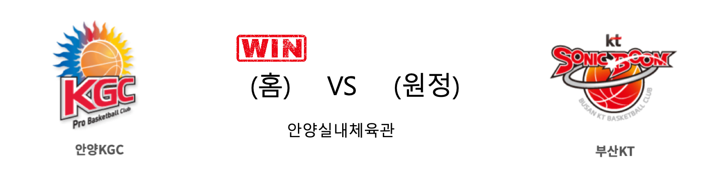

####  안양KGC(홈) VS 부산KT(원정) 

<table class="tg">
  <tr>
    <th class="tg-rr9t">안양KGC</th>
    <th class="tg-rr9t">팀</th>
    <th class="tg-rr9t">부산KT</th>
  </tr>
  <tr>
    <td class="tg-dcpn">1승 2패</td>
    <td class="tg-rr9t">시즌 상대전적</td>
    <td class="tg-dcpn">2승 1패</td>
  </tr>
  <tr>
    <td class="tg-dcpn">84</td>
    <td class="tg-rr9t">점수</td>
    <td class="tg-dcpn">70</td>
  </tr>
  <tr>
    <td class="tg-dcpn">21/40(52%)</td>
    <td class="tg-rr9t">2점(%)</td>
    <td class="tg-dcpn">22/36(61%)</td>
  </tr>
  <tr>
    <td class="tg-dcpn">10/34(29%)</td>
    <td class="tg-rr9t">3점(%)</td>
    <td class="tg-dcpn">4/21(19%)</td>
  </tr>
  <tr>
    <td class="tg-dcpn">12/24(50%)</td>
    <td class="tg-rr9t">자유투(%)</td>
    <td class="tg-dcpn">14/17(82%)</td>
  </tr>
  <tr>
    <td class="tg-dcpn">34</td>
    <td class="tg-rr9t">리바운드</td>
    <td class="tg-dcpn">39</td>
  </tr>
  <tr>
    <td class="tg-dcpn">5</td>
    <td class="tg-rr9t">어시스트</td>
    <td class="tg-dcpn">4</td>
  </tr>
  <tr>
    <td class="tg-dcpn">7</td>
    <td class="tg-rr9t">스틸</td>
    <td class="tg-dcpn">19</td>
  </tr>
  <tr>
    <td class="tg-dcpn">11</td>
    <td class="tg-rr9t">블록</td>
    <td class="tg-dcpn">6</td>
  </tr>
  <tr>
    <td class="tg-dcpn">22</td>
    <td class="tg-rr9t">턴오버</td>
    <td class="tg-dcpn">14</td>
  </tr>
  <tr>
    <td class="tg-dcpn">크리스 맥컬러(26) 박형철(17)</td>
    <td class="tg-rr9t">주요 득점선수</td>
    <td class="tg-dcpn">바이런 멀린스(25)</td>
  </tr>
</table>

#### 경기 관련 주요 기사         

[KGC인삼공사, KT 꺾고 전 구단 상대 승리…KT 7연승 마감](http://www.newsis.com/view/?id=NISX20191217_0000863611&cID=10505&pID=10500)

[KT 상대로 승리한 KGC](http://news1.kr/photos/view/?3969529)

['초비상' KT, 에이스 허훈 허벅지 부상… "2~3주 결장할 듯"](http://www.getnews.co.kr/view.php?ud=2019121719232115667f7a2feaf6_16)

[[사진]KGC수비에 고전하는 쏜튼](http://www.osen.co.kr/article/G1111279236)

        
        

#### 리그 순위

<table class="tg">
  <tr>
    <th class="tg-d14o">순위</th>
    <th class="tg-d14o">팀명</th>
    <th class="tg-d14o">경기수</th>
    <th class="tg-d14o">승</th>
    <th class="tg-d14o">패</th>
    <th class="tg-d14o">승차</th>
    <th class="tg-d14o">승률</th>
  </tr>
  
<tr>
    <td class="tg-50j8">1</td>
    <td class="tg-50j8">서울SK</td>
    <td class="tg-50j8">22</td>
    <td class="tg-50j8">16</td>
    <td class="tg-50j8">6</td>
    <td class="tg-50j8">0</td>
    <td class="tg-50j8">0.727</td>
</tr>

<tr>
    <td class="tg-50j8">2</td>
    <td class="tg-50j8">안양KGC</td>
    <td class="tg-50j8">23</td>
    <td class="tg-50j8">14</td>
    <td class="tg-50j8">9</td>
    <td class="tg-50j8">2</td>
    <td class="tg-50j8">0.609</td>
</tr>

<tr>
    <td class="tg-50j8">3</td>
    <td class="tg-50j8">전주KCC</td>
    <td class="tg-50j8">23</td>
    <td class="tg-50j8">13</td>
    <td class="tg-50j8">10</td>
    <td class="tg-50j8">3</td>
    <td class="tg-50j8">0.565</td>
</tr>

<tr>
    <td class="tg-50j8">3</td>
    <td class="tg-50j8">부산KT</td>
    <td class="tg-50j8">23</td>
    <td class="tg-50j8">13</td>
    <td class="tg-50j8">10</td>
    <td class="tg-50j8">3</td>
    <td class="tg-50j8">0.565</td>
</tr>

<tr>
    <td class="tg-50j8">5</td>
    <td class="tg-50j8">원주DB</td>
    <td class="tg-50j8">22</td>
    <td class="tg-50j8">12</td>
    <td class="tg-50j8">10</td>
    <td class="tg-50j8">4</td>
    <td class="tg-50j8">0.545</td>
</tr>

<tr>
    <td class="tg-50j8">5</td>
    <td class="tg-50j8">인천전자랜드</td>
    <td class="tg-50j8">22</td>
    <td class="tg-50j8">12</td>
    <td class="tg-50j8">10</td>
    <td class="tg-50j8">4</td>
    <td class="tg-50j8">0.545</td>
</tr>

<tr>
    <td class="tg-50j8">7</td>
    <td class="tg-50j8">서울삼성</td>
    <td class="tg-50j8">23</td>
    <td class="tg-50j8">9</td>
    <td class="tg-50j8">14</td>
    <td class="tg-50j8">7</td>
    <td class="tg-50j8">0.391</td>
</tr>

<tr>
    <td class="tg-50j8">8</td>
    <td class="tg-50j8">창원LG</td>
    <td class="tg-50j8">22</td>
    <td class="tg-50j8">8</td>
    <td class="tg-50j8">14</td>
    <td class="tg-50j8">8</td>
    <td class="tg-50j8">0.364</td>
</tr>

<tr>
    <td class="tg-50j8">8</td>
    <td class="tg-50j8">울산현대모비스</td>
    <td class="tg-50j8">22</td>
    <td class="tg-50j8">8</td>
    <td class="tg-50j8">14</td>
    <td class="tg-50j8">8</td>
    <td class="tg-50j8">0.364</td>
</tr>

<tr>
    <td class="tg-50j8">10</td>
    <td class="tg-50j8">고양오리온</td>
    <td class="tg-50j8">22</td>
    <td class="tg-50j8">7</td>
    <td class="tg-50j8">15</td>
    <td class="tg-50j8">9</td>
    <td class="tg-50j8">0.318</td>
</tr>
</table> 

        
        
#kbl #국내농구 #농구분석 #토토 #스포츠토토 #경기예측 #농구결과 #20191217 #안양KGC #부산KT #안양KGC부산KT 