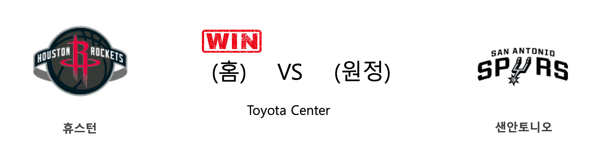
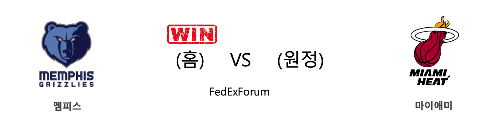
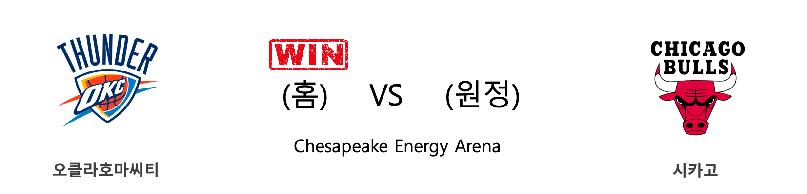

####  휴스턴(홈) VS 샌안토니오(원정) 

<table class="tg">
  <tr>
    <th class="tg-rr9t">HOU</th>
    <th class="tg-rr9t">팀</th>
    <th class="tg-rr9t">SAS</th>
  </tr>
  <tr>
    <td class="tg-dcpn">1승 1패</td>
    <td class="tg-rr9t">시즌 상대전적</td>
    <td class="tg-dcpn">1승 1패</td>
  </tr>
  <tr>
    <td class="tg-dcpn">109</td>
    <td class="tg-rr9t">점수</td>
    <td class="tg-dcpn">107</td>
  </tr>
  <tr>
    <td class="tg-dcpn">29/55(53%)</td>
    <td class="tg-rr9t">2점(%)</td>
    <td class="tg-dcpn">27/59(46%)</td>
  </tr>
  <tr>
    <td class="tg-dcpn">11/43(26%)</td>
    <td class="tg-rr9t">3점(%)</td>
    <td class="tg-dcpn">12/33(36%)</td>
  </tr>
  <tr>
    <td class="tg-dcpn">18/27(67%)</td>
    <td class="tg-rr9t">자유투(%)</td>
    <td class="tg-dcpn">17/20(85%)</td>
  </tr>
  <tr>
    <td class="tg-dcpn">58</td>
    <td class="tg-rr9t">리바운드</td>
    <td class="tg-dcpn">54</td>
  </tr>
  <tr>
    <td class="tg-dcpn">20</td>
    <td class="tg-rr9t">어시스트</td>
    <td class="tg-dcpn">23</td>
  </tr>
  <tr>
    <td class="tg-dcpn">9</td>
    <td class="tg-rr9t">스틸</td>
    <td class="tg-dcpn">5</td>
  </tr>
  <tr>
    <td class="tg-dcpn">6</td>
    <td class="tg-rr9t">블록</td>
    <td class="tg-dcpn">4</td>
  </tr>
  <tr>
    <td class="tg-dcpn">12</td>
    <td class="tg-rr9t">턴오버</td>
    <td class="tg-dcpn">18</td>
  </tr>
  <tr>
    <td class="tg-dcpn">ClintCapelaC(15) BenMcLemore(17) JamesHardenG(28) RussellWestbr(31)</td>
    <td class="tg-rr9t">주요 득점선수</td>
    <td class="tg-dcpn">BrynForbesG(18) LaMarcusAldri(19) DerrickWhite(16) DejounteMurra(16)</td>
  </tr>
</table>

#### 경기 관련 주요 기사         

[[오늘의 NBA] (12/4) 샌안토니오, 괄육취골 승리를 거두다](http://sports.news.naver.com/basketball/news/read.nhn?oid=486&aid=0000001156)

[[오늘의 NBA] (12/8) 뉴욕, NBA의 방랑자](http://sports.news.naver.com/basketball/news/read.nhn?oid=486&aid=0000001160)

[[오늘의 NBA] (12/15) 밤 아데바요, 연장전의 지배자](http://sports.news.naver.com/basketball/news/read.nhn?oid=486&aid=0000001167)

[[오늘의 NBA] (12/13) 조엘 엠비드, 천적 없는 보스턴 평원의 지배자](http://sports.news.naver.com/basketball/news/read.nhn?oid=486&aid=0000001165)

[[오늘의 NBA] (12/10) 데릭 로즈, 모터 시티의 해결사](http://sports.news.naver.com/basketball/news/read.nhn?oid=486&aid=0000001162)

        
        

####  피닉스(홈) VS 포틀랜드(원정) 

<table class="tg">
  <tr>
    <th class="tg-rr9t">PHX</th>
    <th class="tg-rr9t">팀</th>
    <th class="tg-rr9t">POR</th>
  </tr>
  <tr>
    <td class="tg-dcpn">0승 1패</td>
    <td class="tg-rr9t">시즌 상대전적</td>
    <td class="tg-dcpn">1승 0패</td>
  </tr>
  <tr>
    <td class="tg-dcpn">110</td>
    <td class="tg-rr9t">점수</td>
    <td class="tg-dcpn">111</td>
  </tr>
  <tr>
    <td class="tg-dcpn">29/56(52%)</td>
    <td class="tg-rr9t">2점(%)</td>
    <td class="tg-dcpn">26/50(52%)</td>
  </tr>
  <tr>
    <td class="tg-dcpn">12/34(35%)</td>
    <td class="tg-rr9t">3점(%)</td>
    <td class="tg-dcpn">14/34(41%)</td>
  </tr>
  <tr>
    <td class="tg-dcpn">16/19(84%)</td>
    <td class="tg-rr9t">자유투(%)</td>
    <td class="tg-dcpn">17/20(85%)</td>
  </tr>
  <tr>
    <td class="tg-dcpn">44</td>
    <td class="tg-rr9t">리바운드</td>
    <td class="tg-dcpn">41</td>
  </tr>
  <tr>
    <td class="tg-dcpn">31</td>
    <td class="tg-rr9t">어시스트</td>
    <td class="tg-dcpn">21</td>
  </tr>
  <tr>
    <td class="tg-dcpn">11</td>
    <td class="tg-rr9t">스틸</td>
    <td class="tg-dcpn">9</td>
  </tr>
  <tr>
    <td class="tg-dcpn">5</td>
    <td class="tg-rr9t">블록</td>
    <td class="tg-dcpn">9</td>
  </tr>
  <tr>
    <td class="tg-dcpn">20</td>
    <td class="tg-rr9t">턴오버</td>
    <td class="tg-dcpn">20</td>
  </tr>
  <tr>
    <td class="tg-dcpn">FrankKaminsky(17) KellyOubreJr.(24) DarioSaricF(17)</td>
    <td class="tg-rr9t">주요 득점선수</td>
    <td class="tg-dcpn">CarmeloAnthon(23) DamianLillard(27) CJMcCollumG(30)</td>
  </tr>
</table>

#### 경기 관련 주요 기사         

[[오늘의 NBA] (11/11) 토론토, 디펜딩 챔피언의 저력](http://sports.news.naver.com/basketball/news/read.nhn?oid=486&aid=0000001134)

[[오늘의 NBA] (12/12) 제임스 하든 선생님의 심폐소생술](http://sports.news.naver.com/basketball/news/read.nhn?oid=486&aid=0000001164)

[[오늘의 NBA] (12/16) 스펜서 딘위디, 브루클린 상승세를 이끈다!](http://sports.news.naver.com/basketball/news/read.nhn?oid=486&aid=0000001168)

[[오늘의 NBA] (12/8) 뉴욕, NBA의 방랑자](http://sports.news.naver.com/basketball/news/read.nhn?oid=486&aid=0000001160)

[[오늘의 NBA] (12/10) 데릭 로즈, 모터 시티의 해결사](http://sports.news.naver.com/basketball/news/read.nhn?oid=486&aid=0000001162)

        
        

####  디트로이트(홈) VS 워싱턴(원정) 

<table class="tg">
  <tr>
    <th class="tg-rr9t">DET</th>
    <th class="tg-rr9t">팀</th>
    <th class="tg-rr9t">WAS</th>
  </tr>
  <tr>
    <td class="tg-dcpn">0승 2패</td>
    <td class="tg-rr9t">시즌 상대전적</td>
    <td class="tg-dcpn">2승 0패</td>
  </tr>
  <tr>
    <td class="tg-dcpn">119</td>
    <td class="tg-rr9t">점수</td>
    <td class="tg-dcpn">133</td>
  </tr>
  <tr>
    <td class="tg-dcpn">28/47(60%)</td>
    <td class="tg-rr9t">2점(%)</td>
    <td class="tg-dcpn">31/55(56%)</td>
  </tr>
  <tr>
    <td class="tg-dcpn">13/39(33%)</td>
    <td class="tg-rr9t">3점(%)</td>
    <td class="tg-dcpn">18/33(55%)</td>
  </tr>
  <tr>
    <td class="tg-dcpn">24/34(71%)</td>
    <td class="tg-rr9t">자유투(%)</td>
    <td class="tg-dcpn">17/21(81%)</td>
  </tr>
  <tr>
    <td class="tg-dcpn">36</td>
    <td class="tg-rr9t">리바운드</td>
    <td class="tg-dcpn">36</td>
  </tr>
  <tr>
    <td class="tg-dcpn">29</td>
    <td class="tg-rr9t">어시스트</td>
    <td class="tg-dcpn">31</td>
  </tr>
  <tr>
    <td class="tg-dcpn">6</td>
    <td class="tg-rr9t">스틸</td>
    <td class="tg-dcpn">6</td>
  </tr>
  <tr>
    <td class="tg-dcpn">4</td>
    <td class="tg-rr9t">블록</td>
    <td class="tg-dcpn">5</td>
  </tr>
  <tr>
    <td class="tg-dcpn">14</td>
    <td class="tg-rr9t">턴오버</td>
    <td class="tg-dcpn">15</td>
  </tr>
  <tr>
    <td class="tg-dcpn">BruceBrownG(20) MarkieffMorri(22) DerrickRose(22)</td>
    <td class="tg-rr9t">주요 득점선수</td>
    <td class="tg-dcpn">DavisBertans(17) BradleyBealG(35) IsaiahThomasG(23)</td>
  </tr>
</table>

#### 경기 관련 주요 기사         

[[오늘의 NBA] (11/30) 인디애나, 동부컨퍼런스의 복병](http://sports.news.naver.com/basketball/news/read.nhn?oid=486&aid=0000001152)

[[오늘의 NBA] (12/2) 토론토, 두 마리 토끼를 노린다!](http://sports.news.naver.com/basketball/news/read.nhn?oid=486&aid=0000001154)

[[오늘의 NBA] (12/5) 밀워키, 시스템 농구 정점에 도달하다](http://sports.news.naver.com/basketball/news/read.nhn?oid=486&aid=0000001157)

[[오늘의 NBA] (12/15) 밤 아데바요, 연장전의 지배자](http://sports.news.naver.com/basketball/news/read.nhn?oid=486&aid=0000001167)

[[오늘의 NBA] (11/16) 멤피스, Grit&Grind 시대와의 성공적인 단절](http://sports.news.naver.com/basketball/news/read.nhn?oid=486&aid=0000001139)

        
        

####  밀워키(홈) VS 댈러스(원정) 

<table class="tg">
  <tr>
    <th class="tg-rr9t">MIL</th>
    <th class="tg-rr9t">팀</th>
    <th class="tg-rr9t">DAL</th>
  </tr>
  <tr>
    <td class="tg-dcpn">0승 1패</td>
    <td class="tg-rr9t">시즌 상대전적</td>
    <td class="tg-dcpn">1승 0패</td>
  </tr>
  <tr>
    <td class="tg-dcpn">116</td>
    <td class="tg-rr9t">점수</td>
    <td class="tg-dcpn">120</td>
  </tr>
  <tr>
    <td class="tg-dcpn">33/64(52%)</td>
    <td class="tg-rr9t">2점(%)</td>
    <td class="tg-dcpn">25/47(53%)</td>
  </tr>
  <tr>
    <td class="tg-dcpn">11/41(27%)</td>
    <td class="tg-rr9t">3점(%)</td>
    <td class="tg-dcpn">16/41(39%)</td>
  </tr>
  <tr>
    <td class="tg-dcpn">17/24(71%)</td>
    <td class="tg-rr9t">자유투(%)</td>
    <td class="tg-dcpn">22/27(81%)</td>
  </tr>
  <tr>
    <td class="tg-dcpn">52</td>
    <td class="tg-rr9t">리바운드</td>
    <td class="tg-dcpn">52</td>
  </tr>
  <tr>
    <td class="tg-dcpn">29</td>
    <td class="tg-rr9t">어시스트</td>
    <td class="tg-dcpn">27</td>
  </tr>
  <tr>
    <td class="tg-dcpn">8</td>
    <td class="tg-rr9t">스틸</td>
    <td class="tg-dcpn">5</td>
  </tr>
  <tr>
    <td class="tg-dcpn">4</td>
    <td class="tg-rr9t">블록</td>
    <td class="tg-dcpn">6</td>
  </tr>
  <tr>
    <td class="tg-dcpn">8</td>
    <td class="tg-rr9t">턴오버</td>
    <td class="tg-dcpn">14</td>
  </tr>
  <tr>
    <td class="tg-dcpn">GiannisAnteto(48) KyleKorver(17)</td>
    <td class="tg-rr9t">주요 득점선수</td>
    <td class="tg-dcpn">SethCurry(26) DorianFinney-(15) KristapsPorzi(26)</td>
  </tr>
</table>

#### 경기 관련 주요 기사         

[[오늘의 NBA] (12/15) 밤 아데바요, 연장전의 지배자](http://sports.news.naver.com/basketball/news/read.nhn?oid=486&aid=0000001167)

[[오늘의 NBA] (12/13) 조엘 엠비드, 천적 없는 보스턴 평원의 지배자](http://sports.news.naver.com/basketball/news/read.nhn?oid=486&aid=0000001165)

[[오늘의 NBA] (12/12) 제임스 하든 선생님의 심폐소생술](http://sports.news.naver.com/basketball/news/read.nhn?oid=486&aid=0000001164)

[[오늘의 NBA] (12/14) 레이커스, 마이애미 홈 코트를 점령하다](http://sports.news.naver.com/basketball/news/read.nhn?oid=486&aid=0000001166)

[[오늘의 NBA] (12/8) 뉴욕, NBA의 방랑자](http://sports.news.naver.com/basketball/news/read.nhn?oid=486&aid=0000001160)

        
        

####  멤피스(홈) VS 마이애미(원정) 

<table class="tg">
  <tr>
    <th class="tg-rr9t">MEM</th>
    <th class="tg-rr9t">팀</th>
    <th class="tg-rr9t">MIA</th>
  </tr>
  <tr>
    <td class="tg-dcpn">1승 1패</td>
    <td class="tg-rr9t">시즌 상대전적</td>
    <td class="tg-dcpn">1승 1패</td>
  </tr>
  <tr>
    <td class="tg-dcpn">118</td>
    <td class="tg-rr9t">점수</td>
    <td class="tg-dcpn">111</td>
  </tr>
  <tr>
    <td class="tg-dcpn">29/50(58%)</td>
    <td class="tg-rr9t">2점(%)</td>
    <td class="tg-dcpn">26/57(46%)</td>
  </tr>
  <tr>
    <td class="tg-dcpn">13/36(36%)</td>
    <td class="tg-rr9t">3점(%)</td>
    <td class="tg-dcpn">11/24(46%)</td>
  </tr>
  <tr>
    <td class="tg-dcpn">21/30(70%)</td>
    <td class="tg-rr9t">자유투(%)</td>
    <td class="tg-dcpn">26/31(84%)</td>
  </tr>
  <tr>
    <td class="tg-dcpn">45</td>
    <td class="tg-rr9t">리바운드</td>
    <td class="tg-dcpn">35</td>
  </tr>
  <tr>
    <td class="tg-dcpn">28</td>
    <td class="tg-rr9t">어시스트</td>
    <td class="tg-dcpn">22</td>
  </tr>
  <tr>
    <td class="tg-dcpn">4</td>
    <td class="tg-rr9t">스틸</td>
    <td class="tg-dcpn">9</td>
  </tr>
  <tr>
    <td class="tg-dcpn">6</td>
    <td class="tg-rr9t">블록</td>
    <td class="tg-dcpn">7</td>
  </tr>
  <tr>
    <td class="tg-dcpn">15</td>
    <td class="tg-rr9t">턴오버</td>
    <td class="tg-dcpn">14</td>
  </tr>
  <tr>
    <td class="tg-dcpn">De'AnthonyMel(16) JaMorantG(20) JarenJacksonJ(15) JonasValanciu(21)</td>
    <td class="tg-rr9t">주요 득점선수</td>
    <td class="tg-dcpn">JimmyButlerF(25) KendrickNunnG(18) DerrickJonesJ(15) TylerHerro(22)</td>
  </tr>
</table>

#### 경기 관련 주요 기사         

[[오늘의 NBA] (12/12) 제임스 하든 선생님의 심폐소생술](http://sports.news.naver.com/basketball/news/read.nhn?oid=486&aid=0000001164)

[[오늘의 NBA] (12/5) 밀워키, 시스템 농구 정점에 도달하다](http://sports.news.naver.com/basketball/news/read.nhn?oid=486&aid=0000001157)

[[오늘의 NBA] (12/9) 앤써니 데이비스, 구단 역사에 이름을 남기다](http://sports.news.naver.com/basketball/news/read.nhn?oid=486&aid=0000001161)

[[오늘의 NBA] (12/15) 밤 아데바요, 연장전의 지배자](http://sports.news.naver.com/basketball/news/read.nhn?oid=486&aid=0000001167)

[[오늘의 NBA] (12/10) 데릭 로즈, 모터 시티의 해결사](http://sports.news.naver.com/basketball/news/read.nhn?oid=486&aid=0000001162)

        
        

####  오클라호마씨티(홈) VS 시카고(원정) 

<table class="tg">
  <tr>
    <th class="tg-rr9t">OKC</th>
    <th class="tg-rr9t">팀</th>
    <th class="tg-rr9t">CHI</th>
  </tr>
  <tr>
    <td class="tg-dcpn">1승 0패</td>
    <td class="tg-rr9t">시즌 상대전적</td>
    <td class="tg-dcpn">0승 1패</td>
  </tr>
  <tr>
    <td class="tg-dcpn">109</td>
    <td class="tg-rr9t">점수</td>
    <td class="tg-dcpn">106</td>
  </tr>
  <tr>
    <td class="tg-dcpn">19/35(54%)</td>
    <td class="tg-rr9t">2점(%)</td>
    <td class="tg-dcpn">34/56(61%)</td>
  </tr>
  <tr>
    <td class="tg-dcpn">16/34(47%)</td>
    <td class="tg-rr9t">3점(%)</td>
    <td class="tg-dcpn">9/31(29%)</td>
  </tr>
  <tr>
    <td class="tg-dcpn">23/28(82%)</td>
    <td class="tg-rr9t">자유투(%)</td>
    <td class="tg-dcpn">11/13(85%)</td>
  </tr>
  <tr>
    <td class="tg-dcpn">42</td>
    <td class="tg-rr9t">리바운드</td>
    <td class="tg-dcpn">31</td>
  </tr>
  <tr>
    <td class="tg-dcpn">21</td>
    <td class="tg-rr9t">어시스트</td>
    <td class="tg-dcpn">27</td>
  </tr>
  <tr>
    <td class="tg-dcpn">8</td>
    <td class="tg-rr9t">스틸</td>
    <td class="tg-dcpn">17</td>
  </tr>
  <tr>
    <td class="tg-dcpn">6</td>
    <td class="tg-rr9t">블록</td>
    <td class="tg-dcpn">6</td>
  </tr>
  <tr>
    <td class="tg-dcpn">26</td>
    <td class="tg-rr9t">턴오버</td>
    <td class="tg-dcpn">13</td>
  </tr>
  <tr>
    <td class="tg-dcpn">DaniloGallina(22) ChrisPaulG(30) DennisSchrode(18)</td>
    <td class="tg-rr9t">주요 득점선수</td>
    <td class="tg-dcpn">ZachLaVineG(39)</td>
  </tr>
</table>

#### 경기 관련 주요 기사         

[[오늘의 NBA] (12/11) 마이애미의 커리어 나이트 파티](http://sports.news.naver.com/basketball/news/read.nhn?oid=486&aid=0000001163)

[[오늘의 NBA] (12/9) 앤써니 데이비스, 구단 역사에 이름을 남기다](http://sports.news.naver.com/basketball/news/read.nhn?oid=486&aid=0000001161)

[[오늘의 NBA] (12/15) 밤 아데바요, 연장전의 지배자](http://sports.news.naver.com/basketball/news/read.nhn?oid=486&aid=0000001167)

[[오늘의 NBA] (12/10) 데릭 로즈, 모터 시티의 해결사](http://sports.news.naver.com/basketball/news/read.nhn?oid=486&aid=0000001162)

[[오늘의 NBA] (12/12) 제임스 하든 선생님의 심폐소생술](http://sports.news.naver.com/basketball/news/read.nhn?oid=486&aid=0000001164)

        
        

####  토론토(홈) VS 클리블랜드(원정) 

<table class="tg">
  <tr>
    <th class="tg-rr9t">TOR</th>
    <th class="tg-rr9t">팀</th>
    <th class="tg-rr9t">CLE</th>
  </tr>
  <tr>
    <td class="tg-dcpn">1승 0패</td>
    <td class="tg-rr9t">시즌 상대전적</td>
    <td class="tg-dcpn">0승 1패</td>
  </tr>
  <tr>
    <td class="tg-dcpn">133</td>
    <td class="tg-rr9t">점수</td>
    <td class="tg-dcpn">113</td>
  </tr>
  <tr>
    <td class="tg-dcpn">36/57(63%)</td>
    <td class="tg-rr9t">2점(%)</td>
    <td class="tg-dcpn">32/55(58%)</td>
  </tr>
  <tr>
    <td class="tg-dcpn">16/32(50%)</td>
    <td class="tg-rr9t">3점(%)</td>
    <td class="tg-dcpn">12/35(34%)</td>
  </tr>
  <tr>
    <td class="tg-dcpn">13/17(76%)</td>
    <td class="tg-rr9t">자유투(%)</td>
    <td class="tg-dcpn">13/17(76%)</td>
  </tr>
  <tr>
    <td class="tg-dcpn">41</td>
    <td class="tg-rr9t">리바운드</td>
    <td class="tg-dcpn">39</td>
  </tr>
  <tr>
    <td class="tg-dcpn">31</td>
    <td class="tg-rr9t">어시스트</td>
    <td class="tg-dcpn">30</td>
  </tr>
  <tr>
    <td class="tg-dcpn">7</td>
    <td class="tg-rr9t">스틸</td>
    <td class="tg-dcpn">6</td>
  </tr>
  <tr>
    <td class="tg-dcpn">2</td>
    <td class="tg-rr9t">블록</td>
    <td class="tg-dcpn">1</td>
  </tr>
  <tr>
    <td class="tg-dcpn">7</td>
    <td class="tg-rr9t">턴오버</td>
    <td class="tg-dcpn">10</td>
  </tr>
  <tr>
    <td class="tg-dcpn">KyleLowryG(20) PascalSiakamF(33) NormanPowellG(26)</td>
    <td class="tg-rr9t">주요 득점선수</td>
    <td class="tg-dcpn">CollinSextonG(25) TristanThomps(18) DariusGarland(20)</td>
  </tr>
</table>

#### 경기 관련 주요 기사         

[[오늘의 NBA] (12/16) 스펜서 딘위디, 브루클린 상승세를 이끈다!](http://sports.news.naver.com/basketball/news/read.nhn?oid=486&aid=0000001168)

[[오늘의 NBA] (12/12) 제임스 하든 선생님의 심폐소생술](http://sports.news.naver.com/basketball/news/read.nhn?oid=486&aid=0000001164)

[[오늘의 NBA] (12/15) 밤 아데바요, 연장전의 지배자](http://sports.news.naver.com/basketball/news/read.nhn?oid=486&aid=0000001167)

[[오늘의 NBA] (12/4) 샌안토니오, 괄육취골 승리를 거두다](http://sports.news.naver.com/basketball/news/read.nhn?oid=486&aid=0000001156)

[[오늘의 NBA] (12/8) 뉴욕, NBA의 방랑자](http://sports.news.naver.com/basketball/news/read.nhn?oid=486&aid=0000001160)

        
        

#### 리그 (Eastern) 순위
    

<table class="tg">
  <tr>
    <th class="tg-d14o">순위</th>
    <th class="tg-d14o">팀명</th>
    <th class="tg-d14o">경기수</th>
    <th class="tg-d14o">승</th>
    <th class="tg-d14o">패</th>
    <th class="tg-d14o">승차</th>
    <th class="tg-d14o">승률</th>
  </tr>
  
<tr>
    <td class="tg-50j8">1</td>
    <td class="tg-50j8">MIL</td>
    <td class="tg-50j8">28</td>
    <td class="tg-50j8">24</td>
    <td class="tg-50j8">4</td>
    <td class="tg-50j8">0</td>
    <td class="tg-50j8">0.857</td>
</tr>

<tr>
    <td class="tg-50j8">2</td>
    <td class="tg-50j8">PHI</td>
    <td class="tg-50j8">27</td>
    <td class="tg-50j8">19</td>
    <td class="tg-50j8">8</td>
    <td class="tg-50j8">5</td>
    <td class="tg-50j8">0.704</td>
</tr>

<tr>
    <td class="tg-50j8">2</td>
    <td class="tg-50j8">MIA</td>
    <td class="tg-50j8">27</td>
    <td class="tg-50j8">19</td>
    <td class="tg-50j8">8</td>
    <td class="tg-50j8">5</td>
    <td class="tg-50j8">0.704</td>
</tr>

<tr>
    <td class="tg-50j8">4</td>
    <td class="tg-50j8">TOR</td>
    <td class="tg-50j8">26</td>
    <td class="tg-50j8">18</td>
    <td class="tg-50j8">8</td>
    <td class="tg-50j8">6</td>
    <td class="tg-50j8">0.692</td>
</tr>

<tr>
    <td class="tg-50j8">5</td>
    <td class="tg-50j8">IND</td>
    <td class="tg-50j8">27</td>
    <td class="tg-50j8">18</td>
    <td class="tg-50j8">9</td>
    <td class="tg-50j8">6</td>
    <td class="tg-50j8">0.667</td>
</tr>

<tr>
    <td class="tg-50j8">6</td>
    <td class="tg-50j8">BOS</td>
    <td class="tg-50j8">23</td>
    <td class="tg-50j8">17</td>
    <td class="tg-50j8">6</td>
    <td class="tg-50j8">7</td>
    <td class="tg-50j8">0.739</td>
</tr>

<tr>
    <td class="tg-50j8">7</td>
    <td class="tg-50j8">BKN</td>
    <td class="tg-50j8">26</td>
    <td class="tg-50j8">14</td>
    <td class="tg-50j8">12</td>
    <td class="tg-50j8">10</td>
    <td class="tg-50j8">0.538</td>
</tr>

<tr>
    <td class="tg-50j8">8</td>
    <td class="tg-50j8">ORL</td>
    <td class="tg-50j8">26</td>
    <td class="tg-50j8">12</td>
    <td class="tg-50j8">14</td>
    <td class="tg-50j8">12</td>
    <td class="tg-50j8">0.462</td>
</tr>

<tr>
    <td class="tg-50j8">9</td>
    <td class="tg-50j8">CHA</td>
    <td class="tg-50j8">29</td>
    <td class="tg-50j8">12</td>
    <td class="tg-50j8">17</td>
    <td class="tg-50j8">12</td>
    <td class="tg-50j8">0.414</td>
</tr>

<tr>
    <td class="tg-50j8">10</td>
    <td class="tg-50j8">DET</td>
    <td class="tg-50j8">26</td>
    <td class="tg-50j8">11</td>
    <td class="tg-50j8">15</td>
    <td class="tg-50j8">13</td>
    <td class="tg-50j8">0.423</td>
</tr>

<tr>
    <td class="tg-50j8">11</td>
    <td class="tg-50j8">CHI</td>
    <td class="tg-50j8">29</td>
    <td class="tg-50j8">10</td>
    <td class="tg-50j8">19</td>
    <td class="tg-50j8">14</td>
    <td class="tg-50j8">0.345</td>
</tr>

<tr>
    <td class="tg-50j8">12</td>
    <td class="tg-50j8">WAS</td>
    <td class="tg-50j8">25</td>
    <td class="tg-50j8">8</td>
    <td class="tg-50j8">17</td>
    <td class="tg-50j8">16</td>
    <td class="tg-50j8">0.32</td>
</tr>

<tr>
    <td class="tg-50j8">13</td>
    <td class="tg-50j8">NYK</td>
    <td class="tg-50j8">27</td>
    <td class="tg-50j8">6</td>
    <td class="tg-50j8">21</td>
    <td class="tg-50j8">18</td>
    <td class="tg-50j8">0.222</td>
</tr>

<tr>
    <td class="tg-50j8">13</td>
    <td class="tg-50j8">ATL</td>
    <td class="tg-50j8">27</td>
    <td class="tg-50j8">6</td>
    <td class="tg-50j8">21</td>
    <td class="tg-50j8">18</td>
    <td class="tg-50j8">0.222</td>
</tr>

<tr>
    <td class="tg-50j8">15</td>
    <td class="tg-50j8">CLE</td>
    <td class="tg-50j8">26</td>
    <td class="tg-50j8">5</td>
    <td class="tg-50j8">21</td>
    <td class="tg-50j8">19</td>
    <td class="tg-50j8">0.192</td>
</tr>
</table> 
#### 리그 (Western) 순위
    

<table class="tg">
  <tr>
    <th class="tg-d14o">순위</th>
    <th class="tg-d14o">팀명</th>
    <th class="tg-d14o">경기수</th>
    <th class="tg-d14o">승</th>
    <th class="tg-d14o">패</th>
    <th class="tg-d14o">승차</th>
    <th class="tg-d14o">승률</th>
  </tr>
  
<tr>
    <td class="tg-50j8">1</td>
    <td class="tg-50j8">LAL</td>
    <td class="tg-50j8">27</td>
    <td class="tg-50j8">24</td>
    <td class="tg-50j8">3</td>
    <td class="tg-50j8">0</td>
    <td class="tg-50j8">0.889</td>
</tr>

<tr>
    <td class="tg-50j8">2</td>
    <td class="tg-50j8">LAC</td>
    <td class="tg-50j8">28</td>
    <td class="tg-50j8">20</td>
    <td class="tg-50j8">8</td>
    <td class="tg-50j8">4</td>
    <td class="tg-50j8">0.714</td>
</tr>

<tr>
    <td class="tg-50j8">3</td>
    <td class="tg-50j8">HOU</td>
    <td class="tg-50j8">27</td>
    <td class="tg-50j8">18</td>
    <td class="tg-50j8">9</td>
    <td class="tg-50j8">6</td>
    <td class="tg-50j8">0.667</td>
</tr>

<tr>
    <td class="tg-50j8">4</td>
    <td class="tg-50j8">DAL</td>
    <td class="tg-50j8">25</td>
    <td class="tg-50j8">17</td>
    <td class="tg-50j8">8</td>
    <td class="tg-50j8">7</td>
    <td class="tg-50j8">0.68</td>
</tr>

<tr>
    <td class="tg-50j8">5</td>
    <td class="tg-50j8">DEN</td>
    <td class="tg-50j8">24</td>
    <td class="tg-50j8">16</td>
    <td class="tg-50j8">8</td>
    <td class="tg-50j8">8</td>
    <td class="tg-50j8">0.667</td>
</tr>

<tr>
    <td class="tg-50j8">6</td>
    <td class="tg-50j8">UTA</td>
    <td class="tg-50j8">26</td>
    <td class="tg-50j8">15</td>
    <td class="tg-50j8">11</td>
    <td class="tg-50j8">9</td>
    <td class="tg-50j8">0.577</td>
</tr>

<tr>
    <td class="tg-50j8">7</td>
    <td class="tg-50j8">SAC</td>
    <td class="tg-50j8">26</td>
    <td class="tg-50j8">12</td>
    <td class="tg-50j8">14</td>
    <td class="tg-50j8">12</td>
    <td class="tg-50j8">0.462</td>
</tr>

<tr>
    <td class="tg-50j8">7</td>
    <td class="tg-50j8">OKC</td>
    <td class="tg-50j8">26</td>
    <td class="tg-50j8">12</td>
    <td class="tg-50j8">14</td>
    <td class="tg-50j8">12</td>
    <td class="tg-50j8">0.462</td>
</tr>

<tr>
    <td class="tg-50j8">9</td>
    <td class="tg-50j8">POR</td>
    <td class="tg-50j8">26</td>
    <td class="tg-50j8">11</td>
    <td class="tg-50j8">15</td>
    <td class="tg-50j8">13</td>
    <td class="tg-50j8">0.423</td>
</tr>

<tr>
    <td class="tg-50j8">9</td>
    <td class="tg-50j8">PHX</td>
    <td class="tg-50j8">26</td>
    <td class="tg-50j8">11</td>
    <td class="tg-50j8">15</td>
    <td class="tg-50j8">13</td>
    <td class="tg-50j8">0.423</td>
</tr>

<tr>
    <td class="tg-50j8">11</td>
    <td class="tg-50j8">MIN</td>
    <td class="tg-50j8">25</td>
    <td class="tg-50j8">10</td>
    <td class="tg-50j8">15</td>
    <td class="tg-50j8">14</td>
    <td class="tg-50j8">0.4</td>
</tr>

<tr>
    <td class="tg-50j8">11</td>
    <td class="tg-50j8">SAS</td>
    <td class="tg-50j8">25</td>
    <td class="tg-50j8">10</td>
    <td class="tg-50j8">15</td>
    <td class="tg-50j8">14</td>
    <td class="tg-50j8">0.4</td>
</tr>

<tr>
    <td class="tg-50j8">13</td>
    <td class="tg-50j8">MEM</td>
    <td class="tg-50j8">27</td>
    <td class="tg-50j8">10</td>
    <td class="tg-50j8">17</td>
    <td class="tg-50j8">14</td>
    <td class="tg-50j8">0.37</td>
</tr>

<tr>
    <td class="tg-50j8">14</td>
    <td class="tg-50j8">NOP</td>
    <td class="tg-50j8">27</td>
    <td class="tg-50j8">6</td>
    <td class="tg-50j8">21</td>
    <td class="tg-50j8">18</td>
    <td class="tg-50j8">0.222</td>
</tr>

<tr>
    <td class="tg-50j8">15</td>
    <td class="tg-50j8">GSW</td>
    <td class="tg-50j8">28</td>
    <td class="tg-50j8">5</td>
    <td class="tg-50j8">23</td>
    <td class="tg-50j8">19</td>
    <td class="tg-50j8">0.179</td>
</tr>
</table> 

        
        
#nba #미국농구 #엔비에이 #농구분석 #토토 #스포츠토토 #경기예측 #농구결과 #20191217 #휴스턴 #샌안토니오 #피닉스 #포틀랜드 #디트로이트 #워싱턴 #밀워키 #댈러스 #멤피스 #마이애미 #오클라호마씨티 #시카고 #토론토 #클리블랜드 #휴스턴샌안토니오 #피닉스포틀랜드 #디트로이트워싱턴 #밀워키댈러스 #멤피스마이애미 #오클라호마씨티시카고 #토론토클리블랜드 