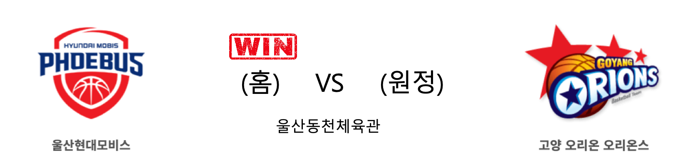

####  울산현대모비스(홈) VS 고양오리온(원정) 

<table class="tg">
  <tr>
    <th class="tg-rr9t">울산현대모비스</th>
    <th class="tg-rr9t">팀</th>
    <th class="tg-rr9t">고양오리온</th>
  </tr>
  <tr>
    <td class="tg-dcpn">2승 1패</td>
    <td class="tg-rr9t">시즌 상대전적</td>
    <td class="tg-dcpn">1승 2패</td>
  </tr>
  <tr>
    <td class="tg-dcpn">91</td>
    <td class="tg-rr9t">점수</td>
    <td class="tg-dcpn">73</td>
  </tr>
  <tr>
    <td class="tg-dcpn">27/48(56%)</td>
    <td class="tg-rr9t">2점(%)</td>
    <td class="tg-dcpn">24/53(45%)</td>
  </tr>
  <tr>
    <td class="tg-dcpn">8/20(40%)</td>
    <td class="tg-rr9t">3점(%)</td>
    <td class="tg-dcpn">4/19(21%)</td>
  </tr>
  <tr>
    <td class="tg-dcpn">13/16(81%)</td>
    <td class="tg-rr9t">자유투(%)</td>
    <td class="tg-dcpn">13/18(72%)</td>
  </tr>
  <tr>
    <td class="tg-dcpn">41</td>
    <td class="tg-rr9t">리바운드</td>
    <td class="tg-dcpn">33</td>
  </tr>
  <tr>
    <td class="tg-dcpn">2</td>
    <td class="tg-rr9t">어시스트</td>
    <td class="tg-dcpn">0</td>
  </tr>
  <tr>
    <td class="tg-dcpn">8</td>
    <td class="tg-rr9t">스틸</td>
    <td class="tg-dcpn">8</td>
  </tr>
  <tr>
    <td class="tg-dcpn">6</td>
    <td class="tg-rr9t">블록</td>
    <td class="tg-dcpn">6</td>
  </tr>
  <tr>
    <td class="tg-dcpn">25</td>
    <td class="tg-rr9t">턴오버</td>
    <td class="tg-dcpn">19</td>
  </tr>
  <tr>
    <td class="tg-dcpn">양동근(17) 에메카 오카포(23) 서명진(16)</td>
    <td class="tg-rr9t">주요 득점선수</td>
    <td class="tg-dcpn">보리스 사보비치(21)</td>
  </tr>
</table>

#### 경기 관련 주요 기사         

['오카포 23점 19리바운드'…현대모비스, 오리온 꺾고 5연패 탈출](http://yna.kr/AKR20191218176300007?did=1195m)

['제2의 양동근 꿈꾼다' 현대모비스, 김건하 연고 선수로 지명](http://www.mydaily.co.kr/new_yk/html/read.php?newsid=201912182018847601&ext=na)

[오리온 이승현 '쉽지 않네'](http://news1.kr/photos/view/?3971494)

[[BK Review] '5명 두 자리 득점' 현대모비스, 오리온 꺾고 연패 탈출](http://www.basketkorea.com/news/articleView.html?idxno=190852)

        
        

#### 리그 순위

<table class="tg">
  <tr>
    <th class="tg-d14o">순위</th>
    <th class="tg-d14o">팀명</th>
    <th class="tg-d14o">경기수</th>
    <th class="tg-d14o">승</th>
    <th class="tg-d14o">패</th>
    <th class="tg-d14o">승차</th>
    <th class="tg-d14o">승률</th>
  </tr>
  
<tr>
    <td class="tg-50j8">1</td>
    <td class="tg-50j8">서울SK</td>
    <td class="tg-50j8">22</td>
    <td class="tg-50j8">16</td>
    <td class="tg-50j8">6</td>
    <td class="tg-50j8">0</td>
    <td class="tg-50j8">0.727</td>
</tr>

<tr>
    <td class="tg-50j8">2</td>
    <td class="tg-50j8">안양KGC</td>
    <td class="tg-50j8">23</td>
    <td class="tg-50j8">14</td>
    <td class="tg-50j8">9</td>
    <td class="tg-50j8">2</td>
    <td class="tg-50j8">0.609</td>
</tr>

<tr>
    <td class="tg-50j8">3</td>
    <td class="tg-50j8">부산KT</td>
    <td class="tg-50j8">23</td>
    <td class="tg-50j8">13</td>
    <td class="tg-50j8">10</td>
    <td class="tg-50j8">3</td>
    <td class="tg-50j8">0.565</td>
</tr>

<tr>
    <td class="tg-50j8">3</td>
    <td class="tg-50j8">전주KCC</td>
    <td class="tg-50j8">23</td>
    <td class="tg-50j8">13</td>
    <td class="tg-50j8">10</td>
    <td class="tg-50j8">3</td>
    <td class="tg-50j8">0.565</td>
</tr>

<tr>
    <td class="tg-50j8">5</td>
    <td class="tg-50j8">인천전자랜드</td>
    <td class="tg-50j8">22</td>
    <td class="tg-50j8">12</td>
    <td class="tg-50j8">10</td>
    <td class="tg-50j8">4</td>
    <td class="tg-50j8">0.545</td>
</tr>

<tr>
    <td class="tg-50j8">5</td>
    <td class="tg-50j8">원주DB</td>
    <td class="tg-50j8">22</td>
    <td class="tg-50j8">12</td>
    <td class="tg-50j8">10</td>
    <td class="tg-50j8">4</td>
    <td class="tg-50j8">0.545</td>
</tr>

<tr>
    <td class="tg-50j8">7</td>
    <td class="tg-50j8">울산현대모비스</td>
    <td class="tg-50j8">23</td>
    <td class="tg-50j8">9</td>
    <td class="tg-50j8">14</td>
    <td class="tg-50j8">7</td>
    <td class="tg-50j8">0.391</td>
</tr>

<tr>
    <td class="tg-50j8">7</td>
    <td class="tg-50j8">서울삼성</td>
    <td class="tg-50j8">23</td>
    <td class="tg-50j8">9</td>
    <td class="tg-50j8">14</td>
    <td class="tg-50j8">7</td>
    <td class="tg-50j8">0.391</td>
</tr>

<tr>
    <td class="tg-50j8">9</td>
    <td class="tg-50j8">창원LG</td>
    <td class="tg-50j8">22</td>
    <td class="tg-50j8">8</td>
    <td class="tg-50j8">14</td>
    <td class="tg-50j8">8</td>
    <td class="tg-50j8">0.364</td>
</tr>

<tr>
    <td class="tg-50j8">10</td>
    <td class="tg-50j8">고양오리온</td>
    <td class="tg-50j8">23</td>
    <td class="tg-50j8">7</td>
    <td class="tg-50j8">16</td>
    <td class="tg-50j8">9</td>
    <td class="tg-50j8">0.304</td>
</tr>
</table> 

        
        
#kbl #국내농구 #농구분석 #토토 #스포츠토토 #경기예측 #농구결과 #20191218 #울산현대모비스 #고양오리온 #울산현대모비스고양오리온 