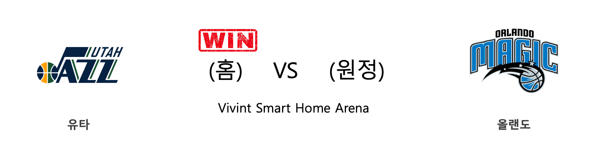
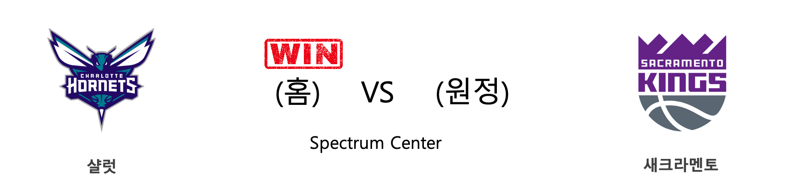
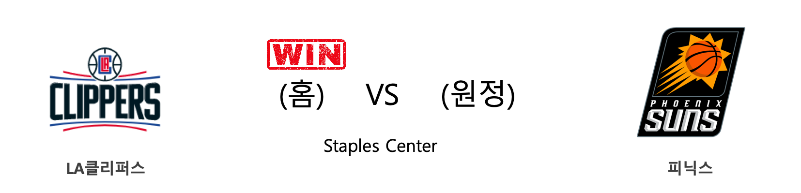
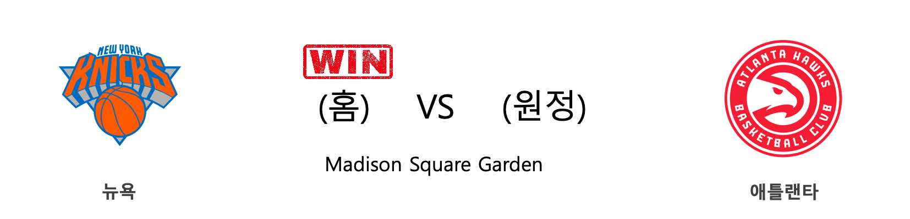

####  유타(홈) VS 올랜도(원정) 

<table class="tg">
  <tr>
    <th class="tg-rr9t">UTA</th>
    <th class="tg-rr9t">팀</th>
    <th class="tg-rr9t">ORL</th>
  </tr>
  <tr>
    <td class="tg-dcpn">1승 0패</td>
    <td class="tg-rr9t">시즌 상대전적</td>
    <td class="tg-dcpn">0승 1패</td>
  </tr>
  <tr>
    <td class="tg-dcpn">109</td>
    <td class="tg-rr9t">점수</td>
    <td class="tg-dcpn">102</td>
  </tr>
  <tr>
    <td class="tg-dcpn">27/54(50%)</td>
    <td class="tg-rr9t">2점(%)</td>
    <td class="tg-dcpn">35/58(60%)</td>
  </tr>
  <tr>
    <td class="tg-dcpn">15/36(42%)</td>
    <td class="tg-rr9t">3점(%)</td>
    <td class="tg-dcpn">7/35(20%)</td>
  </tr>
  <tr>
    <td class="tg-dcpn">10/16(62%)</td>
    <td class="tg-rr9t">자유투(%)</td>
    <td class="tg-dcpn">11/15(73%)</td>
  </tr>
  <tr>
    <td class="tg-dcpn">58</td>
    <td class="tg-rr9t">리바운드</td>
    <td class="tg-dcpn">41</td>
  </tr>
  <tr>
    <td class="tg-dcpn">27</td>
    <td class="tg-rr9t">어시스트</td>
    <td class="tg-dcpn">21</td>
  </tr>
  <tr>
    <td class="tg-dcpn">3</td>
    <td class="tg-rr9t">스틸</td>
    <td class="tg-dcpn">6</td>
  </tr>
  <tr>
    <td class="tg-dcpn">3</td>
    <td class="tg-rr9t">블록</td>
    <td class="tg-dcpn">5</td>
  </tr>
  <tr>
    <td class="tg-dcpn">14</td>
    <td class="tg-rr9t">턴오버</td>
    <td class="tg-dcpn">3</td>
  </tr>
  <tr>
    <td class="tg-dcpn">JoeInglesF(16) BojanBogdanov(30) DonovanMitche(30)</td>
    <td class="tg-rr9t">주요 득점선수</td>
    <td class="tg-dcpn">D.J.Augustin(22) EvanFournierG(19)</td>
  </tr>
</table>

#### 경기 관련 주요 기사         

[[오늘의 NBA] (12/8) 뉴욕, NBA의 방랑자](http://sports.news.naver.com/basketball/news/read.nhn?oid=486&aid=0000001160)

[[오늘의 NBA] (12/10) 데릭 로즈, 모터 시티의 해결사](http://sports.news.naver.com/basketball/news/read.nhn?oid=486&aid=0000001162)

[[오늘의 NBA] (12/3) 켈리 우브레 주니어, 피닉스의 터프가이](http://sports.news.naver.com/basketball/news/read.nhn?oid=486&aid=0000001155)

[[오늘의 NBA] (11/17) 샬럿, 설계된 플레이 연출의 달인](http://sports.news.naver.com/basketball/news/read.nhn?oid=486&aid=0000001140)

[[오늘의 NBA] (12/14) 레이커스, 마이애미 홈 코트를 점령하다](http://sports.news.naver.com/basketball/news/read.nhn?oid=486&aid=0000001166)

        
        

####  샬럿(홈) VS 새크라멘토(원정) 

<table class="tg">
  <tr>
    <th class="tg-rr9t">CHA</th>
    <th class="tg-rr9t">팀</th>
    <th class="tg-rr9t">SAC</th>
  </tr>
  <tr>
    <td class="tg-dcpn">2승 0패</td>
    <td class="tg-rr9t">시즌 상대전적</td>
    <td class="tg-dcpn">0승 2패</td>
  </tr>
  <tr>
    <td class="tg-dcpn">110</td>
    <td class="tg-rr9t">점수</td>
    <td class="tg-dcpn">102</td>
  </tr>
  <tr>
    <td class="tg-dcpn">26/51(51%)</td>
    <td class="tg-rr9t">2점(%)</td>
    <td class="tg-dcpn">24/52(46%)</td>
  </tr>
  <tr>
    <td class="tg-dcpn">13/30(43%)</td>
    <td class="tg-rr9t">3점(%)</td>
    <td class="tg-dcpn">14/40(35%)</td>
  </tr>
  <tr>
    <td class="tg-dcpn">19/27(70%)</td>
    <td class="tg-rr9t">자유투(%)</td>
    <td class="tg-dcpn">12/13(92%)</td>
  </tr>
  <tr>
    <td class="tg-dcpn">51</td>
    <td class="tg-rr9t">리바운드</td>
    <td class="tg-dcpn">33</td>
  </tr>
  <tr>
    <td class="tg-dcpn">26</td>
    <td class="tg-rr9t">어시스트</td>
    <td class="tg-dcpn">23</td>
  </tr>
  <tr>
    <td class="tg-dcpn">5</td>
    <td class="tg-rr9t">스틸</td>
    <td class="tg-dcpn">10</td>
  </tr>
  <tr>
    <td class="tg-dcpn">8</td>
    <td class="tg-rr9t">블록</td>
    <td class="tg-dcpn">5</td>
  </tr>
  <tr>
    <td class="tg-dcpn">16</td>
    <td class="tg-rr9t">턴오버</td>
    <td class="tg-dcpn">10</td>
  </tr>
  <tr>
    <td class="tg-dcpn">CodyZellerF(17) MarvinWilliam(16) Devonte'Graha(15) MalikMonk(23)</td>
    <td class="tg-rr9t">주요 득점선수</td>
    <td class="tg-dcpn">De'AaronFox(19)</td>
  </tr>
</table>

#### 경기 관련 주요 기사         

[[오늘의 NBA] (12/10) 데릭 로즈, 모터 시티의 해결사](http://sports.news.naver.com/basketball/news/read.nhn?oid=486&aid=0000001162)

[[오늘의 NBA] (12/14) 레이커스, 마이애미 홈 코트를 점령하다](http://sports.news.naver.com/basketball/news/read.nhn?oid=486&aid=0000001166)

[[오늘의 NBA] (12/12) 제임스 하든 선생님의 심폐소생술](http://sports.news.naver.com/basketball/news/read.nhn?oid=486&aid=0000001164)

[[오늘의 NBA] (12/16) 스펜서 딘위디, 브루클린 상승세를 이끈다!](http://sports.news.naver.com/basketball/news/read.nhn?oid=486&aid=0000001168)

[[오늘의 NBA] (12/11) 마이애미의 커리어 나이트 파티](http://sports.news.naver.com/basketball/news/read.nhn?oid=486&aid=0000001163)

        
        

####  LA클리퍼스(홈) VS 피닉스(원정) 

<table class="tg">
  <tr>
    <th class="tg-rr9t">LAC</th>
    <th class="tg-rr9t">팀</th>
    <th class="tg-rr9t">PHX</th>
  </tr>
  <tr>
    <td class="tg-dcpn">1승 1패</td>
    <td class="tg-rr9t">시즌 상대전적</td>
    <td class="tg-dcpn">1승 1패</td>
  </tr>
  <tr>
    <td class="tg-dcpn">120</td>
    <td class="tg-rr9t">점수</td>
    <td class="tg-dcpn">99</td>
  </tr>
  <tr>
    <td class="tg-dcpn">31/57(54%)</td>
    <td class="tg-rr9t">2점(%)</td>
    <td class="tg-dcpn">31/67(46%)</td>
  </tr>
  <tr>
    <td class="tg-dcpn">14/32(44%)</td>
    <td class="tg-rr9t">3점(%)</td>
    <td class="tg-dcpn">10/35(29%)</td>
  </tr>
  <tr>
    <td class="tg-dcpn">16/22(73%)</td>
    <td class="tg-rr9t">자유투(%)</td>
    <td class="tg-dcpn">7/10(70%)</td>
  </tr>
  <tr>
    <td class="tg-dcpn">44</td>
    <td class="tg-rr9t">리바운드</td>
    <td class="tg-dcpn">50</td>
  </tr>
  <tr>
    <td class="tg-dcpn">23</td>
    <td class="tg-rr9t">어시스트</td>
    <td class="tg-dcpn">30</td>
  </tr>
  <tr>
    <td class="tg-dcpn">14</td>
    <td class="tg-rr9t">스틸</td>
    <td class="tg-dcpn">11</td>
  </tr>
  <tr>
    <td class="tg-dcpn">4</td>
    <td class="tg-rr9t">블록</td>
    <td class="tg-dcpn">3</td>
  </tr>
  <tr>
    <td class="tg-dcpn">15</td>
    <td class="tg-rr9t">턴오버</td>
    <td class="tg-dcpn">19</td>
  </tr>
  <tr>
    <td class="tg-dcpn">MontrezlHarre(15) LouWilliams(20) KawhiLeonardF(20) PaulGeorgeG(24)</td>
    <td class="tg-rr9t">주요 득점선수</td>
    <td class="tg-dcpn">DeandreAytonC(18) KellyOubreJr.(19)</td>
  </tr>
</table>

#### 경기 관련 주요 기사         

[[오늘의 NBA] (12/12) 제임스 하든 선생님의 심폐소생술](http://sports.news.naver.com/basketball/news/read.nhn?oid=486&aid=0000001164)

[[오늘의 NBA] (12/15) 밤 아데바요, 연장전의 지배자](http://sports.news.naver.com/basketball/news/read.nhn?oid=486&aid=0000001167)

[[오늘의 NBA] (11/16) 멤피스, Grit&Grind 시대와의 성공적인 단절](http://sports.news.naver.com/basketball/news/read.nhn?oid=486&aid=0000001139)

[[오늘의 NBA] (12/8) 뉴욕, NBA의 방랑자](http://sports.news.naver.com/basketball/news/read.nhn?oid=486&aid=0000001160)

[[오늘의 NBA] (12/10) 데릭 로즈, 모터 시티의 해결사](http://sports.news.naver.com/basketball/news/read.nhn?oid=486&aid=0000001162)

        
        

####  뉴올리언스(홈) VS 브루클린(원정) 

<table class="tg">
  <tr>
    <th class="tg-rr9t">NOP</th>
    <th class="tg-rr9t">팀</th>
    <th class="tg-rr9t">BKN</th>
  </tr>
  <tr>
    <td class="tg-dcpn">0승 2패</td>
    <td class="tg-rr9t">시즌 상대전적</td>
    <td class="tg-dcpn">2승 0패</td>
  </tr>
  <tr>
    <td class="tg-dcpn">101</td>
    <td class="tg-rr9t">점수</td>
    <td class="tg-dcpn">108</td>
  </tr>
  <tr>
    <td class="tg-dcpn">26/68(38%)</td>
    <td class="tg-rr9t">2점(%)</td>
    <td class="tg-dcpn">29/57(51%)</td>
  </tr>
  <tr>
    <td class="tg-dcpn">11/40(28%)</td>
    <td class="tg-rr9t">3점(%)</td>
    <td class="tg-dcpn">11/39(28%)</td>
  </tr>
  <tr>
    <td class="tg-dcpn">16/24(67%)</td>
    <td class="tg-rr9t">자유투(%)</td>
    <td class="tg-dcpn">17/23(74%)</td>
  </tr>
  <tr>
    <td class="tg-dcpn">59</td>
    <td class="tg-rr9t">리바운드</td>
    <td class="tg-dcpn">55</td>
  </tr>
  <tr>
    <td class="tg-dcpn">20</td>
    <td class="tg-rr9t">어시스트</td>
    <td class="tg-dcpn">25</td>
  </tr>
  <tr>
    <td class="tg-dcpn">3</td>
    <td class="tg-rr9t">스틸</td>
    <td class="tg-dcpn">3</td>
  </tr>
  <tr>
    <td class="tg-dcpn">9</td>
    <td class="tg-rr9t">블록</td>
    <td class="tg-dcpn">10</td>
  </tr>
  <tr>
    <td class="tg-dcpn">8</td>
    <td class="tg-rr9t">턴오버</td>
    <td class="tg-dcpn">11</td>
  </tr>
  <tr>
    <td class="tg-dcpn">JrueHolidayG(21) BrandonIngram(22)</td>
    <td class="tg-rr9t">주요 득점선수</td>
    <td class="tg-dcpn">JoeHarrisF(24) SpencerDinwid(31)</td>
  </tr>
</table>

#### 경기 관련 주요 기사         

[[오늘의 NBA] (12/16) 스펜서 딘위디, 브루클린 상승세를 이끈다!](http://sports.news.naver.com/basketball/news/read.nhn?oid=486&aid=0000001168)

[[오늘의 NBA] (12/12) 제임스 하든 선생님의 심폐소생술](http://sports.news.naver.com/basketball/news/read.nhn?oid=486&aid=0000001164)

[[오늘의 NBA] (12/15) 밤 아데바요, 연장전의 지배자](http://sports.news.naver.com/basketball/news/read.nhn?oid=486&aid=0000001167)

[[오늘의 NBA] (12/6) 마이크 댄토니, 토론토 수비를 농락하다](http://sports.news.naver.com/basketball/news/read.nhn?oid=486&aid=0000001158)

[[오늘의 NBA] (12/14) 레이커스, 마이애미 홈 코트를 점령하다](http://sports.news.naver.com/basketball/news/read.nhn?oid=486&aid=0000001166)

        
        

####  인디애나(홈) VS LA레이커스(원정) 

<table class="tg">
  <tr>
    <th class="tg-rr9t">IND</th>
    <th class="tg-rr9t">팀</th>
    <th class="tg-rr9t">LAL</th>
  </tr>
  <tr>
    <td class="tg-dcpn">1승 0패</td>
    <td class="tg-rr9t">시즌 상대전적</td>
    <td class="tg-dcpn">0승 1패</td>
  </tr>
  <tr>
    <td class="tg-dcpn">105</td>
    <td class="tg-rr9t">점수</td>
    <td class="tg-dcpn">102</td>
  </tr>
  <tr>
    <td class="tg-dcpn">31/60(52%)</td>
    <td class="tg-rr9t">2점(%)</td>
    <td class="tg-dcpn">35/60(58%)</td>
  </tr>
  <tr>
    <td class="tg-dcpn">10/25(40%)</td>
    <td class="tg-rr9t">3점(%)</td>
    <td class="tg-dcpn">8/31(26%)</td>
  </tr>
  <tr>
    <td class="tg-dcpn">13/20(65%)</td>
    <td class="tg-rr9t">자유투(%)</td>
    <td class="tg-dcpn">8/17(47%)</td>
  </tr>
  <tr>
    <td class="tg-dcpn">43</td>
    <td class="tg-rr9t">리바운드</td>
    <td class="tg-dcpn">42</td>
  </tr>
  <tr>
    <td class="tg-dcpn">22</td>
    <td class="tg-rr9t">어시스트</td>
    <td class="tg-dcpn">28</td>
  </tr>
  <tr>
    <td class="tg-dcpn">9</td>
    <td class="tg-rr9t">스틸</td>
    <td class="tg-dcpn">5</td>
  </tr>
  <tr>
    <td class="tg-dcpn">6</td>
    <td class="tg-rr9t">블록</td>
    <td class="tg-dcpn">6</td>
  </tr>
  <tr>
    <td class="tg-dcpn">12</td>
    <td class="tg-rr9t">턴오버</td>
    <td class="tg-dcpn">13</td>
  </tr>
  <tr>
    <td class="tg-dcpn">MylesTurnerC(16) DomantasSabon(26)</td>
    <td class="tg-rr9t">주요 득점선수</td>
    <td class="tg-dcpn">LeBronJamesF(20) DwightHoward(20)</td>
  </tr>
</table>

#### 경기 관련 주요 기사         

[[오늘의 NBA] (12/16) 스펜서 딘위디, 브루클린 상승세를 이끈다!](http://sports.news.naver.com/basketball/news/read.nhn?oid=486&aid=0000001168)

[[오늘의 NBA] (12/12) 제임스 하든 선생님의 심폐소생술](http://sports.news.naver.com/basketball/news/read.nhn?oid=486&aid=0000001164)

[[오늘의 NBA] (12/10) 데릭 로즈, 모터 시티의 해결사](http://sports.news.naver.com/basketball/news/read.nhn?oid=486&aid=0000001162)

[[오늘의 NBA] (11/13) LAL 카일 쿠즈마의 대반격](http://sports.news.naver.com/basketball/news/read.nhn?oid=486&aid=0000001136)

[[오늘의 NBA] (12/14) 레이커스, 마이애미 홈 코트를 점령하다](http://sports.news.naver.com/basketball/news/read.nhn?oid=486&aid=0000001166)

        
        

####  뉴욕(홈) VS 애틀랜타(원정) 

<table class="tg">
  <tr>
    <th class="tg-rr9t">NYK</th>
    <th class="tg-rr9t">팀</th>
    <th class="tg-rr9t">ATL</th>
  </tr>
  <tr>
    <td class="tg-dcpn">1승 0패</td>
    <td class="tg-rr9t">시즌 상대전적</td>
    <td class="tg-dcpn">0승 1패</td>
  </tr>
  <tr>
    <td class="tg-dcpn">143</td>
    <td class="tg-rr9t">점수</td>
    <td class="tg-dcpn">120</td>
  </tr>
  <tr>
    <td class="tg-dcpn">40/67(60%)</td>
    <td class="tg-rr9t">2점(%)</td>
    <td class="tg-dcpn">30/56(54%)</td>
  </tr>
  <tr>
    <td class="tg-dcpn">13/28(46%)</td>
    <td class="tg-rr9t">3점(%)</td>
    <td class="tg-dcpn">15/43(35%)</td>
  </tr>
  <tr>
    <td class="tg-dcpn">24/31(77%)</td>
    <td class="tg-rr9t">자유투(%)</td>
    <td class="tg-dcpn">15/20(75%)</td>
  </tr>
  <tr>
    <td class="tg-dcpn">55</td>
    <td class="tg-rr9t">리바운드</td>
    <td class="tg-dcpn">36</td>
  </tr>
  <tr>
    <td class="tg-dcpn">30</td>
    <td class="tg-rr9t">어시스트</td>
    <td class="tg-dcpn">20</td>
  </tr>
  <tr>
    <td class="tg-dcpn">7</td>
    <td class="tg-rr9t">스틸</td>
    <td class="tg-dcpn">7</td>
  </tr>
  <tr>
    <td class="tg-dcpn">6</td>
    <td class="tg-rr9t">블록</td>
    <td class="tg-dcpn">3</td>
  </tr>
  <tr>
    <td class="tg-dcpn">11</td>
    <td class="tg-rr9t">턴오버</td>
    <td class="tg-dcpn">10</td>
  </tr>
  <tr>
    <td class="tg-dcpn">MarcusMorrisS(22) JuliusRandleF(17) KevinKnoxII(17) MitchellRobin(22) RJBarrettG(27)</td>
    <td class="tg-rr9t">주요 득점선수</td>
    <td class="tg-dcpn">De'AndreHunte(19) VinceCarter(15) TraeYoungG(42)</td>
  </tr>
</table>

#### 경기 관련 주요 기사         

[[오늘의 NBA] (12/11) 마이애미의 커리어 나이트 파티](http://sports.news.naver.com/basketball/news/read.nhn?oid=486&aid=0000001163)

[[오늘의 NBA] (12/12) 제임스 하든 선생님의 심폐소생술](http://sports.news.naver.com/basketball/news/read.nhn?oid=486&aid=0000001164)

[[오늘의 NBA] (11/17) 샬럿, 설계된 플레이 연출의 달인](http://sports.news.naver.com/basketball/news/read.nhn?oid=486&aid=0000001140)

[[오늘의 NBA] (12/14) 레이커스, 마이애미 홈 코트를 점령하다](http://sports.news.naver.com/basketball/news/read.nhn?oid=486&aid=0000001166)

[[오늘의 NBA] (12/16) 스펜서 딘위디, 브루클린 상승세를 이끈다!](http://sports.news.naver.com/basketball/news/read.nhn?oid=486&aid=0000001168)

        
        

#### 리그 (Eastern) 순위
    

<table class="tg">
  <tr>
    <th class="tg-d14o">순위</th>
    <th class="tg-d14o">팀명</th>
    <th class="tg-d14o">경기수</th>
    <th class="tg-d14o">승</th>
    <th class="tg-d14o">패</th>
    <th class="tg-d14o">승차</th>
    <th class="tg-d14o">승률</th>
  </tr>
  
<tr>
    <td class="tg-50j8">1</td>
    <td class="tg-50j8">MIL</td>
    <td class="tg-50j8">28</td>
    <td class="tg-50j8">24</td>
    <td class="tg-50j8">4</td>
    <td class="tg-50j8">0</td>
    <td class="tg-50j8">0.857</td>
</tr>

<tr>
    <td class="tg-50j8">2</td>
    <td class="tg-50j8">PHI</td>
    <td class="tg-50j8">27</td>
    <td class="tg-50j8">19</td>
    <td class="tg-50j8">8</td>
    <td class="tg-50j8">5</td>
    <td class="tg-50j8">0.704</td>
</tr>

<tr>
    <td class="tg-50j8">2</td>
    <td class="tg-50j8">MIA</td>
    <td class="tg-50j8">27</td>
    <td class="tg-50j8">19</td>
    <td class="tg-50j8">8</td>
    <td class="tg-50j8">5</td>
    <td class="tg-50j8">0.704</td>
</tr>

<tr>
    <td class="tg-50j8">4</td>
    <td class="tg-50j8">IND</td>
    <td class="tg-50j8">28</td>
    <td class="tg-50j8">19</td>
    <td class="tg-50j8">9</td>
    <td class="tg-50j8">5</td>
    <td class="tg-50j8">0.679</td>
</tr>

<tr>
    <td class="tg-50j8">5</td>
    <td class="tg-50j8">TOR</td>
    <td class="tg-50j8">26</td>
    <td class="tg-50j8">18</td>
    <td class="tg-50j8">8</td>
    <td class="tg-50j8">6</td>
    <td class="tg-50j8">0.692</td>
</tr>

<tr>
    <td class="tg-50j8">6</td>
    <td class="tg-50j8">BOS</td>
    <td class="tg-50j8">23</td>
    <td class="tg-50j8">17</td>
    <td class="tg-50j8">6</td>
    <td class="tg-50j8">7</td>
    <td class="tg-50j8">0.739</td>
</tr>

<tr>
    <td class="tg-50j8">7</td>
    <td class="tg-50j8">BKN</td>
    <td class="tg-50j8">27</td>
    <td class="tg-50j8">15</td>
    <td class="tg-50j8">12</td>
    <td class="tg-50j8">9</td>
    <td class="tg-50j8">0.556</td>
</tr>

<tr>
    <td class="tg-50j8">8</td>
    <td class="tg-50j8">CHA</td>
    <td class="tg-50j8">30</td>
    <td class="tg-50j8">13</td>
    <td class="tg-50j8">17</td>
    <td class="tg-50j8">11</td>
    <td class="tg-50j8">0.433</td>
</tr>

<tr>
    <td class="tg-50j8">9</td>
    <td class="tg-50j8">ORL</td>
    <td class="tg-50j8">27</td>
    <td class="tg-50j8">12</td>
    <td class="tg-50j8">15</td>
    <td class="tg-50j8">12</td>
    <td class="tg-50j8">0.444</td>
</tr>

<tr>
    <td class="tg-50j8">10</td>
    <td class="tg-50j8">DET</td>
    <td class="tg-50j8">26</td>
    <td class="tg-50j8">11</td>
    <td class="tg-50j8">15</td>
    <td class="tg-50j8">13</td>
    <td class="tg-50j8">0.423</td>
</tr>

<tr>
    <td class="tg-50j8">11</td>
    <td class="tg-50j8">CHI</td>
    <td class="tg-50j8">29</td>
    <td class="tg-50j8">10</td>
    <td class="tg-50j8">19</td>
    <td class="tg-50j8">14</td>
    <td class="tg-50j8">0.345</td>
</tr>

<tr>
    <td class="tg-50j8">12</td>
    <td class="tg-50j8">WAS</td>
    <td class="tg-50j8">25</td>
    <td class="tg-50j8">8</td>
    <td class="tg-50j8">17</td>
    <td class="tg-50j8">16</td>
    <td class="tg-50j8">0.32</td>
</tr>

<tr>
    <td class="tg-50j8">13</td>
    <td class="tg-50j8">NYK</td>
    <td class="tg-50j8">28</td>
    <td class="tg-50j8">7</td>
    <td class="tg-50j8">21</td>
    <td class="tg-50j8">17</td>
    <td class="tg-50j8">0.25</td>
</tr>

<tr>
    <td class="tg-50j8">14</td>
    <td class="tg-50j8">ATL</td>
    <td class="tg-50j8">28</td>
    <td class="tg-50j8">6</td>
    <td class="tg-50j8">22</td>
    <td class="tg-50j8">18</td>
    <td class="tg-50j8">0.214</td>
</tr>

<tr>
    <td class="tg-50j8">15</td>
    <td class="tg-50j8">CLE</td>
    <td class="tg-50j8">26</td>
    <td class="tg-50j8">5</td>
    <td class="tg-50j8">21</td>
    <td class="tg-50j8">19</td>
    <td class="tg-50j8">0.192</td>
</tr>
</table> 
#### 리그 (Western) 순위
    

<table class="tg">
  <tr>
    <th class="tg-d14o">순위</th>
    <th class="tg-d14o">팀명</th>
    <th class="tg-d14o">경기수</th>
    <th class="tg-d14o">승</th>
    <th class="tg-d14o">패</th>
    <th class="tg-d14o">승차</th>
    <th class="tg-d14o">승률</th>
  </tr>
  
<tr>
    <td class="tg-50j8">1</td>
    <td class="tg-50j8">LAL</td>
    <td class="tg-50j8">28</td>
    <td class="tg-50j8">24</td>
    <td class="tg-50j8">4</td>
    <td class="tg-50j8">0</td>
    <td class="tg-50j8">0.857</td>
</tr>

<tr>
    <td class="tg-50j8">2</td>
    <td class="tg-50j8">LAC</td>
    <td class="tg-50j8">29</td>
    <td class="tg-50j8">21</td>
    <td class="tg-50j8">8</td>
    <td class="tg-50j8">3</td>
    <td class="tg-50j8">0.724</td>
</tr>

<tr>
    <td class="tg-50j8">3</td>
    <td class="tg-50j8">HOU</td>
    <td class="tg-50j8">27</td>
    <td class="tg-50j8">18</td>
    <td class="tg-50j8">9</td>
    <td class="tg-50j8">6</td>
    <td class="tg-50j8">0.667</td>
</tr>

<tr>
    <td class="tg-50j8">4</td>
    <td class="tg-50j8">DAL</td>
    <td class="tg-50j8">25</td>
    <td class="tg-50j8">17</td>
    <td class="tg-50j8">8</td>
    <td class="tg-50j8">7</td>
    <td class="tg-50j8">0.68</td>
</tr>

<tr>
    <td class="tg-50j8">5</td>
    <td class="tg-50j8">DEN</td>
    <td class="tg-50j8">24</td>
    <td class="tg-50j8">16</td>
    <td class="tg-50j8">8</td>
    <td class="tg-50j8">8</td>
    <td class="tg-50j8">0.667</td>
</tr>

<tr>
    <td class="tg-50j8">6</td>
    <td class="tg-50j8">UTA</td>
    <td class="tg-50j8">27</td>
    <td class="tg-50j8">16</td>
    <td class="tg-50j8">11</td>
    <td class="tg-50j8">8</td>
    <td class="tg-50j8">0.593</td>
</tr>

<tr>
    <td class="tg-50j8">7</td>
    <td class="tg-50j8">OKC</td>
    <td class="tg-50j8">26</td>
    <td class="tg-50j8">12</td>
    <td class="tg-50j8">14</td>
    <td class="tg-50j8">12</td>
    <td class="tg-50j8">0.462</td>
</tr>

<tr>
    <td class="tg-50j8">8</td>
    <td class="tg-50j8">SAC</td>
    <td class="tg-50j8">27</td>
    <td class="tg-50j8">12</td>
    <td class="tg-50j8">15</td>
    <td class="tg-50j8">12</td>
    <td class="tg-50j8">0.444</td>
</tr>

<tr>
    <td class="tg-50j8">9</td>
    <td class="tg-50j8">POR</td>
    <td class="tg-50j8">26</td>
    <td class="tg-50j8">11</td>
    <td class="tg-50j8">15</td>
    <td class="tg-50j8">13</td>
    <td class="tg-50j8">0.423</td>
</tr>

<tr>
    <td class="tg-50j8">10</td>
    <td class="tg-50j8">PHX</td>
    <td class="tg-50j8">27</td>
    <td class="tg-50j8">11</td>
    <td class="tg-50j8">16</td>
    <td class="tg-50j8">13</td>
    <td class="tg-50j8">0.407</td>
</tr>

<tr>
    <td class="tg-50j8">11</td>
    <td class="tg-50j8">MIN</td>
    <td class="tg-50j8">25</td>
    <td class="tg-50j8">10</td>
    <td class="tg-50j8">15</td>
    <td class="tg-50j8">14</td>
    <td class="tg-50j8">0.4</td>
</tr>

<tr>
    <td class="tg-50j8">11</td>
    <td class="tg-50j8">SAS</td>
    <td class="tg-50j8">25</td>
    <td class="tg-50j8">10</td>
    <td class="tg-50j8">15</td>
    <td class="tg-50j8">14</td>
    <td class="tg-50j8">0.4</td>
</tr>

<tr>
    <td class="tg-50j8">13</td>
    <td class="tg-50j8">MEM</td>
    <td class="tg-50j8">27</td>
    <td class="tg-50j8">10</td>
    <td class="tg-50j8">17</td>
    <td class="tg-50j8">14</td>
    <td class="tg-50j8">0.37</td>
</tr>

<tr>
    <td class="tg-50j8">14</td>
    <td class="tg-50j8">NOP</td>
    <td class="tg-50j8">28</td>
    <td class="tg-50j8">6</td>
    <td class="tg-50j8">22</td>
    <td class="tg-50j8">18</td>
    <td class="tg-50j8">0.214</td>
</tr>

<tr>
    <td class="tg-50j8">15</td>
    <td class="tg-50j8">GSW</td>
    <td class="tg-50j8">28</td>
    <td class="tg-50j8">5</td>
    <td class="tg-50j8">23</td>
    <td class="tg-50j8">19</td>
    <td class="tg-50j8">0.179</td>
</tr>
</table> 

        
        
#nba #미국농구 #엔비에이 #농구분석 #토토 #스포츠토토 #경기예측 #농구결과 #20191218 #유타 #올랜도 #샬럿 #새크라멘토 #LA클리퍼스 #피닉스 #뉴올리언스 #브루클린 #인디애나 #LA레이커스 #뉴욕 #애틀랜타 #유타올랜도 #샬럿새크라멘토 #LA클리퍼스피닉스 #뉴올리언스브루클린 #인디애나LA레이커스 #뉴욕애틀랜타 