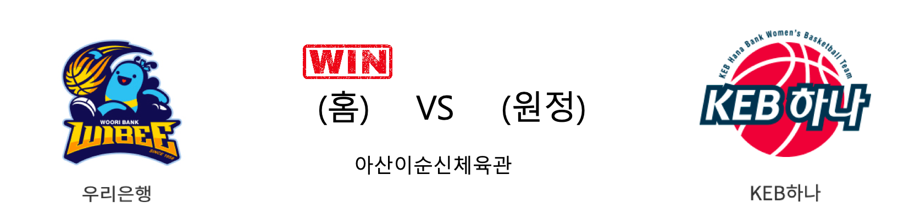

####  우리은행(홈) VS KEB하나(원정) 

<table class="tg">
  <tr>
    <th class="tg-rr9t">우리은행</th>
    <th class="tg-rr9t">팀</th>
    <th class="tg-rr9t">KEB하나</th>
  </tr>
  <tr>
    <td class="tg-dcpn">3승 0패</td>
    <td class="tg-rr9t">시즌 상대전적</td>
    <td class="tg-dcpn">0승 3패</td>
  </tr>
  <tr>
    <td class="tg-dcpn">76</td>
    <td class="tg-rr9t">점수</td>
    <td class="tg-dcpn">72</td>
  </tr>
  <tr>
    <td class="tg-dcpn">23/41(56%)</td>
    <td class="tg-rr9t">2점(%)</td>
    <td class="tg-dcpn">18/37(49%)</td>
  </tr>
  <tr>
    <td class="tg-dcpn">6/23(26%)</td>
    <td class="tg-rr9t">3점(%)</td>
    <td class="tg-dcpn">8/20(40%)</td>
  </tr>
  <tr>
    <td class="tg-dcpn">12/13(92%)</td>
    <td class="tg-rr9t">자유투(%)</td>
    <td class="tg-dcpn">12/13(92%)</td>
  </tr>
  <tr>
    <td class="tg-dcpn">35</td>
    <td class="tg-rr9t">리바운드</td>
    <td class="tg-dcpn">26</td>
  </tr>
  <tr>
    <td class="tg-dcpn">16</td>
    <td class="tg-rr9t">어시스트</td>
    <td class="tg-dcpn">20</td>
  </tr>
  <tr>
    <td class="tg-dcpn">8</td>
    <td class="tg-rr9t">스틸</td>
    <td class="tg-dcpn">8</td>
  </tr>
  <tr>
    <td class="tg-dcpn">11</td>
    <td class="tg-rr9t">블록</td>
    <td class="tg-dcpn">13</td>
  </tr>
  <tr>
    <td class="tg-dcpn">17</td>
    <td class="tg-rr9t">턴오버</td>
    <td class="tg-dcpn">19</td>
  </tr>
  <tr>
    <td class="tg-dcpn">그레이(20) 박혜진(24)</td>
    <td class="tg-rr9t">주요 득점선수</td>
    <td class="tg-dcpn">강이슬(21)</td>
  </tr>
</table>

#### 경기 관련 주요 기사         

[(뉴스리듬)금감원 "우리·KEB하나은행, 소비자 보호 가장 미흡"](http://www.newstomato.com/ReadNews.aspx?no=940676)

[[내 맘대로 프리뷰] '선두권 유지' 우리은행 vs '3위 위협' KEB하나은행](http://www.basketkorea.com/news/articleView.html?idxno=190833)

[[퓨처스] ‘박찬양 더블더블’ KEB하나은행, 우리은행 꺾고 개막전 승리](http://sports.news.naver.com/basketball/news/read.nhn?oid=065&aid=0000194116)

[DLF 사태 '하나·우리銀' 소비자보호 실태평가서 '미흡' 등급](https://biz.chosun.com/site/data/html_dir/2019/12/17/2019121700771.html?utm_source=naver&utm_medium=original&utm_campaign=biz)

        
        

#### 리그 순위

<table class="tg">
  <tr>
    <th class="tg-d14o">순위</th>
    <th class="tg-d14o">팀명</th>
    <th class="tg-d14o">경기수</th>
    <th class="tg-d14o">승</th>
    <th class="tg-d14o">패</th>
    <th class="tg-d14o">승차</th>
    <th class="tg-d14o">승률</th>
  </tr>
  
<tr>
    <td class="tg-50j8">1</td>
    <td class="tg-50j8">우리은행</td>
    <td class="tg-50j8">12</td>
    <td class="tg-50j8">10</td>
    <td class="tg-50j8">2</td>
    <td class="tg-50j8">0</td>
    <td class="tg-50j8">0.833</td>
</tr>

<tr>
    <td class="tg-50j8">1</td>
    <td class="tg-50j8">KB스타즈</td>
    <td class="tg-50j8">12</td>
    <td class="tg-50j8">10</td>
    <td class="tg-50j8">2</td>
    <td class="tg-50j8">0</td>
    <td class="tg-50j8">0.833</td>
</tr>

<tr>
    <td class="tg-50j8">3</td>
    <td class="tg-50j8">신한은행</td>
    <td class="tg-50j8">11</td>
    <td class="tg-50j8">5</td>
    <td class="tg-50j8">6</td>
    <td class="tg-50j8">5</td>
    <td class="tg-50j8">0.455</td>
</tr>

<tr>
    <td class="tg-50j8">4</td>
    <td class="tg-50j8">KEB하나</td>
    <td class="tg-50j8">12</td>
    <td class="tg-50j8">4</td>
    <td class="tg-50j8">8</td>
    <td class="tg-50j8">6</td>
    <td class="tg-50j8">0.333</td>
</tr>

<tr>
    <td class="tg-50j8">5</td>
    <td class="tg-50j8">삼성생명</td>
    <td class="tg-50j8">11</td>
    <td class="tg-50j8">3</td>
    <td class="tg-50j8">8</td>
    <td class="tg-50j8">7</td>
    <td class="tg-50j8">0.273</td>
</tr>

<tr>
    <td class="tg-50j8">6</td>
    <td class="tg-50j8">BNK썸</td>
    <td class="tg-50j8">12</td>
    <td class="tg-50j8">3</td>
    <td class="tg-50j8">9</td>
    <td class="tg-50j8">7</td>
    <td class="tg-50j8">0.25</td>
</tr>
</table> 

        
        
#wkbl #국내농구 #여자농구 #농구분석 #토토 #스포츠토토 #경기예측 #농구결과 #20191218 #우리은행 #KEB하나 #우리은행KEB하나 