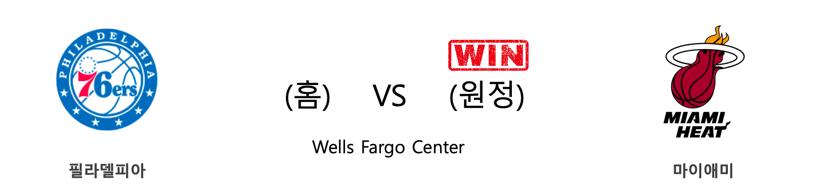

####  워싱턴(홈) VS 시카고(원정) 

<table class="tg">
  <tr>
    <th class="tg-rr9t">WAS</th>
    <th class="tg-rr9t">팀</th>
    <th class="tg-rr9t">CHI</th>
  </tr>
  <tr>
    <td class="tg-dcpn">0승 1패</td>
    <td class="tg-rr9t">시즌 상대전적</td>
    <td class="tg-dcpn">1승 0패</td>
  </tr>
  <tr>
    <td class="tg-dcpn">109</td>
    <td class="tg-rr9t">점수</td>
    <td class="tg-dcpn">110</td>
  </tr>
  <tr>
    <td class="tg-dcpn">20/50(40%)</td>
    <td class="tg-rr9t">2점(%)</td>
    <td class="tg-dcpn">28/60(47%)</td>
  </tr>
  <tr>
    <td class="tg-dcpn">14/45(31%)</td>
    <td class="tg-rr9t">3점(%)</td>
    <td class="tg-dcpn">11/37(30%)</td>
  </tr>
  <tr>
    <td class="tg-dcpn">27/32(84%)</td>
    <td class="tg-rr9t">자유투(%)</td>
    <td class="tg-dcpn">21/24(88%)</td>
  </tr>
  <tr>
    <td class="tg-dcpn">55</td>
    <td class="tg-rr9t">리바운드</td>
    <td class="tg-dcpn">53</td>
  </tr>
  <tr>
    <td class="tg-dcpn">21</td>
    <td class="tg-rr9t">어시스트</td>
    <td class="tg-dcpn">25</td>
  </tr>
  <tr>
    <td class="tg-dcpn">8</td>
    <td class="tg-rr9t">스틸</td>
    <td class="tg-dcpn">10</td>
  </tr>
  <tr>
    <td class="tg-dcpn">7</td>
    <td class="tg-rr9t">블록</td>
    <td class="tg-dcpn">6</td>
  </tr>
  <tr>
    <td class="tg-dcpn">14</td>
    <td class="tg-rr9t">턴오버</td>
    <td class="tg-dcpn">15</td>
  </tr>
  <tr>
    <td class="tg-dcpn">DavisBertansF(26) BradleyBealG(22) IsaiahThomasG(16)</td>
    <td class="tg-rr9t">주요 득점선수</td>
    <td class="tg-dcpn">ZachLaVineG(24) TomasSatorans(17) KrisDunnF(15) LauriMarkkane(31)</td>
  </tr>
</table>

#### 경기 관련 주요 기사         

[[오늘의 NBA] (12/17) 댈러스, 밀워키 시스템을 붕괴시키다](http://sports.news.naver.com/basketball/news/read.nhn?oid=486&aid=0000001169)

[[오늘의 NBA] (12/15) 밤 아데바요, 연장전의 지배자](http://sports.news.naver.com/basketball/news/read.nhn?oid=486&aid=0000001167)

[The case for a U-turn](http://koreajoongangdaily.joins.com/news/article/article.aspx?aid=3071517)

        
        

####  덴버(홈) VS 올랜도(원정) 

<table class="tg">
  <tr>
    <th class="tg-rr9t">DEN</th>
    <th class="tg-rr9t">팀</th>
    <th class="tg-rr9t">ORL</th>
  </tr>
  <tr>
    <td class="tg-dcpn">2승 0패</td>
    <td class="tg-rr9t">시즌 상대전적</td>
    <td class="tg-dcpn">0승 2패</td>
  </tr>
  <tr>
    <td class="tg-dcpn">113</td>
    <td class="tg-rr9t">점수</td>
    <td class="tg-dcpn">104</td>
  </tr>
  <tr>
    <td class="tg-dcpn">29/57(51%)</td>
    <td class="tg-rr9t">2점(%)</td>
    <td class="tg-dcpn">26/58(45%)</td>
  </tr>
  <tr>
    <td class="tg-dcpn">11/27(41%)</td>
    <td class="tg-rr9t">3점(%)</td>
    <td class="tg-dcpn">11/29(38%)</td>
  </tr>
  <tr>
    <td class="tg-dcpn">22/25(88%)</td>
    <td class="tg-rr9t">자유투(%)</td>
    <td class="tg-dcpn">19/21(90%)</td>
  </tr>
  <tr>
    <td class="tg-dcpn">52</td>
    <td class="tg-rr9t">리바운드</td>
    <td class="tg-dcpn">35</td>
  </tr>
  <tr>
    <td class="tg-dcpn">28</td>
    <td class="tg-rr9t">어시스트</td>
    <td class="tg-dcpn">25</td>
  </tr>
  <tr>
    <td class="tg-dcpn">8</td>
    <td class="tg-rr9t">스틸</td>
    <td class="tg-dcpn">9</td>
  </tr>
  <tr>
    <td class="tg-dcpn">3</td>
    <td class="tg-rr9t">블록</td>
    <td class="tg-dcpn">5</td>
  </tr>
  <tr>
    <td class="tg-dcpn">17</td>
    <td class="tg-rr9t">턴오버</td>
    <td class="tg-dcpn">12</td>
  </tr>
  <tr>
    <td class="tg-dcpn">PaulMillsapF(15) JamalMurrayG(33) NikolaJokicC(18)</td>
    <td class="tg-rr9t">주요 득점선수</td>
    <td class="tg-dcpn">NikolaVucevic(20) D.J.Augustin(18)</td>
  </tr>
</table>

#### 경기 관련 주요 기사         

[[오늘의 NBA] (12/8) 뉴욕, NBA의 방랑자](http://sports.news.naver.com/basketball/news/read.nhn?oid=486&aid=0000001160)

[[오늘의 NBA] (12/7) 르브론 제임스, 멜로(carmelo) 드라마의 주인공](http://sports.news.naver.com/basketball/news/read.nhn?oid=486&aid=0000001159)

[[오늘의 NBA] (12/14) 레이커스, 마이애미 홈 코트를 점령하다](http://sports.news.naver.com/basketball/news/read.nhn?oid=486&aid=0000001166)

[[오늘의 NBA] (12/15) 밤 아데바요, 연장전의 지배자](http://sports.news.naver.com/basketball/news/read.nhn?oid=486&aid=0000001167)

[[오늘의 NBA] (12/4) 샌안토니오, 괄육취골 승리를 거두다](http://sports.news.naver.com/basketball/news/read.nhn?oid=486&aid=0000001156)

        
        

####  오클라호마씨티(홈) VS 멤피스(원정) 

<table class="tg">
  <tr>
    <th class="tg-rr9t">OKC</th>
    <th class="tg-rr9t">팀</th>
    <th class="tg-rr9t">MEM</th>
  </tr>
  <tr>
    <td class="tg-dcpn">1승 0패</td>
    <td class="tg-rr9t">시즌 상대전적</td>
    <td class="tg-dcpn">0승 1패</td>
  </tr>
  <tr>
    <td class="tg-dcpn">126</td>
    <td class="tg-rr9t">점수</td>
    <td class="tg-dcpn">122</td>
  </tr>
  <tr>
    <td class="tg-dcpn">39/60(65%)</td>
    <td class="tg-rr9t">2점(%)</td>
    <td class="tg-dcpn">40/73(55%)</td>
  </tr>
  <tr>
    <td class="tg-dcpn">7/24(29%)</td>
    <td class="tg-rr9t">3점(%)</td>
    <td class="tg-dcpn">10/25(40%)</td>
  </tr>
  <tr>
    <td class="tg-dcpn">27/34(79%)</td>
    <td class="tg-rr9t">자유투(%)</td>
    <td class="tg-dcpn">12/15(80%)</td>
  </tr>
  <tr>
    <td class="tg-dcpn">35</td>
    <td class="tg-rr9t">리바운드</td>
    <td class="tg-dcpn">47</td>
  </tr>
  <tr>
    <td class="tg-dcpn">25</td>
    <td class="tg-rr9t">어시스트</td>
    <td class="tg-dcpn">27</td>
  </tr>
  <tr>
    <td class="tg-dcpn">6</td>
    <td class="tg-rr9t">스틸</td>
    <td class="tg-dcpn">5</td>
  </tr>
  <tr>
    <td class="tg-dcpn">6</td>
    <td class="tg-rr9t">블록</td>
    <td class="tg-dcpn">2</td>
  </tr>
  <tr>
    <td class="tg-dcpn">12</td>
    <td class="tg-rr9t">턴오버</td>
    <td class="tg-dcpn">13</td>
  </tr>
  <tr>
    <td class="tg-dcpn">DaniloGallina(20) ShaiGilgeous-(20) DennisSchrode(31) ChrisPaulG(18)</td>
    <td class="tg-rr9t">주요 득점선수</td>
    <td class="tg-dcpn">JaMorantG(22) BrandonClarke(27) JonasValanciu(24) DillonBrooksG(15)</td>
  </tr>
</table>

#### 경기 관련 주요 기사         

[[오늘의 NBA] (12/17) 댈러스, 밀워키 시스템을 붕괴시키다](http://sports.news.naver.com/basketball/news/read.nhn?oid=486&aid=0000001169)

[[오늘의 NBA] (12/15) 밤 아데바요, 연장전의 지배자](http://sports.news.naver.com/basketball/news/read.nhn?oid=486&aid=0000001167)

[[오늘의 NBA] (12/9) 앤써니 데이비스, 구단 역사에 이름을 남기다](http://sports.news.naver.com/basketball/news/read.nhn?oid=486&aid=0000001161)

[[오늘의 NBA] (12/12) 제임스 하든 선생님의 심폐소생술](http://sports.news.naver.com/basketball/news/read.nhn?oid=486&aid=0000001164)

[[오늘의 NBA] (12/10) 데릭 로즈, 모터 시티의 해결사](http://sports.news.naver.com/basketball/news/read.nhn?oid=486&aid=0000001162)

        
        

####  포틀랜드(홈) VS 골든스테이트(원정) 

<table class="tg">
  <tr>
    <th class="tg-rr9t">POR</th>
    <th class="tg-rr9t">팀</th>
    <th class="tg-rr9t">GSW</th>
  </tr>
  <tr>
    <td class="tg-dcpn">1승 1패</td>
    <td class="tg-rr9t">시즌 상대전적</td>
    <td class="tg-dcpn">1승 1패</td>
  </tr>
  <tr>
    <td class="tg-dcpn">122</td>
    <td class="tg-rr9t">점수</td>
    <td class="tg-dcpn">112</td>
  </tr>
  <tr>
    <td class="tg-dcpn">35/66(53%)</td>
    <td class="tg-rr9t">2점(%)</td>
    <td class="tg-dcpn">25/65(38%)</td>
  </tr>
  <tr>
    <td class="tg-dcpn">9/31(29%)</td>
    <td class="tg-rr9t">3점(%)</td>
    <td class="tg-dcpn">16/38(42%)</td>
  </tr>
  <tr>
    <td class="tg-dcpn">25/28(89%)</td>
    <td class="tg-rr9t">자유투(%)</td>
    <td class="tg-dcpn">14/23(61%)</td>
  </tr>
  <tr>
    <td class="tg-dcpn">57</td>
    <td class="tg-rr9t">리바운드</td>
    <td class="tg-dcpn">50</td>
  </tr>
  <tr>
    <td class="tg-dcpn">19</td>
    <td class="tg-rr9t">어시스트</td>
    <td class="tg-dcpn">24</td>
  </tr>
  <tr>
    <td class="tg-dcpn">6</td>
    <td class="tg-rr9t">스틸</td>
    <td class="tg-dcpn">7</td>
  </tr>
  <tr>
    <td class="tg-dcpn">8</td>
    <td class="tg-rr9t">블록</td>
    <td class="tg-dcpn">7</td>
  </tr>
  <tr>
    <td class="tg-dcpn">10</td>
    <td class="tg-rr9t">턴오버</td>
    <td class="tg-dcpn">8</td>
  </tr>
  <tr>
    <td class="tg-dcpn">HassanWhitesi(16) CJMcCollumG(30) DamianLillard(31) CarmeloAnthon(17)</td>
    <td class="tg-rr9t">주요 득점선수</td>
    <td class="tg-dcpn">GlennRobinson(17) D'AngeloRusse(26) AlecBurks(16)</td>
  </tr>
</table>

#### 경기 관련 주요 기사         

[[오늘의 NBA] (12/14) 레이커스, 마이애미 홈 코트를 점령하다](http://sports.news.naver.com/basketball/news/read.nhn?oid=486&aid=0000001166)

[[오늘의 NBA] (12/12) 제임스 하든 선생님의 심폐소생술](http://sports.news.naver.com/basketball/news/read.nhn?oid=486&aid=0000001164)

[[오늘의 NBA] (12/8) 뉴욕, NBA의 방랑자](http://sports.news.naver.com/basketball/news/read.nhn?oid=486&aid=0000001160)

[[오늘의 NBA] (12/17) 댈러스, 밀워키 시스템을 붕괴시키다](http://sports.news.naver.com/basketball/news/read.nhn?oid=486&aid=0000001169)

[[오늘의 NBA] (12/16) 스펜서 딘위디, 브루클린 상승세를 이끈다!](http://sports.news.naver.com/basketball/news/read.nhn?oid=486&aid=0000001168)

        
        

####  미네소타(홈) VS 뉴올리언스(원정) 

<table class="tg">
  <tr>
    <th class="tg-rr9t">MIN</th>
    <th class="tg-rr9t">팀</th>
    <th class="tg-rr9t">NOP</th>
  </tr>
  <tr>
    <td class="tg-dcpn">0승 1패</td>
    <td class="tg-rr9t">시즌 상대전적</td>
    <td class="tg-dcpn">1승 0패</td>
  </tr>
  <tr>
    <td class="tg-dcpn">99</td>
    <td class="tg-rr9t">점수</td>
    <td class="tg-dcpn">107</td>
  </tr>
  <tr>
    <td class="tg-dcpn">26/56(46%)</td>
    <td class="tg-rr9t">2점(%)</td>
    <td class="tg-dcpn">24/53(45%)</td>
  </tr>
  <tr>
    <td class="tg-dcpn">10/39(26%)</td>
    <td class="tg-rr9t">3점(%)</td>
    <td class="tg-dcpn">14/33(42%)</td>
  </tr>
  <tr>
    <td class="tg-dcpn">17/27(63%)</td>
    <td class="tg-rr9t">자유투(%)</td>
    <td class="tg-dcpn">17/21(81%)</td>
  </tr>
  <tr>
    <td class="tg-dcpn">43</td>
    <td class="tg-rr9t">리바운드</td>
    <td class="tg-dcpn">55</td>
  </tr>
  <tr>
    <td class="tg-dcpn">20</td>
    <td class="tg-rr9t">어시스트</td>
    <td class="tg-dcpn">23</td>
  </tr>
  <tr>
    <td class="tg-dcpn">9</td>
    <td class="tg-rr9t">스틸</td>
    <td class="tg-dcpn">6</td>
  </tr>
  <tr>
    <td class="tg-dcpn">3</td>
    <td class="tg-rr9t">블록</td>
    <td class="tg-dcpn">4</td>
  </tr>
  <tr>
    <td class="tg-dcpn">10</td>
    <td class="tg-rr9t">턴오버</td>
    <td class="tg-dcpn">17</td>
  </tr>
  <tr>
    <td class="tg-dcpn">AndrewWiggins(27) RobertCovingt(15)</td>
    <td class="tg-rr9t">주요 득점선수</td>
    <td class="tg-dcpn">BrandonIngram(34) JrueHolidayG(18)</td>
  </tr>
</table>

#### 경기 관련 주요 기사         

[[오늘의 NBA] (12/14) 레이커스, 마이애미 홈 코트를 점령하다](http://sports.news.naver.com/basketball/news/read.nhn?oid=486&aid=0000001166)

[[오늘의 NBA] (12/2) 토론토, 두 마리 토끼를 노린다!](http://sports.news.naver.com/basketball/news/read.nhn?oid=486&aid=0000001154)

['잉그램 34점' NOP, 타운스 빠진 MIN 제압](http://www.rookie.co.kr/news/articleView.html?idxno=36588)

[[오늘의 NBA] (11/17) 샬럿, 설계된 플레이 연출의 달인](http://sports.news.naver.com/basketball/news/read.nhn?oid=486&aid=0000001140)

[[오늘의 NBA] (12/12) 제임스 하든 선생님의 심폐소생술](http://sports.news.naver.com/basketball/news/read.nhn?oid=486&aid=0000001164)

        
        

####  필라델피아(홈) VS 마이애미(원정) 

<table class="tg">
  <tr>
    <th class="tg-rr9t">PHI</th>
    <th class="tg-rr9t">팀</th>
    <th class="tg-rr9t">MIA</th>
  </tr>
  <tr>
    <td class="tg-dcpn">1승 1패</td>
    <td class="tg-rr9t">시즌 상대전적</td>
    <td class="tg-dcpn">1승 1패</td>
  </tr>
  <tr>
    <td class="tg-dcpn">104</td>
    <td class="tg-rr9t">점수</td>
    <td class="tg-dcpn">108</td>
  </tr>
  <tr>
    <td class="tg-dcpn">26/51(51%)</td>
    <td class="tg-rr9t">2점(%)</td>
    <td class="tg-dcpn">28/54(52%)</td>
  </tr>
  <tr>
    <td class="tg-dcpn">12/39(31%)</td>
    <td class="tg-rr9t">3점(%)</td>
    <td class="tg-dcpn">12/31(39%)</td>
  </tr>
  <tr>
    <td class="tg-dcpn">16/18(89%)</td>
    <td class="tg-rr9t">자유투(%)</td>
    <td class="tg-dcpn">16/20(80%)</td>
  </tr>
  <tr>
    <td class="tg-dcpn">41</td>
    <td class="tg-rr9t">리바운드</td>
    <td class="tg-dcpn">47</td>
  </tr>
  <tr>
    <td class="tg-dcpn">24</td>
    <td class="tg-rr9t">어시스트</td>
    <td class="tg-dcpn">26</td>
  </tr>
  <tr>
    <td class="tg-dcpn">9</td>
    <td class="tg-rr9t">스틸</td>
    <td class="tg-dcpn">6</td>
  </tr>
  <tr>
    <td class="tg-dcpn">5</td>
    <td class="tg-rr9t">블록</td>
    <td class="tg-dcpn">4</td>
  </tr>
  <tr>
    <td class="tg-dcpn">13</td>
    <td class="tg-rr9t">턴오버</td>
    <td class="tg-dcpn">12</td>
  </tr>
  <tr>
    <td class="tg-dcpn">JoelEmbiidC(22) BenSimmonsG(17) TobiasHarrisF(20) JoshRichardso(17)</td>
    <td class="tg-rr9t">주요 득점선수</td>
    <td class="tg-dcpn">DuncanRobinso(15) BamAdebayoF(23) KendrickNunnG(26)</td>
  </tr>
</table>

#### 경기 관련 주요 기사         

[[오늘의 NBA] (12/13) 조엘 엠비드, 천적 없는 보스턴 평원의 지배자](http://sports.news.naver.com/basketball/news/read.nhn?oid=486&aid=0000001165)

[[오늘의 NBA] (12/17) 댈러스, 밀워키 시스템을 붕괴시키다](http://sports.news.naver.com/basketball/news/read.nhn?oid=486&aid=0000001169)

[[위클리 NBA] 시즌 초반, 동부 컨퍼런스의 향방을 가를 PHI vs MIA의 맞대결](http://sports.news.naver.com/basketball/news/read.nhn?oid=065&aid=0000192609)

[[오늘의 NBA] (12/11) 마이애미의 커리어 나이트 파티](http://sports.news.naver.com/basketball/news/read.nhn?oid=486&aid=0000001163)

[[오늘의 NBA] (12/14) 레이커스, 마이애미 홈 코트를 점령하다](http://sports.news.naver.com/basketball/news/read.nhn?oid=486&aid=0000001166)

        
        

####  클리블랜드(홈) VS 샬럿(원정) 

<table class="tg">
  <tr>
    <th class="tg-rr9t">CLE</th>
    <th class="tg-rr9t">팀</th>
    <th class="tg-rr9t">CHA</th>
  </tr>
  <tr>
    <td class="tg-dcpn">1승 0패</td>
    <td class="tg-rr9t">시즌 상대전적</td>
    <td class="tg-dcpn">0승 1패</td>
  </tr>
  <tr>
    <td class="tg-dcpn">100</td>
    <td class="tg-rr9t">점수</td>
    <td class="tg-dcpn">98</td>
  </tr>
  <tr>
    <td class="tg-dcpn">33/48(69%)</td>
    <td class="tg-rr9t">2점(%)</td>
    <td class="tg-dcpn">24/54(44%)</td>
  </tr>
  <tr>
    <td class="tg-dcpn">7/26(27%)</td>
    <td class="tg-rr9t">3점(%)</td>
    <td class="tg-dcpn">13/37(35%)</td>
  </tr>
  <tr>
    <td class="tg-dcpn">13/17(76%)</td>
    <td class="tg-rr9t">자유투(%)</td>
    <td class="tg-dcpn">11/18(61%)</td>
  </tr>
  <tr>
    <td class="tg-dcpn">48</td>
    <td class="tg-rr9t">리바운드</td>
    <td class="tg-dcpn">35</td>
  </tr>
  <tr>
    <td class="tg-dcpn">25</td>
    <td class="tg-rr9t">어시스트</td>
    <td class="tg-dcpn">25</td>
  </tr>
  <tr>
    <td class="tg-dcpn">7</td>
    <td class="tg-rr9t">스틸</td>
    <td class="tg-dcpn">12</td>
  </tr>
  <tr>
    <td class="tg-dcpn">3</td>
    <td class="tg-rr9t">블록</td>
    <td class="tg-dcpn">3</td>
  </tr>
  <tr>
    <td class="tg-dcpn">23</td>
    <td class="tg-rr9t">턴오버</td>
    <td class="tg-dcpn">9</td>
  </tr>
  <tr>
    <td class="tg-dcpn">CollinSextonG(23) CediOsmanF(18) KevinLoveF(16)</td>
    <td class="tg-rr9t">주요 득점선수</td>
    <td class="tg-dcpn">CodyZellerF(15) TerryRozierG(35)</td>
  </tr>
</table>

#### 경기 관련 주요 기사         

[[오늘의 NBA] (12/12) 제임스 하든 선생님의 심폐소생술](http://sports.news.naver.com/basketball/news/read.nhn?oid=486&aid=0000001164)

[[오늘의 NBA] (12/16) 스펜서 딘위디, 브루클린 상승세를 이끈다!](http://sports.news.naver.com/basketball/news/read.nhn?oid=486&aid=0000001168)

[[오늘의 NBA] (11/17) 샬럿, 설계된 플레이 연출의 달인](http://sports.news.naver.com/basketball/news/read.nhn?oid=486&aid=0000001140)

[[오늘의 NBA] (11/8) 켐바 워커의 홈 커밍 데이](http://sports.news.naver.com/basketball/news/read.nhn?oid=486&aid=0000001131)

[[오늘의 NBA] (11/11) 토론토, 디펜딩 챔피언의 저력](http://sports.news.naver.com/basketball/news/read.nhn?oid=486&aid=0000001134)

        
        

####  댈러스(홈) VS 보스턴(원정) 

<table class="tg">
  <tr>
    <th class="tg-rr9t">DAL</th>
    <th class="tg-rr9t">팀</th>
    <th class="tg-rr9t">BOS</th>
  </tr>
  <tr>
    <td class="tg-dcpn">0승 2패</td>
    <td class="tg-rr9t">시즌 상대전적</td>
    <td class="tg-dcpn">2승 0패</td>
  </tr>
  <tr>
    <td class="tg-dcpn">103</td>
    <td class="tg-rr9t">점수</td>
    <td class="tg-dcpn">109</td>
  </tr>
  <tr>
    <td class="tg-dcpn">19/44(43%)</td>
    <td class="tg-rr9t">2점(%)</td>
    <td class="tg-dcpn">23/48(48%)</td>
  </tr>
  <tr>
    <td class="tg-dcpn">15/43(35%)</td>
    <td class="tg-rr9t">3점(%)</td>
    <td class="tg-dcpn">12/38(32%)</td>
  </tr>
  <tr>
    <td class="tg-dcpn">20/25(80%)</td>
    <td class="tg-rr9t">자유투(%)</td>
    <td class="tg-dcpn">27/30(90%)</td>
  </tr>
  <tr>
    <td class="tg-dcpn">42</td>
    <td class="tg-rr9t">리바운드</td>
    <td class="tg-dcpn">54</td>
  </tr>
  <tr>
    <td class="tg-dcpn">23</td>
    <td class="tg-rr9t">어시스트</td>
    <td class="tg-dcpn">13</td>
  </tr>
  <tr>
    <td class="tg-dcpn">7</td>
    <td class="tg-rr9t">스틸</td>
    <td class="tg-dcpn">3</td>
  </tr>
  <tr>
    <td class="tg-dcpn">10</td>
    <td class="tg-rr9t">블록</td>
    <td class="tg-dcpn">4</td>
  </tr>
  <tr>
    <td class="tg-dcpn">7</td>
    <td class="tg-rr9t">턴오버</td>
    <td class="tg-dcpn">15</td>
  </tr>
  <tr>
    <td class="tg-dcpn">KristapsPorzi(23) SethCurry(20)</td>
    <td class="tg-rr9t">주요 득점선수</td>
    <td class="tg-dcpn">JaylenBrownG(26) KembaWalkerG(32) JaysonTatumF(24)</td>
  </tr>
</table>

#### 경기 관련 주요 기사         

[[오늘의 NBA] (12/13) 조엘 엠비드, 천적 없는 보스턴 평원의 지배자](http://sports.news.naver.com/basketball/news/read.nhn?oid=486&aid=0000001165)

[[오늘의 NBA] (12/9) 앤써니 데이비스, 구단 역사에 이름을 남기다](http://sports.news.naver.com/basketball/news/read.nhn?oid=486&aid=0000001161)

[[오늘의 NBA] (11/12) 샌안토니오와 토니 파커의 마지막 동반 여행](http://sports.news.naver.com/basketball/news/read.nhn?oid=486&aid=0000001135)

[[오늘의 NBA] (12/12) 제임스 하든 선생님의 심폐소생술](http://sports.news.naver.com/basketball/news/read.nhn?oid=486&aid=0000001164)

[[오늘의 NBA] (12/5) 밀워키, 시스템 농구 정점에 도달하다](http://sports.news.naver.com/basketball/news/read.nhn?oid=486&aid=0000001157)

        
        

####  디트로이트(홈) VS 토론토(원정) 

<table class="tg">
  <tr>
    <th class="tg-rr9t">DET</th>
    <th class="tg-rr9t">팀</th>
    <th class="tg-rr9t">TOR</th>
  </tr>
  <tr>
    <td class="tg-dcpn">0승 2패</td>
    <td class="tg-rr9t">시즌 상대전적</td>
    <td class="tg-dcpn">2승 0패</td>
  </tr>
  <tr>
    <td class="tg-dcpn">99</td>
    <td class="tg-rr9t">점수</td>
    <td class="tg-dcpn">112</td>
  </tr>
  <tr>
    <td class="tg-dcpn">33/52(63%)</td>
    <td class="tg-rr9t">2점(%)</td>
    <td class="tg-dcpn">26/56(46%)</td>
  </tr>
  <tr>
    <td class="tg-dcpn">6/35(17%)</td>
    <td class="tg-rr9t">3점(%)</td>
    <td class="tg-dcpn">13/35(37%)</td>
  </tr>
  <tr>
    <td class="tg-dcpn">15/22(68%)</td>
    <td class="tg-rr9t">자유투(%)</td>
    <td class="tg-dcpn">21/24(88%)</td>
  </tr>
  <tr>
    <td class="tg-dcpn">48</td>
    <td class="tg-rr9t">리바운드</td>
    <td class="tg-dcpn">47</td>
  </tr>
  <tr>
    <td class="tg-dcpn">19</td>
    <td class="tg-rr9t">어시스트</td>
    <td class="tg-dcpn">27</td>
  </tr>
  <tr>
    <td class="tg-dcpn">7</td>
    <td class="tg-rr9t">스틸</td>
    <td class="tg-dcpn">9</td>
  </tr>
  <tr>
    <td class="tg-dcpn">6</td>
    <td class="tg-rr9t">블록</td>
    <td class="tg-dcpn">6</td>
  </tr>
  <tr>
    <td class="tg-dcpn">15</td>
    <td class="tg-rr9t">턴오버</td>
    <td class="tg-dcpn">12</td>
  </tr>
  <tr>
    <td class="tg-dcpn">DerrickRose(16) AndreDrummond(22) BlakeGriffinF(15)</td>
    <td class="tg-rr9t">주요 득점선수</td>
    <td class="tg-dcpn">SergeIbaka(25) PascalSiakamF(26) KyleLowryG(20) OGAnunobyF(19)</td>
  </tr>
</table>

#### 경기 관련 주요 기사         

[[오늘의 NBA] (12/15) 밤 아데바요, 연장전의 지배자](http://sports.news.naver.com/basketball/news/read.nhn?oid=486&aid=0000001167)

[[오늘의 NBA] (12/8) 뉴욕, NBA의 방랑자](http://sports.news.naver.com/basketball/news/read.nhn?oid=486&aid=0000001160)

[[오늘의 NBA] (12/7) 르브론 제임스, 멜로(carmelo) 드라마의 주인공](http://sports.news.naver.com/basketball/news/read.nhn?oid=486&aid=0000001159)

[[오늘의 NBA] (12/17) 댈러스, 밀워키 시스템을 붕괴시키다](http://sports.news.naver.com/basketball/news/read.nhn?oid=486&aid=0000001169)

[[오늘의 NBA] (11/18) 새크라멘토, 리그 선두 보스턴을 제압하다](http://sports.news.naver.com/basketball/news/read.nhn?oid=486&aid=0000001141)

        
        

#### 리그 (Eastern) 순위
    

<table class="tg">
  <tr>
    <th class="tg-d14o">순위</th>
    <th class="tg-d14o">팀명</th>
    <th class="tg-d14o">경기수</th>
    <th class="tg-d14o">승</th>
    <th class="tg-d14o">패</th>
    <th class="tg-d14o">승차</th>
    <th class="tg-d14o">승률</th>
  </tr>
  
<tr>
    <td class="tg-50j8">1</td>
    <td class="tg-50j8">MIL</td>
    <td class="tg-50j8">28</td>
    <td class="tg-50j8">24</td>
    <td class="tg-50j8">4</td>
    <td class="tg-50j8">0</td>
    <td class="tg-50j8">0.857</td>
</tr>

<tr>
    <td class="tg-50j8">2</td>
    <td class="tg-50j8">MIA</td>
    <td class="tg-50j8">28</td>
    <td class="tg-50j8">20</td>
    <td class="tg-50j8">8</td>
    <td class="tg-50j8">4</td>
    <td class="tg-50j8">0.714</td>
</tr>

<tr>
    <td class="tg-50j8">3</td>
    <td class="tg-50j8">TOR</td>
    <td class="tg-50j8">27</td>
    <td class="tg-50j8">19</td>
    <td class="tg-50j8">8</td>
    <td class="tg-50j8">5</td>
    <td class="tg-50j8">0.704</td>
</tr>

<tr>
    <td class="tg-50j8">4</td>
    <td class="tg-50j8">PHI</td>
    <td class="tg-50j8">28</td>
    <td class="tg-50j8">19</td>
    <td class="tg-50j8">9</td>
    <td class="tg-50j8">5</td>
    <td class="tg-50j8">0.679</td>
</tr>

<tr>
    <td class="tg-50j8">4</td>
    <td class="tg-50j8">IND</td>
    <td class="tg-50j8">28</td>
    <td class="tg-50j8">19</td>
    <td class="tg-50j8">9</td>
    <td class="tg-50j8">5</td>
    <td class="tg-50j8">0.679</td>
</tr>

<tr>
    <td class="tg-50j8">6</td>
    <td class="tg-50j8">BOS</td>
    <td class="tg-50j8">24</td>
    <td class="tg-50j8">18</td>
    <td class="tg-50j8">6</td>
    <td class="tg-50j8">6</td>
    <td class="tg-50j8">0.75</td>
</tr>

<tr>
    <td class="tg-50j8">7</td>
    <td class="tg-50j8">BKN</td>
    <td class="tg-50j8">27</td>
    <td class="tg-50j8">15</td>
    <td class="tg-50j8">12</td>
    <td class="tg-50j8">9</td>
    <td class="tg-50j8">0.556</td>
</tr>

<tr>
    <td class="tg-50j8">8</td>
    <td class="tg-50j8">CHA</td>
    <td class="tg-50j8">31</td>
    <td class="tg-50j8">13</td>
    <td class="tg-50j8">18</td>
    <td class="tg-50j8">11</td>
    <td class="tg-50j8">0.419</td>
</tr>

<tr>
    <td class="tg-50j8">9</td>
    <td class="tg-50j8">ORL</td>
    <td class="tg-50j8">28</td>
    <td class="tg-50j8">12</td>
    <td class="tg-50j8">16</td>
    <td class="tg-50j8">12</td>
    <td class="tg-50j8">0.429</td>
</tr>

<tr>
    <td class="tg-50j8">10</td>
    <td class="tg-50j8">DET</td>
    <td class="tg-50j8">27</td>
    <td class="tg-50j8">11</td>
    <td class="tg-50j8">16</td>
    <td class="tg-50j8">13</td>
    <td class="tg-50j8">0.407</td>
</tr>

<tr>
    <td class="tg-50j8">11</td>
    <td class="tg-50j8">CHI</td>
    <td class="tg-50j8">30</td>
    <td class="tg-50j8">11</td>
    <td class="tg-50j8">19</td>
    <td class="tg-50j8">13</td>
    <td class="tg-50j8">0.367</td>
</tr>

<tr>
    <td class="tg-50j8">12</td>
    <td class="tg-50j8">WAS</td>
    <td class="tg-50j8">26</td>
    <td class="tg-50j8">8</td>
    <td class="tg-50j8">18</td>
    <td class="tg-50j8">16</td>
    <td class="tg-50j8">0.308</td>
</tr>

<tr>
    <td class="tg-50j8">13</td>
    <td class="tg-50j8">NYK</td>
    <td class="tg-50j8">28</td>
    <td class="tg-50j8">7</td>
    <td class="tg-50j8">21</td>
    <td class="tg-50j8">17</td>
    <td class="tg-50j8">0.25</td>
</tr>

<tr>
    <td class="tg-50j8">14</td>
    <td class="tg-50j8">CLE</td>
    <td class="tg-50j8">27</td>
    <td class="tg-50j8">6</td>
    <td class="tg-50j8">21</td>
    <td class="tg-50j8">18</td>
    <td class="tg-50j8">0.222</td>
</tr>

<tr>
    <td class="tg-50j8">15</td>
    <td class="tg-50j8">ATL</td>
    <td class="tg-50j8">28</td>
    <td class="tg-50j8">6</td>
    <td class="tg-50j8">22</td>
    <td class="tg-50j8">18</td>
    <td class="tg-50j8">0.214</td>
</tr>
</table> 
#### 리그 (Western) 순위
    

<table class="tg">
  <tr>
    <th class="tg-d14o">순위</th>
    <th class="tg-d14o">팀명</th>
    <th class="tg-d14o">경기수</th>
    <th class="tg-d14o">승</th>
    <th class="tg-d14o">패</th>
    <th class="tg-d14o">승차</th>
    <th class="tg-d14o">승률</th>
  </tr>
  
<tr>
    <td class="tg-50j8">1</td>
    <td class="tg-50j8">LAL</td>
    <td class="tg-50j8">28</td>
    <td class="tg-50j8">24</td>
    <td class="tg-50j8">4</td>
    <td class="tg-50j8">0</td>
    <td class="tg-50j8">0.857</td>
</tr>

<tr>
    <td class="tg-50j8">2</td>
    <td class="tg-50j8">LAC</td>
    <td class="tg-50j8">29</td>
    <td class="tg-50j8">21</td>
    <td class="tg-50j8">8</td>
    <td class="tg-50j8">3</td>
    <td class="tg-50j8">0.724</td>
</tr>

<tr>
    <td class="tg-50j8">3</td>
    <td class="tg-50j8">HOU</td>
    <td class="tg-50j8">27</td>
    <td class="tg-50j8">18</td>
    <td class="tg-50j8">9</td>
    <td class="tg-50j8">6</td>
    <td class="tg-50j8">0.667</td>
</tr>

<tr>
    <td class="tg-50j8">4</td>
    <td class="tg-50j8">DEN</td>
    <td class="tg-50j8">25</td>
    <td class="tg-50j8">17</td>
    <td class="tg-50j8">8</td>
    <td class="tg-50j8">7</td>
    <td class="tg-50j8">0.68</td>
</tr>

<tr>
    <td class="tg-50j8">5</td>
    <td class="tg-50j8">DAL</td>
    <td class="tg-50j8">26</td>
    <td class="tg-50j8">17</td>
    <td class="tg-50j8">9</td>
    <td class="tg-50j8">7</td>
    <td class="tg-50j8">0.654</td>
</tr>

<tr>
    <td class="tg-50j8">6</td>
    <td class="tg-50j8">UTA</td>
    <td class="tg-50j8">27</td>
    <td class="tg-50j8">16</td>
    <td class="tg-50j8">11</td>
    <td class="tg-50j8">8</td>
    <td class="tg-50j8">0.593</td>
</tr>

<tr>
    <td class="tg-50j8">7</td>
    <td class="tg-50j8">OKC</td>
    <td class="tg-50j8">27</td>
    <td class="tg-50j8">13</td>
    <td class="tg-50j8">14</td>
    <td class="tg-50j8">11</td>
    <td class="tg-50j8">0.481</td>
</tr>

<tr>
    <td class="tg-50j8">8</td>
    <td class="tg-50j8">SAC</td>
    <td class="tg-50j8">27</td>
    <td class="tg-50j8">12</td>
    <td class="tg-50j8">15</td>
    <td class="tg-50j8">12</td>
    <td class="tg-50j8">0.444</td>
</tr>

<tr>
    <td class="tg-50j8">8</td>
    <td class="tg-50j8">POR</td>
    <td class="tg-50j8">27</td>
    <td class="tg-50j8">12</td>
    <td class="tg-50j8">15</td>
    <td class="tg-50j8">12</td>
    <td class="tg-50j8">0.444</td>
</tr>

<tr>
    <td class="tg-50j8">10</td>
    <td class="tg-50j8">PHX</td>
    <td class="tg-50j8">27</td>
    <td class="tg-50j8">11</td>
    <td class="tg-50j8">16</td>
    <td class="tg-50j8">13</td>
    <td class="tg-50j8">0.407</td>
</tr>

<tr>
    <td class="tg-50j8">11</td>
    <td class="tg-50j8">SAS</td>
    <td class="tg-50j8">25</td>
    <td class="tg-50j8">10</td>
    <td class="tg-50j8">15</td>
    <td class="tg-50j8">14</td>
    <td class="tg-50j8">0.4</td>
</tr>

<tr>
    <td class="tg-50j8">12</td>
    <td class="tg-50j8">MIN</td>
    <td class="tg-50j8">26</td>
    <td class="tg-50j8">10</td>
    <td class="tg-50j8">16</td>
    <td class="tg-50j8">14</td>
    <td class="tg-50j8">0.385</td>
</tr>

<tr>
    <td class="tg-50j8">13</td>
    <td class="tg-50j8">MEM</td>
    <td class="tg-50j8">28</td>
    <td class="tg-50j8">10</td>
    <td class="tg-50j8">18</td>
    <td class="tg-50j8">14</td>
    <td class="tg-50j8">0.357</td>
</tr>

<tr>
    <td class="tg-50j8">14</td>
    <td class="tg-50j8">NOP</td>
    <td class="tg-50j8">29</td>
    <td class="tg-50j8">7</td>
    <td class="tg-50j8">22</td>
    <td class="tg-50j8">17</td>
    <td class="tg-50j8">0.241</td>
</tr>

<tr>
    <td class="tg-50j8">15</td>
    <td class="tg-50j8">GSW</td>
    <td class="tg-50j8">29</td>
    <td class="tg-50j8">5</td>
    <td class="tg-50j8">24</td>
    <td class="tg-50j8">19</td>
    <td class="tg-50j8">0.172</td>
</tr>
</table> 

        
        
#nba #미국농구 #엔비에이 #농구분석 #토토 #스포츠토토 #경기예측 #농구결과 #20191219 #워싱턴 #시카고 #덴버 #올랜도 #오클라호마씨티 #멤피스 #포틀랜드 #골든스테이트 #미네소타 #뉴올리언스 #필라델피아 #마이애미 #클리블랜드 #샬럿 #댈러스 #보스턴 #디트로이트 #토론토 #워싱턴시카고 #덴버올랜도 #오클라호마씨티멤피스 #포틀랜드골든스테이트 #미네소타뉴올리언스 #필라델피아마이애미 #클리블랜드샬럿 #댈러스보스턴 #디트로이트토론토 