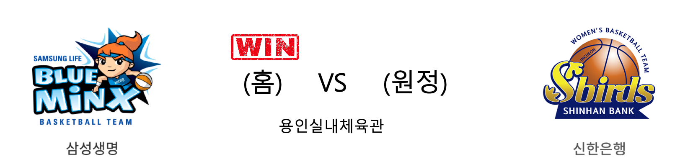

####  삼성생명(홈) VS 신한은행(원정) 

<table class="tg">
  <tr>
    <th class="tg-rr9t">삼성생명</th>
    <th class="tg-rr9t">팀</th>
    <th class="tg-rr9t">신한은행</th>
  </tr>
  <tr>
    <td class="tg-dcpn">2승 1패</td>
    <td class="tg-rr9t">시즌 상대전적</td>
    <td class="tg-dcpn">1승 2패</td>
  </tr>
  <tr>
    <td class="tg-dcpn">76</td>
    <td class="tg-rr9t">점수</td>
    <td class="tg-dcpn">70</td>
  </tr>
  <tr>
    <td class="tg-dcpn">23/45(51%)</td>
    <td class="tg-rr9t">2점(%)</td>
    <td class="tg-dcpn">15/32(47%)</td>
  </tr>
  <tr>
    <td class="tg-dcpn">6/20(30%)</td>
    <td class="tg-rr9t">3점(%)</td>
    <td class="tg-dcpn">8/23(35%)</td>
  </tr>
  <tr>
    <td class="tg-dcpn">12/12(100%)</td>
    <td class="tg-rr9t">자유투(%)</td>
    <td class="tg-dcpn">16/21(76%)</td>
  </tr>
  <tr>
    <td class="tg-dcpn">25</td>
    <td class="tg-rr9t">리바운드</td>
    <td class="tg-dcpn">33</td>
  </tr>
  <tr>
    <td class="tg-dcpn">22</td>
    <td class="tg-rr9t">어시스트</td>
    <td class="tg-dcpn">20</td>
  </tr>
  <tr>
    <td class="tg-dcpn">15</td>
    <td class="tg-rr9t">스틸</td>
    <td class="tg-dcpn">6</td>
  </tr>
  <tr>
    <td class="tg-dcpn">12</td>
    <td class="tg-rr9t">블록</td>
    <td class="tg-dcpn">24</td>
  </tr>
  <tr>
    <td class="tg-dcpn">23</td>
    <td class="tg-rr9t">턴오버</td>
    <td class="tg-dcpn">18</td>
  </tr>
  <tr>
    <td class="tg-dcpn">배혜윤(16) 김한별(16)</td>
    <td class="tg-rr9t">주요 득점선수</td>
    <td class="tg-dcpn">스미스(28)</td>
  </tr>
</table>

#### 경기 관련 주요 기사         

['김한별의 4Q 스웨그' 삼성생명, 신한은행 꺾고 7연패 탈출](http://www.rookie.co.kr/news/articleView.html?idxno=36612)

[삼성생명行 비키 바흐, 출전은 21일부터...팀은 수비에 기대](http://sports.news.naver.com/basketball/news/read.nhn?oid=065&aid=0000194160)

[삼성생명, 신한은행 제압하고 7연패 탈출…4쿼터 '한별 타임'](http://yna.kr/AKR20191219178900007?did=1195m)

['임의탈퇴' 박혜미, 삼성생명으로 복귀… 19일 신한은행전 출전 가능](http://www.basketkorea.com/news/articleView.html?idxno=190864)

        
        

#### 리그 순위

<table class="tg">
  <tr>
    <th class="tg-d14o">순위</th>
    <th class="tg-d14o">팀명</th>
    <th class="tg-d14o">경기수</th>
    <th class="tg-d14o">승</th>
    <th class="tg-d14o">패</th>
    <th class="tg-d14o">승차</th>
    <th class="tg-d14o">승률</th>
  </tr>
  
<tr>
    <td class="tg-50j8">1</td>
    <td class="tg-50j8">우리은행</td>
    <td class="tg-50j8">12</td>
    <td class="tg-50j8">10</td>
    <td class="tg-50j8">2</td>
    <td class="tg-50j8">0</td>
    <td class="tg-50j8">0.833</td>
</tr>

<tr>
    <td class="tg-50j8">1</td>
    <td class="tg-50j8">KB스타즈</td>
    <td class="tg-50j8">12</td>
    <td class="tg-50j8">10</td>
    <td class="tg-50j8">2</td>
    <td class="tg-50j8">0</td>
    <td class="tg-50j8">0.833</td>
</tr>

<tr>
    <td class="tg-50j8">3</td>
    <td class="tg-50j8">신한은행</td>
    <td class="tg-50j8">12</td>
    <td class="tg-50j8">5</td>
    <td class="tg-50j8">7</td>
    <td class="tg-50j8">5</td>
    <td class="tg-50j8">0.417</td>
</tr>

<tr>
    <td class="tg-50j8">4</td>
    <td class="tg-50j8">KEB하나</td>
    <td class="tg-50j8">12</td>
    <td class="tg-50j8">4</td>
    <td class="tg-50j8">8</td>
    <td class="tg-50j8">6</td>
    <td class="tg-50j8">0.333</td>
</tr>

<tr>
    <td class="tg-50j8">4</td>
    <td class="tg-50j8">삼성생명</td>
    <td class="tg-50j8">12</td>
    <td class="tg-50j8">4</td>
    <td class="tg-50j8">8</td>
    <td class="tg-50j8">6</td>
    <td class="tg-50j8">0.333</td>
</tr>

<tr>
    <td class="tg-50j8">6</td>
    <td class="tg-50j8">BNK썸</td>
    <td class="tg-50j8">12</td>
    <td class="tg-50j8">3</td>
    <td class="tg-50j8">9</td>
    <td class="tg-50j8">7</td>
    <td class="tg-50j8">0.25</td>
</tr>
</table> 

        
        
#wkbl #국내농구 #여자농구 #농구분석 #토토 #스포츠토토 #경기예측 #농구결과 #20191219 #삼성생명 #신한은행 #삼성생명신한은행 