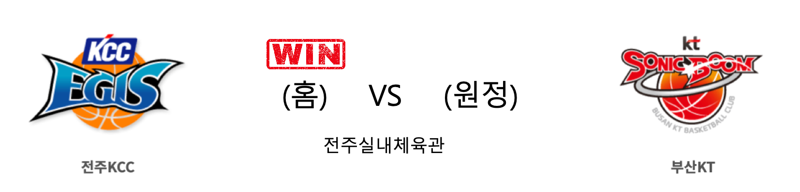
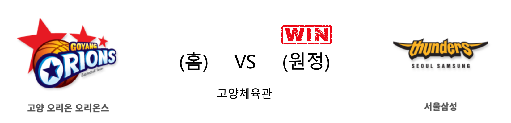

####  전주KCC(홈) VS 부산KT(원정) 

<table class="tg">
  <tr>
    <th class="tg-rr9t">전주KCC</th>
    <th class="tg-rr9t">팀</th>
    <th class="tg-rr9t">부산KT</th>
  </tr>
  <tr>
    <td class="tg-dcpn">2승 1패</td>
    <td class="tg-rr9t">시즌 상대전적</td>
    <td class="tg-dcpn">1승 2패</td>
  </tr>
  <tr>
    <td class="tg-dcpn">79</td>
    <td class="tg-rr9t">점수</td>
    <td class="tg-dcpn">78</td>
  </tr>
  <tr>
    <td class="tg-dcpn">21/46(46%)</td>
    <td class="tg-rr9t">2점(%)</td>
    <td class="tg-dcpn">23/46(50%)</td>
  </tr>
  <tr>
    <td class="tg-dcpn">9/22(41%)</td>
    <td class="tg-rr9t">3점(%)</td>
    <td class="tg-dcpn">9/24(38%)</td>
  </tr>
  <tr>
    <td class="tg-dcpn">10/16(62%)</td>
    <td class="tg-rr9t">자유투(%)</td>
    <td class="tg-dcpn">5/6(83%)</td>
  </tr>
  <tr>
    <td class="tg-dcpn">36</td>
    <td class="tg-rr9t">리바운드</td>
    <td class="tg-dcpn">35</td>
  </tr>
  <tr>
    <td class="tg-dcpn">2</td>
    <td class="tg-rr9t">어시스트</td>
    <td class="tg-dcpn">2</td>
  </tr>
  <tr>
    <td class="tg-dcpn">10</td>
    <td class="tg-rr9t">스틸</td>
    <td class="tg-dcpn">8</td>
  </tr>
  <tr>
    <td class="tg-dcpn">3</td>
    <td class="tg-rr9t">블록</td>
    <td class="tg-dcpn">6</td>
  </tr>
  <tr>
    <td class="tg-dcpn">15</td>
    <td class="tg-rr9t">턴오버</td>
    <td class="tg-dcpn">11</td>
  </tr>
  <tr>
    <td class="tg-dcpn">이정현(17) 라건아(17) 정창영(15)</td>
    <td class="tg-rr9t">주요 득점선수</td>
    <td class="tg-dcpn">알 쏜튼(17)</td>
  </tr>
</table>

#### 경기 관련 주요 기사         

[라건아 결승득점...KCC, KT 꺾고 3연승, 단독 3위](http://www.sportsseoul.com/news/read/863767)

['라건아 결승 득점' KCC, KT 꺾고 3연승...단독 3위 도약](http://www.dailysportshankook.co.kr/news/articleView.html?idxno=217757)

[[JB프리뷰] 상위권 향한 KCC-KT, 6강 향한 오리온-삼성...피할 수 없는 한 판](http://sports.news.naver.com/basketball/news/read.nhn?oid=065&aid=0000194217)

[돌파하는 KT 김윤태](http://yna.kr/PYH20191220168200055?did=1196m)

        
        

####  고양오리온(홈) VS 서울삼성(원정) 

<table class="tg">
  <tr>
    <th class="tg-rr9t">고양오리온</th>
    <th class="tg-rr9t">팀</th>
    <th class="tg-rr9t">서울삼성</th>
  </tr>
  <tr>
    <td class="tg-dcpn">1승 2패</td>
    <td class="tg-rr9t">시즌 상대전적</td>
    <td class="tg-dcpn">2승 1패</td>
  </tr>
  <tr>
    <td class="tg-dcpn">70</td>
    <td class="tg-rr9t">점수</td>
    <td class="tg-dcpn">79</td>
  </tr>
  <tr>
    <td class="tg-dcpn">20/41(49%)</td>
    <td class="tg-rr9t">2점(%)</td>
    <td class="tg-dcpn">27/56(48%)</td>
  </tr>
  <tr>
    <td class="tg-dcpn">7/21(33%)</td>
    <td class="tg-rr9t">3점(%)</td>
    <td class="tg-dcpn">6/18(33%)</td>
  </tr>
  <tr>
    <td class="tg-dcpn">9/13(69%)</td>
    <td class="tg-rr9t">자유투(%)</td>
    <td class="tg-dcpn">7/9(78%)</td>
  </tr>
  <tr>
    <td class="tg-dcpn">41</td>
    <td class="tg-rr9t">리바운드</td>
    <td class="tg-dcpn">36</td>
  </tr>
  <tr>
    <td class="tg-dcpn">0</td>
    <td class="tg-rr9t">어시스트</td>
    <td class="tg-dcpn">3</td>
  </tr>
  <tr>
    <td class="tg-dcpn">16</td>
    <td class="tg-rr9t">스틸</td>
    <td class="tg-dcpn">8</td>
  </tr>
  <tr>
    <td class="tg-dcpn">3</td>
    <td class="tg-rr9t">블록</td>
    <td class="tg-dcpn">12</td>
  </tr>
  <tr>
    <td class="tg-dcpn">24</td>
    <td class="tg-rr9t">턴오버</td>
    <td class="tg-dcpn">18</td>
  </tr>
  <tr>
    <td class="tg-dcpn">이승현(22) 김강선(18)</td>
    <td class="tg-rr9t">주요 득점선수</td>
    <td class="tg-dcpn">닉 미네라스(26) 김준일(22)</td>
  </tr>
</table>

#### 경기 관련 주요 기사         

[‘김준일·미네라스 48득점’ 삼성, 2연패 탈출·단독 7위…오리온 5연패](http://www.mydaily.co.kr/new_yk/html/read.php?newsid=201912201707942166&ext=na)

[삼성, 미네라스와 김준일 활약 앞세워 오리온 제압](http://www.sportsseoul.com/news/read/863766)

[[포토] 삼성 '오리온 상대 9점차 승리'](http://sports.chosun.com/news/ntype.htm?id=201912200100153380009803&servicedate=20191220)

[[JB프리뷰] 상위권 향한 KCC-KT, 6강 향한 오리온-삼성...피할 수 없는 한 판](http://sports.news.naver.com/basketball/news/read.nhn?oid=065&aid=0000194217)

        
        

#### 리그 순위

<table class="tg">
  <tr>
    <th class="tg-d14o">순위</th>
    <th class="tg-d14o">팀명</th>
    <th class="tg-d14o">경기수</th>
    <th class="tg-d14o">승</th>
    <th class="tg-d14o">패</th>
    <th class="tg-d14o">승차</th>
    <th class="tg-d14o">승률</th>
  </tr>
  
<tr>
    <td class="tg-50j8">1</td>
    <td class="tg-50j8">서울SK</td>
    <td class="tg-50j8">23</td>
    <td class="tg-50j8">17</td>
    <td class="tg-50j8">6</td>
    <td class="tg-50j8">0</td>
    <td class="tg-50j8">0.739</td>
</tr>

<tr>
    <td class="tg-50j8">2</td>
    <td class="tg-50j8">안양KGC</td>
    <td class="tg-50j8">23</td>
    <td class="tg-50j8">14</td>
    <td class="tg-50j8">9</td>
    <td class="tg-50j8">3</td>
    <td class="tg-50j8">0.609</td>
</tr>

<tr>
    <td class="tg-50j8">3</td>
    <td class="tg-50j8">전주KCC</td>
    <td class="tg-50j8">24</td>
    <td class="tg-50j8">14</td>
    <td class="tg-50j8">10</td>
    <td class="tg-50j8">3</td>
    <td class="tg-50j8">0.583</td>
</tr>

<tr>
    <td class="tg-50j8">4</td>
    <td class="tg-50j8">부산KT</td>
    <td class="tg-50j8">24</td>
    <td class="tg-50j8">13</td>
    <td class="tg-50j8">11</td>
    <td class="tg-50j8">4</td>
    <td class="tg-50j8">0.542</td>
</tr>

<tr>
    <td class="tg-50j8">5</td>
    <td class="tg-50j8">원주DB</td>
    <td class="tg-50j8">22</td>
    <td class="tg-50j8">12</td>
    <td class="tg-50j8">10</td>
    <td class="tg-50j8">5</td>
    <td class="tg-50j8">0.545</td>
</tr>

<tr>
    <td class="tg-50j8">5</td>
    <td class="tg-50j8">인천전자랜드</td>
    <td class="tg-50j8">22</td>
    <td class="tg-50j8">12</td>
    <td class="tg-50j8">10</td>
    <td class="tg-50j8">5</td>
    <td class="tg-50j8">0.545</td>
</tr>

<tr>
    <td class="tg-50j8">7</td>
    <td class="tg-50j8">서울삼성</td>
    <td class="tg-50j8">24</td>
    <td class="tg-50j8">10</td>
    <td class="tg-50j8">14</td>
    <td class="tg-50j8">7</td>
    <td class="tg-50j8">0.417</td>
</tr>

<tr>
    <td class="tg-50j8">8</td>
    <td class="tg-50j8">울산현대모비스</td>
    <td class="tg-50j8">23</td>
    <td class="tg-50j8">9</td>
    <td class="tg-50j8">14</td>
    <td class="tg-50j8">8</td>
    <td class="tg-50j8">0.391</td>
</tr>

<tr>
    <td class="tg-50j8">9</td>
    <td class="tg-50j8">창원LG</td>
    <td class="tg-50j8">23</td>
    <td class="tg-50j8">8</td>
    <td class="tg-50j8">15</td>
    <td class="tg-50j8">9</td>
    <td class="tg-50j8">0.348</td>
</tr>

<tr>
    <td class="tg-50j8">10</td>
    <td class="tg-50j8">고양오리온</td>
    <td class="tg-50j8">24</td>
    <td class="tg-50j8">7</td>
    <td class="tg-50j8">17</td>
    <td class="tg-50j8">10</td>
    <td class="tg-50j8">0.292</td>
</tr>
</table> 

        
        
#kbl #국내농구 #농구분석 #토토 #스포츠토토 #경기예측 #농구결과 #20191220 #전주KCC #부산KT #고양오리온 #서울삼성 #전주KCC부산KT #고양오리온서울삼성 