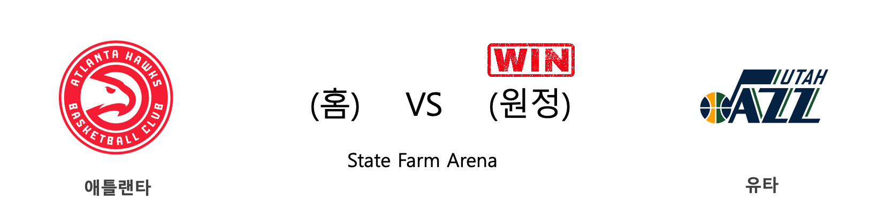

####  밀워키(홈) VS LA레이커스(원정) 

<table class="tg">
  <tr>
    <th class="tg-rr9t">MIL</th>
    <th class="tg-rr9t">팀</th>
    <th class="tg-rr9t">LAL</th>
  </tr>
  <tr>
    <td class="tg-dcpn">1승 0패</td>
    <td class="tg-rr9t">시즌 상대전적</td>
    <td class="tg-dcpn">0승 1패</td>
  </tr>
  <tr>
    <td class="tg-dcpn">111</td>
    <td class="tg-rr9t">점수</td>
    <td class="tg-dcpn">104</td>
  </tr>
  <tr>
    <td class="tg-dcpn">20/38(53%)</td>
    <td class="tg-rr9t">2점(%)</td>
    <td class="tg-dcpn">25/45(56%)</td>
  </tr>
  <tr>
    <td class="tg-dcpn">16/39(41%)</td>
    <td class="tg-rr9t">3점(%)</td>
    <td class="tg-dcpn">12/35(34%)</td>
  </tr>
  <tr>
    <td class="tg-dcpn">23/32(72%)</td>
    <td class="tg-rr9t">자유투(%)</td>
    <td class="tg-dcpn">18/23(78%)</td>
  </tr>
  <tr>
    <td class="tg-dcpn">40</td>
    <td class="tg-rr9t">리바운드</td>
    <td class="tg-dcpn">38</td>
  </tr>
  <tr>
    <td class="tg-dcpn">22</td>
    <td class="tg-rr9t">어시스트</td>
    <td class="tg-dcpn">24</td>
  </tr>
  <tr>
    <td class="tg-dcpn">14</td>
    <td class="tg-rr9t">스틸</td>
    <td class="tg-dcpn">4</td>
  </tr>
  <tr>
    <td class="tg-dcpn">7</td>
    <td class="tg-rr9t">블록</td>
    <td class="tg-dcpn">6</td>
  </tr>
  <tr>
    <td class="tg-dcpn">13</td>
    <td class="tg-rr9t">턴오버</td>
    <td class="tg-dcpn">18</td>
  </tr>
  <tr>
    <td class="tg-dcpn">GeorgeHill(21) GiannisAnteto(34) KhrisMiddleto(15)</td>
    <td class="tg-rr9t">주요 득점선수</td>
    <td class="tg-dcpn">AnthonyDavisF(36) LeBronJamesF(21) KentaviousCal(18) DannyGreenG(21)</td>
  </tr>
</table>

#### 경기 관련 주요 기사         

[[오늘의 NBA] (12/17) 댈러스, 밀워키 시스템을 붕괴시키다](http://sports.news.naver.com/basketball/news/read.nhn?oid=486&aid=0000001169)

["24-4 두 팀 맞대결은 역대 최초"…LAL-MIL '세기의 승부' 개봉박두](http://www.rookie.co.kr/news/articleView.html?idxno=36626)

[[위클리 NBA] ‘무조건 한 팀은 진다’ MIL vs LAL, 역사로 가는 길목서 충돌](http://sports.news.naver.com/basketball/news/read.nhn?oid=065&aid=0000194046)

[[오늘의 NBA] (12/20) 밀워키, 리그 전체 단독 1위 등극!](http://sports.news.naver.com/basketball/news/read.nhn?oid=486&aid=0000001172)

[[오늘의 NBA] (12/14) 레이커스, 마이애미 홈 코트를 점령하다](http://sports.news.naver.com/basketball/news/read.nhn?oid=486&aid=0000001166)

        
        

####  애틀랜타(홈) VS 유타(원정) 

<table class="tg">
  <tr>
    <th class="tg-rr9t">ATL</th>
    <th class="tg-rr9t">팀</th>
    <th class="tg-rr9t">UTA</th>
  </tr>
  <tr>
    <td class="tg-dcpn">0승 1패</td>
    <td class="tg-rr9t">시즌 상대전적</td>
    <td class="tg-dcpn">1승 0패</td>
  </tr>
  <tr>
    <td class="tg-dcpn">106</td>
    <td class="tg-rr9t">점수</td>
    <td class="tg-dcpn">111</td>
  </tr>
  <tr>
    <td class="tg-dcpn">28/61(46%)</td>
    <td class="tg-rr9t">2점(%)</td>
    <td class="tg-dcpn">33/59(56%)</td>
  </tr>
  <tr>
    <td class="tg-dcpn">11/29(38%)</td>
    <td class="tg-rr9t">3점(%)</td>
    <td class="tg-dcpn">6/24(25%)</td>
  </tr>
  <tr>
    <td class="tg-dcpn">17/19(89%)</td>
    <td class="tg-rr9t">자유투(%)</td>
    <td class="tg-dcpn">27/38(71%)</td>
  </tr>
  <tr>
    <td class="tg-dcpn">40</td>
    <td class="tg-rr9t">리바운드</td>
    <td class="tg-dcpn">53</td>
  </tr>
  <tr>
    <td class="tg-dcpn">24</td>
    <td class="tg-rr9t">어시스트</td>
    <td class="tg-dcpn">18</td>
  </tr>
  <tr>
    <td class="tg-dcpn">8</td>
    <td class="tg-rr9t">스틸</td>
    <td class="tg-dcpn">8</td>
  </tr>
  <tr>
    <td class="tg-dcpn">1</td>
    <td class="tg-rr9t">블록</td>
    <td class="tg-dcpn">6</td>
  </tr>
  <tr>
    <td class="tg-dcpn">16</td>
    <td class="tg-rr9t">턴오버</td>
    <td class="tg-dcpn">18</td>
  </tr>
  <tr>
    <td class="tg-dcpn">TraeYoungG(30) JabariParker(23) KevinHuerterG(17)</td>
    <td class="tg-rr9t">주요 득점선수</td>
    <td class="tg-dcpn">DonovanMitche(30) BojanBogdanov(19) RudyGobertC(20)</td>
  </tr>
</table>

#### 경기 관련 주요 기사         

[[오늘의 NBA] (12/16) 스펜서 딘위디, 브루클린 상승세를 이끈다!](http://sports.news.naver.com/basketball/news/read.nhn?oid=486&aid=0000001168)

[[오늘의 NBA] (12/14) 레이커스, 마이애미 홈 코트를 점령하다](http://sports.news.naver.com/basketball/news/read.nhn?oid=486&aid=0000001166)

[[오늘의 NBA] (12/12) 제임스 하든 선생님의 심폐소생술](http://sports.news.naver.com/basketball/news/read.nhn?oid=486&aid=0000001164)

[[오늘의 NBA] (12/10) 데릭 로즈, 모터 시티의 해결사](http://sports.news.naver.com/basketball/news/read.nhn?oid=486&aid=0000001162)

[[오늘의 NBA] (12/18) 인디애나, LAL 원정 연승 행진을 멈추다](http://sports.news.naver.com/basketball/news/read.nhn?oid=486&aid=0000001170)

        
        

####  LA클리퍼스(홈) VS 휴스턴(원정) 

<table class="tg">
  <tr>
    <th class="tg-rr9t">LAC</th>
    <th class="tg-rr9t">팀</th>
    <th class="tg-rr9t">HOU</th>
  </tr>
  <tr>
    <td class="tg-dcpn">1승 2패</td>
    <td class="tg-rr9t">시즌 상대전적</td>
    <td class="tg-dcpn">2승 1패</td>
  </tr>
  <tr>
    <td class="tg-dcpn">117</td>
    <td class="tg-rr9t">점수</td>
    <td class="tg-dcpn">122</td>
  </tr>
  <tr>
    <td class="tg-dcpn">27/50(54%)</td>
    <td class="tg-rr9t">2점(%)</td>
    <td class="tg-dcpn">29/49(59%)</td>
  </tr>
  <tr>
    <td class="tg-dcpn">16/37(43%)</td>
    <td class="tg-rr9t">3점(%)</td>
    <td class="tg-dcpn">14/37(38%)</td>
  </tr>
  <tr>
    <td class="tg-dcpn">15/19(79%)</td>
    <td class="tg-rr9t">자유투(%)</td>
    <td class="tg-dcpn">22/29(76%)</td>
  </tr>
  <tr>
    <td class="tg-dcpn">39</td>
    <td class="tg-rr9t">리바운드</td>
    <td class="tg-dcpn">43</td>
  </tr>
  <tr>
    <td class="tg-dcpn">23</td>
    <td class="tg-rr9t">어시스트</td>
    <td class="tg-dcpn">23</td>
  </tr>
  <tr>
    <td class="tg-dcpn">10</td>
    <td class="tg-rr9t">스틸</td>
    <td class="tg-dcpn">9</td>
  </tr>
  <tr>
    <td class="tg-dcpn">7</td>
    <td class="tg-rr9t">블록</td>
    <td class="tg-dcpn">4</td>
  </tr>
  <tr>
    <td class="tg-dcpn">18</td>
    <td class="tg-rr9t">턴오버</td>
    <td class="tg-dcpn">18</td>
  </tr>
  <tr>
    <td class="tg-dcpn">PaulGeorgeG(34) MontrezlHarre(19) KawhiLeonardF(25)</td>
    <td class="tg-rr9t">주요 득점선수</td>
    <td class="tg-dcpn">RussellWestbr(40) JamesHardenG(28) ClintCapelaC(16)</td>
  </tr>
</table>

#### 경기 관련 주요 기사         

[[오늘의 NBA] (12/15) 밤 아데바요, 연장전의 지배자](http://sports.news.naver.com/basketball/news/read.nhn?oid=486&aid=0000001167)

[[오늘의 NBA] (12/12) 제임스 하든 선생님의 심폐소생술](http://sports.news.naver.com/basketball/news/read.nhn?oid=486&aid=0000001164)

[[오늘의 NBA] (12/8) 뉴욕, NBA의 방랑자](http://sports.news.naver.com/basketball/news/read.nhn?oid=486&aid=0000001160)

[[오늘의 NBA] (12/10) 데릭 로즈, 모터 시티의 해결사](http://sports.news.naver.com/basketball/news/read.nhn?oid=486&aid=0000001162)

[[오늘의 NBA] (12/7) 르브론 제임스, 멜로(carmelo) 드라마의 주인공](http://sports.news.naver.com/basketball/news/read.nhn?oid=486&aid=0000001159)

        
        

####  샌안토니오(홈) VS 브루클린(원정) 

<table class="tg">
  <tr>
    <th class="tg-rr9t">SAS</th>
    <th class="tg-rr9t">팀</th>
    <th class="tg-rr9t">BKN</th>
  </tr>
  <tr>
    <td class="tg-dcpn">1승 0패</td>
    <td class="tg-rr9t">시즌 상대전적</td>
    <td class="tg-dcpn">0승 1패</td>
  </tr>
  <tr>
    <td class="tg-dcpn">118</td>
    <td class="tg-rr9t">점수</td>
    <td class="tg-dcpn">105</td>
  </tr>
  <tr>
    <td class="tg-dcpn">30/63(48%)</td>
    <td class="tg-rr9t">2점(%)</td>
    <td class="tg-dcpn">28/47(60%)</td>
  </tr>
  <tr>
    <td class="tg-dcpn">13/33(39%)</td>
    <td class="tg-rr9t">3점(%)</td>
    <td class="tg-dcpn">7/36(19%)</td>
  </tr>
  <tr>
    <td class="tg-dcpn">19/23(83%)</td>
    <td class="tg-rr9t">자유투(%)</td>
    <td class="tg-dcpn">28/30(93%)</td>
  </tr>
  <tr>
    <td class="tg-dcpn">47</td>
    <td class="tg-rr9t">리바운드</td>
    <td class="tg-dcpn">47</td>
  </tr>
  <tr>
    <td class="tg-dcpn">26</td>
    <td class="tg-rr9t">어시스트</td>
    <td class="tg-dcpn">16</td>
  </tr>
  <tr>
    <td class="tg-dcpn">10</td>
    <td class="tg-rr9t">스틸</td>
    <td class="tg-dcpn">9</td>
  </tr>
  <tr>
    <td class="tg-dcpn">8</td>
    <td class="tg-rr9t">블록</td>
    <td class="tg-dcpn">3</td>
  </tr>
  <tr>
    <td class="tg-dcpn">11</td>
    <td class="tg-rr9t">턴오버</td>
    <td class="tg-dcpn">18</td>
  </tr>
  <tr>
    <td class="tg-dcpn">PattyMills(27) LaMarcusAldri(20)</td>
    <td class="tg-rr9t">주요 득점선수</td>
    <td class="tg-dcpn">JarrettAllenC(19) SpencerDinwid(41)</td>
  </tr>
</table>

#### 경기 관련 주요 기사         

[[오늘의 NBA] (11/19) 댈러스의 루카 복음 낭송](http://sports.news.naver.com/basketball/news/read.nhn?oid=486&aid=0000001142)

[[오늘의 NBA] (12/15) 밤 아데바요, 연장전의 지배자](http://sports.news.naver.com/basketball/news/read.nhn?oid=486&aid=0000001167)

[[오늘의 NBA] (12/7) 르브론 제임스, 멜로(carmelo) 드라마의 주인공](http://sports.news.naver.com/basketball/news/read.nhn?oid=486&aid=0000001159)

[[오늘의 NBA] (12/6) 마이크 댄토니, 토론토 수비를 농락하다](http://sports.news.naver.com/basketball/news/read.nhn?oid=486&aid=0000001158)

[[오늘의 NBA] (12/16) 스펜서 딘위디, 브루클린 상승세를 이끈다!](http://sports.news.naver.com/basketball/news/read.nhn?oid=486&aid=0000001168)

        
        

#### 리그 (Eastern) 순위
    

<table class="tg">
  <tr>
    <th class="tg-d14o">순위</th>
    <th class="tg-d14o">팀명</th>
    <th class="tg-d14o">경기수</th>
    <th class="tg-d14o">승</th>
    <th class="tg-d14o">패</th>
    <th class="tg-d14o">승차</th>
    <th class="tg-d14o">승률</th>
  </tr>
  
<tr>
    <td class="tg-50j8">1</td>
    <td class="tg-50j8">MIL</td>
    <td class="tg-50j8">29</td>
    <td class="tg-50j8">25</td>
    <td class="tg-50j8">4</td>
    <td class="tg-50j8">0</td>
    <td class="tg-50j8">0.862</td>
</tr>

<tr>
    <td class="tg-50j8">2</td>
    <td class="tg-50j8">MIA</td>
    <td class="tg-50j8">28</td>
    <td class="tg-50j8">20</td>
    <td class="tg-50j8">8</td>
    <td class="tg-50j8">5</td>
    <td class="tg-50j8">0.714</td>
</tr>

<tr>
    <td class="tg-50j8">3</td>
    <td class="tg-50j8">TOR</td>
    <td class="tg-50j8">27</td>
    <td class="tg-50j8">19</td>
    <td class="tg-50j8">8</td>
    <td class="tg-50j8">6</td>
    <td class="tg-50j8">0.704</td>
</tr>

<tr>
    <td class="tg-50j8">4</td>
    <td class="tg-50j8">IND</td>
    <td class="tg-50j8">28</td>
    <td class="tg-50j8">19</td>
    <td class="tg-50j8">9</td>
    <td class="tg-50j8">6</td>
    <td class="tg-50j8">0.679</td>
</tr>

<tr>
    <td class="tg-50j8">4</td>
    <td class="tg-50j8">PHI</td>
    <td class="tg-50j8">28</td>
    <td class="tg-50j8">19</td>
    <td class="tg-50j8">9</td>
    <td class="tg-50j8">6</td>
    <td class="tg-50j8">0.679</td>
</tr>

<tr>
    <td class="tg-50j8">6</td>
    <td class="tg-50j8">BOS</td>
    <td class="tg-50j8">24</td>
    <td class="tg-50j8">18</td>
    <td class="tg-50j8">6</td>
    <td class="tg-50j8">7</td>
    <td class="tg-50j8">0.75</td>
</tr>

<tr>
    <td class="tg-50j8">7</td>
    <td class="tg-50j8">BKN</td>
    <td class="tg-50j8">28</td>
    <td class="tg-50j8">15</td>
    <td class="tg-50j8">13</td>
    <td class="tg-50j8">10</td>
    <td class="tg-50j8">0.536</td>
</tr>

<tr>
    <td class="tg-50j8">8</td>
    <td class="tg-50j8">CHA</td>
    <td class="tg-50j8">31</td>
    <td class="tg-50j8">13</td>
    <td class="tg-50j8">18</td>
    <td class="tg-50j8">12</td>
    <td class="tg-50j8">0.419</td>
</tr>

<tr>
    <td class="tg-50j8">9</td>
    <td class="tg-50j8">ORL</td>
    <td class="tg-50j8">28</td>
    <td class="tg-50j8">12</td>
    <td class="tg-50j8">16</td>
    <td class="tg-50j8">13</td>
    <td class="tg-50j8">0.429</td>
</tr>

<tr>
    <td class="tg-50j8">10</td>
    <td class="tg-50j8">DET</td>
    <td class="tg-50j8">27</td>
    <td class="tg-50j8">11</td>
    <td class="tg-50j8">16</td>
    <td class="tg-50j8">14</td>
    <td class="tg-50j8">0.407</td>
</tr>

<tr>
    <td class="tg-50j8">11</td>
    <td class="tg-50j8">CHI</td>
    <td class="tg-50j8">30</td>
    <td class="tg-50j8">11</td>
    <td class="tg-50j8">19</td>
    <td class="tg-50j8">14</td>
    <td class="tg-50j8">0.367</td>
</tr>

<tr>
    <td class="tg-50j8">12</td>
    <td class="tg-50j8">WAS</td>
    <td class="tg-50j8">26</td>
    <td class="tg-50j8">8</td>
    <td class="tg-50j8">18</td>
    <td class="tg-50j8">17</td>
    <td class="tg-50j8">0.308</td>
</tr>

<tr>
    <td class="tg-50j8">13</td>
    <td class="tg-50j8">NYK</td>
    <td class="tg-50j8">28</td>
    <td class="tg-50j8">7</td>
    <td class="tg-50j8">21</td>
    <td class="tg-50j8">18</td>
    <td class="tg-50j8">0.25</td>
</tr>

<tr>
    <td class="tg-50j8">14</td>
    <td class="tg-50j8">CLE</td>
    <td class="tg-50j8">27</td>
    <td class="tg-50j8">6</td>
    <td class="tg-50j8">21</td>
    <td class="tg-50j8">19</td>
    <td class="tg-50j8">0.222</td>
</tr>

<tr>
    <td class="tg-50j8">15</td>
    <td class="tg-50j8">ATL</td>
    <td class="tg-50j8">29</td>
    <td class="tg-50j8">6</td>
    <td class="tg-50j8">23</td>
    <td class="tg-50j8">19</td>
    <td class="tg-50j8">0.207</td>
</tr>
</table> 
#### 리그 (Western) 순위
    

<table class="tg">
  <tr>
    <th class="tg-d14o">순위</th>
    <th class="tg-d14o">팀명</th>
    <th class="tg-d14o">경기수</th>
    <th class="tg-d14o">승</th>
    <th class="tg-d14o">패</th>
    <th class="tg-d14o">승차</th>
    <th class="tg-d14o">승률</th>
  </tr>
  
<tr>
    <td class="tg-50j8">1</td>
    <td class="tg-50j8">LAL</td>
    <td class="tg-50j8">29</td>
    <td class="tg-50j8">24</td>
    <td class="tg-50j8">5</td>
    <td class="tg-50j8">1</td>
    <td class="tg-50j8">0.828</td>
</tr>

<tr>
    <td class="tg-50j8">2</td>
    <td class="tg-50j8">LAC</td>
    <td class="tg-50j8">30</td>
    <td class="tg-50j8">21</td>
    <td class="tg-50j8">9</td>
    <td class="tg-50j8">4</td>
    <td class="tg-50j8">0.7</td>
</tr>

<tr>
    <td class="tg-50j8">3</td>
    <td class="tg-50j8">HOU</td>
    <td class="tg-50j8">28</td>
    <td class="tg-50j8">19</td>
    <td class="tg-50j8">9</td>
    <td class="tg-50j8">6</td>
    <td class="tg-50j8">0.679</td>
</tr>

<tr>
    <td class="tg-50j8">4</td>
    <td class="tg-50j8">DEN</td>
    <td class="tg-50j8">25</td>
    <td class="tg-50j8">17</td>
    <td class="tg-50j8">8</td>
    <td class="tg-50j8">8</td>
    <td class="tg-50j8">0.68</td>
</tr>

<tr>
    <td class="tg-50j8">5</td>
    <td class="tg-50j8">DAL</td>
    <td class="tg-50j8">26</td>
    <td class="tg-50j8">17</td>
    <td class="tg-50j8">9</td>
    <td class="tg-50j8">8</td>
    <td class="tg-50j8">0.654</td>
</tr>

<tr>
    <td class="tg-50j8">6</td>
    <td class="tg-50j8">UTA</td>
    <td class="tg-50j8">28</td>
    <td class="tg-50j8">17</td>
    <td class="tg-50j8">11</td>
    <td class="tg-50j8">8</td>
    <td class="tg-50j8">0.607</td>
</tr>

<tr>
    <td class="tg-50j8">7</td>
    <td class="tg-50j8">OKC</td>
    <td class="tg-50j8">27</td>
    <td class="tg-50j8">13</td>
    <td class="tg-50j8">14</td>
    <td class="tg-50j8">12</td>
    <td class="tg-50j8">0.481</td>
</tr>

<tr>
    <td class="tg-50j8">8</td>
    <td class="tg-50j8">SAC</td>
    <td class="tg-50j8">27</td>
    <td class="tg-50j8">12</td>
    <td class="tg-50j8">15</td>
    <td class="tg-50j8">13</td>
    <td class="tg-50j8">0.444</td>
</tr>

<tr>
    <td class="tg-50j8">8</td>
    <td class="tg-50j8">POR</td>
    <td class="tg-50j8">27</td>
    <td class="tg-50j8">12</td>
    <td class="tg-50j8">15</td>
    <td class="tg-50j8">13</td>
    <td class="tg-50j8">0.444</td>
</tr>

<tr>
    <td class="tg-50j8">10</td>
    <td class="tg-50j8">SAS</td>
    <td class="tg-50j8">26</td>
    <td class="tg-50j8">11</td>
    <td class="tg-50j8">15</td>
    <td class="tg-50j8">14</td>
    <td class="tg-50j8">0.423</td>
</tr>

<tr>
    <td class="tg-50j8">11</td>
    <td class="tg-50j8">PHX</td>
    <td class="tg-50j8">27</td>
    <td class="tg-50j8">11</td>
    <td class="tg-50j8">16</td>
    <td class="tg-50j8">14</td>
    <td class="tg-50j8">0.407</td>
</tr>

<tr>
    <td class="tg-50j8">12</td>
    <td class="tg-50j8">MIN</td>
    <td class="tg-50j8">26</td>
    <td class="tg-50j8">10</td>
    <td class="tg-50j8">16</td>
    <td class="tg-50j8">15</td>
    <td class="tg-50j8">0.385</td>
</tr>

<tr>
    <td class="tg-50j8">13</td>
    <td class="tg-50j8">MEM</td>
    <td class="tg-50j8">28</td>
    <td class="tg-50j8">10</td>
    <td class="tg-50j8">18</td>
    <td class="tg-50j8">15</td>
    <td class="tg-50j8">0.357</td>
</tr>

<tr>
    <td class="tg-50j8">14</td>
    <td class="tg-50j8">NOP</td>
    <td class="tg-50j8">29</td>
    <td class="tg-50j8">7</td>
    <td class="tg-50j8">22</td>
    <td class="tg-50j8">18</td>
    <td class="tg-50j8">0.241</td>
</tr>

<tr>
    <td class="tg-50j8">15</td>
    <td class="tg-50j8">GSW</td>
    <td class="tg-50j8">29</td>
    <td class="tg-50j8">5</td>
    <td class="tg-50j8">24</td>
    <td class="tg-50j8">20</td>
    <td class="tg-50j8">0.172</td>
</tr>
</table> 

        
        
#nba #미국농구 #엔비에이 #농구분석 #토토 #스포츠토토 #경기예측 #농구결과 #20191220 #밀워키 #LA레이커스 #애틀랜타 #유타 #LA클리퍼스 #휴스턴 #샌안토니오 #브루클린 #밀워키LA레이커스 #애틀랜타유타 #LA클리퍼스휴스턴 #샌안토니오브루클린 