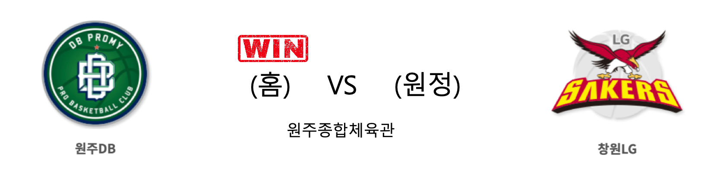

####  안양KGC(홈) VS 인천전자랜드(원정) 

<table class="tg">
  <tr>
    <th class="tg-rr9t">안양KGC</th>
    <th class="tg-rr9t">팀</th>
    <th class="tg-rr9t">인천전자랜드</th>
  </tr>
  <tr>
    <td class="tg-dcpn">3승 0패</td>
    <td class="tg-rr9t">시즌 상대전적</td>
    <td class="tg-dcpn">0승 3패</td>
  </tr>
  <tr>
    <td class="tg-dcpn">84</td>
    <td class="tg-rr9t">점수</td>
    <td class="tg-dcpn">74</td>
  </tr>
  <tr>
    <td class="tg-dcpn">18/35(51%)</td>
    <td class="tg-rr9t">2점(%)</td>
    <td class="tg-dcpn">19/35(54%)</td>
  </tr>
  <tr>
    <td class="tg-dcpn">14/42(33%)</td>
    <td class="tg-rr9t">3점(%)</td>
    <td class="tg-dcpn">6/20(30%)</td>
  </tr>
  <tr>
    <td class="tg-dcpn">6/8(75%)</td>
    <td class="tg-rr9t">자유투(%)</td>
    <td class="tg-dcpn">18/26(69%)</td>
  </tr>
  <tr>
    <td class="tg-dcpn">35</td>
    <td class="tg-rr9t">리바운드</td>
    <td class="tg-dcpn">38</td>
  </tr>
  <tr>
    <td class="tg-dcpn">3</td>
    <td class="tg-rr9t">어시스트</td>
    <td class="tg-dcpn">0</td>
  </tr>
  <tr>
    <td class="tg-dcpn">9</td>
    <td class="tg-rr9t">스틸</td>
    <td class="tg-dcpn">17</td>
  </tr>
  <tr>
    <td class="tg-dcpn">12</td>
    <td class="tg-rr9t">블록</td>
    <td class="tg-dcpn">3</td>
  </tr>
  <tr>
    <td class="tg-dcpn">13</td>
    <td class="tg-rr9t">턴오버</td>
    <td class="tg-dcpn">10</td>
  </tr>
  <tr>
    <td class="tg-dcpn">브랜든 브라운(18) 박지훈(24)</td>
    <td class="tg-rr9t">주요 득점선수</td>
    <td class="tg-dcpn">김낙현(15) 트로이 길렌워터(22)</td>
  </tr>
</table>

#### 경기 관련 주요 기사         

[[루키 프리뷰] '오누아쿠 돌아온' DB... KGC와 전자랜드의 상위권 매치](http://www.rookie.co.kr/news/articleView.html?idxno=36679)

['반격의 시작은 수비' 완성도가 높아진 KGC의 트랩 수비](http://www.dailysportshankook.co.kr/news/articleView.html?idxno=217792)

[전자랜드 만나면 힘솟는 KGC, 연승모드 ‘2위 수성’](http://mksports.co.kr/view/2019/1071716/)

['박지훈 시즌하이' KGC, 전자랜드 격파하며 연승 재시동](http://sports.news.naver.com/basketball/news/read.nhn?oid=065&aid=0000194277)

        
        

####  원주DB(홈) VS 창원LG(원정) 

<table class="tg">
  <tr>
    <th class="tg-rr9t">원주DB</th>
    <th class="tg-rr9t">팀</th>
    <th class="tg-rr9t">창원LG</th>
  </tr>
  <tr>
    <td class="tg-dcpn">3승 0패</td>
    <td class="tg-rr9t">시즌 상대전적</td>
    <td class="tg-dcpn">0승 3패</td>
  </tr>
  <tr>
    <td class="tg-dcpn">92</td>
    <td class="tg-rr9t">점수</td>
    <td class="tg-dcpn">81</td>
  </tr>
  <tr>
    <td class="tg-dcpn">20/37(54%)</td>
    <td class="tg-rr9t">2점(%)</td>
    <td class="tg-dcpn">13/32(41%)</td>
  </tr>
  <tr>
    <td class="tg-dcpn">10/23(43%)</td>
    <td class="tg-rr9t">3점(%)</td>
    <td class="tg-dcpn">9/28(32%)</td>
  </tr>
  <tr>
    <td class="tg-dcpn">22/26(85%)</td>
    <td class="tg-rr9t">자유투(%)</td>
    <td class="tg-dcpn">28/39(72%)</td>
  </tr>
  <tr>
    <td class="tg-dcpn">44</td>
    <td class="tg-rr9t">리바운드</td>
    <td class="tg-dcpn">29</td>
  </tr>
  <tr>
    <td class="tg-dcpn">1</td>
    <td class="tg-rr9t">어시스트</td>
    <td class="tg-dcpn">0</td>
  </tr>
  <tr>
    <td class="tg-dcpn">13</td>
    <td class="tg-rr9t">스틸</td>
    <td class="tg-dcpn">7</td>
  </tr>
  <tr>
    <td class="tg-dcpn">5</td>
    <td class="tg-rr9t">블록</td>
    <td class="tg-dcpn">10</td>
  </tr>
  <tr>
    <td class="tg-dcpn">19</td>
    <td class="tg-rr9t">턴오버</td>
    <td class="tg-dcpn">17</td>
  </tr>
  <tr>
    <td class="tg-dcpn">김종규(19)</td>
    <td class="tg-rr9t">주요 득점선수</td>
    <td class="tg-dcpn">캐디 라렌(18)</td>
  </tr>
</table>

#### 경기 관련 주요 기사         

['김종규 19점' DB 2연승, LG 3연패 수렁](http://www.mydaily.co.kr/new_yk/html/read.php?newsid=201912211711944566&ext=na)

['KBL 최초 팬 퍼레이드' DB와 원주 팬들이 만든 역사적 녹색 물결](http://www.rookie.co.kr/news/articleView.html?idxno=36691)

['김종규 19점 6리바운드' DB, LG에 92-81 승리](http://stoo.asiae.co.kr/article.php?aid=60684529226)

[원주 DB, 창원 LG전 승리하며 2연승 질주](http://www.kwnews.co.kr/view.asp?aid=219122000123&s=701)

        
        

####  울산현대모비스(홈) VS 서울SK(원정) 

<table class="tg">
  <tr>
    <th class="tg-rr9t">울산현대모비스</th>
    <th class="tg-rr9t">팀</th>
    <th class="tg-rr9t">서울SK</th>
  </tr>
  <tr>
    <td class="tg-dcpn">0승 3패</td>
    <td class="tg-rr9t">시즌 상대전적</td>
    <td class="tg-dcpn">3승 0패</td>
  </tr>
  <tr>
    <td class="tg-dcpn">66</td>
    <td class="tg-rr9t">점수</td>
    <td class="tg-dcpn">80</td>
  </tr>
  <tr>
    <td class="tg-dcpn">16/39(41%)</td>
    <td class="tg-rr9t">2점(%)</td>
    <td class="tg-dcpn">25/52(48%)</td>
  </tr>
  <tr>
    <td class="tg-dcpn">10/31(32%)</td>
    <td class="tg-rr9t">3점(%)</td>
    <td class="tg-dcpn">7/13(54%)</td>
  </tr>
  <tr>
    <td class="tg-dcpn">4/6(67%)</td>
    <td class="tg-rr9t">자유투(%)</td>
    <td class="tg-dcpn">9/9(100%)</td>
  </tr>
  <tr>
    <td class="tg-dcpn">26</td>
    <td class="tg-rr9t">리바운드</td>
    <td class="tg-dcpn">42</td>
  </tr>
  <tr>
    <td class="tg-dcpn">0</td>
    <td class="tg-rr9t">어시스트</td>
    <td class="tg-dcpn">1</td>
  </tr>
  <tr>
    <td class="tg-dcpn">8</td>
    <td class="tg-rr9t">스틸</td>
    <td class="tg-dcpn">11</td>
  </tr>
  <tr>
    <td class="tg-dcpn">5</td>
    <td class="tg-rr9t">블록</td>
    <td class="tg-dcpn">4</td>
  </tr>
  <tr>
    <td class="tg-dcpn">17</td>
    <td class="tg-rr9t">턴오버</td>
    <td class="tg-dcpn">20</td>
  </tr>
  <tr>
    <td class="tg-dcpn">에메카 오카포(15)</td>
    <td class="tg-rr9t">주요 득점선수</td>
    <td class="tg-dcpn">최준용(29) 자밀 워니(22)</td>
  </tr>
</table>

#### 경기 관련 주요 기사         

[[라커룸에서] 모비스 유재학 감독, “외곽 수비 강화하겠다”](http://sports.news.naver.com/basketball/news/read.nhn?oid=065&aid=0000194265)

[1·2위 SK·인삼공사, 나란히 승리…DB, LG 완패(종합)](http://www.newsis.com/view/?id=NISX20191221_0000867662&cID=10505&pID=10500)

[높이 앞세운 SK, 현대모비스 꺾으며 4연승 질주](http://www.rookie.co.kr/news/articleView.html?idxno=36721)

[현대모비스, SK와 홈경기 'K5데이' 선물 팍팍 쏜다](http://sports.chosun.com/news/ntype.htm?id=201912200100151980009695&servicedate=20191220)

        
        

#### 리그 순위

<table class="tg">
  <tr>
    <th class="tg-d14o">순위</th>
    <th class="tg-d14o">팀명</th>
    <th class="tg-d14o">경기수</th>
    <th class="tg-d14o">승</th>
    <th class="tg-d14o">패</th>
    <th class="tg-d14o">승차</th>
    <th class="tg-d14o">승률</th>
  </tr>
  
<tr>
    <td class="tg-50j8">1</td>
    <td class="tg-50j8">서울SK</td>
    <td class="tg-50j8">24</td>
    <td class="tg-50j8">18</td>
    <td class="tg-50j8">6</td>
    <td class="tg-50j8">0</td>
    <td class="tg-50j8">0.75</td>
</tr>

<tr>
    <td class="tg-50j8">2</td>
    <td class="tg-50j8">안양KGC</td>
    <td class="tg-50j8">24</td>
    <td class="tg-50j8">15</td>
    <td class="tg-50j8">9</td>
    <td class="tg-50j8">3</td>
    <td class="tg-50j8">0.625</td>
</tr>

<tr>
    <td class="tg-50j8">3</td>
    <td class="tg-50j8">전주KCC</td>
    <td class="tg-50j8">24</td>
    <td class="tg-50j8">14</td>
    <td class="tg-50j8">10</td>
    <td class="tg-50j8">4</td>
    <td class="tg-50j8">0.583</td>
</tr>

<tr>
    <td class="tg-50j8">4</td>
    <td class="tg-50j8">원주DB</td>
    <td class="tg-50j8">23</td>
    <td class="tg-50j8">13</td>
    <td class="tg-50j8">10</td>
    <td class="tg-50j8">5</td>
    <td class="tg-50j8">0.565</td>
</tr>

<tr>
    <td class="tg-50j8">5</td>
    <td class="tg-50j8">부산KT</td>
    <td class="tg-50j8">24</td>
    <td class="tg-50j8">13</td>
    <td class="tg-50j8">11</td>
    <td class="tg-50j8">5</td>
    <td class="tg-50j8">0.542</td>
</tr>

<tr>
    <td class="tg-50j8">6</td>
    <td class="tg-50j8">인천전자랜드</td>
    <td class="tg-50j8">23</td>
    <td class="tg-50j8">12</td>
    <td class="tg-50j8">11</td>
    <td class="tg-50j8">6</td>
    <td class="tg-50j8">0.522</td>
</tr>

<tr>
    <td class="tg-50j8">7</td>
    <td class="tg-50j8">서울삼성</td>
    <td class="tg-50j8">24</td>
    <td class="tg-50j8">10</td>
    <td class="tg-50j8">14</td>
    <td class="tg-50j8">8</td>
    <td class="tg-50j8">0.417</td>
</tr>

<tr>
    <td class="tg-50j8">8</td>
    <td class="tg-50j8">울산현대모비스</td>
    <td class="tg-50j8">24</td>
    <td class="tg-50j8">9</td>
    <td class="tg-50j8">15</td>
    <td class="tg-50j8">9</td>
    <td class="tg-50j8">0.375</td>
</tr>

<tr>
    <td class="tg-50j8">9</td>
    <td class="tg-50j8">창원LG</td>
    <td class="tg-50j8">24</td>
    <td class="tg-50j8">8</td>
    <td class="tg-50j8">16</td>
    <td class="tg-50j8">10</td>
    <td class="tg-50j8">0.333</td>
</tr>

<tr>
    <td class="tg-50j8">10</td>
    <td class="tg-50j8">고양오리온</td>
    <td class="tg-50j8">24</td>
    <td class="tg-50j8">7</td>
    <td class="tg-50j8">17</td>
    <td class="tg-50j8">11</td>
    <td class="tg-50j8">0.292</td>
</tr>
</table> 

        
        
#kbl #국내농구 #농구분석 #토토 #스포츠토토 #경기예측 #농구결과 #20191221 #안양KGC #인천전자랜드 #원주DB #창원LG #울산현대모비스 #서울SK #안양KGC인천전자랜드 #원주DB창원LG #울산현대모비스서울SK 