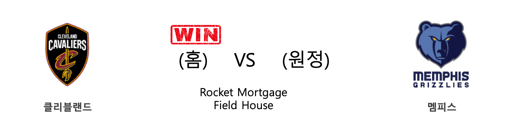
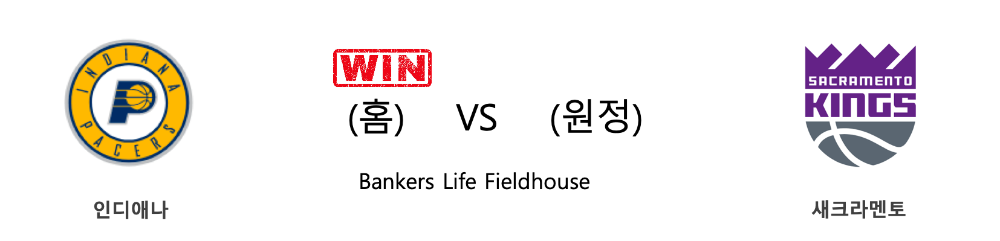
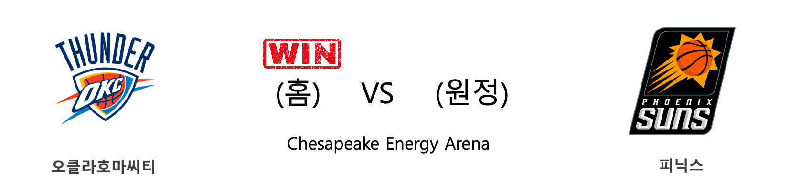
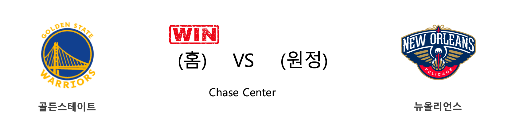
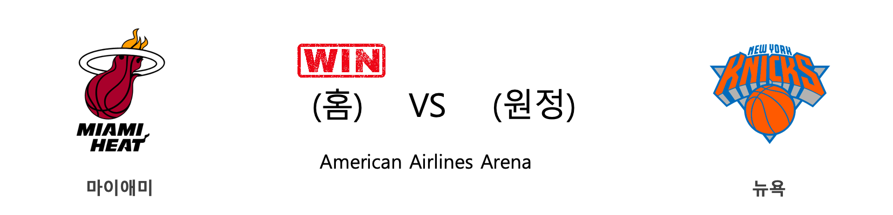

####  필라델피아(홈) VS 댈러스(원정) 

<table class="tg">
  <tr>
    <th class="tg-rr9t">PHI</th>
    <th class="tg-rr9t">팀</th>
    <th class="tg-rr9t">DAL</th>
  </tr>
  <tr>
    <td class="tg-dcpn">0승 1패</td>
    <td class="tg-rr9t">시즌 상대전적</td>
    <td class="tg-dcpn">1승 0패</td>
  </tr>
  <tr>
    <td class="tg-dcpn">98</td>
    <td class="tg-rr9t">점수</td>
    <td class="tg-dcpn">117</td>
  </tr>
  <tr>
    <td class="tg-dcpn">28/56(50%)</td>
    <td class="tg-rr9t">2점(%)</td>
    <td class="tg-dcpn">29/50(58%)</td>
  </tr>
  <tr>
    <td class="tg-dcpn">10/34(29%)</td>
    <td class="tg-rr9t">3점(%)</td>
    <td class="tg-dcpn">14/33(42%)</td>
  </tr>
  <tr>
    <td class="tg-dcpn">12/18(67%)</td>
    <td class="tg-rr9t">자유투(%)</td>
    <td class="tg-dcpn">17/22(77%)</td>
  </tr>
  <tr>
    <td class="tg-dcpn">46</td>
    <td class="tg-rr9t">리바운드</td>
    <td class="tg-dcpn">49</td>
  </tr>
  <tr>
    <td class="tg-dcpn">25</td>
    <td class="tg-rr9t">어시스트</td>
    <td class="tg-dcpn">23</td>
  </tr>
  <tr>
    <td class="tg-dcpn">9</td>
    <td class="tg-rr9t">스틸</td>
    <td class="tg-dcpn">10</td>
  </tr>
  <tr>
    <td class="tg-dcpn">2</td>
    <td class="tg-rr9t">블록</td>
    <td class="tg-dcpn">4</td>
  </tr>
  <tr>
    <td class="tg-dcpn">15</td>
    <td class="tg-rr9t">턴오버</td>
    <td class="tg-dcpn">16</td>
  </tr>
  <tr>
    <td class="tg-dcpn">JoelEmbiidC(33)</td>
    <td class="tg-rr9t">주요 득점선수</td>
    <td class="tg-dcpn">TimHardawayJr(27) KristapsPorzi(22)</td>
  </tr>
</table>

#### 경기 관련 주요 기사         

[[오늘의 NBA] (12/13) 조엘 엠비드, 천적 없는 보스턴 평원의 지배자](http://sports.news.naver.com/basketball/news/read.nhn?oid=486&aid=0000001165)

[[오늘의 NBA] (12/21) 크리스탑스 포르징기스, 댈러스의 새로운 버팀목](http://sports.news.naver.com/basketball/news/read.nhn?oid=486&aid=0000001173)

[[오늘의 NBA] (12/17) 댈러스, 밀워키 시스템을 붕괴시키다](http://sports.news.naver.com/basketball/news/read.nhn?oid=486&aid=0000001169)

[[오늘의 NBA] (12/19) 오클라호마시티, 역전의 달인!](http://sports.news.naver.com/basketball/news/read.nhn?oid=486&aid=0000001171)

[[오늘의 NBA] (12/14) 레이커스, 마이애미 홈 코트를 점령하다](http://sports.news.naver.com/basketball/news/read.nhn?oid=486&aid=0000001166)

        
        

####  보스턴(홈) VS 디트로이트(원정) 

<table class="tg">
  <tr>
    <th class="tg-rr9t">BOS</th>
    <th class="tg-rr9t">팀</th>
    <th class="tg-rr9t">DET</th>
  </tr>
  <tr>
    <td class="tg-dcpn">1승 0패</td>
    <td class="tg-rr9t">시즌 상대전적</td>
    <td class="tg-dcpn">0승 1패</td>
  </tr>
  <tr>
    <td class="tg-dcpn">114</td>
    <td class="tg-rr9t">점수</td>
    <td class="tg-dcpn">93</td>
  </tr>
  <tr>
    <td class="tg-dcpn">36/59(61%)</td>
    <td class="tg-rr9t">2점(%)</td>
    <td class="tg-dcpn">23/54(43%)</td>
  </tr>
  <tr>
    <td class="tg-dcpn">9/27(33%)</td>
    <td class="tg-rr9t">3점(%)</td>
    <td class="tg-dcpn">11/31(35%)</td>
  </tr>
  <tr>
    <td class="tg-dcpn">15/21(71%)</td>
    <td class="tg-rr9t">자유투(%)</td>
    <td class="tg-dcpn">14/19(74%)</td>
  </tr>
  <tr>
    <td class="tg-dcpn">51</td>
    <td class="tg-rr9t">리바운드</td>
    <td class="tg-dcpn">36</td>
  </tr>
  <tr>
    <td class="tg-dcpn">24</td>
    <td class="tg-rr9t">어시스트</td>
    <td class="tg-dcpn">21</td>
  </tr>
  <tr>
    <td class="tg-dcpn">13</td>
    <td class="tg-rr9t">스틸</td>
    <td class="tg-dcpn">13</td>
  </tr>
  <tr>
    <td class="tg-dcpn">9</td>
    <td class="tg-rr9t">블록</td>
    <td class="tg-dcpn">2</td>
  </tr>
  <tr>
    <td class="tg-dcpn">20</td>
    <td class="tg-rr9t">턴오버</td>
    <td class="tg-dcpn">24</td>
  </tr>
  <tr>
    <td class="tg-dcpn">JaylenBrownG(26) JaysonTatumF(26) GrantWilliams(18)</td>
    <td class="tg-rr9t">주요 득점선수</td>
    <td class="tg-dcpn">ThonMaker(15)</td>
  </tr>
</table>

#### 경기 관련 주요 기사         

[[오늘의 NBA] (12/13) 조엘 엠비드, 천적 없는 보스턴 평원의 지배자](http://sports.news.naver.com/basketball/news/read.nhn?oid=486&aid=0000001165)

[[오늘의 NBA] (12/21) 크리스탑스 포르징기스, 댈러스의 새로운 버팀목](http://sports.news.naver.com/basketball/news/read.nhn?oid=486&aid=0000001173)

[[오늘의 NBA] (12/11) 마이애미의 커리어 나이트 파티](http://sports.news.naver.com/basketball/news/read.nhn?oid=486&aid=0000001163)

[[오늘의 NBA] (12/20) 밀워키, 리그 전체 단독 1위 등극!](http://sports.news.naver.com/basketball/news/read.nhn?oid=486&aid=0000001172)

[[오늘의 NBA] (12/19) 오클라호마시티, 역전의 달인!](http://sports.news.naver.com/basketball/news/read.nhn?oid=486&aid=0000001171)

        
        

####  클리블랜드(홈) VS 멤피스(원정) 

<table class="tg">
  <tr>
    <th class="tg-rr9t">CLE</th>
    <th class="tg-rr9t">팀</th>
    <th class="tg-rr9t">MEM</th>
  </tr>
  <tr>
    <td class="tg-dcpn">1승 0패</td>
    <td class="tg-rr9t">시즌 상대전적</td>
    <td class="tg-dcpn">0승 1패</td>
  </tr>
  <tr>
    <td class="tg-dcpn">114</td>
    <td class="tg-rr9t">점수</td>
    <td class="tg-dcpn">107</td>
  </tr>
  <tr>
    <td class="tg-dcpn">23/55(42%)</td>
    <td class="tg-rr9t">2점(%)</td>
    <td class="tg-dcpn">30/61(49%)</td>
  </tr>
  <tr>
    <td class="tg-dcpn">17/37(46%)</td>
    <td class="tg-rr9t">3점(%)</td>
    <td class="tg-dcpn">14/41(34%)</td>
  </tr>
  <tr>
    <td class="tg-dcpn">17/23(74%)</td>
    <td class="tg-rr9t">자유투(%)</td>
    <td class="tg-dcpn">5/7(71%)</td>
  </tr>
  <tr>
    <td class="tg-dcpn">60</td>
    <td class="tg-rr9t">리바운드</td>
    <td class="tg-dcpn">46</td>
  </tr>
  <tr>
    <td class="tg-dcpn">26</td>
    <td class="tg-rr9t">어시스트</td>
    <td class="tg-dcpn">31</td>
  </tr>
  <tr>
    <td class="tg-dcpn">4</td>
    <td class="tg-rr9t">스틸</td>
    <td class="tg-dcpn">9</td>
  </tr>
  <tr>
    <td class="tg-dcpn">10</td>
    <td class="tg-rr9t">블록</td>
    <td class="tg-dcpn">8</td>
  </tr>
  <tr>
    <td class="tg-dcpn">14</td>
    <td class="tg-rr9t">턴오버</td>
    <td class="tg-dcpn">7</td>
  </tr>
  <tr>
    <td class="tg-dcpn">KevinLoveF(21) JordanClarkso(33)</td>
    <td class="tg-rr9t">주요 득점선수</td>
    <td class="tg-dcpn">JarenJacksonJ(24) DillonBrooksG(16)</td>
  </tr>
</table>

#### 경기 관련 주요 기사         

[[오늘의 NBA] (12/21) 크리스탑스 포르징기스, 댈러스의 새로운 버팀목](http://sports.news.naver.com/basketball/news/read.nhn?oid=486&aid=0000001173)

[[오늘의 NBA] (12/15) 밤 아데바요, 연장전의 지배자](http://sports.news.naver.com/basketball/news/read.nhn?oid=486&aid=0000001167)

[[오늘의 NBA] (12/12) 제임스 하든 선생님의 심폐소생술](http://sports.news.naver.com/basketball/news/read.nhn?oid=486&aid=0000001164)

[[오늘의 NBA] (12/19) 오클라호마시티, 역전의 달인!](http://sports.news.naver.com/basketball/news/read.nhn?oid=486&aid=0000001171)

[[오늘의 NBA] (12/17) 댈러스, 밀워키 시스템을 붕괴시키다](http://sports.news.naver.com/basketball/news/read.nhn?oid=486&aid=0000001169)

        
        

####  토론토(홈) VS 워싱턴(원정) 

<table class="tg">
  <tr>
    <th class="tg-rr9t">TOR</th>
    <th class="tg-rr9t">팀</th>
    <th class="tg-rr9t">WAS</th>
  </tr>
  <tr>
    <td class="tg-dcpn">1승 0패</td>
    <td class="tg-rr9t">시즌 상대전적</td>
    <td class="tg-dcpn">0승 1패</td>
  </tr>
  <tr>
    <td class="tg-dcpn">122</td>
    <td class="tg-rr9t">점수</td>
    <td class="tg-dcpn">118</td>
  </tr>
  <tr>
    <td class="tg-dcpn">26/48(54%)</td>
    <td class="tg-rr9t">2점(%)</td>
    <td class="tg-dcpn">26/48(54%)</td>
  </tr>
  <tr>
    <td class="tg-dcpn">12/30(40%)</td>
    <td class="tg-rr9t">3점(%)</td>
    <td class="tg-dcpn">14/39(36%)</td>
  </tr>
  <tr>
    <td class="tg-dcpn">34/44(77%)</td>
    <td class="tg-rr9t">자유투(%)</td>
    <td class="tg-dcpn">24/32(75%)</td>
  </tr>
  <tr>
    <td class="tg-dcpn">42</td>
    <td class="tg-rr9t">리바운드</td>
    <td class="tg-dcpn">39</td>
  </tr>
  <tr>
    <td class="tg-dcpn">26</td>
    <td class="tg-rr9t">어시스트</td>
    <td class="tg-dcpn">24</td>
  </tr>
  <tr>
    <td class="tg-dcpn">6</td>
    <td class="tg-rr9t">스틸</td>
    <td class="tg-dcpn">6</td>
  </tr>
  <tr>
    <td class="tg-dcpn">3</td>
    <td class="tg-rr9t">블록</td>
    <td class="tg-dcpn">1</td>
  </tr>
  <tr>
    <td class="tg-dcpn">17</td>
    <td class="tg-rr9t">턴오버</td>
    <td class="tg-dcpn">13</td>
  </tr>
  <tr>
    <td class="tg-dcpn">SergeIbakaC(23) KyleLowryG(26) FredVanVleetG(18) OGAnunobyF(18)</td>
    <td class="tg-rr9t">주요 득점선수</td>
    <td class="tg-dcpn">BradleyBealG(37) IshSmith(26)</td>
  </tr>
</table>

#### 경기 관련 주요 기사         

[Saudis’ Image Makers: A Troll Army and a Twitter Insider](https://www.nytimes.com/2018/10/20/us/politics/saudi-image-campaign-twitter.html?partner=naver)

[36 Hours in Berlin](https://www.nytimes.com/2019/10/31/travel/what-to-do-36-Hours-in-Berlin.html?partner=naver)

[[오늘의 NBA] (12/9) 앤써니 데이비스, 구단 역사에 이름을 남기다](http://sports.news.naver.com/basketball/news/read.nhn?oid=486&aid=0000001161)

[[오늘의 NBA] (12/12) 제임스 하든 선생님의 심폐소생술](http://sports.news.naver.com/basketball/news/read.nhn?oid=486&aid=0000001164)

        
        

####  인디애나(홈) VS 새크라멘토(원정) 

<table class="tg">
  <tr>
    <th class="tg-rr9t">IND</th>
    <th class="tg-rr9t">팀</th>
    <th class="tg-rr9t">SAC</th>
  </tr>
  <tr>
    <td class="tg-dcpn">1승 0패</td>
    <td class="tg-rr9t">시즌 상대전적</td>
    <td class="tg-dcpn">0승 1패</td>
  </tr>
  <tr>
    <td class="tg-dcpn">119</td>
    <td class="tg-rr9t">점수</td>
    <td class="tg-dcpn">105</td>
  </tr>
  <tr>
    <td class="tg-dcpn">31/55(56%)</td>
    <td class="tg-rr9t">2점(%)</td>
    <td class="tg-dcpn">31/59(53%)</td>
  </tr>
  <tr>
    <td class="tg-dcpn">14/31(45%)</td>
    <td class="tg-rr9t">3점(%)</td>
    <td class="tg-dcpn">10/32(31%)</td>
  </tr>
  <tr>
    <td class="tg-dcpn">15/18(83%)</td>
    <td class="tg-rr9t">자유투(%)</td>
    <td class="tg-dcpn">13/15(87%)</td>
  </tr>
  <tr>
    <td class="tg-dcpn">39</td>
    <td class="tg-rr9t">리바운드</td>
    <td class="tg-dcpn">42</td>
  </tr>
  <tr>
    <td class="tg-dcpn">34</td>
    <td class="tg-rr9t">어시스트</td>
    <td class="tg-dcpn">25</td>
  </tr>
  <tr>
    <td class="tg-dcpn">5</td>
    <td class="tg-rr9t">스틸</td>
    <td class="tg-dcpn">4</td>
  </tr>
  <tr>
    <td class="tg-dcpn">7</td>
    <td class="tg-rr9t">블록</td>
    <td class="tg-dcpn">6</td>
  </tr>
  <tr>
    <td class="tg-dcpn">9</td>
    <td class="tg-rr9t">턴오버</td>
    <td class="tg-dcpn">10</td>
  </tr>
  <tr>
    <td class="tg-dcpn">T.J.WarrenF(23) DomantasSabon(15) MylesTurnerC(17) T.J.McConnell(15)</td>
    <td class="tg-rr9t">주요 득점선수</td>
    <td class="tg-dcpn">MarvinBagleyI(17) RichaunHolmes(20)</td>
  </tr>
</table>

#### 경기 관련 주요 기사         

[[오늘의 NBA] (12/16) 스펜서 딘위디, 브루클린 상승세를 이끈다!](http://sports.news.naver.com/basketball/news/read.nhn?oid=486&aid=0000001168)

[[오늘의 NBA] (12/14) 레이커스, 마이애미 홈 코트를 점령하다](http://sports.news.naver.com/basketball/news/read.nhn?oid=486&aid=0000001166)

[[오늘의 NBA] (12/18) 인디애나, LAL 원정 연승 행진을 멈추다](http://sports.news.naver.com/basketball/news/read.nhn?oid=486&aid=0000001170)

[[오늘의 NBA] (12/21) 크리스탑스 포르징기스, 댈러스의 새로운 버팀목](http://sports.news.naver.com/basketball/news/read.nhn?oid=486&aid=0000001173)

[[오늘의 NBA] (11/19) 댈러스의 루카 복음 낭송](http://sports.news.naver.com/basketball/news/read.nhn?oid=486&aid=0000001142)

        
        

####  덴버(홈) VS 미네소타(원정) 

<table class="tg">
  <tr>
    <th class="tg-rr9t">DEN</th>
    <th class="tg-rr9t">팀</th>
    <th class="tg-rr9t">MIN</th>
  </tr>
  <tr>
    <td class="tg-dcpn">2승 0패</td>
    <td class="tg-rr9t">시즌 상대전적</td>
    <td class="tg-dcpn">0승 2패</td>
  </tr>
  <tr>
    <td class="tg-dcpn">109</td>
    <td class="tg-rr9t">점수</td>
    <td class="tg-dcpn">100</td>
  </tr>
  <tr>
    <td class="tg-dcpn">34/61(56%)</td>
    <td class="tg-rr9t">2점(%)</td>
    <td class="tg-dcpn">26/45(58%)</td>
  </tr>
  <tr>
    <td class="tg-dcpn">10/28(36%)</td>
    <td class="tg-rr9t">3점(%)</td>
    <td class="tg-dcpn">10/42(24%)</td>
  </tr>
  <tr>
    <td class="tg-dcpn">11/12(92%)</td>
    <td class="tg-rr9t">자유투(%)</td>
    <td class="tg-dcpn">18/27(67%)</td>
  </tr>
  <tr>
    <td class="tg-dcpn">44</td>
    <td class="tg-rr9t">리바운드</td>
    <td class="tg-dcpn">46</td>
  </tr>
  <tr>
    <td class="tg-dcpn">27</td>
    <td class="tg-rr9t">어시스트</td>
    <td class="tg-dcpn">20</td>
  </tr>
  <tr>
    <td class="tg-dcpn">9</td>
    <td class="tg-rr9t">스틸</td>
    <td class="tg-dcpn">8</td>
  </tr>
  <tr>
    <td class="tg-dcpn">5</td>
    <td class="tg-rr9t">블록</td>
    <td class="tg-dcpn">8</td>
  </tr>
  <tr>
    <td class="tg-dcpn">15</td>
    <td class="tg-rr9t">턴오버</td>
    <td class="tg-dcpn">14</td>
  </tr>
  <tr>
    <td class="tg-dcpn">JamalMurrayG(28) NikolaJokicC(22)</td>
    <td class="tg-rr9t">주요 득점선수</td>
    <td class="tg-dcpn">GorguiDiengC(18) AndrewWiggins(19)</td>
  </tr>
</table>

#### 경기 관련 주요 기사         

[[오늘의 NBA] (12/21) 크리스탑스 포르징기스, 댈러스의 새로운 버팀목](http://sports.news.naver.com/basketball/news/read.nhn?oid=486&aid=0000001173)

[[오늘의 NBA] (12/7) 르브론 제임스, 멜로(carmelo) 드라마의 주인공](http://sports.news.naver.com/basketball/news/read.nhn?oid=486&aid=0000001159)

[[오늘의 NBA] (12/9) 앤써니 데이비스, 구단 역사에 이름을 남기다](http://sports.news.naver.com/basketball/news/read.nhn?oid=486&aid=0000001161)

[[오늘의 NBA] (12/19) 오클라호마시티, 역전의 달인!](http://sports.news.naver.com/basketball/news/read.nhn?oid=486&aid=0000001171)

[[오늘의 NBA] (12/14) 레이커스, 마이애미 홈 코트를 점령하다](http://sports.news.naver.com/basketball/news/read.nhn?oid=486&aid=0000001166)

        
        

####  오클라호마씨티(홈) VS 피닉스(원정) 

<table class="tg">
  <tr>
    <th class="tg-rr9t">OKC</th>
    <th class="tg-rr9t">팀</th>
    <th class="tg-rr9t">PHX</th>
  </tr>
  <tr>
    <td class="tg-dcpn">1승 0패</td>
    <td class="tg-rr9t">시즌 상대전적</td>
    <td class="tg-dcpn">0승 1패</td>
  </tr>
  <tr>
    <td class="tg-dcpn">126</td>
    <td class="tg-rr9t">점수</td>
    <td class="tg-dcpn">108</td>
  </tr>
  <tr>
    <td class="tg-dcpn">39/63(62%)</td>
    <td class="tg-rr9t">2점(%)</td>
    <td class="tg-dcpn">27/55(49%)</td>
  </tr>
  <tr>
    <td class="tg-dcpn">10/24(42%)</td>
    <td class="tg-rr9t">3점(%)</td>
    <td class="tg-dcpn">11/32(34%)</td>
  </tr>
  <tr>
    <td class="tg-dcpn">18/21(86%)</td>
    <td class="tg-rr9t">자유투(%)</td>
    <td class="tg-dcpn">21/23(91%)</td>
  </tr>
  <tr>
    <td class="tg-dcpn">41</td>
    <td class="tg-rr9t">리바운드</td>
    <td class="tg-dcpn">37</td>
  </tr>
  <tr>
    <td class="tg-dcpn">23</td>
    <td class="tg-rr9t">어시스트</td>
    <td class="tg-dcpn">26</td>
  </tr>
  <tr>
    <td class="tg-dcpn">7</td>
    <td class="tg-rr9t">스틸</td>
    <td class="tg-dcpn">9</td>
  </tr>
  <tr>
    <td class="tg-dcpn">7</td>
    <td class="tg-rr9t">블록</td>
    <td class="tg-dcpn">4</td>
  </tr>
  <tr>
    <td class="tg-dcpn">15</td>
    <td class="tg-rr9t">턴오버</td>
    <td class="tg-dcpn">15</td>
  </tr>
  <tr>
    <td class="tg-dcpn">ChrisPaulG(15) ShaiGilgeous-(32) DaniloGallina(22) DennisSchrode(24)</td>
    <td class="tg-rr9t">주요 득점선수</td>
    <td class="tg-dcpn">DevinBookerG(18) DarioSaricF(16) RickyRubioG(24)</td>
  </tr>
</table>

#### 경기 관련 주요 기사         

[[오늘의 NBA] (12/19) 오클라호마시티, 역전의 달인!](http://sports.news.naver.com/basketball/news/read.nhn?oid=486&aid=0000001171)

[[오늘의 NBA] (12/21) 크리스탑스 포르징기스, 댈러스의 새로운 버팀목](http://sports.news.naver.com/basketball/news/read.nhn?oid=486&aid=0000001173)

[[오늘의 NBA] (12/17) 댈러스, 밀워키 시스템을 붕괴시키다](http://sports.news.naver.com/basketball/news/read.nhn?oid=486&aid=0000001169)

[[오늘의 NBA] (12/12) 제임스 하든 선생님의 심폐소생술](http://sports.news.naver.com/basketball/news/read.nhn?oid=486&aid=0000001164)

[[오늘의 NBA] (12/15) 밤 아데바요, 연장전의 지배자](http://sports.news.naver.com/basketball/news/read.nhn?oid=486&aid=0000001167)

        
        

####  포틀랜드(홈) VS 올랜도(원정) 

<table class="tg">
  <tr>
    <th class="tg-rr9t">POR</th>
    <th class="tg-rr9t">팀</th>
    <th class="tg-rr9t">ORL</th>
  </tr>
  <tr>
    <td class="tg-dcpn">1승 0패</td>
    <td class="tg-rr9t">시즌 상대전적</td>
    <td class="tg-dcpn">0승 1패</td>
  </tr>
  <tr>
    <td class="tg-dcpn">118</td>
    <td class="tg-rr9t">점수</td>
    <td class="tg-dcpn">103</td>
  </tr>
  <tr>
    <td class="tg-dcpn">25/48(52%)</td>
    <td class="tg-rr9t">2점(%)</td>
    <td class="tg-dcpn">32/78(41%)</td>
  </tr>
  <tr>
    <td class="tg-dcpn">17/36(47%)</td>
    <td class="tg-rr9t">3점(%)</td>
    <td class="tg-dcpn">7/28(25%)</td>
  </tr>
  <tr>
    <td class="tg-dcpn">17/19(89%)</td>
    <td class="tg-rr9t">자유투(%)</td>
    <td class="tg-dcpn">18/26(69%)</td>
  </tr>
  <tr>
    <td class="tg-dcpn">54</td>
    <td class="tg-rr9t">리바운드</td>
    <td class="tg-dcpn">48</td>
  </tr>
  <tr>
    <td class="tg-dcpn">16</td>
    <td class="tg-rr9t">어시스트</td>
    <td class="tg-dcpn">21</td>
  </tr>
  <tr>
    <td class="tg-dcpn">4</td>
    <td class="tg-rr9t">스틸</td>
    <td class="tg-dcpn">14</td>
  </tr>
  <tr>
    <td class="tg-dcpn">11</td>
    <td class="tg-rr9t">블록</td>
    <td class="tg-dcpn">5</td>
  </tr>
  <tr>
    <td class="tg-dcpn">20</td>
    <td class="tg-rr9t">턴오버</td>
    <td class="tg-dcpn">10</td>
  </tr>
  <tr>
    <td class="tg-dcpn">CJMcCollumG(31) DamianLillard(36)</td>
    <td class="tg-rr9t">주요 득점선수</td>
    <td class="tg-dcpn">D.J.Augustin(17) EvanFournierG(16) NikolaVucevic(23)</td>
  </tr>
</table>

#### 경기 관련 주요 기사         

[[오늘의 NBA] (12/17) 댈러스, 밀워키 시스템을 붕괴시키다](http://sports.news.naver.com/basketball/news/read.nhn?oid=486&aid=0000001169)

[[오늘의 NBA] (12/21) 크리스탑스 포르징기스, 댈러스의 새로운 버팀목](http://sports.news.naver.com/basketball/news/read.nhn?oid=486&aid=0000001173)

[[오늘의 NBA] (12/19) 오클라호마시티, 역전의 달인!](http://sports.news.naver.com/basketball/news/read.nhn?oid=486&aid=0000001171)

[[오늘의 NBA] (12/14) 레이커스, 마이애미 홈 코트를 점령하다](http://sports.news.naver.com/basketball/news/read.nhn?oid=486&aid=0000001166)

[[오늘의 NBA] (12/11) 마이애미의 커리어 나이트 파티](http://sports.news.naver.com/basketball/news/read.nhn?oid=486&aid=0000001163)

        
        

####  골든스테이트(홈) VS 뉴올리언스(원정) 

<table class="tg">
  <tr>
    <th class="tg-rr9t">GSW</th>
    <th class="tg-rr9t">팀</th>
    <th class="tg-rr9t">NOP</th>
  </tr>
  <tr>
    <td class="tg-dcpn">2승 1패</td>
    <td class="tg-rr9t">시즌 상대전적</td>
    <td class="tg-dcpn">1승 2패</td>
  </tr>
  <tr>
    <td class="tg-dcpn">106</td>
    <td class="tg-rr9t">점수</td>
    <td class="tg-dcpn">102</td>
  </tr>
  <tr>
    <td class="tg-dcpn">26/50(52%)</td>
    <td class="tg-rr9t">2점(%)</td>
    <td class="tg-dcpn">30/59(51%)</td>
  </tr>
  <tr>
    <td class="tg-dcpn">10/33(30%)</td>
    <td class="tg-rr9t">3점(%)</td>
    <td class="tg-dcpn">9/34(26%)</td>
  </tr>
  <tr>
    <td class="tg-dcpn">24/25(96%)</td>
    <td class="tg-rr9t">자유투(%)</td>
    <td class="tg-dcpn">15/23(65%)</td>
  </tr>
  <tr>
    <td class="tg-dcpn">47</td>
    <td class="tg-rr9t">리바운드</td>
    <td class="tg-dcpn">48</td>
  </tr>
  <tr>
    <td class="tg-dcpn">25</td>
    <td class="tg-rr9t">어시스트</td>
    <td class="tg-dcpn">23</td>
  </tr>
  <tr>
    <td class="tg-dcpn">10</td>
    <td class="tg-rr9t">스틸</td>
    <td class="tg-dcpn">8</td>
  </tr>
  <tr>
    <td class="tg-dcpn">4</td>
    <td class="tg-rr9t">블록</td>
    <td class="tg-dcpn">5</td>
  </tr>
  <tr>
    <td class="tg-dcpn">17</td>
    <td class="tg-rr9t">턴오버</td>
    <td class="tg-dcpn">17</td>
  </tr>
  <tr>
    <td class="tg-dcpn">AlecBurks(18) DamionLeeG(20) D'AngeloRusse(25)</td>
    <td class="tg-rr9t">주요 득점선수</td>
    <td class="tg-dcpn">BrandonIngram(25) JrueHolidayG(25)</td>
  </tr>
</table>

#### 경기 관련 주요 기사         

[[오늘의 NBA] (12/19) 오클라호마시티, 역전의 달인!](http://sports.news.naver.com/basketball/news/read.nhn?oid=486&aid=0000001171)

[[오늘의 NBA] (12/21) 크리스탑스 포르징기스, 댈러스의 새로운 버팀목](http://sports.news.naver.com/basketball/news/read.nhn?oid=486&aid=0000001173)

[[★리뷰] '커리 26점 맹폭' GSW, NOP 완파 '휴, 드디어 첫 승'](http://star.mt.co.kr/stview.php?no=2019102910551983830)

[[오늘의 NBA] (12/16) 스펜서 딘위디, 브루클린 상승세를 이끈다!](http://sports.news.naver.com/basketball/news/read.nhn?oid=486&aid=0000001168)

        
        

####  마이애미(홈) VS 뉴욕(원정) 

<table class="tg">
  <tr>
    <th class="tg-rr9t">MIA</th>
    <th class="tg-rr9t">팀</th>
    <th class="tg-rr9t">NYK</th>
  </tr>
  <tr>
    <td class="tg-dcpn">1승 0패</td>
    <td class="tg-rr9t">시즌 상대전적</td>
    <td class="tg-dcpn">0승 1패</td>
  </tr>
  <tr>
    <td class="tg-dcpn">129</td>
    <td class="tg-rr9t">점수</td>
    <td class="tg-dcpn">114</td>
  </tr>
  <tr>
    <td class="tg-dcpn">25/39(64%)</td>
    <td class="tg-rr9t">2점(%)</td>
    <td class="tg-dcpn">31/60(52%)</td>
  </tr>
  <tr>
    <td class="tg-dcpn">18/38(47%)</td>
    <td class="tg-rr9t">3점(%)</td>
    <td class="tg-dcpn">10/34(29%)</td>
  </tr>
  <tr>
    <td class="tg-dcpn">25/34(74%)</td>
    <td class="tg-rr9t">자유투(%)</td>
    <td class="tg-dcpn">22/33(67%)</td>
  </tr>
  <tr>
    <td class="tg-dcpn">51</td>
    <td class="tg-rr9t">리바운드</td>
    <td class="tg-dcpn">41</td>
  </tr>
  <tr>
    <td class="tg-dcpn">34</td>
    <td class="tg-rr9t">어시스트</td>
    <td class="tg-dcpn">23</td>
  </tr>
  <tr>
    <td class="tg-dcpn">6</td>
    <td class="tg-rr9t">스틸</td>
    <td class="tg-dcpn">11</td>
  </tr>
  <tr>
    <td class="tg-dcpn">3</td>
    <td class="tg-rr9t">블록</td>
    <td class="tg-dcpn">2</td>
  </tr>
  <tr>
    <td class="tg-dcpn">17</td>
    <td class="tg-rr9t">턴오버</td>
    <td class="tg-dcpn">8</td>
  </tr>
  <tr>
    <td class="tg-dcpn">KendrickNunnG(15) DuncanRobinso(18) GoranDragic(18) BamAdebayoF(20)</td>
    <td class="tg-rr9t">주요 득점선수</td>
    <td class="tg-dcpn">BobbyPortis(30) MitchellRobin(18) MarcusMorrisS(15)</td>
  </tr>
</table>

#### 경기 관련 주요 기사         

[[오늘의 NBA] (12/21) 크리스탑스 포르징기스, 댈러스의 새로운 버팀목](http://sports.news.naver.com/basketball/news/read.nhn?oid=486&aid=0000001173)

[[오늘의 NBA] (12/14) 레이커스, 마이애미 홈 코트를 점령하다](http://sports.news.naver.com/basketball/news/read.nhn?oid=486&aid=0000001166)

[[오늘의 NBA] (11/17) 샬럿, 설계된 플레이 연출의 달인](http://sports.news.naver.com/basketball/news/read.nhn?oid=486&aid=0000001140)

[[오늘의 NBA] (12/19) 오클라호마시티, 역전의 달인!](http://sports.news.naver.com/basketball/news/read.nhn?oid=486&aid=0000001171)

[[오늘의 NBA] (12/12) 제임스 하든 선생님의 심폐소생술](http://sports.news.naver.com/basketball/news/read.nhn?oid=486&aid=0000001164)

        
        

#### 리그 (Eastern) 순위
    

<table class="tg">
  <tr>
    <th class="tg-d14o">순위</th>
    <th class="tg-d14o">팀명</th>
    <th class="tg-d14o">경기수</th>
    <th class="tg-d14o">승</th>
    <th class="tg-d14o">패</th>
    <th class="tg-d14o">승차</th>
    <th class="tg-d14o">승률</th>
  </tr>
  
<tr>
    <td class="tg-50j8">1</td>
    <td class="tg-50j8">MIL</td>
    <td class="tg-50j8">29</td>
    <td class="tg-50j8">25</td>
    <td class="tg-50j8">4</td>
    <td class="tg-50j8">0</td>
    <td class="tg-50j8">0.862</td>
</tr>

<tr>
    <td class="tg-50j8">2</td>
    <td class="tg-50j8">MIA</td>
    <td class="tg-50j8">29</td>
    <td class="tg-50j8">21</td>
    <td class="tg-50j8">8</td>
    <td class="tg-50j8">4</td>
    <td class="tg-50j8">0.724</td>
</tr>

<tr>
    <td class="tg-50j8">3</td>
    <td class="tg-50j8">TOR</td>
    <td class="tg-50j8">28</td>
    <td class="tg-50j8">20</td>
    <td class="tg-50j8">8</td>
    <td class="tg-50j8">5</td>
    <td class="tg-50j8">0.714</td>
</tr>

<tr>
    <td class="tg-50j8">4</td>
    <td class="tg-50j8">IND</td>
    <td class="tg-50j8">29</td>
    <td class="tg-50j8">20</td>
    <td class="tg-50j8">9</td>
    <td class="tg-50j8">5</td>
    <td class="tg-50j8">0.69</td>
</tr>

<tr>
    <td class="tg-50j8">5</td>
    <td class="tg-50j8">BOS</td>
    <td class="tg-50j8">25</td>
    <td class="tg-50j8">19</td>
    <td class="tg-50j8">6</td>
    <td class="tg-50j8">6</td>
    <td class="tg-50j8">0.76</td>
</tr>

<tr>
    <td class="tg-50j8">6</td>
    <td class="tg-50j8">PHI</td>
    <td class="tg-50j8">29</td>
    <td class="tg-50j8">19</td>
    <td class="tg-50j8">10</td>
    <td class="tg-50j8">6</td>
    <td class="tg-50j8">0.655</td>
</tr>

<tr>
    <td class="tg-50j8">7</td>
    <td class="tg-50j8">BKN</td>
    <td class="tg-50j8">28</td>
    <td class="tg-50j8">15</td>
    <td class="tg-50j8">13</td>
    <td class="tg-50j8">10</td>
    <td class="tg-50j8">0.536</td>
</tr>

<tr>
    <td class="tg-50j8">8</td>
    <td class="tg-50j8">CHA</td>
    <td class="tg-50j8">31</td>
    <td class="tg-50j8">13</td>
    <td class="tg-50j8">18</td>
    <td class="tg-50j8">12</td>
    <td class="tg-50j8">0.419</td>
</tr>

<tr>
    <td class="tg-50j8">9</td>
    <td class="tg-50j8">ORL</td>
    <td class="tg-50j8">29</td>
    <td class="tg-50j8">12</td>
    <td class="tg-50j8">17</td>
    <td class="tg-50j8">13</td>
    <td class="tg-50j8">0.414</td>
</tr>

<tr>
    <td class="tg-50j8">10</td>
    <td class="tg-50j8">DET</td>
    <td class="tg-50j8">28</td>
    <td class="tg-50j8">11</td>
    <td class="tg-50j8">17</td>
    <td class="tg-50j8">14</td>
    <td class="tg-50j8">0.393</td>
</tr>

<tr>
    <td class="tg-50j8">11</td>
    <td class="tg-50j8">CHI</td>
    <td class="tg-50j8">30</td>
    <td class="tg-50j8">11</td>
    <td class="tg-50j8">19</td>
    <td class="tg-50j8">14</td>
    <td class="tg-50j8">0.367</td>
</tr>

<tr>
    <td class="tg-50j8">12</td>
    <td class="tg-50j8">WAS</td>
    <td class="tg-50j8">27</td>
    <td class="tg-50j8">8</td>
    <td class="tg-50j8">19</td>
    <td class="tg-50j8">17</td>
    <td class="tg-50j8">0.296</td>
</tr>

<tr>
    <td class="tg-50j8">13</td>
    <td class="tg-50j8">CLE</td>
    <td class="tg-50j8">28</td>
    <td class="tg-50j8">7</td>
    <td class="tg-50j8">21</td>
    <td class="tg-50j8">18</td>
    <td class="tg-50j8">0.25</td>
</tr>

<tr>
    <td class="tg-50j8">14</td>
    <td class="tg-50j8">NYK</td>
    <td class="tg-50j8">29</td>
    <td class="tg-50j8">7</td>
    <td class="tg-50j8">22</td>
    <td class="tg-50j8">18</td>
    <td class="tg-50j8">0.241</td>
</tr>

<tr>
    <td class="tg-50j8">15</td>
    <td class="tg-50j8">ATL</td>
    <td class="tg-50j8">29</td>
    <td class="tg-50j8">6</td>
    <td class="tg-50j8">23</td>
    <td class="tg-50j8">19</td>
    <td class="tg-50j8">0.207</td>
</tr>
</table> 
#### 리그 (Western) 순위
    

<table class="tg">
  <tr>
    <th class="tg-d14o">순위</th>
    <th class="tg-d14o">팀명</th>
    <th class="tg-d14o">경기수</th>
    <th class="tg-d14o">승</th>
    <th class="tg-d14o">패</th>
    <th class="tg-d14o">승차</th>
    <th class="tg-d14o">승률</th>
  </tr>
  
<tr>
    <td class="tg-50j8">1</td>
    <td class="tg-50j8">LAL</td>
    <td class="tg-50j8">29</td>
    <td class="tg-50j8">24</td>
    <td class="tg-50j8">5</td>
    <td class="tg-50j8">1</td>
    <td class="tg-50j8">0.828</td>
</tr>

<tr>
    <td class="tg-50j8">2</td>
    <td class="tg-50j8">LAC</td>
    <td class="tg-50j8">30</td>
    <td class="tg-50j8">21</td>
    <td class="tg-50j8">9</td>
    <td class="tg-50j8">4</td>
    <td class="tg-50j8">0.7</td>
</tr>

<tr>
    <td class="tg-50j8">3</td>
    <td class="tg-50j8">HOU</td>
    <td class="tg-50j8">28</td>
    <td class="tg-50j8">19</td>
    <td class="tg-50j8">9</td>
    <td class="tg-50j8">6</td>
    <td class="tg-50j8">0.679</td>
</tr>

<tr>
    <td class="tg-50j8">4</td>
    <td class="tg-50j8">DEN</td>
    <td class="tg-50j8">26</td>
    <td class="tg-50j8">18</td>
    <td class="tg-50j8">8</td>
    <td class="tg-50j8">7</td>
    <td class="tg-50j8">0.692</td>
</tr>

<tr>
    <td class="tg-50j8">5</td>
    <td class="tg-50j8">DAL</td>
    <td class="tg-50j8">27</td>
    <td class="tg-50j8">18</td>
    <td class="tg-50j8">9</td>
    <td class="tg-50j8">7</td>
    <td class="tg-50j8">0.667</td>
</tr>

<tr>
    <td class="tg-50j8">6</td>
    <td class="tg-50j8">UTA</td>
    <td class="tg-50j8">28</td>
    <td class="tg-50j8">17</td>
    <td class="tg-50j8">11</td>
    <td class="tg-50j8">8</td>
    <td class="tg-50j8">0.607</td>
</tr>

<tr>
    <td class="tg-50j8">7</td>
    <td class="tg-50j8">OKC</td>
    <td class="tg-50j8">28</td>
    <td class="tg-50j8">14</td>
    <td class="tg-50j8">14</td>
    <td class="tg-50j8">11</td>
    <td class="tg-50j8">0.5</td>
</tr>

<tr>
    <td class="tg-50j8">8</td>
    <td class="tg-50j8">POR</td>
    <td class="tg-50j8">28</td>
    <td class="tg-50j8">13</td>
    <td class="tg-50j8">15</td>
    <td class="tg-50j8">12</td>
    <td class="tg-50j8">0.464</td>
</tr>

<tr>
    <td class="tg-50j8">9</td>
    <td class="tg-50j8">SAC</td>
    <td class="tg-50j8">28</td>
    <td class="tg-50j8">12</td>
    <td class="tg-50j8">16</td>
    <td class="tg-50j8">13</td>
    <td class="tg-50j8">0.429</td>
</tr>

<tr>
    <td class="tg-50j8">10</td>
    <td class="tg-50j8">SAS</td>
    <td class="tg-50j8">26</td>
    <td class="tg-50j8">11</td>
    <td class="tg-50j8">15</td>
    <td class="tg-50j8">14</td>
    <td class="tg-50j8">0.423</td>
</tr>

<tr>
    <td class="tg-50j8">11</td>
    <td class="tg-50j8">PHX</td>
    <td class="tg-50j8">28</td>
    <td class="tg-50j8">11</td>
    <td class="tg-50j8">17</td>
    <td class="tg-50j8">14</td>
    <td class="tg-50j8">0.393</td>
</tr>

<tr>
    <td class="tg-50j8">12</td>
    <td class="tg-50j8">MIN</td>
    <td class="tg-50j8">27</td>
    <td class="tg-50j8">10</td>
    <td class="tg-50j8">17</td>
    <td class="tg-50j8">15</td>
    <td class="tg-50j8">0.37</td>
</tr>

<tr>
    <td class="tg-50j8">13</td>
    <td class="tg-50j8">MEM</td>
    <td class="tg-50j8">29</td>
    <td class="tg-50j8">10</td>
    <td class="tg-50j8">19</td>
    <td class="tg-50j8">15</td>
    <td class="tg-50j8">0.345</td>
</tr>

<tr>
    <td class="tg-50j8">14</td>
    <td class="tg-50j8">NOP</td>
    <td class="tg-50j8">30</td>
    <td class="tg-50j8">7</td>
    <td class="tg-50j8">23</td>
    <td class="tg-50j8">18</td>
    <td class="tg-50j8">0.233</td>
</tr>

<tr>
    <td class="tg-50j8">15</td>
    <td class="tg-50j8">GSW</td>
    <td class="tg-50j8">30</td>
    <td class="tg-50j8">6</td>
    <td class="tg-50j8">24</td>
    <td class="tg-50j8">19</td>
    <td class="tg-50j8">0.2</td>
</tr>
</table> 

        
        
#nba #미국농구 #엔비에이 #농구분석 #토토 #스포츠토토 #경기예측 #농구결과 #20191221 #필라델피아 #댈러스 #보스턴 #디트로이트 #클리블랜드 #멤피스 #토론토 #워싱턴 #인디애나 #새크라멘토 #덴버 #미네소타 #오클라호마씨티 #피닉스 #포틀랜드 #올랜도 #골든스테이트 #뉴올리언스 #마이애미 #뉴욕 #필라델피아댈러스 #보스턴디트로이트 #클리블랜드멤피스 #토론토워싱턴 #인디애나새크라멘토 #덴버미네소타 #오클라호마씨티피닉스 #포틀랜드올랜도 #골든스테이트뉴올리언스 #마이애미뉴욕 