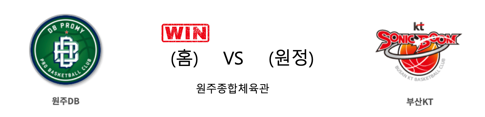

####  원주DB(홈) VS 부산KT(원정) 

<table class="tg">
  <tr>
    <th class="tg-rr9t">원주DB</th>
    <th class="tg-rr9t">팀</th>
    <th class="tg-rr9t">부산KT</th>
  </tr>
  <tr>
    <td class="tg-dcpn">3승 0패</td>
    <td class="tg-rr9t">시즌 상대전적</td>
    <td class="tg-dcpn">0승 3패</td>
  </tr>
  <tr>
    <td class="tg-dcpn">91</td>
    <td class="tg-rr9t">점수</td>
    <td class="tg-dcpn">73</td>
  </tr>
  <tr>
    <td class="tg-dcpn">28/43(65%)</td>
    <td class="tg-rr9t">2점(%)</td>
    <td class="tg-dcpn">17/38(45%)</td>
  </tr>
  <tr>
    <td class="tg-dcpn">10/29(34%)</td>
    <td class="tg-rr9t">3점(%)</td>
    <td class="tg-dcpn">10/29(34%)</td>
  </tr>
  <tr>
    <td class="tg-dcpn">5/7(71%)</td>
    <td class="tg-rr9t">자유투(%)</td>
    <td class="tg-dcpn">9/11(82%)</td>
  </tr>
  <tr>
    <td class="tg-dcpn">31</td>
    <td class="tg-rr9t">리바운드</td>
    <td class="tg-dcpn">41</td>
  </tr>
  <tr>
    <td class="tg-dcpn">4</td>
    <td class="tg-rr9t">어시스트</td>
    <td class="tg-dcpn">0</td>
  </tr>
  <tr>
    <td class="tg-dcpn">8</td>
    <td class="tg-rr9t">스틸</td>
    <td class="tg-dcpn">19</td>
  </tr>
  <tr>
    <td class="tg-dcpn">12</td>
    <td class="tg-rr9t">블록</td>
    <td class="tg-dcpn">3</td>
  </tr>
  <tr>
    <td class="tg-dcpn">20</td>
    <td class="tg-rr9t">턴오버</td>
    <td class="tg-dcpn">16</td>
  </tr>
  <tr>
    <td class="tg-dcpn">칼렙 그린(20) 허웅(25) 김민구(19)</td>
    <td class="tg-rr9t">주요 득점선수</td>
    <td class="tg-dcpn">양홍석(15)</td>
  </tr>
</table>

#### 경기 관련 주요 기사         

[‘허웅 시즌 최다 25득점’ DB, 4연패 후 3연승 질주…KT는 3연패](http://www.mydaily.co.kr/new_yk/html/read.php?newsid=201912221614253696&ext=na)

["원주에 청춘을 바쳤습니다" 24년 만에 DB 떠나는 박순진 코치의 마지막 인사](http://www.rookie.co.kr/news/articleView.html?idxno=36746)

[[JB화보] 원주 DB, 원주에서 부산 KT에 91대 73으로 승리](http://sports.news.naver.com/basketball/news/read.nhn?oid=065&aid=0000194364)

        
        

####  고양오리온(홈) VS 전주KCC(원정) 

<table class="tg">
  <tr>
    <th class="tg-rr9t">고양오리온</th>
    <th class="tg-rr9t">팀</th>
    <th class="tg-rr9t">전주KCC</th>
  </tr>
  <tr>
    <td class="tg-dcpn">1승 2패</td>
    <td class="tg-rr9t">시즌 상대전적</td>
    <td class="tg-dcpn">2승 1패</td>
  </tr>
  <tr>
    <td class="tg-dcpn">72</td>
    <td class="tg-rr9t">점수</td>
    <td class="tg-dcpn">88</td>
  </tr>
  <tr>
    <td class="tg-dcpn">26/40(65%)</td>
    <td class="tg-rr9t">2점(%)</td>
    <td class="tg-dcpn">31/50(62%)</td>
  </tr>
  <tr>
    <td class="tg-dcpn">2/20(10%)</td>
    <td class="tg-rr9t">3점(%)</td>
    <td class="tg-dcpn">5/21(24%)</td>
  </tr>
  <tr>
    <td class="tg-dcpn">14/20(70%)</td>
    <td class="tg-rr9t">자유투(%)</td>
    <td class="tg-dcpn">11/14(79%)</td>
  </tr>
  <tr>
    <td class="tg-dcpn">36</td>
    <td class="tg-rr9t">리바운드</td>
    <td class="tg-dcpn">31</td>
  </tr>
  <tr>
    <td class="tg-dcpn">1</td>
    <td class="tg-rr9t">어시스트</td>
    <td class="tg-dcpn">3</td>
  </tr>
  <tr>
    <td class="tg-dcpn">15</td>
    <td class="tg-rr9t">스틸</td>
    <td class="tg-dcpn">6</td>
  </tr>
  <tr>
    <td class="tg-dcpn">3</td>
    <td class="tg-rr9t">블록</td>
    <td class="tg-dcpn">13</td>
  </tr>
  <tr>
    <td class="tg-dcpn">16</td>
    <td class="tg-rr9t">턴오버</td>
    <td class="tg-dcpn">26</td>
  </tr>
  <tr>
    <td class="tg-dcpn">최진수(16) 보리스 사보비치(19)</td>
    <td class="tg-rr9t">주요 득점선수</td>
    <td class="tg-dcpn">라건아(23) 송교창(19)</td>
  </tr>
</table>

#### 경기 관련 주요 기사         

[[포토]오리온, KCC전 패배하며 6연패 수렁](http://isplus.live.joins.com/news/article/article.asp?total_id=23663210)

[[BK Review] '득점 우위 39분 29초' KCC, 오리온에 낙승 거두고 4연승 질주](http://www.basketkorea.com/news/articleView.html?idxno=190948)

[라건아·송교창 '펄펄'…4연승 KCC, 2위와 0.5경기 차(종합)](http://yna.kr/AKR20191222041651007?did=1195m)

[두 자릿 수 득점만 5명, KCC 오리온 꺾고 4연승 질주](http://www.sportsseoul.com/news/read/864300)

        
        

####  울산현대모비스(홈) VS 서울삼성(원정) 

<table class="tg">
  <tr>
    <th class="tg-rr9t">울산현대모비스</th>
    <th class="tg-rr9t">팀</th>
    <th class="tg-rr9t">서울삼성</th>
  </tr>
  <tr>
    <td class="tg-dcpn">1승 2패</td>
    <td class="tg-rr9t">시즌 상대전적</td>
    <td class="tg-dcpn">2승 1패</td>
  </tr>
  <tr>
    <td class="tg-dcpn">73</td>
    <td class="tg-rr9t">점수</td>
    <td class="tg-dcpn">75</td>
  </tr>
  <tr>
    <td class="tg-dcpn">21/46(46%)</td>
    <td class="tg-rr9t">2점(%)</td>
    <td class="tg-dcpn">20/41(49%)</td>
  </tr>
  <tr>
    <td class="tg-dcpn">8/19(42%)</td>
    <td class="tg-rr9t">3점(%)</td>
    <td class="tg-dcpn">8/25(32%)</td>
  </tr>
  <tr>
    <td class="tg-dcpn">7/11(64%)</td>
    <td class="tg-rr9t">자유투(%)</td>
    <td class="tg-dcpn">11/13(85%)</td>
  </tr>
  <tr>
    <td class="tg-dcpn">38</td>
    <td class="tg-rr9t">리바운드</td>
    <td class="tg-dcpn">32</td>
  </tr>
  <tr>
    <td class="tg-dcpn">3</td>
    <td class="tg-rr9t">어시스트</td>
    <td class="tg-dcpn">1</td>
  </tr>
  <tr>
    <td class="tg-dcpn">10</td>
    <td class="tg-rr9t">스틸</td>
    <td class="tg-dcpn">7</td>
  </tr>
  <tr>
    <td class="tg-dcpn">4</td>
    <td class="tg-rr9t">블록</td>
    <td class="tg-dcpn">4</td>
  </tr>
  <tr>
    <td class="tg-dcpn">19</td>
    <td class="tg-rr9t">턴오버</td>
    <td class="tg-dcpn">14</td>
  </tr>
  <tr>
    <td class="tg-dcpn"></td>
    <td class="tg-rr9t">주요 득점선수</td>
    <td class="tg-dcpn">닉 미네라스(19)</td>
  </tr>
</table>

#### 경기 관련 주요 기사         

[[JB화보] 서울 삼성, 울산 현대모비스에 75대 73으로 승리](http://sports.news.naver.com/basketball/news/read.nhn?oid=065&aid=0000194389)

['미네라스 19점' 삼성, 접전 끝에 현대모비스 격파](http://stoo.asiae.co.kr/article.php?aid=60716759973)

[[라커룸에서] 현대모비스 유재학 감독, “삼성 중심은 김준일”](http://sports.news.naver.com/basketball/news/read.nhn?oid=065&aid=0000194327)

        
        

####  창원LG(홈) VS 인천전자랜드(원정) 

<table class="tg">
  <tr>
    <th class="tg-rr9t">창원LG</th>
    <th class="tg-rr9t">팀</th>
    <th class="tg-rr9t">인천전자랜드</th>
  </tr>
  <tr>
    <td class="tg-dcpn">2승 1패</td>
    <td class="tg-rr9t">시즌 상대전적</td>
    <td class="tg-dcpn">1승 2패</td>
  </tr>
  <tr>
    <td class="tg-dcpn">85</td>
    <td class="tg-rr9t">점수</td>
    <td class="tg-dcpn">80</td>
  </tr>
  <tr>
    <td class="tg-dcpn">19/30(63%)</td>
    <td class="tg-rr9t">2점(%)</td>
    <td class="tg-dcpn">19/36(53%)</td>
  </tr>
  <tr>
    <td class="tg-dcpn">10/29(34%)</td>
    <td class="tg-rr9t">3점(%)</td>
    <td class="tg-dcpn">6/26(23%)</td>
  </tr>
  <tr>
    <td class="tg-dcpn">17/20(85%)</td>
    <td class="tg-rr9t">자유투(%)</td>
    <td class="tg-dcpn">24/25(96%)</td>
  </tr>
  <tr>
    <td class="tg-dcpn">31</td>
    <td class="tg-rr9t">리바운드</td>
    <td class="tg-dcpn">33</td>
  </tr>
  <tr>
    <td class="tg-dcpn">3</td>
    <td class="tg-rr9t">어시스트</td>
    <td class="tg-dcpn">0</td>
  </tr>
  <tr>
    <td class="tg-dcpn">11</td>
    <td class="tg-rr9t">스틸</td>
    <td class="tg-dcpn">8</td>
  </tr>
  <tr>
    <td class="tg-dcpn">3</td>
    <td class="tg-rr9t">블록</td>
    <td class="tg-dcpn">8</td>
  </tr>
  <tr>
    <td class="tg-dcpn">12</td>
    <td class="tg-rr9t">턴오버</td>
    <td class="tg-dcpn">16</td>
  </tr>
  <tr>
    <td class="tg-dcpn">마이크 해리스(17) 캐디 라렌(22)</td>
    <td class="tg-rr9t">주요 득점선수</td>
    <td class="tg-dcpn">트로이 길렌워터(33)</td>
  </tr>
</table>

#### 경기 관련 주요 기사         

['라렌 22득점' LG, 전자랜드 제물로 3연패 탈출](http://stoo.asiae.co.kr/article.php?aid=60716955596)

[‘김시래 4쿼터 11득점’ LG, 갈 길 바쁜 전자랜드 잡았다](http://news.kmib.co.kr/article/view.asp?arcid=0014057705&code=61161411&cp=nv)

[[BK Review] '두 자리 3점포' LG, 전자랜드 꺾고 3연패 탈출](http://www.basketkorea.com/news/articleView.html?idxno=190960)

[LG, 전자랜드전 85-80 승리...3연패 탈출](http://www.osen.co.kr/article/G1111281907)

        
        

#### 리그 순위

<table class="tg">
  <tr>
    <th class="tg-d14o">순위</th>
    <th class="tg-d14o">팀명</th>
    <th class="tg-d14o">경기수</th>
    <th class="tg-d14o">승</th>
    <th class="tg-d14o">패</th>
    <th class="tg-d14o">승차</th>
    <th class="tg-d14o">승률</th>
  </tr>
  
<tr>
    <td class="tg-50j8">1</td>
    <td class="tg-50j8">서울SK</td>
    <td class="tg-50j8">24</td>
    <td class="tg-50j8">18</td>
    <td class="tg-50j8">6</td>
    <td class="tg-50j8">0</td>
    <td class="tg-50j8">0.75</td>
</tr>

<tr>
    <td class="tg-50j8">2</td>
    <td class="tg-50j8">안양KGC</td>
    <td class="tg-50j8">24</td>
    <td class="tg-50j8">15</td>
    <td class="tg-50j8">9</td>
    <td class="tg-50j8">3</td>
    <td class="tg-50j8">0.625</td>
</tr>

<tr>
    <td class="tg-50j8">3</td>
    <td class="tg-50j8">전주KCC</td>
    <td class="tg-50j8">25</td>
    <td class="tg-50j8">15</td>
    <td class="tg-50j8">10</td>
    <td class="tg-50j8">3</td>
    <td class="tg-50j8">0.6</td>
</tr>

<tr>
    <td class="tg-50j8">4</td>
    <td class="tg-50j8">원주DB</td>
    <td class="tg-50j8">24</td>
    <td class="tg-50j8">14</td>
    <td class="tg-50j8">10</td>
    <td class="tg-50j8">4</td>
    <td class="tg-50j8">0.583</td>
</tr>

<tr>
    <td class="tg-50j8">5</td>
    <td class="tg-50j8">부산KT</td>
    <td class="tg-50j8">25</td>
    <td class="tg-50j8">13</td>
    <td class="tg-50j8">12</td>
    <td class="tg-50j8">5</td>
    <td class="tg-50j8">0.52</td>
</tr>

<tr>
    <td class="tg-50j8">6</td>
    <td class="tg-50j8">인천전자랜드</td>
    <td class="tg-50j8">24</td>
    <td class="tg-50j8">12</td>
    <td class="tg-50j8">12</td>
    <td class="tg-50j8">6</td>
    <td class="tg-50j8">0.5</td>
</tr>

<tr>
    <td class="tg-50j8">7</td>
    <td class="tg-50j8">서울삼성</td>
    <td class="tg-50j8">25</td>
    <td class="tg-50j8">11</td>
    <td class="tg-50j8">14</td>
    <td class="tg-50j8">7</td>
    <td class="tg-50j8">0.44</td>
</tr>

<tr>
    <td class="tg-50j8">8</td>
    <td class="tg-50j8">울산현대모비스</td>
    <td class="tg-50j8">25</td>
    <td class="tg-50j8">9</td>
    <td class="tg-50j8">16</td>
    <td class="tg-50j8">9</td>
    <td class="tg-50j8">0.36</td>
</tr>

<tr>
    <td class="tg-50j8">8</td>
    <td class="tg-50j8">창원LG</td>
    <td class="tg-50j8">25</td>
    <td class="tg-50j8">9</td>
    <td class="tg-50j8">16</td>
    <td class="tg-50j8">9</td>
    <td class="tg-50j8">0.36</td>
</tr>

<tr>
    <td class="tg-50j8">10</td>
    <td class="tg-50j8">고양오리온</td>
    <td class="tg-50j8">25</td>
    <td class="tg-50j8">7</td>
    <td class="tg-50j8">18</td>
    <td class="tg-50j8">11</td>
    <td class="tg-50j8">0.28</td>
</tr>
</table> 

        
        
#kbl #국내농구 #농구분석 #토토 #스포츠토토 #경기예측 #농구결과 #20191222 #원주DB #부산KT #고양오리온 #전주KCC #울산현대모비스 #서울삼성 #창원LG #인천전자랜드 #원주DB부산KT #고양오리온전주KCC #울산현대모비스서울삼성 #창원LG인천전자랜드 