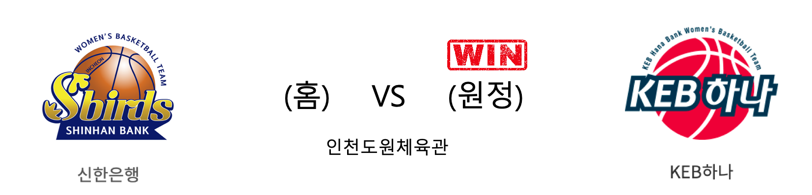

####  신한은행(홈) VS KEB하나(원정) 

<table class="tg">
  <tr>
    <th class="tg-rr9t">신한은행</th>
    <th class="tg-rr9t">팀</th>
    <th class="tg-rr9t">KEB하나</th>
  </tr>
  <tr>
    <td class="tg-dcpn">2승 1패</td>
    <td class="tg-rr9t">시즌 상대전적</td>
    <td class="tg-dcpn">1승 2패</td>
  </tr>
  <tr>
    <td class="tg-dcpn">74</td>
    <td class="tg-rr9t">점수</td>
    <td class="tg-dcpn">96</td>
  </tr>
  <tr>
    <td class="tg-dcpn">14/42(33%)</td>
    <td class="tg-rr9t">2점(%)</td>
    <td class="tg-dcpn">26/45(58%)</td>
  </tr>
  <tr>
    <td class="tg-dcpn">9/25(36%)</td>
    <td class="tg-rr9t">3점(%)</td>
    <td class="tg-dcpn">10/21(48%)</td>
  </tr>
  <tr>
    <td class="tg-dcpn">19/23(83%)</td>
    <td class="tg-rr9t">자유투(%)</td>
    <td class="tg-dcpn">14/18(78%)</td>
  </tr>
  <tr>
    <td class="tg-dcpn">31</td>
    <td class="tg-rr9t">리바운드</td>
    <td class="tg-dcpn">40</td>
  </tr>
  <tr>
    <td class="tg-dcpn">12</td>
    <td class="tg-rr9t">어시스트</td>
    <td class="tg-dcpn">25</td>
  </tr>
  <tr>
    <td class="tg-dcpn">7</td>
    <td class="tg-rr9t">스틸</td>
    <td class="tg-dcpn">10</td>
  </tr>
  <tr>
    <td class="tg-dcpn">12</td>
    <td class="tg-rr9t">블록</td>
    <td class="tg-dcpn">14</td>
  </tr>
  <tr>
    <td class="tg-dcpn">21</td>
    <td class="tg-rr9t">턴오버</td>
    <td class="tg-dcpn">20</td>
  </tr>
  <tr>
    <td class="tg-dcpn"></td>
    <td class="tg-rr9t">주요 득점선수</td>
    <td class="tg-dcpn">마이샤(26) 고아라(15) 강이슬(19)</td>
  </tr>
</table>

#### 경기 관련 주요 기사         

[여자농구 하나은행, 구단 한 경기 최다 96점 폭발…신한은행 대파](http://news1.kr/articles/?3799209)

[[내 맘대로 프리뷰] 신한은행-KEB하나은행, 변수는 엘레나 스미스](http://www.basketkorea.com/news/articleView.html?idxno=190942)

[‘96점 폭발’ KEB하나은행, 신한은행 꺾고 연패 탈출](http://sports.khan.co.kr/news/sk_index.html?art_id=201912221916003&sec_id=530301&pt=nv)

[KEB하나은행, 최다득점으로 신한은행 완파](http://www.sportsseoul.com/news/read/864335)

        
        

#### 리그 순위

<table class="tg">
  <tr>
    <th class="tg-d14o">순위</th>
    <th class="tg-d14o">팀명</th>
    <th class="tg-d14o">경기수</th>
    <th class="tg-d14o">승</th>
    <th class="tg-d14o">패</th>
    <th class="tg-d14o">승차</th>
    <th class="tg-d14o">승률</th>
  </tr>
  
<tr>
    <td class="tg-50j8">1</td>
    <td class="tg-50j8">우리은행</td>
    <td class="tg-50j8">13</td>
    <td class="tg-50j8">11</td>
    <td class="tg-50j8">2</td>
    <td class="tg-50j8">0</td>
    <td class="tg-50j8">0.846</td>
</tr>

<tr>
    <td class="tg-50j8">2</td>
    <td class="tg-50j8">KB스타즈</td>
    <td class="tg-50j8">13</td>
    <td class="tg-50j8">10</td>
    <td class="tg-50j8">3</td>
    <td class="tg-50j8">1</td>
    <td class="tg-50j8">0.769</td>
</tr>

<tr>
    <td class="tg-50j8">3</td>
    <td class="tg-50j8">KEB하나</td>
    <td class="tg-50j8">13</td>
    <td class="tg-50j8">5</td>
    <td class="tg-50j8">8</td>
    <td class="tg-50j8">6</td>
    <td class="tg-50j8">0.385</td>
</tr>

<tr>
    <td class="tg-50j8">3</td>
    <td class="tg-50j8">신한은행</td>
    <td class="tg-50j8">13</td>
    <td class="tg-50j8">5</td>
    <td class="tg-50j8">8</td>
    <td class="tg-50j8">6</td>
    <td class="tg-50j8">0.385</td>
</tr>

<tr>
    <td class="tg-50j8">5</td>
    <td class="tg-50j8">삼성생명</td>
    <td class="tg-50j8">13</td>
    <td class="tg-50j8">4</td>
    <td class="tg-50j8">9</td>
    <td class="tg-50j8">7</td>
    <td class="tg-50j8">0.308</td>
</tr>

<tr>
    <td class="tg-50j8">5</td>
    <td class="tg-50j8">BNK썸</td>
    <td class="tg-50j8">13</td>
    <td class="tg-50j8">4</td>
    <td class="tg-50j8">9</td>
    <td class="tg-50j8">7</td>
    <td class="tg-50j8">0.308</td>
</tr>
</table> 

        
        
#wkbl #국내농구 #여자농구 #농구분석 #토토 #스포츠토토 #경기예측 #농구결과 #20191222 #신한은행 #KEB하나 #신한은행KEB하나 