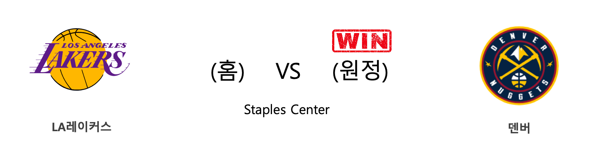

####  오클라호마씨티(홈) VS LA클리퍼스(원정) 

<table class="tg">
  <tr>
    <th class="tg-rr9t">OKC</th>
    <th class="tg-rr9t">팀</th>
    <th class="tg-rr9t">LAC</th>
  </tr>
  <tr>
    <td class="tg-dcpn">1승 1패</td>
    <td class="tg-rr9t">시즌 상대전적</td>
    <td class="tg-dcpn">1승 1패</td>
  </tr>
  <tr>
    <td class="tg-dcpn">118</td>
    <td class="tg-rr9t">점수</td>
    <td class="tg-dcpn">112</td>
  </tr>
  <tr>
    <td class="tg-dcpn">37/70(53%)</td>
    <td class="tg-rr9t">2점(%)</td>
    <td class="tg-dcpn">29/59(49%)</td>
  </tr>
  <tr>
    <td class="tg-dcpn">9/27(33%)</td>
    <td class="tg-rr9t">3점(%)</td>
    <td class="tg-dcpn">11/27(41%)</td>
  </tr>
  <tr>
    <td class="tg-dcpn">17/20(85%)</td>
    <td class="tg-rr9t">자유투(%)</td>
    <td class="tg-dcpn">21/24(88%)</td>
  </tr>
  <tr>
    <td class="tg-dcpn">49</td>
    <td class="tg-rr9t">리바운드</td>
    <td class="tg-dcpn">42</td>
  </tr>
  <tr>
    <td class="tg-dcpn">24</td>
    <td class="tg-rr9t">어시스트</td>
    <td class="tg-dcpn">22</td>
  </tr>
  <tr>
    <td class="tg-dcpn">10</td>
    <td class="tg-rr9t">스틸</td>
    <td class="tg-dcpn">7</td>
  </tr>
  <tr>
    <td class="tg-dcpn">4</td>
    <td class="tg-rr9t">블록</td>
    <td class="tg-dcpn">2</td>
  </tr>
  <tr>
    <td class="tg-dcpn">12</td>
    <td class="tg-rr9t">턴오버</td>
    <td class="tg-dcpn">15</td>
  </tr>
  <tr>
    <td class="tg-dcpn">ShaiGilgeous-(32) StevenAdamsC(20) DennisSchrode(28)</td>
    <td class="tg-rr9t">주요 득점선수</td>
    <td class="tg-dcpn">MontrezlHarre(18) LouWilliamsG(22) PaulGeorgeG(18)</td>
  </tr>
</table>

#### 경기 관련 주요 기사         

[[오늘의 NBA] (11/19) 댈러스의 루카 복음 낭송](http://sports.news.naver.com/basketball/news/read.nhn?oid=486&aid=0000001142)

['SGA 32점' OKC, 레너드 결장한 LAC 꺾고 4연승](http://www.rookie.co.kr/news/articleView.html?idxno=36813)

[[오늘의 NBA] (12/23) 토론토, 포기할 줄 모르는 북방의 투사](http://sports.news.naver.com/basketball/news/read.nhn?oid=486&aid=0000001175)

[[오늘의 NBA] (12/12) 제임스 하든 선생님의 심폐소생술](http://sports.news.naver.com/basketball/news/read.nhn?oid=486&aid=0000001164)

[[오늘의 NBA] (12/15) 밤 아데바요, 연장전의 지배자](http://sports.news.naver.com/basketball/news/read.nhn?oid=486&aid=0000001167)

        
        

####  토론토(홈) VS 댈러스(원정) 

<table class="tg">
  <tr>
    <th class="tg-rr9t">TOR</th>
    <th class="tg-rr9t">팀</th>
    <th class="tg-rr9t">DAL</th>
  </tr>
  <tr>
    <td class="tg-dcpn">1승 1패</td>
    <td class="tg-rr9t">시즌 상대전적</td>
    <td class="tg-dcpn">1승 1패</td>
  </tr>
  <tr>
    <td class="tg-dcpn">110</td>
    <td class="tg-rr9t">점수</td>
    <td class="tg-dcpn">107</td>
  </tr>
  <tr>
    <td class="tg-dcpn">27/60(45%)</td>
    <td class="tg-rr9t">2점(%)</td>
    <td class="tg-dcpn">20/44(45%)</td>
  </tr>
  <tr>
    <td class="tg-dcpn">10/34(29%)</td>
    <td class="tg-rr9t">3점(%)</td>
    <td class="tg-dcpn">15/46(33%)</td>
  </tr>
  <tr>
    <td class="tg-dcpn">26/31(84%)</td>
    <td class="tg-rr9t">자유투(%)</td>
    <td class="tg-dcpn">22/27(81%)</td>
  </tr>
  <tr>
    <td class="tg-dcpn">51</td>
    <td class="tg-rr9t">리바운드</td>
    <td class="tg-dcpn">53</td>
  </tr>
  <tr>
    <td class="tg-dcpn">21</td>
    <td class="tg-rr9t">어시스트</td>
    <td class="tg-dcpn">27</td>
  </tr>
  <tr>
    <td class="tg-dcpn">12</td>
    <td class="tg-rr9t">스틸</td>
    <td class="tg-dcpn">6</td>
  </tr>
  <tr>
    <td class="tg-dcpn">5</td>
    <td class="tg-rr9t">블록</td>
    <td class="tg-dcpn">4</td>
  </tr>
  <tr>
    <td class="tg-dcpn">10</td>
    <td class="tg-rr9t">턴오버</td>
    <td class="tg-dcpn">17</td>
  </tr>
  <tr>
    <td class="tg-dcpn">ChrisBoucher(21) KyleLowryG(32) RondaeHollis-(18)</td>
    <td class="tg-rr9t">주요 득점선수</td>
    <td class="tg-dcpn">DwightPowellC(17) KristapsPorzi(19) JalenBrunsonG(21) TimHardawayJr(16)</td>
  </tr>
</table>

#### 경기 관련 주요 기사         

[[오늘의 NBA] (12/15) 밤 아데바요, 연장전의 지배자](http://sports.news.naver.com/basketball/news/read.nhn?oid=486&aid=0000001167)

[[오늘의 NBA] (12/23) 토론토, 포기할 줄 모르는 북방의 투사](http://sports.news.naver.com/basketball/news/read.nhn?oid=486&aid=0000001175)

[[오늘의 NBA] (12/21) 크리스탑스 포르징기스, 댈러스의 새로운 버팀목](http://sports.news.naver.com/basketball/news/read.nhn?oid=486&aid=0000001173)

[[오늘의 NBA] (12/17) 댈러스, 밀워키 시스템을 붕괴시키다](http://sports.news.naver.com/basketball/news/read.nhn?oid=486&aid=0000001169)

[[오늘의 NBA] (12/19) 오클라호마시티, 역전의 달인!](http://sports.news.naver.com/basketball/news/read.nhn?oid=486&aid=0000001171)

        
        

####  밀워키(홈) VS 인디애나(원정) 

<table class="tg">
  <tr>
    <th class="tg-rr9t">MIL</th>
    <th class="tg-rr9t">팀</th>
    <th class="tg-rr9t">IND</th>
  </tr>
  <tr>
    <td class="tg-dcpn">2승 0패</td>
    <td class="tg-rr9t">시즌 상대전적</td>
    <td class="tg-dcpn">0승 2패</td>
  </tr>
  <tr>
    <td class="tg-dcpn">117</td>
    <td class="tg-rr9t">점수</td>
    <td class="tg-dcpn">89</td>
  </tr>
  <tr>
    <td class="tg-dcpn">29/60(48%)</td>
    <td class="tg-rr9t">2점(%)</td>
    <td class="tg-dcpn">25/60(42%)</td>
  </tr>
  <tr>
    <td class="tg-dcpn">15/44(34%)</td>
    <td class="tg-rr9t">3점(%)</td>
    <td class="tg-dcpn">12/40(30%)</td>
  </tr>
  <tr>
    <td class="tg-dcpn">14/17(82%)</td>
    <td class="tg-rr9t">자유투(%)</td>
    <td class="tg-dcpn">3/5(60%)</td>
  </tr>
  <tr>
    <td class="tg-dcpn">61</td>
    <td class="tg-rr9t">리바운드</td>
    <td class="tg-dcpn">48</td>
  </tr>
  <tr>
    <td class="tg-dcpn">31</td>
    <td class="tg-rr9t">어시스트</td>
    <td class="tg-dcpn">27</td>
  </tr>
  <tr>
    <td class="tg-dcpn">10</td>
    <td class="tg-rr9t">스틸</td>
    <td class="tg-dcpn">7</td>
  </tr>
  <tr>
    <td class="tg-dcpn">9</td>
    <td class="tg-rr9t">블록</td>
    <td class="tg-dcpn">5</td>
  </tr>
  <tr>
    <td class="tg-dcpn">9</td>
    <td class="tg-rr9t">턴오버</td>
    <td class="tg-dcpn">13</td>
  </tr>
  <tr>
    <td class="tg-dcpn">WesleyMatthew(19) GeorgeHill(17) GiannisAnteto(18) BrookLopezC(17)</td>
    <td class="tg-rr9t">주요 득점선수</td>
    <td class="tg-dcpn">DougMcDermott(15) DomantasSabon(19)</td>
  </tr>
</table>

#### 경기 관련 주요 기사         

[[오늘의 NBA] (12/7) 르브론 제임스, 멜로(carmelo) 드라마의 주인공](http://sports.news.naver.com/basketball/news/read.nhn?oid=486&aid=0000001159)

[[오늘의 NBA] (12/23) 토론토, 포기할 줄 모르는 북방의 투사](http://sports.news.naver.com/basketball/news/read.nhn?oid=486&aid=0000001175)

[[오늘의 NBA] (12/21) 크리스탑스 포르징기스, 댈러스의 새로운 버팀목](http://sports.news.naver.com/basketball/news/read.nhn?oid=486&aid=0000001173)

[[오늘의 NBA] (12/20) 밀워키, 리그 전체 단독 1위 등극!](http://sports.news.naver.com/basketball/news/read.nhn?oid=486&aid=0000001172)

[[오늘의 NBA] (12/14) 레이커스, 마이애미 홈 코트를 점령하다](http://sports.news.naver.com/basketball/news/read.nhn?oid=486&aid=0000001166)

        
        

####  보스턴(홈) VS 샬럿(원정) 

<table class="tg">
  <tr>
    <th class="tg-rr9t">BOS</th>
    <th class="tg-rr9t">팀</th>
    <th class="tg-rr9t">CHA</th>
  </tr>
  <tr>
    <td class="tg-dcpn">2승 0패</td>
    <td class="tg-rr9t">시즌 상대전적</td>
    <td class="tg-dcpn">0승 2패</td>
  </tr>
  <tr>
    <td class="tg-dcpn">119</td>
    <td class="tg-rr9t">점수</td>
    <td class="tg-dcpn">93</td>
  </tr>
  <tr>
    <td class="tg-dcpn">32/56(57%)</td>
    <td class="tg-rr9t">2점(%)</td>
    <td class="tg-dcpn">23/48(48%)</td>
  </tr>
  <tr>
    <td class="tg-dcpn">14/32(44%)</td>
    <td class="tg-rr9t">3점(%)</td>
    <td class="tg-dcpn">10/34(29%)</td>
  </tr>
  <tr>
    <td class="tg-dcpn">13/16(81%)</td>
    <td class="tg-rr9t">자유투(%)</td>
    <td class="tg-dcpn">17/23(74%)</td>
  </tr>
  <tr>
    <td class="tg-dcpn">57</td>
    <td class="tg-rr9t">리바운드</td>
    <td class="tg-dcpn">27</td>
  </tr>
  <tr>
    <td class="tg-dcpn">25</td>
    <td class="tg-rr9t">어시스트</td>
    <td class="tg-dcpn">26</td>
  </tr>
  <tr>
    <td class="tg-dcpn">2</td>
    <td class="tg-rr9t">스틸</td>
    <td class="tg-dcpn">3</td>
  </tr>
  <tr>
    <td class="tg-dcpn">9</td>
    <td class="tg-rr9t">블록</td>
    <td class="tg-dcpn">5</td>
  </tr>
  <tr>
    <td class="tg-dcpn">11</td>
    <td class="tg-rr9t">턴오버</td>
    <td class="tg-dcpn">3</td>
  </tr>
  <tr>
    <td class="tg-dcpn">JaysonTatumF(39) JaylenBrownG(16) KembaWalkerG(23)</td>
    <td class="tg-rr9t">주요 득점선수</td>
    <td class="tg-dcpn">Devonte'Graha(23) BismackBiyomb(18) MilesBridgesF(15)</td>
  </tr>
</table>

#### 경기 관련 주요 기사         

[[오늘의 NBA] (12/12) 제임스 하든 선생님의 심폐소생술](http://sports.news.naver.com/basketball/news/read.nhn?oid=486&aid=0000001164)

[[오늘의 NBA] (11/18) 새크라멘토, 리그 선두 보스턴을 제압하다](http://sports.news.naver.com/basketball/news/read.nhn?oid=486&aid=0000001141)

[[오늘의 NBA] (12/9) 앤써니 데이비스, 구단 역사에 이름을 남기다](http://sports.news.naver.com/basketball/news/read.nhn?oid=486&aid=0000001161)

[[오늘의 NBA] (12/23) 토론토, 포기할 줄 모르는 북방의 투사](http://sports.news.naver.com/basketball/news/read.nhn?oid=486&aid=0000001175)

[[NBA] 시즌개막특집 ⑤ 2019-2020시즌, 점프볼이 추천하는 이적생들](http://sports.news.naver.com/basketball/news/read.nhn?oid=065&aid=0000190747)

        
        

####  LA레이커스(홈) VS 덴버(원정) 

<table class="tg">
  <tr>
    <th class="tg-rr9t">LAL</th>
    <th class="tg-rr9t">팀</th>
    <th class="tg-rr9t">DEN</th>
  </tr>
  <tr>
    <td class="tg-dcpn">1승 1패</td>
    <td class="tg-rr9t">시즌 상대전적</td>
    <td class="tg-dcpn">1승 1패</td>
  </tr>
  <tr>
    <td class="tg-dcpn">104</td>
    <td class="tg-rr9t">점수</td>
    <td class="tg-dcpn">128</td>
  </tr>
  <tr>
    <td class="tg-dcpn">29/54(54%)</td>
    <td class="tg-rr9t">2점(%)</td>
    <td class="tg-dcpn">34/60(57%)</td>
  </tr>
  <tr>
    <td class="tg-dcpn">10/29(34%)</td>
    <td class="tg-rr9t">3점(%)</td>
    <td class="tg-dcpn">11/32(34%)</td>
  </tr>
  <tr>
    <td class="tg-dcpn">16/22(73%)</td>
    <td class="tg-rr9t">자유투(%)</td>
    <td class="tg-dcpn">27/30(90%)</td>
  </tr>
  <tr>
    <td class="tg-dcpn">45</td>
    <td class="tg-rr9t">리바운드</td>
    <td class="tg-dcpn">44</td>
  </tr>
  <tr>
    <td class="tg-dcpn">18</td>
    <td class="tg-rr9t">어시스트</td>
    <td class="tg-dcpn">31</td>
  </tr>
  <tr>
    <td class="tg-dcpn">7</td>
    <td class="tg-rr9t">스틸</td>
    <td class="tg-dcpn">13</td>
  </tr>
  <tr>
    <td class="tg-dcpn">9</td>
    <td class="tg-rr9t">블록</td>
    <td class="tg-dcpn">2</td>
  </tr>
  <tr>
    <td class="tg-dcpn">19</td>
    <td class="tg-rr9t">턴오버</td>
    <td class="tg-dcpn">8</td>
  </tr>
  <tr>
    <td class="tg-dcpn">AnthonyDavisF(32) KyleKuzma(16)</td>
    <td class="tg-rr9t">주요 득점선수</td>
    <td class="tg-dcpn">MalikBeasley(16) NikolaJokicC(18) GaryHarrisG(19) PaulMillsapF(21)</td>
  </tr>
</table>

#### 경기 관련 주요 기사         

[[오늘의 NBA] (11/13) LAL 카일 쿠즈마의 대반격](http://sports.news.naver.com/basketball/news/read.nhn?oid=486&aid=0000001136)

[[오늘의 NBA] (12/16) 스펜서 딘위디, 브루클린 상승세를 이끈다!](http://sports.news.naver.com/basketball/news/read.nhn?oid=486&aid=0000001168)

[[오늘의 NBA] (12/23) 토론토, 포기할 줄 모르는 북방의 투사](http://sports.news.naver.com/basketball/news/read.nhn?oid=486&aid=0000001175)

[[오늘의 NBA] (12/20) 밀워키, 리그 전체 단독 1위 등극!](http://sports.news.naver.com/basketball/news/read.nhn?oid=486&aid=0000001172)

[[오늘의 NBA] (12/19) 오클라호마시티, 역전의 달인!](http://sports.news.naver.com/basketball/news/read.nhn?oid=486&aid=0000001171)

        
        

#### 리그 (Eastern) 순위
    

<table class="tg">
  <tr>
    <th class="tg-d14o">순위</th>
    <th class="tg-d14o">팀명</th>
    <th class="tg-d14o">경기수</th>
    <th class="tg-d14o">승</th>
    <th class="tg-d14o">패</th>
    <th class="tg-d14o">승차</th>
    <th class="tg-d14o">승률</th>
  </tr>
  
<tr>
    <td class="tg-50j8">1</td>
    <td class="tg-50j8">MIL</td>
    <td class="tg-50j8">31</td>
    <td class="tg-50j8">27</td>
    <td class="tg-50j8">4</td>
    <td class="tg-50j8">0</td>
    <td class="tg-50j8">0.871</td>
</tr>

<tr>
    <td class="tg-50j8">2</td>
    <td class="tg-50j8">TOR</td>
    <td class="tg-50j8">29</td>
    <td class="tg-50j8">21</td>
    <td class="tg-50j8">8</td>
    <td class="tg-50j8">6</td>
    <td class="tg-50j8">0.724</td>
</tr>

<tr>
    <td class="tg-50j8">2</td>
    <td class="tg-50j8">MIA</td>
    <td class="tg-50j8">29</td>
    <td class="tg-50j8">21</td>
    <td class="tg-50j8">8</td>
    <td class="tg-50j8">6</td>
    <td class="tg-50j8">0.724</td>
</tr>

<tr>
    <td class="tg-50j8">4</td>
    <td class="tg-50j8">BOS</td>
    <td class="tg-50j8">26</td>
    <td class="tg-50j8">20</td>
    <td class="tg-50j8">6</td>
    <td class="tg-50j8">7</td>
    <td class="tg-50j8">0.769</td>
</tr>

<tr>
    <td class="tg-50j8">5</td>
    <td class="tg-50j8">PHI</td>
    <td class="tg-50j8">30</td>
    <td class="tg-50j8">20</td>
    <td class="tg-50j8">10</td>
    <td class="tg-50j8">7</td>
    <td class="tg-50j8">0.667</td>
</tr>

<tr>
    <td class="tg-50j8">5</td>
    <td class="tg-50j8">IND</td>
    <td class="tg-50j8">30</td>
    <td class="tg-50j8">20</td>
    <td class="tg-50j8">10</td>
    <td class="tg-50j8">7</td>
    <td class="tg-50j8">0.667</td>
</tr>

<tr>
    <td class="tg-50j8">7</td>
    <td class="tg-50j8">BKN</td>
    <td class="tg-50j8">29</td>
    <td class="tg-50j8">16</td>
    <td class="tg-50j8">13</td>
    <td class="tg-50j8">11</td>
    <td class="tg-50j8">0.552</td>
</tr>

<tr>
    <td class="tg-50j8">8</td>
    <td class="tg-50j8">CHA</td>
    <td class="tg-50j8">33</td>
    <td class="tg-50j8">13</td>
    <td class="tg-50j8">20</td>
    <td class="tg-50j8">14</td>
    <td class="tg-50j8">0.394</td>
</tr>

<tr>
    <td class="tg-50j8">9</td>
    <td class="tg-50j8">ORL</td>
    <td class="tg-50j8">29</td>
    <td class="tg-50j8">12</td>
    <td class="tg-50j8">17</td>
    <td class="tg-50j8">15</td>
    <td class="tg-50j8">0.414</td>
</tr>

<tr>
    <td class="tg-50j8">10</td>
    <td class="tg-50j8">CHI</td>
    <td class="tg-50j8">31</td>
    <td class="tg-50j8">12</td>
    <td class="tg-50j8">19</td>
    <td class="tg-50j8">15</td>
    <td class="tg-50j8">0.387</td>
</tr>

<tr>
    <td class="tg-50j8">11</td>
    <td class="tg-50j8">DET</td>
    <td class="tg-50j8">29</td>
    <td class="tg-50j8">11</td>
    <td class="tg-50j8">18</td>
    <td class="tg-50j8">16</td>
    <td class="tg-50j8">0.379</td>
</tr>

<tr>
    <td class="tg-50j8">12</td>
    <td class="tg-50j8">WAS</td>
    <td class="tg-50j8">28</td>
    <td class="tg-50j8">8</td>
    <td class="tg-50j8">20</td>
    <td class="tg-50j8">19</td>
    <td class="tg-50j8">0.286</td>
</tr>

<tr>
    <td class="tg-50j8">13</td>
    <td class="tg-50j8">CLE</td>
    <td class="tg-50j8">28</td>
    <td class="tg-50j8">7</td>
    <td class="tg-50j8">21</td>
    <td class="tg-50j8">20</td>
    <td class="tg-50j8">0.25</td>
</tr>

<tr>
    <td class="tg-50j8">14</td>
    <td class="tg-50j8">NYK</td>
    <td class="tg-50j8">30</td>
    <td class="tg-50j8">7</td>
    <td class="tg-50j8">23</td>
    <td class="tg-50j8">20</td>
    <td class="tg-50j8">0.233</td>
</tr>

<tr>
    <td class="tg-50j8">15</td>
    <td class="tg-50j8">ATL</td>
    <td class="tg-50j8">30</td>
    <td class="tg-50j8">6</td>
    <td class="tg-50j8">24</td>
    <td class="tg-50j8">21</td>
    <td class="tg-50j8">0.2</td>
</tr>
</table> 
#### 리그 (Western) 순위
    

<table class="tg">
  <tr>
    <th class="tg-d14o">순위</th>
    <th class="tg-d14o">팀명</th>
    <th class="tg-d14o">경기수</th>
    <th class="tg-d14o">승</th>
    <th class="tg-d14o">패</th>
    <th class="tg-d14o">승차</th>
    <th class="tg-d14o">승률</th>
  </tr>
  
<tr>
    <td class="tg-50j8">1</td>
    <td class="tg-50j8">LAL</td>
    <td class="tg-50j8">30</td>
    <td class="tg-50j8">24</td>
    <td class="tg-50j8">6</td>
    <td class="tg-50j8">3</td>
    <td class="tg-50j8">0.8</td>
</tr>

<tr>
    <td class="tg-50j8">2</td>
    <td class="tg-50j8">LAC</td>
    <td class="tg-50j8">32</td>
    <td class="tg-50j8">22</td>
    <td class="tg-50j8">10</td>
    <td class="tg-50j8">5</td>
    <td class="tg-50j8">0.688</td>
</tr>

<tr>
    <td class="tg-50j8">3</td>
    <td class="tg-50j8">HOU</td>
    <td class="tg-50j8">29</td>
    <td class="tg-50j8">20</td>
    <td class="tg-50j8">9</td>
    <td class="tg-50j8">7</td>
    <td class="tg-50j8">0.69</td>
</tr>

<tr>
    <td class="tg-50j8">4</td>
    <td class="tg-50j8">DEN</td>
    <td class="tg-50j8">27</td>
    <td class="tg-50j8">19</td>
    <td class="tg-50j8">8</td>
    <td class="tg-50j8">8</td>
    <td class="tg-50j8">0.704</td>
</tr>

<tr>
    <td class="tg-50j8">5</td>
    <td class="tg-50j8">DAL</td>
    <td class="tg-50j8">28</td>
    <td class="tg-50j8">18</td>
    <td class="tg-50j8">10</td>
    <td class="tg-50j8">9</td>
    <td class="tg-50j8">0.643</td>
</tr>

<tr>
    <td class="tg-50j8">6</td>
    <td class="tg-50j8">UTA</td>
    <td class="tg-50j8">29</td>
    <td class="tg-50j8">18</td>
    <td class="tg-50j8">11</td>
    <td class="tg-50j8">9</td>
    <td class="tg-50j8">0.621</td>
</tr>

<tr>
    <td class="tg-50j8">7</td>
    <td class="tg-50j8">OKC</td>
    <td class="tg-50j8">29</td>
    <td class="tg-50j8">15</td>
    <td class="tg-50j8">14</td>
    <td class="tg-50j8">12</td>
    <td class="tg-50j8">0.517</td>
</tr>

<tr>
    <td class="tg-50j8">8</td>
    <td class="tg-50j8">POR</td>
    <td class="tg-50j8">29</td>
    <td class="tg-50j8">14</td>
    <td class="tg-50j8">15</td>
    <td class="tg-50j8">13</td>
    <td class="tg-50j8">0.483</td>
</tr>

<tr>
    <td class="tg-50j8">9</td>
    <td class="tg-50j8">SAC</td>
    <td class="tg-50j8">29</td>
    <td class="tg-50j8">12</td>
    <td class="tg-50j8">17</td>
    <td class="tg-50j8">15</td>
    <td class="tg-50j8">0.414</td>
</tr>

<tr>
    <td class="tg-50j8">10</td>
    <td class="tg-50j8">SAS</td>
    <td class="tg-50j8">27</td>
    <td class="tg-50j8">11</td>
    <td class="tg-50j8">16</td>
    <td class="tg-50j8">16</td>
    <td class="tg-50j8">0.407</td>
</tr>

<tr>
    <td class="tg-50j8">11</td>
    <td class="tg-50j8">PHX</td>
    <td class="tg-50j8">29</td>
    <td class="tg-50j8">11</td>
    <td class="tg-50j8">18</td>
    <td class="tg-50j8">16</td>
    <td class="tg-50j8">0.379</td>
</tr>

<tr>
    <td class="tg-50j8">12</td>
    <td class="tg-50j8">MEM</td>
    <td class="tg-50j8">30</td>
    <td class="tg-50j8">11</td>
    <td class="tg-50j8">19</td>
    <td class="tg-50j8">16</td>
    <td class="tg-50j8">0.367</td>
</tr>

<tr>
    <td class="tg-50j8">13</td>
    <td class="tg-50j8">MIN</td>
    <td class="tg-50j8">28</td>
    <td class="tg-50j8">10</td>
    <td class="tg-50j8">18</td>
    <td class="tg-50j8">17</td>
    <td class="tg-50j8">0.357</td>
</tr>

<tr>
    <td class="tg-50j8">14</td>
    <td class="tg-50j8">NOP</td>
    <td class="tg-50j8">30</td>
    <td class="tg-50j8">7</td>
    <td class="tg-50j8">23</td>
    <td class="tg-50j8">20</td>
    <td class="tg-50j8">0.233</td>
</tr>

<tr>
    <td class="tg-50j8">15</td>
    <td class="tg-50j8">GSW</td>
    <td class="tg-50j8">30</td>
    <td class="tg-50j8">6</td>
    <td class="tg-50j8">24</td>
    <td class="tg-50j8">21</td>
    <td class="tg-50j8">0.2</td>
</tr>
</table> 

        
        
#nba #미국농구 #엔비에이 #농구분석 #토토 #스포츠토토 #경기예측 #농구결과 #20191223 #오클라호마씨티 #LA클리퍼스 #토론토 #댈러스 #밀워키 #인디애나 #보스턴 #샬럿 #LA레이커스 #덴버 #오클라호마씨티LA클리퍼스 #토론토댈러스 #밀워키인디애나 #보스턴샬럿 #LA레이커스덴버 