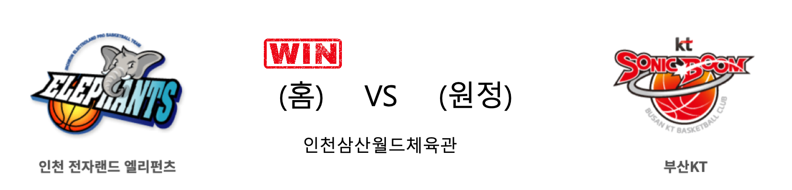
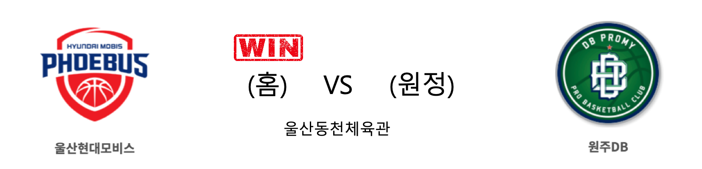

####  인천전자랜드(홈) VS 부산KT(원정) 

<table class="tg">
  <tr>
    <th class="tg-rr9t">인천전자랜드</th>
    <th class="tg-rr9t">팀</th>
    <th class="tg-rr9t">부산KT</th>
  </tr>
  <tr>
    <td class="tg-dcpn">3승 0패</td>
    <td class="tg-rr9t">시즌 상대전적</td>
    <td class="tg-dcpn">0승 3패</td>
  </tr>
  <tr>
    <td class="tg-dcpn">87</td>
    <td class="tg-rr9t">점수</td>
    <td class="tg-dcpn">81</td>
  </tr>
  <tr>
    <td class="tg-dcpn">26/49(53%)</td>
    <td class="tg-rr9t">2점(%)</td>
    <td class="tg-dcpn">21/34(62%)</td>
  </tr>
  <tr>
    <td class="tg-dcpn">10/28(36%)</td>
    <td class="tg-rr9t">3점(%)</td>
    <td class="tg-dcpn">10/34(29%)</td>
  </tr>
  <tr>
    <td class="tg-dcpn">5/10(50%)</td>
    <td class="tg-rr9t">자유투(%)</td>
    <td class="tg-dcpn">9/14(64%)</td>
  </tr>
  <tr>
    <td class="tg-dcpn">38</td>
    <td class="tg-rr9t">리바운드</td>
    <td class="tg-dcpn">36</td>
  </tr>
  <tr>
    <td class="tg-dcpn">2</td>
    <td class="tg-rr9t">어시스트</td>
    <td class="tg-dcpn">2</td>
  </tr>
  <tr>
    <td class="tg-dcpn">8</td>
    <td class="tg-rr9t">스틸</td>
    <td class="tg-dcpn">11</td>
  </tr>
  <tr>
    <td class="tg-dcpn">9</td>
    <td class="tg-rr9t">블록</td>
    <td class="tg-dcpn">4</td>
  </tr>
  <tr>
    <td class="tg-dcpn">20</td>
    <td class="tg-rr9t">턴오버</td>
    <td class="tg-dcpn">15</td>
  </tr>
  <tr>
    <td class="tg-dcpn">머피 할로웨이(18) 김지완(16) 강상재(15)</td>
    <td class="tg-rr9t">주요 득점선수</td>
    <td class="tg-dcpn">바이런 멀린스(20) 양홍석(17)</td>
  </tr>
</table>

#### 경기 관련 주요 기사         

[전자랜드와 무명 김정년의 해피 크리스마스](http://sports.khan.co.kr/news/sk_index.html?art_id=201912251759003&sec_id=530301&pt=nv)

['7연승 뒤 4연패' KT 서동철 감독, "나부터 반성 하겠다"](http://www.mydaily.co.kr/new_yk/html/read.php?newsid=201912251233438796&ext=na)

[크리스마스 선물은 '연패 탈출'…전자랜드, kt 잡고 5위로](https://news.sbs.co.kr/news/endPage.do?news_id=N1005578468&plink=ORI&cooper=NAVER)

[전자랜드 `홈팬들에게 승리 선물` [MK포토]](http://mksports.co.kr/view/2019/1082941/)

        
        

####  울산현대모비스(홈) VS 원주DB(원정) 

<table class="tg">
  <tr>
    <th class="tg-rr9t">울산현대모비스</th>
    <th class="tg-rr9t">팀</th>
    <th class="tg-rr9t">원주DB</th>
  </tr>
  <tr>
    <td class="tg-dcpn">2승 1패</td>
    <td class="tg-rr9t">시즌 상대전적</td>
    <td class="tg-dcpn">1승 2패</td>
  </tr>
  <tr>
    <td class="tg-dcpn">76</td>
    <td class="tg-rr9t">점수</td>
    <td class="tg-dcpn">66</td>
  </tr>
  <tr>
    <td class="tg-dcpn">19/42(45%)</td>
    <td class="tg-rr9t">2점(%)</td>
    <td class="tg-dcpn">24/49(49%)</td>
  </tr>
  <tr>
    <td class="tg-dcpn">9/23(39%)</td>
    <td class="tg-rr9t">3점(%)</td>
    <td class="tg-dcpn">4/21(19%)</td>
  </tr>
  <tr>
    <td class="tg-dcpn">11/16(69%)</td>
    <td class="tg-rr9t">자유투(%)</td>
    <td class="tg-dcpn">6/6(100%)</td>
  </tr>
  <tr>
    <td class="tg-dcpn">40</td>
    <td class="tg-rr9t">리바운드</td>
    <td class="tg-dcpn">33</td>
  </tr>
  <tr>
    <td class="tg-dcpn">1</td>
    <td class="tg-rr9t">어시스트</td>
    <td class="tg-dcpn">3</td>
  </tr>
  <tr>
    <td class="tg-dcpn">13</td>
    <td class="tg-rr9t">스틸</td>
    <td class="tg-dcpn">13</td>
  </tr>
  <tr>
    <td class="tg-dcpn">8</td>
    <td class="tg-rr9t">블록</td>
    <td class="tg-dcpn">8</td>
  </tr>
  <tr>
    <td class="tg-dcpn">20</td>
    <td class="tg-rr9t">턴오버</td>
    <td class="tg-dcpn">12</td>
  </tr>
  <tr>
    <td class="tg-dcpn">에메카 오카포(18) 김국찬(27)</td>
    <td class="tg-rr9t">주요 득점선수</td>
    <td class="tg-dcpn">치나누 오누아쿠(19)</td>
  </tr>
</table>

#### 경기 관련 주요 기사         

[‘김국찬 3점 7방 폭발’ 현대모비스, DB 꺾고 2연패 탈출](http://sports.news.naver.com/basketball/news/read.nhn?oid=065&aid=0000194508)

[오카포 뼈아픈 실수, 현대모비스 유재학 감독 손을 꼭 잡은 사연](http://sports.chosun.com/news/ntype.htm?id=201912250100177860011456&servicedate=20191225)

[[BK Review] 현대모비스의 조직적 움직임, 크리스마스 선물을 얻다](http://www.basketkorea.com/news/articleView.html?idxno=191054)

        
        

####  서울SK(홈) VS 서울삼성(원정) 

<table class="tg">
  <tr>
    <th class="tg-rr9t">서울SK</th>
    <th class="tg-rr9t">팀</th>
    <th class="tg-rr9t">서울삼성</th>
  </tr>
  <tr>
    <td class="tg-dcpn">2승 1패</td>
    <td class="tg-rr9t">시즌 상대전적</td>
    <td class="tg-dcpn">1승 2패</td>
  </tr>
  <tr>
    <td class="tg-dcpn">78</td>
    <td class="tg-rr9t">점수</td>
    <td class="tg-dcpn">80</td>
  </tr>
  <tr>
    <td class="tg-dcpn">33/55(60%)</td>
    <td class="tg-rr9t">2점(%)</td>
    <td class="tg-dcpn">25/40(62%)</td>
  </tr>
  <tr>
    <td class="tg-dcpn">0/15(0%)</td>
    <td class="tg-rr9t">3점(%)</td>
    <td class="tg-dcpn">9/27(33%)</td>
  </tr>
  <tr>
    <td class="tg-dcpn">12/15(80%)</td>
    <td class="tg-rr9t">자유투(%)</td>
    <td class="tg-dcpn">3/5(60%)</td>
  </tr>
  <tr>
    <td class="tg-dcpn">35</td>
    <td class="tg-rr9t">리바운드</td>
    <td class="tg-dcpn">30</td>
  </tr>
  <tr>
    <td class="tg-dcpn">4</td>
    <td class="tg-rr9t">어시스트</td>
    <td class="tg-dcpn">0</td>
  </tr>
  <tr>
    <td class="tg-dcpn">9</td>
    <td class="tg-rr9t">스틸</td>
    <td class="tg-dcpn">11</td>
  </tr>
  <tr>
    <td class="tg-dcpn">8</td>
    <td class="tg-rr9t">블록</td>
    <td class="tg-dcpn">6</td>
  </tr>
  <tr>
    <td class="tg-dcpn">17</td>
    <td class="tg-rr9t">턴오버</td>
    <td class="tg-dcpn">23</td>
  </tr>
  <tr>
    <td class="tg-dcpn">자밀 워니(29)</td>
    <td class="tg-rr9t">주요 득점선수</td>
    <td class="tg-dcpn">닉 미네라스(24)</td>
  </tr>
</table>

#### 경기 관련 주요 기사         

[[포토] 삼성, 크리스마스 더비에서 SK에 승리!](http://sports.chosun.com/news/ntype.htm?id=201912250100179150011537&servicedate=20191225)

[SK·삼성 치어리더들의 크리스마스 합동 공연](http://news1.kr/photos/view/?3980686)

[[BK Review] '천기범 후반 맹활약' 삼성, SK 꺾고 S-더비 4연패 탈출](http://www.basketkorea.com/news/articleView.html?idxno=191052)

[[★현장리뷰] '천기범 4Q 펄펄' 삼성, SK에 뒤집기 쇼!... 3연승 질주](http://star.mt.co.kr/stview.php?no=2019122516091113351)

        
        

#### 리그 순위

<table class="tg">
  <tr>
    <th class="tg-d14o">순위</th>
    <th class="tg-d14o">팀명</th>
    <th class="tg-d14o">경기수</th>
    <th class="tg-d14o">승</th>
    <th class="tg-d14o">패</th>
    <th class="tg-d14o">승차</th>
    <th class="tg-d14o">승률</th>
  </tr>
  
<tr>
    <td class="tg-50j8">1</td>
    <td class="tg-50j8">서울SK</td>
    <td class="tg-50j8">25</td>
    <td class="tg-50j8">18</td>
    <td class="tg-50j8">7</td>
    <td class="tg-50j8">0</td>
    <td class="tg-50j8">0.72</td>
</tr>

<tr>
    <td class="tg-50j8">2</td>
    <td class="tg-50j8">전주KCC</td>
    <td class="tg-50j8">26</td>
    <td class="tg-50j8">16</td>
    <td class="tg-50j8">10</td>
    <td class="tg-50j8">2</td>
    <td class="tg-50j8">0.615</td>
</tr>

<tr>
    <td class="tg-50j8">3</td>
    <td class="tg-50j8">안양KGC</td>
    <td class="tg-50j8">25</td>
    <td class="tg-50j8">15</td>
    <td class="tg-50j8">10</td>
    <td class="tg-50j8">3</td>
    <td class="tg-50j8">0.6</td>
</tr>

<tr>
    <td class="tg-50j8">4</td>
    <td class="tg-50j8">원주DB</td>
    <td class="tg-50j8">25</td>
    <td class="tg-50j8">14</td>
    <td class="tg-50j8">11</td>
    <td class="tg-50j8">4</td>
    <td class="tg-50j8">0.56</td>
</tr>

<tr>
    <td class="tg-50j8">5</td>
    <td class="tg-50j8">인천전자랜드</td>
    <td class="tg-50j8">25</td>
    <td class="tg-50j8">13</td>
    <td class="tg-50j8">12</td>
    <td class="tg-50j8">5</td>
    <td class="tg-50j8">0.52</td>
</tr>

<tr>
    <td class="tg-50j8">6</td>
    <td class="tg-50j8">부산KT</td>
    <td class="tg-50j8">26</td>
    <td class="tg-50j8">13</td>
    <td class="tg-50j8">13</td>
    <td class="tg-50j8">5</td>
    <td class="tg-50j8">0.5</td>
</tr>

<tr>
    <td class="tg-50j8">7</td>
    <td class="tg-50j8">서울삼성</td>
    <td class="tg-50j8">26</td>
    <td class="tg-50j8">12</td>
    <td class="tg-50j8">14</td>
    <td class="tg-50j8">6</td>
    <td class="tg-50j8">0.462</td>
</tr>

<tr>
    <td class="tg-50j8">8</td>
    <td class="tg-50j8">울산현대모비스</td>
    <td class="tg-50j8">26</td>
    <td class="tg-50j8">10</td>
    <td class="tg-50j8">16</td>
    <td class="tg-50j8">8</td>
    <td class="tg-50j8">0.385</td>
</tr>

<tr>
    <td class="tg-50j8">9</td>
    <td class="tg-50j8">창원LG</td>
    <td class="tg-50j8">25</td>
    <td class="tg-50j8">9</td>
    <td class="tg-50j8">16</td>
    <td class="tg-50j8">9</td>
    <td class="tg-50j8">0.36</td>
</tr>

<tr>
    <td class="tg-50j8">10</td>
    <td class="tg-50j8">고양오리온</td>
    <td class="tg-50j8">25</td>
    <td class="tg-50j8">7</td>
    <td class="tg-50j8">18</td>
    <td class="tg-50j8">11</td>
    <td class="tg-50j8">0.28</td>
</tr>
</table> 

        
        
#kbl #국내농구 #농구분석 #토토 #스포츠토토 #경기예측 #농구결과 #20191225 #인천전자랜드 #부산KT #울산현대모비스 #원주DB #서울SK #서울삼성 #인천전자랜드부산KT #울산현대모비스원주DB #서울SK서울삼성 