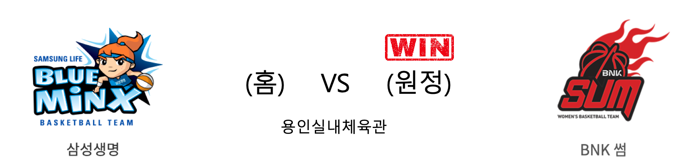

####  삼성생명(홈) VS BNK썸(원정) 

<table class="tg">
  <tr>
    <th class="tg-rr9t">삼성생명</th>
    <th class="tg-rr9t">팀</th>
    <th class="tg-rr9t">BNK썸</th>
  </tr>
  <tr>
    <td class="tg-dcpn">1승 2패</td>
    <td class="tg-rr9t">시즌 상대전적</td>
    <td class="tg-dcpn">2승 1패</td>
  </tr>
  <tr>
    <td class="tg-dcpn">68</td>
    <td class="tg-rr9t">점수</td>
    <td class="tg-dcpn">76</td>
  </tr>
  <tr>
    <td class="tg-dcpn">28/66(42%)</td>
    <td class="tg-rr9t">2점(%)</td>
    <td class="tg-dcpn">21/39(54%)</td>
  </tr>
  <tr>
    <td class="tg-dcpn">2/10(20%)</td>
    <td class="tg-rr9t">3점(%)</td>
    <td class="tg-dcpn">6/12(50%)</td>
  </tr>
  <tr>
    <td class="tg-dcpn">6/12(50%)</td>
    <td class="tg-rr9t">자유투(%)</td>
    <td class="tg-dcpn">16/19(84%)</td>
  </tr>
  <tr>
    <td class="tg-dcpn">38</td>
    <td class="tg-rr9t">리바운드</td>
    <td class="tg-dcpn">31</td>
  </tr>
  <tr>
    <td class="tg-dcpn">15</td>
    <td class="tg-rr9t">어시스트</td>
    <td class="tg-dcpn">19</td>
  </tr>
  <tr>
    <td class="tg-dcpn">9</td>
    <td class="tg-rr9t">스틸</td>
    <td class="tg-dcpn">7</td>
  </tr>
  <tr>
    <td class="tg-dcpn">12</td>
    <td class="tg-rr9t">블록</td>
    <td class="tg-dcpn">13</td>
  </tr>
  <tr>
    <td class="tg-dcpn">19</td>
    <td class="tg-rr9t">턴오버</td>
    <td class="tg-dcpn">18</td>
  </tr>
  <tr>
    <td class="tg-dcpn">배혜윤(23) 김한별(16)</td>
    <td class="tg-rr9t">주요 득점선수</td>
    <td class="tg-dcpn">단타스(33)</td>
  </tr>
</table>

#### 경기 관련 주요 기사         

[[루키 프리뷰] '탈꼴지' 크리스마스 선물을 기대하는 삼성생명과 BNK](http://www.rookie.co.kr/news/articleView.html?idxno=36889)

[[BK Review] '단타스 커리어 하이' BNK, 삼성생명 꺾고 창단 첫 3연승 질주](http://www.basketkorea.com/news/articleView.html?idxno=191053)

[BNK, 단타스 33득점 앞세워 3연승으로 꼴찌 탈출](http://sports.chosun.com/news/ntype.htm?id=201912260100179260011545&servicedate=20191225)

[역사 쓴 BNK 썸, 삼성생명 꺾고 창단 첫 3연승+탈꼴찌 성공](http://www.sportsseoul.com/news/read/865370)

        
        

#### 리그 순위

<table class="tg">
  <tr>
    <th class="tg-d14o">순위</th>
    <th class="tg-d14o">팀명</th>
    <th class="tg-d14o">경기수</th>
    <th class="tg-d14o">승</th>
    <th class="tg-d14o">패</th>
    <th class="tg-d14o">승차</th>
    <th class="tg-d14o">승률</th>
  </tr>
  
<tr>
    <td class="tg-50j8">1</td>
    <td class="tg-50j8">우리은행</td>
    <td class="tg-50j8">14</td>
    <td class="tg-50j8">12</td>
    <td class="tg-50j8">2</td>
    <td class="tg-50j8">0</td>
    <td class="tg-50j8">0.857</td>
</tr>

<tr>
    <td class="tg-50j8">2</td>
    <td class="tg-50j8">KB스타즈</td>
    <td class="tg-50j8">14</td>
    <td class="tg-50j8">10</td>
    <td class="tg-50j8">4</td>
    <td class="tg-50j8">2</td>
    <td class="tg-50j8">0.714</td>
</tr>

<tr>
    <td class="tg-50j8">3</td>
    <td class="tg-50j8">신한은행</td>
    <td class="tg-50j8">13</td>
    <td class="tg-50j8">5</td>
    <td class="tg-50j8">8</td>
    <td class="tg-50j8">7</td>
    <td class="tg-50j8">0.385</td>
</tr>

<tr>
    <td class="tg-50j8">3</td>
    <td class="tg-50j8">KEB하나</td>
    <td class="tg-50j8">13</td>
    <td class="tg-50j8">5</td>
    <td class="tg-50j8">8</td>
    <td class="tg-50j8">7</td>
    <td class="tg-50j8">0.385</td>
</tr>

<tr>
    <td class="tg-50j8">5</td>
    <td class="tg-50j8">BNK썸</td>
    <td class="tg-50j8">14</td>
    <td class="tg-50j8">5</td>
    <td class="tg-50j8">9</td>
    <td class="tg-50j8">7</td>
    <td class="tg-50j8">0.357</td>
</tr>

<tr>
    <td class="tg-50j8">6</td>
    <td class="tg-50j8">삼성생명</td>
    <td class="tg-50j8">14</td>
    <td class="tg-50j8">4</td>
    <td class="tg-50j8">10</td>
    <td class="tg-50j8">8</td>
    <td class="tg-50j8">0.286</td>
</tr>
</table> 

        
        
#wkbl #국내농구 #여자농구 #농구분석 #토토 #스포츠토토 #경기예측 #농구결과 #20191225 #삼성생명 #BNK썸 #삼성생명BNK썸 