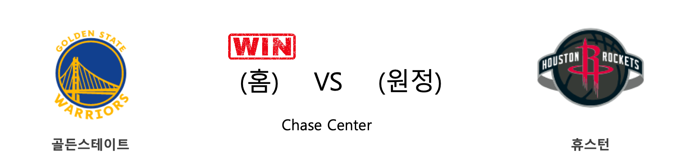
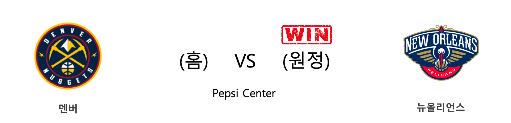
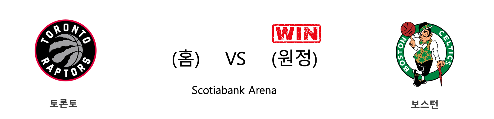

####  필라델피아(홈) VS 밀워키(원정) 

<table class="tg">
  <tr>
    <th class="tg-rr9t">PHI</th>
    <th class="tg-rr9t">팀</th>
    <th class="tg-rr9t">MIL</th>
  </tr>
  <tr>
    <td class="tg-dcpn">1승 0패</td>
    <td class="tg-rr9t">시즌 상대전적</td>
    <td class="tg-dcpn">0승 1패</td>
  </tr>
  <tr>
    <td class="tg-dcpn">121</td>
    <td class="tg-rr9t">점수</td>
    <td class="tg-dcpn">109</td>
  </tr>
  <tr>
    <td class="tg-dcpn">23/57(40%)</td>
    <td class="tg-rr9t">2점(%)</td>
    <td class="tg-dcpn">32/62(52%)</td>
  </tr>
  <tr>
    <td class="tg-dcpn">21/44(48%)</td>
    <td class="tg-rr9t">3점(%)</td>
    <td class="tg-dcpn">13/33(39%)</td>
  </tr>
  <tr>
    <td class="tg-dcpn">12/15(80%)</td>
    <td class="tg-rr9t">자유투(%)</td>
    <td class="tg-dcpn">6/8(75%)</td>
  </tr>
  <tr>
    <td class="tg-dcpn">49</td>
    <td class="tg-rr9t">리바운드</td>
    <td class="tg-dcpn">47</td>
  </tr>
  <tr>
    <td class="tg-dcpn">29</td>
    <td class="tg-rr9t">어시스트</td>
    <td class="tg-dcpn">23</td>
  </tr>
  <tr>
    <td class="tg-dcpn">9</td>
    <td class="tg-rr9t">스틸</td>
    <td class="tg-dcpn">6</td>
  </tr>
  <tr>
    <td class="tg-dcpn">7</td>
    <td class="tg-rr9t">블록</td>
    <td class="tg-dcpn">6</td>
  </tr>
  <tr>
    <td class="tg-dcpn">7</td>
    <td class="tg-rr9t">턴오버</td>
    <td class="tg-dcpn">10</td>
  </tr>
  <tr>
    <td class="tg-dcpn">BenSimmonsG(15) JoelEmbiidC(31) JoshRichardso(18) TobiasHarrisF(22) FurkanKorkmaz(16)</td>
    <td class="tg-rr9t">주요 득점선수</td>
    <td class="tg-dcpn">GiannisAnteto(18) GeorgeHill(15) KhrisMiddleto(31)</td>
  </tr>
</table>

#### 경기 관련 주요 기사         

[[오늘의 NBA] (3/18) MIL vs PHI, 거인들의 전투](http://sports.news.naver.com/basketball/news/read.nhn?oid=486&aid=0000000989)

[[오늘의 NBA] (12/26) NBA 2019년 크리스마스 축제](http://sports.news.naver.com/basketball/news/read.nhn?oid=486&aid=0000001177)

[[오늘의 NBA] (12/22) 휴스턴 원투펀치의 피닉스 홈코트 침공](http://sports.news.naver.com/basketball/news/read.nhn?oid=486&aid=0000001174)

[[오늘의 NBA] (12/21) 크리스탑스 포르징기스, 댈러스의 새로운 버팀목](http://sports.news.naver.com/basketball/news/read.nhn?oid=486&aid=0000001173)

[[오늘의 NBA] (12/14) 레이커스, 마이애미 홈 코트를 점령하다](http://sports.news.naver.com/basketball/news/read.nhn?oid=486&aid=0000001166)

        
        

####  골든스테이트(홈) VS 휴스턴(원정) 

<table class="tg">
  <tr>
    <th class="tg-rr9t">GSW</th>
    <th class="tg-rr9t">팀</th>
    <th class="tg-rr9t">HOU</th>
  </tr>
  <tr>
    <td class="tg-dcpn">1승 1패</td>
    <td class="tg-rr9t">시즌 상대전적</td>
    <td class="tg-dcpn">1승 1패</td>
  </tr>
  <tr>
    <td class="tg-dcpn">116</td>
    <td class="tg-rr9t">점수</td>
    <td class="tg-dcpn">104</td>
  </tr>
  <tr>
    <td class="tg-dcpn">32/59(54%)</td>
    <td class="tg-rr9t">2점(%)</td>
    <td class="tg-dcpn">21/49(43%)</td>
  </tr>
  <tr>
    <td class="tg-dcpn">9/28(32%)</td>
    <td class="tg-rr9t">3점(%)</td>
    <td class="tg-dcpn">16/51(31%)</td>
  </tr>
  <tr>
    <td class="tg-dcpn">25/28(89%)</td>
    <td class="tg-rr9t">자유투(%)</td>
    <td class="tg-dcpn">14/16(88%)</td>
  </tr>
  <tr>
    <td class="tg-dcpn">54</td>
    <td class="tg-rr9t">리바운드</td>
    <td class="tg-dcpn">49</td>
  </tr>
  <tr>
    <td class="tg-dcpn">27</td>
    <td class="tg-rr9t">어시스트</td>
    <td class="tg-dcpn">19</td>
  </tr>
  <tr>
    <td class="tg-dcpn">7</td>
    <td class="tg-rr9t">스틸</td>
    <td class="tg-dcpn">8</td>
  </tr>
  <tr>
    <td class="tg-dcpn">8</td>
    <td class="tg-rr9t">블록</td>
    <td class="tg-dcpn">3</td>
  </tr>
  <tr>
    <td class="tg-dcpn">16</td>
    <td class="tg-rr9t">턴오버</td>
    <td class="tg-dcpn">12</td>
  </tr>
  <tr>
    <td class="tg-dcpn">D'AngeloRusse(20) DamionLeeG(22) DraymondGreen(20) GlennRobinson(18)</td>
    <td class="tg-rr9t">주요 득점선수</td>
    <td class="tg-dcpn">DanuelHouseJr(18) RussellWestbr(30) JamesHardenG(24)</td>
  </tr>
</table>

#### 경기 관련 주요 기사         

[[오늘의 NBA] (12/12) 제임스 하든 선생님의 심폐소생술](http://sports.news.naver.com/basketball/news/read.nhn?oid=486&aid=0000001164)

[[오늘의 NBA] (10/31) HOU vs WAS, NBA 득점 쟁탈전 역사를 새로 쓰다](http://sports.news.naver.com/basketball/news/read.nhn?oid=486&aid=0000001123)

[[오늘의 NBA] (12/21) 크리스탑스 포르징기스, 댈러스의 새로운 버팀목](http://sports.news.naver.com/basketball/news/read.nhn?oid=486&aid=0000001173)

[[오늘의 NBA] (12/26) NBA 2019년 크리스마스 축제](http://sports.news.naver.com/basketball/news/read.nhn?oid=486&aid=0000001177)

[[오늘의 NBA] (11/24) 잭 라빈, GSW 스플래쉬 브라더스를 소환하다](http://sports.news.naver.com/basketball/news/read.nhn?oid=486&aid=0000001147)

        
        

####  LA레이커스(홈) VS LA클리퍼스(원정) 

<table class="tg">
  <tr>
    <th class="tg-rr9t">LAL</th>
    <th class="tg-rr9t">팀</th>
    <th class="tg-rr9t">LAC</th>
  </tr>
  <tr>
    <td class="tg-dcpn">0승 2패</td>
    <td class="tg-rr9t">시즌 상대전적</td>
    <td class="tg-dcpn">2승 0패</td>
  </tr>
  <tr>
    <td class="tg-dcpn">106</td>
    <td class="tg-rr9t">점수</td>
    <td class="tg-dcpn">111</td>
  </tr>
  <tr>
    <td class="tg-dcpn">27/51(53%)</td>
    <td class="tg-rr9t">2점(%)</td>
    <td class="tg-dcpn">30/60(50%)</td>
  </tr>
  <tr>
    <td class="tg-dcpn">12/45(27%)</td>
    <td class="tg-rr9t">3점(%)</td>
    <td class="tg-dcpn">9/25(36%)</td>
  </tr>
  <tr>
    <td class="tg-dcpn">16/21(76%)</td>
    <td class="tg-rr9t">자유투(%)</td>
    <td class="tg-dcpn">24/32(75%)</td>
  </tr>
  <tr>
    <td class="tg-dcpn">42</td>
    <td class="tg-rr9t">리바운드</td>
    <td class="tg-dcpn">50</td>
  </tr>
  <tr>
    <td class="tg-dcpn">24</td>
    <td class="tg-rr9t">어시스트</td>
    <td class="tg-dcpn">24</td>
  </tr>
  <tr>
    <td class="tg-dcpn">11</td>
    <td class="tg-rr9t">스틸</td>
    <td class="tg-dcpn">6</td>
  </tr>
  <tr>
    <td class="tg-dcpn">10</td>
    <td class="tg-rr9t">블록</td>
    <td class="tg-dcpn">6</td>
  </tr>
  <tr>
    <td class="tg-dcpn">13</td>
    <td class="tg-rr9t">턴오버</td>
    <td class="tg-dcpn">16</td>
  </tr>
  <tr>
    <td class="tg-dcpn">AnthonyDavisF(24) KyleKuzma(25) LeBronJamesF(23)</td>
    <td class="tg-rr9t">주요 득점선수</td>
    <td class="tg-dcpn">PaulGeorgeG(17) MontrezlHarre(18) KawhiLeonardF(35)</td>
  </tr>
</table>

#### 경기 관련 주요 기사         

[[오늘의 NBA] (12/20) 밀워키, 리그 전체 단독 1위 등극!](http://sports.news.naver.com/basketball/news/read.nhn?oid=486&aid=0000001172)

[[오늘의 NBA] (12/26) NBA 2019년 크리스마스 축제](http://sports.news.naver.com/basketball/news/read.nhn?oid=486&aid=0000001177)

[[오늘의 NBA] (12/18) 인디애나, LAL 원정 연승 행진을 멈추다](http://sports.news.naver.com/basketball/news/read.nhn?oid=486&aid=0000001170)

[[오늘의 NBA] (12/23) 토론토, 포기할 줄 모르는 북방의 투사](http://sports.news.naver.com/basketball/news/read.nhn?oid=486&aid=0000001175)

[[위클리 NBA] ‘반드시 설욕한다’ LAL과 LAC의 성탄절 매치](http://sports.news.naver.com/basketball/news/read.nhn?oid=065&aid=0000194400)

        
        

####  덴버(홈) VS 뉴올리언스(원정) 

<table class="tg">
  <tr>
    <th class="tg-rr9t">DEN</th>
    <th class="tg-rr9t">팀</th>
    <th class="tg-rr9t">NOP</th>
  </tr>
  <tr>
    <td class="tg-dcpn">0승 2패</td>
    <td class="tg-rr9t">시즌 상대전적</td>
    <td class="tg-dcpn">2승 0패</td>
  </tr>
  <tr>
    <td class="tg-dcpn">100</td>
    <td class="tg-rr9t">점수</td>
    <td class="tg-dcpn">112</td>
  </tr>
  <tr>
    <td class="tg-dcpn">25/55(45%)</td>
    <td class="tg-rr9t">2점(%)</td>
    <td class="tg-dcpn">23/47(49%)</td>
  </tr>
  <tr>
    <td class="tg-dcpn">12/37(32%)</td>
    <td class="tg-rr9t">3점(%)</td>
    <td class="tg-dcpn">18/43(42%)</td>
  </tr>
  <tr>
    <td class="tg-dcpn">14/18(78%)</td>
    <td class="tg-rr9t">자유투(%)</td>
    <td class="tg-dcpn">12/12(100%)</td>
  </tr>
  <tr>
    <td class="tg-dcpn">40</td>
    <td class="tg-rr9t">리바운드</td>
    <td class="tg-dcpn">52</td>
  </tr>
  <tr>
    <td class="tg-dcpn">24</td>
    <td class="tg-rr9t">어시스트</td>
    <td class="tg-dcpn">23</td>
  </tr>
  <tr>
    <td class="tg-dcpn">10</td>
    <td class="tg-rr9t">스틸</td>
    <td class="tg-dcpn">9</td>
  </tr>
  <tr>
    <td class="tg-dcpn">4</td>
    <td class="tg-rr9t">블록</td>
    <td class="tg-dcpn">5</td>
  </tr>
  <tr>
    <td class="tg-dcpn">12</td>
    <td class="tg-rr9t">턴오버</td>
    <td class="tg-dcpn">18</td>
  </tr>
  <tr>
    <td class="tg-dcpn">JeramiGrant(17) GaryHarrisG(15) NikolaJokicC(23)</td>
    <td class="tg-rr9t">주요 득점선수</td>
    <td class="tg-dcpn">BrandonIngram(31) JJRedickG(15) JrueHolidayG(20) JoshHart(16)</td>
  </tr>
</table>

#### 경기 관련 주요 기사         

[[오늘의 NBA] (12/26) NBA 2019년 크리스마스 축제](http://sports.news.naver.com/basketball/news/read.nhn?oid=486&aid=0000001177)

[[오늘의 NBA] (12/16) 스펜서 딘위디, 브루클린 상승세를 이끈다!](http://sports.news.naver.com/basketball/news/read.nhn?oid=486&aid=0000001168)

[[오늘의 NBA] (12/24) 자말 머레이와 데빈 부커의 뒤틀린 운명](http://sports.news.naver.com/basketball/news/read.nhn?oid=486&aid=0000001176)

[[오늘의 NBA] (12/21) 크리스탑스 포르징기스, 댈러스의 새로운 버팀목](http://sports.news.naver.com/basketball/news/read.nhn?oid=486&aid=0000001173)

[[오늘의 NBA] (12/19) 오클라호마시티, 역전의 달인!](http://sports.news.naver.com/basketball/news/read.nhn?oid=486&aid=0000001171)

        
        

####  토론토(홈) VS 보스턴(원정) 

<table class="tg">
  <tr>
    <th class="tg-rr9t">TOR</th>
    <th class="tg-rr9t">팀</th>
    <th class="tg-rr9t">BOS</th>
  </tr>
  <tr>
    <td class="tg-dcpn">0승 2패</td>
    <td class="tg-rr9t">시즌 상대전적</td>
    <td class="tg-dcpn">2승 0패</td>
  </tr>
  <tr>
    <td class="tg-dcpn">102</td>
    <td class="tg-rr9t">점수</td>
    <td class="tg-dcpn">118</td>
  </tr>
  <tr>
    <td class="tg-dcpn">30/57(53%)</td>
    <td class="tg-rr9t">2점(%)</td>
    <td class="tg-dcpn">32/59(54%)</td>
  </tr>
  <tr>
    <td class="tg-dcpn">8/23(35%)</td>
    <td class="tg-rr9t">3점(%)</td>
    <td class="tg-dcpn">14/33(42%)</td>
  </tr>
  <tr>
    <td class="tg-dcpn">18/22(82%)</td>
    <td class="tg-rr9t">자유투(%)</td>
    <td class="tg-dcpn">12/14(86%)</td>
  </tr>
  <tr>
    <td class="tg-dcpn">34</td>
    <td class="tg-rr9t">리바운드</td>
    <td class="tg-dcpn">45</td>
  </tr>
  <tr>
    <td class="tg-dcpn">17</td>
    <td class="tg-rr9t">어시스트</td>
    <td class="tg-dcpn">26</td>
  </tr>
  <tr>
    <td class="tg-dcpn">13</td>
    <td class="tg-rr9t">스틸</td>
    <td class="tg-dcpn">7</td>
  </tr>
  <tr>
    <td class="tg-dcpn">7</td>
    <td class="tg-rr9t">블록</td>
    <td class="tg-dcpn">3</td>
  </tr>
  <tr>
    <td class="tg-dcpn">17</td>
    <td class="tg-rr9t">턴오버</td>
    <td class="tg-dcpn">19</td>
  </tr>
  <tr>
    <td class="tg-dcpn">FredVanVleetG(27) ChrisBoucher(24)</td>
    <td class="tg-rr9t">주요 득점선수</td>
    <td class="tg-dcpn">JaylenBrownG(30) KembaWalkerG(22)</td>
  </tr>
</table>

#### 경기 관련 주요 기사         

[[오늘의 NBA] (12/12) 제임스 하든 선생님의 심폐소생술](http://sports.news.naver.com/basketball/news/read.nhn?oid=486&aid=0000001164)

[[오늘의 NBA] (12/26) NBA 2019년 크리스마스 축제](http://sports.news.naver.com/basketball/news/read.nhn?oid=486&aid=0000001177)

[[오늘의 NBA] (11/28) 앤써니 데이비스, 노란 셔츠를 입은 사나이](http://sports.news.naver.com/basketball/news/read.nhn?oid=486&aid=0000001151)

[[오늘의 NBA] (12/23) 토론토, 포기할 줄 모르는 북방의 투사](http://sports.news.naver.com/basketball/news/read.nhn?oid=486&aid=0000001175)

[[오늘의 NBA] (12/2) 토론토, 두 마리 토끼를 노린다!](http://sports.news.naver.com/basketball/news/read.nhn?oid=486&aid=0000001154)

        
        

#### 리그 (Eastern) 순위
    

<table class="tg">
  <tr>
    <th class="tg-d14o">순위</th>
    <th class="tg-d14o">팀명</th>
    <th class="tg-d14o">경기수</th>
    <th class="tg-d14o">승</th>
    <th class="tg-d14o">패</th>
    <th class="tg-d14o">승차</th>
    <th class="tg-d14o">승률</th>
  </tr>
  
<tr>
    <td class="tg-50j8">1</td>
    <td class="tg-50j8">MIL</td>
    <td class="tg-50j8">32</td>
    <td class="tg-50j8">27</td>
    <td class="tg-50j8">5</td>
    <td class="tg-50j8">0</td>
    <td class="tg-50j8">0.844</td>
</tr>

<tr>
    <td class="tg-50j8">2</td>
    <td class="tg-50j8">MIA</td>
    <td class="tg-50j8">30</td>
    <td class="tg-50j8">22</td>
    <td class="tg-50j8">8</td>
    <td class="tg-50j8">5</td>
    <td class="tg-50j8">0.733</td>
</tr>

<tr>
    <td class="tg-50j8">3</td>
    <td class="tg-50j8">PHI</td>
    <td class="tg-50j8">32</td>
    <td class="tg-50j8">22</td>
    <td class="tg-50j8">10</td>
    <td class="tg-50j8">5</td>
    <td class="tg-50j8">0.688</td>
</tr>

<tr>
    <td class="tg-50j8">4</td>
    <td class="tg-50j8">BOS</td>
    <td class="tg-50j8">27</td>
    <td class="tg-50j8">21</td>
    <td class="tg-50j8">6</td>
    <td class="tg-50j8">6</td>
    <td class="tg-50j8">0.778</td>
</tr>

<tr>
    <td class="tg-50j8">5</td>
    <td class="tg-50j8">TOR</td>
    <td class="tg-50j8">31</td>
    <td class="tg-50j8">21</td>
    <td class="tg-50j8">10</td>
    <td class="tg-50j8">6</td>
    <td class="tg-50j8">0.677</td>
</tr>

<tr>
    <td class="tg-50j8">5</td>
    <td class="tg-50j8">IND</td>
    <td class="tg-50j8">31</td>
    <td class="tg-50j8">21</td>
    <td class="tg-50j8">10</td>
    <td class="tg-50j8">6</td>
    <td class="tg-50j8">0.677</td>
</tr>

<tr>
    <td class="tg-50j8">7</td>
    <td class="tg-50j8">BKN</td>
    <td class="tg-50j8">29</td>
    <td class="tg-50j8">16</td>
    <td class="tg-50j8">13</td>
    <td class="tg-50j8">11</td>
    <td class="tg-50j8">0.552</td>
</tr>

<tr>
    <td class="tg-50j8">8</td>
    <td class="tg-50j8">ORL</td>
    <td class="tg-50j8">30</td>
    <td class="tg-50j8">13</td>
    <td class="tg-50j8">17</td>
    <td class="tg-50j8">14</td>
    <td class="tg-50j8">0.433</td>
</tr>

<tr>
    <td class="tg-50j8">9</td>
    <td class="tg-50j8">CHA</td>
    <td class="tg-50j8">33</td>
    <td class="tg-50j8">13</td>
    <td class="tg-50j8">20</td>
    <td class="tg-50j8">14</td>
    <td class="tg-50j8">0.394</td>
</tr>

<tr>
    <td class="tg-50j8">10</td>
    <td class="tg-50j8">CHI</td>
    <td class="tg-50j8">32</td>
    <td class="tg-50j8">12</td>
    <td class="tg-50j8">20</td>
    <td class="tg-50j8">15</td>
    <td class="tg-50j8">0.375</td>
</tr>

<tr>
    <td class="tg-50j8">11</td>
    <td class="tg-50j8">DET</td>
    <td class="tg-50j8">30</td>
    <td class="tg-50j8">11</td>
    <td class="tg-50j8">19</td>
    <td class="tg-50j8">16</td>
    <td class="tg-50j8">0.367</td>
</tr>

<tr>
    <td class="tg-50j8">12</td>
    <td class="tg-50j8">WAS</td>
    <td class="tg-50j8">29</td>
    <td class="tg-50j8">9</td>
    <td class="tg-50j8">20</td>
    <td class="tg-50j8">18</td>
    <td class="tg-50j8">0.31</td>
</tr>

<tr>
    <td class="tg-50j8">13</td>
    <td class="tg-50j8">CLE</td>
    <td class="tg-50j8">29</td>
    <td class="tg-50j8">8</td>
    <td class="tg-50j8">21</td>
    <td class="tg-50j8">19</td>
    <td class="tg-50j8">0.276</td>
</tr>

<tr>
    <td class="tg-50j8">14</td>
    <td class="tg-50j8">NYK</td>
    <td class="tg-50j8">31</td>
    <td class="tg-50j8">7</td>
    <td class="tg-50j8">24</td>
    <td class="tg-50j8">20</td>
    <td class="tg-50j8">0.226</td>
</tr>

<tr>
    <td class="tg-50j8">15</td>
    <td class="tg-50j8">ATL</td>
    <td class="tg-50j8">31</td>
    <td class="tg-50j8">6</td>
    <td class="tg-50j8">25</td>
    <td class="tg-50j8">21</td>
    <td class="tg-50j8">0.194</td>
</tr>
</table> 
#### 리그 (Western) 순위
    

<table class="tg">
  <tr>
    <th class="tg-d14o">순위</th>
    <th class="tg-d14o">팀명</th>
    <th class="tg-d14o">경기수</th>
    <th class="tg-d14o">승</th>
    <th class="tg-d14o">패</th>
    <th class="tg-d14o">승차</th>
    <th class="tg-d14o">승률</th>
  </tr>
  
<tr>
    <td class="tg-50j8">1</td>
    <td class="tg-50j8">LAL</td>
    <td class="tg-50j8">31</td>
    <td class="tg-50j8">24</td>
    <td class="tg-50j8">7</td>
    <td class="tg-50j8">3</td>
    <td class="tg-50j8">0.774</td>
</tr>

<tr>
    <td class="tg-50j8">2</td>
    <td class="tg-50j8">LAC</td>
    <td class="tg-50j8">33</td>
    <td class="tg-50j8">23</td>
    <td class="tg-50j8">10</td>
    <td class="tg-50j8">4</td>
    <td class="tg-50j8">0.697</td>
</tr>

<tr>
    <td class="tg-50j8">3</td>
    <td class="tg-50j8">HOU</td>
    <td class="tg-50j8">31</td>
    <td class="tg-50j8">21</td>
    <td class="tg-50j8">10</td>
    <td class="tg-50j8">6</td>
    <td class="tg-50j8">0.677</td>
</tr>

<tr>
    <td class="tg-50j8">4</td>
    <td class="tg-50j8">DEN</td>
    <td class="tg-50j8">29</td>
    <td class="tg-50j8">20</td>
    <td class="tg-50j8">9</td>
    <td class="tg-50j8">7</td>
    <td class="tg-50j8">0.69</td>
</tr>

<tr>
    <td class="tg-50j8">5</td>
    <td class="tg-50j8">DAL</td>
    <td class="tg-50j8">28</td>
    <td class="tg-50j8">18</td>
    <td class="tg-50j8">10</td>
    <td class="tg-50j8">9</td>
    <td class="tg-50j8">0.643</td>
</tr>

<tr>
    <td class="tg-50j8">6</td>
    <td class="tg-50j8">UTA</td>
    <td class="tg-50j8">30</td>
    <td class="tg-50j8">18</td>
    <td class="tg-50j8">12</td>
    <td class="tg-50j8">9</td>
    <td class="tg-50j8">0.6</td>
</tr>

<tr>
    <td class="tg-50j8">7</td>
    <td class="tg-50j8">OKC</td>
    <td class="tg-50j8">29</td>
    <td class="tg-50j8">15</td>
    <td class="tg-50j8">14</td>
    <td class="tg-50j8">12</td>
    <td class="tg-50j8">0.517</td>
</tr>

<tr>
    <td class="tg-50j8">8</td>
    <td class="tg-50j8">POR</td>
    <td class="tg-50j8">30</td>
    <td class="tg-50j8">14</td>
    <td class="tg-50j8">16</td>
    <td class="tg-50j8">13</td>
    <td class="tg-50j8">0.467</td>
</tr>

<tr>
    <td class="tg-50j8">9</td>
    <td class="tg-50j8">SAS</td>
    <td class="tg-50j8">28</td>
    <td class="tg-50j8">12</td>
    <td class="tg-50j8">16</td>
    <td class="tg-50j8">15</td>
    <td class="tg-50j8">0.429</td>
</tr>

<tr>
    <td class="tg-50j8">10</td>
    <td class="tg-50j8">SAC</td>
    <td class="tg-50j8">30</td>
    <td class="tg-50j8">12</td>
    <td class="tg-50j8">18</td>
    <td class="tg-50j8">15</td>
    <td class="tg-50j8">0.4</td>
</tr>

<tr>
    <td class="tg-50j8">11</td>
    <td class="tg-50j8">PHX</td>
    <td class="tg-50j8">30</td>
    <td class="tg-50j8">11</td>
    <td class="tg-50j8">19</td>
    <td class="tg-50j8">16</td>
    <td class="tg-50j8">0.367</td>
</tr>

<tr>
    <td class="tg-50j8">12</td>
    <td class="tg-50j8">MEM</td>
    <td class="tg-50j8">31</td>
    <td class="tg-50j8">11</td>
    <td class="tg-50j8">20</td>
    <td class="tg-50j8">16</td>
    <td class="tg-50j8">0.355</td>
</tr>

<tr>
    <td class="tg-50j8">13</td>
    <td class="tg-50j8">MIN</td>
    <td class="tg-50j8">29</td>
    <td class="tg-50j8">10</td>
    <td class="tg-50j8">19</td>
    <td class="tg-50j8">17</td>
    <td class="tg-50j8">0.345</td>
</tr>

<tr>
    <td class="tg-50j8">14</td>
    <td class="tg-50j8">NOP</td>
    <td class="tg-50j8">32</td>
    <td class="tg-50j8">9</td>
    <td class="tg-50j8">23</td>
    <td class="tg-50j8">18</td>
    <td class="tg-50j8">0.281</td>
</tr>

<tr>
    <td class="tg-50j8">15</td>
    <td class="tg-50j8">GSW</td>
    <td class="tg-50j8">32</td>
    <td class="tg-50j8">8</td>
    <td class="tg-50j8">24</td>
    <td class="tg-50j8">19</td>
    <td class="tg-50j8">0.25</td>
</tr>
</table> 

        
        
#nba #미국농구 #엔비에이 #농구분석 #토토 #스포츠토토 #경기예측 #농구결과 #20191226 #필라델피아 #밀워키 #골든스테이트 #휴스턴 #LA레이커스 #LA클리퍼스 #덴버 #뉴올리언스 #토론토 #보스턴 #필라델피아밀워키 #골든스테이트휴스턴 #LA레이커스LA클리퍼스 #덴버뉴올리언스 #토론토보스턴 