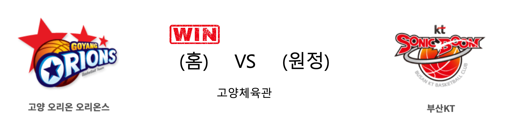
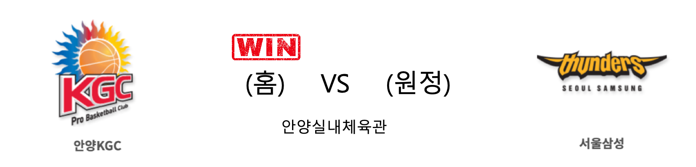

####  고양오리온(홈) VS 부산KT(원정) 

<table class="tg">
  <tr>
    <th class="tg-rr9t">고양오리온</th>
    <th class="tg-rr9t">팀</th>
    <th class="tg-rr9t">부산KT</th>
  </tr>
  <tr>
    <td class="tg-dcpn">1승 2패</td>
    <td class="tg-rr9t">시즌 상대전적</td>
    <td class="tg-dcpn">2승 1패</td>
  </tr>
  <tr>
    <td class="tg-dcpn">91</td>
    <td class="tg-rr9t">점수</td>
    <td class="tg-dcpn">87</td>
  </tr>
  <tr>
    <td class="tg-dcpn">27/45(60%)</td>
    <td class="tg-rr9t">2점(%)</td>
    <td class="tg-dcpn">19/35(54%)</td>
  </tr>
  <tr>
    <td class="tg-dcpn">6/15(40%)</td>
    <td class="tg-rr9t">3점(%)</td>
    <td class="tg-dcpn">10/24(42%)</td>
  </tr>
  <tr>
    <td class="tg-dcpn">19/25(76%)</td>
    <td class="tg-rr9t">자유투(%)</td>
    <td class="tg-dcpn">19/24(79%)</td>
  </tr>
  <tr>
    <td class="tg-dcpn">33</td>
    <td class="tg-rr9t">리바운드</td>
    <td class="tg-dcpn">25</td>
  </tr>
  <tr>
    <td class="tg-dcpn">2</td>
    <td class="tg-rr9t">어시스트</td>
    <td class="tg-dcpn">1</td>
  </tr>
  <tr>
    <td class="tg-dcpn">9</td>
    <td class="tg-rr9t">스틸</td>
    <td class="tg-dcpn">10</td>
  </tr>
  <tr>
    <td class="tg-dcpn">3</td>
    <td class="tg-rr9t">블록</td>
    <td class="tg-dcpn">6</td>
  </tr>
  <tr>
    <td class="tg-dcpn">18</td>
    <td class="tg-rr9t">턴오버</td>
    <td class="tg-dcpn">17</td>
  </tr>
  <tr>
    <td class="tg-dcpn">보리스 사보비치(19) 최진수(21) 이현민(17)</td>
    <td class="tg-rr9t">주요 득점선수</td>
    <td class="tg-dcpn">알 쏜튼(24) 최성모(18) 양홍석(20)</td>
  </tr>
</table>

#### 경기 관련 주요 기사         

[[사진]오리온-KT,'엇갈린 희비'](http://www.osen.co.kr/article/G1111284473)

[오리온 `KT 꺾고 6연패 탈출` [MK포토]](http://mksports.co.kr/view/2019/1092121/)

[최진수 21점…프로농구 오리온, kt 꺾고 6연패 마감](http://yna.kr/AKR20191228038800007?did=1195m)

[[MD포토] 오리온 '드디어 연패 탈출!'](http://www.mydaily.co.kr/new_yk/html/read.php?newsid=201912281714679377&ext=na)

        
        

####  창원LG(홈) VS 울산현대모비스(원정) 

<table class="tg">
  <tr>
    <th class="tg-rr9t">창원LG</th>
    <th class="tg-rr9t">팀</th>
    <th class="tg-rr9t">울산현대모비스</th>
  </tr>
  <tr>
    <td class="tg-dcpn">1승 2패</td>
    <td class="tg-rr9t">시즌 상대전적</td>
    <td class="tg-dcpn">2승 1패</td>
  </tr>
  <tr>
    <td class="tg-dcpn">67</td>
    <td class="tg-rr9t">점수</td>
    <td class="tg-dcpn">80</td>
  </tr>
  <tr>
    <td class="tg-dcpn">21/44(48%)</td>
    <td class="tg-rr9t">2점(%)</td>
    <td class="tg-dcpn">21/41(51%)</td>
  </tr>
  <tr>
    <td class="tg-dcpn">4/19(21%)</td>
    <td class="tg-rr9t">3점(%)</td>
    <td class="tg-dcpn">10/26(38%)</td>
  </tr>
  <tr>
    <td class="tg-dcpn">13/16(81%)</td>
    <td class="tg-rr9t">자유투(%)</td>
    <td class="tg-dcpn">8/11(73%)</td>
  </tr>
  <tr>
    <td class="tg-dcpn">28</td>
    <td class="tg-rr9t">리바운드</td>
    <td class="tg-dcpn">40</td>
  </tr>
  <tr>
    <td class="tg-dcpn">1</td>
    <td class="tg-rr9t">어시스트</td>
    <td class="tg-dcpn">0</td>
  </tr>
  <tr>
    <td class="tg-dcpn">5</td>
    <td class="tg-rr9t">스틸</td>
    <td class="tg-dcpn">5</td>
  </tr>
  <tr>
    <td class="tg-dcpn">2</td>
    <td class="tg-rr9t">블록</td>
    <td class="tg-dcpn">4</td>
  </tr>
  <tr>
    <td class="tg-dcpn">10</td>
    <td class="tg-rr9t">턴오버</td>
    <td class="tg-dcpn">27</td>
  </tr>
  <tr>
    <td class="tg-dcpn">캐디 라렌(27) 이원대(18)</td>
    <td class="tg-rr9t">주요 득점선수</td>
    <td class="tg-dcpn">리온 윌리엄스(25)</td>
  </tr>
</table>

#### 경기 관련 주요 기사         

['윌리엄스 더블더블' 현대모비스, LG 꺾고 신바람 2연승](http://www.sportsseoul.com/news/read/866237)

[[BK Review] 노련한 현대모비스, 김시래 없는 LG 격파](http://www.basketkorea.com/news/articleView.html?idxno=191135)

['윌리엄스 25P-17R' 현대모비스, LG에 완승 '원정 3연패 탈출'](http://www.osen.co.kr/article/G1111284484)

        
        

####  안양KGC(홈) VS 서울삼성(원정) 

<table class="tg">
  <tr>
    <th class="tg-rr9t">안양KGC</th>
    <th class="tg-rr9t">팀</th>
    <th class="tg-rr9t">서울삼성</th>
  </tr>
  <tr>
    <td class="tg-dcpn">2승 1패</td>
    <td class="tg-rr9t">시즌 상대전적</td>
    <td class="tg-dcpn">1승 2패</td>
  </tr>
  <tr>
    <td class="tg-dcpn">81</td>
    <td class="tg-rr9t">점수</td>
    <td class="tg-dcpn">80</td>
  </tr>
  <tr>
    <td class="tg-dcpn">16/29(55%)</td>
    <td class="tg-rr9t">2점(%)</td>
    <td class="tg-dcpn">16/26(62%)</td>
  </tr>
  <tr>
    <td class="tg-dcpn">11/34(32%)</td>
    <td class="tg-rr9t">3점(%)</td>
    <td class="tg-dcpn">13/34(38%)</td>
  </tr>
  <tr>
    <td class="tg-dcpn">16/24(67%)</td>
    <td class="tg-rr9t">자유투(%)</td>
    <td class="tg-dcpn">9/16(56%)</td>
  </tr>
  <tr>
    <td class="tg-dcpn">36</td>
    <td class="tg-rr9t">리바운드</td>
    <td class="tg-dcpn">22</td>
  </tr>
  <tr>
    <td class="tg-dcpn">1</td>
    <td class="tg-rr9t">어시스트</td>
    <td class="tg-dcpn">1</td>
  </tr>
  <tr>
    <td class="tg-dcpn">9</td>
    <td class="tg-rr9t">스틸</td>
    <td class="tg-dcpn">11</td>
  </tr>
  <tr>
    <td class="tg-dcpn">6</td>
    <td class="tg-rr9t">블록</td>
    <td class="tg-dcpn">4</td>
  </tr>
  <tr>
    <td class="tg-dcpn">14</td>
    <td class="tg-rr9t">턴오버</td>
    <td class="tg-dcpn">19</td>
  </tr>
  <tr>
    <td class="tg-dcpn">기승호(15) 박형철(15) 브랜든 브라운(27)</td>
    <td class="tg-rr9t">주요 득점선수</td>
    <td class="tg-dcpn">닉 미네라스(30)</td>
  </tr>
</table>

#### 경기 관련 주요 기사         

['브라운 27점 10R' KGC, 삼성 4연승 저지… 공동 2위 복귀](http://www.mydaily.co.kr/new_yk/html/read.php?newsid=201912281601922882&ext=na)

['브라운 골밑 장악' KGC, 삼성에 81-80 승리...공동 2위](http://www.osen.co.kr/article/G1111284487)

[KGC인삼공사, 홈에서 상승세의 삼성 만나](http://www.basketkorea.com/news/articleView.html?idxno=191133)

        
        

#### 리그 순위

<table class="tg">
  <tr>
    <th class="tg-d14o">순위</th>
    <th class="tg-d14o">팀명</th>
    <th class="tg-d14o">경기수</th>
    <th class="tg-d14o">승</th>
    <th class="tg-d14o">패</th>
    <th class="tg-d14o">승차</th>
    <th class="tg-d14o">승률</th>
  </tr>
  
<tr>
    <td class="tg-50j8">1</td>
    <td class="tg-50j8">서울SK</td>
    <td class="tg-50j8">26</td>
    <td class="tg-50j8">18</td>
    <td class="tg-50j8">8</td>
    <td class="tg-50j8">0</td>
    <td class="tg-50j8">0.692</td>
</tr>

<tr>
    <td class="tg-50j8">2</td>
    <td class="tg-50j8">전주KCC</td>
    <td class="tg-50j8">27</td>
    <td class="tg-50j8">17</td>
    <td class="tg-50j8">10</td>
    <td class="tg-50j8">1</td>
    <td class="tg-50j8">0.63</td>
</tr>

<tr>
    <td class="tg-50j8">2</td>
    <td class="tg-50j8">안양KGC</td>
    <td class="tg-50j8">27</td>
    <td class="tg-50j8">17</td>
    <td class="tg-50j8">10</td>
    <td class="tg-50j8">1</td>
    <td class="tg-50j8">0.63</td>
</tr>

<tr>
    <td class="tg-50j8">4</td>
    <td class="tg-50j8">인천전자랜드</td>
    <td class="tg-50j8">26</td>
    <td class="tg-50j8">14</td>
    <td class="tg-50j8">12</td>
    <td class="tg-50j8">4</td>
    <td class="tg-50j8">0.538</td>
</tr>

<tr>
    <td class="tg-50j8">4</td>
    <td class="tg-50j8">원주DB</td>
    <td class="tg-50j8">26</td>
    <td class="tg-50j8">14</td>
    <td class="tg-50j8">12</td>
    <td class="tg-50j8">4</td>
    <td class="tg-50j8">0.538</td>
</tr>

<tr>
    <td class="tg-50j8">6</td>
    <td class="tg-50j8">부산KT</td>
    <td class="tg-50j8">27</td>
    <td class="tg-50j8">13</td>
    <td class="tg-50j8">14</td>
    <td class="tg-50j8">5</td>
    <td class="tg-50j8">0.481</td>
</tr>

<tr>
    <td class="tg-50j8">7</td>
    <td class="tg-50j8">서울삼성</td>
    <td class="tg-50j8">27</td>
    <td class="tg-50j8">12</td>
    <td class="tg-50j8">15</td>
    <td class="tg-50j8">6</td>
    <td class="tg-50j8">0.444</td>
</tr>

<tr>
    <td class="tg-50j8">8</td>
    <td class="tg-50j8">울산현대모비스</td>
    <td class="tg-50j8">27</td>
    <td class="tg-50j8">11</td>
    <td class="tg-50j8">16</td>
    <td class="tg-50j8">7</td>
    <td class="tg-50j8">0.407</td>
</tr>

<tr>
    <td class="tg-50j8">9</td>
    <td class="tg-50j8">창원LG</td>
    <td class="tg-50j8">27</td>
    <td class="tg-50j8">9</td>
    <td class="tg-50j8">18</td>
    <td class="tg-50j8">9</td>
    <td class="tg-50j8">0.333</td>
</tr>

<tr>
    <td class="tg-50j8">10</td>
    <td class="tg-50j8">고양오리온</td>
    <td class="tg-50j8">26</td>
    <td class="tg-50j8">8</td>
    <td class="tg-50j8">18</td>
    <td class="tg-50j8">10</td>
    <td class="tg-50j8">0.308</td>
</tr>
</table> 

        
        
#kbl #국내농구 #농구분석 #토토 #스포츠토토 #경기예측 #농구결과 #20191228 #고양오리온 #부산KT #창원LG #울산현대모비스 #안양KGC #서울삼성 #고양오리온부산KT #창원LG울산현대모비스 #안양KGC서울삼성 