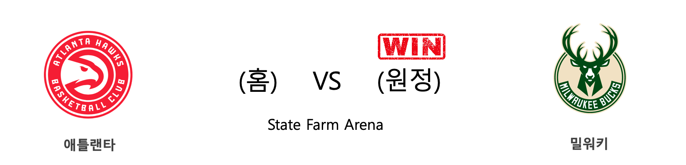

####  보스턴(홈) VS 클리블랜드(원정) 

<table class="tg">
  <tr>
    <th class="tg-rr9t">BOS</th>
    <th class="tg-rr9t">팀</th>
    <th class="tg-rr9t">CLE</th>
  </tr>
  <tr>
    <td class="tg-dcpn">3승 0패</td>
    <td class="tg-rr9t">시즌 상대전적</td>
    <td class="tg-dcpn">0승 3패</td>
  </tr>
  <tr>
    <td class="tg-dcpn">129</td>
    <td class="tg-rr9t">점수</td>
    <td class="tg-dcpn">117</td>
  </tr>
  <tr>
    <td class="tg-dcpn">35/55(64%)</td>
    <td class="tg-rr9t">2점(%)</td>
    <td class="tg-dcpn">35/62(56%)</td>
  </tr>
  <tr>
    <td class="tg-dcpn">14/40(35%)</td>
    <td class="tg-rr9t">3점(%)</td>
    <td class="tg-dcpn">9/23(39%)</td>
  </tr>
  <tr>
    <td class="tg-dcpn">17/19(89%)</td>
    <td class="tg-rr9t">자유투(%)</td>
    <td class="tg-dcpn">20/29(69%)</td>
  </tr>
  <tr>
    <td class="tg-dcpn">43</td>
    <td class="tg-rr9t">리바운드</td>
    <td class="tg-dcpn">38</td>
  </tr>
  <tr>
    <td class="tg-dcpn">28</td>
    <td class="tg-rr9t">어시스트</td>
    <td class="tg-dcpn">22</td>
  </tr>
  <tr>
    <td class="tg-dcpn">4</td>
    <td class="tg-rr9t">스틸</td>
    <td class="tg-dcpn">7</td>
  </tr>
  <tr>
    <td class="tg-dcpn">10</td>
    <td class="tg-rr9t">블록</td>
    <td class="tg-dcpn">3</td>
  </tr>
  <tr>
    <td class="tg-dcpn">11</td>
    <td class="tg-rr9t">턴오버</td>
    <td class="tg-dcpn">11</td>
  </tr>
  <tr>
    <td class="tg-dcpn">JaysonTatumF(30) JaylenBrownG(34)</td>
    <td class="tg-rr9t">주요 득점선수</td>
    <td class="tg-dcpn">KevinLoveF(30) CollinSextonG(21) KevinPorterJr(16)</td>
  </tr>
</table>

#### 경기 관련 주요 기사         

[[오늘의 NBA] (11/26) 마크 가솔, 조엘 엠비드의 영원한 악몽](http://sports.news.naver.com/basketball/news/read.nhn?oid=486&aid=0000001149)

[[오늘의 NBA] (11/6) 트레이 영, 애틀랜타의 특급 유망주](http://sports.news.naver.com/basketball/news/read.nhn?oid=486&aid=0000001129)

[[오늘의 NBA] (12/13) 조엘 엠비드, 천적 없는 보스턴 평원의 지배자](http://sports.news.naver.com/basketball/news/read.nhn?oid=486&aid=0000001165)

[[오늘의 NBA] (4/18) BOS, 해결사는 많을수록 좋다](http://sports.news.naver.com/basketball/news/read.nhn?oid=486&aid=0000001017)

[[오늘의 NBA] (12/12) 제임스 하든 선생님의 심폐소생술](http://sports.news.naver.com/basketball/news/read.nhn?oid=486&aid=0000001164)

        
        

####  골든스테이트(홈) VS 피닉스(원정) 

<table class="tg">
  <tr>
    <th class="tg-rr9t">GSW</th>
    <th class="tg-rr9t">팀</th>
    <th class="tg-rr9t">PHX</th>
  </tr>
  <tr>
    <td class="tg-dcpn">1승 1패</td>
    <td class="tg-rr9t">시즌 상대전적</td>
    <td class="tg-dcpn">1승 1패</td>
  </tr>
  <tr>
    <td class="tg-dcpn">105</td>
    <td class="tg-rr9t">점수</td>
    <td class="tg-dcpn">96</td>
  </tr>
  <tr>
    <td class="tg-dcpn">29/65(45%)</td>
    <td class="tg-rr9t">2점(%)</td>
    <td class="tg-dcpn">28/42(67%)</td>
  </tr>
  <tr>
    <td class="tg-dcpn">9/27(33%)</td>
    <td class="tg-rr9t">3점(%)</td>
    <td class="tg-dcpn">7/33(21%)</td>
  </tr>
  <tr>
    <td class="tg-dcpn">20/25(80%)</td>
    <td class="tg-rr9t">자유투(%)</td>
    <td class="tg-dcpn">19/24(79%)</td>
  </tr>
  <tr>
    <td class="tg-dcpn">41</td>
    <td class="tg-rr9t">리바운드</td>
    <td class="tg-dcpn">49</td>
  </tr>
  <tr>
    <td class="tg-dcpn">22</td>
    <td class="tg-rr9t">어시스트</td>
    <td class="tg-dcpn">22</td>
  </tr>
  <tr>
    <td class="tg-dcpn">10</td>
    <td class="tg-rr9t">스틸</td>
    <td class="tg-dcpn">6</td>
  </tr>
  <tr>
    <td class="tg-dcpn">5</td>
    <td class="tg-rr9t">블록</td>
    <td class="tg-dcpn">1</td>
  </tr>
  <tr>
    <td class="tg-dcpn">10</td>
    <td class="tg-rr9t">턴오버</td>
    <td class="tg-dcpn">26</td>
  </tr>
  <tr>
    <td class="tg-dcpn">DamionLeeG(16) D'AngeloRusse(31)</td>
    <td class="tg-rr9t">주요 득점선수</td>
    <td class="tg-dcpn">DevinBookerG(34)</td>
  </tr>
</table>

#### 경기 관련 주요 기사         

[[오늘의 NBA] (12/28) 골든스테이트, 수비 코트에서 시작된 대반격](http://sports.news.naver.com/basketball/news/read.nhn?oid=486&aid=0000001179)

[[오늘의 NBA] (12/21) 크리스탑스 포르징기스, 댈러스의 새로운 버팀목](http://sports.news.naver.com/basketball/news/read.nhn?oid=486&aid=0000001173)

[[오늘의 NBA] (12/3) 켈리 우브레 주니어, 피닉스의 터프가이](http://sports.news.naver.com/basketball/news/read.nhn?oid=486&aid=0000001155)

[[오늘의 NBA] (12/24) 자말 머레이와 데빈 부커의 뒤틀린 운명](http://sports.news.naver.com/basketball/news/read.nhn?oid=486&aid=0000001176)

[[오늘의 NBA] (11/24) 잭 라빈, GSW 스플래쉬 브라더스를 소환하다](http://sports.news.naver.com/basketball/news/read.nhn?oid=486&aid=0000001147)

        
        

####  애틀랜타(홈) VS 밀워키(원정) 

<table class="tg">
  <tr>
    <th class="tg-rr9t">ATL</th>
    <th class="tg-rr9t">팀</th>
    <th class="tg-rr9t">MIL</th>
  </tr>
  <tr>
    <td class="tg-dcpn">0승 3패</td>
    <td class="tg-rr9t">시즌 상대전적</td>
    <td class="tg-dcpn">3승 0패</td>
  </tr>
  <tr>
    <td class="tg-dcpn">86</td>
    <td class="tg-rr9t">점수</td>
    <td class="tg-dcpn">112</td>
  </tr>
  <tr>
    <td class="tg-dcpn">21/50(42%)</td>
    <td class="tg-rr9t">2점(%)</td>
    <td class="tg-dcpn">35/63(56%)</td>
  </tr>
  <tr>
    <td class="tg-dcpn">12/41(29%)</td>
    <td class="tg-rr9t">3점(%)</td>
    <td class="tg-dcpn">11/28(39%)</td>
  </tr>
  <tr>
    <td class="tg-dcpn">8/14(57%)</td>
    <td class="tg-rr9t">자유투(%)</td>
    <td class="tg-dcpn">9/13(69%)</td>
  </tr>
  <tr>
    <td class="tg-dcpn">46</td>
    <td class="tg-rr9t">리바운드</td>
    <td class="tg-dcpn">56</td>
  </tr>
  <tr>
    <td class="tg-dcpn">20</td>
    <td class="tg-rr9t">어시스트</td>
    <td class="tg-dcpn">29</td>
  </tr>
  <tr>
    <td class="tg-dcpn">10</td>
    <td class="tg-rr9t">스틸</td>
    <td class="tg-dcpn">9</td>
  </tr>
  <tr>
    <td class="tg-dcpn">8</td>
    <td class="tg-rr9t">블록</td>
    <td class="tg-dcpn">8</td>
  </tr>
  <tr>
    <td class="tg-dcpn">18</td>
    <td class="tg-rr9t">턴오버</td>
    <td class="tg-dcpn">18</td>
  </tr>
  <tr>
    <td class="tg-dcpn">AllenCrabbe(20)</td>
    <td class="tg-rr9t">주요 득점선수</td>
    <td class="tg-dcpn">KhrisMiddleto(23) ErsanIlyasova(18) BrookLopezC(19)</td>
  </tr>
</table>

#### 경기 관련 주요 기사         

[[오늘의 NBA] (12/12) 제임스 하든 선생님의 심폐소생술](http://sports.news.naver.com/basketball/news/read.nhn?oid=486&aid=0000001164)

[미들턴, 28일 ATL전에서 복귀...MIL에 호재](http://www.rookie.co.kr/news/articleView.html?idxno=35346)

[[오늘의 NBA] (12/14) 레이커스, 마이애미 홈 코트를 점령하다](http://sports.news.naver.com/basketball/news/read.nhn?oid=486&aid=0000001166)

[[오늘의 NBA] (12/17) 댈러스, 밀워키 시스템을 붕괴시키다](http://sports.news.naver.com/basketball/news/read.nhn?oid=486&aid=0000001169)

[류현진, 올-MLB 세컨드 팀 선발투수로 뽑혀](http://www.mbcsportsplus.com/news/?mode=view&cate=2&b_idx=99824001.000)

        
        

####  샬럿(홈) VS 오클라호마씨티(원정) 

<table class="tg">
  <tr>
    <th class="tg-rr9t">CHA</th>
    <th class="tg-rr9t">팀</th>
    <th class="tg-rr9t">OKC</th>
  </tr>
  <tr>
    <td class="tg-dcpn">0승 1패</td>
    <td class="tg-rr9t">시즌 상대전적</td>
    <td class="tg-dcpn">1승 0패</td>
  </tr>
  <tr>
    <td class="tg-dcpn">102</td>
    <td class="tg-rr9t">점수</td>
    <td class="tg-dcpn">104</td>
  </tr>
  <tr>
    <td class="tg-dcpn">35/62(56%)</td>
    <td class="tg-rr9t">2점(%)</td>
    <td class="tg-dcpn">35/58(60%)</td>
  </tr>
  <tr>
    <td class="tg-dcpn">7/39(18%)</td>
    <td class="tg-rr9t">3점(%)</td>
    <td class="tg-dcpn">5/31(16%)</td>
  </tr>
  <tr>
    <td class="tg-dcpn">11/18(61%)</td>
    <td class="tg-rr9t">자유투(%)</td>
    <td class="tg-dcpn">19/31(61%)</td>
  </tr>
  <tr>
    <td class="tg-dcpn">54</td>
    <td class="tg-rr9t">리바운드</td>
    <td class="tg-dcpn">49</td>
  </tr>
  <tr>
    <td class="tg-dcpn">26</td>
    <td class="tg-rr9t">어시스트</td>
    <td class="tg-dcpn">19</td>
  </tr>
  <tr>
    <td class="tg-dcpn">8</td>
    <td class="tg-rr9t">스틸</td>
    <td class="tg-dcpn">8</td>
  </tr>
  <tr>
    <td class="tg-dcpn">4</td>
    <td class="tg-rr9t">블록</td>
    <td class="tg-dcpn">4</td>
  </tr>
  <tr>
    <td class="tg-dcpn">15</td>
    <td class="tg-rr9t">턴오버</td>
    <td class="tg-dcpn">14</td>
  </tr>
  <tr>
    <td class="tg-dcpn">Devonte'Graha(15) TerryRozierG(26)</td>
    <td class="tg-rr9t">주요 득점선수</td>
    <td class="tg-dcpn">DennisSchrode(24) ShaiGilgeous-(27) ChrisPaulG(16)</td>
  </tr>
</table>

#### 경기 관련 주요 기사         

[[오늘의 NBA] (12/7) 르브론 제임스, 멜로(carmelo) 드라마의 주인공](http://sports.news.naver.com/basketball/news/read.nhn?oid=486&aid=0000001159)

[[오늘의 NBA] (12/10) 데릭 로즈, 모터 시티의 해결사](http://sports.news.naver.com/basketball/news/read.nhn?oid=486&aid=0000001162)

[[오늘의 NBA] (12/12) 제임스 하든 선생님의 심폐소생술](http://sports.news.naver.com/basketball/news/read.nhn?oid=486&aid=0000001164)

[[오늘의 NBA] (12/28) 골든스테이트, 수비 코트에서 시작된 대반격](http://sports.news.naver.com/basketball/news/read.nhn?oid=486&aid=0000001179)

[[오늘의 NBA] (12/23) 토론토, 포기할 줄 모르는 북방의 투사](http://sports.news.naver.com/basketball/news/read.nhn?oid=486&aid=0000001175)

        
        

####  마이애미(홈) VS 인디애나(원정) 

<table class="tg">
  <tr>
    <th class="tg-rr9t">MIA</th>
    <th class="tg-rr9t">팀</th>
    <th class="tg-rr9t">IND</th>
  </tr>
  <tr>
    <td class="tg-dcpn">1승 0패</td>
    <td class="tg-rr9t">시즌 상대전적</td>
    <td class="tg-dcpn">0승 1패</td>
  </tr>
  <tr>
    <td class="tg-dcpn">113</td>
    <td class="tg-rr9t">점수</td>
    <td class="tg-dcpn">112</td>
  </tr>
  <tr>
    <td class="tg-dcpn">24/51(47%)</td>
    <td class="tg-rr9t">2점(%)</td>
    <td class="tg-dcpn">30/59(51%)</td>
  </tr>
  <tr>
    <td class="tg-dcpn">16/38(42%)</td>
    <td class="tg-rr9t">3점(%)</td>
    <td class="tg-dcpn">14/31(45%)</td>
  </tr>
  <tr>
    <td class="tg-dcpn">17/19(89%)</td>
    <td class="tg-rr9t">자유투(%)</td>
    <td class="tg-dcpn">10/12(83%)</td>
  </tr>
  <tr>
    <td class="tg-dcpn">56</td>
    <td class="tg-rr9t">리바운드</td>
    <td class="tg-dcpn">34</td>
  </tr>
  <tr>
    <td class="tg-dcpn">29</td>
    <td class="tg-rr9t">어시스트</td>
    <td class="tg-dcpn">27</td>
  </tr>
  <tr>
    <td class="tg-dcpn">3</td>
    <td class="tg-rr9t">스틸</td>
    <td class="tg-dcpn">8</td>
  </tr>
  <tr>
    <td class="tg-dcpn">2</td>
    <td class="tg-rr9t">블록</td>
    <td class="tg-dcpn">4</td>
  </tr>
  <tr>
    <td class="tg-dcpn">13</td>
    <td class="tg-rr9t">턴오버</td>
    <td class="tg-dcpn">4</td>
  </tr>
  <tr>
    <td class="tg-dcpn">BamAdebayoF(18) DuncanRobinso(18) JimmyButlerF(20) KendrickNunnG(17)</td>
    <td class="tg-rr9t">주요 득점선수</td>
    <td class="tg-dcpn">JeremyLambG(16) T.J.WarrenF(16) AaronHolidayG(17)</td>
  </tr>
</table>

#### 경기 관련 주요 기사         

[[오늘의 NBA] (12/28) 골든스테이트, 수비 코트에서 시작된 대반격](http://sports.news.naver.com/basketball/news/read.nhn?oid=486&aid=0000001179)

[[오늘의 NBA] (11/28) 앤써니 데이비스, 노란 셔츠를 입은 사나이](http://sports.news.naver.com/basketball/news/read.nhn?oid=486&aid=0000001151)

[[오늘의 NBA] (12/12) 제임스 하든 선생님의 심폐소생술](http://sports.news.naver.com/basketball/news/read.nhn?oid=486&aid=0000001164)

[[오늘의 NBA] (12/23) 토론토, 포기할 줄 모르는 북방의 투사](http://sports.news.naver.com/basketball/news/read.nhn?oid=486&aid=0000001175)

[[오늘의 NBA] (12/14) 레이커스, 마이애미 홈 코트를 점령하다](http://sports.news.naver.com/basketball/news/read.nhn?oid=486&aid=0000001166)

        
        

####  올랜도(홈) VS 필라델피아(원정) 

<table class="tg">
  <tr>
    <th class="tg-rr9t">ORL</th>
    <th class="tg-rr9t">팀</th>
    <th class="tg-rr9t">PHI</th>
  </tr>
  <tr>
    <td class="tg-dcpn">2승 0패</td>
    <td class="tg-rr9t">시즌 상대전적</td>
    <td class="tg-dcpn">0승 2패</td>
  </tr>
  <tr>
    <td class="tg-dcpn">98</td>
    <td class="tg-rr9t">점수</td>
    <td class="tg-dcpn">97</td>
  </tr>
  <tr>
    <td class="tg-dcpn">27/58(47%)</td>
    <td class="tg-rr9t">2점(%)</td>
    <td class="tg-dcpn">25/58(43%)</td>
  </tr>
  <tr>
    <td class="tg-dcpn">10/30(33%)</td>
    <td class="tg-rr9t">3점(%)</td>
    <td class="tg-dcpn">10/29(34%)</td>
  </tr>
  <tr>
    <td class="tg-dcpn">14/23(61%)</td>
    <td class="tg-rr9t">자유투(%)</td>
    <td class="tg-dcpn">17/21(81%)</td>
  </tr>
  <tr>
    <td class="tg-dcpn">48</td>
    <td class="tg-rr9t">리바운드</td>
    <td class="tg-dcpn">45</td>
  </tr>
  <tr>
    <td class="tg-dcpn">26</td>
    <td class="tg-rr9t">어시스트</td>
    <td class="tg-dcpn">23</td>
  </tr>
  <tr>
    <td class="tg-dcpn">4</td>
    <td class="tg-rr9t">스틸</td>
    <td class="tg-dcpn">10</td>
  </tr>
  <tr>
    <td class="tg-dcpn">5</td>
    <td class="tg-rr9t">블록</td>
    <td class="tg-dcpn">3</td>
  </tr>
  <tr>
    <td class="tg-dcpn">15</td>
    <td class="tg-rr9t">턴오버</td>
    <td class="tg-dcpn">15</td>
  </tr>
  <tr>
    <td class="tg-dcpn">EvanFournierG(20) TerrenceRoss(17) NikolaVucevic(16) AaronGordonF(19)</td>
    <td class="tg-rr9t">주요 득점선수</td>
    <td class="tg-dcpn">TobiasHarrisF(24) JoelEmbiidC(24) JoshRichardso(15)</td>
  </tr>
</table>

#### 경기 관련 주요 기사         

[[오늘의 NBA] (12/21) 크리스탑스 포르징기스, 댈러스의 새로운 버팀목](http://sports.news.naver.com/basketball/news/read.nhn?oid=486&aid=0000001173)

[[오늘의 NBA] (12/19) 오클라호마시티, 역전의 달인!](http://sports.news.naver.com/basketball/news/read.nhn?oid=486&aid=0000001171)

[[오늘의 NBA] (12/24) 자말 머레이와 데빈 부커의 뒤틀린 운명](http://sports.news.naver.com/basketball/news/read.nhn?oid=486&aid=0000001176)

[[오늘의 NBA] (12/28) 골든스테이트, 수비 코트에서 시작된 대반격](http://sports.news.naver.com/basketball/news/read.nhn?oid=486&aid=0000001179)

[[오늘의 NBA] (12/14) 레이커스, 마이애미 홈 코트를 점령하다](http://sports.news.naver.com/basketball/news/read.nhn?oid=486&aid=0000001166)

        
        

#### 리그 (Eastern) 순위
    

<table class="tg">
  <tr>
    <th class="tg-d14o">순위</th>
    <th class="tg-d14o">팀명</th>
    <th class="tg-d14o">경기수</th>
    <th class="tg-d14o">승</th>
    <th class="tg-d14o">패</th>
    <th class="tg-d14o">승차</th>
    <th class="tg-d14o">승률</th>
  </tr>
  
<tr>
    <td class="tg-50j8">1</td>
    <td class="tg-50j8">MIL</td>
    <td class="tg-50j8">33</td>
    <td class="tg-50j8">28</td>
    <td class="tg-50j8">5</td>
    <td class="tg-50j8">0</td>
    <td class="tg-50j8">0.848</td>
</tr>

<tr>
    <td class="tg-50j8">2</td>
    <td class="tg-50j8">MIA</td>
    <td class="tg-50j8">31</td>
    <td class="tg-50j8">23</td>
    <td class="tg-50j8">8</td>
    <td class="tg-50j8">5</td>
    <td class="tg-50j8">0.742</td>
</tr>

<tr>
    <td class="tg-50j8">3</td>
    <td class="tg-50j8">BOS</td>
    <td class="tg-50j8">28</td>
    <td class="tg-50j8">22</td>
    <td class="tg-50j8">6</td>
    <td class="tg-50j8">6</td>
    <td class="tg-50j8">0.786</td>
</tr>

<tr>
    <td class="tg-50j8">4</td>
    <td class="tg-50j8">PHI</td>
    <td class="tg-50j8">33</td>
    <td class="tg-50j8">22</td>
    <td class="tg-50j8">11</td>
    <td class="tg-50j8">6</td>
    <td class="tg-50j8">0.667</td>
</tr>

<tr>
    <td class="tg-50j8">5</td>
    <td class="tg-50j8">TOR</td>
    <td class="tg-50j8">31</td>
    <td class="tg-50j8">21</td>
    <td class="tg-50j8">10</td>
    <td class="tg-50j8">7</td>
    <td class="tg-50j8">0.677</td>
</tr>

<tr>
    <td class="tg-50j8">6</td>
    <td class="tg-50j8">IND</td>
    <td class="tg-50j8">32</td>
    <td class="tg-50j8">21</td>
    <td class="tg-50j8">11</td>
    <td class="tg-50j8">7</td>
    <td class="tg-50j8">0.656</td>
</tr>

<tr>
    <td class="tg-50j8">7</td>
    <td class="tg-50j8">BKN</td>
    <td class="tg-50j8">30</td>
    <td class="tg-50j8">16</td>
    <td class="tg-50j8">14</td>
    <td class="tg-50j8">12</td>
    <td class="tg-50j8">0.533</td>
</tr>

<tr>
    <td class="tg-50j8">8</td>
    <td class="tg-50j8">ORL</td>
    <td class="tg-50j8">31</td>
    <td class="tg-50j8">14</td>
    <td class="tg-50j8">17</td>
    <td class="tg-50j8">14</td>
    <td class="tg-50j8">0.452</td>
</tr>

<tr>
    <td class="tg-50j8">9</td>
    <td class="tg-50j8">CHA</td>
    <td class="tg-50j8">34</td>
    <td class="tg-50j8">13</td>
    <td class="tg-50j8">21</td>
    <td class="tg-50j8">15</td>
    <td class="tg-50j8">0.382</td>
</tr>

<tr>
    <td class="tg-50j8">10</td>
    <td class="tg-50j8">DET</td>
    <td class="tg-50j8">31</td>
    <td class="tg-50j8">12</td>
    <td class="tg-50j8">19</td>
    <td class="tg-50j8">16</td>
    <td class="tg-50j8">0.387</td>
</tr>

<tr>
    <td class="tg-50j8">11</td>
    <td class="tg-50j8">CHI</td>
    <td class="tg-50j8">32</td>
    <td class="tg-50j8">12</td>
    <td class="tg-50j8">20</td>
    <td class="tg-50j8">16</td>
    <td class="tg-50j8">0.375</td>
</tr>

<tr>
    <td class="tg-50j8">12</td>
    <td class="tg-50j8">WAS</td>
    <td class="tg-50j8">30</td>
    <td class="tg-50j8">9</td>
    <td class="tg-50j8">21</td>
    <td class="tg-50j8">19</td>
    <td class="tg-50j8">0.3</td>
</tr>

<tr>
    <td class="tg-50j8">13</td>
    <td class="tg-50j8">CLE</td>
    <td class="tg-50j8">30</td>
    <td class="tg-50j8">8</td>
    <td class="tg-50j8">22</td>
    <td class="tg-50j8">20</td>
    <td class="tg-50j8">0.267</td>
</tr>

<tr>
    <td class="tg-50j8">14</td>
    <td class="tg-50j8">NYK</td>
    <td class="tg-50j8">32</td>
    <td class="tg-50j8">8</td>
    <td class="tg-50j8">24</td>
    <td class="tg-50j8">20</td>
    <td class="tg-50j8">0.25</td>
</tr>

<tr>
    <td class="tg-50j8">15</td>
    <td class="tg-50j8">ATL</td>
    <td class="tg-50j8">32</td>
    <td class="tg-50j8">6</td>
    <td class="tg-50j8">26</td>
    <td class="tg-50j8">22</td>
    <td class="tg-50j8">0.188</td>
</tr>
</table> 
#### 리그 (Western) 순위
    

<table class="tg">
  <tr>
    <th class="tg-d14o">순위</th>
    <th class="tg-d14o">팀명</th>
    <th class="tg-d14o">경기수</th>
    <th class="tg-d14o">승</th>
    <th class="tg-d14o">패</th>
    <th class="tg-d14o">승차</th>
    <th class="tg-d14o">승률</th>
  </tr>
  
<tr>
    <td class="tg-50j8">1</td>
    <td class="tg-50j8">LAL</td>
    <td class="tg-50j8">31</td>
    <td class="tg-50j8">24</td>
    <td class="tg-50j8">7</td>
    <td class="tg-50j8">4</td>
    <td class="tg-50j8">0.774</td>
</tr>

<tr>
    <td class="tg-50j8">2</td>
    <td class="tg-50j8">LAC</td>
    <td class="tg-50j8">33</td>
    <td class="tg-50j8">23</td>
    <td class="tg-50j8">10</td>
    <td class="tg-50j8">5</td>
    <td class="tg-50j8">0.697</td>
</tr>

<tr>
    <td class="tg-50j8">3</td>
    <td class="tg-50j8">HOU</td>
    <td class="tg-50j8">31</td>
    <td class="tg-50j8">21</td>
    <td class="tg-50j8">10</td>
    <td class="tg-50j8">7</td>
    <td class="tg-50j8">0.677</td>
</tr>

<tr>
    <td class="tg-50j8">4</td>
    <td class="tg-50j8">DEN</td>
    <td class="tg-50j8">29</td>
    <td class="tg-50j8">20</td>
    <td class="tg-50j8">9</td>
    <td class="tg-50j8">8</td>
    <td class="tg-50j8">0.69</td>
</tr>

<tr>
    <td class="tg-50j8">5</td>
    <td class="tg-50j8">DAL</td>
    <td class="tg-50j8">29</td>
    <td class="tg-50j8">19</td>
    <td class="tg-50j8">10</td>
    <td class="tg-50j8">9</td>
    <td class="tg-50j8">0.655</td>
</tr>

<tr>
    <td class="tg-50j8">6</td>
    <td class="tg-50j8">UTA</td>
    <td class="tg-50j8">31</td>
    <td class="tg-50j8">19</td>
    <td class="tg-50j8">12</td>
    <td class="tg-50j8">9</td>
    <td class="tg-50j8">0.613</td>
</tr>

<tr>
    <td class="tg-50j8">7</td>
    <td class="tg-50j8">OKC</td>
    <td class="tg-50j8">31</td>
    <td class="tg-50j8">16</td>
    <td class="tg-50j8">15</td>
    <td class="tg-50j8">12</td>
    <td class="tg-50j8">0.516</td>
</tr>

<tr>
    <td class="tg-50j8">8</td>
    <td class="tg-50j8">POR</td>
    <td class="tg-50j8">31</td>
    <td class="tg-50j8">14</td>
    <td class="tg-50j8">17</td>
    <td class="tg-50j8">14</td>
    <td class="tg-50j8">0.452</td>
</tr>

<tr>
    <td class="tg-50j8">9</td>
    <td class="tg-50j8">SAS</td>
    <td class="tg-50j8">29</td>
    <td class="tg-50j8">12</td>
    <td class="tg-50j8">17</td>
    <td class="tg-50j8">16</td>
    <td class="tg-50j8">0.414</td>
</tr>

<tr>
    <td class="tg-50j8">10</td>
    <td class="tg-50j8">SAC</td>
    <td class="tg-50j8">31</td>
    <td class="tg-50j8">12</td>
    <td class="tg-50j8">19</td>
    <td class="tg-50j8">16</td>
    <td class="tg-50j8">0.387</td>
</tr>

<tr>
    <td class="tg-50j8">11</td>
    <td class="tg-50j8">MEM</td>
    <td class="tg-50j8">32</td>
    <td class="tg-50j8">12</td>
    <td class="tg-50j8">20</td>
    <td class="tg-50j8">16</td>
    <td class="tg-50j8">0.375</td>
</tr>

<tr>
    <td class="tg-50j8">12</td>
    <td class="tg-50j8">MIN</td>
    <td class="tg-50j8">30</td>
    <td class="tg-50j8">11</td>
    <td class="tg-50j8">19</td>
    <td class="tg-50j8">17</td>
    <td class="tg-50j8">0.367</td>
</tr>

<tr>
    <td class="tg-50j8">13</td>
    <td class="tg-50j8">PHX</td>
    <td class="tg-50j8">31</td>
    <td class="tg-50j8">11</td>
    <td class="tg-50j8">20</td>
    <td class="tg-50j8">17</td>
    <td class="tg-50j8">0.355</td>
</tr>

<tr>
    <td class="tg-50j8">14</td>
    <td class="tg-50j8">NOP</td>
    <td class="tg-50j8">32</td>
    <td class="tg-50j8">9</td>
    <td class="tg-50j8">23</td>
    <td class="tg-50j8">19</td>
    <td class="tg-50j8">0.281</td>
</tr>

<tr>
    <td class="tg-50j8">15</td>
    <td class="tg-50j8">GSW</td>
    <td class="tg-50j8">33</td>
    <td class="tg-50j8">9</td>
    <td class="tg-50j8">24</td>
    <td class="tg-50j8">19</td>
    <td class="tg-50j8">0.273</td>
</tr>
</table> 

        
        
#nba #미국농구 #엔비에이 #농구분석 #토토 #스포츠토토 #경기예측 #농구결과 #20191228 #보스턴 #클리블랜드 #골든스테이트 #피닉스 #애틀랜타 #밀워키 #샬럿 #오클라호마씨티 #마이애미 #인디애나 #올랜도 #필라델피아 #보스턴클리블랜드 #골든스테이트피닉스 #애틀랜타밀워키 #샬럿오클라호마씨티 #마이애미인디애나 #올랜도필라델피아 