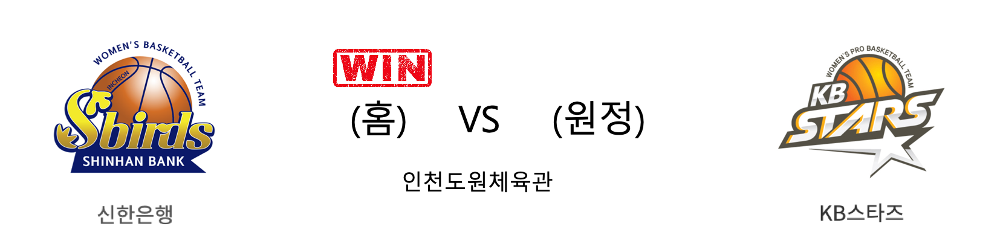

####  신한은행(홈) VS KB스타즈(원정) 

<table class="tg">
  <tr>
    <th class="tg-rr9t">신한은행</th>
    <th class="tg-rr9t">팀</th>
    <th class="tg-rr9t">KB스타즈</th>
  </tr>
  <tr>
    <td class="tg-dcpn">1승 2패</td>
    <td class="tg-rr9t">시즌 상대전적</td>
    <td class="tg-dcpn">2승 1패</td>
  </tr>
  <tr>
    <td class="tg-dcpn">86</td>
    <td class="tg-rr9t">점수</td>
    <td class="tg-dcpn">65</td>
  </tr>
  <tr>
    <td class="tg-dcpn">23/43(53%)</td>
    <td class="tg-rr9t">2점(%)</td>
    <td class="tg-dcpn">13/33(39%)</td>
  </tr>
  <tr>
    <td class="tg-dcpn">10/21(48%)</td>
    <td class="tg-rr9t">3점(%)</td>
    <td class="tg-dcpn">9/25(36%)</td>
  </tr>
  <tr>
    <td class="tg-dcpn">10/14(71%)</td>
    <td class="tg-rr9t">자유투(%)</td>
    <td class="tg-dcpn">12/15(80%)</td>
  </tr>
  <tr>
    <td class="tg-dcpn">31</td>
    <td class="tg-rr9t">리바운드</td>
    <td class="tg-dcpn">27</td>
  </tr>
  <tr>
    <td class="tg-dcpn">21</td>
    <td class="tg-rr9t">어시스트</td>
    <td class="tg-dcpn">9</td>
  </tr>
  <tr>
    <td class="tg-dcpn">9</td>
    <td class="tg-rr9t">스틸</td>
    <td class="tg-dcpn">4</td>
  </tr>
  <tr>
    <td class="tg-dcpn">7</td>
    <td class="tg-rr9t">블록</td>
    <td class="tg-dcpn">16</td>
  </tr>
  <tr>
    <td class="tg-dcpn">18</td>
    <td class="tg-rr9t">턴오버</td>
    <td class="tg-dcpn">18</td>
  </tr>
  <tr>
    <td class="tg-dcpn">한채진(17)</td>
    <td class="tg-rr9t">주요 득점선수</td>
    <td class="tg-dcpn">심성영(16)</td>
  </tr>
</table>

#### 경기 관련 주요 기사         

[[포토] 환호하는 신한은행 벤치](http://www.rookie.co.kr/news/articleView.html?idxno=37072)

['한채진 17점' 신한은행 2연승, 박지수 없는 KB 3연패](http://www.mydaily.co.kr/new_yk/html/read.php?newsid=201912281902579096&ext=na)

[신한은행, KB스타즈 따돌리고 2연승…3위 수성](http://news1.kr/articles/?3803768)

[진격의 신한은행, 우리은행 이어 KB도 제압](http://sports.khan.co.kr/news/sk_index.html?art_id=201912281916003&sec_id=530301&pt=nv)

        
        

#### 리그 순위

<table class="tg">
  <tr>
    <th class="tg-d14o">순위</th>
    <th class="tg-d14o">팀명</th>
    <th class="tg-d14o">경기수</th>
    <th class="tg-d14o">승</th>
    <th class="tg-d14o">패</th>
    <th class="tg-d14o">승차</th>
    <th class="tg-d14o">승률</th>
  </tr>
  
<tr>
    <td class="tg-50j8">1</td>
    <td class="tg-50j8">우리은행</td>
    <td class="tg-50j8">15</td>
    <td class="tg-50j8">12</td>
    <td class="tg-50j8">3</td>
    <td class="tg-50j8">0</td>
    <td class="tg-50j8">0.8</td>
</tr>

<tr>
    <td class="tg-50j8">2</td>
    <td class="tg-50j8">KB스타즈</td>
    <td class="tg-50j8">15</td>
    <td class="tg-50j8">10</td>
    <td class="tg-50j8">5</td>
    <td class="tg-50j8">2</td>
    <td class="tg-50j8">0.667</td>
</tr>

<tr>
    <td class="tg-50j8">3</td>
    <td class="tg-50j8">신한은행</td>
    <td class="tg-50j8">15</td>
    <td class="tg-50j8">7</td>
    <td class="tg-50j8">8</td>
    <td class="tg-50j8">5</td>
    <td class="tg-50j8">0.467</td>
</tr>

<tr>
    <td class="tg-50j8">4</td>
    <td class="tg-50j8">KEB하나</td>
    <td class="tg-50j8">14</td>
    <td class="tg-50j8">5</td>
    <td class="tg-50j8">9</td>
    <td class="tg-50j8">7</td>
    <td class="tg-50j8">0.357</td>
</tr>

<tr>
    <td class="tg-50j8">4</td>
    <td class="tg-50j8">BNK썸</td>
    <td class="tg-50j8">14</td>
    <td class="tg-50j8">5</td>
    <td class="tg-50j8">9</td>
    <td class="tg-50j8">7</td>
    <td class="tg-50j8">0.357</td>
</tr>

<tr>
    <td class="tg-50j8">6</td>
    <td class="tg-50j8">삼성생명</td>
    <td class="tg-50j8">15</td>
    <td class="tg-50j8">5</td>
    <td class="tg-50j8">10</td>
    <td class="tg-50j8">7</td>
    <td class="tg-50j8">0.333</td>
</tr>
</table> 

        
        
#wkbl #국내농구 #여자농구 #농구분석 #토토 #스포츠토토 #경기예측 #농구결과 #20191228 #신한은행 #KB스타즈 #신한은행KB스타즈 