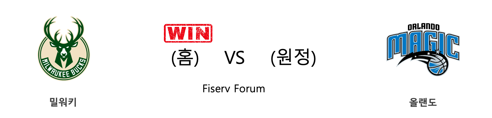
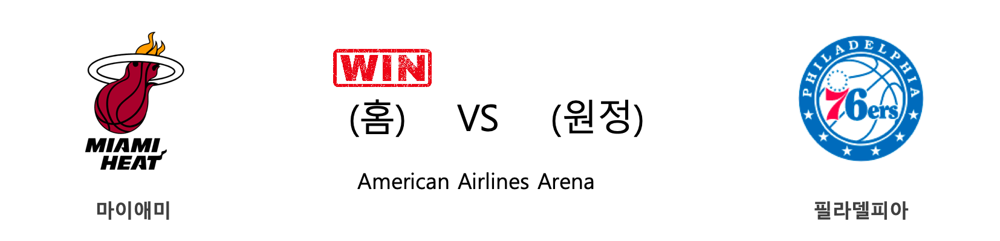

####  뉴올리언스(홈) VS 인디애나(원정) 

<table class="tg">
  <tr>
    <th class="tg-rr9t">NOP</th>
    <th class="tg-rr9t">팀</th>
    <th class="tg-rr9t">IND</th>
  </tr>
  <tr>
    <td class="tg-dcpn">1승 0패</td>
    <td class="tg-rr9t">시즌 상대전적</td>
    <td class="tg-dcpn">0승 1패</td>
  </tr>
  <tr>
    <td class="tg-dcpn">120</td>
    <td class="tg-rr9t">점수</td>
    <td class="tg-dcpn">98</td>
  </tr>
  <tr>
    <td class="tg-dcpn">25/51(49%)</td>
    <td class="tg-rr9t">2점(%)</td>
    <td class="tg-dcpn">27/57(47%)</td>
  </tr>
  <tr>
    <td class="tg-dcpn">18/42(43%)</td>
    <td class="tg-rr9t">3점(%)</td>
    <td class="tg-dcpn">6/28(21%)</td>
  </tr>
  <tr>
    <td class="tg-dcpn">16/20(80%)</td>
    <td class="tg-rr9t">자유투(%)</td>
    <td class="tg-dcpn">26/29(90%)</td>
  </tr>
  <tr>
    <td class="tg-dcpn">49</td>
    <td class="tg-rr9t">리바운드</td>
    <td class="tg-dcpn">46</td>
  </tr>
  <tr>
    <td class="tg-dcpn">25</td>
    <td class="tg-rr9t">어시스트</td>
    <td class="tg-dcpn">17</td>
  </tr>
  <tr>
    <td class="tg-dcpn">9</td>
    <td class="tg-rr9t">스틸</td>
    <td class="tg-dcpn">6</td>
  </tr>
  <tr>
    <td class="tg-dcpn">2</td>
    <td class="tg-rr9t">블록</td>
    <td class="tg-dcpn">2</td>
  </tr>
  <tr>
    <td class="tg-dcpn">12</td>
    <td class="tg-rr9t">턴오버</td>
    <td class="tg-dcpn">18</td>
  </tr>
  <tr>
    <td class="tg-dcpn">BrandonIngram(24) JJRedickG(15) JrueHolidayF(20)</td>
    <td class="tg-rr9t">주요 득점선수</td>
    <td class="tg-dcpn">T.J.WarrenF(20) AaronHolidayG(25) DomantasSabon(15)</td>
  </tr>
</table>

#### 경기 관련 주요 기사         

[[오늘의 NBA] (12/18) 인디애나, LAL 원정 연승 행진을 멈추다](http://sports.news.naver.com/basketball/news/read.nhn?oid=486&aid=0000001170)

[[오늘의 NBA] (12/12) 제임스 하든 선생님의 심폐소생술](http://sports.news.naver.com/basketball/news/read.nhn?oid=486&aid=0000001164)

[[오늘의 NBA] (12/21) 크리스탑스 포르징기스, 댈러스의 새로운 버팀목](http://sports.news.naver.com/basketball/news/read.nhn?oid=486&aid=0000001173)

['잉그램 24P 5R 7A' NOP, IND 잡고 3연승](http://www.rookie.co.kr/news/articleView.html?idxno=37104)

[[오늘의 NBA] (12/24) 자말 머레이와 데빈 부커의 뒤틀린 운명](http://sports.news.naver.com/basketball/news/read.nhn?oid=486&aid=0000001176)

        
        

####  미네소타(홈) VS 클리블랜드(원정) 

<table class="tg">
  <tr>
    <th class="tg-rr9t">MIN</th>
    <th class="tg-rr9t">팀</th>
    <th class="tg-rr9t">CLE</th>
  </tr>
  <tr>
    <td class="tg-dcpn">0승 1패</td>
    <td class="tg-rr9t">시즌 상대전적</td>
    <td class="tg-dcpn">1승 0패</td>
  </tr>
  <tr>
    <td class="tg-dcpn">88</td>
    <td class="tg-rr9t">점수</td>
    <td class="tg-dcpn">94</td>
  </tr>
  <tr>
    <td class="tg-dcpn">25/56(45%)</td>
    <td class="tg-rr9t">2점(%)</td>
    <td class="tg-dcpn">28/57(49%)</td>
  </tr>
  <tr>
    <td class="tg-dcpn">8/37(22%)</td>
    <td class="tg-rr9t">3점(%)</td>
    <td class="tg-dcpn">4/20(20%)</td>
  </tr>
  <tr>
    <td class="tg-dcpn">14/19(74%)</td>
    <td class="tg-rr9t">자유투(%)</td>
    <td class="tg-dcpn">26/36(72%)</td>
  </tr>
  <tr>
    <td class="tg-dcpn">39</td>
    <td class="tg-rr9t">리바운드</td>
    <td class="tg-dcpn">61</td>
  </tr>
  <tr>
    <td class="tg-dcpn">17</td>
    <td class="tg-rr9t">어시스트</td>
    <td class="tg-dcpn">13</td>
  </tr>
  <tr>
    <td class="tg-dcpn">17</td>
    <td class="tg-rr9t">스틸</td>
    <td class="tg-dcpn">8</td>
  </tr>
  <tr>
    <td class="tg-dcpn">8</td>
    <td class="tg-rr9t">블록</td>
    <td class="tg-dcpn">4</td>
  </tr>
  <tr>
    <td class="tg-dcpn">17</td>
    <td class="tg-rr9t">턴오버</td>
    <td class="tg-dcpn">28</td>
  </tr>
  <tr>
    <td class="tg-dcpn">KelanMartin(17) JeffTeague(18)</td>
    <td class="tg-rr9t">주요 득점선수</td>
    <td class="tg-dcpn">DariusGarland(18) CollinSextonG(18)</td>
  </tr>
</table>

#### 경기 관련 주요 기사         

[[오늘의 NBA] (12/21) 크리스탑스 포르징기스, 댈러스의 새로운 버팀목](http://sports.news.naver.com/basketball/news/read.nhn?oid=486&aid=0000001173)

[[오늘의 NBA] (12/29) 마이애미, 연장전 승부 전문가](http://sports.news.naver.com/basketball/news/read.nhn?oid=486&aid=0000001180)

[[오늘의 NBA] (12/19) 오클라호마시티, 역전의 달인!](http://sports.news.naver.com/basketball/news/read.nhn?oid=486&aid=0000001171)

[[오늘의 NBA] (11/26) 마크 가솔, 조엘 엠비드의 영원한 악몽](http://sports.news.naver.com/basketball/news/read.nhn?oid=486&aid=0000001149)

[[오늘의 NBA] (11/28) 앤써니 데이비스, 노란 셔츠를 입은 사나이](http://sports.news.naver.com/basketball/news/read.nhn?oid=486&aid=0000001151)

        
        

####  워싱턴(홈) VS 뉴욕(원정) 

<table class="tg">
  <tr>
    <th class="tg-rr9t">WAS</th>
    <th class="tg-rr9t">팀</th>
    <th class="tg-rr9t">NYK</th>
  </tr>
  <tr>
    <td class="tg-dcpn">1승 1패</td>
    <td class="tg-rr9t">시즌 상대전적</td>
    <td class="tg-dcpn">1승 1패</td>
  </tr>
  <tr>
    <td class="tg-dcpn">100</td>
    <td class="tg-rr9t">점수</td>
    <td class="tg-dcpn">107</td>
  </tr>
  <tr>
    <td class="tg-dcpn">23/71(32%)</td>
    <td class="tg-rr9t">2점(%)</td>
    <td class="tg-dcpn">27/54(50%)</td>
  </tr>
  <tr>
    <td class="tg-dcpn">10/25(40%)</td>
    <td class="tg-rr9t">3점(%)</td>
    <td class="tg-dcpn">11/31(35%)</td>
  </tr>
  <tr>
    <td class="tg-dcpn">24/31(77%)</td>
    <td class="tg-rr9t">자유투(%)</td>
    <td class="tg-dcpn">20/26(77%)</td>
  </tr>
  <tr>
    <td class="tg-dcpn">49</td>
    <td class="tg-rr9t">리바운드</td>
    <td class="tg-dcpn">56</td>
  </tr>
  <tr>
    <td class="tg-dcpn">16</td>
    <td class="tg-rr9t">어시스트</td>
    <td class="tg-dcpn">25</td>
  </tr>
  <tr>
    <td class="tg-dcpn">15</td>
    <td class="tg-rr9t">스틸</td>
    <td class="tg-dcpn">5</td>
  </tr>
  <tr>
    <td class="tg-dcpn">3</td>
    <td class="tg-rr9t">블록</td>
    <td class="tg-dcpn">5</td>
  </tr>
  <tr>
    <td class="tg-dcpn">11</td>
    <td class="tg-rr9t">턴오버</td>
    <td class="tg-dcpn">21</td>
  </tr>
  <tr>
    <td class="tg-dcpn">IsaiahThomasG(20) GaryPaytonIIG(15) JordanMcRae(20)</td>
    <td class="tg-rr9t">주요 득점선수</td>
    <td class="tg-dcpn">BobbyPortis(17) JuliusRandleF(30)</td>
  </tr>
</table>

#### 경기 관련 주요 기사         

[[오늘의 NBA] (10/31) HOU vs WAS, NBA 득점 쟁탈전 역사를 새로 쓰다](http://sports.news.naver.com/basketball/news/read.nhn?oid=486&aid=0000001123)

[[오늘의 NBA] (12/2) 토론토, 두 마리 토끼를 노린다!](http://sports.news.naver.com/basketball/news/read.nhn?oid=486&aid=0000001154)

[[오늘의 NBA] (12/29) 마이애미, 연장전 승부 전문가](http://sports.news.naver.com/basketball/news/read.nhn?oid=486&aid=0000001180)

[[오늘의 NBA] (11/30) 인디애나, 동부컨퍼런스의 복병](http://sports.news.naver.com/basketball/news/read.nhn?oid=486&aid=0000001152)

[[오늘의 NBA] (12/22) 휴스턴 원투펀치의 피닉스 홈코트 침공](http://sports.news.naver.com/basketball/news/read.nhn?oid=486&aid=0000001174)

        
        

####  LA클리퍼스(홈) VS 유타(원정) 

<table class="tg">
  <tr>
    <th class="tg-rr9t">LAC</th>
    <th class="tg-rr9t">팀</th>
    <th class="tg-rr9t">UTA</th>
  </tr>
  <tr>
    <td class="tg-dcpn">1승 2패</td>
    <td class="tg-rr9t">시즌 상대전적</td>
    <td class="tg-dcpn">2승 1패</td>
  </tr>
  <tr>
    <td class="tg-dcpn">107</td>
    <td class="tg-rr9t">점수</td>
    <td class="tg-dcpn">120</td>
  </tr>
  <tr>
    <td class="tg-dcpn">23/55(42%)</td>
    <td class="tg-rr9t">2점(%)</td>
    <td class="tg-dcpn">28/51(55%)</td>
  </tr>
  <tr>
    <td class="tg-dcpn">12/40(30%)</td>
    <td class="tg-rr9t">3점(%)</td>
    <td class="tg-dcpn">17/35(49%)</td>
  </tr>
  <tr>
    <td class="tg-dcpn">25/27(93%)</td>
    <td class="tg-rr9t">자유투(%)</td>
    <td class="tg-dcpn">13/17(76%)</td>
  </tr>
  <tr>
    <td class="tg-dcpn">46</td>
    <td class="tg-rr9t">리바운드</td>
    <td class="tg-dcpn">47</td>
  </tr>
  <tr>
    <td class="tg-dcpn">22</td>
    <td class="tg-rr9t">어시스트</td>
    <td class="tg-dcpn">25</td>
  </tr>
  <tr>
    <td class="tg-dcpn">9</td>
    <td class="tg-rr9t">스틸</td>
    <td class="tg-dcpn">4</td>
  </tr>
  <tr>
    <td class="tg-dcpn">4</td>
    <td class="tg-rr9t">블록</td>
    <td class="tg-dcpn">2</td>
  </tr>
  <tr>
    <td class="tg-dcpn">7</td>
    <td class="tg-rr9t">턴오버</td>
    <td class="tg-dcpn">12</td>
  </tr>
  <tr>
    <td class="tg-dcpn">KawhiLeonardF(19) IvicaZubacC(15) PaulGeorgeG(20) LouWilliams(16)</td>
    <td class="tg-rr9t">주요 득점선수</td>
    <td class="tg-dcpn">JordanClarkso(19) DonovanMitche(30) BojanBogdanov(17) JoeInglesG(15)</td>
  </tr>
</table>

#### 경기 관련 주요 기사         

[[오늘의 NBA] (12/18) 인디애나, LAL 원정 연승 행진을 멈추다](http://sports.news.naver.com/basketball/news/read.nhn?oid=486&aid=0000001170)

[[오늘의 NBA] (12/14) 레이커스, 마이애미 홈 코트를 점령하다](http://sports.news.naver.com/basketball/news/read.nhn?oid=486&aid=0000001166)

[[오늘의 NBA] (12/5) 밀워키, 시스템 농구 정점에 도달하다](http://sports.news.naver.com/basketball/news/read.nhn?oid=486&aid=0000001157)

[[오늘의 NBA] (12/29) 마이애미, 연장전 승부 전문가](http://sports.news.naver.com/basketball/news/read.nhn?oid=486&aid=0000001180)

[[오늘의 NBA] (12/10) 데릭 로즈, 모터 시티의 해결사](http://sports.news.naver.com/basketball/news/read.nhn?oid=486&aid=0000001162)

        
        

####  덴버(홈) VS 멤피스(원정) 

<table class="tg">
  <tr>
    <th class="tg-rr9t">DEN</th>
    <th class="tg-rr9t">팀</th>
    <th class="tg-rr9t">MEM</th>
  </tr>
  <tr>
    <td class="tg-dcpn">2승 0패</td>
    <td class="tg-rr9t">시즌 상대전적</td>
    <td class="tg-dcpn">0승 2패</td>
  </tr>
  <tr>
    <td class="tg-dcpn">119</td>
    <td class="tg-rr9t">점수</td>
    <td class="tg-dcpn">110</td>
  </tr>
  <tr>
    <td class="tg-dcpn">36/64(56%)</td>
    <td class="tg-rr9t">2점(%)</td>
    <td class="tg-dcpn">32/54(59%)</td>
  </tr>
  <tr>
    <td class="tg-dcpn">9/29(31%)</td>
    <td class="tg-rr9t">3점(%)</td>
    <td class="tg-dcpn">9/30(30%)</td>
  </tr>
  <tr>
    <td class="tg-dcpn">20/27(74%)</td>
    <td class="tg-rr9t">자유투(%)</td>
    <td class="tg-dcpn">19/25(76%)</td>
  </tr>
  <tr>
    <td class="tg-dcpn">43</td>
    <td class="tg-rr9t">리바운드</td>
    <td class="tg-dcpn">45</td>
  </tr>
  <tr>
    <td class="tg-dcpn">28</td>
    <td class="tg-rr9t">어시스트</td>
    <td class="tg-dcpn">32</td>
  </tr>
  <tr>
    <td class="tg-dcpn">9</td>
    <td class="tg-rr9t">스틸</td>
    <td class="tg-dcpn">5</td>
  </tr>
  <tr>
    <td class="tg-dcpn">4</td>
    <td class="tg-rr9t">블록</td>
    <td class="tg-dcpn">5</td>
  </tr>
  <tr>
    <td class="tg-dcpn">10</td>
    <td class="tg-rr9t">턴오버</td>
    <td class="tg-dcpn">17</td>
  </tr>
  <tr>
    <td class="tg-dcpn">MasonPlumleeC(15) JamalMurrayG(15) WillBartonF(20) NikolaJokicF(31)</td>
    <td class="tg-rr9t">주요 득점선수</td>
    <td class="tg-dcpn">JaMorantG(16) JarenJacksonJ(20) De'AnthonyMel(17) BrandonClarke(15)</td>
  </tr>
</table>

#### 경기 관련 주요 기사         

[[오늘의 NBA] (12/29) 마이애미, 연장전 승부 전문가](http://sports.news.naver.com/basketball/news/read.nhn?oid=486&aid=0000001180)

[[오늘의 NBA] (12/24) 자말 머레이와 데빈 부커의 뒤틀린 운명](http://sports.news.naver.com/basketball/news/read.nhn?oid=486&aid=0000001176)

[[오늘의 NBA] (12/21) 크리스탑스 포르징기스, 댈러스의 새로운 버팀목](http://sports.news.naver.com/basketball/news/read.nhn?oid=486&aid=0000001173)

[[오늘의 NBA] (11/30) 인디애나, 동부컨퍼런스의 복병](http://sports.news.naver.com/basketball/news/read.nhn?oid=486&aid=0000001152)

[[오늘의 NBA] (12/2) 토론토, 두 마리 토끼를 노린다!](http://sports.news.naver.com/basketball/news/read.nhn?oid=486&aid=0000001154)

        
        

####  밀워키(홈) VS 올랜도(원정) 

<table class="tg">
  <tr>
    <th class="tg-rr9t">MIL</th>
    <th class="tg-rr9t">팀</th>
    <th class="tg-rr9t">ORL</th>
  </tr>
  <tr>
    <td class="tg-dcpn">3승 0패</td>
    <td class="tg-rr9t">시즌 상대전적</td>
    <td class="tg-dcpn">0승 3패</td>
  </tr>
  <tr>
    <td class="tg-dcpn">111</td>
    <td class="tg-rr9t">점수</td>
    <td class="tg-dcpn">100</td>
  </tr>
  <tr>
    <td class="tg-dcpn">30/47(64%)</td>
    <td class="tg-rr9t">2점(%)</td>
    <td class="tg-dcpn">21/52(40%)</td>
  </tr>
  <tr>
    <td class="tg-dcpn">13/37(35%)</td>
    <td class="tg-rr9t">3점(%)</td>
    <td class="tg-dcpn">14/35(40%)</td>
  </tr>
  <tr>
    <td class="tg-dcpn">12/18(67%)</td>
    <td class="tg-rr9t">자유투(%)</td>
    <td class="tg-dcpn">16/19(84%)</td>
  </tr>
  <tr>
    <td class="tg-dcpn">57</td>
    <td class="tg-rr9t">리바운드</td>
    <td class="tg-dcpn">35</td>
  </tr>
  <tr>
    <td class="tg-dcpn">30</td>
    <td class="tg-rr9t">어시스트</td>
    <td class="tg-dcpn">21</td>
  </tr>
  <tr>
    <td class="tg-dcpn">6</td>
    <td class="tg-rr9t">스틸</td>
    <td class="tg-dcpn">15</td>
  </tr>
  <tr>
    <td class="tg-dcpn">5</td>
    <td class="tg-rr9t">블록</td>
    <td class="tg-dcpn">7</td>
  </tr>
  <tr>
    <td class="tg-dcpn">22</td>
    <td class="tg-rr9t">턴오버</td>
    <td class="tg-dcpn">11</td>
  </tr>
  <tr>
    <td class="tg-dcpn">ErsanIlyasova(17) GeorgeHill(17) RobinLopez(17) KhrisMiddleto(21)</td>
    <td class="tg-rr9t">주요 득점선수</td>
    <td class="tg-dcpn">NikolaVucevic(21) EvanFournierG(23) JonathanIsaac(19)</td>
  </tr>
</table>

#### 경기 관련 주요 기사         

[[오늘의 NBA] (12/15) 밤 아데바요, 연장전의 지배자](http://sports.news.naver.com/basketball/news/read.nhn?oid=486&aid=0000001167)

[[오늘의 NBA] (12/14) 레이커스, 마이애미 홈 코트를 점령하다](http://sports.news.naver.com/basketball/news/read.nhn?oid=486&aid=0000001166)

[[오늘의 NBA] (12/29) 마이애미, 연장전 승부 전문가](http://sports.news.naver.com/basketball/news/read.nhn?oid=486&aid=0000001180)

[[오늘의 NBA] (11/24) 잭 라빈, GSW 스플래쉬 브라더스를 소환하다](http://sports.news.naver.com/basketball/news/read.nhn?oid=486&aid=0000001147)

[[오늘의 NBA] (12/21) 크리스탑스 포르징기스, 댈러스의 새로운 버팀목](http://sports.news.naver.com/basketball/news/read.nhn?oid=486&aid=0000001173)

        
        

####  마이애미(홈) VS 필라델피아(원정) 

<table class="tg">
  <tr>
    <th class="tg-rr9t">MIA</th>
    <th class="tg-rr9t">팀</th>
    <th class="tg-rr9t">PHI</th>
  </tr>
  <tr>
    <td class="tg-dcpn">2승 1패</td>
    <td class="tg-rr9t">시즌 상대전적</td>
    <td class="tg-dcpn">1승 2패</td>
  </tr>
  <tr>
    <td class="tg-dcpn">117</td>
    <td class="tg-rr9t">점수</td>
    <td class="tg-dcpn">116</td>
  </tr>
  <tr>
    <td class="tg-dcpn">32/66(48%)</td>
    <td class="tg-rr9t">2점(%)</td>
    <td class="tg-dcpn">32/59(54%)</td>
  </tr>
  <tr>
    <td class="tg-dcpn">10/28(36%)</td>
    <td class="tg-rr9t">3점(%)</td>
    <td class="tg-dcpn">10/30(33%)</td>
  </tr>
  <tr>
    <td class="tg-dcpn">23/29(79%)</td>
    <td class="tg-rr9t">자유투(%)</td>
    <td class="tg-dcpn">22/29(76%)</td>
  </tr>
  <tr>
    <td class="tg-dcpn">43</td>
    <td class="tg-rr9t">리바운드</td>
    <td class="tg-dcpn">47</td>
  </tr>
  <tr>
    <td class="tg-dcpn">26</td>
    <td class="tg-rr9t">어시스트</td>
    <td class="tg-dcpn">24</td>
  </tr>
  <tr>
    <td class="tg-dcpn">6</td>
    <td class="tg-rr9t">스틸</td>
    <td class="tg-dcpn">5</td>
  </tr>
  <tr>
    <td class="tg-dcpn">4</td>
    <td class="tg-rr9t">블록</td>
    <td class="tg-dcpn">4</td>
  </tr>
  <tr>
    <td class="tg-dcpn">8</td>
    <td class="tg-rr9t">턴오버</td>
    <td class="tg-dcpn">9</td>
  </tr>
  <tr>
    <td class="tg-dcpn">GoranDragic(19) DuncanRobinso(16) TylerHerro(16) JimmyButlerF(25)</td>
    <td class="tg-rr9t">주요 득점선수</td>
    <td class="tg-dcpn">JoelEmbiidC(35) BenSimmonsG(15) JoshRichardso(17)</td>
  </tr>
</table>

#### 경기 관련 주요 기사         

[[오늘의 NBA] (12/28) 골든스테이트, 수비 코트에서 시작된 대반격](http://sports.news.naver.com/basketball/news/read.nhn?oid=486&aid=0000001179)

[[오늘의 NBA] (12/19) 오클라호마시티, 역전의 달인!](http://sports.news.naver.com/basketball/news/read.nhn?oid=486&aid=0000001171)

[[오늘의 NBA] (12/14) 레이커스, 마이애미 홈 코트를 점령하다](http://sports.news.naver.com/basketball/news/read.nhn?oid=486&aid=0000001166)

[[오늘의 NBA] (12/9) 앤써니 데이비스, 구단 역사에 이름을 남기다](http://sports.news.naver.com/basketball/news/read.nhn?oid=486&aid=0000001161)

[[오늘의 NBA] (12/21) 크리스탑스 포르징기스, 댈러스의 새로운 버팀목](http://sports.news.naver.com/basketball/news/read.nhn?oid=486&aid=0000001173)

        
        

####  포틀랜드(홈) VS LA레이커스(원정) 

<table class="tg">
  <tr>
    <th class="tg-rr9t">POR</th>
    <th class="tg-rr9t">팀</th>
    <th class="tg-rr9t">LAL</th>
  </tr>
  <tr>
    <td class="tg-dcpn">0승 2패</td>
    <td class="tg-rr9t">시즌 상대전적</td>
    <td class="tg-dcpn">2승 0패</td>
  </tr>
  <tr>
    <td class="tg-dcpn">120</td>
    <td class="tg-rr9t">점수</td>
    <td class="tg-dcpn">128</td>
  </tr>
  <tr>
    <td class="tg-dcpn">26/51(51%)</td>
    <td class="tg-rr9t">2점(%)</td>
    <td class="tg-dcpn">36/59(61%)</td>
  </tr>
  <tr>
    <td class="tg-dcpn">15/35(43%)</td>
    <td class="tg-rr9t">3점(%)</td>
    <td class="tg-dcpn">11/32(34%)</td>
  </tr>
  <tr>
    <td class="tg-dcpn">23/27(85%)</td>
    <td class="tg-rr9t">자유투(%)</td>
    <td class="tg-dcpn">23/28(82%)</td>
  </tr>
  <tr>
    <td class="tg-dcpn">39</td>
    <td class="tg-rr9t">리바운드</td>
    <td class="tg-dcpn">44</td>
  </tr>
  <tr>
    <td class="tg-dcpn">18</td>
    <td class="tg-rr9t">어시스트</td>
    <td class="tg-dcpn">32</td>
  </tr>
  <tr>
    <td class="tg-dcpn">4</td>
    <td class="tg-rr9t">스틸</td>
    <td class="tg-dcpn">6</td>
  </tr>
  <tr>
    <td class="tg-dcpn">8</td>
    <td class="tg-rr9t">블록</td>
    <td class="tg-dcpn">7</td>
  </tr>
  <tr>
    <td class="tg-dcpn">16</td>
    <td class="tg-rr9t">턴오버</td>
    <td class="tg-dcpn">9</td>
  </tr>
  <tr>
    <td class="tg-dcpn">CJMcCollumG(18) HassanWhitesi(19) DamianLillard(31)</td>
    <td class="tg-rr9t">주요 득점선수</td>
    <td class="tg-dcpn">RajonRondo(15) AnthonyDavisF(20) LeBronJamesF(21) KyleKuzma(24)</td>
  </tr>
</table>

#### 경기 관련 주요 기사         

[[오늘의 NBA] (12/29) 마이애미, 연장전 승부 전문가](http://sports.news.naver.com/basketball/news/read.nhn?oid=486&aid=0000001180)

[[오늘의 NBA] (12/14) 레이커스, 마이애미 홈 코트를 점령하다](http://sports.news.naver.com/basketball/news/read.nhn?oid=486&aid=0000001166)

[[오늘의 NBA] (12/20) 밀워키, 리그 전체 단독 1위 등극!](http://sports.news.naver.com/basketball/news/read.nhn?oid=486&aid=0000001172)

[[오늘의 NBA] (12/16) 스펜서 딘위디, 브루클린 상승세를 이끈다!](http://sports.news.naver.com/basketball/news/read.nhn?oid=486&aid=0000001168)

[[오늘의 NBA] (12/10) 데릭 로즈, 모터 시티의 해결사](http://sports.news.naver.com/basketball/news/read.nhn?oid=486&aid=0000001162)

        
        

####  휴스턴(홈) VS 브루클린(원정) 

<table class="tg">
  <tr>
    <th class="tg-rr9t">HOU</th>
    <th class="tg-rr9t">팀</th>
    <th class="tg-rr9t">BKN</th>
  </tr>
  <tr>
    <td class="tg-dcpn">1승 1패</td>
    <td class="tg-rr9t">시즌 상대전적</td>
    <td class="tg-dcpn">1승 1패</td>
  </tr>
  <tr>
    <td class="tg-dcpn">108</td>
    <td class="tg-rr9t">점수</td>
    <td class="tg-dcpn">98</td>
  </tr>
  <tr>
    <td class="tg-dcpn">31/59(53%)</td>
    <td class="tg-rr9t">2점(%)</td>
    <td class="tg-dcpn">26/53(49%)</td>
  </tr>
  <tr>
    <td class="tg-dcpn">13/42(31%)</td>
    <td class="tg-rr9t">3점(%)</td>
    <td class="tg-dcpn">11/39(28%)</td>
  </tr>
  <tr>
    <td class="tg-dcpn">7/16(44%)</td>
    <td class="tg-rr9t">자유투(%)</td>
    <td class="tg-dcpn">13/21(62%)</td>
  </tr>
  <tr>
    <td class="tg-dcpn">54</td>
    <td class="tg-rr9t">리바운드</td>
    <td class="tg-dcpn">47</td>
  </tr>
  <tr>
    <td class="tg-dcpn">16</td>
    <td class="tg-rr9t">어시스트</td>
    <td class="tg-dcpn">24</td>
  </tr>
  <tr>
    <td class="tg-dcpn">7</td>
    <td class="tg-rr9t">스틸</td>
    <td class="tg-dcpn">7</td>
  </tr>
  <tr>
    <td class="tg-dcpn">6</td>
    <td class="tg-rr9t">블록</td>
    <td class="tg-dcpn">5</td>
  </tr>
  <tr>
    <td class="tg-dcpn">14</td>
    <td class="tg-rr9t">턴오버</td>
    <td class="tg-dcpn">15</td>
  </tr>
  <tr>
    <td class="tg-dcpn">RussellWestbr(23) JamesHardenG(44)</td>
    <td class="tg-rr9t">주요 득점선수</td>
    <td class="tg-dcpn">SpencerDinwid(17) JarrettAllenC(16) TaureanPrince(16)</td>
  </tr>
</table>

#### 경기 관련 주요 기사         

[[오늘의 NBA] (12/7) 르브론 제임스, 멜로(carmelo) 드라마의 주인공](http://sports.news.naver.com/basketball/news/read.nhn?oid=486&aid=0000001159)

[[오늘의 NBA] (10/31) HOU vs WAS, NBA 득점 쟁탈전 역사를 새로 쓰다](http://sports.news.naver.com/basketball/news/read.nhn?oid=486&aid=0000001123)

[[오늘의 NBA] (11/19) 댈러스의 루카 복음 낭송](http://sports.news.naver.com/basketball/news/read.nhn?oid=486&aid=0000001142)

[[오늘의 NBA] (12/29) 마이애미, 연장전 승부 전문가](http://sports.news.naver.com/basketball/news/read.nhn?oid=486&aid=0000001180)

[[오늘의 NBA] (11/21) 클리퍼스, 안티 볼 핸들러 세계관을 구축하다](http://sports.news.naver.com/basketball/news/read.nhn?oid=486&aid=0000001144)

        
        

####  시카고(홈) VS 애틀랜타(원정) 

<table class="tg">
  <tr>
    <th class="tg-rr9t">CHI</th>
    <th class="tg-rr9t">팀</th>
    <th class="tg-rr9t">ATL</th>
  </tr>
  <tr>
    <td class="tg-dcpn">3승 0패</td>
    <td class="tg-rr9t">시즌 상대전적</td>
    <td class="tg-dcpn">0승 3패</td>
  </tr>
  <tr>
    <td class="tg-dcpn">116</td>
    <td class="tg-rr9t">점수</td>
    <td class="tg-dcpn">81</td>
  </tr>
  <tr>
    <td class="tg-dcpn">28/56(50%)</td>
    <td class="tg-rr9t">2점(%)</td>
    <td class="tg-dcpn">23/52(44%)</td>
  </tr>
  <tr>
    <td class="tg-dcpn">15/31(48%)</td>
    <td class="tg-rr9t">3점(%)</td>
    <td class="tg-dcpn">9/34(26%)</td>
  </tr>
  <tr>
    <td class="tg-dcpn">15/19(79%)</td>
    <td class="tg-rr9t">자유투(%)</td>
    <td class="tg-dcpn">8/11(73%)</td>
  </tr>
  <tr>
    <td class="tg-dcpn">51</td>
    <td class="tg-rr9t">리바운드</td>
    <td class="tg-dcpn">39</td>
  </tr>
  <tr>
    <td class="tg-dcpn">22</td>
    <td class="tg-rr9t">어시스트</td>
    <td class="tg-dcpn">24</td>
  </tr>
  <tr>
    <td class="tg-dcpn">13</td>
    <td class="tg-rr9t">스틸</td>
    <td class="tg-dcpn">8</td>
  </tr>
  <tr>
    <td class="tg-dcpn">5</td>
    <td class="tg-rr9t">블록</td>
    <td class="tg-dcpn">5</td>
  </tr>
  <tr>
    <td class="tg-dcpn">17</td>
    <td class="tg-rr9t">턴오버</td>
    <td class="tg-dcpn">19</td>
  </tr>
  <tr>
    <td class="tg-dcpn">LauriMarkkane(25) CobyWhite(18) ZachLaVineG(19)</td>
    <td class="tg-rr9t">주요 득점선수</td>
    <td class="tg-dcpn">JohnCollinsF(34)</td>
  </tr>
</table>

#### 경기 관련 주요 기사         

[[오늘의 NBA] (12/29) 마이애미, 연장전 승부 전문가](http://sports.news.naver.com/basketball/news/read.nhn?oid=486&aid=0000001180)

[[오늘의 NBA] (12/11) 마이애미의 커리어 나이트 파티](http://sports.news.naver.com/basketball/news/read.nhn?oid=486&aid=0000001163)

[[오늘의 NBA] (12/14) 레이커스, 마이애미 홈 코트를 점령하다](http://sports.news.naver.com/basketball/news/read.nhn?oid=486&aid=0000001166)

[[오늘의 NBA] (12/17) 댈러스, 밀워키 시스템을 붕괴시키다](http://sports.news.naver.com/basketball/news/read.nhn?oid=486&aid=0000001169)

[[오늘의 NBA] (12/12) 제임스 하든 선생님의 심폐소생술](http://sports.news.naver.com/basketball/news/read.nhn?oid=486&aid=0000001164)

        
        

####  골든스테이트(홈) VS 댈러스(원정) 

<table class="tg">
  <tr>
    <th class="tg-rr9t">GSW</th>
    <th class="tg-rr9t">팀</th>
    <th class="tg-rr9t">DAL</th>
  </tr>
  <tr>
    <td class="tg-dcpn">0승 2패</td>
    <td class="tg-rr9t">시즌 상대전적</td>
    <td class="tg-dcpn">2승 0패</td>
  </tr>
  <tr>
    <td class="tg-dcpn">121</td>
    <td class="tg-rr9t">점수</td>
    <td class="tg-dcpn">141</td>
  </tr>
  <tr>
    <td class="tg-dcpn">27/53(51%)</td>
    <td class="tg-rr9t">2점(%)</td>
    <td class="tg-dcpn">24/41(59%)</td>
  </tr>
  <tr>
    <td class="tg-dcpn">18/39(46%)</td>
    <td class="tg-rr9t">3점(%)</td>
    <td class="tg-dcpn">24/51(47%)</td>
  </tr>
  <tr>
    <td class="tg-dcpn">13/17(76%)</td>
    <td class="tg-rr9t">자유투(%)</td>
    <td class="tg-dcpn">21/21(100%)</td>
  </tr>
  <tr>
    <td class="tg-dcpn">42</td>
    <td class="tg-rr9t">리바운드</td>
    <td class="tg-dcpn">46</td>
  </tr>
  <tr>
    <td class="tg-dcpn">28</td>
    <td class="tg-rr9t">어시스트</td>
    <td class="tg-dcpn">35</td>
  </tr>
  <tr>
    <td class="tg-dcpn">4</td>
    <td class="tg-rr9t">스틸</td>
    <td class="tg-dcpn">11</td>
  </tr>
  <tr>
    <td class="tg-dcpn">3</td>
    <td class="tg-rr9t">블록</td>
    <td class="tg-dcpn">6</td>
  </tr>
  <tr>
    <td class="tg-dcpn">14</td>
    <td class="tg-rr9t">턴오버</td>
    <td class="tg-dcpn">13</td>
  </tr>
  <tr>
    <td class="tg-dcpn">DamionLeeG(18) D'AngeloRusse(35) AlecBurks(16) MarqueseChris(16)</td>
    <td class="tg-rr9t">주요 득점선수</td>
    <td class="tg-dcpn">TimHardawayJr(25) SethCurry(17) LukaDoncicG(31) KristapsPorzi(18)</td>
  </tr>
</table>

#### 경기 관련 주요 기사         

[[오늘의 NBA] (12/29) 마이애미, 연장전 승부 전문가](http://sports.news.naver.com/basketball/news/read.nhn?oid=486&aid=0000001180)

[[오늘의 NBA] (12/19) 오클라호마시티, 역전의 달인!](http://sports.news.naver.com/basketball/news/read.nhn?oid=486&aid=0000001171)

[[오늘의 NBA] (12/14) 레이커스, 마이애미 홈 코트를 점령하다](http://sports.news.naver.com/basketball/news/read.nhn?oid=486&aid=0000001166)

[[오늘의 NBA] (12/21) 크리스탑스 포르징기스, 댈러스의 새로운 버팀목](http://sports.news.naver.com/basketball/news/read.nhn?oid=486&aid=0000001173)

[[오늘의 NBA] (12/24) 자말 머레이와 데빈 부커의 뒤틀린 운명](http://sports.news.naver.com/basketball/news/read.nhn?oid=486&aid=0000001176)

        
        

####  샌안토니오(홈) VS 디트로이트(원정) 

<table class="tg">
  <tr>
    <th class="tg-rr9t">SAS</th>
    <th class="tg-rr9t">팀</th>
    <th class="tg-rr9t">DET</th>
  </tr>
  <tr>
    <td class="tg-dcpn">1승 1패</td>
    <td class="tg-rr9t">시즌 상대전적</td>
    <td class="tg-dcpn">1승 1패</td>
  </tr>
  <tr>
    <td class="tg-dcpn">136</td>
    <td class="tg-rr9t">점수</td>
    <td class="tg-dcpn">109</td>
  </tr>
  <tr>
    <td class="tg-dcpn">35/58(60%)</td>
    <td class="tg-rr9t">2점(%)</td>
    <td class="tg-dcpn">28/54(52%)</td>
  </tr>
  <tr>
    <td class="tg-dcpn">18/35(51%)</td>
    <td class="tg-rr9t">3점(%)</td>
    <td class="tg-dcpn">12/36(33%)</td>
  </tr>
  <tr>
    <td class="tg-dcpn">12/15(80%)</td>
    <td class="tg-rr9t">자유투(%)</td>
    <td class="tg-dcpn">17/30(57%)</td>
  </tr>
  <tr>
    <td class="tg-dcpn">51</td>
    <td class="tg-rr9t">리바운드</td>
    <td class="tg-dcpn">40</td>
  </tr>
  <tr>
    <td class="tg-dcpn">30</td>
    <td class="tg-rr9t">어시스트</td>
    <td class="tg-dcpn">20</td>
  </tr>
  <tr>
    <td class="tg-dcpn">8</td>
    <td class="tg-rr9t">스틸</td>
    <td class="tg-dcpn">9</td>
  </tr>
  <tr>
    <td class="tg-dcpn">7</td>
    <td class="tg-rr9t">블록</td>
    <td class="tg-dcpn">5</td>
  </tr>
  <tr>
    <td class="tg-dcpn">11</td>
    <td class="tg-rr9t">턴오버</td>
    <td class="tg-dcpn">11</td>
  </tr>
  <tr>
    <td class="tg-dcpn">RudyGay(16) BrynForbesG(18) DeMarDeRozanF(29) LaMarcusAldri(25)</td>
    <td class="tg-rr9t">주요 득점선수</td>
    <td class="tg-dcpn">LangstonGallo(15) DerrickRose(24) AndreDrummond(21)</td>
  </tr>
</table>

#### 경기 관련 주요 기사         

['로즈 더블-더블' DET, SAS에 34점 차 대승](http://www.rookie.co.kr/news/articleView.html?idxno=35601)

[[오늘의 NBA] (12/15) 밤 아데바요, 연장전의 지배자](http://sports.news.naver.com/basketball/news/read.nhn?oid=486&aid=0000001167)

[[오늘의 NBA] (12/7) 르브론 제임스, 멜로(carmelo) 드라마의 주인공](http://sports.news.naver.com/basketball/news/read.nhn?oid=486&aid=0000001159)

[[오늘의 NBA] (12/29) 마이애미, 연장전 승부 전문가](http://sports.news.naver.com/basketball/news/read.nhn?oid=486&aid=0000001180)

[[오늘의 NBA] (11/30) 인디애나, 동부컨퍼런스의 복병](http://sports.news.naver.com/basketball/news/read.nhn?oid=486&aid=0000001152)

        
        

####  새크라멘토(홈) VS 피닉스(원정) 

<table class="tg">
  <tr>
    <th class="tg-rr9t">SAC</th>
    <th class="tg-rr9t">팀</th>
    <th class="tg-rr9t">PHX</th>
  </tr>
  <tr>
    <td class="tg-dcpn">1승 2패</td>
    <td class="tg-rr9t">시즌 상대전적</td>
    <td class="tg-dcpn">2승 1패</td>
  </tr>
  <tr>
    <td class="tg-dcpn">110</td>
    <td class="tg-rr9t">점수</td>
    <td class="tg-dcpn">112</td>
  </tr>
  <tr>
    <td class="tg-dcpn">29/53(55%)</td>
    <td class="tg-rr9t">2점(%)</td>
    <td class="tg-dcpn">36/61(59%)</td>
  </tr>
  <tr>
    <td class="tg-dcpn">12/31(39%)</td>
    <td class="tg-rr9t">3점(%)</td>
    <td class="tg-dcpn">9/26(35%)</td>
  </tr>
  <tr>
    <td class="tg-dcpn">16/24(67%)</td>
    <td class="tg-rr9t">자유투(%)</td>
    <td class="tg-dcpn">13/15(87%)</td>
  </tr>
  <tr>
    <td class="tg-dcpn">36</td>
    <td class="tg-rr9t">리바운드</td>
    <td class="tg-dcpn">41</td>
  </tr>
  <tr>
    <td class="tg-dcpn">19</td>
    <td class="tg-rr9t">어시스트</td>
    <td class="tg-dcpn">30</td>
  </tr>
  <tr>
    <td class="tg-dcpn">3</td>
    <td class="tg-rr9t">스틸</td>
    <td class="tg-dcpn">10</td>
  </tr>
  <tr>
    <td class="tg-dcpn">4</td>
    <td class="tg-rr9t">블록</td>
    <td class="tg-dcpn">2</td>
  </tr>
  <tr>
    <td class="tg-dcpn">12</td>
    <td class="tg-rr9t">턴오버</td>
    <td class="tg-dcpn">13</td>
  </tr>
  <tr>
    <td class="tg-dcpn">BogdanBogdano(22) HarrisonBarne(21) BuddyHieldG(23)</td>
    <td class="tg-rr9t">주요 득점선수</td>
    <td class="tg-dcpn">AronBaynesC(17) DevinBookerG(32) KellyOubreJr.(20) RickyRubioG(21)</td>
  </tr>
</table>

#### 경기 관련 주요 기사         

[[오늘의 NBA] (1/22) 클레이 탐슨, 3점 라인의 1.5인자](http://sports.news.naver.com/basketball/news/read.nhn?oid=486&aid=0000000938)

[[오늘의 NBA] (11/30) 인디애나, 동부컨퍼런스의 복병](http://sports.news.naver.com/basketball/news/read.nhn?oid=486&aid=0000001152)

[[오늘의 NBA] (12/29) 마이애미, 연장전 승부 전문가](http://sports.news.naver.com/basketball/news/read.nhn?oid=486&aid=0000001180)

[[오늘의 NBA] (12/10) 데릭 로즈, 모터 시티의 해결사](http://sports.news.naver.com/basketball/news/read.nhn?oid=486&aid=0000001162)

[[오늘의 NBA] (12/21) 크리스탑스 포르징기스, 댈러스의 새로운 버팀목](http://sports.news.naver.com/basketball/news/read.nhn?oid=486&aid=0000001173)

        
        

####  보스턴(홈) VS 토론토(원정) 

<table class="tg">
  <tr>
    <th class="tg-rr9t">BOS</th>
    <th class="tg-rr9t">팀</th>
    <th class="tg-rr9t">TOR</th>
  </tr>
  <tr>
    <td class="tg-dcpn">2승 1패</td>
    <td class="tg-rr9t">시즌 상대전적</td>
    <td class="tg-dcpn">1승 2패</td>
  </tr>
  <tr>
    <td class="tg-dcpn">97</td>
    <td class="tg-rr9t">점수</td>
    <td class="tg-dcpn">113</td>
  </tr>
  <tr>
    <td class="tg-dcpn">24/46(52%)</td>
    <td class="tg-rr9t">2점(%)</td>
    <td class="tg-dcpn">30/50(60%)</td>
  </tr>
  <tr>
    <td class="tg-dcpn">7/32(22%)</td>
    <td class="tg-rr9t">3점(%)</td>
    <td class="tg-dcpn">14/34(41%)</td>
  </tr>
  <tr>
    <td class="tg-dcpn">28/36(78%)</td>
    <td class="tg-rr9t">자유투(%)</td>
    <td class="tg-dcpn">11/17(65%)</td>
  </tr>
  <tr>
    <td class="tg-dcpn">31</td>
    <td class="tg-rr9t">리바운드</td>
    <td class="tg-dcpn">53</td>
  </tr>
  <tr>
    <td class="tg-dcpn">18</td>
    <td class="tg-rr9t">어시스트</td>
    <td class="tg-dcpn">27</td>
  </tr>
  <tr>
    <td class="tg-dcpn">11</td>
    <td class="tg-rr9t">스틸</td>
    <td class="tg-dcpn">8</td>
  </tr>
  <tr>
    <td class="tg-dcpn">4</td>
    <td class="tg-rr9t">블록</td>
    <td class="tg-dcpn">3</td>
  </tr>
  <tr>
    <td class="tg-dcpn">14</td>
    <td class="tg-rr9t">턴오버</td>
    <td class="tg-dcpn">22</td>
  </tr>
  <tr>
    <td class="tg-dcpn">KembaWalkerG(30) JaylenBrownG(17)</td>
    <td class="tg-rr9t">주요 득점선수</td>
    <td class="tg-dcpn">FredVanVleetG(18) SergeIbakaC(20) PatrickMcCawF(18) KyleLowryG(30)</td>
  </tr>
</table>

#### 경기 관련 주요 기사         

[[오늘의 NBA] (12/23) 토론토, 포기할 줄 모르는 북방의 투사](http://sports.news.naver.com/basketball/news/read.nhn?oid=486&aid=0000001175)

[[오늘의 NBA] (12/2) 토론토, 두 마리 토끼를 노린다!](http://sports.news.naver.com/basketball/news/read.nhn?oid=486&aid=0000001154)

[[오늘의 NBA] (12/26) NBA 2019년 크리스마스 축제](http://sports.news.naver.com/basketball/news/read.nhn?oid=486&aid=0000001177)

[[오늘의 NBA] (12/29) 마이애미, 연장전 승부 전문가](http://sports.news.naver.com/basketball/news/read.nhn?oid=486&aid=0000001180)

[[오늘의 NBA] (12/12) 제임스 하든 선생님의 심폐소생술](http://sports.news.naver.com/basketball/news/read.nhn?oid=486&aid=0000001164)

        
        

#### 리그 (Eastern) 순위
    

<table class="tg">
  <tr>
    <th class="tg-d14o">순위</th>
    <th class="tg-d14o">팀명</th>
    <th class="tg-d14o">경기수</th>
    <th class="tg-d14o">승</th>
    <th class="tg-d14o">패</th>
    <th class="tg-d14o">승차</th>
    <th class="tg-d14o">승률</th>
  </tr>
  
<tr>
    <td class="tg-50j8">1</td>
    <td class="tg-50j8">MIL</td>
    <td class="tg-50j8">34</td>
    <td class="tg-50j8">29</td>
    <td class="tg-50j8">5</td>
    <td class="tg-50j8">0</td>
    <td class="tg-50j8">0.853</td>
</tr>

<tr>
    <td class="tg-50j8">2</td>
    <td class="tg-50j8">MIA</td>
    <td class="tg-50j8">32</td>
    <td class="tg-50j8">24</td>
    <td class="tg-50j8">8</td>
    <td class="tg-50j8">5</td>
    <td class="tg-50j8">0.75</td>
</tr>

<tr>
    <td class="tg-50j8">3</td>
    <td class="tg-50j8">BOS</td>
    <td class="tg-50j8">29</td>
    <td class="tg-50j8">22</td>
    <td class="tg-50j8">7</td>
    <td class="tg-50j8">7</td>
    <td class="tg-50j8">0.759</td>
</tr>

<tr>
    <td class="tg-50j8">4</td>
    <td class="tg-50j8">TOR</td>
    <td class="tg-50j8">32</td>
    <td class="tg-50j8">22</td>
    <td class="tg-50j8">10</td>
    <td class="tg-50j8">7</td>
    <td class="tg-50j8">0.688</td>
</tr>

<tr>
    <td class="tg-50j8">5</td>
    <td class="tg-50j8">PHI</td>
    <td class="tg-50j8">34</td>
    <td class="tg-50j8">22</td>
    <td class="tg-50j8">12</td>
    <td class="tg-50j8">7</td>
    <td class="tg-50j8">0.647</td>
</tr>

<tr>
    <td class="tg-50j8">6</td>
    <td class="tg-50j8">IND</td>
    <td class="tg-50j8">33</td>
    <td class="tg-50j8">21</td>
    <td class="tg-50j8">12</td>
    <td class="tg-50j8">8</td>
    <td class="tg-50j8">0.636</td>
</tr>

<tr>
    <td class="tg-50j8">7</td>
    <td class="tg-50j8">BKN</td>
    <td class="tg-50j8">31</td>
    <td class="tg-50j8">16</td>
    <td class="tg-50j8">15</td>
    <td class="tg-50j8">13</td>
    <td class="tg-50j8">0.516</td>
</tr>

<tr>
    <td class="tg-50j8">8</td>
    <td class="tg-50j8">ORL</td>
    <td class="tg-50j8">32</td>
    <td class="tg-50j8">14</td>
    <td class="tg-50j8">18</td>
    <td class="tg-50j8">15</td>
    <td class="tg-50j8">0.438</td>
</tr>

<tr>
    <td class="tg-50j8">9</td>
    <td class="tg-50j8">CHI</td>
    <td class="tg-50j8">33</td>
    <td class="tg-50j8">13</td>
    <td class="tg-50j8">20</td>
    <td class="tg-50j8">16</td>
    <td class="tg-50j8">0.394</td>
</tr>

<tr>
    <td class="tg-50j8">10</td>
    <td class="tg-50j8">CHA</td>
    <td class="tg-50j8">34</td>
    <td class="tg-50j8">13</td>
    <td class="tg-50j8">21</td>
    <td class="tg-50j8">16</td>
    <td class="tg-50j8">0.382</td>
</tr>

<tr>
    <td class="tg-50j8">11</td>
    <td class="tg-50j8">DET</td>
    <td class="tg-50j8">32</td>
    <td class="tg-50j8">12</td>
    <td class="tg-50j8">20</td>
    <td class="tg-50j8">17</td>
    <td class="tg-50j8">0.375</td>
</tr>

<tr>
    <td class="tg-50j8">12</td>
    <td class="tg-50j8">CLE</td>
    <td class="tg-50j8">31</td>
    <td class="tg-50j8">9</td>
    <td class="tg-50j8">22</td>
    <td class="tg-50j8">20</td>
    <td class="tg-50j8">0.29</td>
</tr>

<tr>
    <td class="tg-50j8">12</td>
    <td class="tg-50j8">WAS</td>
    <td class="tg-50j8">31</td>
    <td class="tg-50j8">9</td>
    <td class="tg-50j8">22</td>
    <td class="tg-50j8">20</td>
    <td class="tg-50j8">0.29</td>
</tr>

<tr>
    <td class="tg-50j8">14</td>
    <td class="tg-50j8">NYK</td>
    <td class="tg-50j8">33</td>
    <td class="tg-50j8">9</td>
    <td class="tg-50j8">24</td>
    <td class="tg-50j8">20</td>
    <td class="tg-50j8">0.273</td>
</tr>

<tr>
    <td class="tg-50j8">15</td>
    <td class="tg-50j8">ATL</td>
    <td class="tg-50j8">33</td>
    <td class="tg-50j8">6</td>
    <td class="tg-50j8">27</td>
    <td class="tg-50j8">23</td>
    <td class="tg-50j8">0.182</td>
</tr>
</table> 
#### 리그 (Western) 순위
    

<table class="tg">
  <tr>
    <th class="tg-d14o">순위</th>
    <th class="tg-d14o">팀명</th>
    <th class="tg-d14o">경기수</th>
    <th class="tg-d14o">승</th>
    <th class="tg-d14o">패</th>
    <th class="tg-d14o">승차</th>
    <th class="tg-d14o">승률</th>
  </tr>
  
<tr>
    <td class="tg-50j8">1</td>
    <td class="tg-50j8">LAL</td>
    <td class="tg-50j8">32</td>
    <td class="tg-50j8">25</td>
    <td class="tg-50j8">7</td>
    <td class="tg-50j8">4</td>
    <td class="tg-50j8">0.781</td>
</tr>

<tr>
    <td class="tg-50j8">2</td>
    <td class="tg-50j8">LAC</td>
    <td class="tg-50j8">34</td>
    <td class="tg-50j8">23</td>
    <td class="tg-50j8">11</td>
    <td class="tg-50j8">6</td>
    <td class="tg-50j8">0.676</td>
</tr>

<tr>
    <td class="tg-50j8">3</td>
    <td class="tg-50j8">HOU</td>
    <td class="tg-50j8">32</td>
    <td class="tg-50j8">22</td>
    <td class="tg-50j8">10</td>
    <td class="tg-50j8">7</td>
    <td class="tg-50j8">0.688</td>
</tr>

<tr>
    <td class="tg-50j8">4</td>
    <td class="tg-50j8">DEN</td>
    <td class="tg-50j8">30</td>
    <td class="tg-50j8">21</td>
    <td class="tg-50j8">9</td>
    <td class="tg-50j8">8</td>
    <td class="tg-50j8">0.7</td>
</tr>

<tr>
    <td class="tg-50j8">5</td>
    <td class="tg-50j8">DAL</td>
    <td class="tg-50j8">30</td>
    <td class="tg-50j8">20</td>
    <td class="tg-50j8">10</td>
    <td class="tg-50j8">9</td>
    <td class="tg-50j8">0.667</td>
</tr>

<tr>
    <td class="tg-50j8">6</td>
    <td class="tg-50j8">UTA</td>
    <td class="tg-50j8">32</td>
    <td class="tg-50j8">20</td>
    <td class="tg-50j8">12</td>
    <td class="tg-50j8">9</td>
    <td class="tg-50j8">0.625</td>
</tr>

<tr>
    <td class="tg-50j8">7</td>
    <td class="tg-50j8">OKC</td>
    <td class="tg-50j8">31</td>
    <td class="tg-50j8">16</td>
    <td class="tg-50j8">15</td>
    <td class="tg-50j8">13</td>
    <td class="tg-50j8">0.516</td>
</tr>

<tr>
    <td class="tg-50j8">8</td>
    <td class="tg-50j8">POR</td>
    <td class="tg-50j8">32</td>
    <td class="tg-50j8">14</td>
    <td class="tg-50j8">18</td>
    <td class="tg-50j8">15</td>
    <td class="tg-50j8">0.438</td>
</tr>

<tr>
    <td class="tg-50j8">9</td>
    <td class="tg-50j8">SAS</td>
    <td class="tg-50j8">30</td>
    <td class="tg-50j8">13</td>
    <td class="tg-50j8">17</td>
    <td class="tg-50j8">16</td>
    <td class="tg-50j8">0.433</td>
</tr>

<tr>
    <td class="tg-50j8">10</td>
    <td class="tg-50j8">SAC</td>
    <td class="tg-50j8">32</td>
    <td class="tg-50j8">12</td>
    <td class="tg-50j8">20</td>
    <td class="tg-50j8">17</td>
    <td class="tg-50j8">0.375</td>
</tr>

<tr>
    <td class="tg-50j8">10</td>
    <td class="tg-50j8">PHX</td>
    <td class="tg-50j8">32</td>
    <td class="tg-50j8">12</td>
    <td class="tg-50j8">20</td>
    <td class="tg-50j8">17</td>
    <td class="tg-50j8">0.375</td>
</tr>

<tr>
    <td class="tg-50j8">12</td>
    <td class="tg-50j8">MEM</td>
    <td class="tg-50j8">33</td>
    <td class="tg-50j8">12</td>
    <td class="tg-50j8">21</td>
    <td class="tg-50j8">17</td>
    <td class="tg-50j8">0.364</td>
</tr>

<tr>
    <td class="tg-50j8">13</td>
    <td class="tg-50j8">MIN</td>
    <td class="tg-50j8">31</td>
    <td class="tg-50j8">11</td>
    <td class="tg-50j8">20</td>
    <td class="tg-50j8">18</td>
    <td class="tg-50j8">0.355</td>
</tr>

<tr>
    <td class="tg-50j8">14</td>
    <td class="tg-50j8">NOP</td>
    <td class="tg-50j8">33</td>
    <td class="tg-50j8">10</td>
    <td class="tg-50j8">23</td>
    <td class="tg-50j8">19</td>
    <td class="tg-50j8">0.303</td>
</tr>

<tr>
    <td class="tg-50j8">15</td>
    <td class="tg-50j8">GSW</td>
    <td class="tg-50j8">34</td>
    <td class="tg-50j8">9</td>
    <td class="tg-50j8">25</td>
    <td class="tg-50j8">20</td>
    <td class="tg-50j8">0.265</td>
</tr>
</table> 

        
        
#nba #미국농구 #엔비에이 #농구분석 #토토 #스포츠토토 #경기예측 #농구결과 #20191229 #뉴올리언스 #인디애나 #미네소타 #클리블랜드 #워싱턴 #뉴욕 #LA클리퍼스 #유타 #덴버 #멤피스 #밀워키 #올랜도 #마이애미 #필라델피아 #포틀랜드 #LA레이커스 #휴스턴 #브루클린 #시카고 #애틀랜타 #골든스테이트 #댈러스 #샌안토니오 #디트로이트 #새크라멘토 #피닉스 #보스턴 #토론토 #뉴올리언스인디애나 #미네소타클리블랜드 #워싱턴뉴욕 #LA클리퍼스유타 #덴버멤피스 #밀워키올랜도 #마이애미필라델피아 #포틀랜드LA레이커스 #휴스턴브루클린 #시카고애틀랜타 #골든스테이트댈러스 #샌안토니오디트로이트 #새크라멘토피닉스 #보스턴토론토 