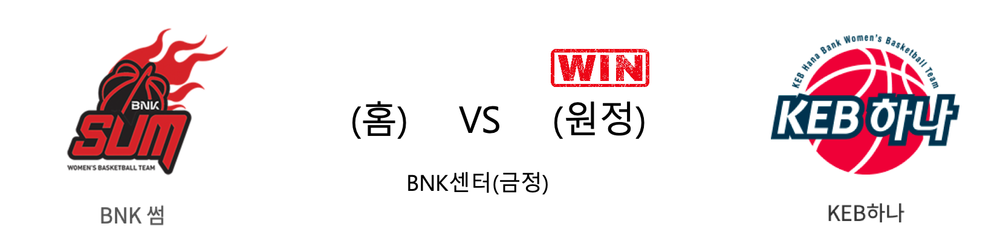

####  BNK썸(홈) VS KEB하나(원정) 

<table class="tg">
  <tr>
    <th class="tg-rr9t">BNK썸</th>
    <th class="tg-rr9t">팀</th>
    <th class="tg-rr9t">KEB하나</th>
  </tr>
  <tr>
    <td class="tg-dcpn">0승 3패</td>
    <td class="tg-rr9t">시즌 상대전적</td>
    <td class="tg-dcpn">3승 0패</td>
  </tr>
  <tr>
    <td class="tg-dcpn">63</td>
    <td class="tg-rr9t">점수</td>
    <td class="tg-dcpn">67</td>
  </tr>
  <tr>
    <td class="tg-dcpn">15/45(33%)</td>
    <td class="tg-rr9t">2점(%)</td>
    <td class="tg-dcpn">22/45(49%)</td>
  </tr>
  <tr>
    <td class="tg-dcpn">6/21(29%)</td>
    <td class="tg-rr9t">3점(%)</td>
    <td class="tg-dcpn">5/20(25%)</td>
  </tr>
  <tr>
    <td class="tg-dcpn">15/17(88%)</td>
    <td class="tg-rr9t">자유투(%)</td>
    <td class="tg-dcpn">8/10(80%)</td>
  </tr>
  <tr>
    <td class="tg-dcpn">41</td>
    <td class="tg-rr9t">리바운드</td>
    <td class="tg-dcpn">34</td>
  </tr>
  <tr>
    <td class="tg-dcpn">11</td>
    <td class="tg-rr9t">어시스트</td>
    <td class="tg-dcpn">13</td>
  </tr>
  <tr>
    <td class="tg-dcpn">6</td>
    <td class="tg-rr9t">스틸</td>
    <td class="tg-dcpn">11</td>
  </tr>
  <tr>
    <td class="tg-dcpn">16</td>
    <td class="tg-rr9t">블록</td>
    <td class="tg-dcpn">9</td>
  </tr>
  <tr>
    <td class="tg-dcpn">18</td>
    <td class="tg-rr9t">턴오버</td>
    <td class="tg-dcpn">17</td>
  </tr>
  <tr>
    <td class="tg-dcpn">진안(15) 단타스(27)</td>
    <td class="tg-rr9t">주요 득점선수</td>
    <td class="tg-dcpn">강이슬(22) 마이샤(20)</td>
  </tr>
</table>

#### 경기 관련 주요 기사         

[BNK 진안 '들어가라'](http://yna.kr/PYH20191229054500051?did=1196m)

[[내 맘대로 프리뷰] BNK와 KEB하나은행, 단독 4위를 향하여](http://www.basketkorea.com/news/articleView.html?idxno=191148)

['강이슬 폭주' KEB하나은행, BNK 썸 4연승 제지](http://www.sportsseoul.com/news/read/866404)

[[포토] KEB하나은행 67:63으로 승리!](http://www.rookie.co.kr/news/articleView.html?idxno=37137)

        
        

#### 리그 순위

<table class="tg">
  <tr>
    <th class="tg-d14o">순위</th>
    <th class="tg-d14o">팀명</th>
    <th class="tg-d14o">경기수</th>
    <th class="tg-d14o">승</th>
    <th class="tg-d14o">패</th>
    <th class="tg-d14o">승차</th>
    <th class="tg-d14o">승률</th>
  </tr>
  
<tr>
    <td class="tg-50j8">1</td>
    <td class="tg-50j8">우리은행</td>
    <td class="tg-50j8">15</td>
    <td class="tg-50j8">12</td>
    <td class="tg-50j8">3</td>
    <td class="tg-50j8">0</td>
    <td class="tg-50j8">0.8</td>
</tr>

<tr>
    <td class="tg-50j8">2</td>
    <td class="tg-50j8">KB스타즈</td>
    <td class="tg-50j8">15</td>
    <td class="tg-50j8">10</td>
    <td class="tg-50j8">5</td>
    <td class="tg-50j8">2</td>
    <td class="tg-50j8">0.667</td>
</tr>

<tr>
    <td class="tg-50j8">3</td>
    <td class="tg-50j8">신한은행</td>
    <td class="tg-50j8">15</td>
    <td class="tg-50j8">7</td>
    <td class="tg-50j8">8</td>
    <td class="tg-50j8">5</td>
    <td class="tg-50j8">0.467</td>
</tr>

<tr>
    <td class="tg-50j8">4</td>
    <td class="tg-50j8">KEB하나</td>
    <td class="tg-50j8">15</td>
    <td class="tg-50j8">6</td>
    <td class="tg-50j8">9</td>
    <td class="tg-50j8">6</td>
    <td class="tg-50j8">0.4</td>
</tr>

<tr>
    <td class="tg-50j8">5</td>
    <td class="tg-50j8">BNK썸</td>
    <td class="tg-50j8">15</td>
    <td class="tg-50j8">5</td>
    <td class="tg-50j8">10</td>
    <td class="tg-50j8">7</td>
    <td class="tg-50j8">0.333</td>
</tr>

<tr>
    <td class="tg-50j8">5</td>
    <td class="tg-50j8">삼성생명</td>
    <td class="tg-50j8">15</td>
    <td class="tg-50j8">5</td>
    <td class="tg-50j8">10</td>
    <td class="tg-50j8">7</td>
    <td class="tg-50j8">0.333</td>
</tr>
</table> 

        
        
#wkbl #국내농구 #여자농구 #농구분석 #토토 #스포츠토토 #경기예측 #농구결과 #20191229 #BNK썸 #KEB하나 #BNK썸KEB하나 