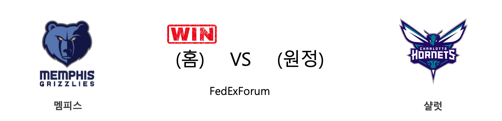
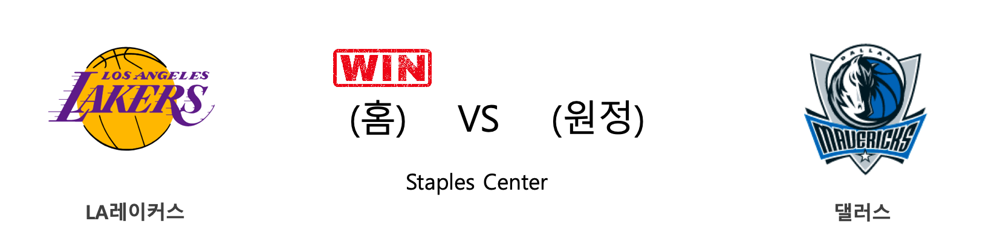
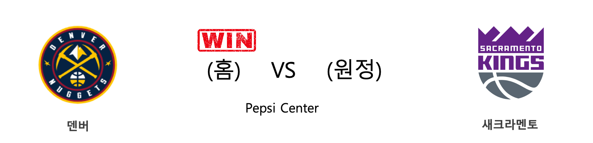
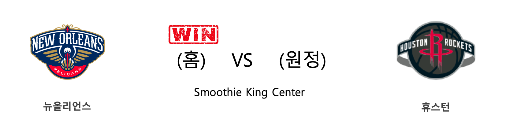
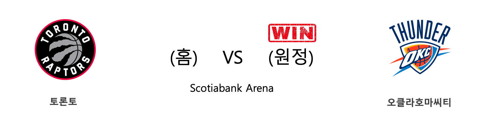

####  멤피스(홈) VS 샬럿(원정) 

<table class="tg">
  <tr>
    <th class="tg-rr9t">MEM</th>
    <th class="tg-rr9t">팀</th>
    <th class="tg-rr9t">CHA</th>
  </tr>
  <tr>
    <td class="tg-dcpn">2승 0패</td>
    <td class="tg-rr9t">시즌 상대전적</td>
    <td class="tg-dcpn">0승 2패</td>
  </tr>
  <tr>
    <td class="tg-dcpn">117</td>
    <td class="tg-rr9t">점수</td>
    <td class="tg-dcpn">104</td>
  </tr>
  <tr>
    <td class="tg-dcpn">35/57(61%)</td>
    <td class="tg-rr9t">2점(%)</td>
    <td class="tg-dcpn">28/55(51%)</td>
  </tr>
  <tr>
    <td class="tg-dcpn">10/35(29%)</td>
    <td class="tg-rr9t">3점(%)</td>
    <td class="tg-dcpn">9/31(29%)</td>
  </tr>
  <tr>
    <td class="tg-dcpn">17/17(100%)</td>
    <td class="tg-rr9t">자유투(%)</td>
    <td class="tg-dcpn">21/32(66%)</td>
  </tr>
  <tr>
    <td class="tg-dcpn">50</td>
    <td class="tg-rr9t">리바운드</td>
    <td class="tg-dcpn">42</td>
  </tr>
  <tr>
    <td class="tg-dcpn">30</td>
    <td class="tg-rr9t">어시스트</td>
    <td class="tg-dcpn">23</td>
  </tr>
  <tr>
    <td class="tg-dcpn">5</td>
    <td class="tg-rr9t">스틸</td>
    <td class="tg-dcpn">8</td>
  </tr>
  <tr>
    <td class="tg-dcpn">5</td>
    <td class="tg-rr9t">블록</td>
    <td class="tg-dcpn">4</td>
  </tr>
  <tr>
    <td class="tg-dcpn">14</td>
    <td class="tg-rr9t">턴오버</td>
    <td class="tg-dcpn">14</td>
  </tr>
  <tr>
    <td class="tg-dcpn">GraysonAllen(15) JonasValanciu(16) DillonBrooksG(20) BrandonClarke(18)</td>
    <td class="tg-rr9t">주요 득점선수</td>
    <td class="tg-dcpn">P.J.Washingto(16) Devonte'Graha(16) MalikMonk(18)</td>
  </tr>
</table>

#### 경기 관련 주요 기사         

[[오늘의 NBA] (12/30) LAL 르브론 제임스, 9,000어시스트 달성](http://sports.news.naver.com/basketball/news/read.nhn?oid=486&aid=0000001181)

[[오늘의 NBA] (12/12) 제임스 하든 선생님의 심폐소생술](http://sports.news.naver.com/basketball/news/read.nhn?oid=486&aid=0000001164)

[[오늘의 NBA] (11/30) 인디애나, 동부컨퍼런스의 복병](http://sports.news.naver.com/basketball/news/read.nhn?oid=486&aid=0000001152)

[[오늘의 NBA] (12/21) 크리스탑스 포르징기스, 댈러스의 새로운 버팀목](http://sports.news.naver.com/basketball/news/read.nhn?oid=486&aid=0000001173)

[[오늘의 NBA] (12/28) 골든스테이트, 수비 코트에서 시작된 대반격](http://sports.news.naver.com/basketball/news/read.nhn?oid=486&aid=0000001179)

        
        

####  LA레이커스(홈) VS 댈러스(원정) 

<table class="tg">
  <tr>
    <th class="tg-rr9t">LAL</th>
    <th class="tg-rr9t">팀</th>
    <th class="tg-rr9t">DAL</th>
  </tr>
  <tr>
    <td class="tg-dcpn">2승 1패</td>
    <td class="tg-rr9t">시즌 상대전적</td>
    <td class="tg-dcpn">1승 2패</td>
  </tr>
  <tr>
    <td class="tg-dcpn">108</td>
    <td class="tg-rr9t">점수</td>
    <td class="tg-dcpn">95</td>
  </tr>
  <tr>
    <td class="tg-dcpn">29/55(53%)</td>
    <td class="tg-rr9t">2점(%)</td>
    <td class="tg-dcpn">19/46(41%)</td>
  </tr>
  <tr>
    <td class="tg-dcpn">9/23(39%)</td>
    <td class="tg-rr9t">3점(%)</td>
    <td class="tg-dcpn">13/43(30%)</td>
  </tr>
  <tr>
    <td class="tg-dcpn">23/28(82%)</td>
    <td class="tg-rr9t">자유투(%)</td>
    <td class="tg-dcpn">18/20(90%)</td>
  </tr>
  <tr>
    <td class="tg-dcpn">39</td>
    <td class="tg-rr9t">리바운드</td>
    <td class="tg-dcpn">45</td>
  </tr>
  <tr>
    <td class="tg-dcpn">28</td>
    <td class="tg-rr9t">어시스트</td>
    <td class="tg-dcpn">17</td>
  </tr>
  <tr>
    <td class="tg-dcpn">12</td>
    <td class="tg-rr9t">스틸</td>
    <td class="tg-dcpn">11</td>
  </tr>
  <tr>
    <td class="tg-dcpn">7</td>
    <td class="tg-rr9t">블록</td>
    <td class="tg-dcpn">4</td>
  </tr>
  <tr>
    <td class="tg-dcpn">16</td>
    <td class="tg-rr9t">턴오버</td>
    <td class="tg-dcpn">18</td>
  </tr>
  <tr>
    <td class="tg-dcpn">KentaviousCal(19) AnthonyDavisF(23) DwightHoward(15)</td>
    <td class="tg-rr9t">주요 득점선수</td>
    <td class="tg-dcpn">LukaDoncicG(19)</td>
  </tr>
</table>

#### 경기 관련 주요 기사         

[[오늘의 NBA] (12/14) 레이커스, 마이애미 홈 코트를 점령하다](http://sports.news.naver.com/basketball/news/read.nhn?oid=486&aid=0000001166)

[[오늘의 NBA] (12/30) LAL 르브론 제임스, 9,000어시스트 달성](http://sports.news.naver.com/basketball/news/read.nhn?oid=486&aid=0000001181)

[[오늘의 NBA] (12/26) NBA 2019년 크리스마스 축제](http://sports.news.naver.com/basketball/news/read.nhn?oid=486&aid=0000001177)

[[오늘의 NBA] (12/20) 밀워키, 리그 전체 단독 1위 등극!](http://sports.news.naver.com/basketball/news/read.nhn?oid=486&aid=0000001172)

[[오늘의 NBA] (12/23) 토론토, 포기할 줄 모르는 북방의 투사](http://sports.news.naver.com/basketball/news/read.nhn?oid=486&aid=0000001175)

        
        

####  덴버(홈) VS 새크라멘토(원정) 

<table class="tg">
  <tr>
    <th class="tg-rr9t">DEN</th>
    <th class="tg-rr9t">팀</th>
    <th class="tg-rr9t">SAC</th>
  </tr>
  <tr>
    <td class="tg-dcpn">2승 1패</td>
    <td class="tg-rr9t">시즌 상대전적</td>
    <td class="tg-dcpn">1승 2패</td>
  </tr>
  <tr>
    <td class="tg-dcpn">120</td>
    <td class="tg-rr9t">점수</td>
    <td class="tg-dcpn">115</td>
  </tr>
  <tr>
    <td class="tg-dcpn">34/52(65%)</td>
    <td class="tg-rr9t">2점(%)</td>
    <td class="tg-dcpn">32/51(63%)</td>
  </tr>
  <tr>
    <td class="tg-dcpn">8/29(28%)</td>
    <td class="tg-rr9t">3점(%)</td>
    <td class="tg-dcpn">13/34(38%)</td>
  </tr>
  <tr>
    <td class="tg-dcpn">28/31(90%)</td>
    <td class="tg-rr9t">자유투(%)</td>
    <td class="tg-dcpn">12/17(71%)</td>
  </tr>
  <tr>
    <td class="tg-dcpn">37</td>
    <td class="tg-rr9t">리바운드</td>
    <td class="tg-dcpn">35</td>
  </tr>
  <tr>
    <td class="tg-dcpn">23</td>
    <td class="tg-rr9t">어시스트</td>
    <td class="tg-dcpn">32</td>
  </tr>
  <tr>
    <td class="tg-dcpn">6</td>
    <td class="tg-rr9t">스틸</td>
    <td class="tg-dcpn">5</td>
  </tr>
  <tr>
    <td class="tg-dcpn">4</td>
    <td class="tg-rr9t">블록</td>
    <td class="tg-dcpn">4</td>
  </tr>
  <tr>
    <td class="tg-dcpn">12</td>
    <td class="tg-rr9t">턴오버</td>
    <td class="tg-dcpn">12</td>
  </tr>
  <tr>
    <td class="tg-dcpn">MichaelPorter(19) MasonPlumlee(15) WillBartonG(19) JeramiGrantF(18) NikolaJokicC(17)</td>
    <td class="tg-rr9t">주요 득점선수</td>
    <td class="tg-dcpn">De'AaronFoxG(18) NemanjaBjelic(27) BuddyHieldG(20) RichaunHolmes(18)</td>
  </tr>
</table>

#### 경기 관련 주요 기사         

[[오늘의 NBA] (12/21) 크리스탑스 포르징기스, 댈러스의 새로운 버팀목](http://sports.news.naver.com/basketball/news/read.nhn?oid=486&aid=0000001173)

[[오늘의 NBA] (12/16) 스펜서 딘위디, 브루클린 상승세를 이끈다!](http://sports.news.naver.com/basketball/news/read.nhn?oid=486&aid=0000001168)

[[오늘의 NBA] (12/7) 르브론 제임스, 멜로(carmelo) 드라마의 주인공](http://sports.news.naver.com/basketball/news/read.nhn?oid=486&aid=0000001159)

[[오늘의 NBA] (12/9) 앤써니 데이비스, 구단 역사에 이름을 남기다](http://sports.news.naver.com/basketball/news/read.nhn?oid=486&aid=0000001161)

[[오늘의 NBA] (12/29) 마이애미, 연장전 승부 전문가](http://sports.news.naver.com/basketball/news/read.nhn?oid=486&aid=0000001180)

        
        

####  뉴올리언스(홈) VS 휴스턴(원정) 

<table class="tg">
  <tr>
    <th class="tg-rr9t">NOP</th>
    <th class="tg-rr9t">팀</th>
    <th class="tg-rr9t">HOU</th>
  </tr>
  <tr>
    <td class="tg-dcpn">1승 2패</td>
    <td class="tg-rr9t">시즌 상대전적</td>
    <td class="tg-dcpn">2승 1패</td>
  </tr>
  <tr>
    <td class="tg-dcpn">127</td>
    <td class="tg-rr9t">점수</td>
    <td class="tg-dcpn">112</td>
  </tr>
  <tr>
    <td class="tg-dcpn">32/58(55%)</td>
    <td class="tg-rr9t">2점(%)</td>
    <td class="tg-dcpn">27/42(64%)</td>
  </tr>
  <tr>
    <td class="tg-dcpn">18/44(41%)</td>
    <td class="tg-rr9t">3점(%)</td>
    <td class="tg-dcpn">15/39(38%)</td>
  </tr>
  <tr>
    <td class="tg-dcpn">9/13(69%)</td>
    <td class="tg-rr9t">자유투(%)</td>
    <td class="tg-dcpn">13/20(65%)</td>
  </tr>
  <tr>
    <td class="tg-dcpn">47</td>
    <td class="tg-rr9t">리바운드</td>
    <td class="tg-dcpn">41</td>
  </tr>
  <tr>
    <td class="tg-dcpn">32</td>
    <td class="tg-rr9t">어시스트</td>
    <td class="tg-dcpn">29</td>
  </tr>
  <tr>
    <td class="tg-dcpn">9</td>
    <td class="tg-rr9t">스틸</td>
    <td class="tg-dcpn">5</td>
  </tr>
  <tr>
    <td class="tg-dcpn">4</td>
    <td class="tg-rr9t">블록</td>
    <td class="tg-dcpn">3</td>
  </tr>
  <tr>
    <td class="tg-dcpn">9</td>
    <td class="tg-rr9t">턴오버</td>
    <td class="tg-dcpn">17</td>
  </tr>
  <tr>
    <td class="tg-dcpn">BrandonIngram(27) E'TwaunMoore(25) LonzoBallG(27) JrueHolidayF(25)</td>
    <td class="tg-rr9t">주요 득점선수</td>
    <td class="tg-dcpn">DanuelHouseJr(22) IsaiahHartens(19) ChrisClemons(16) EricGordonG(20)</td>
  </tr>
</table>

#### 경기 관련 주요 기사         

[[오늘의 NBA] (12/21) 크리스탑스 포르징기스, 댈러스의 새로운 버팀목](http://sports.news.naver.com/basketball/news/read.nhn?oid=486&aid=0000001173)

[[NBA] HOU 에릭 고든이 돌아온다...30일 NOP전 복귀 가능성 ↑](http://sports.news.naver.com/basketball/news/read.nhn?oid=065&aid=0000194483)

[[오늘의 NBA] (12/12) 제임스 하든 선생님의 심폐소생술](http://sports.news.naver.com/basketball/news/read.nhn?oid=486&aid=0000001164)

[[오늘의 NBA] (12/30) LAL 르브론 제임스, 9,000어시스트 달성](http://sports.news.naver.com/basketball/news/read.nhn?oid=486&aid=0000001181)

[[오늘의 NBA] (12/29) 마이애미, 연장전 승부 전문가](http://sports.news.naver.com/basketball/news/read.nhn?oid=486&aid=0000001180)

        
        

####  토론토(홈) VS 오클라호마씨티(원정) 

<table class="tg">
  <tr>
    <th class="tg-rr9t">TOR</th>
    <th class="tg-rr9t">팀</th>
    <th class="tg-rr9t">OKC</th>
  </tr>
  <tr>
    <td class="tg-dcpn">0승 1패</td>
    <td class="tg-rr9t">시즌 상대전적</td>
    <td class="tg-dcpn">1승 0패</td>
  </tr>
  <tr>
    <td class="tg-dcpn">97</td>
    <td class="tg-rr9t">점수</td>
    <td class="tg-dcpn">98</td>
  </tr>
  <tr>
    <td class="tg-dcpn">20/43(47%)</td>
    <td class="tg-rr9t">2점(%)</td>
    <td class="tg-dcpn">24/45(53%)</td>
  </tr>
  <tr>
    <td class="tg-dcpn">15/40(38%)</td>
    <td class="tg-rr9t">3점(%)</td>
    <td class="tg-dcpn">10/33(30%)</td>
  </tr>
  <tr>
    <td class="tg-dcpn">12/12(100%)</td>
    <td class="tg-rr9t">자유투(%)</td>
    <td class="tg-dcpn">20/23(87%)</td>
  </tr>
  <tr>
    <td class="tg-dcpn">42</td>
    <td class="tg-rr9t">리바운드</td>
    <td class="tg-dcpn">43</td>
  </tr>
  <tr>
    <td class="tg-dcpn">21</td>
    <td class="tg-rr9t">어시스트</td>
    <td class="tg-dcpn">15</td>
  </tr>
  <tr>
    <td class="tg-dcpn">7</td>
    <td class="tg-rr9t">스틸</td>
    <td class="tg-dcpn">8</td>
  </tr>
  <tr>
    <td class="tg-dcpn">2</td>
    <td class="tg-rr9t">블록</td>
    <td class="tg-dcpn">6</td>
  </tr>
  <tr>
    <td class="tg-dcpn">14</td>
    <td class="tg-rr9t">턴오버</td>
    <td class="tg-dcpn">17</td>
  </tr>
  <tr>
    <td class="tg-dcpn">FredVanVleetG(20) KyleLowryG(20)</td>
    <td class="tg-rr9t">주요 득점선수</td>
    <td class="tg-dcpn">ChrisPaulG(25) ShaiGilgeous-(32)</td>
  </tr>
</table>

#### 경기 관련 주요 기사         

[[오늘의 NBA] (12/23) 토론토, 포기할 줄 모르는 북방의 투사](http://sports.news.naver.com/basketball/news/read.nhn?oid=486&aid=0000001175)

[[오늘의 NBA] (12/17) 댈러스, 밀워키 시스템을 붕괴시키다](http://sports.news.naver.com/basketball/news/read.nhn?oid=486&aid=0000001169)

[[오늘의 NBA] (12/30) LAL 르브론 제임스, 9,000어시스트 달성](http://sports.news.naver.com/basketball/news/read.nhn?oid=486&aid=0000001181)

[[오늘의 NBA] (12/29) 마이애미, 연장전 승부 전문가](http://sports.news.naver.com/basketball/news/read.nhn?oid=486&aid=0000001180)

[[오늘의 NBA] (12/12) 제임스 하든 선생님의 심폐소생술](http://sports.news.naver.com/basketball/news/read.nhn?oid=486&aid=0000001164)

        
        

#### 리그 (Eastern) 순위
    

<table class="tg">
  <tr>
    <th class="tg-d14o">순위</th>
    <th class="tg-d14o">팀명</th>
    <th class="tg-d14o">경기수</th>
    <th class="tg-d14o">승</th>
    <th class="tg-d14o">패</th>
    <th class="tg-d14o">승차</th>
    <th class="tg-d14o">승률</th>
  </tr>
  
<tr>
    <td class="tg-50j8">1</td>
    <td class="tg-50j8">MIL</td>
    <td class="tg-50j8">34</td>
    <td class="tg-50j8">29</td>
    <td class="tg-50j8">5</td>
    <td class="tg-50j8">0</td>
    <td class="tg-50j8">0.853</td>
</tr>

<tr>
    <td class="tg-50j8">2</td>
    <td class="tg-50j8">MIA</td>
    <td class="tg-50j8">32</td>
    <td class="tg-50j8">24</td>
    <td class="tg-50j8">8</td>
    <td class="tg-50j8">5</td>
    <td class="tg-50j8">0.75</td>
</tr>

<tr>
    <td class="tg-50j8">3</td>
    <td class="tg-50j8">BOS</td>
    <td class="tg-50j8">29</td>
    <td class="tg-50j8">22</td>
    <td class="tg-50j8">7</td>
    <td class="tg-50j8">7</td>
    <td class="tg-50j8">0.759</td>
</tr>

<tr>
    <td class="tg-50j8">4</td>
    <td class="tg-50j8">TOR</td>
    <td class="tg-50j8">33</td>
    <td class="tg-50j8">22</td>
    <td class="tg-50j8">11</td>
    <td class="tg-50j8">7</td>
    <td class="tg-50j8">0.667</td>
</tr>

<tr>
    <td class="tg-50j8">5</td>
    <td class="tg-50j8">PHI</td>
    <td class="tg-50j8">34</td>
    <td class="tg-50j8">22</td>
    <td class="tg-50j8">12</td>
    <td class="tg-50j8">7</td>
    <td class="tg-50j8">0.647</td>
</tr>

<tr>
    <td class="tg-50j8">6</td>
    <td class="tg-50j8">IND</td>
    <td class="tg-50j8">33</td>
    <td class="tg-50j8">21</td>
    <td class="tg-50j8">12</td>
    <td class="tg-50j8">8</td>
    <td class="tg-50j8">0.636</td>
</tr>

<tr>
    <td class="tg-50j8">7</td>
    <td class="tg-50j8">BKN</td>
    <td class="tg-50j8">31</td>
    <td class="tg-50j8">16</td>
    <td class="tg-50j8">15</td>
    <td class="tg-50j8">13</td>
    <td class="tg-50j8">0.516</td>
</tr>

<tr>
    <td class="tg-50j8">8</td>
    <td class="tg-50j8">ORL</td>
    <td class="tg-50j8">32</td>
    <td class="tg-50j8">14</td>
    <td class="tg-50j8">18</td>
    <td class="tg-50j8">15</td>
    <td class="tg-50j8">0.438</td>
</tr>

<tr>
    <td class="tg-50j8">9</td>
    <td class="tg-50j8">CHI</td>
    <td class="tg-50j8">33</td>
    <td class="tg-50j8">13</td>
    <td class="tg-50j8">20</td>
    <td class="tg-50j8">16</td>
    <td class="tg-50j8">0.394</td>
</tr>

<tr>
    <td class="tg-50j8">10</td>
    <td class="tg-50j8">CHA</td>
    <td class="tg-50j8">35</td>
    <td class="tg-50j8">13</td>
    <td class="tg-50j8">22</td>
    <td class="tg-50j8">16</td>
    <td class="tg-50j8">0.371</td>
</tr>

<tr>
    <td class="tg-50j8">11</td>
    <td class="tg-50j8">DET</td>
    <td class="tg-50j8">32</td>
    <td class="tg-50j8">12</td>
    <td class="tg-50j8">20</td>
    <td class="tg-50j8">17</td>
    <td class="tg-50j8">0.375</td>
</tr>

<tr>
    <td class="tg-50j8">12</td>
    <td class="tg-50j8">CLE</td>
    <td class="tg-50j8">31</td>
    <td class="tg-50j8">9</td>
    <td class="tg-50j8">22</td>
    <td class="tg-50j8">20</td>
    <td class="tg-50j8">0.29</td>
</tr>

<tr>
    <td class="tg-50j8">12</td>
    <td class="tg-50j8">WAS</td>
    <td class="tg-50j8">31</td>
    <td class="tg-50j8">9</td>
    <td class="tg-50j8">22</td>
    <td class="tg-50j8">20</td>
    <td class="tg-50j8">0.29</td>
</tr>

<tr>
    <td class="tg-50j8">14</td>
    <td class="tg-50j8">NYK</td>
    <td class="tg-50j8">33</td>
    <td class="tg-50j8">9</td>
    <td class="tg-50j8">24</td>
    <td class="tg-50j8">20</td>
    <td class="tg-50j8">0.273</td>
</tr>

<tr>
    <td class="tg-50j8">15</td>
    <td class="tg-50j8">ATL</td>
    <td class="tg-50j8">33</td>
    <td class="tg-50j8">6</td>
    <td class="tg-50j8">27</td>
    <td class="tg-50j8">23</td>
    <td class="tg-50j8">0.182</td>
</tr>
</table> 
#### 리그 (Western) 순위
    

<table class="tg">
  <tr>
    <th class="tg-d14o">순위</th>
    <th class="tg-d14o">팀명</th>
    <th class="tg-d14o">경기수</th>
    <th class="tg-d14o">승</th>
    <th class="tg-d14o">패</th>
    <th class="tg-d14o">승차</th>
    <th class="tg-d14o">승률</th>
  </tr>
  
<tr>
    <td class="tg-50j8">1</td>
    <td class="tg-50j8">LAL</td>
    <td class="tg-50j8">33</td>
    <td class="tg-50j8">26</td>
    <td class="tg-50j8">7</td>
    <td class="tg-50j8">3</td>
    <td class="tg-50j8">0.788</td>
</tr>

<tr>
    <td class="tg-50j8">2</td>
    <td class="tg-50j8">LAC</td>
    <td class="tg-50j8">34</td>
    <td class="tg-50j8">23</td>
    <td class="tg-50j8">11</td>
    <td class="tg-50j8">6</td>
    <td class="tg-50j8">0.676</td>
</tr>

<tr>
    <td class="tg-50j8">3</td>
    <td class="tg-50j8">DEN</td>
    <td class="tg-50j8">31</td>
    <td class="tg-50j8">22</td>
    <td class="tg-50j8">9</td>
    <td class="tg-50j8">7</td>
    <td class="tg-50j8">0.71</td>
</tr>

<tr>
    <td class="tg-50j8">4</td>
    <td class="tg-50j8">HOU</td>
    <td class="tg-50j8">33</td>
    <td class="tg-50j8">22</td>
    <td class="tg-50j8">11</td>
    <td class="tg-50j8">7</td>
    <td class="tg-50j8">0.667</td>
</tr>

<tr>
    <td class="tg-50j8">5</td>
    <td class="tg-50j8">DAL</td>
    <td class="tg-50j8">31</td>
    <td class="tg-50j8">20</td>
    <td class="tg-50j8">11</td>
    <td class="tg-50j8">9</td>
    <td class="tg-50j8">0.645</td>
</tr>

<tr>
    <td class="tg-50j8">6</td>
    <td class="tg-50j8">UTA</td>
    <td class="tg-50j8">32</td>
    <td class="tg-50j8">20</td>
    <td class="tg-50j8">12</td>
    <td class="tg-50j8">9</td>
    <td class="tg-50j8">0.625</td>
</tr>

<tr>
    <td class="tg-50j8">7</td>
    <td class="tg-50j8">OKC</td>
    <td class="tg-50j8">32</td>
    <td class="tg-50j8">17</td>
    <td class="tg-50j8">15</td>
    <td class="tg-50j8">12</td>
    <td class="tg-50j8">0.531</td>
</tr>

<tr>
    <td class="tg-50j8">8</td>
    <td class="tg-50j8">POR</td>
    <td class="tg-50j8">32</td>
    <td class="tg-50j8">14</td>
    <td class="tg-50j8">18</td>
    <td class="tg-50j8">15</td>
    <td class="tg-50j8">0.438</td>
</tr>

<tr>
    <td class="tg-50j8">9</td>
    <td class="tg-50j8">SAS</td>
    <td class="tg-50j8">30</td>
    <td class="tg-50j8">13</td>
    <td class="tg-50j8">17</td>
    <td class="tg-50j8">16</td>
    <td class="tg-50j8">0.433</td>
</tr>

<tr>
    <td class="tg-50j8">10</td>
    <td class="tg-50j8">MEM</td>
    <td class="tg-50j8">34</td>
    <td class="tg-50j8">13</td>
    <td class="tg-50j8">21</td>
    <td class="tg-50j8">16</td>
    <td class="tg-50j8">0.382</td>
</tr>

<tr>
    <td class="tg-50j8">11</td>
    <td class="tg-50j8">PHX</td>
    <td class="tg-50j8">32</td>
    <td class="tg-50j8">12</td>
    <td class="tg-50j8">20</td>
    <td class="tg-50j8">17</td>
    <td class="tg-50j8">0.375</td>
</tr>

<tr>
    <td class="tg-50j8">12</td>
    <td class="tg-50j8">SAC</td>
    <td class="tg-50j8">33</td>
    <td class="tg-50j8">12</td>
    <td class="tg-50j8">21</td>
    <td class="tg-50j8">17</td>
    <td class="tg-50j8">0.364</td>
</tr>

<tr>
    <td class="tg-50j8">13</td>
    <td class="tg-50j8">MIN</td>
    <td class="tg-50j8">31</td>
    <td class="tg-50j8">11</td>
    <td class="tg-50j8">20</td>
    <td class="tg-50j8">18</td>
    <td class="tg-50j8">0.355</td>
</tr>

<tr>
    <td class="tg-50j8">14</td>
    <td class="tg-50j8">NOP</td>
    <td class="tg-50j8">34</td>
    <td class="tg-50j8">11</td>
    <td class="tg-50j8">23</td>
    <td class="tg-50j8">18</td>
    <td class="tg-50j8">0.324</td>
</tr>

<tr>
    <td class="tg-50j8">15</td>
    <td class="tg-50j8">GSW</td>
    <td class="tg-50j8">34</td>
    <td class="tg-50j8">9</td>
    <td class="tg-50j8">25</td>
    <td class="tg-50j8">20</td>
    <td class="tg-50j8">0.265</td>
</tr>
</table> 

        
        
#nba #미국농구 #엔비에이 #농구분석 #토토 #스포츠토토 #경기예측 #농구결과 #20191230 #멤피스 #샬럿 #LA레이커스 #댈러스 #덴버 #새크라멘토 #뉴올리언스 #휴스턴 #토론토 #오클라호마씨티 #멤피스샬럿 #LA레이커스댈러스 #덴버새크라멘토 #뉴올리언스휴스턴 #토론토오클라호마씨티 