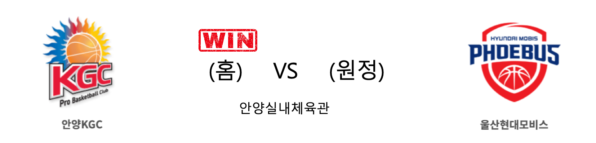

####  고양오리온(홈) VS 서울SK(원정) 

<table class="tg">
  <tr>
    <th class="tg-rr9t">고양오리온</th>
    <th class="tg-rr9t">팀</th>
    <th class="tg-rr9t">서울SK</th>
  </tr>
  <tr>
    <td class="tg-dcpn">1승 3패</td>
    <td class="tg-rr9t">시즌 상대전적</td>
    <td class="tg-dcpn">3승 1패</td>
  </tr>
  <tr>
    <td class="tg-dcpn">83</td>
    <td class="tg-rr9t">점수</td>
    <td class="tg-dcpn">75</td>
  </tr>
  <tr>
    <td class="tg-dcpn">26/44(59%)</td>
    <td class="tg-rr9t">2점(%)</td>
    <td class="tg-dcpn">22/42(52%)</td>
  </tr>
  <tr>
    <td class="tg-dcpn">4/16(25%)</td>
    <td class="tg-rr9t">3점(%)</td>
    <td class="tg-dcpn">6/27(22%)</td>
  </tr>
  <tr>
    <td class="tg-dcpn">19/23(83%)</td>
    <td class="tg-rr9t">자유투(%)</td>
    <td class="tg-dcpn">13/17(76%)</td>
  </tr>
  <tr>
    <td class="tg-dcpn">29</td>
    <td class="tg-rr9t">리바운드</td>
    <td class="tg-dcpn">39</td>
  </tr>
  <tr>
    <td class="tg-dcpn">0</td>
    <td class="tg-rr9t">어시스트</td>
    <td class="tg-dcpn">1</td>
  </tr>
  <tr>
    <td class="tg-dcpn">8</td>
    <td class="tg-rr9t">스틸</td>
    <td class="tg-dcpn">10</td>
  </tr>
  <tr>
    <td class="tg-dcpn">5</td>
    <td class="tg-rr9t">블록</td>
    <td class="tg-dcpn">7</td>
  </tr>
  <tr>
    <td class="tg-dcpn">17</td>
    <td class="tg-rr9t">턴오버</td>
    <td class="tg-dcpn">17</td>
  </tr>
  <tr>
    <td class="tg-dcpn">이승현(15) 최진수(16)</td>
    <td class="tg-rr9t">주요 득점선수</td>
    <td class="tg-dcpn">자밀 워니(28) 최준용(19)</td>
  </tr>
</table>

#### 경기 관련 주요 기사         

[하위권 오리온, 새해 첫 경기서 선두 SK 제압](http://yna.kr/AKR20200101050200007?did=1195m)

[오리온, 선두 SK 꺾고 새해 첫승](http://www.kgnews.co.kr/news/articleView.html?idxno=571204)

['꼴찌의 반란!' 오리온, 새해 첫 날 '대어' SK 잡았다-공동 9위 점프](http://sports.chosun.com/news/ntype.htm?id=202001020100008140000275&servicedate=20200101)

[꼴찌 오리온, 새해 첫날 선두 SK에 일격(종합)](http://www.newsis.com/view/?id=NISX20200101_0000876773&cID=10505&pID=10500)

        
        

####  안양KGC(홈) VS 울산현대모비스(원정) 

<table class="tg">
  <tr>
    <th class="tg-rr9t">안양KGC</th>
    <th class="tg-rr9t">팀</th>
    <th class="tg-rr9t">울산현대모비스</th>
  </tr>
  <tr>
    <td class="tg-dcpn">3승 1패</td>
    <td class="tg-rr9t">시즌 상대전적</td>
    <td class="tg-dcpn">1승 3패</td>
  </tr>
  <tr>
    <td class="tg-dcpn">85</td>
    <td class="tg-rr9t">점수</td>
    <td class="tg-dcpn">71</td>
  </tr>
  <tr>
    <td class="tg-dcpn">25/45(56%)</td>
    <td class="tg-rr9t">2점(%)</td>
    <td class="tg-dcpn">17/32(53%)</td>
  </tr>
  <tr>
    <td class="tg-dcpn">9/23(39%)</td>
    <td class="tg-rr9t">3점(%)</td>
    <td class="tg-dcpn">8/23(35%)</td>
  </tr>
  <tr>
    <td class="tg-dcpn">8/13(62%)</td>
    <td class="tg-rr9t">자유투(%)</td>
    <td class="tg-dcpn">13/16(81%)</td>
  </tr>
  <tr>
    <td class="tg-dcpn">32</td>
    <td class="tg-rr9t">리바운드</td>
    <td class="tg-dcpn">27</td>
  </tr>
  <tr>
    <td class="tg-dcpn">5</td>
    <td class="tg-rr9t">어시스트</td>
    <td class="tg-dcpn">1</td>
  </tr>
  <tr>
    <td class="tg-dcpn">10</td>
    <td class="tg-rr9t">스틸</td>
    <td class="tg-dcpn">16</td>
  </tr>
  <tr>
    <td class="tg-dcpn">9</td>
    <td class="tg-rr9t">블록</td>
    <td class="tg-dcpn">6</td>
  </tr>
  <tr>
    <td class="tg-dcpn">23</td>
    <td class="tg-rr9t">턴오버</td>
    <td class="tg-dcpn">18</td>
  </tr>
  <tr>
    <td class="tg-dcpn">브랜든 브라운(36) 박지훈(20)</td>
    <td class="tg-rr9t">주요 득점선수</td>
    <td class="tg-dcpn">양동근(15)</td>
  </tr>
</table>

#### 경기 관련 주요 기사         

[[포토] 안양KGC, 새해 첫 경기 승리했다!](http://sports.chosun.com/news/ntype.htm?id=202001010100009490000369&servicedate=20200101)

[오리온, 선두 SK 꺾고 새해 첫 승…2위 KGC, 3연승(종합)](http://news1.kr/articles/?3806651)

[[BK Review] '브라운-박지훈 동반 더블더블' KGC, 현대모비스 꺾고 3연승… 선두와 1G 차](http://www.basketkorea.com/news/articleView.html?idxno=191246)

[인삼공사, 현대모비스 잡고 3연승…선두에 1경기차 추격(종합)](http://yna.kr/AKR20200101050251007?did=1195m)

        
        

####  서울삼성(홈) VS 인천전자랜드(원정) 

<table class="tg">
  <tr>
    <th class="tg-rr9t">서울삼성</th>
    <th class="tg-rr9t">팀</th>
    <th class="tg-rr9t">인천전자랜드</th>
  </tr>
  <tr>
    <td class="tg-dcpn">1승 3패</td>
    <td class="tg-rr9t">시즌 상대전적</td>
    <td class="tg-dcpn">3승 1패</td>
  </tr>
  <tr>
    <td class="tg-dcpn">65</td>
    <td class="tg-rr9t">점수</td>
    <td class="tg-dcpn">69</td>
  </tr>
  <tr>
    <td class="tg-dcpn">15/35(43%)</td>
    <td class="tg-rr9t">2점(%)</td>
    <td class="tg-dcpn">15/32(47%)</td>
  </tr>
  <tr>
    <td class="tg-dcpn">7/21(33%)</td>
    <td class="tg-rr9t">3점(%)</td>
    <td class="tg-dcpn">7/25(28%)</td>
  </tr>
  <tr>
    <td class="tg-dcpn">14/16(88%)</td>
    <td class="tg-rr9t">자유투(%)</td>
    <td class="tg-dcpn">18/18(100%)</td>
  </tr>
  <tr>
    <td class="tg-dcpn">32</td>
    <td class="tg-rr9t">리바운드</td>
    <td class="tg-dcpn">26</td>
  </tr>
  <tr>
    <td class="tg-dcpn">0</td>
    <td class="tg-rr9t">어시스트</td>
    <td class="tg-dcpn">1</td>
  </tr>
  <tr>
    <td class="tg-dcpn">16</td>
    <td class="tg-rr9t">스틸</td>
    <td class="tg-dcpn">12</td>
  </tr>
  <tr>
    <td class="tg-dcpn">9</td>
    <td class="tg-rr9t">블록</td>
    <td class="tg-dcpn">10</td>
  </tr>
  <tr>
    <td class="tg-dcpn">13</td>
    <td class="tg-rr9t">턴오버</td>
    <td class="tg-dcpn">10</td>
  </tr>
  <tr>
    <td class="tg-dcpn">닉 미네라스(19)</td>
    <td class="tg-rr9t">주요 득점선수</td>
    <td class="tg-dcpn">트로이 길렌워터(18)</td>
  </tr>
</table>

#### 경기 관련 주요 기사         

[전자랜드 '삼성에 짜릿한 역전승'[포토]](http://www.xportsnews.com/?ac=article_view&entry_id=1217659)

[‘4Q 23-9’ 전자랜드, 삼성에 17점차 역전극…4연승 질주](http://www.mydaily.co.kr/new_yk/html/read.php?newsid=202001011522929263&ext=na)

[[포토] 전자랜드 '4쿼터에 웃었다'](http://sports.chosun.com/news/ntype.htm?id=202001010100009580000377&servicedate=20200101)

[전자랜드 김지완 "새해 첫날, 마지막까지 집중해"](http://www.newsis.com/view/?id=NISX20200101_0000876784&cID=10505&pID=10500)

        
        

#### 리그 순위

<table class="tg">
  <tr>
    <th class="tg-d14o">순위</th>
    <th class="tg-d14o">팀명</th>
    <th class="tg-d14o">경기수</th>
    <th class="tg-d14o">승</th>
    <th class="tg-d14o">패</th>
    <th class="tg-d14o">승차</th>
    <th class="tg-d14o">승률</th>
  </tr>
  
<tr>
    <td class="tg-50j8">1</td>
    <td class="tg-50j8">서울SK</td>
    <td class="tg-50j8">28</td>
    <td class="tg-50j8">19</td>
    <td class="tg-50j8">9</td>
    <td class="tg-50j8">0</td>
    <td class="tg-50j8">0.679</td>
</tr>

<tr>
    <td class="tg-50j8">2</td>
    <td class="tg-50j8">안양KGC</td>
    <td class="tg-50j8">28</td>
    <td class="tg-50j8">18</td>
    <td class="tg-50j8">10</td>
    <td class="tg-50j8">1</td>
    <td class="tg-50j8">0.643</td>
</tr>

<tr>
    <td class="tg-50j8">3</td>
    <td class="tg-50j8">전주KCC</td>
    <td class="tg-50j8">28</td>
    <td class="tg-50j8">17</td>
    <td class="tg-50j8">11</td>
    <td class="tg-50j8">2</td>
    <td class="tg-50j8">0.607</td>
</tr>

<tr>
    <td class="tg-50j8">4</td>
    <td class="tg-50j8">인천전자랜드</td>
    <td class="tg-50j8">28</td>
    <td class="tg-50j8">16</td>
    <td class="tg-50j8">12</td>
    <td class="tg-50j8">3</td>
    <td class="tg-50j8">0.571</td>
</tr>

<tr>
    <td class="tg-50j8">5</td>
    <td class="tg-50j8">원주DB</td>
    <td class="tg-50j8">27</td>
    <td class="tg-50j8">14</td>
    <td class="tg-50j8">13</td>
    <td class="tg-50j8">5</td>
    <td class="tg-50j8">0.519</td>
</tr>

<tr>
    <td class="tg-50j8">6</td>
    <td class="tg-50j8">부산KT</td>
    <td class="tg-50j8">28</td>
    <td class="tg-50j8">14</td>
    <td class="tg-50j8">14</td>
    <td class="tg-50j8">5</td>
    <td class="tg-50j8">0.5</td>
</tr>

<tr>
    <td class="tg-50j8">7</td>
    <td class="tg-50j8">서울삼성</td>
    <td class="tg-50j8">28</td>
    <td class="tg-50j8">12</td>
    <td class="tg-50j8">16</td>
    <td class="tg-50j8">7</td>
    <td class="tg-50j8">0.429</td>
</tr>

<tr>
    <td class="tg-50j8">8</td>
    <td class="tg-50j8">울산현대모비스</td>
    <td class="tg-50j8">29</td>
    <td class="tg-50j8">12</td>
    <td class="tg-50j8">17</td>
    <td class="tg-50j8">7</td>
    <td class="tg-50j8">0.414</td>
</tr>

<tr>
    <td class="tg-50j8">9</td>
    <td class="tg-50j8">고양오리온</td>
    <td class="tg-50j8">28</td>
    <td class="tg-50j8">9</td>
    <td class="tg-50j8">19</td>
    <td class="tg-50j8">10</td>
    <td class="tg-50j8">0.321</td>
</tr>

<tr>
    <td class="tg-50j8">9</td>
    <td class="tg-50j8">창원LG</td>
    <td class="tg-50j8">28</td>
    <td class="tg-50j8">9</td>
    <td class="tg-50j8">19</td>
    <td class="tg-50j8">10</td>
    <td class="tg-50j8">0.321</td>
</tr>
</table> 

        
        
#kbl #국내농구 #농구분석 #토토 #스포츠토토 #경기예측 #농구결과 #20200101 #고양오리온 #서울SK #안양KGC #울산현대모비스 #서울삼성 #인천전자랜드 #고양오리온서울SK #안양KGC울산현대모비스 #서울삼성인천전자랜드 