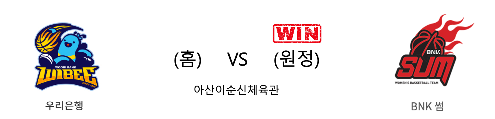

####  우리은행(홈) VS BNK썸(원정) 

<table class="tg">
  <tr>
    <th class="tg-rr9t">우리은행</th>
    <th class="tg-rr9t">팀</th>
    <th class="tg-rr9t">BNK썸</th>
  </tr>
  <tr>
    <td class="tg-dcpn">2승 2패</td>
    <td class="tg-rr9t">시즌 상대전적</td>
    <td class="tg-dcpn">2승 2패</td>
  </tr>
  <tr>
    <td class="tg-dcpn">55</td>
    <td class="tg-rr9t">점수</td>
    <td class="tg-dcpn">56</td>
  </tr>
  <tr>
    <td class="tg-dcpn">19/47(40%)</td>
    <td class="tg-rr9t">2점(%)</td>
    <td class="tg-dcpn">18/39(46%)</td>
  </tr>
  <tr>
    <td class="tg-dcpn">2/15(13%)</td>
    <td class="tg-rr9t">3점(%)</td>
    <td class="tg-dcpn">5/18(28%)</td>
  </tr>
  <tr>
    <td class="tg-dcpn">11/11(100%)</td>
    <td class="tg-rr9t">자유투(%)</td>
    <td class="tg-dcpn">5/8(62%)</td>
  </tr>
  <tr>
    <td class="tg-dcpn">30</td>
    <td class="tg-rr9t">리바운드</td>
    <td class="tg-dcpn">33</td>
  </tr>
  <tr>
    <td class="tg-dcpn">17</td>
    <td class="tg-rr9t">어시스트</td>
    <td class="tg-dcpn">14</td>
  </tr>
  <tr>
    <td class="tg-dcpn">9</td>
    <td class="tg-rr9t">스틸</td>
    <td class="tg-dcpn">4</td>
  </tr>
  <tr>
    <td class="tg-dcpn">6</td>
    <td class="tg-rr9t">블록</td>
    <td class="tg-dcpn">11</td>
  </tr>
  <tr>
    <td class="tg-dcpn">14</td>
    <td class="tg-rr9t">턴오버</td>
    <td class="tg-dcpn">13</td>
  </tr>
  <tr>
    <td class="tg-dcpn">그레이(19)</td>
    <td class="tg-rr9t">주요 득점선수</td>
    <td class="tg-dcpn"></td>
  </tr>
</table>

#### 경기 관련 주요 기사         

[BNK의 짜릿한 역전극, 선두 우리은행 잡다](http://sports.khan.co.kr/news/sk_index.html?art_id=202001011902003&sec_id=530301&pt=nv)

[또 우리은행 잡은 BNK 썸, 경자년 첫 경기 이변으로 장식](http://www.sportsseoul.com/news/read/867637)

[BNK, 우리은행에 재역전승하며 중위권 추격](http://sports.chosun.com/news/ntype.htm?id=202001020100009680000385&servicedate=20200101)

[‘단타스 더블 더블’ BNK, 대어 우리은행 잡았다](http://www.mydaily.co.kr/new_yk/html/read.php?newsid=202001011925956929&ext=na)

        
        

#### 리그 순위

<table class="tg">
  <tr>
    <th class="tg-d14o">순위</th>
    <th class="tg-d14o">팀명</th>
    <th class="tg-d14o">경기수</th>
    <th class="tg-d14o">승</th>
    <th class="tg-d14o">패</th>
    <th class="tg-d14o">승차</th>
    <th class="tg-d14o">승률</th>
  </tr>
  
<tr>
    <td class="tg-50j8">1</td>
    <td class="tg-50j8">우리은행</td>
    <td class="tg-50j8">16</td>
    <td class="tg-50j8">12</td>
    <td class="tg-50j8">4</td>
    <td class="tg-50j8">0</td>
    <td class="tg-50j8">0.75</td>
</tr>

<tr>
    <td class="tg-50j8">2</td>
    <td class="tg-50j8">KB스타즈</td>
    <td class="tg-50j8">15</td>
    <td class="tg-50j8">10</td>
    <td class="tg-50j8">5</td>
    <td class="tg-50j8">2</td>
    <td class="tg-50j8">0.667</td>
</tr>

<tr>
    <td class="tg-50j8">3</td>
    <td class="tg-50j8">신한은행</td>
    <td class="tg-50j8">15</td>
    <td class="tg-50j8">7</td>
    <td class="tg-50j8">8</td>
    <td class="tg-50j8">5</td>
    <td class="tg-50j8">0.467</td>
</tr>

<tr>
    <td class="tg-50j8">4</td>
    <td class="tg-50j8">KEB하나</td>
    <td class="tg-50j8">15</td>
    <td class="tg-50j8">6</td>
    <td class="tg-50j8">9</td>
    <td class="tg-50j8">6</td>
    <td class="tg-50j8">0.4</td>
</tr>

<tr>
    <td class="tg-50j8">5</td>
    <td class="tg-50j8">BNK썸</td>
    <td class="tg-50j8">16</td>
    <td class="tg-50j8">6</td>
    <td class="tg-50j8">10</td>
    <td class="tg-50j8">6</td>
    <td class="tg-50j8">0.375</td>
</tr>

<tr>
    <td class="tg-50j8">6</td>
    <td class="tg-50j8">삼성생명</td>
    <td class="tg-50j8">15</td>
    <td class="tg-50j8">5</td>
    <td class="tg-50j8">10</td>
    <td class="tg-50j8">7</td>
    <td class="tg-50j8">0.333</td>
</tr>
</table> 

        
        
#wkbl #국내농구 #여자농구 #농구분석 #토토 #스포츠토토 #경기예측 #농구결과 #20200101 #우리은행 #BNK썸 #우리은행BNK썸 