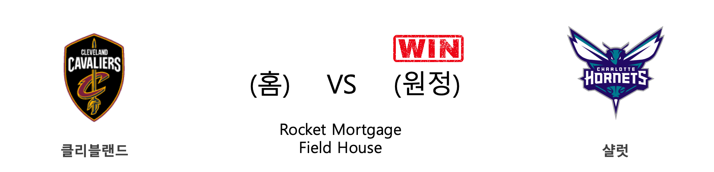
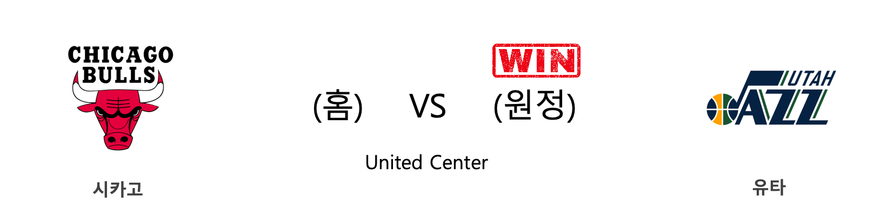
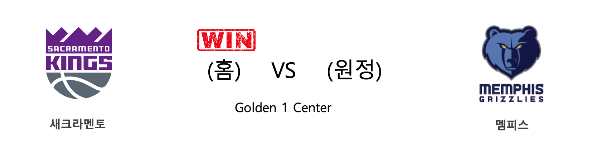
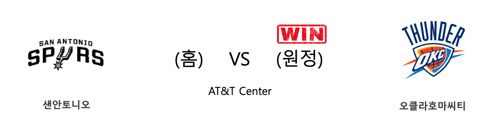
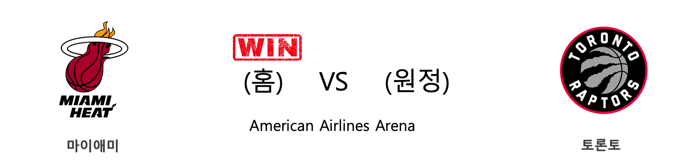

####  클리블랜드(홈) VS 샬럿(원정) 

<table class="tg">
  <tr>
    <th class="tg-rr9t">CLE</th>
    <th class="tg-rr9t">팀</th>
    <th class="tg-rr9t">CHA</th>
  </tr>
  <tr>
    <td class="tg-dcpn">1승 1패</td>
    <td class="tg-rr9t">시즌 상대전적</td>
    <td class="tg-dcpn">1승 1패</td>
  </tr>
  <tr>
    <td class="tg-dcpn">106</td>
    <td class="tg-rr9t">점수</td>
    <td class="tg-dcpn">109</td>
  </tr>
  <tr>
    <td class="tg-dcpn">28/46(61%)</td>
    <td class="tg-rr9t">2점(%)</td>
    <td class="tg-dcpn">22/45(49%)</td>
  </tr>
  <tr>
    <td class="tg-dcpn">13/35(37%)</td>
    <td class="tg-rr9t">3점(%)</td>
    <td class="tg-dcpn">15/38(39%)</td>
  </tr>
  <tr>
    <td class="tg-dcpn">11/14(79%)</td>
    <td class="tg-rr9t">자유투(%)</td>
    <td class="tg-dcpn">20/24(83%)</td>
  </tr>
  <tr>
    <td class="tg-dcpn">42</td>
    <td class="tg-rr9t">리바운드</td>
    <td class="tg-dcpn">39</td>
  </tr>
  <tr>
    <td class="tg-dcpn">26</td>
    <td class="tg-rr9t">어시스트</td>
    <td class="tg-dcpn">25</td>
  </tr>
  <tr>
    <td class="tg-dcpn">6</td>
    <td class="tg-rr9t">스틸</td>
    <td class="tg-dcpn">5</td>
  </tr>
  <tr>
    <td class="tg-dcpn">3</td>
    <td class="tg-rr9t">블록</td>
    <td class="tg-dcpn">0</td>
  </tr>
  <tr>
    <td class="tg-dcpn">14</td>
    <td class="tg-rr9t">턴오버</td>
    <td class="tg-dcpn">11</td>
  </tr>
  <tr>
    <td class="tg-dcpn">KevinLoveF(18) CediOsmanF(17) CollinSextonG(21)</td>
    <td class="tg-rr9t">주요 득점선수</td>
    <td class="tg-dcpn">Devonte'Graha(16) TerryRozierG(30) DwayneBacon(15)</td>
  </tr>
</table>

#### 경기 관련 주요 기사         

[[오늘의 NBA] (1/3) 마이클 포터 주니어, 덴버의 기다림에 응답하다!](http://sports.news.naver.com/basketball/news/read.nhn?oid=486&aid=0000001185)

[[오늘의 NBA] (11/11) 토론토, 디펜딩 챔피언의 저력](http://sports.news.naver.com/basketball/news/read.nhn?oid=486&aid=0000001134)

[[오늘의 NBA] (12/16) 스펜서 딘위디, 브루클린 상승세를 이끈다!](http://sports.news.naver.com/basketball/news/read.nhn?oid=486&aid=0000001168)

[[오늘의 NBA] (12/12) 제임스 하든 선생님의 심폐소생술](http://sports.news.naver.com/basketball/news/read.nhn?oid=486&aid=0000001164)

[[오늘의 NBA] (12/21) 크리스탑스 포르징기스, 댈러스의 새로운 버팀목](http://sports.news.naver.com/basketball/news/read.nhn?oid=486&aid=0000001173)

        
        

####  미네소타(홈) VS 골든스테이트(원정) 

<table class="tg">
  <tr>
    <th class="tg-rr9t">MIN</th>
    <th class="tg-rr9t">팀</th>
    <th class="tg-rr9t">GSW</th>
  </tr>
  <tr>
    <td class="tg-dcpn">2승 1패</td>
    <td class="tg-rr9t">시즌 상대전적</td>
    <td class="tg-dcpn">1승 2패</td>
  </tr>
  <tr>
    <td class="tg-dcpn">99</td>
    <td class="tg-rr9t">점수</td>
    <td class="tg-dcpn">84</td>
  </tr>
  <tr>
    <td class="tg-dcpn">25/52(48%)</td>
    <td class="tg-rr9t">2점(%)</td>
    <td class="tg-dcpn">30/57(53%)</td>
  </tr>
  <tr>
    <td class="tg-dcpn">13/43(30%)</td>
    <td class="tg-rr9t">3점(%)</td>
    <td class="tg-dcpn">3/20(15%)</td>
  </tr>
  <tr>
    <td class="tg-dcpn">10/17(59%)</td>
    <td class="tg-rr9t">자유투(%)</td>
    <td class="tg-dcpn">15/21(71%)</td>
  </tr>
  <tr>
    <td class="tg-dcpn">52</td>
    <td class="tg-rr9t">리바운드</td>
    <td class="tg-dcpn">43</td>
  </tr>
  <tr>
    <td class="tg-dcpn">22</td>
    <td class="tg-rr9t">어시스트</td>
    <td class="tg-dcpn">20</td>
  </tr>
  <tr>
    <td class="tg-dcpn">7</td>
    <td class="tg-rr9t">스틸</td>
    <td class="tg-dcpn">9</td>
  </tr>
  <tr>
    <td class="tg-dcpn">7</td>
    <td class="tg-rr9t">블록</td>
    <td class="tg-dcpn">1</td>
  </tr>
  <tr>
    <td class="tg-dcpn">12</td>
    <td class="tg-rr9t">턴오버</td>
    <td class="tg-dcpn">16</td>
  </tr>
  <tr>
    <td class="tg-dcpn">ShabazzNapier(20) RobertCovingt(20)</td>
    <td class="tg-rr9t">주요 득점선수</td>
    <td class="tg-dcpn">GlennRobinson(16)</td>
  </tr>
</table>

#### 경기 관련 주요 기사         

[[오늘의 NBA] (12/29) 마이애미, 연장전 승부 전문가](http://sports.news.naver.com/basketball/news/read.nhn?oid=486&aid=0000001180)

[[오늘의 NBA] (12/24) 자말 머레이와 데빈 부커의 뒤틀린 운명](http://sports.news.naver.com/basketball/news/read.nhn?oid=486&aid=0000001176)

[[오늘의 NBA] (12/21) 크리스탑스 포르징기스, 댈러스의 새로운 버팀목](http://sports.news.naver.com/basketball/news/read.nhn?oid=486&aid=0000001173)

[[오늘의 NBA] (12/19) 오클라호마시티, 역전의 달인!](http://sports.news.naver.com/basketball/news/read.nhn?oid=486&aid=0000001171)

[[오늘의 NBA] (1/3) 마이클 포터 주니어, 덴버의 기다림에 응답하다!](http://sports.news.naver.com/basketball/news/read.nhn?oid=486&aid=0000001185)

        
        

####  LA클리퍼스(홈) VS 디트로이트(원정) 

<table class="tg">
  <tr>
    <th class="tg-rr9t">LAC</th>
    <th class="tg-rr9t">팀</th>
    <th class="tg-rr9t">DET</th>
  </tr>
  <tr>
    <td class="tg-dcpn">1승 0패</td>
    <td class="tg-rr9t">시즌 상대전적</td>
    <td class="tg-dcpn">0승 1패</td>
  </tr>
  <tr>
    <td class="tg-dcpn">126</td>
    <td class="tg-rr9t">점수</td>
    <td class="tg-dcpn">112</td>
  </tr>
  <tr>
    <td class="tg-dcpn">39/64(61%)</td>
    <td class="tg-rr9t">2점(%)</td>
    <td class="tg-dcpn">33/61(54%)</td>
  </tr>
  <tr>
    <td class="tg-dcpn">11/28(39%)</td>
    <td class="tg-rr9t">3점(%)</td>
    <td class="tg-dcpn">7/33(21%)</td>
  </tr>
  <tr>
    <td class="tg-dcpn">15/21(71%)</td>
    <td class="tg-rr9t">자유투(%)</td>
    <td class="tg-dcpn">25/35(71%)</td>
  </tr>
  <tr>
    <td class="tg-dcpn">51</td>
    <td class="tg-rr9t">리바운드</td>
    <td class="tg-dcpn">45</td>
  </tr>
  <tr>
    <td class="tg-dcpn">29</td>
    <td class="tg-rr9t">어시스트</td>
    <td class="tg-dcpn">20</td>
  </tr>
  <tr>
    <td class="tg-dcpn">6</td>
    <td class="tg-rr9t">스틸</td>
    <td class="tg-dcpn">10</td>
  </tr>
  <tr>
    <td class="tg-dcpn">11</td>
    <td class="tg-rr9t">블록</td>
    <td class="tg-dcpn">1</td>
  </tr>
  <tr>
    <td class="tg-dcpn">15</td>
    <td class="tg-rr9t">턴오버</td>
    <td class="tg-dcpn">11</td>
  </tr>
  <tr>
    <td class="tg-dcpn">LouWilliams(22) KawhiLeonardF(18) MontrezlHarre(23)</td>
    <td class="tg-rr9t">주요 득점선수</td>
    <td class="tg-dcpn">BruceBrown(15)</td>
  </tr>
</table>

#### 경기 관련 주요 기사         

[[오늘의 NBA] (12/24) 자말 머레이와 데빈 부커의 뒤틀린 운명](http://sports.news.naver.com/basketball/news/read.nhn?oid=486&aid=0000001176)

[[오늘의 NBA] (12/31) 불의 군주 워싱턴](http://sports.news.naver.com/basketball/news/read.nhn?oid=486&aid=0000001182)

[[오늘의 NBA] (1/3) 마이클 포터 주니어, 덴버의 기다림에 응답하다!](http://sports.news.naver.com/basketball/news/read.nhn?oid=486&aid=0000001185)

[[오늘의 NBA] (12/7) 르브론 제임스, 멜로(carmelo) 드라마의 주인공](http://sports.news.naver.com/basketball/news/read.nhn?oid=486&aid=0000001159)

[[오늘의 NBA] (12/29) 마이애미, 연장전 승부 전문가](http://sports.news.naver.com/basketball/news/read.nhn?oid=486&aid=0000001180)

        
        

####  시카고(홈) VS 유타(원정) 

<table class="tg">
  <tr>
    <th class="tg-rr9t">CHI</th>
    <th class="tg-rr9t">팀</th>
    <th class="tg-rr9t">UTA</th>
  </tr>
  <tr>
    <td class="tg-dcpn">0승 1패</td>
    <td class="tg-rr9t">시즌 상대전적</td>
    <td class="tg-dcpn">1승 0패</td>
  </tr>
  <tr>
    <td class="tg-dcpn">98</td>
    <td class="tg-rr9t">점수</td>
    <td class="tg-dcpn">102</td>
  </tr>
  <tr>
    <td class="tg-dcpn">26/58(45%)</td>
    <td class="tg-rr9t">2점(%)</td>
    <td class="tg-dcpn">26/46(57%)</td>
  </tr>
  <tr>
    <td class="tg-dcpn">11/36(31%)</td>
    <td class="tg-rr9t">3점(%)</td>
    <td class="tg-dcpn">11/30(37%)</td>
  </tr>
  <tr>
    <td class="tg-dcpn">13/17(76%)</td>
    <td class="tg-rr9t">자유투(%)</td>
    <td class="tg-dcpn">17/22(77%)</td>
  </tr>
  <tr>
    <td class="tg-dcpn">45</td>
    <td class="tg-rr9t">리바운드</td>
    <td class="tg-dcpn">42</td>
  </tr>
  <tr>
    <td class="tg-dcpn">22</td>
    <td class="tg-rr9t">어시스트</td>
    <td class="tg-dcpn">24</td>
  </tr>
  <tr>
    <td class="tg-dcpn">8</td>
    <td class="tg-rr9t">스틸</td>
    <td class="tg-dcpn">5</td>
  </tr>
  <tr>
    <td class="tg-dcpn">5</td>
    <td class="tg-rr9t">블록</td>
    <td class="tg-dcpn">6</td>
  </tr>
  <tr>
    <td class="tg-dcpn">10</td>
    <td class="tg-rr9t">턴오버</td>
    <td class="tg-dcpn">17</td>
  </tr>
  <tr>
    <td class="tg-dcpn">ZachLaVineG(26) LauriMarkkane(18) WendellCarter(18)</td>
    <td class="tg-rr9t">주요 득점선수</td>
    <td class="tg-dcpn">BojanBogdanov(19) RudyGobertC(17) DonovanMitche(17)</td>
  </tr>
</table>

#### 경기 관련 주요 기사         

[[오늘의 NBA] (12/5) 밀워키, 시스템 농구 정점에 도달하다](http://sports.news.naver.com/basketball/news/read.nhn?oid=486&aid=0000001157)

[[오늘의 NBA] (12/14) 레이커스, 마이애미 홈 코트를 점령하다](http://sports.news.naver.com/basketball/news/read.nhn?oid=486&aid=0000001166)

[[오늘의 NBA] (12/21) 크리스탑스 포르징기스, 댈러스의 새로운 버팀목](http://sports.news.naver.com/basketball/news/read.nhn?oid=486&aid=0000001173)

[[오늘의 NBA] (12/10) 데릭 로즈, 모터 시티의 해결사](http://sports.news.naver.com/basketball/news/read.nhn?oid=486&aid=0000001162)

[[오늘의 NBA] (1/3) 마이클 포터 주니어, 덴버의 기다림에 응답하다!](http://sports.news.naver.com/basketball/news/read.nhn?oid=486&aid=0000001185)

        
        

####  댈러스(홈) VS 브루클린(원정) 

<table class="tg">
  <tr>
    <th class="tg-rr9t">DAL</th>
    <th class="tg-rr9t">팀</th>
    <th class="tg-rr9t">BKN</th>
  </tr>
  <tr>
    <td class="tg-dcpn">1승 0패</td>
    <td class="tg-rr9t">시즌 상대전적</td>
    <td class="tg-dcpn">0승 1패</td>
  </tr>
  <tr>
    <td class="tg-dcpn">123</td>
    <td class="tg-rr9t">점수</td>
    <td class="tg-dcpn">111</td>
  </tr>
  <tr>
    <td class="tg-dcpn">27/51(53%)</td>
    <td class="tg-rr9t">2점(%)</td>
    <td class="tg-dcpn">30/54(56%)</td>
  </tr>
  <tr>
    <td class="tg-dcpn">18/39(46%)</td>
    <td class="tg-rr9t">3점(%)</td>
    <td class="tg-dcpn">12/37(32%)</td>
  </tr>
  <tr>
    <td class="tg-dcpn">15/17(88%)</td>
    <td class="tg-rr9t">자유투(%)</td>
    <td class="tg-dcpn">15/17(88%)</td>
  </tr>
  <tr>
    <td class="tg-dcpn">46</td>
    <td class="tg-rr9t">리바운드</td>
    <td class="tg-dcpn">44</td>
  </tr>
  <tr>
    <td class="tg-dcpn">22</td>
    <td class="tg-rr9t">어시스트</td>
    <td class="tg-dcpn">29</td>
  </tr>
  <tr>
    <td class="tg-dcpn">4</td>
    <td class="tg-rr9t">스틸</td>
    <td class="tg-dcpn">5</td>
  </tr>
  <tr>
    <td class="tg-dcpn">8</td>
    <td class="tg-rr9t">블록</td>
    <td class="tg-dcpn">1</td>
  </tr>
  <tr>
    <td class="tg-dcpn">13</td>
    <td class="tg-rr9t">턴오버</td>
    <td class="tg-dcpn">11</td>
  </tr>
  <tr>
    <td class="tg-dcpn">SethCurry(25) LukaDoncicG(31) MaxiKleber(18)</td>
    <td class="tg-rr9t">주요 득점선수</td>
    <td class="tg-dcpn">SpencerDinwid(19)</td>
  </tr>
</table>

#### 경기 관련 주요 기사         

[[오늘의 NBA] (11/19) 댈러스의 루카 복음 낭송](http://sports.news.naver.com/basketball/news/read.nhn?oid=486&aid=0000001142)

[[오늘의 NBA] (3/18) MIL vs PHI, 거인들의 전투](http://sports.news.naver.com/basketball/news/read.nhn?oid=486&aid=0000000989)

[[오늘의 NBA] (12/27) 댈러스, 루카 돈치치 부상 복귀전 승리!](http://sports.news.naver.com/basketball/news/read.nhn?oid=486&aid=0000001178)

[[오늘의 NBA] (12/2) 토론토, 두 마리 토끼를 노린다!](http://sports.news.naver.com/basketball/news/read.nhn?oid=486&aid=0000001154)

[[오늘의 NBA] (1/1) 휴스턴의 불장난](http://sports.news.naver.com/basketball/news/read.nhn?oid=486&aid=0000001183)

        
        

####  새크라멘토(홈) VS 멤피스(원정) 

<table class="tg">
  <tr>
    <th class="tg-rr9t">SAC</th>
    <th class="tg-rr9t">팀</th>
    <th class="tg-rr9t">MEM</th>
  </tr>
  <tr>
    <td class="tg-dcpn">1승 1패</td>
    <td class="tg-rr9t">시즌 상대전적</td>
    <td class="tg-dcpn">1승 1패</td>
  </tr>
  <tr>
    <td class="tg-dcpn">128</td>
    <td class="tg-rr9t">점수</td>
    <td class="tg-dcpn">123</td>
  </tr>
  <tr>
    <td class="tg-dcpn">30/56(54%)</td>
    <td class="tg-rr9t">2점(%)</td>
    <td class="tg-dcpn">32/59(54%)</td>
  </tr>
  <tr>
    <td class="tg-dcpn">14/34(41%)</td>
    <td class="tg-rr9t">3점(%)</td>
    <td class="tg-dcpn">13/34(38%)</td>
  </tr>
  <tr>
    <td class="tg-dcpn">26/31(84%)</td>
    <td class="tg-rr9t">자유투(%)</td>
    <td class="tg-dcpn">20/21(95%)</td>
  </tr>
  <tr>
    <td class="tg-dcpn">41</td>
    <td class="tg-rr9t">리바운드</td>
    <td class="tg-dcpn">42</td>
  </tr>
  <tr>
    <td class="tg-dcpn">26</td>
    <td class="tg-rr9t">어시스트</td>
    <td class="tg-dcpn">31</td>
  </tr>
  <tr>
    <td class="tg-dcpn">9</td>
    <td class="tg-rr9t">스틸</td>
    <td class="tg-dcpn">4</td>
  </tr>
  <tr>
    <td class="tg-dcpn">8</td>
    <td class="tg-rr9t">블록</td>
    <td class="tg-dcpn">0</td>
  </tr>
  <tr>
    <td class="tg-dcpn">12</td>
    <td class="tg-rr9t">턴오버</td>
    <td class="tg-dcpn">17</td>
  </tr>
  <tr>
    <td class="tg-dcpn">BogdanBogdano(16) HarrisonBarne(17) RichaunHolmes(18) BuddyHieldG(26) De'AaronFoxG(27)</td>
    <td class="tg-rr9t">주요 득점선수</td>
    <td class="tg-dcpn">JaMorantG(23) DillonBrooksG(15) De'AnthonyMel(16) JaeCrowderF(19) JonasValanciu(18) JarenJacksonJ(18)</td>
  </tr>
</table>

#### 경기 관련 주요 기사         

[[오늘의 NBA] (12/21) 크리스탑스 포르징기스, 댈러스의 새로운 버팀목](http://sports.news.naver.com/basketball/news/read.nhn?oid=486&aid=0000001173)

[[오늘의 NBA] (12/22) 휴스턴 원투펀치의 피닉스 홈코트 침공](http://sports.news.naver.com/basketball/news/read.nhn?oid=486&aid=0000001174)

[[오늘의 NBA] (11/30) 인디애나, 동부컨퍼런스의 복병](http://sports.news.naver.com/basketball/news/read.nhn?oid=486&aid=0000001152)

[[오늘의 NBA] (12/29) 마이애미, 연장전 승부 전문가](http://sports.news.naver.com/basketball/news/read.nhn?oid=486&aid=0000001180)

[[오늘의 NBA] (1/2) 미첼 로빈슨, MSG 코트의 새로운 희망](http://sports.news.naver.com/basketball/news/read.nhn?oid=486&aid=0000001184)

        
        

####  샌안토니오(홈) VS 오클라호마씨티(원정) 

<table class="tg">
  <tr>
    <th class="tg-rr9t">SAS</th>
    <th class="tg-rr9t">팀</th>
    <th class="tg-rr9t">OKC</th>
  </tr>
  <tr>
    <td class="tg-dcpn">1승 1패</td>
    <td class="tg-rr9t">시즌 상대전적</td>
    <td class="tg-dcpn">1승 1패</td>
  </tr>
  <tr>
    <td class="tg-dcpn">103</td>
    <td class="tg-rr9t">점수</td>
    <td class="tg-dcpn">109</td>
  </tr>
  <tr>
    <td class="tg-dcpn">27/61(44%)</td>
    <td class="tg-rr9t">2점(%)</td>
    <td class="tg-dcpn">34/64(53%)</td>
  </tr>
  <tr>
    <td class="tg-dcpn">13/31(42%)</td>
    <td class="tg-rr9t">3점(%)</td>
    <td class="tg-dcpn">9/25(36%)</td>
  </tr>
  <tr>
    <td class="tg-dcpn">10/12(83%)</td>
    <td class="tg-rr9t">자유투(%)</td>
    <td class="tg-dcpn">14/20(70%)</td>
  </tr>
  <tr>
    <td class="tg-dcpn">45</td>
    <td class="tg-rr9t">리바운드</td>
    <td class="tg-dcpn">43</td>
  </tr>
  <tr>
    <td class="tg-dcpn">22</td>
    <td class="tg-rr9t">어시스트</td>
    <td class="tg-dcpn">19</td>
  </tr>
  <tr>
    <td class="tg-dcpn">1</td>
    <td class="tg-rr9t">스틸</td>
    <td class="tg-dcpn">7</td>
  </tr>
  <tr>
    <td class="tg-dcpn">8</td>
    <td class="tg-rr9t">블록</td>
    <td class="tg-dcpn">6</td>
  </tr>
  <tr>
    <td class="tg-dcpn">8</td>
    <td class="tg-rr9t">턴오버</td>
    <td class="tg-dcpn">4</td>
  </tr>
  <tr>
    <td class="tg-dcpn">LonnieWalkerI(16) LaMarcusAldri(22) DeMarDeRozanF(30)</td>
    <td class="tg-rr9t">주요 득점선수</td>
    <td class="tg-dcpn">ShaiGilgeous-(25) DennisSchrode(19) ChrisPaulG(16)</td>
  </tr>
</table>

#### 경기 관련 주요 기사         

[[오늘의 NBA] (12/10) 데릭 로즈, 모터 시티의 해결사](http://sports.news.naver.com/basketball/news/read.nhn?oid=486&aid=0000001162)

[[오늘의 NBA] (11/23) 카와이 레너드, 승부를 결정짓는 사나이](http://sports.news.naver.com/basketball/news/read.nhn?oid=486&aid=0000001146)

[[오늘의 NBA] (12/7) 르브론 제임스, 멜로(carmelo) 드라마의 주인공](http://sports.news.naver.com/basketball/news/read.nhn?oid=486&aid=0000001159)

[[오늘의 NBA] (12/17) 댈러스, 밀워키 시스템을 붕괴시키다](http://sports.news.naver.com/basketball/news/read.nhn?oid=486&aid=0000001169)

[[오늘의 NBA] (1/1) 휴스턴의 불장난](http://sports.news.naver.com/basketball/news/read.nhn?oid=486&aid=0000001183)

        
        

####  마이애미(홈) VS 토론토(원정) 

<table class="tg">
  <tr>
    <th class="tg-rr9t">MIA</th>
    <th class="tg-rr9t">팀</th>
    <th class="tg-rr9t">TOR</th>
  </tr>
  <tr>
    <td class="tg-dcpn">2승 0패</td>
    <td class="tg-rr9t">시즌 상대전적</td>
    <td class="tg-dcpn">0승 2패</td>
  </tr>
  <tr>
    <td class="tg-dcpn">84</td>
    <td class="tg-rr9t">점수</td>
    <td class="tg-dcpn">76</td>
  </tr>
  <tr>
    <td class="tg-dcpn">21/44(48%)</td>
    <td class="tg-rr9t">2점(%)</td>
    <td class="tg-dcpn">22/47(47%)</td>
  </tr>
  <tr>
    <td class="tg-dcpn">12/37(32%)</td>
    <td class="tg-rr9t">3점(%)</td>
    <td class="tg-dcpn">6/42(14%)</td>
  </tr>
  <tr>
    <td class="tg-dcpn">6/11(55%)</td>
    <td class="tg-rr9t">자유투(%)</td>
    <td class="tg-dcpn">14/17(82%)</td>
  </tr>
  <tr>
    <td class="tg-dcpn">50</td>
    <td class="tg-rr9t">리바운드</td>
    <td class="tg-dcpn">48</td>
  </tr>
  <tr>
    <td class="tg-dcpn">23</td>
    <td class="tg-rr9t">어시스트</td>
    <td class="tg-dcpn">20</td>
  </tr>
  <tr>
    <td class="tg-dcpn">6</td>
    <td class="tg-rr9t">스틸</td>
    <td class="tg-dcpn">5</td>
  </tr>
  <tr>
    <td class="tg-dcpn">4</td>
    <td class="tg-rr9t">블록</td>
    <td class="tg-dcpn">6</td>
  </tr>
  <tr>
    <td class="tg-dcpn">14</td>
    <td class="tg-rr9t">턴오버</td>
    <td class="tg-dcpn">10</td>
  </tr>
  <tr>
    <td class="tg-dcpn">BamAdebayoF(15)</td>
    <td class="tg-rr9t">주요 득점선수</td>
    <td class="tg-dcpn">KyleLowryG(15) SergeIbakaC(19)</td>
  </tr>
</table>

#### 경기 관련 주요 기사         

[[오늘의 NBA] (12/23) 토론토, 포기할 줄 모르는 북방의 투사](http://sports.news.naver.com/basketball/news/read.nhn?oid=486&aid=0000001175)

[[오늘의 NBA] (12/30) LAL 르브론 제임스, 9,000어시스트 달성](http://sports.news.naver.com/basketball/news/read.nhn?oid=486&aid=0000001181)

[[오늘의 NBA] (12/29) 마이애미, 연장전 승부 전문가](http://sports.news.naver.com/basketball/news/read.nhn?oid=486&aid=0000001180)

[[오늘의 NBA] (1/1) 휴스턴의 불장난](http://sports.news.naver.com/basketball/news/read.nhn?oid=486&aid=0000001183)

[[오늘의 NBA] (12/21) 크리스탑스 포르징기스, 댈러스의 새로운 버팀목](http://sports.news.naver.com/basketball/news/read.nhn?oid=486&aid=0000001173)

        
        

####  인디애나(홈) VS 덴버(원정) 

<table class="tg">
  <tr>
    <th class="tg-rr9t">IND</th>
    <th class="tg-rr9t">팀</th>
    <th class="tg-rr9t">DEN</th>
  </tr>
  <tr>
    <td class="tg-dcpn">0승 1패</td>
    <td class="tg-rr9t">시즌 상대전적</td>
    <td class="tg-dcpn">1승 0패</td>
  </tr>
  <tr>
    <td class="tg-dcpn">116</td>
    <td class="tg-rr9t">점수</td>
    <td class="tg-dcpn">124</td>
  </tr>
  <tr>
    <td class="tg-dcpn">31/56(55%)</td>
    <td class="tg-rr9t">2점(%)</td>
    <td class="tg-dcpn">38/60(63%)</td>
  </tr>
  <tr>
    <td class="tg-dcpn">12/26(46%)</td>
    <td class="tg-rr9t">3점(%)</td>
    <td class="tg-dcpn">8/27(30%)</td>
  </tr>
  <tr>
    <td class="tg-dcpn">18/25(72%)</td>
    <td class="tg-rr9t">자유투(%)</td>
    <td class="tg-dcpn">24/27(89%)</td>
  </tr>
  <tr>
    <td class="tg-dcpn">34</td>
    <td class="tg-rr9t">리바운드</td>
    <td class="tg-dcpn">47</td>
  </tr>
  <tr>
    <td class="tg-dcpn">32</td>
    <td class="tg-rr9t">어시스트</td>
    <td class="tg-dcpn">27</td>
  </tr>
  <tr>
    <td class="tg-dcpn">7</td>
    <td class="tg-rr9t">스틸</td>
    <td class="tg-dcpn">7</td>
  </tr>
  <tr>
    <td class="tg-dcpn">3</td>
    <td class="tg-rr9t">블록</td>
    <td class="tg-dcpn">1</td>
  </tr>
  <tr>
    <td class="tg-dcpn">9</td>
    <td class="tg-rr9t">턴오버</td>
    <td class="tg-dcpn">10</td>
  </tr>
  <tr>
    <td class="tg-dcpn">T.J.WarrenF(20) DomantasSabon(18) MylesTurnerC(21) JeremyLambG(30)</td>
    <td class="tg-rr9t">주요 득점선수</td>
    <td class="tg-dcpn">WillBartonG(16) NikolaJokicC(22) MichaelPorter(25) JamalMurrayG(22)</td>
  </tr>
</table>

#### 경기 관련 주요 기사         

[[오늘의 NBA] (1/1) 휴스턴의 불장난](http://sports.news.naver.com/basketball/news/read.nhn?oid=486&aid=0000001183)

[[오늘의 NBA] (1/3) 마이클 포터 주니어, 덴버의 기다림에 응답하다!](http://sports.news.naver.com/basketball/news/read.nhn?oid=486&aid=0000001185)

[[오늘의 NBA] (12/24) 자말 머레이와 데빈 부커의 뒤틀린 운명](http://sports.news.naver.com/basketball/news/read.nhn?oid=486&aid=0000001176)

[[오늘의 NBA] (12/23) 토론토, 포기할 줄 모르는 북방의 투사](http://sports.news.naver.com/basketball/news/read.nhn?oid=486&aid=0000001175)

[[오늘의 NBA] (12/16) 스펜서 딘위디, 브루클린 상승세를 이끈다!](http://sports.news.naver.com/basketball/news/read.nhn?oid=486&aid=0000001168)

        
        

#### 리그 (Eastern) 순위
    

<table class="tg">
  <tr>
    <th class="tg-d14o">순위</th>
    <th class="tg-d14o">팀명</th>
    <th class="tg-d14o">경기수</th>
    <th class="tg-d14o">승</th>
    <th class="tg-d14o">패</th>
    <th class="tg-d14o">승차</th>
    <th class="tg-d14o">승률</th>
  </tr>
  
<tr>
    <td class="tg-50j8">1</td>
    <td class="tg-50j8">MIL</td>
    <td class="tg-50j8">35</td>
    <td class="tg-50j8">30</td>
    <td class="tg-50j8">5</td>
    <td class="tg-50j8">0</td>
    <td class="tg-50j8">0.857</td>
</tr>

<tr>
    <td class="tg-50j8">2</td>
    <td class="tg-50j8">MIA</td>
    <td class="tg-50j8">33</td>
    <td class="tg-50j8">25</td>
    <td class="tg-50j8">8</td>
    <td class="tg-50j8">5</td>
    <td class="tg-50j8">0.758</td>
</tr>

<tr>
    <td class="tg-50j8">3</td>
    <td class="tg-50j8">BOS</td>
    <td class="tg-50j8">30</td>
    <td class="tg-50j8">23</td>
    <td class="tg-50j8">7</td>
    <td class="tg-50j8">7</td>
    <td class="tg-50j8">0.767</td>
</tr>

<tr>
    <td class="tg-50j8">4</td>
    <td class="tg-50j8">TOR</td>
    <td class="tg-50j8">35</td>
    <td class="tg-50j8">23</td>
    <td class="tg-50j8">12</td>
    <td class="tg-50j8">7</td>
    <td class="tg-50j8">0.657</td>
</tr>

<tr>
    <td class="tg-50j8">5</td>
    <td class="tg-50j8">PHI</td>
    <td class="tg-50j8">35</td>
    <td class="tg-50j8">22</td>
    <td class="tg-50j8">13</td>
    <td class="tg-50j8">8</td>
    <td class="tg-50j8">0.629</td>
</tr>

<tr>
    <td class="tg-50j8">5</td>
    <td class="tg-50j8">IND</td>
    <td class="tg-50j8">35</td>
    <td class="tg-50j8">22</td>
    <td class="tg-50j8">13</td>
    <td class="tg-50j8">8</td>
    <td class="tg-50j8">0.629</td>
</tr>

<tr>
    <td class="tg-50j8">7</td>
    <td class="tg-50j8">BKN</td>
    <td class="tg-50j8">32</td>
    <td class="tg-50j8">16</td>
    <td class="tg-50j8">16</td>
    <td class="tg-50j8">14</td>
    <td class="tg-50j8">0.5</td>
</tr>

<tr>
    <td class="tg-50j8">8</td>
    <td class="tg-50j8">ORL</td>
    <td class="tg-50j8">33</td>
    <td class="tg-50j8">15</td>
    <td class="tg-50j8">18</td>
    <td class="tg-50j8">15</td>
    <td class="tg-50j8">0.455</td>
</tr>

<tr>
    <td class="tg-50j8">9</td>
    <td class="tg-50j8">CHA</td>
    <td class="tg-50j8">37</td>
    <td class="tg-50j8">14</td>
    <td class="tg-50j8">23</td>
    <td class="tg-50j8">16</td>
    <td class="tg-50j8">0.378</td>
</tr>

<tr>
    <td class="tg-50j8">10</td>
    <td class="tg-50j8">CHI</td>
    <td class="tg-50j8">34</td>
    <td class="tg-50j8">13</td>
    <td class="tg-50j8">21</td>
    <td class="tg-50j8">17</td>
    <td class="tg-50j8">0.382</td>
</tr>

<tr>
    <td class="tg-50j8">11</td>
    <td class="tg-50j8">DET</td>
    <td class="tg-50j8">33</td>
    <td class="tg-50j8">12</td>
    <td class="tg-50j8">21</td>
    <td class="tg-50j8">18</td>
    <td class="tg-50j8">0.364</td>
</tr>

<tr>
    <td class="tg-50j8">12</td>
    <td class="tg-50j8">NYK</td>
    <td class="tg-50j8">34</td>
    <td class="tg-50j8">10</td>
    <td class="tg-50j8">24</td>
    <td class="tg-50j8">20</td>
    <td class="tg-50j8">0.294</td>
</tr>

<tr>
    <td class="tg-50j8">13</td>
    <td class="tg-50j8">WAS</td>
    <td class="tg-50j8">32</td>
    <td class="tg-50j8">9</td>
    <td class="tg-50j8">23</td>
    <td class="tg-50j8">21</td>
    <td class="tg-50j8">0.281</td>
</tr>

<tr>
    <td class="tg-50j8">14</td>
    <td class="tg-50j8">CLE</td>
    <td class="tg-50j8">33</td>
    <td class="tg-50j8">9</td>
    <td class="tg-50j8">24</td>
    <td class="tg-50j8">21</td>
    <td class="tg-50j8">0.273</td>
</tr>

<tr>
    <td class="tg-50j8">15</td>
    <td class="tg-50j8">ATL</td>
    <td class="tg-50j8">33</td>
    <td class="tg-50j8">6</td>
    <td class="tg-50j8">27</td>
    <td class="tg-50j8">24</td>
    <td class="tg-50j8">0.182</td>
</tr>
</table> 
#### 리그 (Western) 순위
    

<table class="tg">
  <tr>
    <th class="tg-d14o">순위</th>
    <th class="tg-d14o">팀명</th>
    <th class="tg-d14o">경기수</th>
    <th class="tg-d14o">승</th>
    <th class="tg-d14o">패</th>
    <th class="tg-d14o">승차</th>
    <th class="tg-d14o">승률</th>
  </tr>
  
<tr>
    <td class="tg-50j8">1</td>
    <td class="tg-50j8">LAL</td>
    <td class="tg-50j8">34</td>
    <td class="tg-50j8">27</td>
    <td class="tg-50j8">7</td>
    <td class="tg-50j8">3</td>
    <td class="tg-50j8">0.794</td>
</tr>

<tr>
    <td class="tg-50j8">2</td>
    <td class="tg-50j8">LAC</td>
    <td class="tg-50j8">36</td>
    <td class="tg-50j8">25</td>
    <td class="tg-50j8">11</td>
    <td class="tg-50j8">5</td>
    <td class="tg-50j8">0.694</td>
</tr>

<tr>
    <td class="tg-50j8">3</td>
    <td class="tg-50j8">DEN</td>
    <td class="tg-50j8">33</td>
    <td class="tg-50j8">23</td>
    <td class="tg-50j8">10</td>
    <td class="tg-50j8">7</td>
    <td class="tg-50j8">0.697</td>
</tr>

<tr>
    <td class="tg-50j8">4</td>
    <td class="tg-50j8">HOU</td>
    <td class="tg-50j8">34</td>
    <td class="tg-50j8">23</td>
    <td class="tg-50j8">11</td>
    <td class="tg-50j8">7</td>
    <td class="tg-50j8">0.676</td>
</tr>

<tr>
    <td class="tg-50j8">5</td>
    <td class="tg-50j8">DAL</td>
    <td class="tg-50j8">33</td>
    <td class="tg-50j8">21</td>
    <td class="tg-50j8">12</td>
    <td class="tg-50j8">9</td>
    <td class="tg-50j8">0.636</td>
</tr>

<tr>
    <td class="tg-50j8">5</td>
    <td class="tg-50j8">UTA</td>
    <td class="tg-50j8">33</td>
    <td class="tg-50j8">21</td>
    <td class="tg-50j8">12</td>
    <td class="tg-50j8">9</td>
    <td class="tg-50j8">0.636</td>
</tr>

<tr>
    <td class="tg-50j8">7</td>
    <td class="tg-50j8">OKC</td>
    <td class="tg-50j8">34</td>
    <td class="tg-50j8">19</td>
    <td class="tg-50j8">15</td>
    <td class="tg-50j8">11</td>
    <td class="tg-50j8">0.559</td>
</tr>

<tr>
    <td class="tg-50j8">8</td>
    <td class="tg-50j8">SAS</td>
    <td class="tg-50j8">32</td>
    <td class="tg-50j8">14</td>
    <td class="tg-50j8">18</td>
    <td class="tg-50j8">16</td>
    <td class="tg-50j8">0.438</td>
</tr>

<tr>
    <td class="tg-50j8">9</td>
    <td class="tg-50j8">POR</td>
    <td class="tg-50j8">33</td>
    <td class="tg-50j8">14</td>
    <td class="tg-50j8">19</td>
    <td class="tg-50j8">16</td>
    <td class="tg-50j8">0.424</td>
</tr>

<tr>
    <td class="tg-50j8">10</td>
    <td class="tg-50j8">MEM</td>
    <td class="tg-50j8">35</td>
    <td class="tg-50j8">13</td>
    <td class="tg-50j8">22</td>
    <td class="tg-50j8">17</td>
    <td class="tg-50j8">0.371</td>
</tr>

<tr>
    <td class="tg-50j8">10</td>
    <td class="tg-50j8">SAC</td>
    <td class="tg-50j8">35</td>
    <td class="tg-50j8">13</td>
    <td class="tg-50j8">22</td>
    <td class="tg-50j8">17</td>
    <td class="tg-50j8">0.371</td>
</tr>

<tr>
    <td class="tg-50j8">12</td>
    <td class="tg-50j8">MIN</td>
    <td class="tg-50j8">33</td>
    <td class="tg-50j8">12</td>
    <td class="tg-50j8">21</td>
    <td class="tg-50j8">18</td>
    <td class="tg-50j8">0.364</td>
</tr>

<tr>
    <td class="tg-50j8">12</td>
    <td class="tg-50j8">PHX</td>
    <td class="tg-50j8">33</td>
    <td class="tg-50j8">12</td>
    <td class="tg-50j8">21</td>
    <td class="tg-50j8">18</td>
    <td class="tg-50j8">0.364</td>
</tr>

<tr>
    <td class="tg-50j8">14</td>
    <td class="tg-50j8">NOP</td>
    <td class="tg-50j8">34</td>
    <td class="tg-50j8">11</td>
    <td class="tg-50j8">23</td>
    <td class="tg-50j8">19</td>
    <td class="tg-50j8">0.324</td>
</tr>

<tr>
    <td class="tg-50j8">15</td>
    <td class="tg-50j8">GSW</td>
    <td class="tg-50j8">36</td>
    <td class="tg-50j8">9</td>
    <td class="tg-50j8">27</td>
    <td class="tg-50j8">21</td>
    <td class="tg-50j8">0.25</td>
</tr>
</table> 

        
        
#nba #미국농구 #엔비에이 #농구분석 #토토 #스포츠토토 #경기예측 #농구결과 #20200103 #클리블랜드 #샬럿 #미네소타 #골든스테이트 #LA클리퍼스 #디트로이트 #시카고 #유타 #댈러스 #브루클린 #새크라멘토 #멤피스 #샌안토니오 #오클라호마씨티 #마이애미 #토론토 #인디애나 #덴버 #클리블랜드샬럿 #미네소타골든스테이트 #LA클리퍼스디트로이트 #시카고유타 #댈러스브루클린 #새크라멘토멤피스 #샌안토니오오클라호마씨티 #마이애미토론토 #인디애나덴버 