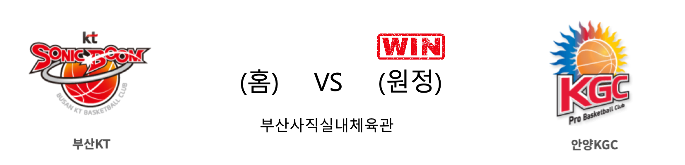

####  서울SK(홈) VS 창원LG(원정) 

<table class="tg">
  <tr>
    <th class="tg-rr9t">서울SK</th>
    <th class="tg-rr9t">팀</th>
    <th class="tg-rr9t">창원LG</th>
  </tr>
  <tr>
    <td class="tg-dcpn">3승 1패</td>
    <td class="tg-rr9t">시즌 상대전적</td>
    <td class="tg-dcpn">1승 3패</td>
  </tr>
  <tr>
    <td class="tg-dcpn">73</td>
    <td class="tg-rr9t">점수</td>
    <td class="tg-dcpn">76</td>
  </tr>
  <tr>
    <td class="tg-dcpn">25/52(48%)</td>
    <td class="tg-rr9t">2점(%)</td>
    <td class="tg-dcpn">18/34(53%)</td>
  </tr>
  <tr>
    <td class="tg-dcpn">3/19(16%)</td>
    <td class="tg-rr9t">3점(%)</td>
    <td class="tg-dcpn">8/21(38%)</td>
  </tr>
  <tr>
    <td class="tg-dcpn">14/19(74%)</td>
    <td class="tg-rr9t">자유투(%)</td>
    <td class="tg-dcpn">16/16(100%)</td>
  </tr>
  <tr>
    <td class="tg-dcpn">35</td>
    <td class="tg-rr9t">리바운드</td>
    <td class="tg-dcpn">30</td>
  </tr>
  <tr>
    <td class="tg-dcpn">0</td>
    <td class="tg-rr9t">어시스트</td>
    <td class="tg-dcpn">0</td>
  </tr>
  <tr>
    <td class="tg-dcpn">9</td>
    <td class="tg-rr9t">스틸</td>
    <td class="tg-dcpn">14</td>
  </tr>
  <tr>
    <td class="tg-dcpn">8</td>
    <td class="tg-rr9t">블록</td>
    <td class="tg-dcpn">9</td>
  </tr>
  <tr>
    <td class="tg-dcpn">14</td>
    <td class="tg-rr9t">턴오버</td>
    <td class="tg-dcpn">12</td>
  </tr>
  <tr>
    <td class="tg-dcpn">자밀 워니(15)</td>
    <td class="tg-rr9t">주요 득점선수</td>
    <td class="tg-dcpn">마이크 해리스(20)</td>
  </tr>
</table>

#### 경기 관련 주요 기사         

['SK VS LG 경기'서 최준용, 강변형과 신경전 펼치다 '쾅!' 충돌](http://www.segye.com/content/html/2020/01/04/20200104504335.html?OutUrl=naver)

[[JB화보] 창원 LG, 76-73으로 서울 SK에 원정 승리](http://sports.news.naver.com/basketball/news/read.nhn?oid=065&aid=0000195048)

[해리스 앞세운 LG, SK에 짜릿한 역전승](http://mksports.co.kr/view/2020/11375/)

[김시래 빠진 LG, 선두 SK 상대로 14점 차 뒤집고 역전승](http://yna.kr/AKR20200104043800007?did=1195m)

        
        

####  부산KT(홈) VS 안양KGC(원정) 

<table class="tg">
  <tr>
    <th class="tg-rr9t">부산KT</th>
    <th class="tg-rr9t">팀</th>
    <th class="tg-rr9t">안양KGC</th>
  </tr>
  <tr>
    <td class="tg-dcpn">2승 2패</td>
    <td class="tg-rr9t">시즌 상대전적</td>
    <td class="tg-dcpn">2승 2패</td>
  </tr>
  <tr>
    <td class="tg-dcpn">76</td>
    <td class="tg-rr9t">점수</td>
    <td class="tg-dcpn">85</td>
  </tr>
  <tr>
    <td class="tg-dcpn">25/44(57%)</td>
    <td class="tg-rr9t">2점(%)</td>
    <td class="tg-dcpn">15/37(41%)</td>
  </tr>
  <tr>
    <td class="tg-dcpn">5/30(17%)</td>
    <td class="tg-rr9t">3점(%)</td>
    <td class="tg-dcpn">13/31(42%)</td>
  </tr>
  <tr>
    <td class="tg-dcpn">11/14(79%)</td>
    <td class="tg-rr9t">자유투(%)</td>
    <td class="tg-dcpn">16/20(80%)</td>
  </tr>
  <tr>
    <td class="tg-dcpn">43</td>
    <td class="tg-rr9t">리바운드</td>
    <td class="tg-dcpn">37</td>
  </tr>
  <tr>
    <td class="tg-dcpn">0</td>
    <td class="tg-rr9t">어시스트</td>
    <td class="tg-dcpn">2</td>
  </tr>
  <tr>
    <td class="tg-dcpn">11</td>
    <td class="tg-rr9t">스틸</td>
    <td class="tg-dcpn">10</td>
  </tr>
  <tr>
    <td class="tg-dcpn">6</td>
    <td class="tg-rr9t">블록</td>
    <td class="tg-dcpn">7</td>
  </tr>
  <tr>
    <td class="tg-dcpn">15</td>
    <td class="tg-rr9t">턴오버</td>
    <td class="tg-dcpn">19</td>
  </tr>
  <tr>
    <td class="tg-dcpn">바이런 멀린스(21) 양홍석(29)</td>
    <td class="tg-rr9t">주요 득점선수</td>
    <td class="tg-dcpn">문성곤(15) 크리스 맥컬러(32)</td>
  </tr>
</table>

#### 경기 관련 주요 기사         

[KT 4일 KGC전 '이마트데이' 지정…마사지기계 등 경품 푸짐](http://www.sportsseoul.com/news/read/868328)

[[라커룸에서] KT-KGC 감독, 서로 KGC와 KT는 좋은 팀 칭찬](http://sports.news.naver.com/basketball/news/read.nhn?oid=065&aid=0000195045)

[‘3점슛 13개 폭발’ KGC, KT 꺾고 4연승…SK와 공동 1위](http://www.mydaily.co.kr/new_yk/html/read.php?newsid=202001041632656883&ext=na)

        
        

####  전주KCC(홈) VS 원주DB(원정) 

<table class="tg">
  <tr>
    <th class="tg-rr9t">전주KCC</th>
    <th class="tg-rr9t">팀</th>
    <th class="tg-rr9t">원주DB</th>
  </tr>
  <tr>
    <td class="tg-dcpn">1승 3패</td>
    <td class="tg-rr9t">시즌 상대전적</td>
    <td class="tg-dcpn">3승 1패</td>
  </tr>
  <tr>
    <td class="tg-dcpn">75</td>
    <td class="tg-rr9t">점수</td>
    <td class="tg-dcpn">83</td>
  </tr>
  <tr>
    <td class="tg-dcpn">21/38(55%)</td>
    <td class="tg-rr9t">2점(%)</td>
    <td class="tg-dcpn">28/57(49%)</td>
  </tr>
  <tr>
    <td class="tg-dcpn">7/26(27%)</td>
    <td class="tg-rr9t">3점(%)</td>
    <td class="tg-dcpn">7/28(25%)</td>
  </tr>
  <tr>
    <td class="tg-dcpn">12/19(63%)</td>
    <td class="tg-rr9t">자유투(%)</td>
    <td class="tg-dcpn">6/8(75%)</td>
  </tr>
  <tr>
    <td class="tg-dcpn">39</td>
    <td class="tg-rr9t">리바운드</td>
    <td class="tg-dcpn">44</td>
  </tr>
  <tr>
    <td class="tg-dcpn">0</td>
    <td class="tg-rr9t">어시스트</td>
    <td class="tg-dcpn">3</td>
  </tr>
  <tr>
    <td class="tg-dcpn">15</td>
    <td class="tg-rr9t">스틸</td>
    <td class="tg-dcpn">9</td>
  </tr>
  <tr>
    <td class="tg-dcpn">5</td>
    <td class="tg-rr9t">블록</td>
    <td class="tg-dcpn">11</td>
  </tr>
  <tr>
    <td class="tg-dcpn">18</td>
    <td class="tg-rr9t">턴오버</td>
    <td class="tg-dcpn">16</td>
  </tr>
  <tr>
    <td class="tg-dcpn"></td>
    <td class="tg-rr9t">주요 득점선수</td>
    <td class="tg-dcpn">허웅(16) 칼렙 그린(17)</td>
  </tr>
</table>

#### 경기 관련 주요 기사         

[KCC 이대성 DB전 엔트리 포함, 3주만의 복귀](http://www.sportsseoul.com/news/read/868474)

[‘오누아쿠 더블더블 활약 ‘ DB, KCC 제압하며 3연패 탈출](http://sports.news.naver.com/basketball/news/read.nhn?oid=065&aid=0000195055)

[[BK Review] '웅+그린+오누아쿠=47점' DB, KCC 꺾고 3연패 탈출](http://www.basketkorea.com/news/articleView.html?idxno=191318)

        
        

#### 리그 순위

<table class="tg">
  <tr>
    <th class="tg-d14o">순위</th>
    <th class="tg-d14o">팀명</th>
    <th class="tg-d14o">경기수</th>
    <th class="tg-d14o">승</th>
    <th class="tg-d14o">패</th>
    <th class="tg-d14o">승차</th>
    <th class="tg-d14o">승률</th>
  </tr>
  
<tr>
    <td class="tg-50j8">1</td>
    <td class="tg-50j8">서울SK</td>
    <td class="tg-50j8">29</td>
    <td class="tg-50j8">19</td>
    <td class="tg-50j8">10</td>
    <td class="tg-50j8">0</td>
    <td class="tg-50j8">0.655</td>
</tr>

<tr>
    <td class="tg-50j8">1</td>
    <td class="tg-50j8">안양KGC</td>
    <td class="tg-50j8">29</td>
    <td class="tg-50j8">19</td>
    <td class="tg-50j8">10</td>
    <td class="tg-50j8">0</td>
    <td class="tg-50j8">0.655</td>
</tr>

<tr>
    <td class="tg-50j8">3</td>
    <td class="tg-50j8">전주KCC</td>
    <td class="tg-50j8">29</td>
    <td class="tg-50j8">17</td>
    <td class="tg-50j8">12</td>
    <td class="tg-50j8">2</td>
    <td class="tg-50j8">0.586</td>
</tr>

<tr>
    <td class="tg-50j8">4</td>
    <td class="tg-50j8">인천전자랜드</td>
    <td class="tg-50j8">29</td>
    <td class="tg-50j8">16</td>
    <td class="tg-50j8">13</td>
    <td class="tg-50j8">3</td>
    <td class="tg-50j8">0.552</td>
</tr>

<tr>
    <td class="tg-50j8">5</td>
    <td class="tg-50j8">원주DB</td>
    <td class="tg-50j8">28</td>
    <td class="tg-50j8">15</td>
    <td class="tg-50j8">13</td>
    <td class="tg-50j8">4</td>
    <td class="tg-50j8">0.536</td>
</tr>

<tr>
    <td class="tg-50j8">6</td>
    <td class="tg-50j8">부산KT</td>
    <td class="tg-50j8">29</td>
    <td class="tg-50j8">14</td>
    <td class="tg-50j8">15</td>
    <td class="tg-50j8">5</td>
    <td class="tg-50j8">0.483</td>
</tr>

<tr>
    <td class="tg-50j8">7</td>
    <td class="tg-50j8">서울삼성</td>
    <td class="tg-50j8">29</td>
    <td class="tg-50j8">13</td>
    <td class="tg-50j8">16</td>
    <td class="tg-50j8">6</td>
    <td class="tg-50j8">0.448</td>
</tr>

<tr>
    <td class="tg-50j8">8</td>
    <td class="tg-50j8">울산현대모비스</td>
    <td class="tg-50j8">30</td>
    <td class="tg-50j8">13</td>
    <td class="tg-50j8">17</td>
    <td class="tg-50j8">6</td>
    <td class="tg-50j8">0.433</td>
</tr>

<tr>
    <td class="tg-50j8">9</td>
    <td class="tg-50j8">창원LG</td>
    <td class="tg-50j8">29</td>
    <td class="tg-50j8">10</td>
    <td class="tg-50j8">19</td>
    <td class="tg-50j8">9</td>
    <td class="tg-50j8">0.345</td>
</tr>

<tr>
    <td class="tg-50j8">10</td>
    <td class="tg-50j8">고양오리온</td>
    <td class="tg-50j8">29</td>
    <td class="tg-50j8">9</td>
    <td class="tg-50j8">20</td>
    <td class="tg-50j8">10</td>
    <td class="tg-50j8">0.31</td>
</tr>
</table> 

        
        
#kbl #국내농구 #농구분석 #토토 #스포츠토토 #경기예측 #농구결과 #20200104 #서울SK #창원LG #부산KT #안양KGC #전주KCC #원주DB #서울SK창원LG #부산KT안양KGC #전주KCC원주DB 