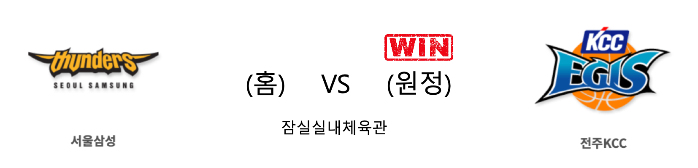
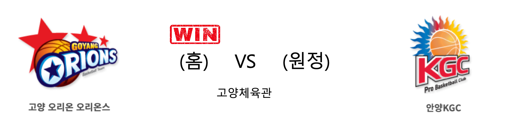

####  울산현대모비스(홈) VS 서울SK(원정) 

<table class="tg">
  <tr>
    <th class="tg-rr9t">울산현대모비스</th>
    <th class="tg-rr9t">팀</th>
    <th class="tg-rr9t">서울SK</th>
  </tr>
  <tr>
    <td class="tg-dcpn">1승 3패</td>
    <td class="tg-rr9t">시즌 상대전적</td>
    <td class="tg-dcpn">3승 1패</td>
  </tr>
  <tr>
    <td class="tg-dcpn">83</td>
    <td class="tg-rr9t">점수</td>
    <td class="tg-dcpn">77</td>
  </tr>
  <tr>
    <td class="tg-dcpn">17/43(40%)</td>
    <td class="tg-rr9t">2점(%)</td>
    <td class="tg-dcpn">27/45(60%)</td>
  </tr>
  <tr>
    <td class="tg-dcpn">12/23(52%)</td>
    <td class="tg-rr9t">3점(%)</td>
    <td class="tg-dcpn">4/11(36%)</td>
  </tr>
  <tr>
    <td class="tg-dcpn">13/16(81%)</td>
    <td class="tg-rr9t">자유투(%)</td>
    <td class="tg-dcpn">11/18(61%)</td>
  </tr>
  <tr>
    <td class="tg-dcpn">35</td>
    <td class="tg-rr9t">리바운드</td>
    <td class="tg-dcpn">24</td>
  </tr>
  <tr>
    <td class="tg-dcpn">1</td>
    <td class="tg-rr9t">어시스트</td>
    <td class="tg-dcpn">1</td>
  </tr>
  <tr>
    <td class="tg-dcpn">11</td>
    <td class="tg-rr9t">스틸</td>
    <td class="tg-dcpn">9</td>
  </tr>
  <tr>
    <td class="tg-dcpn">5</td>
    <td class="tg-rr9t">블록</td>
    <td class="tg-dcpn">7</td>
  </tr>
  <tr>
    <td class="tg-dcpn">18</td>
    <td class="tg-rr9t">턴오버</td>
    <td class="tg-dcpn">16</td>
  </tr>
  <tr>
    <td class="tg-dcpn">김국찬(19) 리온 윌리엄스(27)</td>
    <td class="tg-rr9t">주요 득점선수</td>
    <td class="tg-dcpn">안영준(16) 자밀 워니(32)</td>
  </tr>
</table>

#### 경기 관련 주요 기사         

[현대모비스, SK 3연패 빠뜨려…SK·인삼공사 공동 선두(종합)](http://www.newsis.com/view/?id=NISX20200105_0000879738&cID=10505&pID=10500)

[김국찬 3점포 5방, 현대모비스 SK전 3연패 탈출](http://www.sportsseoul.com/news/read/868715)

['윌리엄스 27점' 현대모비스, SK 충격의 3연패 빠트렸다](http://www.mydaily.co.kr/new_yk/html/read.php?newsid=202001051659152755&ext=na)

[프로농구 현대모비스, 선두 SK 잡고 중위권 '진군가'](https://news.sbs.co.kr/news/endPage.do?news_id=N1005591269&plink=ORI&cooper=NAVER)

        
        

####  창원LG(홈) VS 인천전자랜드(원정) 

<table class="tg">
  <tr>
    <th class="tg-rr9t">창원LG</th>
    <th class="tg-rr9t">팀</th>
    <th class="tg-rr9t">인천전자랜드</th>
  </tr>
  <tr>
    <td class="tg-dcpn">2승 2패</td>
    <td class="tg-rr9t">시즌 상대전적</td>
    <td class="tg-dcpn">2승 2패</td>
  </tr>
  <tr>
    <td class="tg-dcpn">79</td>
    <td class="tg-rr9t">점수</td>
    <td class="tg-dcpn">80</td>
  </tr>
  <tr>
    <td class="tg-dcpn">23/38(61%)</td>
    <td class="tg-rr9t">2점(%)</td>
    <td class="tg-dcpn">21/31(68%)</td>
  </tr>
  <tr>
    <td class="tg-dcpn">7/17(41%)</td>
    <td class="tg-rr9t">3점(%)</td>
    <td class="tg-dcpn">8/27(30%)</td>
  </tr>
  <tr>
    <td class="tg-dcpn">12/19(63%)</td>
    <td class="tg-rr9t">자유투(%)</td>
    <td class="tg-dcpn">14/17(82%)</td>
  </tr>
  <tr>
    <td class="tg-dcpn">21</td>
    <td class="tg-rr9t">리바운드</td>
    <td class="tg-dcpn">33</td>
  </tr>
  <tr>
    <td class="tg-dcpn">0</td>
    <td class="tg-rr9t">어시스트</td>
    <td class="tg-dcpn">0</td>
  </tr>
  <tr>
    <td class="tg-dcpn">7</td>
    <td class="tg-rr9t">스틸</td>
    <td class="tg-dcpn">7</td>
  </tr>
  <tr>
    <td class="tg-dcpn">5</td>
    <td class="tg-rr9t">블록</td>
    <td class="tg-dcpn">4</td>
  </tr>
  <tr>
    <td class="tg-dcpn">15</td>
    <td class="tg-rr9t">턴오버</td>
    <td class="tg-dcpn">12</td>
  </tr>
  <tr>
    <td class="tg-dcpn">캐디 라렌(17)</td>
    <td class="tg-rr9t">주요 득점선수</td>
    <td class="tg-dcpn">김낙현(25) 트로이 길렌워터(29)</td>
  </tr>
</table>

#### 경기 관련 주요 기사         

[[부상] 갈 길 바쁜 전자랜드, 이대헌-정영삼 5일 LG전 결장](http://sports.news.naver.com/basketball/news/read.nhn?oid=065&aid=0000195110)

[[JB화보] 인천 전자랜드, 창원 LG에 80-79으로 1점차 승리](http://sports.news.naver.com/basketball/news/read.nhn?oid=065&aid=0000195130)

[‘길렌워터 29득점’ 전자랜드, LG에 1점차 진땀승](http://www.mydaily.co.kr/new_yk/html/read.php?newsid=202001051659164582&ext=na)

['상승세 탄' 현대모비스, SK 시즌 첫 3연패 선사...전자랜드는 1점차 승리](http://www.dailysportshankook.co.kr/news/articleView.html?idxno=218423)

        
        

####  서울삼성(홈) VS 전주KCC(원정) 

<table class="tg">
  <tr>
    <th class="tg-rr9t">서울삼성</th>
    <th class="tg-rr9t">팀</th>
    <th class="tg-rr9t">전주KCC</th>
  </tr>
  <tr>
    <td class="tg-dcpn">1승 3패</td>
    <td class="tg-rr9t">시즌 상대전적</td>
    <td class="tg-dcpn">3승 1패</td>
  </tr>
  <tr>
    <td class="tg-dcpn">66</td>
    <td class="tg-rr9t">점수</td>
    <td class="tg-dcpn">84</td>
  </tr>
  <tr>
    <td class="tg-dcpn">18/33(55%)</td>
    <td class="tg-rr9t">2점(%)</td>
    <td class="tg-dcpn">29/46(63%)</td>
  </tr>
  <tr>
    <td class="tg-dcpn">8/31(26%)</td>
    <td class="tg-rr9t">3점(%)</td>
    <td class="tg-dcpn">7/21(33%)</td>
  </tr>
  <tr>
    <td class="tg-dcpn">6/9(67%)</td>
    <td class="tg-rr9t">자유투(%)</td>
    <td class="tg-dcpn">5/12(42%)</td>
  </tr>
  <tr>
    <td class="tg-dcpn">29</td>
    <td class="tg-rr9t">리바운드</td>
    <td class="tg-dcpn">34</td>
  </tr>
  <tr>
    <td class="tg-dcpn">0</td>
    <td class="tg-rr9t">어시스트</td>
    <td class="tg-dcpn">1</td>
  </tr>
  <tr>
    <td class="tg-dcpn">18</td>
    <td class="tg-rr9t">스틸</td>
    <td class="tg-dcpn">15</td>
  </tr>
  <tr>
    <td class="tg-dcpn">14</td>
    <td class="tg-rr9t">블록</td>
    <td class="tg-dcpn">15</td>
  </tr>
  <tr>
    <td class="tg-dcpn">19</td>
    <td class="tg-rr9t">턴오버</td>
    <td class="tg-dcpn">25</td>
  </tr>
  <tr>
    <td class="tg-dcpn">닉 미네라스(15)</td>
    <td class="tg-rr9t">주요 득점선수</td>
    <td class="tg-dcpn">라건아(15) 송교창(21) 이정현(20)</td>
  </tr>
</table>

#### 경기 관련 주요 기사         

[[사진]전주 KCC,'서울삼성 상대로 압승'](http://www.osen.co.kr/article/G1111288343)

[KCC 정창영 '넘어져도 슛!'](http://news1.kr/photos/view/?3995050)

[기쁘다 KCC](http://yna.kr/PYH20200105090800013?did=1196m)

[[BK Review] '교창-정현-건아' 빛난 KCC, 삼성 격파하고 2020년 첫 승 신고](http://www.basketkorea.com/news/articleView.html?idxno=191345)

        
        

####  고양오리온(홈) VS 안양KGC(원정) 

<table class="tg">
  <tr>
    <th class="tg-rr9t">고양오리온</th>
    <th class="tg-rr9t">팀</th>
    <th class="tg-rr9t">안양KGC</th>
  </tr>
  <tr>
    <td class="tg-dcpn">1승 3패</td>
    <td class="tg-rr9t">시즌 상대전적</td>
    <td class="tg-dcpn">3승 1패</td>
  </tr>
  <tr>
    <td class="tg-dcpn">84</td>
    <td class="tg-rr9t">점수</td>
    <td class="tg-dcpn">83</td>
  </tr>
  <tr>
    <td class="tg-dcpn">21/43(49%)</td>
    <td class="tg-rr9t">2점(%)</td>
    <td class="tg-dcpn">22/35(63%)</td>
  </tr>
  <tr>
    <td class="tg-dcpn">11/21(52%)</td>
    <td class="tg-rr9t">3점(%)</td>
    <td class="tg-dcpn">10/33(30%)</td>
  </tr>
  <tr>
    <td class="tg-dcpn">9/13(69%)</td>
    <td class="tg-rr9t">자유투(%)</td>
    <td class="tg-dcpn">9/11(82%)</td>
  </tr>
  <tr>
    <td class="tg-dcpn">29</td>
    <td class="tg-rr9t">리바운드</td>
    <td class="tg-dcpn">35</td>
  </tr>
  <tr>
    <td class="tg-dcpn">0</td>
    <td class="tg-rr9t">어시스트</td>
    <td class="tg-dcpn">1</td>
  </tr>
  <tr>
    <td class="tg-dcpn">13</td>
    <td class="tg-rr9t">스틸</td>
    <td class="tg-dcpn">11</td>
  </tr>
  <tr>
    <td class="tg-dcpn">6</td>
    <td class="tg-rr9t">블록</td>
    <td class="tg-dcpn">10</td>
  </tr>
  <tr>
    <td class="tg-dcpn">23</td>
    <td class="tg-rr9t">턴오버</td>
    <td class="tg-dcpn">19</td>
  </tr>
  <tr>
    <td class="tg-dcpn">한호빈(20)</td>
    <td class="tg-rr9t">주요 득점선수</td>
    <td class="tg-dcpn">박형철(15) 문성곤(17) 브랜든 브라운(20)</td>
  </tr>
</table>

#### 경기 관련 주요 기사         

[볼놓치며 쓰러지는 오리온 전성환[포토]](http://www.sportsseoul.com/news/read/868772)

['꼴찌' 오리온, 인삼공사 5연승 저지…허일영 역전포(종합)](http://yna.kr/AKR20200105040351007?did=1195m)

['허일영 결승 3점포' 최하위 오리온, KGC 5연승 저지](http://www.mydaily.co.kr/new_yk/html/read.php?newsid=202001051846627869&ext=na)

[추일승 감독 `KGC도 잡자` [MK포토]](http://mksports.co.kr/view/2020/13055/)

        
        

#### 리그 순위

<table class="tg">
  <tr>
    <th class="tg-d14o">순위</th>
    <th class="tg-d14o">팀명</th>
    <th class="tg-d14o">경기수</th>
    <th class="tg-d14o">승</th>
    <th class="tg-d14o">패</th>
    <th class="tg-d14o">승차</th>
    <th class="tg-d14o">승률</th>
  </tr>
  
<tr>
    <td class="tg-50j8">1</td>
    <td class="tg-50j8">서울SK</td>
    <td class="tg-50j8">30</td>
    <td class="tg-50j8">19</td>
    <td class="tg-50j8">11</td>
    <td class="tg-50j8">0</td>
    <td class="tg-50j8">0.633</td>
</tr>

<tr>
    <td class="tg-50j8">1</td>
    <td class="tg-50j8">안양KGC</td>
    <td class="tg-50j8">30</td>
    <td class="tg-50j8">19</td>
    <td class="tg-50j8">11</td>
    <td class="tg-50j8">0</td>
    <td class="tg-50j8">0.633</td>
</tr>

<tr>
    <td class="tg-50j8">3</td>
    <td class="tg-50j8">전주KCC</td>
    <td class="tg-50j8">30</td>
    <td class="tg-50j8">18</td>
    <td class="tg-50j8">12</td>
    <td class="tg-50j8">1</td>
    <td class="tg-50j8">0.6</td>
</tr>

<tr>
    <td class="tg-50j8">4</td>
    <td class="tg-50j8">인천전자랜드</td>
    <td class="tg-50j8">30</td>
    <td class="tg-50j8">17</td>
    <td class="tg-50j8">13</td>
    <td class="tg-50j8">2</td>
    <td class="tg-50j8">0.567</td>
</tr>

<tr>
    <td class="tg-50j8">5</td>
    <td class="tg-50j8">원주DB</td>
    <td class="tg-50j8">28</td>
    <td class="tg-50j8">15</td>
    <td class="tg-50j8">13</td>
    <td class="tg-50j8">4</td>
    <td class="tg-50j8">0.536</td>
</tr>

<tr>
    <td class="tg-50j8">6</td>
    <td class="tg-50j8">부산KT</td>
    <td class="tg-50j8">29</td>
    <td class="tg-50j8">14</td>
    <td class="tg-50j8">15</td>
    <td class="tg-50j8">5</td>
    <td class="tg-50j8">0.483</td>
</tr>

<tr>
    <td class="tg-50j8">7</td>
    <td class="tg-50j8">울산현대모비스</td>
    <td class="tg-50j8">31</td>
    <td class="tg-50j8">14</td>
    <td class="tg-50j8">17</td>
    <td class="tg-50j8">5</td>
    <td class="tg-50j8">0.452</td>
</tr>

<tr>
    <td class="tg-50j8">8</td>
    <td class="tg-50j8">서울삼성</td>
    <td class="tg-50j8">30</td>
    <td class="tg-50j8">13</td>
    <td class="tg-50j8">17</td>
    <td class="tg-50j8">6</td>
    <td class="tg-50j8">0.433</td>
</tr>

<tr>
    <td class="tg-50j8">9</td>
    <td class="tg-50j8">창원LG</td>
    <td class="tg-50j8">30</td>
    <td class="tg-50j8">10</td>
    <td class="tg-50j8">20</td>
    <td class="tg-50j8">9</td>
    <td class="tg-50j8">0.333</td>
</tr>

<tr>
    <td class="tg-50j8">9</td>
    <td class="tg-50j8">고양오리온</td>
    <td class="tg-50j8">30</td>
    <td class="tg-50j8">10</td>
    <td class="tg-50j8">20</td>
    <td class="tg-50j8">9</td>
    <td class="tg-50j8">0.333</td>
</tr>
</table> 

        
        
#kbl #국내농구 #농구분석 #토토 #스포츠토토 #경기예측 #농구결과 #20200105 #울산현대모비스 #서울SK #창원LG #인천전자랜드 #서울삼성 #전주KCC #고양오리온 #안양KGC #울산현대모비스서울SK #창원LG인천전자랜드 #서울삼성전주KCC #고양오리온안양KGC 