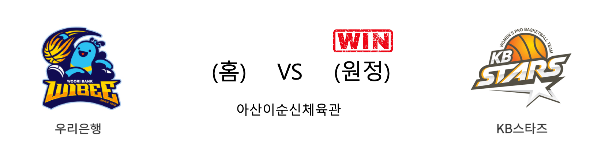

####  우리은행(홈) VS KB스타즈(원정) 

<table class="tg">
  <tr>
    <th class="tg-rr9t">우리은행</th>
    <th class="tg-rr9t">팀</th>
    <th class="tg-rr9t">KB스타즈</th>
  </tr>
  <tr>
    <td class="tg-dcpn">3승 1패</td>
    <td class="tg-rr9t">시즌 상대전적</td>
    <td class="tg-dcpn">1승 3패</td>
  </tr>
  <tr>
    <td class="tg-dcpn">44</td>
    <td class="tg-rr9t">점수</td>
    <td class="tg-dcpn">56</td>
  </tr>
  <tr>
    <td class="tg-dcpn">14/35(40%)</td>
    <td class="tg-rr9t">2점(%)</td>
    <td class="tg-dcpn">6/23(26%)</td>
  </tr>
  <tr>
    <td class="tg-dcpn">2/21(10%)</td>
    <td class="tg-rr9t">3점(%)</td>
    <td class="tg-dcpn">8/24(33%)</td>
  </tr>
  <tr>
    <td class="tg-dcpn">10/17(59%)</td>
    <td class="tg-rr9t">자유투(%)</td>
    <td class="tg-dcpn">20/22(91%)</td>
  </tr>
  <tr>
    <td class="tg-dcpn">30</td>
    <td class="tg-rr9t">리바운드</td>
    <td class="tg-dcpn">39</td>
  </tr>
  <tr>
    <td class="tg-dcpn">9</td>
    <td class="tg-rr9t">어시스트</td>
    <td class="tg-dcpn">9</td>
  </tr>
  <tr>
    <td class="tg-dcpn">5</td>
    <td class="tg-rr9t">스틸</td>
    <td class="tg-dcpn">3</td>
  </tr>
  <tr>
    <td class="tg-dcpn">8</td>
    <td class="tg-rr9t">블록</td>
    <td class="tg-dcpn">15</td>
  </tr>
  <tr>
    <td class="tg-dcpn">24</td>
    <td class="tg-rr9t">턴오버</td>
    <td class="tg-dcpn">22</td>
  </tr>
  <tr>
    <td class="tg-dcpn">김정은(20)</td>
    <td class="tg-rr9t">주요 득점선수</td>
    <td class="tg-dcpn">심성영(19)</td>
  </tr>
</table>

#### 경기 관련 주요 기사         

[우리가 해냈다 ! KB스타즈 승리](http://yna.kr/PYH20200106202100063?did=1196m)

[‘성영·쏜튼·아정’ 힘 합친 KB, 우리은행 무찌르며 1위 탈환](http://sports.news.naver.com/basketball/news/read.nhn?oid=065&aid=0000195232)

['지수 5반칙·쏜튼 부진에도' KB, 우리은행전 첫 승 신고](https://www.nocutnews.co.kr/news/5268749)

[KB, 우리은행 3연패 몰아넣고 선두 등극](http://sports.khan.co.kr/news/sk_index.html?art_id=202001062116003&sec_id=530301&pt=nv)

        
        

#### 리그 순위

<table class="tg">
  <tr>
    <th class="tg-d14o">순위</th>
    <th class="tg-d14o">팀명</th>
    <th class="tg-d14o">경기수</th>
    <th class="tg-d14o">승</th>
    <th class="tg-d14o">패</th>
    <th class="tg-d14o">승차</th>
    <th class="tg-d14o">승률</th>
  </tr>
  
<tr>
    <td class="tg-50j8">1</td>
    <td class="tg-50j8">KB스타즈</td>
    <td class="tg-50j8">17</td>
    <td class="tg-50j8">12</td>
    <td class="tg-50j8">5</td>
    <td class="tg-50j8">0</td>
    <td class="tg-50j8">0.706</td>
</tr>

<tr>
    <td class="tg-50j8">1</td>
    <td class="tg-50j8">우리은행</td>
    <td class="tg-50j8">17</td>
    <td class="tg-50j8">12</td>
    <td class="tg-50j8">5</td>
    <td class="tg-50j8">0</td>
    <td class="tg-50j8">0.706</td>
</tr>

<tr>
    <td class="tg-50j8">3</td>
    <td class="tg-50j8">KEB하나</td>
    <td class="tg-50j8">16</td>
    <td class="tg-50j8">7</td>
    <td class="tg-50j8">9</td>
    <td class="tg-50j8">5</td>
    <td class="tg-50j8">0.438</td>
</tr>

<tr>
    <td class="tg-50j8">4</td>
    <td class="tg-50j8">신한은행</td>
    <td class="tg-50j8">17</td>
    <td class="tg-50j8">7</td>
    <td class="tg-50j8">10</td>
    <td class="tg-50j8">5</td>
    <td class="tg-50j8">0.412</td>
</tr>

<tr>
    <td class="tg-50j8">5</td>
    <td class="tg-50j8">삼성생명</td>
    <td class="tg-50j8">16</td>
    <td class="tg-50j8">6</td>
    <td class="tg-50j8">10</td>
    <td class="tg-50j8">6</td>
    <td class="tg-50j8">0.375</td>
</tr>

<tr>
    <td class="tg-50j8">6</td>
    <td class="tg-50j8">BNK썸</td>
    <td class="tg-50j8">17</td>
    <td class="tg-50j8">6</td>
    <td class="tg-50j8">11</td>
    <td class="tg-50j8">6</td>
    <td class="tg-50j8">0.353</td>
</tr>
</table> 

        
        
#wkbl #국내농구 #여자농구 #농구분석 #토토 #스포츠토토 #경기예측 #농구결과 #20200106 #우리은행 #KB스타즈 #우리은행KB스타즈 