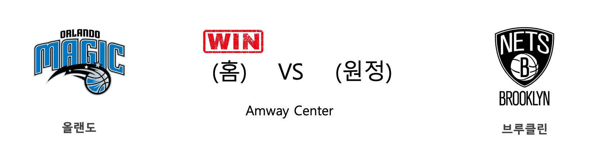
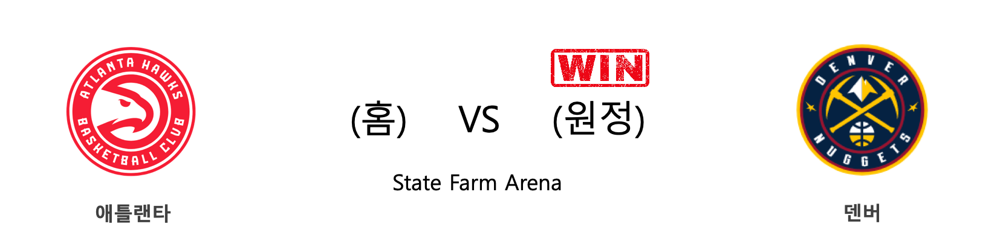
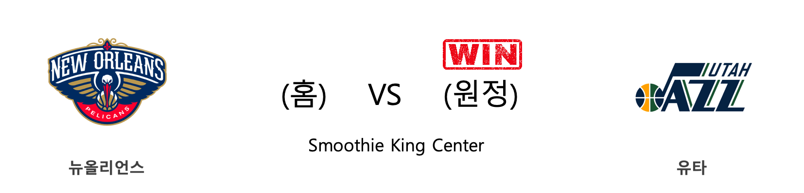
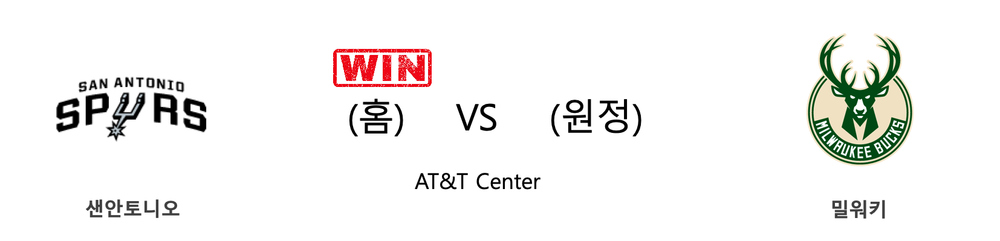
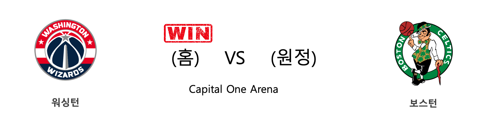
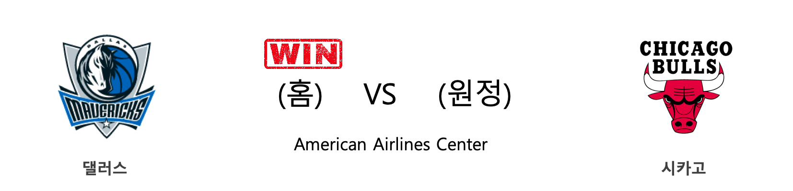

####  샬럿(홈) VS 인디애나(원정) 

<table class="tg">
  <tr>
    <th class="tg-rr9t">CHA</th>
    <th class="tg-rr9t">팀</th>
    <th class="tg-rr9t">IND</th>
  </tr>
  <tr>
    <td class="tg-dcpn">1승 2패</td>
    <td class="tg-rr9t">시즌 상대전적</td>
    <td class="tg-dcpn">2승 1패</td>
  </tr>
  <tr>
    <td class="tg-dcpn">104</td>
    <td class="tg-rr9t">점수</td>
    <td class="tg-dcpn">115</td>
  </tr>
  <tr>
    <td class="tg-dcpn">27/51(53%)</td>
    <td class="tg-rr9t">2점(%)</td>
    <td class="tg-dcpn">37/63(59%)</td>
  </tr>
  <tr>
    <td class="tg-dcpn">10/30(33%)</td>
    <td class="tg-rr9t">3점(%)</td>
    <td class="tg-dcpn">10/26(38%)</td>
  </tr>
  <tr>
    <td class="tg-dcpn">20/22(91%)</td>
    <td class="tg-rr9t">자유투(%)</td>
    <td class="tg-dcpn">11/14(79%)</td>
  </tr>
  <tr>
    <td class="tg-dcpn">38</td>
    <td class="tg-rr9t">리바운드</td>
    <td class="tg-dcpn">43</td>
  </tr>
  <tr>
    <td class="tg-dcpn">21</td>
    <td class="tg-rr9t">어시스트</td>
    <td class="tg-dcpn">31</td>
  </tr>
  <tr>
    <td class="tg-dcpn">3</td>
    <td class="tg-rr9t">스틸</td>
    <td class="tg-dcpn">8</td>
  </tr>
  <tr>
    <td class="tg-dcpn">3</td>
    <td class="tg-rr9t">블록</td>
    <td class="tg-dcpn">5</td>
  </tr>
  <tr>
    <td class="tg-dcpn">11</td>
    <td class="tg-rr9t">턴오버</td>
    <td class="tg-dcpn">10</td>
  </tr>
  <tr>
    <td class="tg-dcpn">MilesBridgesF(18) Devonte'Graha(22) TerryRozierG(28)</td>
    <td class="tg-rr9t">주요 득점선수</td>
    <td class="tg-dcpn">DomantasSabon(18) MylesTurnerC(15) T.J.WarrenF(36)</td>
  </tr>
</table>

#### 경기 관련 주요 기사         

[[오늘의 NBA] (1/5) 제이슨 테이텀, 보스턴의 밀당남](http://sports.news.naver.com/basketball/news/read.nhn?oid=486&aid=0000001187)

[[오늘의 NBA] (12/28) 골든스테이트, 수비 코트에서 시작된 대반격](http://sports.news.naver.com/basketball/news/read.nhn?oid=486&aid=0000001179)

[[오늘의 NBA] (1/1) 휴스턴의 불장난](http://sports.news.naver.com/basketball/news/read.nhn?oid=486&aid=0000001183)

[[오늘의 NBA] (1/3) 마이클 포터 주니어, 덴버의 기다림에 응답하다!](http://sports.news.naver.com/basketball/news/read.nhn?oid=486&aid=0000001185)

[[오늘의 NBA] (12/23) 토론토, 포기할 줄 모르는 북방의 투사](http://sports.news.naver.com/basketball/news/read.nhn?oid=486&aid=0000001175)

        
        

####  올랜도(홈) VS 브루클린(원정) 

<table class="tg">
  <tr>
    <th class="tg-rr9t">ORL</th>
    <th class="tg-rr9t">팀</th>
    <th class="tg-rr9t">BKN</th>
  </tr>
  <tr>
    <td class="tg-dcpn">1승 0패</td>
    <td class="tg-rr9t">시즌 상대전적</td>
    <td class="tg-dcpn">0승 1패</td>
  </tr>
  <tr>
    <td class="tg-dcpn">101</td>
    <td class="tg-rr9t">점수</td>
    <td class="tg-dcpn">89</td>
  </tr>
  <tr>
    <td class="tg-dcpn">27/55(49%)</td>
    <td class="tg-rr9t">2점(%)</td>
    <td class="tg-dcpn">22/49(45%)</td>
  </tr>
  <tr>
    <td class="tg-dcpn">8/26(31%)</td>
    <td class="tg-rr9t">3점(%)</td>
    <td class="tg-dcpn">10/47(21%)</td>
  </tr>
  <tr>
    <td class="tg-dcpn">23/31(74%)</td>
    <td class="tg-rr9t">자유투(%)</td>
    <td class="tg-dcpn">15/19(79%)</td>
  </tr>
  <tr>
    <td class="tg-dcpn">60</td>
    <td class="tg-rr9t">리바운드</td>
    <td class="tg-dcpn">46</td>
  </tr>
  <tr>
    <td class="tg-dcpn">21</td>
    <td class="tg-rr9t">어시스트</td>
    <td class="tg-dcpn">20</td>
  </tr>
  <tr>
    <td class="tg-dcpn">8</td>
    <td class="tg-rr9t">스틸</td>
    <td class="tg-dcpn">11</td>
  </tr>
  <tr>
    <td class="tg-dcpn">3</td>
    <td class="tg-rr9t">블록</td>
    <td class="tg-dcpn">1</td>
  </tr>
  <tr>
    <td class="tg-dcpn">18</td>
    <td class="tg-rr9t">턴오버</td>
    <td class="tg-dcpn">12</td>
  </tr>
  <tr>
    <td class="tg-dcpn">MarkelleFultz(25) D.J.Augustin(16)</td>
    <td class="tg-rr9t">주요 득점선수</td>
    <td class="tg-dcpn">JoeHarrisF(16) SpencerDinwid(16)</td>
  </tr>
</table>

#### 경기 관련 주요 기사         

[[오늘의 NBA] (1/5) 제이슨 테이텀, 보스턴의 밀당남](http://sports.news.naver.com/basketball/news/read.nhn?oid=486&aid=0000001187)

[[오늘의 NBA] (12/29) 마이애미, 연장전 승부 전문가](http://sports.news.naver.com/basketball/news/read.nhn?oid=486&aid=0000001180)

[[오늘의 NBA] (1/6) 몬트레즐 해럴, 클리퍼스의 희소재](http://sports.news.naver.com/basketball/news/read.nhn?oid=486&aid=0000001188)

[[오늘의 NBA] (11/24) 잭 라빈, GSW 스플래쉬 브라더스를 소환하다](http://sports.news.naver.com/basketball/news/read.nhn?oid=486&aid=0000001147)

[[오늘의 NBA] (1/4) 제임스 하든, NBA 공격 코트의 지배자](http://sports.news.naver.com/basketball/news/read.nhn?oid=486&aid=0000001186)

        
        

####  애틀랜타(홈) VS 덴버(원정) 

<table class="tg">
  <tr>
    <th class="tg-rr9t">ATL</th>
    <th class="tg-rr9t">팀</th>
    <th class="tg-rr9t">DEN</th>
  </tr>
  <tr>
    <td class="tg-dcpn">1승 1패</td>
    <td class="tg-rr9t">시즌 상대전적</td>
    <td class="tg-dcpn">1승 1패</td>
  </tr>
  <tr>
    <td class="tg-dcpn">115</td>
    <td class="tg-rr9t">점수</td>
    <td class="tg-dcpn">123</td>
  </tr>
  <tr>
    <td class="tg-dcpn">17/38(45%)</td>
    <td class="tg-rr9t">2점(%)</td>
    <td class="tg-dcpn">38/65(58%)</td>
  </tr>
  <tr>
    <td class="tg-dcpn">18/39(46%)</td>
    <td class="tg-rr9t">3점(%)</td>
    <td class="tg-dcpn">9/27(33%)</td>
  </tr>
  <tr>
    <td class="tg-dcpn">27/32(84%)</td>
    <td class="tg-rr9t">자유투(%)</td>
    <td class="tg-dcpn">20/27(74%)</td>
  </tr>
  <tr>
    <td class="tg-dcpn">34</td>
    <td class="tg-rr9t">리바운드</td>
    <td class="tg-dcpn">41</td>
  </tr>
  <tr>
    <td class="tg-dcpn">24</td>
    <td class="tg-rr9t">어시스트</td>
    <td class="tg-dcpn">27</td>
  </tr>
  <tr>
    <td class="tg-dcpn">3</td>
    <td class="tg-rr9t">스틸</td>
    <td class="tg-dcpn">4</td>
  </tr>
  <tr>
    <td class="tg-dcpn">5</td>
    <td class="tg-rr9t">블록</td>
    <td class="tg-dcpn">6</td>
  </tr>
  <tr>
    <td class="tg-dcpn">10</td>
    <td class="tg-rr9t">턴오버</td>
    <td class="tg-dcpn">4</td>
  </tr>
  <tr>
    <td class="tg-dcpn">TraeYoungG(29) KevinHuerterG(22) JohnCollinsF(17) De'AndreHunte(16)</td>
    <td class="tg-rr9t">주요 득점선수</td>
    <td class="tg-dcpn">JamalMurrayG(16) WillBartonF(28) NikolaJokicC(47)</td>
  </tr>
</table>

#### 경기 관련 주요 기사         

[[오늘의 NBA] (12/16) 스펜서 딘위디, 브루클린 상승세를 이끈다!](http://sports.news.naver.com/basketball/news/read.nhn?oid=486&aid=0000001168)

[[오늘의 NBA] (1/5) 제이슨 테이텀, 보스턴의 밀당남](http://sports.news.naver.com/basketball/news/read.nhn?oid=486&aid=0000001187)

[[오늘의 NBA] (1/6) 몬트레즐 해럴, 클리퍼스의 희소재](http://sports.news.naver.com/basketball/news/read.nhn?oid=486&aid=0000001188)

[[오늘의 NBA] (12/14) 레이커스, 마이애미 홈 코트를 점령하다](http://sports.news.naver.com/basketball/news/read.nhn?oid=486&aid=0000001166)

[[오늘의 NBA] (12/29) 마이애미, 연장전 승부 전문가](http://sports.news.naver.com/basketball/news/read.nhn?oid=486&aid=0000001180)

        
        

####  뉴올리언스(홈) VS 유타(원정) 

<table class="tg">
  <tr>
    <th class="tg-rr9t">NOP</th>
    <th class="tg-rr9t">팀</th>
    <th class="tg-rr9t">UTA</th>
  </tr>
  <tr>
    <td class="tg-dcpn">0승 2패</td>
    <td class="tg-rr9t">시즌 상대전적</td>
    <td class="tg-dcpn">2승 0패</td>
  </tr>
  <tr>
    <td class="tg-dcpn">126</td>
    <td class="tg-rr9t">점수</td>
    <td class="tg-dcpn">128</td>
  </tr>
  <tr>
    <td class="tg-dcpn">33/62(53%)</td>
    <td class="tg-rr9t">2점(%)</td>
    <td class="tg-dcpn">30/57(53%)</td>
  </tr>
  <tr>
    <td class="tg-dcpn">12/31(39%)</td>
    <td class="tg-rr9t">3점(%)</td>
    <td class="tg-dcpn">16/33(48%)</td>
  </tr>
  <tr>
    <td class="tg-dcpn">24/30(80%)</td>
    <td class="tg-rr9t">자유투(%)</td>
    <td class="tg-dcpn">20/24(83%)</td>
  </tr>
  <tr>
    <td class="tg-dcpn">47</td>
    <td class="tg-rr9t">리바운드</td>
    <td class="tg-dcpn">43</td>
  </tr>
  <tr>
    <td class="tg-dcpn">23</td>
    <td class="tg-rr9t">어시스트</td>
    <td class="tg-dcpn">19</td>
  </tr>
  <tr>
    <td class="tg-dcpn">4</td>
    <td class="tg-rr9t">스틸</td>
    <td class="tg-dcpn">3</td>
  </tr>
  <tr>
    <td class="tg-dcpn">5</td>
    <td class="tg-rr9t">블록</td>
    <td class="tg-dcpn">3</td>
  </tr>
  <tr>
    <td class="tg-dcpn">6</td>
    <td class="tg-rr9t">턴오버</td>
    <td class="tg-dcpn">8</td>
  </tr>
  <tr>
    <td class="tg-dcpn">LonzoBallG(21) JJRedickG(23) BrandonIngram(35)</td>
    <td class="tg-rr9t">주요 득점선수</td>
    <td class="tg-dcpn">DonovanMitche(19) BojanBogdanov(35) JordanClarkso(16) JoeInglesG(22)</td>
  </tr>
</table>

#### 경기 관련 주요 기사         

[[오늘의 NBA] (12/21) 크리스탑스 포르징기스, 댈러스의 새로운 버팀목](http://sports.news.naver.com/basketball/news/read.nhn?oid=486&aid=0000001173)

[[오늘의 NBA] (12/16) 스펜서 딘위디, 브루클린 상승세를 이끈다!](http://sports.news.naver.com/basketball/news/read.nhn?oid=486&aid=0000001168)

[[오늘의 NBA] (12/18) 인디애나, LAL 원정 연승 행진을 멈추다](http://sports.news.naver.com/basketball/news/read.nhn?oid=486&aid=0000001170)

[[오늘의 NBA] (12/29) 마이애미, 연장전 승부 전문가](http://sports.news.naver.com/basketball/news/read.nhn?oid=486&aid=0000001180)

[[오늘의 NBA] (12/14) 레이커스, 마이애미 홈 코트를 점령하다](http://sports.news.naver.com/basketball/news/read.nhn?oid=486&aid=0000001166)

        
        

####  새크라멘토(홈) VS 골든스테이트(원정) 

<table class="tg">
  <tr>
    <th class="tg-rr9t">SAC</th>
    <th class="tg-rr9t">팀</th>
    <th class="tg-rr9t">GSW</th>
  </tr>
  <tr>
    <td class="tg-dcpn">2승 0패</td>
    <td class="tg-rr9t">시즌 상대전적</td>
    <td class="tg-dcpn">0승 2패</td>
  </tr>
  <tr>
    <td class="tg-dcpn">111</td>
    <td class="tg-rr9t">점수</td>
    <td class="tg-dcpn">98</td>
  </tr>
  <tr>
    <td class="tg-dcpn">24/51(47%)</td>
    <td class="tg-rr9t">2점(%)</td>
    <td class="tg-dcpn">29/60(48%)</td>
  </tr>
  <tr>
    <td class="tg-dcpn">15/30(50%)</td>
    <td class="tg-rr9t">3점(%)</td>
    <td class="tg-dcpn">5/26(19%)</td>
  </tr>
  <tr>
    <td class="tg-dcpn">18/23(78%)</td>
    <td class="tg-rr9t">자유투(%)</td>
    <td class="tg-dcpn">25/32(78%)</td>
  </tr>
  <tr>
    <td class="tg-dcpn">43</td>
    <td class="tg-rr9t">리바운드</td>
    <td class="tg-dcpn">44</td>
  </tr>
  <tr>
    <td class="tg-dcpn">27</td>
    <td class="tg-rr9t">어시스트</td>
    <td class="tg-dcpn">19</td>
  </tr>
  <tr>
    <td class="tg-dcpn">10</td>
    <td class="tg-rr9t">스틸</td>
    <td class="tg-dcpn">13</td>
  </tr>
  <tr>
    <td class="tg-dcpn">3</td>
    <td class="tg-rr9t">블록</td>
    <td class="tg-dcpn">4</td>
  </tr>
  <tr>
    <td class="tg-dcpn">22</td>
    <td class="tg-rr9t">턴오버</td>
    <td class="tg-dcpn">17</td>
  </tr>
  <tr>
    <td class="tg-dcpn">BuddyHieldG(21) De'AaronFoxG(21) TrevorAriza(18) HarrisonBarne(18)</td>
    <td class="tg-rr9t">주요 득점선수</td>
    <td class="tg-dcpn">GlennRobinson(16)</td>
  </tr>
</table>

#### 경기 관련 주요 기사         

[[오늘의 NBA] (11/16) 멤피스, Grit&Grind 시대와의 성공적인 단절](http://sports.news.naver.com/basketball/news/read.nhn?oid=486&aid=0000001139)

[[오늘의 NBA] (12/29) 마이애미, 연장전 승부 전문가](http://sports.news.naver.com/basketball/news/read.nhn?oid=486&aid=0000001180)

['보그다노비치 25점' SAC, GSW에 21점차 완승](http://www.rookie.co.kr/news/articleView.html?idxno=36428)

[[오늘의 NBA] (12/24) 자말 머레이와 데빈 부커의 뒤틀린 운명](http://sports.news.naver.com/basketball/news/read.nhn?oid=486&aid=0000001176)

[[오늘의 NBA] (12/21) 크리스탑스 포르징기스, 댈러스의 새로운 버팀목](http://sports.news.naver.com/basketball/news/read.nhn?oid=486&aid=0000001173)

        
        

####  필라델피아(홈) VS 오클라호마씨티(원정) 

<table class="tg">
  <tr>
    <th class="tg-rr9t">PHI</th>
    <th class="tg-rr9t">팀</th>
    <th class="tg-rr9t">OKC</th>
  </tr>
  <tr>
    <td class="tg-dcpn">1승 1패</td>
    <td class="tg-rr9t">시즌 상대전적</td>
    <td class="tg-dcpn">1승 1패</td>
  </tr>
  <tr>
    <td class="tg-dcpn">120</td>
    <td class="tg-rr9t">점수</td>
    <td class="tg-dcpn">113</td>
  </tr>
  <tr>
    <td class="tg-dcpn">33/64(52%)</td>
    <td class="tg-rr9t">2점(%)</td>
    <td class="tg-dcpn">28/60(47%)</td>
  </tr>
  <tr>
    <td class="tg-dcpn">13/26(50%)</td>
    <td class="tg-rr9t">3점(%)</td>
    <td class="tg-dcpn">12/29(41%)</td>
  </tr>
  <tr>
    <td class="tg-dcpn">15/18(83%)</td>
    <td class="tg-rr9t">자유투(%)</td>
    <td class="tg-dcpn">21/31(68%)</td>
  </tr>
  <tr>
    <td class="tg-dcpn">42</td>
    <td class="tg-rr9t">리바운드</td>
    <td class="tg-dcpn">47</td>
  </tr>
  <tr>
    <td class="tg-dcpn">31</td>
    <td class="tg-rr9t">어시스트</td>
    <td class="tg-dcpn">17</td>
  </tr>
  <tr>
    <td class="tg-dcpn">4</td>
    <td class="tg-rr9t">스틸</td>
    <td class="tg-dcpn">3</td>
  </tr>
  <tr>
    <td class="tg-dcpn">0</td>
    <td class="tg-rr9t">블록</td>
    <td class="tg-dcpn">3</td>
  </tr>
  <tr>
    <td class="tg-dcpn">10</td>
    <td class="tg-rr9t">턴오버</td>
    <td class="tg-dcpn">12</td>
  </tr>
  <tr>
    <td class="tg-dcpn">JoshRichardso(23) TobiasHarrisF(18) BenSimmonsG(17) JoelEmbiidC(18)</td>
    <td class="tg-rr9t">주요 득점선수</td>
    <td class="tg-dcpn">DennisSchrode(21) ChrisPaulG(18) StevenAdamsC(24) DaniloGallina(18)</td>
  </tr>
</table>

#### 경기 관련 주요 기사         

[[오늘의 NBA] (1/4) 제임스 하든, NBA 공격 코트의 지배자](http://sports.news.naver.com/basketball/news/read.nhn?oid=486&aid=0000001186)

[[오늘의 NBA] (12/17) 댈러스, 밀워키 시스템을 붕괴시키다](http://sports.news.naver.com/basketball/news/read.nhn?oid=486&aid=0000001169)

[[오늘의 NBA] (1/1) 휴스턴의 불장난](http://sports.news.naver.com/basketball/news/read.nhn?oid=486&aid=0000001183)

[[NBA UP&DOWN] ‘4연승 질주’ OKC ‘UP' ... '4연패 나락’ PHI ‘DOWN'](http://sports.news.naver.com/basketball/news/read.nhn?oid=065&aid=0000195268)

[[오늘의 NBA] (12/10) 데릭 로즈, 모터 시티의 해결사](http://sports.news.naver.com/basketball/news/read.nhn?oid=486&aid=0000001162)

        
        

####  샌안토니오(홈) VS 밀워키(원정) 

<table class="tg">
  <tr>
    <th class="tg-rr9t">SAS</th>
    <th class="tg-rr9t">팀</th>
    <th class="tg-rr9t">MIL</th>
  </tr>
  <tr>
    <td class="tg-dcpn">1승 1패</td>
    <td class="tg-rr9t">시즌 상대전적</td>
    <td class="tg-dcpn">1승 1패</td>
  </tr>
  <tr>
    <td class="tg-dcpn">126</td>
    <td class="tg-rr9t">점수</td>
    <td class="tg-dcpn">104</td>
  </tr>
  <tr>
    <td class="tg-dcpn">26/53(49%)</td>
    <td class="tg-rr9t">2점(%)</td>
    <td class="tg-dcpn">23/50(46%)</td>
  </tr>
  <tr>
    <td class="tg-dcpn">19/35(54%)</td>
    <td class="tg-rr9t">3점(%)</td>
    <td class="tg-dcpn">15/45(33%)</td>
  </tr>
  <tr>
    <td class="tg-dcpn">17/19(89%)</td>
    <td class="tg-rr9t">자유투(%)</td>
    <td class="tg-dcpn">13/14(93%)</td>
  </tr>
  <tr>
    <td class="tg-dcpn">54</td>
    <td class="tg-rr9t">리바운드</td>
    <td class="tg-dcpn">38</td>
  </tr>
  <tr>
    <td class="tg-dcpn">23</td>
    <td class="tg-rr9t">어시스트</td>
    <td class="tg-dcpn">24</td>
  </tr>
  <tr>
    <td class="tg-dcpn">4</td>
    <td class="tg-rr9t">스틸</td>
    <td class="tg-dcpn">5</td>
  </tr>
  <tr>
    <td class="tg-dcpn">2</td>
    <td class="tg-rr9t">블록</td>
    <td class="tg-dcpn">5</td>
  </tr>
  <tr>
    <td class="tg-dcpn">11</td>
    <td class="tg-rr9t">턴오버</td>
    <td class="tg-dcpn">8</td>
  </tr>
  <tr>
    <td class="tg-dcpn">LaMarcusAldri(17) RudyGay(17) DeMarDeRozanF(25) PattyMills(21)</td>
    <td class="tg-rr9t">주요 득점선수</td>
    <td class="tg-dcpn">DonteDiVincen(16) KhrisMiddleto(15) GiannisAnteto(24) GeorgeHill(15)</td>
  </tr>
</table>

#### 경기 관련 주요 기사         

[[오늘의 NBA] (1/5) 제이슨 테이텀, 보스턴의 밀당남](http://sports.news.naver.com/basketball/news/read.nhn?oid=486&aid=0000001187)

[[오늘의 NBA] (12/17) 댈러스, 밀워키 시스템을 붕괴시키다](http://sports.news.naver.com/basketball/news/read.nhn?oid=486&aid=0000001169)

[[오늘의 NBA] (12/29) 마이애미, 연장전 승부 전문가](http://sports.news.naver.com/basketball/news/read.nhn?oid=486&aid=0000001180)

[[오늘의 NBA] (12/15) 밤 아데바요, 연장전의 지배자](http://sports.news.naver.com/basketball/news/read.nhn?oid=486&aid=0000001167)

[[오늘의 NBA] (12/20) 밀워키, 리그 전체 단독 1위 등극!](http://sports.news.naver.com/basketball/news/read.nhn?oid=486&aid=0000001172)

        
        

####  워싱턴(홈) VS 보스턴(원정) 

<table class="tg">
  <tr>
    <th class="tg-rr9t">WAS</th>
    <th class="tg-rr9t">팀</th>
    <th class="tg-rr9t">BOS</th>
  </tr>
  <tr>
    <td class="tg-dcpn">1승 1패</td>
    <td class="tg-rr9t">시즌 상대전적</td>
    <td class="tg-dcpn">1승 1패</td>
  </tr>
  <tr>
    <td class="tg-dcpn">99</td>
    <td class="tg-rr9t">점수</td>
    <td class="tg-dcpn">94</td>
  </tr>
  <tr>
    <td class="tg-dcpn">32/63(51%)</td>
    <td class="tg-rr9t">2점(%)</td>
    <td class="tg-dcpn">25/58(43%)</td>
  </tr>
  <tr>
    <td class="tg-dcpn">7/21(33%)</td>
    <td class="tg-rr9t">3점(%)</td>
    <td class="tg-dcpn">8/37(22%)</td>
  </tr>
  <tr>
    <td class="tg-dcpn">14/23(61%)</td>
    <td class="tg-rr9t">자유투(%)</td>
    <td class="tg-dcpn">20/26(77%)</td>
  </tr>
  <tr>
    <td class="tg-dcpn">47</td>
    <td class="tg-rr9t">리바운드</td>
    <td class="tg-dcpn">55</td>
  </tr>
  <tr>
    <td class="tg-dcpn">18</td>
    <td class="tg-rr9t">어시스트</td>
    <td class="tg-dcpn">17</td>
  </tr>
  <tr>
    <td class="tg-dcpn">8</td>
    <td class="tg-rr9t">스틸</td>
    <td class="tg-dcpn">7</td>
  </tr>
  <tr>
    <td class="tg-dcpn">9</td>
    <td class="tg-rr9t">블록</td>
    <td class="tg-dcpn">8</td>
  </tr>
  <tr>
    <td class="tg-dcpn">14</td>
    <td class="tg-rr9t">턴오버</td>
    <td class="tg-dcpn">16</td>
  </tr>
  <tr>
    <td class="tg-dcpn">IshSmith(27) JordanMcRaeF(19) IsaiahThomasG(17) TroyBrownJr.(15)</td>
    <td class="tg-rr9t">주요 득점선수</td>
    <td class="tg-dcpn">JaylenBrownG(23) JaysonTatumF(17)</td>
  </tr>
</table>

#### 경기 관련 주요 기사         

[[오늘의 NBA] (12/13) 카이리 어빙, 흥행을 아는 슈퍼스타](http://sports.news.naver.com/basketball/news/read.nhn?oid=486&aid=0000000899)

[[오늘의 NBA] (10/31) HOU vs WAS, NBA 득점 쟁탈전 역사를 새로 쓰다](http://sports.news.naver.com/basketball/news/read.nhn?oid=486&aid=0000001123)

[[오늘의 NBA] (12/2) 토론토, 두 마리 토끼를 노린다!](http://sports.news.naver.com/basketball/news/read.nhn?oid=486&aid=0000001154)

[[오늘의 NBA] (4/4) 올랜도, 동부컨퍼런스 중위권 화합을 거부하다](http://sports.news.naver.com/basketball/news/read.nhn?oid=486&aid=0000001006)

[[오늘의 NBA] (3/7) 르브론 제임스의 슬픈 언약식](http://sports.news.naver.com/basketball/news/read.nhn?oid=486&aid=0000000978)

        
        

####  댈러스(홈) VS 시카고(원정) 

<table class="tg">
  <tr>
    <th class="tg-rr9t">DAL</th>
    <th class="tg-rr9t">팀</th>
    <th class="tg-rr9t">CHI</th>
  </tr>
  <tr>
    <td class="tg-dcpn">1승 0패</td>
    <td class="tg-rr9t">시즌 상대전적</td>
    <td class="tg-dcpn">0승 1패</td>
  </tr>
  <tr>
    <td class="tg-dcpn">118</td>
    <td class="tg-rr9t">점수</td>
    <td class="tg-dcpn">110</td>
  </tr>
  <tr>
    <td class="tg-dcpn">28/43(65%)</td>
    <td class="tg-rr9t">2점(%)</td>
    <td class="tg-dcpn">37/67(55%)</td>
  </tr>
  <tr>
    <td class="tg-dcpn">16/41(39%)</td>
    <td class="tg-rr9t">3점(%)</td>
    <td class="tg-dcpn">9/31(29%)</td>
  </tr>
  <tr>
    <td class="tg-dcpn">14/19(74%)</td>
    <td class="tg-rr9t">자유투(%)</td>
    <td class="tg-dcpn">9/11(82%)</td>
  </tr>
  <tr>
    <td class="tg-dcpn">43</td>
    <td class="tg-rr9t">리바운드</td>
    <td class="tg-dcpn">45</td>
  </tr>
  <tr>
    <td class="tg-dcpn">25</td>
    <td class="tg-rr9t">어시스트</td>
    <td class="tg-dcpn">25</td>
  </tr>
  <tr>
    <td class="tg-dcpn">5</td>
    <td class="tg-rr9t">스틸</td>
    <td class="tg-dcpn">10</td>
  </tr>
  <tr>
    <td class="tg-dcpn">6</td>
    <td class="tg-rr9t">블록</td>
    <td class="tg-dcpn">7</td>
  </tr>
  <tr>
    <td class="tg-dcpn">14</td>
    <td class="tg-rr9t">턴오버</td>
    <td class="tg-dcpn">8</td>
  </tr>
  <tr>
    <td class="tg-dcpn">DwightPowellC(16) TimHardawayJr(15) LukaDoncicG(38)</td>
    <td class="tg-rr9t">주요 득점선수</td>
    <td class="tg-dcpn">LauriMarkkane(26) CobyWhite(15) ZachLaVineG(20)</td>
  </tr>
</table>

#### 경기 관련 주요 기사         

[[오늘의 NBA] (12/21) 크리스탑스 포르징기스, 댈러스의 새로운 버팀목](http://sports.news.naver.com/basketball/news/read.nhn?oid=486&aid=0000001173)

['돈치치 시즌 11호 트리플-더블' DAL, CHI 4연패 빠뜨려](http://www.rookie.co.kr/news/articleView.html?idxno=37647)

[[오늘의 NBA] (12/19) 오클라호마시티, 역전의 달인!](http://sports.news.naver.com/basketball/news/read.nhn?oid=486&aid=0000001171)

[[오늘의 NBA] (12/23) 토론토, 포기할 줄 모르는 북방의 투사](http://sports.news.naver.com/basketball/news/read.nhn?oid=486&aid=0000001175)

[[오늘의 NBA] (1/5) 제이슨 테이텀, 보스턴의 밀당남](http://sports.news.naver.com/basketball/news/read.nhn?oid=486&aid=0000001187)

        
        

#### 리그 (Eastern) 순위
    

<table class="tg">
  <tr>
    <th class="tg-d14o">순위</th>
    <th class="tg-d14o">팀명</th>
    <th class="tg-d14o">경기수</th>
    <th class="tg-d14o">승</th>
    <th class="tg-d14o">패</th>
    <th class="tg-d14o">승차</th>
    <th class="tg-d14o">승률</th>
  </tr>
  
<tr>
    <td class="tg-50j8">1</td>
    <td class="tg-50j8">MIL</td>
    <td class="tg-50j8">37</td>
    <td class="tg-50j8">31</td>
    <td class="tg-50j8">6</td>
    <td class="tg-50j8">0</td>
    <td class="tg-50j8">0.838</td>
</tr>

<tr>
    <td class="tg-50j8">2</td>
    <td class="tg-50j8">MIA</td>
    <td class="tg-50j8">35</td>
    <td class="tg-50j8">26</td>
    <td class="tg-50j8">9</td>
    <td class="tg-50j8">5</td>
    <td class="tg-50j8">0.743</td>
</tr>

<tr>
    <td class="tg-50j8">3</td>
    <td class="tg-50j8">BOS</td>
    <td class="tg-50j8">33</td>
    <td class="tg-50j8">25</td>
    <td class="tg-50j8">8</td>
    <td class="tg-50j8">6</td>
    <td class="tg-50j8">0.758</td>
</tr>

<tr>
    <td class="tg-50j8">4</td>
    <td class="tg-50j8">TOR</td>
    <td class="tg-50j8">36</td>
    <td class="tg-50j8">24</td>
    <td class="tg-50j8">12</td>
    <td class="tg-50j8">7</td>
    <td class="tg-50j8">0.667</td>
</tr>

<tr>
    <td class="tg-50j8">5</td>
    <td class="tg-50j8">PHI</td>
    <td class="tg-50j8">37</td>
    <td class="tg-50j8">23</td>
    <td class="tg-50j8">14</td>
    <td class="tg-50j8">8</td>
    <td class="tg-50j8">0.622</td>
</tr>

<tr>
    <td class="tg-50j8">5</td>
    <td class="tg-50j8">IND</td>
    <td class="tg-50j8">37</td>
    <td class="tg-50j8">23</td>
    <td class="tg-50j8">14</td>
    <td class="tg-50j8">8</td>
    <td class="tg-50j8">0.622</td>
</tr>

<tr>
    <td class="tg-50j8">7</td>
    <td class="tg-50j8">ORL</td>
    <td class="tg-50j8">36</td>
    <td class="tg-50j8">17</td>
    <td class="tg-50j8">19</td>
    <td class="tg-50j8">14</td>
    <td class="tg-50j8">0.472</td>
</tr>

<tr>
    <td class="tg-50j8">8</td>
    <td class="tg-50j8">BKN</td>
    <td class="tg-50j8">34</td>
    <td class="tg-50j8">16</td>
    <td class="tg-50j8">18</td>
    <td class="tg-50j8">15</td>
    <td class="tg-50j8">0.471</td>
</tr>

<tr>
    <td class="tg-50j8">9</td>
    <td class="tg-50j8">CHA</td>
    <td class="tg-50j8">39</td>
    <td class="tg-50j8">15</td>
    <td class="tg-50j8">24</td>
    <td class="tg-50j8">16</td>
    <td class="tg-50j8">0.385</td>
</tr>

<tr>
    <td class="tg-50j8">10</td>
    <td class="tg-50j8">DET</td>
    <td class="tg-50j8">35</td>
    <td class="tg-50j8">13</td>
    <td class="tg-50j8">22</td>
    <td class="tg-50j8">18</td>
    <td class="tg-50j8">0.371</td>
</tr>

<tr>
    <td class="tg-50j8">11</td>
    <td class="tg-50j8">CHI</td>
    <td class="tg-50j8">36</td>
    <td class="tg-50j8">13</td>
    <td class="tg-50j8">23</td>
    <td class="tg-50j8">18</td>
    <td class="tg-50j8">0.361</td>
</tr>

<tr>
    <td class="tg-50j8">12</td>
    <td class="tg-50j8">WAS</td>
    <td class="tg-50j8">35</td>
    <td class="tg-50j8">11</td>
    <td class="tg-50j8">24</td>
    <td class="tg-50j8">20</td>
    <td class="tg-50j8">0.314</td>
</tr>

<tr>
    <td class="tg-50j8">13</td>
    <td class="tg-50j8">NYK</td>
    <td class="tg-50j8">36</td>
    <td class="tg-50j8">10</td>
    <td class="tg-50j8">26</td>
    <td class="tg-50j8">21</td>
    <td class="tg-50j8">0.278</td>
</tr>

<tr>
    <td class="tg-50j8">14</td>
    <td class="tg-50j8">CLE</td>
    <td class="tg-50j8">35</td>
    <td class="tg-50j8">9</td>
    <td class="tg-50j8">26</td>
    <td class="tg-50j8">22</td>
    <td class="tg-50j8">0.257</td>
</tr>

<tr>
    <td class="tg-50j8">15</td>
    <td class="tg-50j8">ATL</td>
    <td class="tg-50j8">36</td>
    <td class="tg-50j8">7</td>
    <td class="tg-50j8">29</td>
    <td class="tg-50j8">24</td>
    <td class="tg-50j8">0.194</td>
</tr>
</table> 
#### 리그 (Western) 순위
    

<table class="tg">
  <tr>
    <th class="tg-d14o">순위</th>
    <th class="tg-d14o">팀명</th>
    <th class="tg-d14o">경기수</th>
    <th class="tg-d14o">승</th>
    <th class="tg-d14o">패</th>
    <th class="tg-d14o">승차</th>
    <th class="tg-d14o">승률</th>
  </tr>
  
<tr>
    <td class="tg-50j8">1</td>
    <td class="tg-50j8">LAL</td>
    <td class="tg-50j8">36</td>
    <td class="tg-50j8">29</td>
    <td class="tg-50j8">7</td>
    <td class="tg-50j8">2</td>
    <td class="tg-50j8">0.806</td>
</tr>

<tr>
    <td class="tg-50j8">2</td>
    <td class="tg-50j8">LAC</td>
    <td class="tg-50j8">38</td>
    <td class="tg-50j8">26</td>
    <td class="tg-50j8">12</td>
    <td class="tg-50j8">5</td>
    <td class="tg-50j8">0.684</td>
</tr>

<tr>
    <td class="tg-50j8">3</td>
    <td class="tg-50j8">DEN</td>
    <td class="tg-50j8">35</td>
    <td class="tg-50j8">24</td>
    <td class="tg-50j8">11</td>
    <td class="tg-50j8">7</td>
    <td class="tg-50j8">0.686</td>
</tr>

<tr>
    <td class="tg-50j8">3</td>
    <td class="tg-50j8">HOU</td>
    <td class="tg-50j8">35</td>
    <td class="tg-50j8">24</td>
    <td class="tg-50j8">11</td>
    <td class="tg-50j8">7</td>
    <td class="tg-50j8">0.686</td>
</tr>

<tr>
    <td class="tg-50j8">5</td>
    <td class="tg-50j8">UTA</td>
    <td class="tg-50j8">35</td>
    <td class="tg-50j8">23</td>
    <td class="tg-50j8">12</td>
    <td class="tg-50j8">8</td>
    <td class="tg-50j8">0.657</td>
</tr>

<tr>
    <td class="tg-50j8">6</td>
    <td class="tg-50j8">DAL</td>
    <td class="tg-50j8">35</td>
    <td class="tg-50j8">22</td>
    <td class="tg-50j8">13</td>
    <td class="tg-50j8">9</td>
    <td class="tg-50j8">0.629</td>
</tr>

<tr>
    <td class="tg-50j8">7</td>
    <td class="tg-50j8">OKC</td>
    <td class="tg-50j8">36</td>
    <td class="tg-50j8">20</td>
    <td class="tg-50j8">16</td>
    <td class="tg-50j8">11</td>
    <td class="tg-50j8">0.556</td>
</tr>

<tr>
    <td class="tg-50j8">8</td>
    <td class="tg-50j8">SAS</td>
    <td class="tg-50j8">34</td>
    <td class="tg-50j8">15</td>
    <td class="tg-50j8">19</td>
    <td class="tg-50j8">16</td>
    <td class="tg-50j8">0.441</td>
</tr>

<tr>
    <td class="tg-50j8">9</td>
    <td class="tg-50j8">POR</td>
    <td class="tg-50j8">35</td>
    <td class="tg-50j8">15</td>
    <td class="tg-50j8">20</td>
    <td class="tg-50j8">16</td>
    <td class="tg-50j8">0.429</td>
</tr>

<tr>
    <td class="tg-50j8">10</td>
    <td class="tg-50j8">MEM</td>
    <td class="tg-50j8">37</td>
    <td class="tg-50j8">15</td>
    <td class="tg-50j8">22</td>
    <td class="tg-50j8">16</td>
    <td class="tg-50j8">0.405</td>
</tr>

<tr>
    <td class="tg-50j8">11</td>
    <td class="tg-50j8">SAC</td>
    <td class="tg-50j8">37</td>
    <td class="tg-50j8">14</td>
    <td class="tg-50j8">23</td>
    <td class="tg-50j8">17</td>
    <td class="tg-50j8">0.378</td>
</tr>

<tr>
    <td class="tg-50j8">12</td>
    <td class="tg-50j8">MIN</td>
    <td class="tg-50j8">34</td>
    <td class="tg-50j8">13</td>
    <td class="tg-50j8">21</td>
    <td class="tg-50j8">18</td>
    <td class="tg-50j8">0.382</td>
</tr>

<tr>
    <td class="tg-50j8">13</td>
    <td class="tg-50j8">PHX</td>
    <td class="tg-50j8">35</td>
    <td class="tg-50j8">13</td>
    <td class="tg-50j8">22</td>
    <td class="tg-50j8">18</td>
    <td class="tg-50j8">0.371</td>
</tr>

<tr>
    <td class="tg-50j8">14</td>
    <td class="tg-50j8">NOP</td>
    <td class="tg-50j8">37</td>
    <td class="tg-50j8">12</td>
    <td class="tg-50j8">25</td>
    <td class="tg-50j8">19</td>
    <td class="tg-50j8">0.324</td>
</tr>

<tr>
    <td class="tg-50j8">15</td>
    <td class="tg-50j8">GSW</td>
    <td class="tg-50j8">38</td>
    <td class="tg-50j8">9</td>
    <td class="tg-50j8">29</td>
    <td class="tg-50j8">22</td>
    <td class="tg-50j8">0.237</td>
</tr>
</table> 

        
        
#nba #미국농구 #엔비에이 #농구분석 #토토 #스포츠토토 #경기예측 #농구결과 #20200107 #샬럿 #인디애나 #올랜도 #브루클린 #애틀랜타 #덴버 #뉴올리언스 #유타 #새크라멘토 #골든스테이트 #필라델피아 #오클라호마씨티 #샌안토니오 #밀워키 #워싱턴 #보스턴 #댈러스 #시카고 #샬럿인디애나 #올랜도브루클린 #애틀랜타덴버 #뉴올리언스유타 #새크라멘토골든스테이트 #필라델피아오클라호마씨티 #샌안토니오밀워키 #워싱턴보스턴 #댈러스시카고 