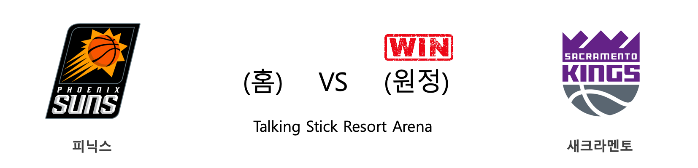
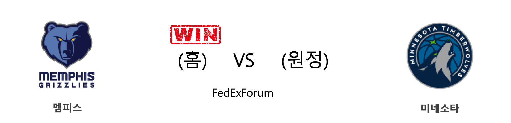
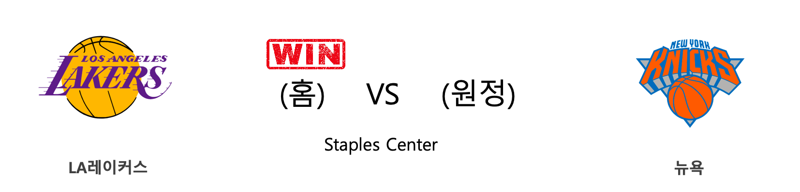

####  클리블랜드(홈) VS 디트로이트(원정) 

<table class="tg">
  <tr>
    <th class="tg-rr9t">CLE</th>
    <th class="tg-rr9t">팀</th>
    <th class="tg-rr9t">DET</th>
  </tr>
  <tr>
    <td class="tg-dcpn">0승 2패</td>
    <td class="tg-rr9t">시즌 상대전적</td>
    <td class="tg-dcpn">2승 0패</td>
  </tr>
  <tr>
    <td class="tg-dcpn">113</td>
    <td class="tg-rr9t">점수</td>
    <td class="tg-dcpn">115</td>
  </tr>
  <tr>
    <td class="tg-dcpn">28/54(52%)</td>
    <td class="tg-rr9t">2점(%)</td>
    <td class="tg-dcpn">29/58(50%)</td>
  </tr>
  <tr>
    <td class="tg-dcpn">14/31(45%)</td>
    <td class="tg-rr9t">3점(%)</td>
    <td class="tg-dcpn">13/33(39%)</td>
  </tr>
  <tr>
    <td class="tg-dcpn">15/16(94%)</td>
    <td class="tg-rr9t">자유투(%)</td>
    <td class="tg-dcpn">18/21(86%)</td>
  </tr>
  <tr>
    <td class="tg-dcpn">46</td>
    <td class="tg-rr9t">리바운드</td>
    <td class="tg-dcpn">40</td>
  </tr>
  <tr>
    <td class="tg-dcpn">29</td>
    <td class="tg-rr9t">어시스트</td>
    <td class="tg-dcpn">26</td>
  </tr>
  <tr>
    <td class="tg-dcpn">7</td>
    <td class="tg-rr9t">스틸</td>
    <td class="tg-dcpn">8</td>
  </tr>
  <tr>
    <td class="tg-dcpn">4</td>
    <td class="tg-rr9t">블록</td>
    <td class="tg-dcpn">3</td>
  </tr>
  <tr>
    <td class="tg-dcpn">16</td>
    <td class="tg-rr9t">턴오버</td>
    <td class="tg-dcpn">9</td>
  </tr>
  <tr>
    <td class="tg-dcpn">CediOsmanF(17) KevinLoveF(30) CollinSextonG(20)</td>
    <td class="tg-rr9t">주요 득점선수</td>
    <td class="tg-dcpn">SekouDoumbouy(15) DerrickRose(24) AndreDrummond(23) TonySnellF(18)</td>
  </tr>
</table>

#### 경기 관련 주요 기사         

['로즈 24점' DET, CLE에 짜릿한 역전승](http://www.rookie.co.kr/news/articleView.html?idxno=37667)

[[오늘의 NBA] (1/6) 몬트레즐 해럴, 클리퍼스의 희소재](http://sports.news.naver.com/basketball/news/read.nhn?oid=486&aid=0000001188)

[[오늘의 NBA] (12/29) 마이애미, 연장전 승부 전문가](http://sports.news.naver.com/basketball/news/read.nhn?oid=486&aid=0000001180)

[[오늘의 NBA] (1/3) 마이클 포터 주니어, 덴버의 기다림에 응답하다!](http://sports.news.naver.com/basketball/news/read.nhn?oid=486&aid=0000001185)

[[오늘의 NBA] (12/31) 불의 군주 워싱턴](http://sports.news.naver.com/basketball/news/read.nhn?oid=486&aid=0000001182)

        
        

####  피닉스(홈) VS 새크라멘토(원정) 

<table class="tg">
  <tr>
    <th class="tg-rr9t">PHX</th>
    <th class="tg-rr9t">팀</th>
    <th class="tg-rr9t">SAC</th>
  </tr>
  <tr>
    <td class="tg-dcpn">2승 2패</td>
    <td class="tg-rr9t">시즌 상대전적</td>
    <td class="tg-dcpn">2승 2패</td>
  </tr>
  <tr>
    <td class="tg-dcpn">103</td>
    <td class="tg-rr9t">점수</td>
    <td class="tg-dcpn">114</td>
  </tr>
  <tr>
    <td class="tg-dcpn">26/42(62%)</td>
    <td class="tg-rr9t">2점(%)</td>
    <td class="tg-dcpn">22/48(46%)</td>
  </tr>
  <tr>
    <td class="tg-dcpn">11/35(31%)</td>
    <td class="tg-rr9t">3점(%)</td>
    <td class="tg-dcpn">15/36(42%)</td>
  </tr>
  <tr>
    <td class="tg-dcpn">18/22(82%)</td>
    <td class="tg-rr9t">자유투(%)</td>
    <td class="tg-dcpn">25/28(89%)</td>
  </tr>
  <tr>
    <td class="tg-dcpn">41</td>
    <td class="tg-rr9t">리바운드</td>
    <td class="tg-dcpn">41</td>
  </tr>
  <tr>
    <td class="tg-dcpn">24</td>
    <td class="tg-rr9t">어시스트</td>
    <td class="tg-dcpn">18</td>
  </tr>
  <tr>
    <td class="tg-dcpn">4</td>
    <td class="tg-rr9t">스틸</td>
    <td class="tg-dcpn">8</td>
  </tr>
  <tr>
    <td class="tg-dcpn">2</td>
    <td class="tg-rr9t">블록</td>
    <td class="tg-dcpn">1</td>
  </tr>
  <tr>
    <td class="tg-dcpn">17</td>
    <td class="tg-rr9t">턴오버</td>
    <td class="tg-dcpn">15</td>
  </tr>
  <tr>
    <td class="tg-dcpn">DevinBookerG(34) DeandreAytonF(21) KellyOubreJr.(17)</td>
    <td class="tg-rr9t">주요 득점선수</td>
    <td class="tg-dcpn">BuddyHieldG(16) De'AaronFoxG(27) NemanjaBjelic(19) TrevorAriza(15)</td>
  </tr>
</table>

#### 경기 관련 주요 기사         

[[오늘의 NBA] (12/29) 마이애미, 연장전 승부 전문가](http://sports.news.naver.com/basketball/news/read.nhn?oid=486&aid=0000001180)

[[오늘의 NBA] (12/10) 데릭 로즈, 모터 시티의 해결사](http://sports.news.naver.com/basketball/news/read.nhn?oid=486&aid=0000001162)

[[오늘의 NBA] (1/8) POR 데미안 릴라드&카멜로 앤써니, 대역전극을 연출하다](http://sports.news.naver.com/basketball/news/read.nhn?oid=486&aid=0000001190)

[[오늘의 NBA] (12/21) 크리스탑스 포르징기스, 댈러스의 새로운 버팀목](http://sports.news.naver.com/basketball/news/read.nhn?oid=486&aid=0000001173)

[[오늘의 NBA] (11/30) 인디애나, 동부컨퍼런스의 복병](http://sports.news.naver.com/basketball/news/read.nhn?oid=486&aid=0000001152)

        
        

####  토론토(홈) VS 포틀랜드(원정) 

<table class="tg">
  <tr>
    <th class="tg-rr9t">TOR</th>
    <th class="tg-rr9t">팀</th>
    <th class="tg-rr9t">POR</th>
  </tr>
  <tr>
    <td class="tg-dcpn">1승 1패</td>
    <td class="tg-rr9t">시즌 상대전적</td>
    <td class="tg-dcpn">1승 1패</td>
  </tr>
  <tr>
    <td class="tg-dcpn">99</td>
    <td class="tg-rr9t">점수</td>
    <td class="tg-dcpn">101</td>
  </tr>
  <tr>
    <td class="tg-dcpn">20/54(37%)</td>
    <td class="tg-rr9t">2점(%)</td>
    <td class="tg-dcpn">25/53(47%)</td>
  </tr>
  <tr>
    <td class="tg-dcpn">15/42(36%)</td>
    <td class="tg-rr9t">3점(%)</td>
    <td class="tg-dcpn">13/35(37%)</td>
  </tr>
  <tr>
    <td class="tg-dcpn">14/19(74%)</td>
    <td class="tg-rr9t">자유투(%)</td>
    <td class="tg-dcpn">12/14(86%)</td>
  </tr>
  <tr>
    <td class="tg-dcpn">57</td>
    <td class="tg-rr9t">리바운드</td>
    <td class="tg-dcpn">45</td>
  </tr>
  <tr>
    <td class="tg-dcpn">21</td>
    <td class="tg-rr9t">어시스트</td>
    <td class="tg-dcpn">23</td>
  </tr>
  <tr>
    <td class="tg-dcpn">5</td>
    <td class="tg-rr9t">스틸</td>
    <td class="tg-dcpn">6</td>
  </tr>
  <tr>
    <td class="tg-dcpn">7</td>
    <td class="tg-rr9t">블록</td>
    <td class="tg-dcpn">11</td>
  </tr>
  <tr>
    <td class="tg-dcpn">13</td>
    <td class="tg-rr9t">턴오버</td>
    <td class="tg-dcpn">10</td>
  </tr>
  <tr>
    <td class="tg-dcpn">KyleLowryG(24) SergeIbakaC(17)</td>
    <td class="tg-rr9t">주요 득점선수</td>
    <td class="tg-dcpn">DamianLillard(20) CarmeloAnthon(28)</td>
  </tr>
</table>

#### 경기 관련 주요 기사         

[[오늘의 NBA] (1/7) ORL 마켈 펄츠의 커리어 나이트](http://sports.news.naver.com/basketball/news/read.nhn?oid=486&aid=0000001189)

[[오늘의 NBA] (1/2) 미첼 로빈슨, MSG 코트의 새로운 희망](http://sports.news.naver.com/basketball/news/read.nhn?oid=486&aid=0000001184)

[[오늘의 NBA] (12/29) 마이애미, 연장전 승부 전문가](http://sports.news.naver.com/basketball/news/read.nhn?oid=486&aid=0000001180)

[[오늘의 NBA] (1/8) POR 데미안 릴라드&카멜로 앤써니, 대역전극을 연출하다](http://sports.news.naver.com/basketball/news/read.nhn?oid=486&aid=0000001190)

[[오늘의 NBA] (12/21) 크리스탑스 포르징기스, 댈러스의 새로운 버팀목](http://sports.news.naver.com/basketball/news/read.nhn?oid=486&aid=0000001173)

        
        

####  멤피스(홈) VS 미네소타(원정) 

<table class="tg">
  <tr>
    <th class="tg-rr9t">MEM</th>
    <th class="tg-rr9t">팀</th>
    <th class="tg-rr9t">MIN</th>
  </tr>
  <tr>
    <td class="tg-dcpn">3승 0패</td>
    <td class="tg-rr9t">시즌 상대전적</td>
    <td class="tg-dcpn">0승 3패</td>
  </tr>
  <tr>
    <td class="tg-dcpn">119</td>
    <td class="tg-rr9t">점수</td>
    <td class="tg-dcpn">112</td>
  </tr>
  <tr>
    <td class="tg-dcpn">38/61(62%)</td>
    <td class="tg-rr9t">2점(%)</td>
    <td class="tg-dcpn">25/43(58%)</td>
  </tr>
  <tr>
    <td class="tg-dcpn">8/28(29%)</td>
    <td class="tg-rr9t">3점(%)</td>
    <td class="tg-dcpn">15/47(32%)</td>
  </tr>
  <tr>
    <td class="tg-dcpn">19/21(90%)</td>
    <td class="tg-rr9t">자유투(%)</td>
    <td class="tg-dcpn">17/21(81%)</td>
  </tr>
  <tr>
    <td class="tg-dcpn">45</td>
    <td class="tg-rr9t">리바운드</td>
    <td class="tg-dcpn">40</td>
  </tr>
  <tr>
    <td class="tg-dcpn">22</td>
    <td class="tg-rr9t">어시스트</td>
    <td class="tg-dcpn">23</td>
  </tr>
  <tr>
    <td class="tg-dcpn">12</td>
    <td class="tg-rr9t">스틸</td>
    <td class="tg-dcpn">10</td>
  </tr>
  <tr>
    <td class="tg-dcpn">6</td>
    <td class="tg-rr9t">블록</td>
    <td class="tg-dcpn">1</td>
  </tr>
  <tr>
    <td class="tg-dcpn">16</td>
    <td class="tg-rr9t">턴오버</td>
    <td class="tg-dcpn">18</td>
  </tr>
  <tr>
    <td class="tg-dcpn">DillonBrooksG(28) JarenJacksonJ(21) JaMorantG(25)</td>
    <td class="tg-rr9t">주요 득점선수</td>
    <td class="tg-dcpn">JeffTeague(18) JarrettCulver(24) AndrewWiggins(15) RobertCovingt(17)</td>
  </tr>
</table>

#### 경기 관련 주요 기사         

[[오늘의 NBA] (1/6) 몬트레즐 해럴, 클리퍼스의 희소재](http://sports.news.naver.com/basketball/news/read.nhn?oid=486&aid=0000001188)

[[오늘의 NBA] (12/29) 마이애미, 연장전 승부 전문가](http://sports.news.naver.com/basketball/news/read.nhn?oid=486&aid=0000001180)

[[오늘의 NBA] (1/8) POR 데미안 릴라드&카멜로 앤써니, 대역전극을 연출하다](http://sports.news.naver.com/basketball/news/read.nhn?oid=486&aid=0000001190)

[[오늘의 NBA] (12/21) 크리스탑스 포르징기스, 댈러스의 새로운 버팀목](http://sports.news.naver.com/basketball/news/read.nhn?oid=486&aid=0000001173)

[[오늘의 NBA] (12/24) 자말 머레이와 데빈 부커의 뒤틀린 운명](http://sports.news.naver.com/basketball/news/read.nhn?oid=486&aid=0000001176)

        
        

####  LA레이커스(홈) VS 뉴욕(원정) 

<table class="tg">
  <tr>
    <th class="tg-rr9t">LAL</th>
    <th class="tg-rr9t">팀</th>
    <th class="tg-rr9t">NYK</th>
  </tr>
  <tr>
    <td class="tg-dcpn">1승 0패</td>
    <td class="tg-rr9t">시즌 상대전적</td>
    <td class="tg-dcpn">0승 1패</td>
  </tr>
  <tr>
    <td class="tg-dcpn">117</td>
    <td class="tg-rr9t">점수</td>
    <td class="tg-dcpn">87</td>
  </tr>
  <tr>
    <td class="tg-dcpn">24/46(52%)</td>
    <td class="tg-rr9t">2점(%)</td>
    <td class="tg-dcpn">33/75(44%)</td>
  </tr>
  <tr>
    <td class="tg-dcpn">17/36(47%)</td>
    <td class="tg-rr9t">3점(%)</td>
    <td class="tg-dcpn">4/20(20%)</td>
  </tr>
  <tr>
    <td class="tg-dcpn">18/21(86%)</td>
    <td class="tg-rr9t">자유투(%)</td>
    <td class="tg-dcpn">9/16(56%)</td>
  </tr>
  <tr>
    <td class="tg-dcpn">48</td>
    <td class="tg-rr9t">리바운드</td>
    <td class="tg-dcpn">47</td>
  </tr>
  <tr>
    <td class="tg-dcpn">27</td>
    <td class="tg-rr9t">어시스트</td>
    <td class="tg-dcpn">15</td>
  </tr>
  <tr>
    <td class="tg-dcpn">12</td>
    <td class="tg-rr9t">스틸</td>
    <td class="tg-dcpn">11</td>
  </tr>
  <tr>
    <td class="tg-dcpn">11</td>
    <td class="tg-rr9t">블록</td>
    <td class="tg-dcpn">3</td>
  </tr>
  <tr>
    <td class="tg-dcpn">18</td>
    <td class="tg-rr9t">턴오버</td>
    <td class="tg-dcpn">17</td>
  </tr>
  <tr>
    <td class="tg-dcpn">KyleKuzma(16) KentaviousCal(15) LeBronJamesF(31)</td>
    <td class="tg-rr9t">주요 득점선수</td>
    <td class="tg-dcpn">RJBarrettG(19) JuliusRandleF(15)</td>
  </tr>
</table>

#### 경기 관련 주요 기사         

[[오늘의 NBA] (12/29) 마이애미, 연장전 승부 전문가](http://sports.news.naver.com/basketball/news/read.nhn?oid=486&aid=0000001180)

[[오늘의 NBA] (1/2) 미첼 로빈슨, MSG 코트의 새로운 희망](http://sports.news.naver.com/basketball/news/read.nhn?oid=486&aid=0000001184)

[[오늘의 NBA] (1/8) POR 데미안 릴라드&카멜로 앤써니, 대역전극을 연출하다](http://sports.news.naver.com/basketball/news/read.nhn?oid=486&aid=0000001190)

[[오늘의 NBA] (12/18) 인디애나, LAL 원정 연승 행진을 멈추다](http://sports.news.naver.com/basketball/news/read.nhn?oid=486&aid=0000001170)

[[오늘의 NBA] (12/20) 밀워키, 리그 전체 단독 1위 등극!](http://sports.news.naver.com/basketball/news/read.nhn?oid=486&aid=0000001172)

        
        

####  브루클린(홈) VS 오클라호마씨티(원정) 

<table class="tg">
  <tr>
    <th class="tg-rr9t">BKN</th>
    <th class="tg-rr9t">팀</th>
    <th class="tg-rr9t">OKC</th>
  </tr>
  <tr>
    <td class="tg-dcpn">0승 1패</td>
    <td class="tg-rr9t">시즌 상대전적</td>
    <td class="tg-dcpn">1승 0패</td>
  </tr>
  <tr>
    <td class="tg-dcpn">103</td>
    <td class="tg-rr9t">점수</td>
    <td class="tg-dcpn">111</td>
  </tr>
  <tr>
    <td class="tg-dcpn">29/61(48%)</td>
    <td class="tg-rr9t">2점(%)</td>
    <td class="tg-dcpn">27/55(49%)</td>
  </tr>
  <tr>
    <td class="tg-dcpn">11/37(30%)</td>
    <td class="tg-rr9t">3점(%)</td>
    <td class="tg-dcpn">11/37(30%)</td>
  </tr>
  <tr>
    <td class="tg-dcpn">12/16(75%)</td>
    <td class="tg-rr9t">자유투(%)</td>
    <td class="tg-dcpn">24/29(83%)</td>
  </tr>
  <tr>
    <td class="tg-dcpn">52</td>
    <td class="tg-rr9t">리바운드</td>
    <td class="tg-dcpn">51</td>
  </tr>
  <tr>
    <td class="tg-dcpn">19</td>
    <td class="tg-rr9t">어시스트</td>
    <td class="tg-dcpn">19</td>
  </tr>
  <tr>
    <td class="tg-dcpn">5</td>
    <td class="tg-rr9t">스틸</td>
    <td class="tg-dcpn">11</td>
  </tr>
  <tr>
    <td class="tg-dcpn">5</td>
    <td class="tg-rr9t">블록</td>
    <td class="tg-dcpn">3</td>
  </tr>
  <tr>
    <td class="tg-dcpn">17</td>
    <td class="tg-rr9t">턴오버</td>
    <td class="tg-dcpn">15</td>
  </tr>
  <tr>
    <td class="tg-dcpn">CarisLeVert(20) TaureanPrince(21)</td>
    <td class="tg-rr9t">주요 득점선수</td>
    <td class="tg-dcpn">ShaiGilgeous-(22) ChrisPaulG(28)</td>
  </tr>
</table>

#### 경기 관련 주요 기사         

[[오늘의 NBA] (1/8) POR 데미안 릴라드&카멜로 앤써니, 대역전극을 연출하다](http://sports.news.naver.com/basketball/news/read.nhn?oid=486&aid=0000001190)

[[오늘의 NBA] (1/4) 제임스 하든, NBA 공격 코트의 지배자](http://sports.news.naver.com/basketball/news/read.nhn?oid=486&aid=0000001186)

[[오늘의 NBA] (1/7) ORL 마켈 펄츠의 커리어 나이트](http://sports.news.naver.com/basketball/news/read.nhn?oid=486&aid=0000001189)

[[오늘의 NBA] (12/27) 댈러스, 루카 돈치치 부상 복귀전 승리!](http://sports.news.naver.com/basketball/news/read.nhn?oid=486&aid=0000001178)

[[오늘의 NBA] (1/6) 몬트레즐 해럴, 클리퍼스의 희소재](http://sports.news.naver.com/basketball/news/read.nhn?oid=486&aid=0000001188)

        
        

#### 리그 (Eastern) 순위
    

<table class="tg">
  <tr>
    <th class="tg-d14o">순위</th>
    <th class="tg-d14o">팀명</th>
    <th class="tg-d14o">경기수</th>
    <th class="tg-d14o">승</th>
    <th class="tg-d14o">패</th>
    <th class="tg-d14o">승차</th>
    <th class="tg-d14o">승률</th>
  </tr>
  
<tr>
    <td class="tg-50j8">1</td>
    <td class="tg-50j8">MIL</td>
    <td class="tg-50j8">37</td>
    <td class="tg-50j8">31</td>
    <td class="tg-50j8">6</td>
    <td class="tg-50j8">0</td>
    <td class="tg-50j8">0.838</td>
</tr>

<tr>
    <td class="tg-50j8">2</td>
    <td class="tg-50j8">MIA</td>
    <td class="tg-50j8">35</td>
    <td class="tg-50j8">26</td>
    <td class="tg-50j8">9</td>
    <td class="tg-50j8">5</td>
    <td class="tg-50j8">0.743</td>
</tr>

<tr>
    <td class="tg-50j8">3</td>
    <td class="tg-50j8">BOS</td>
    <td class="tg-50j8">33</td>
    <td class="tg-50j8">25</td>
    <td class="tg-50j8">8</td>
    <td class="tg-50j8">6</td>
    <td class="tg-50j8">0.758</td>
</tr>

<tr>
    <td class="tg-50j8">4</td>
    <td class="tg-50j8">TOR</td>
    <td class="tg-50j8">37</td>
    <td class="tg-50j8">24</td>
    <td class="tg-50j8">13</td>
    <td class="tg-50j8">7</td>
    <td class="tg-50j8">0.649</td>
</tr>

<tr>
    <td class="tg-50j8">5</td>
    <td class="tg-50j8">PHI</td>
    <td class="tg-50j8">37</td>
    <td class="tg-50j8">23</td>
    <td class="tg-50j8">14</td>
    <td class="tg-50j8">8</td>
    <td class="tg-50j8">0.622</td>
</tr>

<tr>
    <td class="tg-50j8">5</td>
    <td class="tg-50j8">IND</td>
    <td class="tg-50j8">37</td>
    <td class="tg-50j8">23</td>
    <td class="tg-50j8">14</td>
    <td class="tg-50j8">8</td>
    <td class="tg-50j8">0.622</td>
</tr>

<tr>
    <td class="tg-50j8">7</td>
    <td class="tg-50j8">ORL</td>
    <td class="tg-50j8">36</td>
    <td class="tg-50j8">17</td>
    <td class="tg-50j8">19</td>
    <td class="tg-50j8">14</td>
    <td class="tg-50j8">0.472</td>
</tr>

<tr>
    <td class="tg-50j8">8</td>
    <td class="tg-50j8">BKN</td>
    <td class="tg-50j8">35</td>
    <td class="tg-50j8">16</td>
    <td class="tg-50j8">19</td>
    <td class="tg-50j8">15</td>
    <td class="tg-50j8">0.457</td>
</tr>

<tr>
    <td class="tg-50j8">9</td>
    <td class="tg-50j8">CHA</td>
    <td class="tg-50j8">39</td>
    <td class="tg-50j8">15</td>
    <td class="tg-50j8">24</td>
    <td class="tg-50j8">16</td>
    <td class="tg-50j8">0.385</td>
</tr>

<tr>
    <td class="tg-50j8">10</td>
    <td class="tg-50j8">DET</td>
    <td class="tg-50j8">36</td>
    <td class="tg-50j8">14</td>
    <td class="tg-50j8">22</td>
    <td class="tg-50j8">17</td>
    <td class="tg-50j8">0.389</td>
</tr>

<tr>
    <td class="tg-50j8">11</td>
    <td class="tg-50j8">CHI</td>
    <td class="tg-50j8">36</td>
    <td class="tg-50j8">13</td>
    <td class="tg-50j8">23</td>
    <td class="tg-50j8">18</td>
    <td class="tg-50j8">0.361</td>
</tr>

<tr>
    <td class="tg-50j8">12</td>
    <td class="tg-50j8">WAS</td>
    <td class="tg-50j8">35</td>
    <td class="tg-50j8">11</td>
    <td class="tg-50j8">24</td>
    <td class="tg-50j8">20</td>
    <td class="tg-50j8">0.314</td>
</tr>

<tr>
    <td class="tg-50j8">13</td>
    <td class="tg-50j8">NYK</td>
    <td class="tg-50j8">37</td>
    <td class="tg-50j8">10</td>
    <td class="tg-50j8">27</td>
    <td class="tg-50j8">21</td>
    <td class="tg-50j8">0.27</td>
</tr>

<tr>
    <td class="tg-50j8">14</td>
    <td class="tg-50j8">CLE</td>
    <td class="tg-50j8">36</td>
    <td class="tg-50j8">9</td>
    <td class="tg-50j8">27</td>
    <td class="tg-50j8">22</td>
    <td class="tg-50j8">0.25</td>
</tr>

<tr>
    <td class="tg-50j8">15</td>
    <td class="tg-50j8">ATL</td>
    <td class="tg-50j8">36</td>
    <td class="tg-50j8">7</td>
    <td class="tg-50j8">29</td>
    <td class="tg-50j8">24</td>
    <td class="tg-50j8">0.194</td>
</tr>
</table> 
#### 리그 (Western) 순위
    

<table class="tg">
  <tr>
    <th class="tg-d14o">순위</th>
    <th class="tg-d14o">팀명</th>
    <th class="tg-d14o">경기수</th>
    <th class="tg-d14o">승</th>
    <th class="tg-d14o">패</th>
    <th class="tg-d14o">승차</th>
    <th class="tg-d14o">승률</th>
  </tr>
  
<tr>
    <td class="tg-50j8">1</td>
    <td class="tg-50j8">LAL</td>
    <td class="tg-50j8">37</td>
    <td class="tg-50j8">30</td>
    <td class="tg-50j8">7</td>
    <td class="tg-50j8">1</td>
    <td class="tg-50j8">0.811</td>
</tr>

<tr>
    <td class="tg-50j8">2</td>
    <td class="tg-50j8">LAC</td>
    <td class="tg-50j8">38</td>
    <td class="tg-50j8">26</td>
    <td class="tg-50j8">12</td>
    <td class="tg-50j8">5</td>
    <td class="tg-50j8">0.684</td>
</tr>

<tr>
    <td class="tg-50j8">3</td>
    <td class="tg-50j8">HOU</td>
    <td class="tg-50j8">35</td>
    <td class="tg-50j8">24</td>
    <td class="tg-50j8">11</td>
    <td class="tg-50j8">7</td>
    <td class="tg-50j8">0.686</td>
</tr>

<tr>
    <td class="tg-50j8">3</td>
    <td class="tg-50j8">DEN</td>
    <td class="tg-50j8">35</td>
    <td class="tg-50j8">24</td>
    <td class="tg-50j8">11</td>
    <td class="tg-50j8">7</td>
    <td class="tg-50j8">0.686</td>
</tr>

<tr>
    <td class="tg-50j8">5</td>
    <td class="tg-50j8">UTA</td>
    <td class="tg-50j8">35</td>
    <td class="tg-50j8">23</td>
    <td class="tg-50j8">12</td>
    <td class="tg-50j8">8</td>
    <td class="tg-50j8">0.657</td>
</tr>

<tr>
    <td class="tg-50j8">6</td>
    <td class="tg-50j8">DAL</td>
    <td class="tg-50j8">35</td>
    <td class="tg-50j8">22</td>
    <td class="tg-50j8">13</td>
    <td class="tg-50j8">9</td>
    <td class="tg-50j8">0.629</td>
</tr>

<tr>
    <td class="tg-50j8">7</td>
    <td class="tg-50j8">OKC</td>
    <td class="tg-50j8">37</td>
    <td class="tg-50j8">21</td>
    <td class="tg-50j8">16</td>
    <td class="tg-50j8">10</td>
    <td class="tg-50j8">0.568</td>
</tr>

<tr>
    <td class="tg-50j8">8</td>
    <td class="tg-50j8">POR</td>
    <td class="tg-50j8">36</td>
    <td class="tg-50j8">16</td>
    <td class="tg-50j8">20</td>
    <td class="tg-50j8">15</td>
    <td class="tg-50j8">0.444</td>
</tr>

<tr>
    <td class="tg-50j8">9</td>
    <td class="tg-50j8">MEM</td>
    <td class="tg-50j8">38</td>
    <td class="tg-50j8">16</td>
    <td class="tg-50j8">22</td>
    <td class="tg-50j8">15</td>
    <td class="tg-50j8">0.421</td>
</tr>

<tr>
    <td class="tg-50j8">10</td>
    <td class="tg-50j8">SAS</td>
    <td class="tg-50j8">34</td>
    <td class="tg-50j8">15</td>
    <td class="tg-50j8">19</td>
    <td class="tg-50j8">16</td>
    <td class="tg-50j8">0.441</td>
</tr>

<tr>
    <td class="tg-50j8">11</td>
    <td class="tg-50j8">SAC</td>
    <td class="tg-50j8">38</td>
    <td class="tg-50j8">15</td>
    <td class="tg-50j8">23</td>
    <td class="tg-50j8">16</td>
    <td class="tg-50j8">0.395</td>
</tr>

<tr>
    <td class="tg-50j8">12</td>
    <td class="tg-50j8">MIN</td>
    <td class="tg-50j8">35</td>
    <td class="tg-50j8">13</td>
    <td class="tg-50j8">22</td>
    <td class="tg-50j8">18</td>
    <td class="tg-50j8">0.371</td>
</tr>

<tr>
    <td class="tg-50j8">13</td>
    <td class="tg-50j8">PHX</td>
    <td class="tg-50j8">36</td>
    <td class="tg-50j8">13</td>
    <td class="tg-50j8">23</td>
    <td class="tg-50j8">18</td>
    <td class="tg-50j8">0.361</td>
</tr>

<tr>
    <td class="tg-50j8">14</td>
    <td class="tg-50j8">NOP</td>
    <td class="tg-50j8">37</td>
    <td class="tg-50j8">12</td>
    <td class="tg-50j8">25</td>
    <td class="tg-50j8">19</td>
    <td class="tg-50j8">0.324</td>
</tr>

<tr>
    <td class="tg-50j8">15</td>
    <td class="tg-50j8">GSW</td>
    <td class="tg-50j8">38</td>
    <td class="tg-50j8">9</td>
    <td class="tg-50j8">29</td>
    <td class="tg-50j8">22</td>
    <td class="tg-50j8">0.237</td>
</tr>
</table> 

        
        
#nba #미국농구 #엔비에이 #농구분석 #토토 #스포츠토토 #경기예측 #농구결과 #20200108 #클리블랜드 #디트로이트 #피닉스 #새크라멘토 #토론토 #포틀랜드 #멤피스 #미네소타 #LA레이커스 #뉴욕 #브루클린 #오클라호마씨티 #클리블랜드디트로이트 #피닉스새크라멘토 #토론토포틀랜드 #멤피스미네소타 #LA레이커스뉴욕 #브루클린오클라호마씨티 