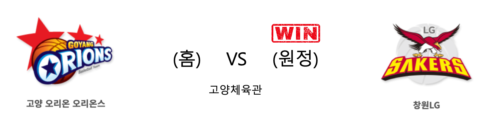

####  고양오리온(홈) VS 창원LG(원정) 

<table class="tg">
  <tr>
    <th class="tg-rr9t">고양오리온</th>
    <th class="tg-rr9t">팀</th>
    <th class="tg-rr9t">창원LG</th>
  </tr>
  <tr>
    <td class="tg-dcpn">2승 2패</td>
    <td class="tg-rr9t">시즌 상대전적</td>
    <td class="tg-dcpn">2승 2패</td>
  </tr>
  <tr>
    <td class="tg-dcpn">64</td>
    <td class="tg-rr9t">점수</td>
    <td class="tg-dcpn">76</td>
  </tr>
  <tr>
    <td class="tg-dcpn">17/41(41%)</td>
    <td class="tg-rr9t">2점(%)</td>
    <td class="tg-dcpn">23/49(47%)</td>
  </tr>
  <tr>
    <td class="tg-dcpn">7/22(32%)</td>
    <td class="tg-rr9t">3점(%)</td>
    <td class="tg-dcpn">7/17(41%)</td>
  </tr>
  <tr>
    <td class="tg-dcpn">9/17(53%)</td>
    <td class="tg-rr9t">자유투(%)</td>
    <td class="tg-dcpn">9/13(69%)</td>
  </tr>
  <tr>
    <td class="tg-dcpn">34</td>
    <td class="tg-rr9t">리바운드</td>
    <td class="tg-dcpn">37</td>
  </tr>
  <tr>
    <td class="tg-dcpn">0</td>
    <td class="tg-rr9t">어시스트</td>
    <td class="tg-dcpn">0</td>
  </tr>
  <tr>
    <td class="tg-dcpn">11</td>
    <td class="tg-rr9t">스틸</td>
    <td class="tg-dcpn">7</td>
  </tr>
  <tr>
    <td class="tg-dcpn">5</td>
    <td class="tg-rr9t">블록</td>
    <td class="tg-dcpn">4</td>
  </tr>
  <tr>
    <td class="tg-dcpn">19</td>
    <td class="tg-rr9t">턴오버</td>
    <td class="tg-dcpn">15</td>
  </tr>
  <tr>
    <td class="tg-dcpn">임종일(16)</td>
    <td class="tg-rr9t">주요 득점선수</td>
    <td class="tg-dcpn">캐디 라렌(22)</td>
  </tr>
</table>

#### 경기 관련 주요 기사         

[어깨 부상 당한 오리온 최진수](http://news1.kr/photos/view/?4002543)

[[포토]더블팀에 막힌 오리온 임종일](http://www.sportsseoul.com/news/read/870830)

[LG, 오리온 꺾고 승리](http://www.newsis.com/view/?id=NISI20200109_0015964397)

[고양 오리온 꺾은 창원 LG](http://news1.kr/photos/view/?4002661)

        
        

#### 리그 순위

<table class="tg">
  <tr>
    <th class="tg-d14o">순위</th>
    <th class="tg-d14o">팀명</th>
    <th class="tg-d14o">경기수</th>
    <th class="tg-d14o">승</th>
    <th class="tg-d14o">패</th>
    <th class="tg-d14o">승차</th>
    <th class="tg-d14o">승률</th>
  </tr>
  
<tr>
    <td class="tg-50j8">1</td>
    <td class="tg-50j8">안양KGC</td>
    <td class="tg-50j8">31</td>
    <td class="tg-50j8">20</td>
    <td class="tg-50j8">11</td>
    <td class="tg-50j8">0</td>
    <td class="tg-50j8">0.645</td>
</tr>

<tr>
    <td class="tg-50j8">2</td>
    <td class="tg-50j8">서울SK</td>
    <td class="tg-50j8">30</td>
    <td class="tg-50j8">19</td>
    <td class="tg-50j8">11</td>
    <td class="tg-50j8">1</td>
    <td class="tg-50j8">0.633</td>
</tr>

<tr>
    <td class="tg-50j8">3</td>
    <td class="tg-50j8">전주KCC</td>
    <td class="tg-50j8">30</td>
    <td class="tg-50j8">18</td>
    <td class="tg-50j8">12</td>
    <td class="tg-50j8">2</td>
    <td class="tg-50j8">0.6</td>
</tr>

<tr>
    <td class="tg-50j8">4</td>
    <td class="tg-50j8">인천전자랜드</td>
    <td class="tg-50j8">31</td>
    <td class="tg-50j8">18</td>
    <td class="tg-50j8">13</td>
    <td class="tg-50j8">2</td>
    <td class="tg-50j8">0.581</td>
</tr>

<tr>
    <td class="tg-50j8">5</td>
    <td class="tg-50j8">원주DB</td>
    <td class="tg-50j8">29</td>
    <td class="tg-50j8">16</td>
    <td class="tg-50j8">13</td>
    <td class="tg-50j8">4</td>
    <td class="tg-50j8">0.552</td>
</tr>

<tr>
    <td class="tg-50j8">6</td>
    <td class="tg-50j8">울산현대모비스</td>
    <td class="tg-50j8">31</td>
    <td class="tg-50j8">14</td>
    <td class="tg-50j8">17</td>
    <td class="tg-50j8">6</td>
    <td class="tg-50j8">0.452</td>
</tr>

<tr>
    <td class="tg-50j8">6</td>
    <td class="tg-50j8">부산KT</td>
    <td class="tg-50j8">31</td>
    <td class="tg-50j8">14</td>
    <td class="tg-50j8">17</td>
    <td class="tg-50j8">6</td>
    <td class="tg-50j8">0.452</td>
</tr>

<tr>
    <td class="tg-50j8">8</td>
    <td class="tg-50j8">서울삼성</td>
    <td class="tg-50j8">31</td>
    <td class="tg-50j8">13</td>
    <td class="tg-50j8">18</td>
    <td class="tg-50j8">7</td>
    <td class="tg-50j8">0.419</td>
</tr>

<tr>
    <td class="tg-50j8">9</td>
    <td class="tg-50j8">창원LG</td>
    <td class="tg-50j8">31</td>
    <td class="tg-50j8">11</td>
    <td class="tg-50j8">20</td>
    <td class="tg-50j8">9</td>
    <td class="tg-50j8">0.355</td>
</tr>

<tr>
    <td class="tg-50j8">10</td>
    <td class="tg-50j8">고양오리온</td>
    <td class="tg-50j8">31</td>
    <td class="tg-50j8">10</td>
    <td class="tg-50j8">21</td>
    <td class="tg-50j8">10</td>
    <td class="tg-50j8">0.323</td>
</tr>
</table> 

        
        
#kbl #국내농구 #농구분석 #토토 #스포츠토토 #경기예측 #농구결과 #20200109 #고양오리온 #창원LG #고양오리온창원LG 