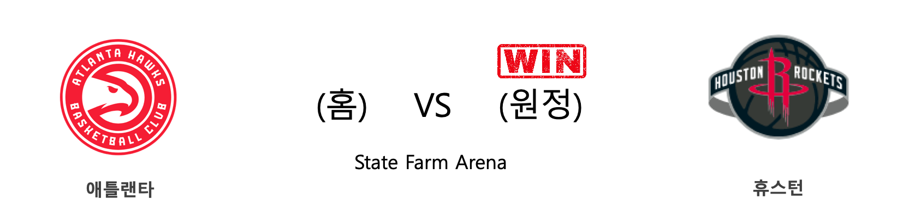
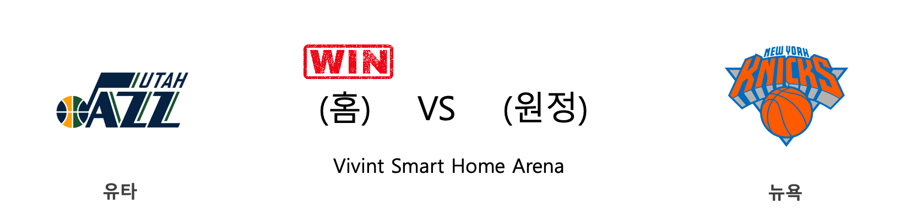
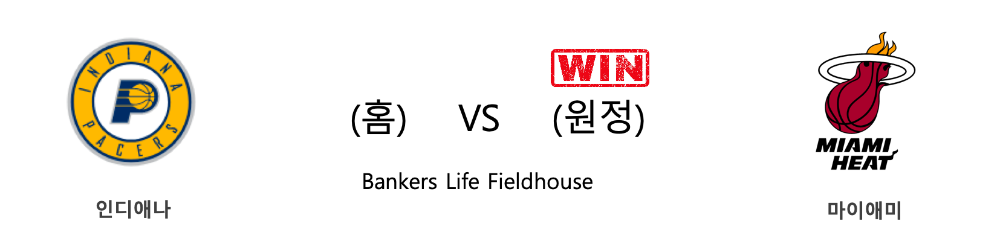
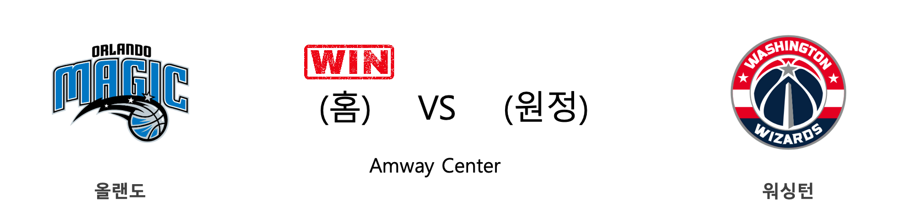
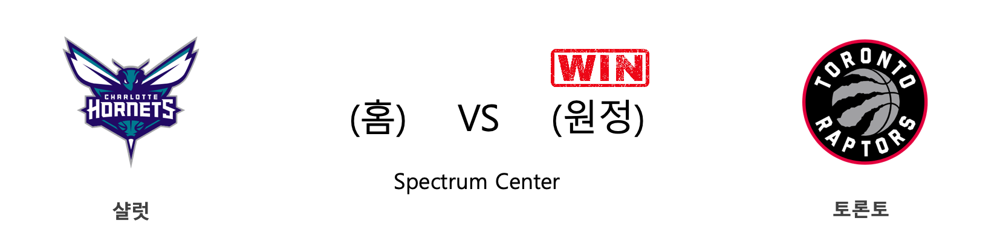
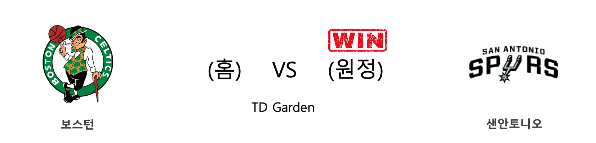
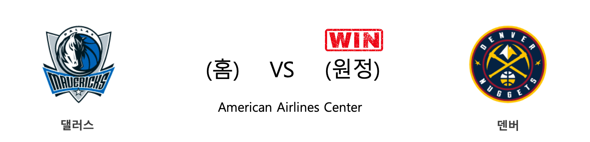
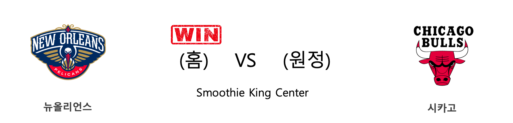

####  골든스테이트(홈) VS 밀워키(원정) 

<table class="tg">
  <tr>
    <th class="tg-rr9t">GSW</th>
    <th class="tg-rr9t">팀</th>
    <th class="tg-rr9t">MIL</th>
  </tr>
  <tr>
    <td class="tg-dcpn">0승 1패</td>
    <td class="tg-rr9t">시즌 상대전적</td>
    <td class="tg-dcpn">1승 0패</td>
  </tr>
  <tr>
    <td class="tg-dcpn">98</td>
    <td class="tg-rr9t">점수</td>
    <td class="tg-dcpn">107</td>
  </tr>
  <tr>
    <td class="tg-dcpn">18/49(37%)</td>
    <td class="tg-rr9t">2점(%)</td>
    <td class="tg-dcpn">26/46(57%)</td>
  </tr>
  <tr>
    <td class="tg-dcpn">15/38(39%)</td>
    <td class="tg-rr9t">3점(%)</td>
    <td class="tg-dcpn">9/41(22%)</td>
  </tr>
  <tr>
    <td class="tg-dcpn">17/20(85%)</td>
    <td class="tg-rr9t">자유투(%)</td>
    <td class="tg-dcpn">28/32(88%)</td>
  </tr>
  <tr>
    <td class="tg-dcpn">52</td>
    <td class="tg-rr9t">리바운드</td>
    <td class="tg-dcpn">47</td>
  </tr>
  <tr>
    <td class="tg-dcpn">29</td>
    <td class="tg-rr9t">어시스트</td>
    <td class="tg-dcpn">22</td>
  </tr>
  <tr>
    <td class="tg-dcpn">7</td>
    <td class="tg-rr9t">스틸</td>
    <td class="tg-dcpn">11</td>
  </tr>
  <tr>
    <td class="tg-dcpn">4</td>
    <td class="tg-rr9t">블록</td>
    <td class="tg-dcpn">3</td>
  </tr>
  <tr>
    <td class="tg-dcpn">18</td>
    <td class="tg-rr9t">턴오버</td>
    <td class="tg-dcpn">9</td>
  </tr>
  <tr>
    <td class="tg-dcpn">DamionLeeG(15) AlecBurks(19) GlennRobinson(15)</td>
    <td class="tg-rr9t">주요 득점선수</td>
    <td class="tg-dcpn">KhrisMiddleto(21) EricBledsoeG(16) GiannisAnteto(30)</td>
  </tr>
</table>

#### 경기 관련 주요 기사         

[[오늘의 NBA] (12/28) 골든스테이트, 수비 코트에서 시작된 대반격](http://sports.news.naver.com/basketball/news/read.nhn?oid=486&aid=0000001179)

[[오늘의 NBA] (1/5) 제이슨 테이텀, 보스턴의 밀당남](http://sports.news.naver.com/basketball/news/read.nhn?oid=486&aid=0000001187)

[[오늘의 NBA] (12/29) 마이애미, 연장전 승부 전문가](http://sports.news.naver.com/basketball/news/read.nhn?oid=486&aid=0000001180)

[[오늘의 NBA] (1/7) ORL 마켈 펄츠의 커리어 나이트](http://sports.news.naver.com/basketball/news/read.nhn?oid=486&aid=0000001189)

[[오늘의 NBA] (12/26) NBA 2019년 크리스마스 축제](http://sports.news.naver.com/basketball/news/read.nhn?oid=486&aid=0000001177)

        
        

####  애틀랜타(홈) VS 휴스턴(원정) 

<table class="tg">
  <tr>
    <th class="tg-rr9t">ATL</th>
    <th class="tg-rr9t">팀</th>
    <th class="tg-rr9t">HOU</th>
  </tr>
  <tr>
    <td class="tg-dcpn">0승 2패</td>
    <td class="tg-rr9t">시즌 상대전적</td>
    <td class="tg-dcpn">2승 0패</td>
  </tr>
  <tr>
    <td class="tg-dcpn">115</td>
    <td class="tg-rr9t">점수</td>
    <td class="tg-dcpn">122</td>
  </tr>
  <tr>
    <td class="tg-dcpn">26/62(42%)</td>
    <td class="tg-rr9t">2점(%)</td>
    <td class="tg-dcpn">26/47(55%)</td>
  </tr>
  <tr>
    <td class="tg-dcpn">13/44(30%)</td>
    <td class="tg-rr9t">3점(%)</td>
    <td class="tg-dcpn">13/45(29%)</td>
  </tr>
  <tr>
    <td class="tg-dcpn">24/27(89%)</td>
    <td class="tg-rr9t">자유투(%)</td>
    <td class="tg-dcpn">31/41(76%)</td>
  </tr>
  <tr>
    <td class="tg-dcpn">54</td>
    <td class="tg-rr9t">리바운드</td>
    <td class="tg-dcpn">59</td>
  </tr>
  <tr>
    <td class="tg-dcpn">20</td>
    <td class="tg-rr9t">어시스트</td>
    <td class="tg-dcpn">22</td>
  </tr>
  <tr>
    <td class="tg-dcpn">6</td>
    <td class="tg-rr9t">스틸</td>
    <td class="tg-dcpn">7</td>
  </tr>
  <tr>
    <td class="tg-dcpn">8</td>
    <td class="tg-rr9t">블록</td>
    <td class="tg-dcpn">7</td>
  </tr>
  <tr>
    <td class="tg-dcpn">11</td>
    <td class="tg-rr9t">턴오버</td>
    <td class="tg-dcpn">13</td>
  </tr>
  <tr>
    <td class="tg-dcpn">JohnCollinsC(17) TraeYoungG(42)</td>
    <td class="tg-rr9t">주요 득점선수</td>
    <td class="tg-dcpn">BenMcLemore(18) EricGordonG(17) ClintCapelaC(22) JamesHardenG(41)</td>
  </tr>
</table>

#### 경기 관련 주요 기사         

[[오늘의 NBA] (1/4) 제임스 하든, NBA 공격 코트의 지배자](http://sports.news.naver.com/basketball/news/read.nhn?oid=486&aid=0000001186)

[하든, 30분 뛰고 60점 '폭발'... HOU, ATL 10연패 빠뜨려](http://star.mt.co.kr/stview.php?no=2019120113385450531)

[[오늘의 NBA] (12/29) 마이애미, 연장전 승부 전문가](http://sports.news.naver.com/basketball/news/read.nhn?oid=486&aid=0000001180)

[[오늘의 NBA] (12/17) 댈러스, 밀워키 시스템을 붕괴시키다](http://sports.news.naver.com/basketball/news/read.nhn?oid=486&aid=0000001169)

[[오늘의 NBA] (12/1) 새크라멘토의 IQ 농구](http://sports.news.naver.com/basketball/news/read.nhn?oid=486&aid=0000001153)

        
        

####  유타(홈) VS 뉴욕(원정) 

<table class="tg">
  <tr>
    <th class="tg-rr9t">UTA</th>
    <th class="tg-rr9t">팀</th>
    <th class="tg-rr9t">NYK</th>
  </tr>
  <tr>
    <td class="tg-dcpn">1승 0패</td>
    <td class="tg-rr9t">시즌 상대전적</td>
    <td class="tg-dcpn">0승 1패</td>
  </tr>
  <tr>
    <td class="tg-dcpn">128</td>
    <td class="tg-rr9t">점수</td>
    <td class="tg-dcpn">104</td>
  </tr>
  <tr>
    <td class="tg-dcpn">33/47(70%)</td>
    <td class="tg-rr9t">2점(%)</td>
    <td class="tg-dcpn">33/72(46%)</td>
  </tr>
  <tr>
    <td class="tg-dcpn">16/43(37%)</td>
    <td class="tg-rr9t">3점(%)</td>
    <td class="tg-dcpn">9/25(36%)</td>
  </tr>
  <tr>
    <td class="tg-dcpn">14/23(61%)</td>
    <td class="tg-rr9t">자유투(%)</td>
    <td class="tg-dcpn">11/11(100%)</td>
  </tr>
  <tr>
    <td class="tg-dcpn">50</td>
    <td class="tg-rr9t">리바운드</td>
    <td class="tg-dcpn">41</td>
  </tr>
  <tr>
    <td class="tg-dcpn">29</td>
    <td class="tg-rr9t">어시스트</td>
    <td class="tg-dcpn">18</td>
  </tr>
  <tr>
    <td class="tg-dcpn">6</td>
    <td class="tg-rr9t">스틸</td>
    <td class="tg-dcpn">3</td>
  </tr>
  <tr>
    <td class="tg-dcpn">6</td>
    <td class="tg-rr9t">블록</td>
    <td class="tg-dcpn">1</td>
  </tr>
  <tr>
    <td class="tg-dcpn">7</td>
    <td class="tg-rr9t">턴오버</td>
    <td class="tg-dcpn">9</td>
  </tr>
  <tr>
    <td class="tg-dcpn">EmmanuelMudia(20) DonovanMitche(16) BojanBogdanov(20) RudyGobertC(16)</td>
    <td class="tg-rr9t">주요 득점선수</td>
    <td class="tg-dcpn">FrankNtilikin(16)</td>
  </tr>
</table>

#### 경기 관련 주요 기사         

[[오늘의 NBA] (12/21) 크리스탑스 포르징기스, 댈러스의 새로운 버팀목](http://sports.news.naver.com/basketball/news/read.nhn?oid=486&aid=0000001173)

[[오늘의 NBA] (1/9) 그렉 포포비치 감독의 보스턴 수비 인수분해](http://sports.news.naver.com/basketball/news/read.nhn?oid=486&aid=0000001191)

[[오늘의 NBA] (12/29) 마이애미, 연장전 승부 전문가](http://sports.news.naver.com/basketball/news/read.nhn?oid=486&aid=0000001180)

[[오늘의 NBA] (12/14) 레이커스, 마이애미 홈 코트를 점령하다](http://sports.news.naver.com/basketball/news/read.nhn?oid=486&aid=0000001166)

[[오늘의 NBA] (12/18) 인디애나, LAL 원정 연승 행진을 멈추다](http://sports.news.naver.com/basketball/news/read.nhn?oid=486&aid=0000001170)

        
        

####  인디애나(홈) VS 마이애미(원정) 

<table class="tg">
  <tr>
    <th class="tg-rr9t">IND</th>
    <th class="tg-rr9t">팀</th>
    <th class="tg-rr9t">MIA</th>
  </tr>
  <tr>
    <td class="tg-dcpn">0승 2패</td>
    <td class="tg-rr9t">시즌 상대전적</td>
    <td class="tg-dcpn">2승 0패</td>
  </tr>
  <tr>
    <td class="tg-dcpn">108</td>
    <td class="tg-rr9t">점수</td>
    <td class="tg-dcpn">122</td>
  </tr>
  <tr>
    <td class="tg-dcpn">31/57(54%)</td>
    <td class="tg-rr9t">2점(%)</td>
    <td class="tg-dcpn">27/43(63%)</td>
  </tr>
  <tr>
    <td class="tg-dcpn">9/27(33%)</td>
    <td class="tg-rr9t">3점(%)</td>
    <td class="tg-dcpn">16/38(42%)</td>
  </tr>
  <tr>
    <td class="tg-dcpn">19/25(76%)</td>
    <td class="tg-rr9t">자유투(%)</td>
    <td class="tg-dcpn">20/25(80%)</td>
  </tr>
  <tr>
    <td class="tg-dcpn">37</td>
    <td class="tg-rr9t">리바운드</td>
    <td class="tg-dcpn">41</td>
  </tr>
  <tr>
    <td class="tg-dcpn">25</td>
    <td class="tg-rr9t">어시스트</td>
    <td class="tg-dcpn">28</td>
  </tr>
  <tr>
    <td class="tg-dcpn">5</td>
    <td class="tg-rr9t">스틸</td>
    <td class="tg-dcpn">8</td>
  </tr>
  <tr>
    <td class="tg-dcpn">3</td>
    <td class="tg-rr9t">블록</td>
    <td class="tg-dcpn">4</td>
  </tr>
  <tr>
    <td class="tg-dcpn">12</td>
    <td class="tg-rr9t">턴오버</td>
    <td class="tg-dcpn">11</td>
  </tr>
  <tr>
    <td class="tg-dcpn">DomantasSabon(27)</td>
    <td class="tg-rr9t">주요 득점선수</td>
    <td class="tg-dcpn">DerrickJonesJ(18) KendrickNunnG(15) TylerHerro(19) BamAdebayoF(18) GoranDragic(15) DuncanRobinso(17)</td>
  </tr>
</table>

#### 경기 관련 주요 기사         

[[오늘의 NBA] (12/12) 제임스 하든 선생님의 심폐소생술](http://sports.news.naver.com/basketball/news/read.nhn?oid=486&aid=0000001164)

[[오늘의 NBA] (1/7) ORL 마켈 펄츠의 커리어 나이트](http://sports.news.naver.com/basketball/news/read.nhn?oid=486&aid=0000001189)

[[오늘의 NBA] (1/9) 그렉 포포비치 감독의 보스턴 수비 인수분해](http://sports.news.naver.com/basketball/news/read.nhn?oid=486&aid=0000001191)

[[오늘의 NBA] (12/28) 골든스테이트, 수비 코트에서 시작된 대반격](http://sports.news.naver.com/basketball/news/read.nhn?oid=486&aid=0000001179)

[[오늘의 NBA] (1/4) 제임스 하든, NBA 공격 코트의 지배자](http://sports.news.naver.com/basketball/news/read.nhn?oid=486&aid=0000001186)

        
        

####  올랜도(홈) VS 워싱턴(원정) 

<table class="tg">
  <tr>
    <th class="tg-rr9t">ORL</th>
    <th class="tg-rr9t">팀</th>
    <th class="tg-rr9t">WAS</th>
  </tr>
  <tr>
    <td class="tg-dcpn">4승 0패</td>
    <td class="tg-rr9t">시즌 상대전적</td>
    <td class="tg-dcpn">0승 4패</td>
  </tr>
  <tr>
    <td class="tg-dcpn">123</td>
    <td class="tg-rr9t">점수</td>
    <td class="tg-dcpn">89</td>
  </tr>
  <tr>
    <td class="tg-dcpn">33/60(55%)</td>
    <td class="tg-rr9t">2점(%)</td>
    <td class="tg-dcpn">30/61(49%)</td>
  </tr>
  <tr>
    <td class="tg-dcpn">10/27(37%)</td>
    <td class="tg-rr9t">3점(%)</td>
    <td class="tg-dcpn">6/23(26%)</td>
  </tr>
  <tr>
    <td class="tg-dcpn">27/34(79%)</td>
    <td class="tg-rr9t">자유투(%)</td>
    <td class="tg-dcpn">11/19(58%)</td>
  </tr>
  <tr>
    <td class="tg-dcpn">51</td>
    <td class="tg-rr9t">리바운드</td>
    <td class="tg-dcpn">40</td>
  </tr>
  <tr>
    <td class="tg-dcpn">24</td>
    <td class="tg-rr9t">어시스트</td>
    <td class="tg-dcpn">24</td>
  </tr>
  <tr>
    <td class="tg-dcpn">18</td>
    <td class="tg-rr9t">스틸</td>
    <td class="tg-dcpn">8</td>
  </tr>
  <tr>
    <td class="tg-dcpn">3</td>
    <td class="tg-rr9t">블록</td>
    <td class="tg-dcpn">5</td>
  </tr>
  <tr>
    <td class="tg-dcpn">16</td>
    <td class="tg-rr9t">턴오버</td>
    <td class="tg-dcpn">23</td>
  </tr>
  <tr>
    <td class="tg-dcpn">NikolaVucevic(29) D.J.Augustin(18) EvanFournierG(19)</td>
    <td class="tg-rr9t">주요 득점선수</td>
    <td class="tg-dcpn">AdmiralSchofi(18) TroyBrownJr.(18) AnzejsPasecni(16)</td>
  </tr>
</table>

#### 경기 관련 주요 기사         

[[오늘의 NBA] (1/7) ORL 마켈 펄츠의 커리어 나이트](http://sports.news.naver.com/basketball/news/read.nhn?oid=486&aid=0000001189)

[[오늘의 NBA] (12/19) 오클라호마시티, 역전의 달인!](http://sports.news.naver.com/basketball/news/read.nhn?oid=486&aid=0000001171)

['부체비치 29점' ORL, WAS에 34점 차 대승](http://www.rookie.co.kr/news/articleView.html?idxno=37734)

[[오늘의 NBA] (1/5) 제이슨 테이텀, 보스턴의 밀당남](http://sports.news.naver.com/basketball/news/read.nhn?oid=486&aid=0000001187)

[[오늘의 NBA] (12/29) 마이애미, 연장전 승부 전문가](http://sports.news.naver.com/basketball/news/read.nhn?oid=486&aid=0000001180)

        
        

####  샬럿(홈) VS 토론토(원정) 

<table class="tg">
  <tr>
    <th class="tg-rr9t">CHA</th>
    <th class="tg-rr9t">팀</th>
    <th class="tg-rr9t">TOR</th>
  </tr>
  <tr>
    <td class="tg-dcpn">0승 2패</td>
    <td class="tg-rr9t">시즌 상대전적</td>
    <td class="tg-dcpn">2승 0패</td>
  </tr>
  <tr>
    <td class="tg-dcpn">110</td>
    <td class="tg-rr9t">점수</td>
    <td class="tg-dcpn">112</td>
  </tr>
  <tr>
    <td class="tg-dcpn">23/49(47%)</td>
    <td class="tg-rr9t">2점(%)</td>
    <td class="tg-dcpn">28/58(48%)</td>
  </tr>
  <tr>
    <td class="tg-dcpn">15/37(41%)</td>
    <td class="tg-rr9t">3점(%)</td>
    <td class="tg-dcpn">14/36(39%)</td>
  </tr>
  <tr>
    <td class="tg-dcpn">19/26(73%)</td>
    <td class="tg-rr9t">자유투(%)</td>
    <td class="tg-dcpn">14/20(70%)</td>
  </tr>
  <tr>
    <td class="tg-dcpn">50</td>
    <td class="tg-rr9t">리바운드</td>
    <td class="tg-dcpn">46</td>
  </tr>
  <tr>
    <td class="tg-dcpn">30</td>
    <td class="tg-rr9t">어시스트</td>
    <td class="tg-dcpn">34</td>
  </tr>
  <tr>
    <td class="tg-dcpn">6</td>
    <td class="tg-rr9t">스틸</td>
    <td class="tg-dcpn">7</td>
  </tr>
  <tr>
    <td class="tg-dcpn">6</td>
    <td class="tg-rr9t">블록</td>
    <td class="tg-dcpn">5</td>
  </tr>
  <tr>
    <td class="tg-dcpn">17</td>
    <td class="tg-rr9t">턴오버</td>
    <td class="tg-dcpn">10</td>
  </tr>
  <tr>
    <td class="tg-dcpn">TerryRozierG(27) MilesBridgesF(26)</td>
    <td class="tg-rr9t">주요 득점선수</td>
    <td class="tg-dcpn">OGAnunobyF(19) KyleLowryG(15) TerenceDavisG(23) SergeIbakaC(23)</td>
  </tr>
</table>

#### 경기 관련 주요 기사         

[[오늘의 NBA] (1/9) 그렉 포포비치 감독의 보스턴 수비 인수분해](http://sports.news.naver.com/basketball/news/read.nhn?oid=486&aid=0000001191)

[[오늘의 NBA] (12/23) 토론토, 포기할 줄 모르는 북방의 투사](http://sports.news.naver.com/basketball/news/read.nhn?oid=486&aid=0000001175)

[[오늘의 NBA] (1/1) 휴스턴의 불장난](http://sports.news.naver.com/basketball/news/read.nhn?oid=486&aid=0000001183)

[[오늘의 NBA] (1/5) 제이슨 테이텀, 보스턴의 밀당남](http://sports.news.naver.com/basketball/news/read.nhn?oid=486&aid=0000001187)

[[오늘의 NBA] (12/30) LAL 르브론 제임스, 9,000어시스트 달성](http://sports.news.naver.com/basketball/news/read.nhn?oid=486&aid=0000001181)

        
        

####  보스턴(홈) VS 샌안토니오(원정) 

<table class="tg">
  <tr>
    <th class="tg-rr9t">BOS</th>
    <th class="tg-rr9t">팀</th>
    <th class="tg-rr9t">SAS</th>
  </tr>
  <tr>
    <td class="tg-dcpn">1승 1패</td>
    <td class="tg-rr9t">시즌 상대전적</td>
    <td class="tg-dcpn">1승 1패</td>
  </tr>
  <tr>
    <td class="tg-dcpn">114</td>
    <td class="tg-rr9t">점수</td>
    <td class="tg-dcpn">129</td>
  </tr>
  <tr>
    <td class="tg-dcpn">24/51(47%)</td>
    <td class="tg-rr9t">2점(%)</td>
    <td class="tg-dcpn">39/58(67%)</td>
  </tr>
  <tr>
    <td class="tg-dcpn">13/38(34%)</td>
    <td class="tg-rr9t">3점(%)</td>
    <td class="tg-dcpn">9/29(31%)</td>
  </tr>
  <tr>
    <td class="tg-dcpn">27/30(90%)</td>
    <td class="tg-rr9t">자유투(%)</td>
    <td class="tg-dcpn">24/26(92%)</td>
  </tr>
  <tr>
    <td class="tg-dcpn">39</td>
    <td class="tg-rr9t">리바운드</td>
    <td class="tg-dcpn">49</td>
  </tr>
  <tr>
    <td class="tg-dcpn">26</td>
    <td class="tg-rr9t">어시스트</td>
    <td class="tg-dcpn">28</td>
  </tr>
  <tr>
    <td class="tg-dcpn">7</td>
    <td class="tg-rr9t">스틸</td>
    <td class="tg-dcpn">9</td>
  </tr>
  <tr>
    <td class="tg-dcpn">2</td>
    <td class="tg-rr9t">블록</td>
    <td class="tg-dcpn">6</td>
  </tr>
  <tr>
    <td class="tg-dcpn">15</td>
    <td class="tg-rr9t">턴오버</td>
    <td class="tg-dcpn">14</td>
  </tr>
  <tr>
    <td class="tg-dcpn">JaylenBrownG(16) DanielTheisC(15) GordonHayward(18)</td>
    <td class="tg-rr9t">주요 득점선수</td>
    <td class="tg-dcpn">DerrickWhite(15) DeMarDeRozanF(30) BrynForbesG(15) LonnieWalkerI(19)</td>
  </tr>
</table>

#### 경기 관련 주요 기사         

[[오늘의 NBA] (1/1) 휴스턴의 불장난](http://sports.news.naver.com/basketball/news/read.nhn?oid=486&aid=0000001183)

[[오늘의 NBA] (11/12) 샌안토니오와 토니 파커의 마지막 동반 여행](http://sports.news.naver.com/basketball/news/read.nhn?oid=486&aid=0000001135)

[[오늘의 NBA] (1/9) 그렉 포포비치 감독의 보스턴 수비 인수분해](http://sports.news.naver.com/basketball/news/read.nhn?oid=486&aid=0000001191)

[[오늘의 NBA] (1/7) ORL 마켈 펄츠의 커리어 나이트](http://sports.news.naver.com/basketball/news/read.nhn?oid=486&aid=0000001189)

[[오늘의 NBA] (12/29) 마이애미, 연장전 승부 전문가](http://sports.news.naver.com/basketball/news/read.nhn?oid=486&aid=0000001180)

        
        

####  댈러스(홈) VS 덴버(원정) 

<table class="tg">
  <tr>
    <th class="tg-rr9t">DAL</th>
    <th class="tg-rr9t">팀</th>
    <th class="tg-rr9t">DEN</th>
  </tr>
  <tr>
    <td class="tg-dcpn">1승 1패</td>
    <td class="tg-rr9t">시즌 상대전적</td>
    <td class="tg-dcpn">1승 1패</td>
  </tr>
  <tr>
    <td class="tg-dcpn">106</td>
    <td class="tg-rr9t">점수</td>
    <td class="tg-dcpn">107</td>
  </tr>
  <tr>
    <td class="tg-dcpn">27/42(64%)</td>
    <td class="tg-rr9t">2점(%)</td>
    <td class="tg-dcpn">32/60(53%)</td>
  </tr>
  <tr>
    <td class="tg-dcpn">12/35(34%)</td>
    <td class="tg-rr9t">3점(%)</td>
    <td class="tg-dcpn">9/24(38%)</td>
  </tr>
  <tr>
    <td class="tg-dcpn">16/24(67%)</td>
    <td class="tg-rr9t">자유투(%)</td>
    <td class="tg-dcpn">16/20(80%)</td>
  </tr>
  <tr>
    <td class="tg-dcpn">38</td>
    <td class="tg-rr9t">리바운드</td>
    <td class="tg-dcpn">37</td>
  </tr>
  <tr>
    <td class="tg-dcpn">27</td>
    <td class="tg-rr9t">어시스트</td>
    <td class="tg-dcpn">27</td>
  </tr>
  <tr>
    <td class="tg-dcpn">8</td>
    <td class="tg-rr9t">스틸</td>
    <td class="tg-dcpn">7</td>
  </tr>
  <tr>
    <td class="tg-dcpn">5</td>
    <td class="tg-rr9t">블록</td>
    <td class="tg-dcpn">5</td>
  </tr>
  <tr>
    <td class="tg-dcpn">13</td>
    <td class="tg-rr9t">턴오버</td>
    <td class="tg-dcpn">12</td>
  </tr>
  <tr>
    <td class="tg-dcpn">TimHardawayJr(15) DwightPowellC(16) LukaDoncicG(27)</td>
    <td class="tg-rr9t">주요 득점선수</td>
    <td class="tg-dcpn">NikolaJokicC(33) JeramiGrantF(15)</td>
  </tr>
</table>

#### 경기 관련 주요 기사         

[[오늘의 NBA] (1/5) 제이슨 테이텀, 보스턴의 밀당남](http://sports.news.naver.com/basketball/news/read.nhn?oid=486&aid=0000001187)

[[오늘의 NBA] (12/23) 토론토, 포기할 줄 모르는 북방의 투사](http://sports.news.naver.com/basketball/news/read.nhn?oid=486&aid=0000001175)

[[오늘의 NBA] (1/1) 휴스턴의 불장난](http://sports.news.naver.com/basketball/news/read.nhn?oid=486&aid=0000001183)

[[오늘의 NBA] (1/9) 그렉 포포비치 감독의 보스턴 수비 인수분해](http://sports.news.naver.com/basketball/news/read.nhn?oid=486&aid=0000001191)

[[오늘의 NBA] (12/24) 자말 머레이와 데빈 부커의 뒤틀린 운명](http://sports.news.naver.com/basketball/news/read.nhn?oid=486&aid=0000001176)

        
        

####  뉴올리언스(홈) VS 시카고(원정) 

<table class="tg">
  <tr>
    <th class="tg-rr9t">NOP</th>
    <th class="tg-rr9t">팀</th>
    <th class="tg-rr9t">CHI</th>
  </tr>
  <tr>
    <td class="tg-dcpn">1승 0패</td>
    <td class="tg-rr9t">시즌 상대전적</td>
    <td class="tg-dcpn">0승 1패</td>
  </tr>
  <tr>
    <td class="tg-dcpn">123</td>
    <td class="tg-rr9t">점수</td>
    <td class="tg-dcpn">108</td>
  </tr>
  <tr>
    <td class="tg-dcpn">26/43(60%)</td>
    <td class="tg-rr9t">2점(%)</td>
    <td class="tg-dcpn">27/57(47%)</td>
  </tr>
  <tr>
    <td class="tg-dcpn">15/44(34%)</td>
    <td class="tg-rr9t">3점(%)</td>
    <td class="tg-dcpn">14/35(40%)</td>
  </tr>
  <tr>
    <td class="tg-dcpn">26/32(81%)</td>
    <td class="tg-rr9t">자유투(%)</td>
    <td class="tg-dcpn">12/21(57%)</td>
  </tr>
  <tr>
    <td class="tg-dcpn">50</td>
    <td class="tg-rr9t">리바운드</td>
    <td class="tg-dcpn">39</td>
  </tr>
  <tr>
    <td class="tg-dcpn">31</td>
    <td class="tg-rr9t">어시스트</td>
    <td class="tg-dcpn">22</td>
  </tr>
  <tr>
    <td class="tg-dcpn">7</td>
    <td class="tg-rr9t">스틸</td>
    <td class="tg-dcpn">12</td>
  </tr>
  <tr>
    <td class="tg-dcpn">8</td>
    <td class="tg-rr9t">블록</td>
    <td class="tg-dcpn">2</td>
  </tr>
  <tr>
    <td class="tg-dcpn">14</td>
    <td class="tg-rr9t">턴오버</td>
    <td class="tg-dcpn">12</td>
  </tr>
  <tr>
    <td class="tg-dcpn">JJRedickG(24) BrandonIngram(29)</td>
    <td class="tg-rr9t">주요 득점선수</td>
    <td class="tg-dcpn">KrisDunnF(15) ZachLaVineG(32) ThaddeusYoung(18)</td>
  </tr>
</table>

#### 경기 관련 주요 기사         

[[오늘의 NBA] (12/19) 오클라호마시티, 역전의 달인!](http://sports.news.naver.com/basketball/news/read.nhn?oid=486&aid=0000001171)

[[오늘의 NBA] (12/12) 제임스 하든 선생님의 심폐소생술](http://sports.news.naver.com/basketball/news/read.nhn?oid=486&aid=0000001164)

[[오늘의 NBA] (12/24) 자말 머레이와 데빈 부커의 뒤틀린 운명](http://sports.news.naver.com/basketball/news/read.nhn?oid=486&aid=0000001176)

[[오늘의 NBA] (11/28) 앤써니 데이비스, 노란 셔츠를 입은 사나이](http://sports.news.naver.com/basketball/news/read.nhn?oid=486&aid=0000001151)

[[오늘의 NBA] (12/21) 크리스탑스 포르징기스, 댈러스의 새로운 버팀목](http://sports.news.naver.com/basketball/news/read.nhn?oid=486&aid=0000001173)

        
        

#### 리그 (Eastern) 순위
    

<table class="tg">
  <tr>
    <th class="tg-d14o">순위</th>
    <th class="tg-d14o">팀명</th>
    <th class="tg-d14o">경기수</th>
    <th class="tg-d14o">승</th>
    <th class="tg-d14o">패</th>
    <th class="tg-d14o">승차</th>
    <th class="tg-d14o">승률</th>
  </tr>
  
<tr>
    <td class="tg-50j8">1</td>
    <td class="tg-50j8">MIL</td>
    <td class="tg-50j8">38</td>
    <td class="tg-50j8">32</td>
    <td class="tg-50j8">6</td>
    <td class="tg-50j8">0</td>
    <td class="tg-50j8">0.842</td>
</tr>

<tr>
    <td class="tg-50j8">2</td>
    <td class="tg-50j8">MIA</td>
    <td class="tg-50j8">36</td>
    <td class="tg-50j8">27</td>
    <td class="tg-50j8">9</td>
    <td class="tg-50j8">5</td>
    <td class="tg-50j8">0.75</td>
</tr>

<tr>
    <td class="tg-50j8">3</td>
    <td class="tg-50j8">BOS</td>
    <td class="tg-50j8">34</td>
    <td class="tg-50j8">25</td>
    <td class="tg-50j8">9</td>
    <td class="tg-50j8">7</td>
    <td class="tg-50j8">0.735</td>
</tr>

<tr>
    <td class="tg-50j8">4</td>
    <td class="tg-50j8">TOR</td>
    <td class="tg-50j8">38</td>
    <td class="tg-50j8">25</td>
    <td class="tg-50j8">13</td>
    <td class="tg-50j8">7</td>
    <td class="tg-50j8">0.658</td>
</tr>

<tr>
    <td class="tg-50j8">5</td>
    <td class="tg-50j8">PHI</td>
    <td class="tg-50j8">37</td>
    <td class="tg-50j8">23</td>
    <td class="tg-50j8">14</td>
    <td class="tg-50j8">9</td>
    <td class="tg-50j8">0.622</td>
</tr>

<tr>
    <td class="tg-50j8">6</td>
    <td class="tg-50j8">IND</td>
    <td class="tg-50j8">38</td>
    <td class="tg-50j8">23</td>
    <td class="tg-50j8">15</td>
    <td class="tg-50j8">9</td>
    <td class="tg-50j8">0.605</td>
</tr>

<tr>
    <td class="tg-50j8">7</td>
    <td class="tg-50j8">ORL</td>
    <td class="tg-50j8">37</td>
    <td class="tg-50j8">18</td>
    <td class="tg-50j8">19</td>
    <td class="tg-50j8">14</td>
    <td class="tg-50j8">0.486</td>
</tr>

<tr>
    <td class="tg-50j8">8</td>
    <td class="tg-50j8">BKN</td>
    <td class="tg-50j8">35</td>
    <td class="tg-50j8">16</td>
    <td class="tg-50j8">19</td>
    <td class="tg-50j8">16</td>
    <td class="tg-50j8">0.457</td>
</tr>

<tr>
    <td class="tg-50j8">9</td>
    <td class="tg-50j8">CHA</td>
    <td class="tg-50j8">40</td>
    <td class="tg-50j8">15</td>
    <td class="tg-50j8">25</td>
    <td class="tg-50j8">17</td>
    <td class="tg-50j8">0.375</td>
</tr>

<tr>
    <td class="tg-50j8">10</td>
    <td class="tg-50j8">DET</td>
    <td class="tg-50j8">36</td>
    <td class="tg-50j8">14</td>
    <td class="tg-50j8">22</td>
    <td class="tg-50j8">18</td>
    <td class="tg-50j8">0.389</td>
</tr>

<tr>
    <td class="tg-50j8">11</td>
    <td class="tg-50j8">CHI</td>
    <td class="tg-50j8">37</td>
    <td class="tg-50j8">13</td>
    <td class="tg-50j8">24</td>
    <td class="tg-50j8">19</td>
    <td class="tg-50j8">0.351</td>
</tr>

<tr>
    <td class="tg-50j8">12</td>
    <td class="tg-50j8">WAS</td>
    <td class="tg-50j8">36</td>
    <td class="tg-50j8">11</td>
    <td class="tg-50j8">25</td>
    <td class="tg-50j8">21</td>
    <td class="tg-50j8">0.306</td>
</tr>

<tr>
    <td class="tg-50j8">13</td>
    <td class="tg-50j8">NYK</td>
    <td class="tg-50j8">38</td>
    <td class="tg-50j8">10</td>
    <td class="tg-50j8">28</td>
    <td class="tg-50j8">22</td>
    <td class="tg-50j8">0.263</td>
</tr>

<tr>
    <td class="tg-50j8">14</td>
    <td class="tg-50j8">CLE</td>
    <td class="tg-50j8">36</td>
    <td class="tg-50j8">9</td>
    <td class="tg-50j8">27</td>
    <td class="tg-50j8">23</td>
    <td class="tg-50j8">0.25</td>
</tr>

<tr>
    <td class="tg-50j8">15</td>
    <td class="tg-50j8">ATL</td>
    <td class="tg-50j8">37</td>
    <td class="tg-50j8">7</td>
    <td class="tg-50j8">30</td>
    <td class="tg-50j8">25</td>
    <td class="tg-50j8">0.189</td>
</tr>
</table> 
#### 리그 (Western) 순위
    

<table class="tg">
  <tr>
    <th class="tg-d14o">순위</th>
    <th class="tg-d14o">팀명</th>
    <th class="tg-d14o">경기수</th>
    <th class="tg-d14o">승</th>
    <th class="tg-d14o">패</th>
    <th class="tg-d14o">승차</th>
    <th class="tg-d14o">승률</th>
  </tr>
  
<tr>
    <td class="tg-50j8">1</td>
    <td class="tg-50j8">LAL</td>
    <td class="tg-50j8">37</td>
    <td class="tg-50j8">30</td>
    <td class="tg-50j8">7</td>
    <td class="tg-50j8">2</td>
    <td class="tg-50j8">0.811</td>
</tr>

<tr>
    <td class="tg-50j8">2</td>
    <td class="tg-50j8">LAC</td>
    <td class="tg-50j8">38</td>
    <td class="tg-50j8">26</td>
    <td class="tg-50j8">12</td>
    <td class="tg-50j8">6</td>
    <td class="tg-50j8">0.684</td>
</tr>

<tr>
    <td class="tg-50j8">3</td>
    <td class="tg-50j8">DEN</td>
    <td class="tg-50j8">36</td>
    <td class="tg-50j8">25</td>
    <td class="tg-50j8">11</td>
    <td class="tg-50j8">7</td>
    <td class="tg-50j8">0.694</td>
</tr>

<tr>
    <td class="tg-50j8">3</td>
    <td class="tg-50j8">HOU</td>
    <td class="tg-50j8">36</td>
    <td class="tg-50j8">25</td>
    <td class="tg-50j8">11</td>
    <td class="tg-50j8">7</td>
    <td class="tg-50j8">0.694</td>
</tr>

<tr>
    <td class="tg-50j8">5</td>
    <td class="tg-50j8">UTA</td>
    <td class="tg-50j8">36</td>
    <td class="tg-50j8">24</td>
    <td class="tg-50j8">12</td>
    <td class="tg-50j8">8</td>
    <td class="tg-50j8">0.667</td>
</tr>

<tr>
    <td class="tg-50j8">6</td>
    <td class="tg-50j8">DAL</td>
    <td class="tg-50j8">36</td>
    <td class="tg-50j8">22</td>
    <td class="tg-50j8">14</td>
    <td class="tg-50j8">10</td>
    <td class="tg-50j8">0.611</td>
</tr>

<tr>
    <td class="tg-50j8">7</td>
    <td class="tg-50j8">OKC</td>
    <td class="tg-50j8">37</td>
    <td class="tg-50j8">21</td>
    <td class="tg-50j8">16</td>
    <td class="tg-50j8">11</td>
    <td class="tg-50j8">0.568</td>
</tr>

<tr>
    <td class="tg-50j8">8</td>
    <td class="tg-50j8">SAS</td>
    <td class="tg-50j8">35</td>
    <td class="tg-50j8">16</td>
    <td class="tg-50j8">19</td>
    <td class="tg-50j8">16</td>
    <td class="tg-50j8">0.457</td>
</tr>

<tr>
    <td class="tg-50j8">9</td>
    <td class="tg-50j8">POR</td>
    <td class="tg-50j8">36</td>
    <td class="tg-50j8">16</td>
    <td class="tg-50j8">20</td>
    <td class="tg-50j8">16</td>
    <td class="tg-50j8">0.444</td>
</tr>

<tr>
    <td class="tg-50j8">10</td>
    <td class="tg-50j8">MEM</td>
    <td class="tg-50j8">38</td>
    <td class="tg-50j8">16</td>
    <td class="tg-50j8">22</td>
    <td class="tg-50j8">16</td>
    <td class="tg-50j8">0.421</td>
</tr>

<tr>
    <td class="tg-50j8">11</td>
    <td class="tg-50j8">SAC</td>
    <td class="tg-50j8">38</td>
    <td class="tg-50j8">15</td>
    <td class="tg-50j8">23</td>
    <td class="tg-50j8">17</td>
    <td class="tg-50j8">0.395</td>
</tr>

<tr>
    <td class="tg-50j8">12</td>
    <td class="tg-50j8">MIN</td>
    <td class="tg-50j8">35</td>
    <td class="tg-50j8">13</td>
    <td class="tg-50j8">22</td>
    <td class="tg-50j8">19</td>
    <td class="tg-50j8">0.371</td>
</tr>

<tr>
    <td class="tg-50j8">13</td>
    <td class="tg-50j8">PHX</td>
    <td class="tg-50j8">36</td>
    <td class="tg-50j8">13</td>
    <td class="tg-50j8">23</td>
    <td class="tg-50j8">19</td>
    <td class="tg-50j8">0.361</td>
</tr>

<tr>
    <td class="tg-50j8">14</td>
    <td class="tg-50j8">NOP</td>
    <td class="tg-50j8">38</td>
    <td class="tg-50j8">13</td>
    <td class="tg-50j8">25</td>
    <td class="tg-50j8">19</td>
    <td class="tg-50j8">0.342</td>
</tr>

<tr>
    <td class="tg-50j8">15</td>
    <td class="tg-50j8">GSW</td>
    <td class="tg-50j8">39</td>
    <td class="tg-50j8">9</td>
    <td class="tg-50j8">30</td>
    <td class="tg-50j8">23</td>
    <td class="tg-50j8">0.231</td>
</tr>
</table> 

        
        
#nba #미국농구 #엔비에이 #농구분석 #토토 #스포츠토토 #경기예측 #농구결과 #20200109 #골든스테이트 #밀워키 #애틀랜타 #휴스턴 #유타 #뉴욕 #인디애나 #마이애미 #올랜도 #워싱턴 #샬럿 #토론토 #보스턴 #샌안토니오 #댈러스 #덴버 #뉴올리언스 #시카고 #골든스테이트밀워키 #애틀랜타휴스턴 #유타뉴욕 #인디애나마이애미 #올랜도워싱턴 #샬럿토론토 #보스턴샌안토니오 #댈러스덴버 #뉴올리언스시카고 