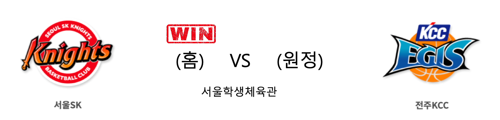

####  인천전자랜드(홈) VS 원주DB(원정) 

<table class="tg">
  <tr>
    <th class="tg-rr9t">인천전자랜드</th>
    <th class="tg-rr9t">팀</th>
    <th class="tg-rr9t">원주DB</th>
  </tr>
  <tr>
    <td class="tg-dcpn">3승 1패</td>
    <td class="tg-rr9t">시즌 상대전적</td>
    <td class="tg-dcpn">1승 3패</td>
  </tr>
  <tr>
    <td class="tg-dcpn">76</td>
    <td class="tg-rr9t">점수</td>
    <td class="tg-dcpn">94</td>
  </tr>
  <tr>
    <td class="tg-dcpn">20/46(43%)</td>
    <td class="tg-rr9t">2점(%)</td>
    <td class="tg-dcpn">26/41(63%)</td>
  </tr>
  <tr>
    <td class="tg-dcpn">8/25(32%)</td>
    <td class="tg-rr9t">3점(%)</td>
    <td class="tg-dcpn">9/22(41%)</td>
  </tr>
  <tr>
    <td class="tg-dcpn">12/17(71%)</td>
    <td class="tg-rr9t">자유투(%)</td>
    <td class="tg-dcpn">15/18(83%)</td>
  </tr>
  <tr>
    <td class="tg-dcpn">30</td>
    <td class="tg-rr9t">리바운드</td>
    <td class="tg-dcpn">35</td>
  </tr>
  <tr>
    <td class="tg-dcpn">3</td>
    <td class="tg-rr9t">어시스트</td>
    <td class="tg-dcpn">6</td>
  </tr>
  <tr>
    <td class="tg-dcpn">13</td>
    <td class="tg-rr9t">스틸</td>
    <td class="tg-dcpn">14</td>
  </tr>
  <tr>
    <td class="tg-dcpn">10</td>
    <td class="tg-rr9t">블록</td>
    <td class="tg-dcpn">11</td>
  </tr>
  <tr>
    <td class="tg-dcpn">11</td>
    <td class="tg-rr9t">턴오버</td>
    <td class="tg-dcpn">26</td>
  </tr>
  <tr>
    <td class="tg-dcpn">머피 할로웨이(20) 트로이 길렌워터(22)</td>
    <td class="tg-rr9t">주요 득점선수</td>
    <td class="tg-dcpn">치나누 오누아쿠(15) 허웅(18) 두경민(15) 김종규(19)</td>
  </tr>
</table>

#### 경기 관련 주요 기사         

[[BK Review] 두경민 돌아온 DB, 전자랜드 전 6연패 탈출](http://www.basketkorea.com/news/articleView.html?idxno=191472)

[[MD포토] 원주 DB '전자랜드 상대로 완승!'](http://www.mydaily.co.kr/new_yk/html/read.php?newsid=202001102059856767&ext=na)

[전자랜드, 10일 박성연 시투 초청…애국가·특별공연도 진행](http://www.mydaily.co.kr/new_yk/html/read.php?newsid=202001101018267448&ext=na)

        
        

####  서울SK(홈) VS 전주KCC(원정) 

<table class="tg">
  <tr>
    <th class="tg-rr9t">서울SK</th>
    <th class="tg-rr9t">팀</th>
    <th class="tg-rr9t">전주KCC</th>
  </tr>
  <tr>
    <td class="tg-dcpn">2승 2패</td>
    <td class="tg-rr9t">시즌 상대전적</td>
    <td class="tg-dcpn">2승 2패</td>
  </tr>
  <tr>
    <td class="tg-dcpn">104</td>
    <td class="tg-rr9t">점수</td>
    <td class="tg-dcpn">78</td>
  </tr>
  <tr>
    <td class="tg-dcpn">31/48(65%)</td>
    <td class="tg-rr9t">2점(%)</td>
    <td class="tg-dcpn">21/40(52%)</td>
  </tr>
  <tr>
    <td class="tg-dcpn">10/19(53%)</td>
    <td class="tg-rr9t">3점(%)</td>
    <td class="tg-dcpn">11/29(38%)</td>
  </tr>
  <tr>
    <td class="tg-dcpn">12/16(75%)</td>
    <td class="tg-rr9t">자유투(%)</td>
    <td class="tg-dcpn">3/8(38%)</td>
  </tr>
  <tr>
    <td class="tg-dcpn">37</td>
    <td class="tg-rr9t">리바운드</td>
    <td class="tg-dcpn">27</td>
  </tr>
  <tr>
    <td class="tg-dcpn">1</td>
    <td class="tg-rr9t">어시스트</td>
    <td class="tg-dcpn">1</td>
  </tr>
  <tr>
    <td class="tg-dcpn">9</td>
    <td class="tg-rr9t">스틸</td>
    <td class="tg-dcpn">13</td>
  </tr>
  <tr>
    <td class="tg-dcpn">9</td>
    <td class="tg-rr9t">블록</td>
    <td class="tg-dcpn">6</td>
  </tr>
  <tr>
    <td class="tg-dcpn">24</td>
    <td class="tg-rr9t">턴오버</td>
    <td class="tg-dcpn">16</td>
  </tr>
  <tr>
    <td class="tg-dcpn">자밀 워니(20) 김선형(16) 최성원(16) 최준용(24) 안영준(16)</td>
    <td class="tg-rr9t">주요 득점선수</td>
    <td class="tg-dcpn">라건아(15) 이대성(23)</td>
  </tr>
</table>

#### 경기 관련 주요 기사         

[SK `KCC 꺾고 승리의 하이파이브` [MK포토]](http://mksports.co.kr/view/2020/35311/)

[[포토]SK, KCC 상대로 압도적인 승리](http://isplus.live.joins.com/news/article/article.asp?total_id=23679412)

['1위 OK' SK, 최준용-워니 활약으로 KCC 꺾고 3연패 탈출](http://sports.news.naver.com/basketball/news/read.nhn?oid=065&aid=0000195491)

[3연패 탈출 서울 SK, 팀 스피드와 선두 모두 되찾았다](http://sports.donga.com/3/all/20200110/99176781/1)

        
        

#### 리그 순위

<table class="tg">
  <tr>
    <th class="tg-d14o">순위</th>
    <th class="tg-d14o">팀명</th>
    <th class="tg-d14o">경기수</th>
    <th class="tg-d14o">승</th>
    <th class="tg-d14o">패</th>
    <th class="tg-d14o">승차</th>
    <th class="tg-d14o">승률</th>
  </tr>
  
<tr>
    <td class="tg-50j8">1</td>
    <td class="tg-50j8">서울SK</td>
    <td class="tg-50j8">31</td>
    <td class="tg-50j8">20</td>
    <td class="tg-50j8">11</td>
    <td class="tg-50j8">0</td>
    <td class="tg-50j8">0.645</td>
</tr>

<tr>
    <td class="tg-50j8">1</td>
    <td class="tg-50j8">안양KGC</td>
    <td class="tg-50j8">31</td>
    <td class="tg-50j8">20</td>
    <td class="tg-50j8">11</td>
    <td class="tg-50j8">0</td>
    <td class="tg-50j8">0.645</td>
</tr>

<tr>
    <td class="tg-50j8">3</td>
    <td class="tg-50j8">전주KCC</td>
    <td class="tg-50j8">31</td>
    <td class="tg-50j8">18</td>
    <td class="tg-50j8">13</td>
    <td class="tg-50j8">2</td>
    <td class="tg-50j8">0.581</td>
</tr>

<tr>
    <td class="tg-50j8">4</td>
    <td class="tg-50j8">인천전자랜드</td>
    <td class="tg-50j8">32</td>
    <td class="tg-50j8">18</td>
    <td class="tg-50j8">14</td>
    <td class="tg-50j8">2</td>
    <td class="tg-50j8">0.562</td>
</tr>

<tr>
    <td class="tg-50j8">5</td>
    <td class="tg-50j8">원주DB</td>
    <td class="tg-50j8">30</td>
    <td class="tg-50j8">17</td>
    <td class="tg-50j8">13</td>
    <td class="tg-50j8">3</td>
    <td class="tg-50j8">0.567</td>
</tr>

<tr>
    <td class="tg-50j8">6</td>
    <td class="tg-50j8">부산KT</td>
    <td class="tg-50j8">31</td>
    <td class="tg-50j8">14</td>
    <td class="tg-50j8">17</td>
    <td class="tg-50j8">6</td>
    <td class="tg-50j8">0.452</td>
</tr>

<tr>
    <td class="tg-50j8">6</td>
    <td class="tg-50j8">울산현대모비스</td>
    <td class="tg-50j8">31</td>
    <td class="tg-50j8">14</td>
    <td class="tg-50j8">17</td>
    <td class="tg-50j8">6</td>
    <td class="tg-50j8">0.452</td>
</tr>

<tr>
    <td class="tg-50j8">8</td>
    <td class="tg-50j8">서울삼성</td>
    <td class="tg-50j8">31</td>
    <td class="tg-50j8">13</td>
    <td class="tg-50j8">18</td>
    <td class="tg-50j8">7</td>
    <td class="tg-50j8">0.419</td>
</tr>

<tr>
    <td class="tg-50j8">9</td>
    <td class="tg-50j8">창원LG</td>
    <td class="tg-50j8">31</td>
    <td class="tg-50j8">11</td>
    <td class="tg-50j8">20</td>
    <td class="tg-50j8">9</td>
    <td class="tg-50j8">0.355</td>
</tr>

<tr>
    <td class="tg-50j8">10</td>
    <td class="tg-50j8">고양오리온</td>
    <td class="tg-50j8">31</td>
    <td class="tg-50j8">10</td>
    <td class="tg-50j8">21</td>
    <td class="tg-50j8">10</td>
    <td class="tg-50j8">0.323</td>
</tr>
</table> 

        
        
#kbl #국내농구 #농구분석 #토토 #스포츠토토 #경기예측 #농구결과 #20200110 #인천전자랜드 #원주DB #서울SK #전주KCC #인천전자랜드원주DB #서울SK전주KCC 