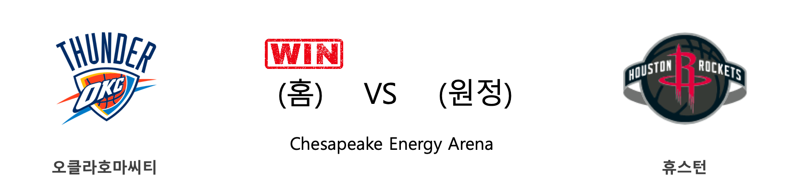

####  필라델피아(홈) VS 보스턴(원정) 

<table class="tg">
  <tr>
    <th class="tg-rr9t">PHI</th>
    <th class="tg-rr9t">팀</th>
    <th class="tg-rr9t">BOS</th>
  </tr>
  <tr>
    <td class="tg-dcpn">2승 0패</td>
    <td class="tg-rr9t">시즌 상대전적</td>
    <td class="tg-dcpn">0승 2패</td>
  </tr>
  <tr>
    <td class="tg-dcpn">109</td>
    <td class="tg-rr9t">점수</td>
    <td class="tg-dcpn">98</td>
  </tr>
  <tr>
    <td class="tg-dcpn">32/61(52%)</td>
    <td class="tg-rr9t">2점(%)</td>
    <td class="tg-dcpn">24/52(46%)</td>
  </tr>
  <tr>
    <td class="tg-dcpn">11/27(41%)</td>
    <td class="tg-rr9t">3점(%)</td>
    <td class="tg-dcpn">14/36(39%)</td>
  </tr>
  <tr>
    <td class="tg-dcpn">12/17(71%)</td>
    <td class="tg-rr9t">자유투(%)</td>
    <td class="tg-dcpn">8/8(100%)</td>
  </tr>
  <tr>
    <td class="tg-dcpn">48</td>
    <td class="tg-rr9t">리바운드</td>
    <td class="tg-dcpn">38</td>
  </tr>
  <tr>
    <td class="tg-dcpn">24</td>
    <td class="tg-rr9t">어시스트</td>
    <td class="tg-dcpn">17</td>
  </tr>
  <tr>
    <td class="tg-dcpn">6</td>
    <td class="tg-rr9t">스틸</td>
    <td class="tg-dcpn">9</td>
  </tr>
  <tr>
    <td class="tg-dcpn">5</td>
    <td class="tg-rr9t">블록</td>
    <td class="tg-dcpn">1</td>
  </tr>
  <tr>
    <td class="tg-dcpn">12</td>
    <td class="tg-rr9t">턴오버</td>
    <td class="tg-dcpn">14</td>
  </tr>
  <tr>
    <td class="tg-dcpn">JoshRichardso(29) TobiasHarrisF(16) BenSimmonsG(19) AlHorfordC(17)</td>
    <td class="tg-rr9t">주요 득점선수</td>
    <td class="tg-dcpn">KembaWalkerG(26) MarcusSmart(24) JaysonTatumF(15)</td>
  </tr>
</table>

#### 경기 관련 주요 기사         

[[오늘의 NBA] (11/19) 댈러스의 루카 복음 낭송](http://sports.news.naver.com/basketball/news/read.nhn?oid=486&aid=0000001142)

[[오늘의 NBA] (12/26) NBA 2019년 크리스마스 축제](http://sports.news.naver.com/basketball/news/read.nhn?oid=486&aid=0000001177)

[[오늘의 NBA] (1/1) 휴스턴의 불장난](http://sports.news.naver.com/basketball/news/read.nhn?oid=486&aid=0000001183)

[[오늘의 NBA] (12/21) 크리스탑스 포르징기스, 댈러스의 새로운 버팀목](http://sports.news.naver.com/basketball/news/read.nhn?oid=486&aid=0000001173)

[[오늘의 NBA] (1/10) PHI vs BOS, 먹이사슬의 역전!](http://sports.news.naver.com/basketball/news/read.nhn?oid=486&aid=0000001192)

        
        

####  오클라호마씨티(홈) VS 휴스턴(원정) 

<table class="tg">
  <tr>
    <th class="tg-rr9t">OKC</th>
    <th class="tg-rr9t">팀</th>
    <th class="tg-rr9t">HOU</th>
  </tr>
  <tr>
    <td class="tg-dcpn">1승 1패</td>
    <td class="tg-rr9t">시즌 상대전적</td>
    <td class="tg-dcpn">1승 1패</td>
  </tr>
  <tr>
    <td class="tg-dcpn">113</td>
    <td class="tg-rr9t">점수</td>
    <td class="tg-dcpn">92</td>
  </tr>
  <tr>
    <td class="tg-dcpn">32/55(58%)</td>
    <td class="tg-rr9t">2점(%)</td>
    <td class="tg-dcpn">23/49(47%)</td>
  </tr>
  <tr>
    <td class="tg-dcpn">11/32(34%)</td>
    <td class="tg-rr9t">3점(%)</td>
    <td class="tg-dcpn">11/40(28%)</td>
  </tr>
  <tr>
    <td class="tg-dcpn">16/20(80%)</td>
    <td class="tg-rr9t">자유투(%)</td>
    <td class="tg-dcpn">13/14(93%)</td>
  </tr>
  <tr>
    <td class="tg-dcpn">52</td>
    <td class="tg-rr9t">리바운드</td>
    <td class="tg-dcpn">39</td>
  </tr>
  <tr>
    <td class="tg-dcpn">22</td>
    <td class="tg-rr9t">어시스트</td>
    <td class="tg-dcpn">16</td>
  </tr>
  <tr>
    <td class="tg-dcpn">8</td>
    <td class="tg-rr9t">스틸</td>
    <td class="tg-dcpn">4</td>
  </tr>
  <tr>
    <td class="tg-dcpn">2</td>
    <td class="tg-rr9t">블록</td>
    <td class="tg-dcpn">3</td>
  </tr>
  <tr>
    <td class="tg-dcpn">13</td>
    <td class="tg-rr9t">턴오버</td>
    <td class="tg-dcpn">14</td>
  </tr>
  <tr>
    <td class="tg-dcpn">ChrisPaulG(18) ShaiGilgeous-(20) DaniloGallina(23) DennisSchrode(16) StevenAdamsC(15)</td>
    <td class="tg-rr9t">주요 득점선수</td>
    <td class="tg-dcpn">JamesHardenG(17) RussellWestbr(34)</td>
  </tr>
</table>

#### 경기 관련 주요 기사         

[[오늘의 NBA] (1/1) 휴스턴의 불장난](http://sports.news.naver.com/basketball/news/read.nhn?oid=486&aid=0000001183)

[웨스트브룩의 첫 친정 방문…OKC, HOU에 21점 차 압승](http://www.spotvnews.co.kr/?mod=news&act=articleView&idxno=338964)

[[오늘의 NBA] (1/4) 제임스 하든, NBA 공격 코트의 지배자](http://sports.news.naver.com/basketball/news/read.nhn?oid=486&aid=0000001186)

[[오늘의 NBA] (1/8) POR 데미안 릴라드&카멜로 앤써니, 대역전극을 연출하다](http://sports.news.naver.com/basketball/news/read.nhn?oid=486&aid=0000001190)

[[오늘의 NBA] (12/30) LAL 르브론 제임스, 9,000어시스트 달성](http://sports.news.naver.com/basketball/news/read.nhn?oid=486&aid=0000001181)

        
        

####  디트로이트(홈) VS 클리블랜드(원정) 

<table class="tg">
  <tr>
    <th class="tg-rr9t">DET</th>
    <th class="tg-rr9t">팀</th>
    <th class="tg-rr9t">CLE</th>
  </tr>
  <tr>
    <td class="tg-dcpn">2승 1패</td>
    <td class="tg-rr9t">시즌 상대전적</td>
    <td class="tg-dcpn">1승 2패</td>
  </tr>
  <tr>
    <td class="tg-dcpn">112</td>
    <td class="tg-rr9t">점수</td>
    <td class="tg-dcpn">115</td>
  </tr>
  <tr>
    <td class="tg-dcpn">42/78(54%)</td>
    <td class="tg-rr9t">2점(%)</td>
    <td class="tg-dcpn">43/71(61%)</td>
  </tr>
  <tr>
    <td class="tg-dcpn">6/20(30%)</td>
    <td class="tg-rr9t">3점(%)</td>
    <td class="tg-dcpn">5/20(25%)</td>
  </tr>
  <tr>
    <td class="tg-dcpn">10/16(62%)</td>
    <td class="tg-rr9t">자유투(%)</td>
    <td class="tg-dcpn">14/20(70%)</td>
  </tr>
  <tr>
    <td class="tg-dcpn">46</td>
    <td class="tg-rr9t">리바운드</td>
    <td class="tg-dcpn">39</td>
  </tr>
  <tr>
    <td class="tg-dcpn">20</td>
    <td class="tg-rr9t">어시스트</td>
    <td class="tg-dcpn">24</td>
  </tr>
  <tr>
    <td class="tg-dcpn">8</td>
    <td class="tg-rr9t">스틸</td>
    <td class="tg-dcpn">9</td>
  </tr>
  <tr>
    <td class="tg-dcpn">9</td>
    <td class="tg-rr9t">블록</td>
    <td class="tg-dcpn">5</td>
  </tr>
  <tr>
    <td class="tg-dcpn">15</td>
    <td class="tg-rr9t">턴오버</td>
    <td class="tg-dcpn">14</td>
  </tr>
  <tr>
    <td class="tg-dcpn">DerrickRose(27) BruceBrownG(17) AndreDrummond(28)</td>
    <td class="tg-rr9t">주요 득점선수</td>
    <td class="tg-dcpn">DariusGarland(20) CollinSextonG(19) KevinLoveF(17) TristanThomps(35)</td>
  </tr>
</table>

#### 경기 관련 주요 기사         

[[오늘의 NBA] (1/10) PHI vs BOS, 먹이사슬의 역전!](http://sports.news.naver.com/basketball/news/read.nhn?oid=486&aid=0000001192)

[[오늘의 NBA] (1/6) 몬트레즐 해럴, 클리퍼스의 희소재](http://sports.news.naver.com/basketball/news/read.nhn?oid=486&aid=0000001188)

[[오늘의 NBA] (12/31) 불의 군주 워싱턴](http://sports.news.naver.com/basketball/news/read.nhn?oid=486&aid=0000001182)

[[오늘의 NBA] (1/3) 마이클 포터 주니어, 덴버의 기다림에 응답하다!](http://sports.news.naver.com/basketball/news/read.nhn?oid=486&aid=0000001185)

['로즈 24점' DET, CLE에 짜릿한 역전승](http://www.rookie.co.kr/news/articleView.html?idxno=37667)

        
        

####  미네소타(홈) VS 포틀랜드(원정) 

<table class="tg">
  <tr>
    <th class="tg-rr9t">MIN</th>
    <th class="tg-rr9t">팀</th>
    <th class="tg-rr9t">POR</th>
  </tr>
  <tr>
    <td class="tg-dcpn">1승 1패</td>
    <td class="tg-rr9t">시즌 상대전적</td>
    <td class="tg-dcpn">1승 1패</td>
  </tr>
  <tr>
    <td class="tg-dcpn">116</td>
    <td class="tg-rr9t">점수</td>
    <td class="tg-dcpn">102</td>
  </tr>
  <tr>
    <td class="tg-dcpn">31/57(54%)</td>
    <td class="tg-rr9t">2점(%)</td>
    <td class="tg-dcpn">24/59(41%)</td>
  </tr>
  <tr>
    <td class="tg-dcpn">13/32(41%)</td>
    <td class="tg-rr9t">3점(%)</td>
    <td class="tg-dcpn">11/37(30%)</td>
  </tr>
  <tr>
    <td class="tg-dcpn">15/21(71%)</td>
    <td class="tg-rr9t">자유투(%)</td>
    <td class="tg-dcpn">21/31(68%)</td>
  </tr>
  <tr>
    <td class="tg-dcpn">56</td>
    <td class="tg-rr9t">리바운드</td>
    <td class="tg-dcpn">41</td>
  </tr>
  <tr>
    <td class="tg-dcpn">25</td>
    <td class="tg-rr9t">어시스트</td>
    <td class="tg-dcpn">14</td>
  </tr>
  <tr>
    <td class="tg-dcpn">7</td>
    <td class="tg-rr9t">스틸</td>
    <td class="tg-dcpn">9</td>
  </tr>
  <tr>
    <td class="tg-dcpn">10</td>
    <td class="tg-rr9t">블록</td>
    <td class="tg-dcpn">6</td>
  </tr>
  <tr>
    <td class="tg-dcpn">14</td>
    <td class="tg-rr9t">턴오버</td>
    <td class="tg-dcpn">10</td>
  </tr>
  <tr>
    <td class="tg-dcpn">RobertCovingt(15) AndrewWiggins(23)</td>
    <td class="tg-rr9t">주요 득점선수</td>
    <td class="tg-dcpn">DamianLillard(20) HassanWhitesi(15) CJMcCollumG(15)</td>
  </tr>
</table>

#### 경기 관련 주요 기사         

[[오늘의 NBA] (12/31) 불의 군주 워싱턴](http://sports.news.naver.com/basketball/news/read.nhn?oid=486&aid=0000001182)

[[오늘의 NBA] (1/10) PHI vs BOS, 먹이사슬의 역전!](http://sports.news.naver.com/basketball/news/read.nhn?oid=486&aid=0000001192)

[[오늘의 NBA] (12/29) 마이애미, 연장전 승부 전문가](http://sports.news.naver.com/basketball/news/read.nhn?oid=486&aid=0000001180)

[[오늘의 NBA] (1/6) 몬트레즐 해럴, 클리퍼스의 희소재](http://sports.news.naver.com/basketball/news/read.nhn?oid=486&aid=0000001188)

[[오늘의 NBA] (1/8) POR 데미안 릴라드&카멜로 앤써니, 대역전극을 연출하다](http://sports.news.naver.com/basketball/news/read.nhn?oid=486&aid=0000001190)

        
        

#### 리그 (Eastern) 순위
    

<table class="tg">
  <tr>
    <th class="tg-d14o">순위</th>
    <th class="tg-d14o">팀명</th>
    <th class="tg-d14o">경기수</th>
    <th class="tg-d14o">승</th>
    <th class="tg-d14o">패</th>
    <th class="tg-d14o">승차</th>
    <th class="tg-d14o">승률</th>
  </tr>
  
<tr>
    <td class="tg-50j8">1</td>
    <td class="tg-50j8">MIL</td>
    <td class="tg-50j8">38</td>
    <td class="tg-50j8">32</td>
    <td class="tg-50j8">6</td>
    <td class="tg-50j8">0</td>
    <td class="tg-50j8">0.842</td>
</tr>

<tr>
    <td class="tg-50j8">2</td>
    <td class="tg-50j8">MIA</td>
    <td class="tg-50j8">36</td>
    <td class="tg-50j8">27</td>
    <td class="tg-50j8">9</td>
    <td class="tg-50j8">5</td>
    <td class="tg-50j8">0.75</td>
</tr>

<tr>
    <td class="tg-50j8">3</td>
    <td class="tg-50j8">BOS</td>
    <td class="tg-50j8">35</td>
    <td class="tg-50j8">25</td>
    <td class="tg-50j8">10</td>
    <td class="tg-50j8">7</td>
    <td class="tg-50j8">0.714</td>
</tr>

<tr>
    <td class="tg-50j8">4</td>
    <td class="tg-50j8">TOR</td>
    <td class="tg-50j8">38</td>
    <td class="tg-50j8">25</td>
    <td class="tg-50j8">13</td>
    <td class="tg-50j8">7</td>
    <td class="tg-50j8">0.658</td>
</tr>

<tr>
    <td class="tg-50j8">5</td>
    <td class="tg-50j8">PHI</td>
    <td class="tg-50j8">38</td>
    <td class="tg-50j8">24</td>
    <td class="tg-50j8">14</td>
    <td class="tg-50j8">8</td>
    <td class="tg-50j8">0.632</td>
</tr>

<tr>
    <td class="tg-50j8">6</td>
    <td class="tg-50j8">IND</td>
    <td class="tg-50j8">38</td>
    <td class="tg-50j8">23</td>
    <td class="tg-50j8">15</td>
    <td class="tg-50j8">9</td>
    <td class="tg-50j8">0.605</td>
</tr>

<tr>
    <td class="tg-50j8">7</td>
    <td class="tg-50j8">ORL</td>
    <td class="tg-50j8">37</td>
    <td class="tg-50j8">18</td>
    <td class="tg-50j8">19</td>
    <td class="tg-50j8">14</td>
    <td class="tg-50j8">0.486</td>
</tr>

<tr>
    <td class="tg-50j8">8</td>
    <td class="tg-50j8">BKN</td>
    <td class="tg-50j8">35</td>
    <td class="tg-50j8">16</td>
    <td class="tg-50j8">19</td>
    <td class="tg-50j8">16</td>
    <td class="tg-50j8">0.457</td>
</tr>

<tr>
    <td class="tg-50j8">9</td>
    <td class="tg-50j8">CHA</td>
    <td class="tg-50j8">40</td>
    <td class="tg-50j8">15</td>
    <td class="tg-50j8">25</td>
    <td class="tg-50j8">17</td>
    <td class="tg-50j8">0.375</td>
</tr>

<tr>
    <td class="tg-50j8">10</td>
    <td class="tg-50j8">DET</td>
    <td class="tg-50j8">37</td>
    <td class="tg-50j8">14</td>
    <td class="tg-50j8">23</td>
    <td class="tg-50j8">18</td>
    <td class="tg-50j8">0.378</td>
</tr>

<tr>
    <td class="tg-50j8">11</td>
    <td class="tg-50j8">CHI</td>
    <td class="tg-50j8">37</td>
    <td class="tg-50j8">13</td>
    <td class="tg-50j8">24</td>
    <td class="tg-50j8">19</td>
    <td class="tg-50j8">0.351</td>
</tr>

<tr>
    <td class="tg-50j8">12</td>
    <td class="tg-50j8">WAS</td>
    <td class="tg-50j8">36</td>
    <td class="tg-50j8">11</td>
    <td class="tg-50j8">25</td>
    <td class="tg-50j8">21</td>
    <td class="tg-50j8">0.306</td>
</tr>

<tr>
    <td class="tg-50j8">13</td>
    <td class="tg-50j8">CLE</td>
    <td class="tg-50j8">37</td>
    <td class="tg-50j8">10</td>
    <td class="tg-50j8">27</td>
    <td class="tg-50j8">22</td>
    <td class="tg-50j8">0.27</td>
</tr>

<tr>
    <td class="tg-50j8">14</td>
    <td class="tg-50j8">NYK</td>
    <td class="tg-50j8">38</td>
    <td class="tg-50j8">10</td>
    <td class="tg-50j8">28</td>
    <td class="tg-50j8">22</td>
    <td class="tg-50j8">0.263</td>
</tr>

<tr>
    <td class="tg-50j8">15</td>
    <td class="tg-50j8">ATL</td>
    <td class="tg-50j8">37</td>
    <td class="tg-50j8">7</td>
    <td class="tg-50j8">30</td>
    <td class="tg-50j8">25</td>
    <td class="tg-50j8">0.189</td>
</tr>
</table> 
#### 리그 (Western) 순위
    

<table class="tg">
  <tr>
    <th class="tg-d14o">순위</th>
    <th class="tg-d14o">팀명</th>
    <th class="tg-d14o">경기수</th>
    <th class="tg-d14o">승</th>
    <th class="tg-d14o">패</th>
    <th class="tg-d14o">승차</th>
    <th class="tg-d14o">승률</th>
  </tr>
  
<tr>
    <td class="tg-50j8">1</td>
    <td class="tg-50j8">LAL</td>
    <td class="tg-50j8">37</td>
    <td class="tg-50j8">30</td>
    <td class="tg-50j8">7</td>
    <td class="tg-50j8">2</td>
    <td class="tg-50j8">0.811</td>
</tr>

<tr>
    <td class="tg-50j8">2</td>
    <td class="tg-50j8">LAC</td>
    <td class="tg-50j8">38</td>
    <td class="tg-50j8">26</td>
    <td class="tg-50j8">12</td>
    <td class="tg-50j8">6</td>
    <td class="tg-50j8">0.684</td>
</tr>

<tr>
    <td class="tg-50j8">3</td>
    <td class="tg-50j8">DEN</td>
    <td class="tg-50j8">36</td>
    <td class="tg-50j8">25</td>
    <td class="tg-50j8">11</td>
    <td class="tg-50j8">7</td>
    <td class="tg-50j8">0.694</td>
</tr>

<tr>
    <td class="tg-50j8">4</td>
    <td class="tg-50j8">HOU</td>
    <td class="tg-50j8">37</td>
    <td class="tg-50j8">25</td>
    <td class="tg-50j8">12</td>
    <td class="tg-50j8">7</td>
    <td class="tg-50j8">0.676</td>
</tr>

<tr>
    <td class="tg-50j8">5</td>
    <td class="tg-50j8">UTA</td>
    <td class="tg-50j8">36</td>
    <td class="tg-50j8">24</td>
    <td class="tg-50j8">12</td>
    <td class="tg-50j8">8</td>
    <td class="tg-50j8">0.667</td>
</tr>

<tr>
    <td class="tg-50j8">6</td>
    <td class="tg-50j8">DAL</td>
    <td class="tg-50j8">36</td>
    <td class="tg-50j8">22</td>
    <td class="tg-50j8">14</td>
    <td class="tg-50j8">10</td>
    <td class="tg-50j8">0.611</td>
</tr>

<tr>
    <td class="tg-50j8">7</td>
    <td class="tg-50j8">OKC</td>
    <td class="tg-50j8">38</td>
    <td class="tg-50j8">22</td>
    <td class="tg-50j8">16</td>
    <td class="tg-50j8">10</td>
    <td class="tg-50j8">0.579</td>
</tr>

<tr>
    <td class="tg-50j8">8</td>
    <td class="tg-50j8">SAS</td>
    <td class="tg-50j8">35</td>
    <td class="tg-50j8">16</td>
    <td class="tg-50j8">19</td>
    <td class="tg-50j8">16</td>
    <td class="tg-50j8">0.457</td>
</tr>

<tr>
    <td class="tg-50j8">9</td>
    <td class="tg-50j8">POR</td>
    <td class="tg-50j8">37</td>
    <td class="tg-50j8">16</td>
    <td class="tg-50j8">21</td>
    <td class="tg-50j8">16</td>
    <td class="tg-50j8">0.432</td>
</tr>

<tr>
    <td class="tg-50j8">10</td>
    <td class="tg-50j8">MEM</td>
    <td class="tg-50j8">38</td>
    <td class="tg-50j8">16</td>
    <td class="tg-50j8">22</td>
    <td class="tg-50j8">16</td>
    <td class="tg-50j8">0.421</td>
</tr>

<tr>
    <td class="tg-50j8">11</td>
    <td class="tg-50j8">SAC</td>
    <td class="tg-50j8">38</td>
    <td class="tg-50j8">15</td>
    <td class="tg-50j8">23</td>
    <td class="tg-50j8">17</td>
    <td class="tg-50j8">0.395</td>
</tr>

<tr>
    <td class="tg-50j8">12</td>
    <td class="tg-50j8">MIN</td>
    <td class="tg-50j8">36</td>
    <td class="tg-50j8">14</td>
    <td class="tg-50j8">22</td>
    <td class="tg-50j8">18</td>
    <td class="tg-50j8">0.389</td>
</tr>

<tr>
    <td class="tg-50j8">13</td>
    <td class="tg-50j8">PHX</td>
    <td class="tg-50j8">36</td>
    <td class="tg-50j8">13</td>
    <td class="tg-50j8">23</td>
    <td class="tg-50j8">19</td>
    <td class="tg-50j8">0.361</td>
</tr>

<tr>
    <td class="tg-50j8">14</td>
    <td class="tg-50j8">NOP</td>
    <td class="tg-50j8">38</td>
    <td class="tg-50j8">13</td>
    <td class="tg-50j8">25</td>
    <td class="tg-50j8">19</td>
    <td class="tg-50j8">0.342</td>
</tr>

<tr>
    <td class="tg-50j8">15</td>
    <td class="tg-50j8">GSW</td>
    <td class="tg-50j8">39</td>
    <td class="tg-50j8">9</td>
    <td class="tg-50j8">30</td>
    <td class="tg-50j8">23</td>
    <td class="tg-50j8">0.231</td>
</tr>
</table> 

        
        
#nba #미국농구 #엔비에이 #농구분석 #토토 #스포츠토토 #경기예측 #농구결과 #20200110 #필라델피아 #보스턴 #오클라호마씨티 #휴스턴 #디트로이트 #클리블랜드 #미네소타 #포틀랜드 #필라델피아보스턴 #오클라호마씨티휴스턴 #디트로이트클리블랜드 #미네소타포틀랜드 