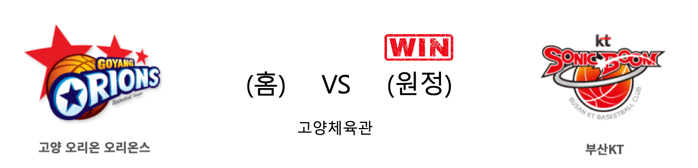
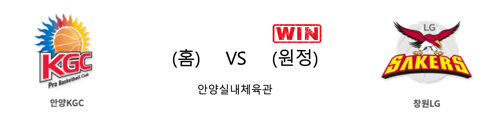

####  고양오리온(홈) VS 부산KT(원정) 

<table class="tg">
  <tr>
    <th class="tg-rr9t">고양오리온</th>
    <th class="tg-rr9t">팀</th>
    <th class="tg-rr9t">부산KT</th>
  </tr>
  <tr>
    <td class="tg-dcpn">1승 3패</td>
    <td class="tg-rr9t">시즌 상대전적</td>
    <td class="tg-dcpn">3승 1패</td>
  </tr>
  <tr>
    <td class="tg-dcpn">91</td>
    <td class="tg-rr9t">점수</td>
    <td class="tg-dcpn">94</td>
  </tr>
  <tr>
    <td class="tg-dcpn">27/41(66%)</td>
    <td class="tg-rr9t">2점(%)</td>
    <td class="tg-dcpn">27/41(66%)</td>
  </tr>
  <tr>
    <td class="tg-dcpn">8/23(35%)</td>
    <td class="tg-rr9t">3점(%)</td>
    <td class="tg-dcpn">10/23(43%)</td>
  </tr>
  <tr>
    <td class="tg-dcpn">13/22(59%)</td>
    <td class="tg-rr9t">자유투(%)</td>
    <td class="tg-dcpn">10/14(71%)</td>
  </tr>
  <tr>
    <td class="tg-dcpn">31</td>
    <td class="tg-rr9t">리바운드</td>
    <td class="tg-dcpn">28</td>
  </tr>
  <tr>
    <td class="tg-dcpn">2</td>
    <td class="tg-rr9t">어시스트</td>
    <td class="tg-dcpn">1</td>
  </tr>
  <tr>
    <td class="tg-dcpn">12</td>
    <td class="tg-rr9t">스틸</td>
    <td class="tg-dcpn">13</td>
  </tr>
  <tr>
    <td class="tg-dcpn">9</td>
    <td class="tg-rr9t">블록</td>
    <td class="tg-dcpn">8</td>
  </tr>
  <tr>
    <td class="tg-dcpn">19</td>
    <td class="tg-rr9t">턴오버</td>
    <td class="tg-dcpn">16</td>
  </tr>
  <tr>
    <td class="tg-dcpn">보리스 사보비치(27)</td>
    <td class="tg-rr9t">주요 득점선수</td>
    <td class="tg-dcpn">허훈(23) 양홍석(15) 알 쏜튼(24)</td>
  </tr>
</table>

#### 경기 관련 주요 기사         

        
        

####  안양KGC(홈) VS 창원LG(원정) 

<table class="tg">
  <tr>
    <th class="tg-rr9t">안양KGC</th>
    <th class="tg-rr9t">팀</th>
    <th class="tg-rr9t">창원LG</th>
  </tr>
  <tr>
    <td class="tg-dcpn">2승 2패</td>
    <td class="tg-rr9t">시즌 상대전적</td>
    <td class="tg-dcpn">2승 2패</td>
  </tr>
  <tr>
    <td class="tg-dcpn">78</td>
    <td class="tg-rr9t">점수</td>
    <td class="tg-dcpn">89</td>
  </tr>
  <tr>
    <td class="tg-dcpn">15/26(58%)</td>
    <td class="tg-rr9t">2점(%)</td>
    <td class="tg-dcpn">23/44(52%)</td>
  </tr>
  <tr>
    <td class="tg-dcpn">11/37(30%)</td>
    <td class="tg-rr9t">3점(%)</td>
    <td class="tg-dcpn">10/28(36%)</td>
  </tr>
  <tr>
    <td class="tg-dcpn">15/27(56%)</td>
    <td class="tg-rr9t">자유투(%)</td>
    <td class="tg-dcpn">13/20(65%)</td>
  </tr>
  <tr>
    <td class="tg-dcpn">34</td>
    <td class="tg-rr9t">리바운드</td>
    <td class="tg-dcpn">50</td>
  </tr>
  <tr>
    <td class="tg-dcpn">0</td>
    <td class="tg-rr9t">어시스트</td>
    <td class="tg-dcpn">1</td>
  </tr>
  <tr>
    <td class="tg-dcpn">10</td>
    <td class="tg-rr9t">스틸</td>
    <td class="tg-dcpn">13</td>
  </tr>
  <tr>
    <td class="tg-dcpn">11</td>
    <td class="tg-rr9t">블록</td>
    <td class="tg-dcpn">4</td>
  </tr>
  <tr>
    <td class="tg-dcpn">12</td>
    <td class="tg-rr9t">턴오버</td>
    <td class="tg-dcpn">14</td>
  </tr>
  <tr>
    <td class="tg-dcpn">브랜든 브라운(19)</td>
    <td class="tg-rr9t">주요 득점선수</td>
    <td class="tg-dcpn">캐디 라렌(23) 마이크 해리스(20)</td>
  </tr>
</table>

#### 경기 관련 주요 기사         

[[포토] 창원LG, 1위 KGC에 승리!](http://sports.chosun.com/news/ntype.htm?id=202001110100077890004891&servicedate=20200111)

['자유투가 가른 승부' LG, 연장 혈투 끝에 선두 KGC 격파](http://www.rookie.co.kr/news/articleView.html?idxno=37897)

['라렌+해리스 43점 합작' LG, KGC인삼공사 꺾고 2연승](http://isplus.live.joins.com/news/article/aid.asp?aid=23274318)

[LG 'KGC에 승리'[포토]](http://www.xportsnews.com/?ac=article_view&entry_id=1221932)

        
        

####  서울삼성(홈) VS 울산현대모비스(원정) 

<table class="tg">
  <tr>
    <th class="tg-rr9t">서울삼성</th>
    <th class="tg-rr9t">팀</th>
    <th class="tg-rr9t">울산현대모비스</th>
  </tr>
  <tr>
    <td class="tg-dcpn">2승 2패</td>
    <td class="tg-rr9t">시즌 상대전적</td>
    <td class="tg-dcpn">2승 2패</td>
  </tr>
  <tr>
    <td class="tg-dcpn">73</td>
    <td class="tg-rr9t">점수</td>
    <td class="tg-dcpn">81</td>
  </tr>
  <tr>
    <td class="tg-dcpn">21/43(49%)</td>
    <td class="tg-rr9t">2점(%)</td>
    <td class="tg-dcpn">23/43(53%)</td>
  </tr>
  <tr>
    <td class="tg-dcpn">6/17(35%)</td>
    <td class="tg-rr9t">3점(%)</td>
    <td class="tg-dcpn">4/14(29%)</td>
  </tr>
  <tr>
    <td class="tg-dcpn">13/16(81%)</td>
    <td class="tg-rr9t">자유투(%)</td>
    <td class="tg-dcpn">23/27(85%)</td>
  </tr>
  <tr>
    <td class="tg-dcpn">27</td>
    <td class="tg-rr9t">리바운드</td>
    <td class="tg-dcpn">36</td>
  </tr>
  <tr>
    <td class="tg-dcpn">3</td>
    <td class="tg-rr9t">어시스트</td>
    <td class="tg-dcpn">3</td>
  </tr>
  <tr>
    <td class="tg-dcpn">9</td>
    <td class="tg-rr9t">스틸</td>
    <td class="tg-dcpn">11</td>
  </tr>
  <tr>
    <td class="tg-dcpn">7</td>
    <td class="tg-rr9t">블록</td>
    <td class="tg-dcpn">5</td>
  </tr>
  <tr>
    <td class="tg-dcpn">17</td>
    <td class="tg-rr9t">턴오버</td>
    <td class="tg-dcpn">17</td>
  </tr>
  <tr>
    <td class="tg-dcpn">닉 미네라스(15)</td>
    <td class="tg-rr9t">주요 득점선수</td>
    <td class="tg-dcpn">리온 윌리엄스(24)</td>
  </tr>
</table>

#### 경기 관련 주요 기사         

[[BK Review] 현대모비스, 자유투 쓸어 담은 윌리엄스 앞세워 삼성 격파](http://www.basketkorea.com/news/articleView.html?idxno=191500)

[윌리엄스 더블더블 현대모비스 삼성 꺾고 3연승](http://www.sportsseoul.com/news/read/871376)

[양동근 결장 현대모비스, 삼성 꺾고 3연승 질주](http://sports.chosun.com/news/ntype.htm?id=202001110100077960004896&servicedate=20200111)

[‘윌리엄스 24P 11R’ 현대모비스, 삼성 꺾고 3연승 질주](http://www.mydaily.co.kr/new_yk/html/read.php?newsid=202001111837869985&ext=na)

        
        

#### 리그 순위

<table class="tg">
  <tr>
    <th class="tg-d14o">순위</th>
    <th class="tg-d14o">팀명</th>
    <th class="tg-d14o">경기수</th>
    <th class="tg-d14o">승</th>
    <th class="tg-d14o">패</th>
    <th class="tg-d14o">승차</th>
    <th class="tg-d14o">승률</th>
  </tr>
  
<tr>
    <td class="tg-50j8">1</td>
    <td class="tg-50j8">서울SK</td>
    <td class="tg-50j8">31</td>
    <td class="tg-50j8">20</td>
    <td class="tg-50j8">11</td>
    <td class="tg-50j8">0</td>
    <td class="tg-50j8">0.645</td>
</tr>

<tr>
    <td class="tg-50j8">2</td>
    <td class="tg-50j8">안양KGC</td>
    <td class="tg-50j8">32</td>
    <td class="tg-50j8">20</td>
    <td class="tg-50j8">12</td>
    <td class="tg-50j8">0</td>
    <td class="tg-50j8">0.625</td>
</tr>

<tr>
    <td class="tg-50j8">3</td>
    <td class="tg-50j8">전주KCC</td>
    <td class="tg-50j8">31</td>
    <td class="tg-50j8">18</td>
    <td class="tg-50j8">13</td>
    <td class="tg-50j8">2</td>
    <td class="tg-50j8">0.581</td>
</tr>

<tr>
    <td class="tg-50j8">4</td>
    <td class="tg-50j8">인천전자랜드</td>
    <td class="tg-50j8">32</td>
    <td class="tg-50j8">18</td>
    <td class="tg-50j8">14</td>
    <td class="tg-50j8">2</td>
    <td class="tg-50j8">0.562</td>
</tr>

<tr>
    <td class="tg-50j8">5</td>
    <td class="tg-50j8">원주DB</td>
    <td class="tg-50j8">30</td>
    <td class="tg-50j8">17</td>
    <td class="tg-50j8">13</td>
    <td class="tg-50j8">3</td>
    <td class="tg-50j8">0.567</td>
</tr>

<tr>
    <td class="tg-50j8">6</td>
    <td class="tg-50j8">울산현대모비스</td>
    <td class="tg-50j8">32</td>
    <td class="tg-50j8">15</td>
    <td class="tg-50j8">17</td>
    <td class="tg-50j8">5</td>
    <td class="tg-50j8">0.469</td>
</tr>

<tr>
    <td class="tg-50j8">6</td>
    <td class="tg-50j8">부산KT</td>
    <td class="tg-50j8">32</td>
    <td class="tg-50j8">15</td>
    <td class="tg-50j8">17</td>
    <td class="tg-50j8">5</td>
    <td class="tg-50j8">0.469</td>
</tr>

<tr>
    <td class="tg-50j8">8</td>
    <td class="tg-50j8">서울삼성</td>
    <td class="tg-50j8">32</td>
    <td class="tg-50j8">13</td>
    <td class="tg-50j8">19</td>
    <td class="tg-50j8">7</td>
    <td class="tg-50j8">0.406</td>
</tr>

<tr>
    <td class="tg-50j8">9</td>
    <td class="tg-50j8">창원LG</td>
    <td class="tg-50j8">32</td>
    <td class="tg-50j8">12</td>
    <td class="tg-50j8">20</td>
    <td class="tg-50j8">8</td>
    <td class="tg-50j8">0.375</td>
</tr>

<tr>
    <td class="tg-50j8">10</td>
    <td class="tg-50j8">고양오리온</td>
    <td class="tg-50j8">32</td>
    <td class="tg-50j8">10</td>
    <td class="tg-50j8">22</td>
    <td class="tg-50j8">10</td>
    <td class="tg-50j8">0.312</td>
</tr>
</table> 

        
        
#kbl #국내농구 #농구분석 #토토 #스포츠토토 #경기예측 #농구결과 #20200111 #고양오리온 #부산KT #안양KGC #창원LG #서울삼성 #울산현대모비스 #고양오리온부산KT #안양KGC창원LG #서울삼성울산현대모비스 