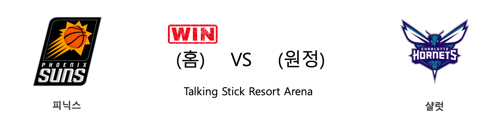
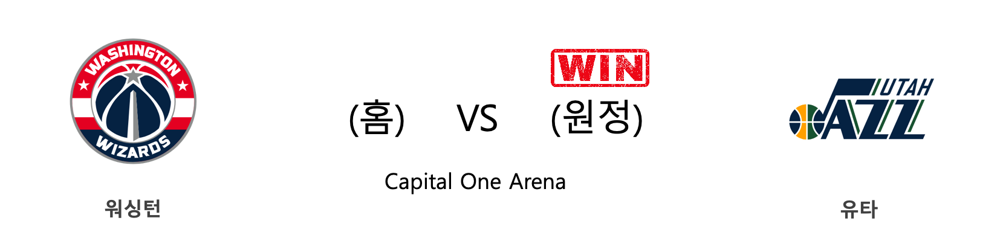
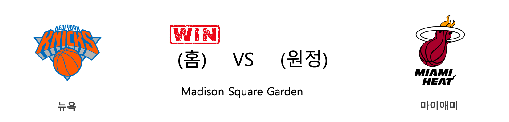
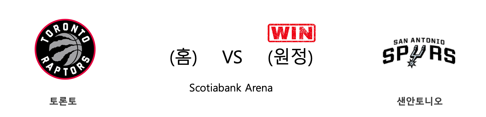
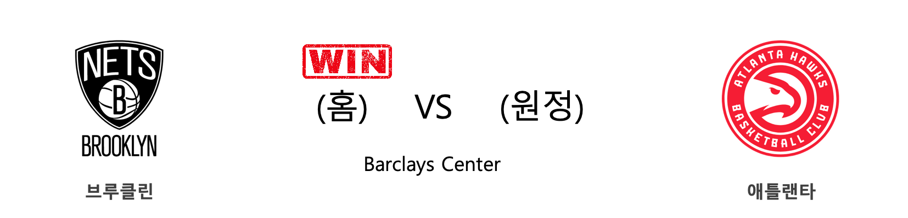

####  멤피스(홈) VS 골든스테이트(원정) 

<table class="tg">
  <tr>
    <th class="tg-rr9t">MEM</th>
    <th class="tg-rr9t">팀</th>
    <th class="tg-rr9t">GSW</th>
  </tr>
  <tr>
    <td class="tg-dcpn">2승 1패</td>
    <td class="tg-rr9t">시즌 상대전적</td>
    <td class="tg-dcpn">1승 2패</td>
  </tr>
  <tr>
    <td class="tg-dcpn">122</td>
    <td class="tg-rr9t">점수</td>
    <td class="tg-dcpn">102</td>
  </tr>
  <tr>
    <td class="tg-dcpn">34/65(52%)</td>
    <td class="tg-rr9t">2점(%)</td>
    <td class="tg-dcpn">18/58(31%)</td>
  </tr>
  <tr>
    <td class="tg-dcpn">11/35(31%)</td>
    <td class="tg-rr9t">3점(%)</td>
    <td class="tg-dcpn">17/34(50%)</td>
  </tr>
  <tr>
    <td class="tg-dcpn">21/25(84%)</td>
    <td class="tg-rr9t">자유투(%)</td>
    <td class="tg-dcpn">15/21(71%)</td>
  </tr>
  <tr>
    <td class="tg-dcpn">60</td>
    <td class="tg-rr9t">리바운드</td>
    <td class="tg-dcpn">47</td>
  </tr>
  <tr>
    <td class="tg-dcpn">33</td>
    <td class="tg-rr9t">어시스트</td>
    <td class="tg-dcpn">23</td>
  </tr>
  <tr>
    <td class="tg-dcpn">17</td>
    <td class="tg-rr9t">스틸</td>
    <td class="tg-dcpn">11</td>
  </tr>
  <tr>
    <td class="tg-dcpn">7</td>
    <td class="tg-rr9t">블록</td>
    <td class="tg-dcpn">6</td>
  </tr>
  <tr>
    <td class="tg-dcpn">16</td>
    <td class="tg-rr9t">턴오버</td>
    <td class="tg-dcpn">22</td>
  </tr>
  <tr>
    <td class="tg-dcpn">JonasValanciu(31) JarenJacksonJ(21)</td>
    <td class="tg-rr9t">주요 득점선수</td>
    <td class="tg-dcpn">D'AngeloRusse(34)</td>
  </tr>
</table>

#### 경기 관련 주요 기사         

[[오늘의 NBA] (1/11) 멤피스, 서부컨퍼런스 8위 등극](http://sports.news.naver.com/basketball/news/read.nhn?oid=486&aid=0000001193)

[[오늘의 NBA] (1/13) 더마 드로잔, 1년간 기다렸던 복수극](http://sports.news.naver.com/basketball/news/read.nhn?oid=486&aid=0000001195)

[[오늘의 NBA] (12/30) LAL 르브론 제임스, 9,000어시스트 달성](http://sports.news.naver.com/basketball/news/read.nhn?oid=486&aid=0000001181)

[[오늘의 NBA] (12/24) 자말 머레이와 데빈 부커의 뒤틀린 운명](http://sports.news.naver.com/basketball/news/read.nhn?oid=486&aid=0000001176)

[[오늘의 NBA] (12/29) 마이애미, 연장전 승부 전문가](http://sports.news.naver.com/basketball/news/read.nhn?oid=486&aid=0000001180)

        
        

####  피닉스(홈) VS 샬럿(원정) 

<table class="tg">
  <tr>
    <th class="tg-rr9t">PHX</th>
    <th class="tg-rr9t">팀</th>
    <th class="tg-rr9t">CHA</th>
  </tr>
  <tr>
    <td class="tg-dcpn">2승 0패</td>
    <td class="tg-rr9t">시즌 상대전적</td>
    <td class="tg-dcpn">0승 2패</td>
  </tr>
  <tr>
    <td class="tg-dcpn">100</td>
    <td class="tg-rr9t">점수</td>
    <td class="tg-dcpn">92</td>
  </tr>
  <tr>
    <td class="tg-dcpn">34/61(56%)</td>
    <td class="tg-rr9t">2점(%)</td>
    <td class="tg-dcpn">28/51(55%)</td>
  </tr>
  <tr>
    <td class="tg-dcpn">7/21(33%)</td>
    <td class="tg-rr9t">3점(%)</td>
    <td class="tg-dcpn">8/35(23%)</td>
  </tr>
  <tr>
    <td class="tg-dcpn">11/18(61%)</td>
    <td class="tg-rr9t">자유투(%)</td>
    <td class="tg-dcpn">12/18(67%)</td>
  </tr>
  <tr>
    <td class="tg-dcpn">51</td>
    <td class="tg-rr9t">리바운드</td>
    <td class="tg-dcpn">37</td>
  </tr>
  <tr>
    <td class="tg-dcpn">22</td>
    <td class="tg-rr9t">어시스트</td>
    <td class="tg-dcpn">25</td>
  </tr>
  <tr>
    <td class="tg-dcpn">8</td>
    <td class="tg-rr9t">스틸</td>
    <td class="tg-dcpn">10</td>
  </tr>
  <tr>
    <td class="tg-dcpn">5</td>
    <td class="tg-rr9t">블록</td>
    <td class="tg-dcpn">3</td>
  </tr>
  <tr>
    <td class="tg-dcpn">18</td>
    <td class="tg-rr9t">턴오버</td>
    <td class="tg-dcpn">14</td>
  </tr>
  <tr>
    <td class="tg-dcpn">DeandreAyton(18) KellyOubreJr.(25)</td>
    <td class="tg-rr9t">주요 득점선수</td>
    <td class="tg-dcpn">Devonte'Graha(22) DwayneBacon(24) CodyZeller(15)</td>
  </tr>
</table>

#### 경기 관련 주요 기사         

[[오늘의 NBA] (1/9) 그렉 포포비치 감독의 보스턴 수비 인수분해](http://sports.news.naver.com/basketball/news/read.nhn?oid=486&aid=0000001191)

[[오늘의 NBA] (12/28) 골든스테이트, 수비 코트에서 시작된 대반격](http://sports.news.naver.com/basketball/news/read.nhn?oid=486&aid=0000001179)

[[오늘의 NBA] (1/11) 멤피스, 서부컨퍼런스 8위 등극](http://sports.news.naver.com/basketball/news/read.nhn?oid=486&aid=0000001193)

[[오늘의 NBA] (12/23) 토론토, 포기할 줄 모르는 북방의 투사](http://sports.news.naver.com/basketball/news/read.nhn?oid=486&aid=0000001175)

[[오늘의 NBA] (1/13) 더마 드로잔, 1년간 기다렸던 복수극](http://sports.news.naver.com/basketball/news/read.nhn?oid=486&aid=0000001195)

        
        

####  워싱턴(홈) VS 유타(원정) 

<table class="tg">
  <tr>
    <th class="tg-rr9t">WAS</th>
    <th class="tg-rr9t">팀</th>
    <th class="tg-rr9t">UTA</th>
  </tr>
  <tr>
    <td class="tg-dcpn">0승 1패</td>
    <td class="tg-rr9t">시즌 상대전적</td>
    <td class="tg-dcpn">1승 0패</td>
  </tr>
  <tr>
    <td class="tg-dcpn">116</td>
    <td class="tg-rr9t">점수</td>
    <td class="tg-dcpn">127</td>
  </tr>
  <tr>
    <td class="tg-dcpn">40/71(56%)</td>
    <td class="tg-rr9t">2점(%)</td>
    <td class="tg-dcpn">38/60(63%)</td>
  </tr>
  <tr>
    <td class="tg-dcpn">7/22(32%)</td>
    <td class="tg-rr9t">3점(%)</td>
    <td class="tg-dcpn">10/30(33%)</td>
  </tr>
  <tr>
    <td class="tg-dcpn">15/17(88%)</td>
    <td class="tg-rr9t">자유투(%)</td>
    <td class="tg-dcpn">21/25(84%)</td>
  </tr>
  <tr>
    <td class="tg-dcpn">37</td>
    <td class="tg-rr9t">리바운드</td>
    <td class="tg-dcpn">44</td>
  </tr>
  <tr>
    <td class="tg-dcpn">28</td>
    <td class="tg-rr9t">어시스트</td>
    <td class="tg-dcpn">24</td>
  </tr>
  <tr>
    <td class="tg-dcpn">5</td>
    <td class="tg-rr9t">스틸</td>
    <td class="tg-dcpn">6</td>
  </tr>
  <tr>
    <td class="tg-dcpn">4</td>
    <td class="tg-rr9t">블록</td>
    <td class="tg-dcpn">2</td>
  </tr>
  <tr>
    <td class="tg-dcpn">9</td>
    <td class="tg-rr9t">턴오버</td>
    <td class="tg-dcpn">11</td>
  </tr>
  <tr>
    <td class="tg-dcpn">IanMahinmiC(15) DavisBertans(18) BradleyBealF(25) JordanMcRae(16)</td>
    <td class="tg-rr9t">주요 득점선수</td>
    <td class="tg-dcpn">BojanBogdanov(31) JoeInglesG(20) JordanClarkso(23) RudyGobertC(21)</td>
  </tr>
</table>

#### 경기 관련 주요 기사         

[It Was the Hottest Oscar Night Party. What Happened?](https://www.nytimes.com/2019/02/21/style/vanity-fair-oscar-party.html?partner=naver)

[[오늘의 NBA] (1/13) 더마 드로잔, 1년간 기다렸던 복수극](http://sports.news.naver.com/basketball/news/read.nhn?oid=486&aid=0000001195)

[[오늘의 NBA] (1/11) 멤피스, 서부컨퍼런스 8위 등극](http://sports.news.naver.com/basketball/news/read.nhn?oid=486&aid=0000001193)

[[오늘의 NBA] (11/30) 인디애나, 동부컨퍼런스의 복병](http://sports.news.naver.com/basketball/news/read.nhn?oid=486&aid=0000001152)

[[오늘의 NBA] (12/29) 마이애미, 연장전 승부 전문가](http://sports.news.naver.com/basketball/news/read.nhn?oid=486&aid=0000001180)

        
        

####  뉴욕(홈) VS 마이애미(원정) 

<table class="tg">
  <tr>
    <th class="tg-rr9t">NYK</th>
    <th class="tg-rr9t">팀</th>
    <th class="tg-rr9t">MIA</th>
  </tr>
  <tr>
    <td class="tg-dcpn">1승 1패</td>
    <td class="tg-rr9t">시즌 상대전적</td>
    <td class="tg-dcpn">1승 1패</td>
  </tr>
  <tr>
    <td class="tg-dcpn">124</td>
    <td class="tg-rr9t">점수</td>
    <td class="tg-dcpn">121</td>
  </tr>
  <tr>
    <td class="tg-dcpn">37/58(64%)</td>
    <td class="tg-rr9t">2점(%)</td>
    <td class="tg-dcpn">28/43(65%)</td>
  </tr>
  <tr>
    <td class="tg-dcpn">9/31(29%)</td>
    <td class="tg-rr9t">3점(%)</td>
    <td class="tg-dcpn">14/35(40%)</td>
  </tr>
  <tr>
    <td class="tg-dcpn">23/28(82%)</td>
    <td class="tg-rr9t">자유투(%)</td>
    <td class="tg-dcpn">23/28(82%)</td>
  </tr>
  <tr>
    <td class="tg-dcpn">39</td>
    <td class="tg-rr9t">리바운드</td>
    <td class="tg-dcpn">38</td>
  </tr>
  <tr>
    <td class="tg-dcpn">24</td>
    <td class="tg-rr9t">어시스트</td>
    <td class="tg-dcpn">24</td>
  </tr>
  <tr>
    <td class="tg-dcpn">11</td>
    <td class="tg-rr9t">스틸</td>
    <td class="tg-dcpn">2</td>
  </tr>
  <tr>
    <td class="tg-dcpn">3</td>
    <td class="tg-rr9t">블록</td>
    <td class="tg-dcpn">4</td>
  </tr>
  <tr>
    <td class="tg-dcpn">7</td>
    <td class="tg-rr9t">턴오버</td>
    <td class="tg-dcpn">14</td>
  </tr>
  <tr>
    <td class="tg-dcpn">JuliusRandleF(26) ReggieBullock(16) RJBarrettG(23) KevinKnoxII(17)</td>
    <td class="tg-rr9t">주요 득점선수</td>
    <td class="tg-dcpn">JamesJohnson(19) TylerHerro(15) KendrickNunnG(20) JimmyButlerF(25) BamAdebayoF(15)</td>
  </tr>
</table>

#### 경기 관련 주요 기사         

[[오늘의 NBA] (1/11) 멤피스, 서부컨퍼런스 8위 등극](http://sports.news.naver.com/basketball/news/read.nhn?oid=486&aid=0000001193)

[[오늘의 NBA] (1/6) 몬트레즐 해럴, 클리퍼스의 희소재](http://sports.news.naver.com/basketball/news/read.nhn?oid=486&aid=0000001188)

[[오늘의 NBA] (1/13) 더마 드로잔, 1년간 기다렸던 복수극](http://sports.news.naver.com/basketball/news/read.nhn?oid=486&aid=0000001195)

[[오늘의 NBA] (12/29) 마이애미, 연장전 승부 전문가](http://sports.news.naver.com/basketball/news/read.nhn?oid=486&aid=0000001180)

[[오늘의 NBA] (12/24) 자말 머레이와 데빈 부커의 뒤틀린 운명](http://sports.news.naver.com/basketball/news/read.nhn?oid=486&aid=0000001176)

        
        

####  덴버(홈) VS LA클리퍼스(원정) 

<table class="tg">
  <tr>
    <th class="tg-rr9t">DEN</th>
    <th class="tg-rr9t">팀</th>
    <th class="tg-rr9t">LAC</th>
  </tr>
  <tr>
    <td class="tg-dcpn">1승 0패</td>
    <td class="tg-rr9t">시즌 상대전적</td>
    <td class="tg-dcpn">0승 1패</td>
  </tr>
  <tr>
    <td class="tg-dcpn">114</td>
    <td class="tg-rr9t">점수</td>
    <td class="tg-dcpn">104</td>
  </tr>
  <tr>
    <td class="tg-dcpn">26/52(50%)</td>
    <td class="tg-rr9t">2점(%)</td>
    <td class="tg-dcpn">30/51(59%)</td>
  </tr>
  <tr>
    <td class="tg-dcpn">11/25(44%)</td>
    <td class="tg-rr9t">3점(%)</td>
    <td class="tg-dcpn">8/33(24%)</td>
  </tr>
  <tr>
    <td class="tg-dcpn">29/37(78%)</td>
    <td class="tg-rr9t">자유투(%)</td>
    <td class="tg-dcpn">20/26(77%)</td>
  </tr>
  <tr>
    <td class="tg-dcpn">44</td>
    <td class="tg-rr9t">리바운드</td>
    <td class="tg-dcpn">42</td>
  </tr>
  <tr>
    <td class="tg-dcpn">24</td>
    <td class="tg-rr9t">어시스트</td>
    <td class="tg-dcpn">21</td>
  </tr>
  <tr>
    <td class="tg-dcpn">7</td>
    <td class="tg-rr9t">스틸</td>
    <td class="tg-dcpn">8</td>
  </tr>
  <tr>
    <td class="tg-dcpn">4</td>
    <td class="tg-rr9t">블록</td>
    <td class="tg-dcpn">5</td>
  </tr>
  <tr>
    <td class="tg-dcpn">13</td>
    <td class="tg-rr9t">턴오버</td>
    <td class="tg-dcpn">14</td>
  </tr>
  <tr>
    <td class="tg-dcpn">JamalMurrayG(19) GaryHarrisG(15) NikolaJokicC(20)</td>
    <td class="tg-rr9t">주요 득점선수</td>
    <td class="tg-dcpn">KawhiLeonardF(30) LouWilliamsG(26) MontrezlHarre(25)</td>
  </tr>
</table>

#### 경기 관련 주요 기사         

[[오늘의 NBA] (1/13) 더마 드로잔, 1년간 기다렸던 복수극](http://sports.news.naver.com/basketball/news/read.nhn?oid=486&aid=0000001195)

[[오늘의 NBA] (1/12) 레이커스, "No LBJ, No AD, No Problem!"](http://sports.news.naver.com/basketball/news/read.nhn?oid=486&aid=0000001194)

[[오늘의 NBA] (1/5) 제이슨 테이텀, 보스턴의 밀당남](http://sports.news.naver.com/basketball/news/read.nhn?oid=486&aid=0000001187)

[[오늘의 NBA] (1/6) 몬트레즐 해럴, 클리퍼스의 희소재](http://sports.news.naver.com/basketball/news/read.nhn?oid=486&aid=0000001188)

[[오늘의 NBA] (12/29) 마이애미, 연장전 승부 전문가](http://sports.news.naver.com/basketball/news/read.nhn?oid=486&aid=0000001180)

        
        

####  토론토(홈) VS 샌안토니오(원정) 

<table class="tg">
  <tr>
    <th class="tg-rr9t">TOR</th>
    <th class="tg-rr9t">팀</th>
    <th class="tg-rr9t">SAS</th>
  </tr>
  <tr>
    <td class="tg-dcpn">0승 1패</td>
    <td class="tg-rr9t">시즌 상대전적</td>
    <td class="tg-dcpn">1승 0패</td>
  </tr>
  <tr>
    <td class="tg-dcpn">104</td>
    <td class="tg-rr9t">점수</td>
    <td class="tg-dcpn">105</td>
  </tr>
  <tr>
    <td class="tg-dcpn">22/48(46%)</td>
    <td class="tg-rr9t">2점(%)</td>
    <td class="tg-dcpn">31/55(56%)</td>
  </tr>
  <tr>
    <td class="tg-dcpn">17/48(35%)</td>
    <td class="tg-rr9t">3점(%)</td>
    <td class="tg-dcpn">7/32(22%)</td>
  </tr>
  <tr>
    <td class="tg-dcpn">9/11(82%)</td>
    <td class="tg-rr9t">자유투(%)</td>
    <td class="tg-dcpn">22/30(73%)</td>
  </tr>
  <tr>
    <td class="tg-dcpn">45</td>
    <td class="tg-rr9t">리바운드</td>
    <td class="tg-dcpn">51</td>
  </tr>
  <tr>
    <td class="tg-dcpn">30</td>
    <td class="tg-rr9t">어시스트</td>
    <td class="tg-dcpn">24</td>
  </tr>
  <tr>
    <td class="tg-dcpn">7</td>
    <td class="tg-rr9t">스틸</td>
    <td class="tg-dcpn">6</td>
  </tr>
  <tr>
    <td class="tg-dcpn">3</td>
    <td class="tg-rr9t">블록</td>
    <td class="tg-dcpn">5</td>
  </tr>
  <tr>
    <td class="tg-dcpn">11</td>
    <td class="tg-rr9t">턴오버</td>
    <td class="tg-dcpn">11</td>
  </tr>
  <tr>
    <td class="tg-dcpn">KyleLowryG(16) NormanPowellG(20) PascalSiakamF(15) SergeIbakaC(21)</td>
    <td class="tg-rr9t">주요 득점선수</td>
    <td class="tg-dcpn">DeMarDeRozanF(25) RudyGay(15)</td>
  </tr>
</table>

#### 경기 관련 주요 기사         

[[오늘의 NBA] (1/9) 그렉 포포비치 감독의 보스턴 수비 인수분해](http://sports.news.naver.com/basketball/news/read.nhn?oid=486&aid=0000001191)

[[오늘의 NBA] (1/1) 휴스턴의 불장난](http://sports.news.naver.com/basketball/news/read.nhn?oid=486&aid=0000001183)

[[오늘의 NBA] (12/29) 마이애미, 연장전 승부 전문가](http://sports.news.naver.com/basketball/news/read.nhn?oid=486&aid=0000001180)

[[오늘의 NBA] (1/8) POR 데미안 릴라드&카멜로 앤써니, 대역전극을 연출하다](http://sports.news.naver.com/basketball/news/read.nhn?oid=486&aid=0000001190)

[[오늘의 NBA] (1/5) 제이슨 테이텀, 보스턴의 밀당남](http://sports.news.naver.com/basketball/news/read.nhn?oid=486&aid=0000001187)

        
        

####  브루클린(홈) VS 애틀랜타(원정) 

<table class="tg">
  <tr>
    <th class="tg-rr9t">BKN</th>
    <th class="tg-rr9t">팀</th>
    <th class="tg-rr9t">ATL</th>
  </tr>
  <tr>
    <td class="tg-dcpn">3승 0패</td>
    <td class="tg-rr9t">시즌 상대전적</td>
    <td class="tg-dcpn">0승 3패</td>
  </tr>
  <tr>
    <td class="tg-dcpn">108</td>
    <td class="tg-rr9t">점수</td>
    <td class="tg-dcpn">86</td>
  </tr>
  <tr>
    <td class="tg-dcpn">31/51(61%)</td>
    <td class="tg-rr9t">2점(%)</td>
    <td class="tg-dcpn">20/49(41%)</td>
  </tr>
  <tr>
    <td class="tg-dcpn">10/26(38%)</td>
    <td class="tg-rr9t">3점(%)</td>
    <td class="tg-dcpn">12/48(25%)</td>
  </tr>
  <tr>
    <td class="tg-dcpn">16/29(55%)</td>
    <td class="tg-rr9t">자유투(%)</td>
    <td class="tg-dcpn">10/11(91%)</td>
  </tr>
  <tr>
    <td class="tg-dcpn">62</td>
    <td class="tg-rr9t">리바운드</td>
    <td class="tg-dcpn">33</td>
  </tr>
  <tr>
    <td class="tg-dcpn">25</td>
    <td class="tg-rr9t">어시스트</td>
    <td class="tg-dcpn">23</td>
  </tr>
  <tr>
    <td class="tg-dcpn">8</td>
    <td class="tg-rr9t">스틸</td>
    <td class="tg-dcpn">16</td>
  </tr>
  <tr>
    <td class="tg-dcpn">2</td>
    <td class="tg-rr9t">블록</td>
    <td class="tg-dcpn">4</td>
  </tr>
  <tr>
    <td class="tg-dcpn">24</td>
    <td class="tg-rr9t">턴오버</td>
    <td class="tg-dcpn">12</td>
  </tr>
  <tr>
    <td class="tg-dcpn">KyrieIrvingG(21)</td>
    <td class="tg-rr9t">주요 득점선수</td>
    <td class="tg-dcpn">CamReddishF(20)</td>
  </tr>
</table>

#### 경기 관련 주요 기사         

[[오늘의 NBA] (1/13) 더마 드로잔, 1년간 기다렸던 복수극](http://sports.news.naver.com/basketball/news/read.nhn?oid=486&aid=0000001195)

[[오늘의 NBA] (12/29) 마이애미, 연장전 승부 전문가](http://sports.news.naver.com/basketball/news/read.nhn?oid=486&aid=0000001180)

[[오늘의 NBA] (1/7) ORL 마켈 펄츠의 커리어 나이트](http://sports.news.naver.com/basketball/news/read.nhn?oid=486&aid=0000001189)

[[오늘의 NBA] (1/4) 제임스 하든, NBA 공격 코트의 지배자](http://sports.news.naver.com/basketball/news/read.nhn?oid=486&aid=0000001186)

[[오늘의 NBA] (1/6) 몬트레즐 해럴, 클리퍼스의 희소재](http://sports.news.naver.com/basketball/news/read.nhn?oid=486&aid=0000001188)

        
        

#### 리그 (Eastern) 순위
    

<table class="tg">
  <tr>
    <th class="tg-d14o">순위</th>
    <th class="tg-d14o">팀명</th>
    <th class="tg-d14o">경기수</th>
    <th class="tg-d14o">승</th>
    <th class="tg-d14o">패</th>
    <th class="tg-d14o">승차</th>
    <th class="tg-d14o">승률</th>
  </tr>
  
<tr>
    <td class="tg-50j8">1</td>
    <td class="tg-50j8">MIL</td>
    <td class="tg-50j8">39</td>
    <td class="tg-50j8">33</td>
    <td class="tg-50j8">6</td>
    <td class="tg-50j8">0</td>
    <td class="tg-50j8">0.846</td>
</tr>

<tr>
    <td class="tg-50j8">2</td>
    <td class="tg-50j8">MIA</td>
    <td class="tg-50j8">38</td>
    <td class="tg-50j8">27</td>
    <td class="tg-50j8">11</td>
    <td class="tg-50j8">6</td>
    <td class="tg-50j8">0.711</td>
</tr>

<tr>
    <td class="tg-50j8">3</td>
    <td class="tg-50j8">BOS</td>
    <td class="tg-50j8">35</td>
    <td class="tg-50j8">25</td>
    <td class="tg-50j8">10</td>
    <td class="tg-50j8">8</td>
    <td class="tg-50j8">0.714</td>
</tr>

<tr>
    <td class="tg-50j8">4</td>
    <td class="tg-50j8">TOR</td>
    <td class="tg-50j8">39</td>
    <td class="tg-50j8">25</td>
    <td class="tg-50j8">14</td>
    <td class="tg-50j8">8</td>
    <td class="tg-50j8">0.641</td>
</tr>

<tr>
    <td class="tg-50j8">5</td>
    <td class="tg-50j8">PHI</td>
    <td class="tg-50j8">38</td>
    <td class="tg-50j8">24</td>
    <td class="tg-50j8">14</td>
    <td class="tg-50j8">9</td>
    <td class="tg-50j8">0.632</td>
</tr>

<tr>
    <td class="tg-50j8">6</td>
    <td class="tg-50j8">IND</td>
    <td class="tg-50j8">39</td>
    <td class="tg-50j8">24</td>
    <td class="tg-50j8">15</td>
    <td class="tg-50j8">9</td>
    <td class="tg-50j8">0.615</td>
</tr>

<tr>
    <td class="tg-50j8">7</td>
    <td class="tg-50j8">BKN</td>
    <td class="tg-50j8">37</td>
    <td class="tg-50j8">18</td>
    <td class="tg-50j8">19</td>
    <td class="tg-50j8">15</td>
    <td class="tg-50j8">0.486</td>
</tr>

<tr>
    <td class="tg-50j8">8</td>
    <td class="tg-50j8">ORL</td>
    <td class="tg-50j8">38</td>
    <td class="tg-50j8">18</td>
    <td class="tg-50j8">20</td>
    <td class="tg-50j8">15</td>
    <td class="tg-50j8">0.474</td>
</tr>

<tr>
    <td class="tg-50j8">9</td>
    <td class="tg-50j8">CHA</td>
    <td class="tg-50j8">42</td>
    <td class="tg-50j8">15</td>
    <td class="tg-50j8">27</td>
    <td class="tg-50j8">18</td>
    <td class="tg-50j8">0.357</td>
</tr>

<tr>
    <td class="tg-50j8">10</td>
    <td class="tg-50j8">DET</td>
    <td class="tg-50j8">37</td>
    <td class="tg-50j8">14</td>
    <td class="tg-50j8">23</td>
    <td class="tg-50j8">19</td>
    <td class="tg-50j8">0.378</td>
</tr>

<tr>
    <td class="tg-50j8">11</td>
    <td class="tg-50j8">CHI</td>
    <td class="tg-50j8">38</td>
    <td class="tg-50j8">13</td>
    <td class="tg-50j8">25</td>
    <td class="tg-50j8">20</td>
    <td class="tg-50j8">0.342</td>
</tr>

<tr>
    <td class="tg-50j8">12</td>
    <td class="tg-50j8">WAS</td>
    <td class="tg-50j8">38</td>
    <td class="tg-50j8">12</td>
    <td class="tg-50j8">26</td>
    <td class="tg-50j8">21</td>
    <td class="tg-50j8">0.316</td>
</tr>

<tr>
    <td class="tg-50j8">13</td>
    <td class="tg-50j8">NYK</td>
    <td class="tg-50j8">40</td>
    <td class="tg-50j8">11</td>
    <td class="tg-50j8">29</td>
    <td class="tg-50j8">22</td>
    <td class="tg-50j8">0.275</td>
</tr>

<tr>
    <td class="tg-50j8">14</td>
    <td class="tg-50j8">CLE</td>
    <td class="tg-50j8">37</td>
    <td class="tg-50j8">10</td>
    <td class="tg-50j8">27</td>
    <td class="tg-50j8">23</td>
    <td class="tg-50j8">0.27</td>
</tr>

<tr>
    <td class="tg-50j8">15</td>
    <td class="tg-50j8">ATL</td>
    <td class="tg-50j8">39</td>
    <td class="tg-50j8">7</td>
    <td class="tg-50j8">32</td>
    <td class="tg-50j8">26</td>
    <td class="tg-50j8">0.179</td>
</tr>
</table> 
#### 리그 (Western) 순위
    

<table class="tg">
  <tr>
    <th class="tg-d14o">순위</th>
    <th class="tg-d14o">팀명</th>
    <th class="tg-d14o">경기수</th>
    <th class="tg-d14o">승</th>
    <th class="tg-d14o">패</th>
    <th class="tg-d14o">승차</th>
    <th class="tg-d14o">승률</th>
  </tr>
  
<tr>
    <td class="tg-50j8">1</td>
    <td class="tg-50j8">LAL</td>
    <td class="tg-50j8">38</td>
    <td class="tg-50j8">31</td>
    <td class="tg-50j8">7</td>
    <td class="tg-50j8">2</td>
    <td class="tg-50j8">0.816</td>
</tr>

<tr>
    <td class="tg-50j8">2</td>
    <td class="tg-50j8">LAC</td>
    <td class="tg-50j8">40</td>
    <td class="tg-50j8">27</td>
    <td class="tg-50j8">13</td>
    <td class="tg-50j8">6</td>
    <td class="tg-50j8">0.675</td>
</tr>

<tr>
    <td class="tg-50j8">3</td>
    <td class="tg-50j8">DEN</td>
    <td class="tg-50j8">37</td>
    <td class="tg-50j8">26</td>
    <td class="tg-50j8">11</td>
    <td class="tg-50j8">7</td>
    <td class="tg-50j8">0.703</td>
</tr>

<tr>
    <td class="tg-50j8">4</td>
    <td class="tg-50j8">UTA</td>
    <td class="tg-50j8">38</td>
    <td class="tg-50j8">26</td>
    <td class="tg-50j8">12</td>
    <td class="tg-50j8">7</td>
    <td class="tg-50j8">0.684</td>
</tr>

<tr>
    <td class="tg-50j8">5</td>
    <td class="tg-50j8">HOU</td>
    <td class="tg-50j8">37</td>
    <td class="tg-50j8">25</td>
    <td class="tg-50j8">12</td>
    <td class="tg-50j8">8</td>
    <td class="tg-50j8">0.676</td>
</tr>

<tr>
    <td class="tg-50j8">6</td>
    <td class="tg-50j8">DAL</td>
    <td class="tg-50j8">37</td>
    <td class="tg-50j8">22</td>
    <td class="tg-50j8">15</td>
    <td class="tg-50j8">11</td>
    <td class="tg-50j8">0.595</td>
</tr>

<tr>
    <td class="tg-50j8">7</td>
    <td class="tg-50j8">OKC</td>
    <td class="tg-50j8">38</td>
    <td class="tg-50j8">22</td>
    <td class="tg-50j8">16</td>
    <td class="tg-50j8">11</td>
    <td class="tg-50j8">0.579</td>
</tr>

<tr>
    <td class="tg-50j8">8</td>
    <td class="tg-50j8">MEM</td>
    <td class="tg-50j8">40</td>
    <td class="tg-50j8">18</td>
    <td class="tg-50j8">22</td>
    <td class="tg-50j8">15</td>
    <td class="tg-50j8">0.45</td>
</tr>

<tr>
    <td class="tg-50j8">9</td>
    <td class="tg-50j8">SAS</td>
    <td class="tg-50j8">37</td>
    <td class="tg-50j8">17</td>
    <td class="tg-50j8">20</td>
    <td class="tg-50j8">16</td>
    <td class="tg-50j8">0.459</td>
</tr>

<tr>
    <td class="tg-50j8">10</td>
    <td class="tg-50j8">POR</td>
    <td class="tg-50j8">37</td>
    <td class="tg-50j8">16</td>
    <td class="tg-50j8">21</td>
    <td class="tg-50j8">17</td>
    <td class="tg-50j8">0.432</td>
</tr>

<tr>
    <td class="tg-50j8">11</td>
    <td class="tg-50j8">PHX</td>
    <td class="tg-50j8">38</td>
    <td class="tg-50j8">15</td>
    <td class="tg-50j8">23</td>
    <td class="tg-50j8">18</td>
    <td class="tg-50j8">0.395</td>
</tr>

<tr>
    <td class="tg-50j8">12</td>
    <td class="tg-50j8">SAC</td>
    <td class="tg-50j8">39</td>
    <td class="tg-50j8">15</td>
    <td class="tg-50j8">24</td>
    <td class="tg-50j8">18</td>
    <td class="tg-50j8">0.385</td>
</tr>

<tr>
    <td class="tg-50j8">13</td>
    <td class="tg-50j8">MIN</td>
    <td class="tg-50j8">36</td>
    <td class="tg-50j8">14</td>
    <td class="tg-50j8">22</td>
    <td class="tg-50j8">19</td>
    <td class="tg-50j8">0.389</td>
</tr>

<tr>
    <td class="tg-50j8">14</td>
    <td class="tg-50j8">NOP</td>
    <td class="tg-50j8">39</td>
    <td class="tg-50j8">14</td>
    <td class="tg-50j8">25</td>
    <td class="tg-50j8">19</td>
    <td class="tg-50j8">0.359</td>
</tr>

<tr>
    <td class="tg-50j8">15</td>
    <td class="tg-50j8">GSW</td>
    <td class="tg-50j8">41</td>
    <td class="tg-50j8">9</td>
    <td class="tg-50j8">32</td>
    <td class="tg-50j8">24</td>
    <td class="tg-50j8">0.22</td>
</tr>
</table> 

        
        
#nba #미국농구 #엔비에이 #농구분석 #토토 #스포츠토토 #경기예측 #농구결과 #20200113 #멤피스 #골든스테이트 #피닉스 #샬럿 #워싱턴 #유타 #뉴욕 #마이애미 #덴버 #LA클리퍼스 #토론토 #샌안토니오 #브루클린 #애틀랜타 #멤피스골든스테이트 #피닉스샬럿 #워싱턴유타 #뉴욕마이애미 #덴버LA클리퍼스 #토론토샌안토니오 #브루클린애틀랜타 