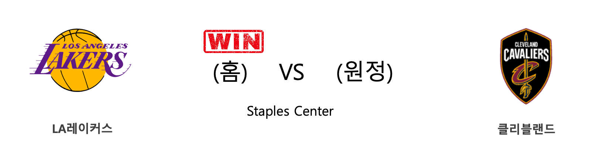

####  인디애나(홈) VS 필라델피아(원정) 

<table class="tg">
  <tr>
    <th class="tg-rr9t">IND</th>
    <th class="tg-rr9t">팀</th>
    <th class="tg-rr9t">PHI</th>
  </tr>
  <tr>
    <td class="tg-dcpn">2승 1패</td>
    <td class="tg-rr9t">시즌 상대전적</td>
    <td class="tg-dcpn">1승 2패</td>
  </tr>
  <tr>
    <td class="tg-dcpn">101</td>
    <td class="tg-rr9t">점수</td>
    <td class="tg-dcpn">95</td>
  </tr>
  <tr>
    <td class="tg-dcpn">23/60(38%)</td>
    <td class="tg-rr9t">2점(%)</td>
    <td class="tg-dcpn">31/56(55%)</td>
  </tr>
  <tr>
    <td class="tg-dcpn">10/26(38%)</td>
    <td class="tg-rr9t">3점(%)</td>
    <td class="tg-dcpn">6/33(18%)</td>
  </tr>
  <tr>
    <td class="tg-dcpn">25/31(81%)</td>
    <td class="tg-rr9t">자유투(%)</td>
    <td class="tg-dcpn">15/19(79%)</td>
  </tr>
  <tr>
    <td class="tg-dcpn">50</td>
    <td class="tg-rr9t">리바운드</td>
    <td class="tg-dcpn">52</td>
  </tr>
  <tr>
    <td class="tg-dcpn">24</td>
    <td class="tg-rr9t">어시스트</td>
    <td class="tg-dcpn">17</td>
  </tr>
  <tr>
    <td class="tg-dcpn">6</td>
    <td class="tg-rr9t">스틸</td>
    <td class="tg-dcpn">6</td>
  </tr>
  <tr>
    <td class="tg-dcpn">6</td>
    <td class="tg-rr9t">블록</td>
    <td class="tg-dcpn">4</td>
  </tr>
  <tr>
    <td class="tg-dcpn">9</td>
    <td class="tg-rr9t">턴오버</td>
    <td class="tg-dcpn">11</td>
  </tr>
  <tr>
    <td class="tg-dcpn">T.J.WarrenF(21) MalcolmBrogdo(21)</td>
    <td class="tg-rr9t">주요 득점선수</td>
    <td class="tg-dcpn">TobiasHarrisF(15) BenSimmonsG(24) JoshRichardso(23)</td>
  </tr>
</table>

#### 경기 관련 주요 기사         

[[오늘의 NBA] (12/21) 크리스탑스 포르징기스, 댈러스의 새로운 버팀목](http://sports.news.naver.com/basketball/news/read.nhn?oid=486&aid=0000001173)

[[오늘의 NBA] (1/12) 레이커스, "No LBJ, No AD, No Problem!"](http://sports.news.naver.com/basketball/news/read.nhn?oid=486&aid=0000001194)

[[오늘의 NBA] (1/1) 휴스턴의 불장난](http://sports.news.naver.com/basketball/news/read.nhn?oid=486&aid=0000001183)

[[오늘의 NBA] (1/4) 제임스 하든, NBA 공격 코트의 지배자](http://sports.news.naver.com/basketball/news/read.nhn?oid=486&aid=0000001186)

[[오늘의 NBA] (1/14) 샤이 길저스-알랙선더, 선배 러셀 웨스트브룩을 오마쥬하다](http://sports.news.naver.com/basketball/news/read.nhn?oid=486&aid=0000001196)

        
        

####  미네소타(홈) VS 오클라호마씨티(원정) 

<table class="tg">
  <tr>
    <th class="tg-rr9t">MIN</th>
    <th class="tg-rr9t">팀</th>
    <th class="tg-rr9t">OKC</th>
  </tr>
  <tr>
    <td class="tg-dcpn">0승 2패</td>
    <td class="tg-rr9t">시즌 상대전적</td>
    <td class="tg-dcpn">2승 0패</td>
  </tr>
  <tr>
    <td class="tg-dcpn">104</td>
    <td class="tg-rr9t">점수</td>
    <td class="tg-dcpn">117</td>
  </tr>
  <tr>
    <td class="tg-dcpn">26/56(46%)</td>
    <td class="tg-rr9t">2점(%)</td>
    <td class="tg-dcpn">29/52(56%)</td>
  </tr>
  <tr>
    <td class="tg-dcpn">12/35(34%)</td>
    <td class="tg-rr9t">3점(%)</td>
    <td class="tg-dcpn">12/30(40%)</td>
  </tr>
  <tr>
    <td class="tg-dcpn">16/21(76%)</td>
    <td class="tg-rr9t">자유투(%)</td>
    <td class="tg-dcpn">23/26(88%)</td>
  </tr>
  <tr>
    <td class="tg-dcpn">37</td>
    <td class="tg-rr9t">리바운드</td>
    <td class="tg-dcpn">51</td>
  </tr>
  <tr>
    <td class="tg-dcpn">23</td>
    <td class="tg-rr9t">어시스트</td>
    <td class="tg-dcpn">25</td>
  </tr>
  <tr>
    <td class="tg-dcpn">10</td>
    <td class="tg-rr9t">스틸</td>
    <td class="tg-dcpn">4</td>
  </tr>
  <tr>
    <td class="tg-dcpn">6</td>
    <td class="tg-rr9t">블록</td>
    <td class="tg-dcpn">6</td>
  </tr>
  <tr>
    <td class="tg-dcpn">9</td>
    <td class="tg-rr9t">턴오버</td>
    <td class="tg-dcpn">15</td>
  </tr>
  <tr>
    <td class="tg-dcpn">ShabazzNapier(16) RobertCovingt(18) NazReid(20)</td>
    <td class="tg-rr9t">주요 득점선수</td>
    <td class="tg-dcpn">DaniloGallina(30) ShaiGilgeous-(20)</td>
  </tr>
</table>

#### 경기 관련 주요 기사         

[[오늘의 NBA] (12/10) 데릭 로즈, 모터 시티의 해결사](http://sports.news.naver.com/basketball/news/read.nhn?oid=486&aid=0000001162)

[[오늘의 NBA] (1/14) 샤이 길저스-알랙선더, 선배 러셀 웨스트브룩을 오마쥬하다](http://sports.news.naver.com/basketball/news/read.nhn?oid=486&aid=0000001196)

[[오늘의 NBA] (1/8) POR 데미안 릴라드&카멜로 앤써니, 대역전극을 연출하다](http://sports.news.naver.com/basketball/news/read.nhn?oid=486&aid=0000001190)

[[오늘의 NBA] (1/12) 레이커스, "No LBJ, No AD, No Problem!"](http://sports.news.naver.com/basketball/news/read.nhn?oid=486&aid=0000001194)

[[오늘의 NBA] (1/6) 몬트레즐 해럴, 클리퍼스의 희소재](http://sports.news.naver.com/basketball/news/read.nhn?oid=486&aid=0000001188)

        
        

####  LA레이커스(홈) VS 클리블랜드(원정) 

<table class="tg">
  <tr>
    <th class="tg-rr9t">LAL</th>
    <th class="tg-rr9t">팀</th>
    <th class="tg-rr9t">CLE</th>
  </tr>
  <tr>
    <td class="tg-dcpn">1승 0패</td>
    <td class="tg-rr9t">시즌 상대전적</td>
    <td class="tg-dcpn">0승 1패</td>
  </tr>
  <tr>
    <td class="tg-dcpn">128</td>
    <td class="tg-rr9t">점수</td>
    <td class="tg-dcpn">99</td>
  </tr>
  <tr>
    <td class="tg-dcpn">37/58(64%)</td>
    <td class="tg-rr9t">2점(%)</td>
    <td class="tg-dcpn">31/60(52%)</td>
  </tr>
  <tr>
    <td class="tg-dcpn">11/30(37%)</td>
    <td class="tg-rr9t">3점(%)</td>
    <td class="tg-dcpn">7/25(28%)</td>
  </tr>
  <tr>
    <td class="tg-dcpn">21/28(75%)</td>
    <td class="tg-rr9t">자유투(%)</td>
    <td class="tg-dcpn">16/24(67%)</td>
  </tr>
  <tr>
    <td class="tg-dcpn">45</td>
    <td class="tg-rr9t">리바운드</td>
    <td class="tg-dcpn">40</td>
  </tr>
  <tr>
    <td class="tg-dcpn">33</td>
    <td class="tg-rr9t">어시스트</td>
    <td class="tg-dcpn">21</td>
  </tr>
  <tr>
    <td class="tg-dcpn">8</td>
    <td class="tg-rr9t">스틸</td>
    <td class="tg-dcpn">4</td>
  </tr>
  <tr>
    <td class="tg-dcpn">3</td>
    <td class="tg-rr9t">블록</td>
    <td class="tg-dcpn">1</td>
  </tr>
  <tr>
    <td class="tg-dcpn">9</td>
    <td class="tg-rr9t">턴오버</td>
    <td class="tg-dcpn">19</td>
  </tr>
  <tr>
    <td class="tg-dcpn">DwightHoward(21) LeBronJamesF(31)</td>
    <td class="tg-rr9t">주요 득점선수</td>
    <td class="tg-dcpn">KevinLoveF(21) CediOsmanF(15) DariusGarland(16) TristanThomps(17) CollinSextonG(16)</td>
  </tr>
</table>

#### 경기 관련 주요 기사         

[[오늘의 NBA] (12/29) 마이애미, 연장전 승부 전문가](http://sports.news.naver.com/basketball/news/read.nhn?oid=486&aid=0000001180)

[[오늘의 NBA] (1/14) 샤이 길저스-알랙선더, 선배 러셀 웨스트브룩을 오마쥬하다](http://sports.news.naver.com/basketball/news/read.nhn?oid=486&aid=0000001196)

[[오늘의 NBA] (1/3) 마이클 포터 주니어, 덴버의 기다림에 응답하다!](http://sports.news.naver.com/basketball/news/read.nhn?oid=486&aid=0000001185)

[[오늘의 NBA] (1/12) 레이커스, "No LBJ, No AD, No Problem!"](http://sports.news.naver.com/basketball/news/read.nhn?oid=486&aid=0000001194)

[[오늘의 NBA] (11/13) LAL 카일 쿠즈마의 대반격](http://sports.news.naver.com/basketball/news/read.nhn?oid=486&aid=0000001136)

        
        

####  포틀랜드(홈) VS 샬럿(원정) 

<table class="tg">
  <tr>
    <th class="tg-rr9t">POR</th>
    <th class="tg-rr9t">팀</th>
    <th class="tg-rr9t">CHA</th>
  </tr>
  <tr>
    <td class="tg-dcpn">1승 0패</td>
    <td class="tg-rr9t">시즌 상대전적</td>
    <td class="tg-dcpn">0승 1패</td>
  </tr>
  <tr>
    <td class="tg-dcpn">115</td>
    <td class="tg-rr9t">점수</td>
    <td class="tg-dcpn">112</td>
  </tr>
  <tr>
    <td class="tg-dcpn">26/46(57%)</td>
    <td class="tg-rr9t">2점(%)</td>
    <td class="tg-dcpn">22/52(42%)</td>
  </tr>
  <tr>
    <td class="tg-dcpn">16/37(43%)</td>
    <td class="tg-rr9t">3점(%)</td>
    <td class="tg-dcpn">18/38(47%)</td>
  </tr>
  <tr>
    <td class="tg-dcpn">15/19(79%)</td>
    <td class="tg-rr9t">자유투(%)</td>
    <td class="tg-dcpn">14/18(78%)</td>
  </tr>
  <tr>
    <td class="tg-dcpn">47</td>
    <td class="tg-rr9t">리바운드</td>
    <td class="tg-dcpn">42</td>
  </tr>
  <tr>
    <td class="tg-dcpn">26</td>
    <td class="tg-rr9t">어시스트</td>
    <td class="tg-dcpn">24</td>
  </tr>
  <tr>
    <td class="tg-dcpn">4</td>
    <td class="tg-rr9t">스틸</td>
    <td class="tg-dcpn">7</td>
  </tr>
  <tr>
    <td class="tg-dcpn">5</td>
    <td class="tg-rr9t">블록</td>
    <td class="tg-dcpn">3</td>
  </tr>
  <tr>
    <td class="tg-dcpn">13</td>
    <td class="tg-rr9t">턴오버</td>
    <td class="tg-dcpn">8</td>
  </tr>
  <tr>
    <td class="tg-dcpn">CarmeloAnthon(17) DamianLillard(30) AnthonyTolliv(16) CJMcCollumG(27)</td>
    <td class="tg-rr9t">주요 득점선수</td>
    <td class="tg-dcpn">P.J.Washingto(20) TerryRozierG(25) Devonte'Graha(27)</td>
  </tr>
</table>

#### 경기 관련 주요 기사         

[[오늘의 NBA] (1/2) 미첼 로빈슨, MSG 코트의 새로운 희망](http://sports.news.naver.com/basketball/news/read.nhn?oid=486&aid=0000001184)

[[오늘의 NBA] (1/11) 멤피스, 서부컨퍼런스 8위 등극](http://sports.news.naver.com/basketball/news/read.nhn?oid=486&aid=0000001193)

[[오늘의 NBA] (1/12) 레이커스, "No LBJ, No AD, No Problem!"](http://sports.news.naver.com/basketball/news/read.nhn?oid=486&aid=0000001194)

[[오늘의 NBA] (12/14) 레이커스, 마이애미 홈 코트를 점령하다](http://sports.news.naver.com/basketball/news/read.nhn?oid=486&aid=0000001166)

[[오늘의 NBA] (1/14) 샤이 길저스-알랙선더, 선배 러셀 웨스트브룩을 오마쥬하다](http://sports.news.naver.com/basketball/news/read.nhn?oid=486&aid=0000001196)

        
        

####  보스턴(홈) VS 시카고(원정) 

<table class="tg">
  <tr>
    <th class="tg-rr9t">BOS</th>
    <th class="tg-rr9t">팀</th>
    <th class="tg-rr9t">CHI</th>
  </tr>
  <tr>
    <td class="tg-dcpn">2승 0패</td>
    <td class="tg-rr9t">시즌 상대전적</td>
    <td class="tg-dcpn">0승 2패</td>
  </tr>
  <tr>
    <td class="tg-dcpn">113</td>
    <td class="tg-rr9t">점수</td>
    <td class="tg-dcpn">101</td>
  </tr>
  <tr>
    <td class="tg-dcpn">30/60(50%)</td>
    <td class="tg-rr9t">2점(%)</td>
    <td class="tg-dcpn">31/56(55%)</td>
  </tr>
  <tr>
    <td class="tg-dcpn">9/23(39%)</td>
    <td class="tg-rr9t">3점(%)</td>
    <td class="tg-dcpn">6/25(24%)</td>
  </tr>
  <tr>
    <td class="tg-dcpn">26/29(90%)</td>
    <td class="tg-rr9t">자유투(%)</td>
    <td class="tg-dcpn">21/26(81%)</td>
  </tr>
  <tr>
    <td class="tg-dcpn">43</td>
    <td class="tg-rr9t">리바운드</td>
    <td class="tg-dcpn">38</td>
  </tr>
  <tr>
    <td class="tg-dcpn">28</td>
    <td class="tg-rr9t">어시스트</td>
    <td class="tg-dcpn">16</td>
  </tr>
  <tr>
    <td class="tg-dcpn">7</td>
    <td class="tg-rr9t">스틸</td>
    <td class="tg-dcpn">5</td>
  </tr>
  <tr>
    <td class="tg-dcpn">6</td>
    <td class="tg-rr9t">블록</td>
    <td class="tg-dcpn">5</td>
  </tr>
  <tr>
    <td class="tg-dcpn">12</td>
    <td class="tg-rr9t">턴오버</td>
    <td class="tg-dcpn">14</td>
  </tr>
  <tr>
    <td class="tg-dcpn">EnesKanterC(15) JaylenBrownG(19) JaysonTatumF(21)</td>
    <td class="tg-rr9t">주요 득점선수</td>
    <td class="tg-dcpn">ZachLaVineG(30) ThaddeusYoung(17)</td>
  </tr>
</table>

#### 경기 관련 주요 기사         

[[오늘의 NBA] (1/10) PHI vs BOS, 먹이사슬의 역전!](http://sports.news.naver.com/basketball/news/read.nhn?oid=486&aid=0000001192)

[[오늘의 NBA] (12/26) NBA 2019년 크리스마스 축제](http://sports.news.naver.com/basketball/news/read.nhn?oid=486&aid=0000001177)

[[오늘의 NBA] (1/9) 그렉 포포비치 감독의 보스턴 수비 인수분해](http://sports.news.naver.com/basketball/news/read.nhn?oid=486&aid=0000001191)

[[오늘의 NBA] (1/7) ORL 마켈 펄츠의 커리어 나이트](http://sports.news.naver.com/basketball/news/read.nhn?oid=486&aid=0000001189)

[[오늘의 NBA] (12/23) 토론토, 포기할 줄 모르는 북방의 투사](http://sports.news.naver.com/basketball/news/read.nhn?oid=486&aid=0000001175)

        
        

####  새크라멘토(홈) VS 올랜도(원정) 

<table class="tg">
  <tr>
    <th class="tg-rr9t">SAC</th>
    <th class="tg-rr9t">팀</th>
    <th class="tg-rr9t">ORL</th>
  </tr>
  <tr>
    <td class="tg-dcpn">0승 1패</td>
    <td class="tg-rr9t">시즌 상대전적</td>
    <td class="tg-dcpn">1승 0패</td>
  </tr>
  <tr>
    <td class="tg-dcpn">112</td>
    <td class="tg-rr9t">점수</td>
    <td class="tg-dcpn">114</td>
  </tr>
  <tr>
    <td class="tg-dcpn">33/57(58%)</td>
    <td class="tg-rr9t">2점(%)</td>
    <td class="tg-dcpn">31/63(49%)</td>
  </tr>
  <tr>
    <td class="tg-dcpn">12/31(39%)</td>
    <td class="tg-rr9t">3점(%)</td>
    <td class="tg-dcpn">9/29(31%)</td>
  </tr>
  <tr>
    <td class="tg-dcpn">10/11(91%)</td>
    <td class="tg-rr9t">자유투(%)</td>
    <td class="tg-dcpn">25/30(83%)</td>
  </tr>
  <tr>
    <td class="tg-dcpn">45</td>
    <td class="tg-rr9t">리바운드</td>
    <td class="tg-dcpn">46</td>
  </tr>
  <tr>
    <td class="tg-dcpn">25</td>
    <td class="tg-rr9t">어시스트</td>
    <td class="tg-dcpn">17</td>
  </tr>
  <tr>
    <td class="tg-dcpn">6</td>
    <td class="tg-rr9t">스틸</td>
    <td class="tg-dcpn">6</td>
  </tr>
  <tr>
    <td class="tg-dcpn">4</td>
    <td class="tg-rr9t">블록</td>
    <td class="tg-dcpn">5</td>
  </tr>
  <tr>
    <td class="tg-dcpn">12</td>
    <td class="tg-rr9t">턴오버</td>
    <td class="tg-dcpn">8</td>
  </tr>
  <tr>
    <td class="tg-dcpn">De'AaronFoxG(31) NemanjaBjelic(34) MarvinBagleyI(18) BuddyHieldG(16)</td>
    <td class="tg-rr9t">주요 득점선수</td>
    <td class="tg-dcpn">EvanFournierG(25) MarkelleFultz(16) NikolaVucevic(26) AaronGordonF(19)</td>
  </tr>
</table>

#### 경기 관련 주요 기사         

[[오늘의 NBA] (12/21) 크리스탑스 포르징기스, 댈러스의 새로운 버팀목](http://sports.news.naver.com/basketball/news/read.nhn?oid=486&aid=0000001173)

[[오늘의 NBA] (12/29) 마이애미, 연장전 승부 전문가](http://sports.news.naver.com/basketball/news/read.nhn?oid=486&aid=0000001180)

[[오늘의 NBA] (11/30) 인디애나, 동부컨퍼런스의 복병](http://sports.news.naver.com/basketball/news/read.nhn?oid=486&aid=0000001152)

[[오늘의 NBA] (1/7) ORL 마켈 펄츠의 커리어 나이트](http://sports.news.naver.com/basketball/news/read.nhn?oid=486&aid=0000001189)

[[오늘의 NBA] (1/5) 제이슨 테이텀, 보스턴의 밀당남](http://sports.news.naver.com/basketball/news/read.nhn?oid=486&aid=0000001187)

        
        

####  디트로이트(홈) VS 뉴올리언스(원정) 

<table class="tg">
  <tr>
    <th class="tg-rr9t">DET</th>
    <th class="tg-rr9t">팀</th>
    <th class="tg-rr9t">NOP</th>
  </tr>
  <tr>
    <td class="tg-dcpn">1승 1패</td>
    <td class="tg-rr9t">시즌 상대전적</td>
    <td class="tg-dcpn">1승 1패</td>
  </tr>
  <tr>
    <td class="tg-dcpn">110</td>
    <td class="tg-rr9t">점수</td>
    <td class="tg-dcpn">117</td>
  </tr>
  <tr>
    <td class="tg-dcpn">29/67(43%)</td>
    <td class="tg-rr9t">2점(%)</td>
    <td class="tg-dcpn">34/77(44%)</td>
  </tr>
  <tr>
    <td class="tg-dcpn">11/32(34%)</td>
    <td class="tg-rr9t">3점(%)</td>
    <td class="tg-dcpn">9/26(35%)</td>
  </tr>
  <tr>
    <td class="tg-dcpn">19/24(79%)</td>
    <td class="tg-rr9t">자유투(%)</td>
    <td class="tg-dcpn">22/27(81%)</td>
  </tr>
  <tr>
    <td class="tg-dcpn">43</td>
    <td class="tg-rr9t">리바운드</td>
    <td class="tg-dcpn">61</td>
  </tr>
  <tr>
    <td class="tg-dcpn">27</td>
    <td class="tg-rr9t">어시스트</td>
    <td class="tg-dcpn">23</td>
  </tr>
  <tr>
    <td class="tg-dcpn">11</td>
    <td class="tg-rr9t">스틸</td>
    <td class="tg-dcpn">6</td>
  </tr>
  <tr>
    <td class="tg-dcpn">8</td>
    <td class="tg-rr9t">블록</td>
    <td class="tg-dcpn">5</td>
  </tr>
  <tr>
    <td class="tg-dcpn">9</td>
    <td class="tg-rr9t">턴오버</td>
    <td class="tg-dcpn">19</td>
  </tr>
  <tr>
    <td class="tg-dcpn">SekouDoumbouy(16) DerrickRose(23) ChristianWood(18)</td>
    <td class="tg-rr9t">주요 득점선수</td>
    <td class="tg-dcpn">JahlilOkaforC(25) E'TwaunMooreF(16) NicoloMelliF(20) LonzoBallG(17)</td>
  </tr>
</table>

#### 경기 관련 주요 기사         

[[오늘의 NBA] (1/14) 샤이 길저스-알랙선더, 선배 러셀 웨스트브룩을 오마쥬하다](http://sports.news.naver.com/basketball/news/read.nhn?oid=486&aid=0000001196)

[[오늘의 NBA] (1/12) 레이커스, "No LBJ, No AD, No Problem!"](http://sports.news.naver.com/basketball/news/read.nhn?oid=486&aid=0000001194)

[[오늘의 NBA] (12/29) 마이애미, 연장전 승부 전문가](http://sports.news.naver.com/basketball/news/read.nhn?oid=486&aid=0000001180)

[[오늘의 NBA] (12/24) 자말 머레이와 데빈 부커의 뒤틀린 운명](http://sports.news.naver.com/basketball/news/read.nhn?oid=486&aid=0000001176)

[[오늘의 NBA] (12/31) 불의 군주 워싱턴](http://sports.news.naver.com/basketball/news/read.nhn?oid=486&aid=0000001182)

        
        

#### 리그 (Eastern) 순위
    

<table class="tg">
  <tr>
    <th class="tg-d14o">순위</th>
    <th class="tg-d14o">팀명</th>
    <th class="tg-d14o">경기수</th>
    <th class="tg-d14o">승</th>
    <th class="tg-d14o">패</th>
    <th class="tg-d14o">승차</th>
    <th class="tg-d14o">승률</th>
  </tr>
  
<tr>
    <td class="tg-50j8">1</td>
    <td class="tg-50j8">MIL</td>
    <td class="tg-50j8">39</td>
    <td class="tg-50j8">33</td>
    <td class="tg-50j8">6</td>
    <td class="tg-50j8">0</td>
    <td class="tg-50j8">0.846</td>
</tr>

<tr>
    <td class="tg-50j8">2</td>
    <td class="tg-50j8">MIA</td>
    <td class="tg-50j8">38</td>
    <td class="tg-50j8">27</td>
    <td class="tg-50j8">11</td>
    <td class="tg-50j8">6</td>
    <td class="tg-50j8">0.711</td>
</tr>

<tr>
    <td class="tg-50j8">3</td>
    <td class="tg-50j8">BOS</td>
    <td class="tg-50j8">36</td>
    <td class="tg-50j8">26</td>
    <td class="tg-50j8">10</td>
    <td class="tg-50j8">7</td>
    <td class="tg-50j8">0.722</td>
</tr>

<tr>
    <td class="tg-50j8">4</td>
    <td class="tg-50j8">TOR</td>
    <td class="tg-50j8">39</td>
    <td class="tg-50j8">25</td>
    <td class="tg-50j8">14</td>
    <td class="tg-50j8">8</td>
    <td class="tg-50j8">0.641</td>
</tr>

<tr>
    <td class="tg-50j8">5</td>
    <td class="tg-50j8">IND</td>
    <td class="tg-50j8">40</td>
    <td class="tg-50j8">25</td>
    <td class="tg-50j8">15</td>
    <td class="tg-50j8">8</td>
    <td class="tg-50j8">0.625</td>
</tr>

<tr>
    <td class="tg-50j8">6</td>
    <td class="tg-50j8">PHI</td>
    <td class="tg-50j8">39</td>
    <td class="tg-50j8">24</td>
    <td class="tg-50j8">15</td>
    <td class="tg-50j8">9</td>
    <td class="tg-50j8">0.615</td>
</tr>

<tr>
    <td class="tg-50j8">7</td>
    <td class="tg-50j8">ORL</td>
    <td class="tg-50j8">39</td>
    <td class="tg-50j8">19</td>
    <td class="tg-50j8">20</td>
    <td class="tg-50j8">14</td>
    <td class="tg-50j8">0.487</td>
</tr>

<tr>
    <td class="tg-50j8">8</td>
    <td class="tg-50j8">BKN</td>
    <td class="tg-50j8">37</td>
    <td class="tg-50j8">18</td>
    <td class="tg-50j8">19</td>
    <td class="tg-50j8">15</td>
    <td class="tg-50j8">0.486</td>
</tr>

<tr>
    <td class="tg-50j8">9</td>
    <td class="tg-50j8">CHA</td>
    <td class="tg-50j8">43</td>
    <td class="tg-50j8">15</td>
    <td class="tg-50j8">28</td>
    <td class="tg-50j8">18</td>
    <td class="tg-50j8">0.349</td>
</tr>

<tr>
    <td class="tg-50j8">10</td>
    <td class="tg-50j8">DET</td>
    <td class="tg-50j8">38</td>
    <td class="tg-50j8">14</td>
    <td class="tg-50j8">24</td>
    <td class="tg-50j8">19</td>
    <td class="tg-50j8">0.368</td>
</tr>

<tr>
    <td class="tg-50j8">11</td>
    <td class="tg-50j8">CHI</td>
    <td class="tg-50j8">39</td>
    <td class="tg-50j8">13</td>
    <td class="tg-50j8">26</td>
    <td class="tg-50j8">20</td>
    <td class="tg-50j8">0.333</td>
</tr>

<tr>
    <td class="tg-50j8">12</td>
    <td class="tg-50j8">WAS</td>
    <td class="tg-50j8">38</td>
    <td class="tg-50j8">12</td>
    <td class="tg-50j8">26</td>
    <td class="tg-50j8">21</td>
    <td class="tg-50j8">0.316</td>
</tr>

<tr>
    <td class="tg-50j8">13</td>
    <td class="tg-50j8">NYK</td>
    <td class="tg-50j8">40</td>
    <td class="tg-50j8">11</td>
    <td class="tg-50j8">29</td>
    <td class="tg-50j8">22</td>
    <td class="tg-50j8">0.275</td>
</tr>

<tr>
    <td class="tg-50j8">14</td>
    <td class="tg-50j8">CLE</td>
    <td class="tg-50j8">38</td>
    <td class="tg-50j8">10</td>
    <td class="tg-50j8">28</td>
    <td class="tg-50j8">23</td>
    <td class="tg-50j8">0.263</td>
</tr>

<tr>
    <td class="tg-50j8">15</td>
    <td class="tg-50j8">ATL</td>
    <td class="tg-50j8">39</td>
    <td class="tg-50j8">7</td>
    <td class="tg-50j8">32</td>
    <td class="tg-50j8">26</td>
    <td class="tg-50j8">0.179</td>
</tr>
</table> 
#### 리그 (Western) 순위
    

<table class="tg">
  <tr>
    <th class="tg-d14o">순위</th>
    <th class="tg-d14o">팀명</th>
    <th class="tg-d14o">경기수</th>
    <th class="tg-d14o">승</th>
    <th class="tg-d14o">패</th>
    <th class="tg-d14o">승차</th>
    <th class="tg-d14o">승률</th>
  </tr>
  
<tr>
    <td class="tg-50j8">1</td>
    <td class="tg-50j8">LAL</td>
    <td class="tg-50j8">39</td>
    <td class="tg-50j8">32</td>
    <td class="tg-50j8">7</td>
    <td class="tg-50j8">1</td>
    <td class="tg-50j8">0.821</td>
</tr>

<tr>
    <td class="tg-50j8">2</td>
    <td class="tg-50j8">LAC</td>
    <td class="tg-50j8">40</td>
    <td class="tg-50j8">27</td>
    <td class="tg-50j8">13</td>
    <td class="tg-50j8">6</td>
    <td class="tg-50j8">0.675</td>
</tr>

<tr>
    <td class="tg-50j8">3</td>
    <td class="tg-50j8">DEN</td>
    <td class="tg-50j8">37</td>
    <td class="tg-50j8">26</td>
    <td class="tg-50j8">11</td>
    <td class="tg-50j8">7</td>
    <td class="tg-50j8">0.703</td>
</tr>

<tr>
    <td class="tg-50j8">4</td>
    <td class="tg-50j8">UTA</td>
    <td class="tg-50j8">38</td>
    <td class="tg-50j8">26</td>
    <td class="tg-50j8">12</td>
    <td class="tg-50j8">7</td>
    <td class="tg-50j8">0.684</td>
</tr>

<tr>
    <td class="tg-50j8">5</td>
    <td class="tg-50j8">HOU</td>
    <td class="tg-50j8">37</td>
    <td class="tg-50j8">25</td>
    <td class="tg-50j8">12</td>
    <td class="tg-50j8">8</td>
    <td class="tg-50j8">0.676</td>
</tr>

<tr>
    <td class="tg-50j8">6</td>
    <td class="tg-50j8">OKC</td>
    <td class="tg-50j8">39</td>
    <td class="tg-50j8">23</td>
    <td class="tg-50j8">16</td>
    <td class="tg-50j8">10</td>
    <td class="tg-50j8">0.59</td>
</tr>

<tr>
    <td class="tg-50j8">7</td>
    <td class="tg-50j8">DAL</td>
    <td class="tg-50j8">37</td>
    <td class="tg-50j8">22</td>
    <td class="tg-50j8">15</td>
    <td class="tg-50j8">11</td>
    <td class="tg-50j8">0.595</td>
</tr>

<tr>
    <td class="tg-50j8">8</td>
    <td class="tg-50j8">MEM</td>
    <td class="tg-50j8">40</td>
    <td class="tg-50j8">18</td>
    <td class="tg-50j8">22</td>
    <td class="tg-50j8">15</td>
    <td class="tg-50j8">0.45</td>
</tr>

<tr>
    <td class="tg-50j8">9</td>
    <td class="tg-50j8">SAS</td>
    <td class="tg-50j8">37</td>
    <td class="tg-50j8">17</td>
    <td class="tg-50j8">20</td>
    <td class="tg-50j8">16</td>
    <td class="tg-50j8">0.459</td>
</tr>

<tr>
    <td class="tg-50j8">10</td>
    <td class="tg-50j8">POR</td>
    <td class="tg-50j8">38</td>
    <td class="tg-50j8">17</td>
    <td class="tg-50j8">21</td>
    <td class="tg-50j8">16</td>
    <td class="tg-50j8">0.447</td>
</tr>

<tr>
    <td class="tg-50j8">11</td>
    <td class="tg-50j8">PHX</td>
    <td class="tg-50j8">38</td>
    <td class="tg-50j8">15</td>
    <td class="tg-50j8">23</td>
    <td class="tg-50j8">18</td>
    <td class="tg-50j8">0.395</td>
</tr>

<tr>
    <td class="tg-50j8">12</td>
    <td class="tg-50j8">NOP</td>
    <td class="tg-50j8">40</td>
    <td class="tg-50j8">15</td>
    <td class="tg-50j8">25</td>
    <td class="tg-50j8">18</td>
    <td class="tg-50j8">0.375</td>
</tr>

<tr>
    <td class="tg-50j8">12</td>
    <td class="tg-50j8">SAC</td>
    <td class="tg-50j8">40</td>
    <td class="tg-50j8">15</td>
    <td class="tg-50j8">25</td>
    <td class="tg-50j8">18</td>
    <td class="tg-50j8">0.375</td>
</tr>

<tr>
    <td class="tg-50j8">14</td>
    <td class="tg-50j8">MIN</td>
    <td class="tg-50j8">37</td>
    <td class="tg-50j8">14</td>
    <td class="tg-50j8">23</td>
    <td class="tg-50j8">19</td>
    <td class="tg-50j8">0.378</td>
</tr>

<tr>
    <td class="tg-50j8">15</td>
    <td class="tg-50j8">GSW</td>
    <td class="tg-50j8">41</td>
    <td class="tg-50j8">9</td>
    <td class="tg-50j8">32</td>
    <td class="tg-50j8">24</td>
    <td class="tg-50j8">0.22</td>
</tr>
</table> 

        
        
#nba #미국농구 #엔비에이 #농구분석 #토토 #스포츠토토 #경기예측 #농구결과 #20200114 #인디애나 #필라델피아 #미네소타 #오클라호마씨티 #LA레이커스 #클리블랜드 #포틀랜드 #샬럿 #보스턴 #시카고 #새크라멘토 #올랜도 #디트로이트 #뉴올리언스 #인디애나필라델피아 #미네소타오클라호마씨티 #LA레이커스클리블랜드 #포틀랜드샬럿 #보스턴시카고 #새크라멘토올랜도 #디트로이트뉴올리언스 