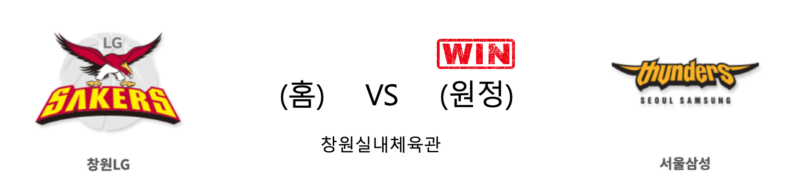

####  원주DB(홈) VS 서울SK(원정) 

<table class="tg">
  <tr>
    <th class="tg-rr9t">원주DB</th>
    <th class="tg-rr9t">팀</th>
    <th class="tg-rr9t">서울SK</th>
  </tr>
  <tr>
    <td class="tg-dcpn">3승 1패</td>
    <td class="tg-rr9t">시즌 상대전적</td>
    <td class="tg-dcpn">1승 3패</td>
  </tr>
  <tr>
    <td class="tg-dcpn">17</td>
    <td class="tg-rr9t">점수</td>
    <td class="tg-dcpn">12</td>
  </tr>
  <tr>
    <td class="tg-dcpn">6/10(60%)</td>
    <td class="tg-rr9t">2점(%)</td>
    <td class="tg-dcpn">4/9(44%)</td>
  </tr>
  <tr>
    <td class="tg-dcpn">1/3(33%)</td>
    <td class="tg-rr9t">3점(%)</td>
    <td class="tg-dcpn">1/4(25%)</td>
  </tr>
  <tr>
    <td class="tg-dcpn">2/2(100%)</td>
    <td class="tg-rr9t">자유투(%)</td>
    <td class="tg-dcpn">1/1(100%)</td>
  </tr>
  <tr>
    <td class="tg-dcpn">11</td>
    <td class="tg-rr9t">리바운드</td>
    <td class="tg-dcpn">2</td>
  </tr>
  <tr>
    <td class="tg-dcpn">1</td>
    <td class="tg-rr9t">어시스트</td>
    <td class="tg-dcpn">0</td>
  </tr>
  <tr>
    <td class="tg-dcpn">4</td>
    <td class="tg-rr9t">스틸</td>
    <td class="tg-dcpn">0</td>
  </tr>
  <tr>
    <td class="tg-dcpn">0</td>
    <td class="tg-rr9t">블록</td>
    <td class="tg-dcpn">2</td>
  </tr>
  <tr>
    <td class="tg-dcpn">4</td>
    <td class="tg-rr9t">턴오버</td>
    <td class="tg-dcpn">1</td>
  </tr>
  <tr>
    <td class="tg-dcpn"></td>
    <td class="tg-rr9t">주요 득점선수</td>
    <td class="tg-dcpn"></td>
  </tr>
</table>

#### 경기 관련 주요 기사         

['완연한 상승세' 원주 DB, 기반이 된 점프 디펜스 + 지역 방어](http://www.basketkorea.com/news/articleView.html?idxno=191580)

[[JB프리뷰] 두경민 효과 득점력 살아난 DB vs. 3점 폭발로 1위 탈환한 SK](http://sports.news.naver.com/basketball/news/read.nhn?oid=065&aid=0000195862)

[[프로농구전망대] 선두 SK vs 4연승 DB…올스타전 휴식 앞서 정면충돌](http://yna.kr/AKR20200113061400007?did=1195m)

[[루키 프리뷰] '화끈한 화력' DB와 SK의 맞대결.. 첫 출격하는 라킴 샌더스](http://www.rookie.co.kr/news/articleView.html?idxno=38018)

        
        

####  창원LG(홈) VS 서울삼성(원정) 

<table class="tg">
  <tr>
    <th class="tg-rr9t">창원LG</th>
    <th class="tg-rr9t">팀</th>
    <th class="tg-rr9t">서울삼성</th>
  </tr>
  <tr>
    <td class="tg-dcpn">1승 3패</td>
    <td class="tg-rr9t">시즌 상대전적</td>
    <td class="tg-dcpn">3승 1패</td>
  </tr>
  <tr>
    <td class="tg-dcpn">4</td>
    <td class="tg-rr9t">점수</td>
    <td class="tg-dcpn">11</td>
  </tr>
  <tr>
    <td class="tg-dcpn">2/7(29%)</td>
    <td class="tg-rr9t">2점(%)</td>
    <td class="tg-dcpn">3/4(75%)</td>
  </tr>
  <tr>
    <td class="tg-dcpn">0/2(0%)</td>
    <td class="tg-rr9t">3점(%)</td>
    <td class="tg-dcpn">1/2(50%)</td>
  </tr>
  <tr>
    <td class="tg-dcpn">0/2(0%)</td>
    <td class="tg-rr9t">자유투(%)</td>
    <td class="tg-dcpn">2/2(100%)</td>
  </tr>
  <tr>
    <td class="tg-dcpn">3</td>
    <td class="tg-rr9t">리바운드</td>
    <td class="tg-dcpn">6</td>
  </tr>
  <tr>
    <td class="tg-dcpn">0</td>
    <td class="tg-rr9t">어시스트</td>
    <td class="tg-dcpn">0</td>
  </tr>
  <tr>
    <td class="tg-dcpn">0</td>
    <td class="tg-rr9t">스틸</td>
    <td class="tg-dcpn">1</td>
  </tr>
  <tr>
    <td class="tg-dcpn">0</td>
    <td class="tg-rr9t">블록</td>
    <td class="tg-dcpn">0</td>
  </tr>
  <tr>
    <td class="tg-dcpn">2</td>
    <td class="tg-rr9t">턴오버</td>
    <td class="tg-dcpn">2</td>
  </tr>
  <tr>
    <td class="tg-dcpn"></td>
    <td class="tg-rr9t">주요 득점선수</td>
    <td class="tg-dcpn"></td>
  </tr>
</table>

#### 경기 관련 주요 기사         

[창원 LG, 새 외국선수 샌더스 영입 15일 출전](http://sports.khan.co.kr/news/sk_index.html?art_id=202001141721003&sec_id=530301&pt=nv)

[출격 완료 마친 LG 라킴 샌더스 “내가 어떤 선수인지 보여줄 것”](http://sports.news.naver.com/basketball/news/read.nhn?oid=065&aid=0000195855)

[샌더스 합류한 LG, 삼성 꺾고 6강행 희망 밝힐까](http://stoo.asiae.co.kr/article.php?aid=61347055737)

        
        

#### 리그 순위

<table class="tg">
  <tr>
    <th class="tg-d14o">순위</th>
    <th class="tg-d14o">팀명</th>
    <th class="tg-d14o">경기수</th>
    <th class="tg-d14o">승</th>
    <th class="tg-d14o">패</th>
    <th class="tg-d14o">승차</th>
    <th class="tg-d14o">승률</th>
  </tr>
  
<tr>
    <td class="tg-50j8">1</td>
    <td class="tg-50j8">서울SK</td>
    <td class="tg-50j8">33</td>
    <td class="tg-50j8">21</td>
    <td class="tg-50j8">12</td>
    <td class="tg-50j8">0</td>
    <td class="tg-50j8">0.636</td>
</tr>

<tr>
    <td class="tg-50j8">1</td>
    <td class="tg-50j8">안양KGC</td>
    <td class="tg-50j8">33</td>
    <td class="tg-50j8">21</td>
    <td class="tg-50j8">12</td>
    <td class="tg-50j8">0</td>
    <td class="tg-50j8">0.636</td>
</tr>

<tr>
    <td class="tg-50j8">3</td>
    <td class="tg-50j8">원주DB</td>
    <td class="tg-50j8">32</td>
    <td class="tg-50j8">19</td>
    <td class="tg-50j8">13</td>
    <td class="tg-50j8">2</td>
    <td class="tg-50j8">0.594</td>
</tr>

<tr>
    <td class="tg-50j8">4</td>
    <td class="tg-50j8">인천전자랜드</td>
    <td class="tg-50j8">33</td>
    <td class="tg-50j8">19</td>
    <td class="tg-50j8">14</td>
    <td class="tg-50j8">2</td>
    <td class="tg-50j8">0.576</td>
</tr>

<tr>
    <td class="tg-50j8">5</td>
    <td class="tg-50j8">전주KCC</td>
    <td class="tg-50j8">33</td>
    <td class="tg-50j8">18</td>
    <td class="tg-50j8">15</td>
    <td class="tg-50j8">3</td>
    <td class="tg-50j8">0.545</td>
</tr>

<tr>
    <td class="tg-50j8">6</td>
    <td class="tg-50j8">부산KT</td>
    <td class="tg-50j8">33</td>
    <td class="tg-50j8">15</td>
    <td class="tg-50j8">18</td>
    <td class="tg-50j8">6</td>
    <td class="tg-50j8">0.455</td>
</tr>

<tr>
    <td class="tg-50j8">6</td>
    <td class="tg-50j8">울산현대모비스</td>
    <td class="tg-50j8">33</td>
    <td class="tg-50j8">15</td>
    <td class="tg-50j8">18</td>
    <td class="tg-50j8">6</td>
    <td class="tg-50j8">0.455</td>
</tr>

<tr>
    <td class="tg-50j8">8</td>
    <td class="tg-50j8">서울삼성</td>
    <td class="tg-50j8">33</td>
    <td class="tg-50j8">14</td>
    <td class="tg-50j8">19</td>
    <td class="tg-50j8">7</td>
    <td class="tg-50j8">0.424</td>
</tr>

<tr>
    <td class="tg-50j8">9</td>
    <td class="tg-50j8">창원LG</td>
    <td class="tg-50j8">34</td>
    <td class="tg-50j8">12</td>
    <td class="tg-50j8">22</td>
    <td class="tg-50j8">9</td>
    <td class="tg-50j8">0.353</td>
</tr>

<tr>
    <td class="tg-50j8">10</td>
    <td class="tg-50j8">고양오리온</td>
    <td class="tg-50j8">33</td>
    <td class="tg-50j8">11</td>
    <td class="tg-50j8">22</td>
    <td class="tg-50j8">10</td>
    <td class="tg-50j8">0.333</td>
</tr>
</table> 

        
        
#kbl #국내농구 #농구분석 #토토 #스포츠토토 #경기예측 #농구결과 #20200115 #원주DB #서울SK #창원LG #서울삼성 #원주DB서울SK #창원LG서울삼성 