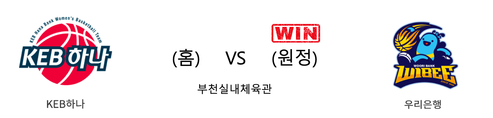

####  KEB하나(홈) VS 우리은행(원정) 

<table class="tg">
  <tr>
    <th class="tg-rr9t">KEB하나</th>
    <th class="tg-rr9t">팀</th>
    <th class="tg-rr9t">우리은행</th>
  </tr>
  <tr>
    <td class="tg-dcpn">0승 4패</td>
    <td class="tg-rr9t">시즌 상대전적</td>
    <td class="tg-dcpn">4승 0패</td>
  </tr>
  <tr>
    <td class="tg-dcpn">65</td>
    <td class="tg-rr9t">점수</td>
    <td class="tg-dcpn">83</td>
  </tr>
  <tr>
    <td class="tg-dcpn">20/45(44%)</td>
    <td class="tg-rr9t">2점(%)</td>
    <td class="tg-dcpn">22/44(50%)</td>
  </tr>
  <tr>
    <td class="tg-dcpn">5/23(22%)</td>
    <td class="tg-rr9t">3점(%)</td>
    <td class="tg-dcpn">9/23(39%)</td>
  </tr>
  <tr>
    <td class="tg-dcpn">10/13(77%)</td>
    <td class="tg-rr9t">자유투(%)</td>
    <td class="tg-dcpn">12/15(80%)</td>
  </tr>
  <tr>
    <td class="tg-dcpn">25</td>
    <td class="tg-rr9t">리바운드</td>
    <td class="tg-dcpn">47</td>
  </tr>
  <tr>
    <td class="tg-dcpn">15</td>
    <td class="tg-rr9t">어시스트</td>
    <td class="tg-dcpn">18</td>
  </tr>
  <tr>
    <td class="tg-dcpn">7</td>
    <td class="tg-rr9t">스틸</td>
    <td class="tg-dcpn">4</td>
  </tr>
  <tr>
    <td class="tg-dcpn">9</td>
    <td class="tg-rr9t">블록</td>
    <td class="tg-dcpn">18</td>
  </tr>
  <tr>
    <td class="tg-dcpn">21</td>
    <td class="tg-rr9t">턴오버</td>
    <td class="tg-dcpn">19</td>
  </tr>
  <tr>
    <td class="tg-dcpn">고아라(18) 마이샤(17)</td>
    <td class="tg-rr9t">주요 득점선수</td>
    <td class="tg-dcpn">박혜진(25) 그레이(15) 김정은(15)</td>
  </tr>
</table>

#### 경기 관련 주요 기사         

[우리은행, 하나은행전 25연승…3연패 탈출·공동 선두](http://www.newsis.com/view/?id=NISX20200116_0000891590&cID=10505&pID=10500)

[우리·하나은행 DLF 불완전판매한 1천여명에 배상 시작](http://www.hani.co.kr/arti/economy/finance/924558.html)

[펀드판매사 평가, 라임펀드 많이 판 우리은행·신한금투 최하위](https://biz.chosun.com/site/data/html_dir/2020/01/16/2020011602931.html?utm_source=naver&utm_medium=original&utm_campaign=biz)

['라임사태' 우리은행·신한금투 펀드판매 평가 '꼴찌'](https://www.sedaily.com/NewsView/1YXO4Q114F)

        
        

#### 리그 순위

<table class="tg">
  <tr>
    <th class="tg-d14o">순위</th>
    <th class="tg-d14o">팀명</th>
    <th class="tg-d14o">경기수</th>
    <th class="tg-d14o">승</th>
    <th class="tg-d14o">패</th>
    <th class="tg-d14o">승차</th>
    <th class="tg-d14o">승률</th>
  </tr>
  
<tr>
    <td class="tg-50j8">1</td>
    <td class="tg-50j8">우리은행</td>
    <td class="tg-50j8">18</td>
    <td class="tg-50j8">13</td>
    <td class="tg-50j8">5</td>
    <td class="tg-50j8">0</td>
    <td class="tg-50j8">0.722</td>
</tr>

<tr>
    <td class="tg-50j8">2</td>
    <td class="tg-50j8">KB스타즈</td>
    <td class="tg-50j8">17</td>
    <td class="tg-50j8">12</td>
    <td class="tg-50j8">5</td>
    <td class="tg-50j8">1</td>
    <td class="tg-50j8">0.706</td>
</tr>

<tr>
    <td class="tg-50j8">3</td>
    <td class="tg-50j8">KEB하나</td>
    <td class="tg-50j8">18</td>
    <td class="tg-50j8">8</td>
    <td class="tg-50j8">10</td>
    <td class="tg-50j8">5</td>
    <td class="tg-50j8">0.444</td>
</tr>

<tr>
    <td class="tg-50j8">4</td>
    <td class="tg-50j8">삼성생명</td>
    <td class="tg-50j8">17</td>
    <td class="tg-50j8">7</td>
    <td class="tg-50j8">10</td>
    <td class="tg-50j8">6</td>
    <td class="tg-50j8">0.412</td>
</tr>

<tr>
    <td class="tg-50j8">5</td>
    <td class="tg-50j8">신한은행</td>
    <td class="tg-50j8">18</td>
    <td class="tg-50j8">7</td>
    <td class="tg-50j8">11</td>
    <td class="tg-50j8">6</td>
    <td class="tg-50j8">0.389</td>
</tr>

<tr>
    <td class="tg-50j8">6</td>
    <td class="tg-50j8">BNK썸</td>
    <td class="tg-50j8">18</td>
    <td class="tg-50j8">6</td>
    <td class="tg-50j8">12</td>
    <td class="tg-50j8">7</td>
    <td class="tg-50j8">0.333</td>
</tr>
</table> 

        
        
#wkbl #국내농구 #여자농구 #농구분석 #토토 #스포츠토토 #경기예측 #농구결과 #20200116 #KEB하나 #우리은행 #KEB하나우리은행 