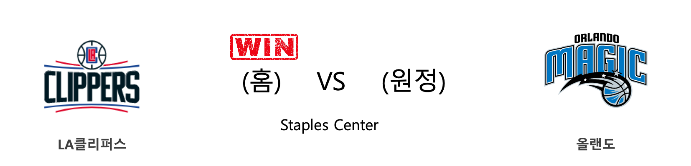
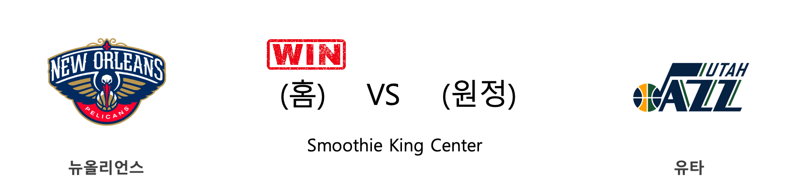
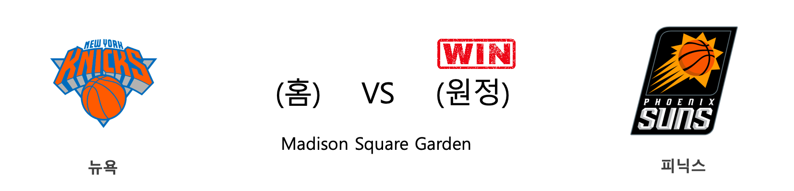

####  밀워키(홈) VS 보스턴(원정) 

<table class="tg">
  <tr>
    <th class="tg-rr9t">MIL</th>
    <th class="tg-rr9t">팀</th>
    <th class="tg-rr9t">BOS</th>
  </tr>
  <tr>
    <td class="tg-dcpn">1승 1패</td>
    <td class="tg-rr9t">시즌 상대전적</td>
    <td class="tg-dcpn">1승 1패</td>
  </tr>
  <tr>
    <td class="tg-dcpn">128</td>
    <td class="tg-rr9t">점수</td>
    <td class="tg-dcpn">123</td>
  </tr>
  <tr>
    <td class="tg-dcpn">27/56(48%)</td>
    <td class="tg-rr9t">2점(%)</td>
    <td class="tg-dcpn">28/49(57%)</td>
  </tr>
  <tr>
    <td class="tg-dcpn">16/31(52%)</td>
    <td class="tg-rr9t">3점(%)</td>
    <td class="tg-dcpn">15/49(31%)</td>
  </tr>
  <tr>
    <td class="tg-dcpn">26/37(70%)</td>
    <td class="tg-rr9t">자유투(%)</td>
    <td class="tg-dcpn">22/27(81%)</td>
  </tr>
  <tr>
    <td class="tg-dcpn">50</td>
    <td class="tg-rr9t">리바운드</td>
    <td class="tg-dcpn">43</td>
  </tr>
  <tr>
    <td class="tg-dcpn">21</td>
    <td class="tg-rr9t">어시스트</td>
    <td class="tg-dcpn">16</td>
  </tr>
  <tr>
    <td class="tg-dcpn">6</td>
    <td class="tg-rr9t">스틸</td>
    <td class="tg-dcpn">4</td>
  </tr>
  <tr>
    <td class="tg-dcpn">6</td>
    <td class="tg-rr9t">블록</td>
    <td class="tg-dcpn">7</td>
  </tr>
  <tr>
    <td class="tg-dcpn">10</td>
    <td class="tg-rr9t">턴오버</td>
    <td class="tg-dcpn">7</td>
  </tr>
  <tr>
    <td class="tg-dcpn">BrookLopezC(16) GiannisAnteto(32) KhrisMiddleto(23) DonteDiVincen(19)</td>
    <td class="tg-rr9t">주요 득점선수</td>
    <td class="tg-dcpn">JaysonTatumF(17) KembaWalkerG(40) MarcusSmartG(24)</td>
  </tr>
</table>

#### 경기 관련 주요 기사         

[[오늘의 NBA] (12/26) NBA 2019년 크리스마스 축제](http://sports.news.naver.com/basketball/news/read.nhn?oid=486&aid=0000001177)

[[오늘의 NBA] (1/17) 브랜든 잉그램 vs 도노반 미첼, 1월의 명승부](http://sports.news.naver.com/basketball/news/read.nhn?oid=486&aid=0000001199)

[[오늘의 NBA] (1/7) ORL 마켈 펄츠의 커리어 나이트](http://sports.news.naver.com/basketball/news/read.nhn?oid=486&aid=0000001189)

[[오늘의 NBA] (12/29) 마이애미, 연장전 승부 전문가](http://sports.news.naver.com/basketball/news/read.nhn?oid=486&aid=0000001180)

[[오늘의 NBA] (1/10) PHI vs BOS, 먹이사슬의 역전!](http://sports.news.naver.com/basketball/news/read.nhn?oid=486&aid=0000001192)

        
        

####  LA클리퍼스(홈) VS 올랜도(원정) 

<table class="tg">
  <tr>
    <th class="tg-rr9t">LAC</th>
    <th class="tg-rr9t">팀</th>
    <th class="tg-rr9t">ORL</th>
  </tr>
  <tr>
    <td class="tg-dcpn">1승 0패</td>
    <td class="tg-rr9t">시즌 상대전적</td>
    <td class="tg-dcpn">0승 1패</td>
  </tr>
  <tr>
    <td class="tg-dcpn">122</td>
    <td class="tg-rr9t">점수</td>
    <td class="tg-dcpn">95</td>
  </tr>
  <tr>
    <td class="tg-dcpn">33/63(52%)</td>
    <td class="tg-rr9t">2점(%)</td>
    <td class="tg-dcpn">22/50(44%)</td>
  </tr>
  <tr>
    <td class="tg-dcpn">14/32(44%)</td>
    <td class="tg-rr9t">3점(%)</td>
    <td class="tg-dcpn">14/42(33%)</td>
  </tr>
  <tr>
    <td class="tg-dcpn">14/20(70%)</td>
    <td class="tg-rr9t">자유투(%)</td>
    <td class="tg-dcpn">9/16(56%)</td>
  </tr>
  <tr>
    <td class="tg-dcpn">59</td>
    <td class="tg-rr9t">리바운드</td>
    <td class="tg-dcpn">42</td>
  </tr>
  <tr>
    <td class="tg-dcpn">29</td>
    <td class="tg-rr9t">어시스트</td>
    <td class="tg-dcpn">24</td>
  </tr>
  <tr>
    <td class="tg-dcpn">4</td>
    <td class="tg-rr9t">스틸</td>
    <td class="tg-dcpn">4</td>
  </tr>
  <tr>
    <td class="tg-dcpn">4</td>
    <td class="tg-rr9t">블록</td>
    <td class="tg-dcpn">4</td>
  </tr>
  <tr>
    <td class="tg-dcpn">9</td>
    <td class="tg-rr9t">턴오버</td>
    <td class="tg-dcpn">9</td>
  </tr>
  <tr>
    <td class="tg-dcpn">MontrezlHarre(21) KawhiLeonardF(32)</td>
    <td class="tg-rr9t">주요 득점선수</td>
    <td class="tg-dcpn">EvanFournierG(15) NikolaVucevic(22) AaronGordonF(20) TerrenceRoss(16)</td>
  </tr>
</table>

#### 경기 관련 주요 기사         

[[오늘의 NBA] (12/29) 마이애미, 연장전 승부 전문가](http://sports.news.naver.com/basketball/news/read.nhn?oid=486&aid=0000001180)

[[오늘의 NBA] (1/14) 샤이 길저스-알랙선더, 선배 러셀 웨스트브룩을 오마쥬하다](http://sports.news.naver.com/basketball/news/read.nhn?oid=486&aid=0000001196)

[[오늘의 NBA] (1/5) 제이슨 테이텀, 보스턴의 밀당남](http://sports.news.naver.com/basketball/news/read.nhn?oid=486&aid=0000001187)

[[오늘의 NBA] (1/11) 멤피스, 서부컨퍼런스 8위 등극](http://sports.news.naver.com/basketball/news/read.nhn?oid=486&aid=0000001193)

[[오늘의 NBA] (1/16) 올랜도, 난적 LA 레이커스를 제압하다](http://sports.news.naver.com/basketball/news/read.nhn?oid=486&aid=0000001198)

        
        

####  뉴올리언스(홈) VS 유타(원정) 

<table class="tg">
  <tr>
    <th class="tg-rr9t">NOP</th>
    <th class="tg-rr9t">팀</th>
    <th class="tg-rr9t">UTA</th>
  </tr>
  <tr>
    <td class="tg-dcpn">1승 2패</td>
    <td class="tg-rr9t">시즌 상대전적</td>
    <td class="tg-dcpn">2승 1패</td>
  </tr>
  <tr>
    <td class="tg-dcpn">138</td>
    <td class="tg-rr9t">점수</td>
    <td class="tg-dcpn">132</td>
  </tr>
  <tr>
    <td class="tg-dcpn">40/67(60%)</td>
    <td class="tg-rr9t">2점(%)</td>
    <td class="tg-dcpn">31/61(51%)</td>
  </tr>
  <tr>
    <td class="tg-dcpn">11/26(42%)</td>
    <td class="tg-rr9t">3점(%)</td>
    <td class="tg-dcpn">15/39(38%)</td>
  </tr>
  <tr>
    <td class="tg-dcpn">25/35(71%)</td>
    <td class="tg-rr9t">자유투(%)</td>
    <td class="tg-dcpn">25/32(78%)</td>
  </tr>
  <tr>
    <td class="tg-dcpn">45</td>
    <td class="tg-rr9t">리바운드</td>
    <td class="tg-dcpn">43</td>
  </tr>
  <tr>
    <td class="tg-dcpn">29</td>
    <td class="tg-rr9t">어시스트</td>
    <td class="tg-dcpn">23</td>
  </tr>
  <tr>
    <td class="tg-dcpn">8</td>
    <td class="tg-rr9t">스틸</td>
    <td class="tg-dcpn">9</td>
  </tr>
  <tr>
    <td class="tg-dcpn">9</td>
    <td class="tg-rr9t">블록</td>
    <td class="tg-dcpn">6</td>
  </tr>
  <tr>
    <td class="tg-dcpn">13</td>
    <td class="tg-rr9t">턴오버</td>
    <td class="tg-dcpn">13</td>
  </tr>
  <tr>
    <td class="tg-dcpn">DerrickFavors(21) E'TwaunMoore(16) BrandonIngram(49)</td>
    <td class="tg-rr9t">주요 득점선수</td>
    <td class="tg-dcpn">RudyGobertC(17) BojanBogdanov(26) JordanClarkso(15) DonovanMitche(46)</td>
  </tr>
</table>

#### 경기 관련 주요 기사         

[[오늘의 NBA] (12/14) 레이커스, 마이애미 홈 코트를 점령하다](http://sports.news.naver.com/basketball/news/read.nhn?oid=486&aid=0000001166)

[[오늘의 NBA] (12/29) 마이애미, 연장전 승부 전문가](http://sports.news.naver.com/basketball/news/read.nhn?oid=486&aid=0000001180)

[[오늘의 NBA] (1/11) 멤피스, 서부컨퍼런스 8위 등극](http://sports.news.naver.com/basketball/news/read.nhn?oid=486&aid=0000001193)

[[오늘의 NBA] (1/17) 브랜든 잉그램 vs 도노반 미첼, 1월의 명승부](http://sports.news.naver.com/basketball/news/read.nhn?oid=486&aid=0000001199)

[[오늘의 NBA] (12/16) 스펜서 딘위디, 브루클린 상승세를 이끈다!](http://sports.news.naver.com/basketball/news/read.nhn?oid=486&aid=0000001168)

        
        

####  골든스테이트(홈) VS 덴버(원정) 

<table class="tg">
  <tr>
    <th class="tg-rr9t">GSW</th>
    <th class="tg-rr9t">팀</th>
    <th class="tg-rr9t">DEN</th>
  </tr>
  <tr>
    <td class="tg-dcpn">0승 1패</td>
    <td class="tg-rr9t">시즌 상대전적</td>
    <td class="tg-dcpn">1승 0패</td>
  </tr>
  <tr>
    <td class="tg-dcpn">131</td>
    <td class="tg-rr9t">점수</td>
    <td class="tg-dcpn">134</td>
  </tr>
  <tr>
    <td class="tg-dcpn">22/50(44%)</td>
    <td class="tg-rr9t">2점(%)</td>
    <td class="tg-dcpn">30/65(46%)</td>
  </tr>
  <tr>
    <td class="tg-dcpn">20/45(44%)</td>
    <td class="tg-rr9t">3점(%)</td>
    <td class="tg-dcpn">17/35(49%)</td>
  </tr>
  <tr>
    <td class="tg-dcpn">27/31(87%)</td>
    <td class="tg-rr9t">자유투(%)</td>
    <td class="tg-dcpn">23/26(88%)</td>
  </tr>
  <tr>
    <td class="tg-dcpn">43</td>
    <td class="tg-rr9t">리바운드</td>
    <td class="tg-dcpn">55</td>
  </tr>
  <tr>
    <td class="tg-dcpn">36</td>
    <td class="tg-rr9t">어시스트</td>
    <td class="tg-dcpn">31</td>
  </tr>
  <tr>
    <td class="tg-dcpn">11</td>
    <td class="tg-rr9t">스틸</td>
    <td class="tg-dcpn">11</td>
  </tr>
  <tr>
    <td class="tg-dcpn">6</td>
    <td class="tg-rr9t">블록</td>
    <td class="tg-dcpn">6</td>
  </tr>
  <tr>
    <td class="tg-dcpn">18</td>
    <td class="tg-rr9t">턴오버</td>
    <td class="tg-dcpn">19</td>
  </tr>
  <tr>
    <td class="tg-dcpn">AlecBurks(25) GlennRobinson(17) DamionLeeG(21) D'AngeloRusse(19) EricPaschall(16)</td>
    <td class="tg-rr9t">주요 득점선수</td>
    <td class="tg-dcpn">WillBartonG(31) MichaelPorter(18) NikolaJokicC(23) MasonPlumlee(15) MalikBeasley(27)</td>
  </tr>
</table>

#### 경기 관련 주요 기사         

[[오늘의 NBA] (12/21) 크리스탑스 포르징기스, 댈러스의 새로운 버팀목](http://sports.news.naver.com/basketball/news/read.nhn?oid=486&aid=0000001173)

[[오늘의 NBA] (1/5) 제이슨 테이텀, 보스턴의 밀당남](http://sports.news.naver.com/basketball/news/read.nhn?oid=486&aid=0000001187)

[[오늘의 NBA] (1/3) 마이클 포터 주니어, 덴버의 기다림에 응답하다!](http://sports.news.naver.com/basketball/news/read.nhn?oid=486&aid=0000001185)

[[오늘의 NBA] (12/29) 마이애미, 연장전 승부 전문가](http://sports.news.naver.com/basketball/news/read.nhn?oid=486&aid=0000001180)

[[오늘의 NBA] (1/1) 휴스턴의 불장난](http://sports.news.naver.com/basketball/news/read.nhn?oid=486&aid=0000001183)

        
        

####  뉴욕(홈) VS 피닉스(원정) 

<table class="tg">
  <tr>
    <th class="tg-rr9t">NYK</th>
    <th class="tg-rr9t">팀</th>
    <th class="tg-rr9t">PHX</th>
  </tr>
  <tr>
    <td class="tg-dcpn">0승 2패</td>
    <td class="tg-rr9t">시즌 상대전적</td>
    <td class="tg-dcpn">2승 0패</td>
  </tr>
  <tr>
    <td class="tg-dcpn">98</td>
    <td class="tg-rr9t">점수</td>
    <td class="tg-dcpn">121</td>
  </tr>
  <tr>
    <td class="tg-dcpn">29/64(45%)</td>
    <td class="tg-rr9t">2점(%)</td>
    <td class="tg-dcpn">35/62(56%)</td>
  </tr>
  <tr>
    <td class="tg-dcpn">8/26(31%)</td>
    <td class="tg-rr9t">3점(%)</td>
    <td class="tg-dcpn">12/30(40%)</td>
  </tr>
  <tr>
    <td class="tg-dcpn">16/24(67%)</td>
    <td class="tg-rr9t">자유투(%)</td>
    <td class="tg-dcpn">15/18(83%)</td>
  </tr>
  <tr>
    <td class="tg-dcpn">40</td>
    <td class="tg-rr9t">리바운드</td>
    <td class="tg-dcpn">53</td>
  </tr>
  <tr>
    <td class="tg-dcpn">21</td>
    <td class="tg-rr9t">어시스트</td>
    <td class="tg-dcpn">31</td>
  </tr>
  <tr>
    <td class="tg-dcpn">11</td>
    <td class="tg-rr9t">스틸</td>
    <td class="tg-dcpn">11</td>
  </tr>
  <tr>
    <td class="tg-dcpn">3</td>
    <td class="tg-rr9t">블록</td>
    <td class="tg-dcpn">4</td>
  </tr>
  <tr>
    <td class="tg-dcpn">18</td>
    <td class="tg-rr9t">턴오버</td>
    <td class="tg-dcpn">18</td>
  </tr>
  <tr>
    <td class="tg-dcpn">MarcusMorrisS(17) JuliusRandleF(26)</td>
    <td class="tg-rr9t">주요 득점선수</td>
    <td class="tg-dcpn">RickyRubioG(25) DevinBookerG(29) DeandreAytonC(26)</td>
  </tr>
</table>

#### 경기 관련 주요 기사         

[[오늘의 NBA] (1/13) 더마 드로잔, 1년간 기다렸던 복수극](http://sports.news.naver.com/basketball/news/read.nhn?oid=486&aid=0000001195)

[[오늘의 NBA] (1/11) 멤피스, 서부컨퍼런스 8위 등극](http://sports.news.naver.com/basketball/news/read.nhn?oid=486&aid=0000001193)

[[오늘의 NBA] (12/29) 마이애미, 연장전 승부 전문가](http://sports.news.naver.com/basketball/news/read.nhn?oid=486&aid=0000001180)

[[오늘의 NBA] (1/9) 그렉 포포비치 감독의 보스턴 수비 인수분해](http://sports.news.naver.com/basketball/news/read.nhn?oid=486&aid=0000001191)

[[오늘의 NBA] (1/8) POR 데미안 릴라드&카멜로 앤써니, 대역전극을 연출하다](http://sports.news.naver.com/basketball/news/read.nhn?oid=486&aid=0000001190)

        
        

#### 리그 (Eastern) 순위
    

<table class="tg">
  <tr>
    <th class="tg-d14o">순위</th>
    <th class="tg-d14o">팀명</th>
    <th class="tg-d14o">경기수</th>
    <th class="tg-d14o">승</th>
    <th class="tg-d14o">패</th>
    <th class="tg-d14o">승차</th>
    <th class="tg-d14o">승률</th>
  </tr>
  
<tr>
    <td class="tg-50j8">1</td>
    <td class="tg-50j8">MIL</td>
    <td class="tg-50j8">41</td>
    <td class="tg-50j8">35</td>
    <td class="tg-50j8">6</td>
    <td class="tg-50j8">0</td>
    <td class="tg-50j8">0.854</td>
</tr>

<tr>
    <td class="tg-50j8">2</td>
    <td class="tg-50j8">MIA</td>
    <td class="tg-50j8">39</td>
    <td class="tg-50j8">28</td>
    <td class="tg-50j8">11</td>
    <td class="tg-50j8">7</td>
    <td class="tg-50j8">0.718</td>
</tr>

<tr>
    <td class="tg-50j8">3</td>
    <td class="tg-50j8">BOS</td>
    <td class="tg-50j8">38</td>
    <td class="tg-50j8">26</td>
    <td class="tg-50j8">12</td>
    <td class="tg-50j8">9</td>
    <td class="tg-50j8">0.684</td>
</tr>

<tr>
    <td class="tg-50j8">4</td>
    <td class="tg-50j8">TOR</td>
    <td class="tg-50j8">40</td>
    <td class="tg-50j8">26</td>
    <td class="tg-50j8">14</td>
    <td class="tg-50j8">9</td>
    <td class="tg-50j8">0.65</td>
</tr>

<tr>
    <td class="tg-50j8">5</td>
    <td class="tg-50j8">IND</td>
    <td class="tg-50j8">41</td>
    <td class="tg-50j8">26</td>
    <td class="tg-50j8">15</td>
    <td class="tg-50j8">9</td>
    <td class="tg-50j8">0.634</td>
</tr>

<tr>
    <td class="tg-50j8">6</td>
    <td class="tg-50j8">PHI</td>
    <td class="tg-50j8">40</td>
    <td class="tg-50j8">25</td>
    <td class="tg-50j8">15</td>
    <td class="tg-50j8">10</td>
    <td class="tg-50j8">0.625</td>
</tr>

<tr>
    <td class="tg-50j8">7</td>
    <td class="tg-50j8">ORL</td>
    <td class="tg-50j8">41</td>
    <td class="tg-50j8">20</td>
    <td class="tg-50j8">21</td>
    <td class="tg-50j8">15</td>
    <td class="tg-50j8">0.488</td>
</tr>

<tr>
    <td class="tg-50j8">8</td>
    <td class="tg-50j8">BKN</td>
    <td class="tg-50j8">39</td>
    <td class="tg-50j8">18</td>
    <td class="tg-50j8">21</td>
    <td class="tg-50j8">17</td>
    <td class="tg-50j8">0.462</td>
</tr>

<tr>
    <td class="tg-50j8">9</td>
    <td class="tg-50j8">DET</td>
    <td class="tg-50j8">39</td>
    <td class="tg-50j8">15</td>
    <td class="tg-50j8">24</td>
    <td class="tg-50j8">20</td>
    <td class="tg-50j8">0.385</td>
</tr>

<tr>
    <td class="tg-50j8">10</td>
    <td class="tg-50j8">CHA</td>
    <td class="tg-50j8">44</td>
    <td class="tg-50j8">15</td>
    <td class="tg-50j8">29</td>
    <td class="tg-50j8">20</td>
    <td class="tg-50j8">0.341</td>
</tr>

<tr>
    <td class="tg-50j8">11</td>
    <td class="tg-50j8">CHI</td>
    <td class="tg-50j8">40</td>
    <td class="tg-50j8">14</td>
    <td class="tg-50j8">26</td>
    <td class="tg-50j8">21</td>
    <td class="tg-50j8">0.35</td>
</tr>

<tr>
    <td class="tg-50j8">12</td>
    <td class="tg-50j8">WAS</td>
    <td class="tg-50j8">39</td>
    <td class="tg-50j8">12</td>
    <td class="tg-50j8">27</td>
    <td class="tg-50j8">23</td>
    <td class="tg-50j8">0.308</td>
</tr>

<tr>
    <td class="tg-50j8">13</td>
    <td class="tg-50j8">NYK</td>
    <td class="tg-50j8">42</td>
    <td class="tg-50j8">11</td>
    <td class="tg-50j8">31</td>
    <td class="tg-50j8">24</td>
    <td class="tg-50j8">0.262</td>
</tr>

<tr>
    <td class="tg-50j8">14</td>
    <td class="tg-50j8">CLE</td>
    <td class="tg-50j8">39</td>
    <td class="tg-50j8">10</td>
    <td class="tg-50j8">29</td>
    <td class="tg-50j8">25</td>
    <td class="tg-50j8">0.256</td>
</tr>

<tr>
    <td class="tg-50j8">15</td>
    <td class="tg-50j8">ATL</td>
    <td class="tg-50j8">40</td>
    <td class="tg-50j8">8</td>
    <td class="tg-50j8">32</td>
    <td class="tg-50j8">27</td>
    <td class="tg-50j8">0.2</td>
</tr>
</table> 
#### 리그 (Western) 순위
    

<table class="tg">
  <tr>
    <th class="tg-d14o">순위</th>
    <th class="tg-d14o">팀명</th>
    <th class="tg-d14o">경기수</th>
    <th class="tg-d14o">승</th>
    <th class="tg-d14o">패</th>
    <th class="tg-d14o">승차</th>
    <th class="tg-d14o">승률</th>
  </tr>
  
<tr>
    <td class="tg-50j8">1</td>
    <td class="tg-50j8">LAL</td>
    <td class="tg-50j8">40</td>
    <td class="tg-50j8">32</td>
    <td class="tg-50j8">8</td>
    <td class="tg-50j8">3</td>
    <td class="tg-50j8">0.8</td>
</tr>

<tr>
    <td class="tg-50j8">2</td>
    <td class="tg-50j8">LAC</td>
    <td class="tg-50j8">42</td>
    <td class="tg-50j8">29</td>
    <td class="tg-50j8">13</td>
    <td class="tg-50j8">6</td>
    <td class="tg-50j8">0.69</td>
</tr>

<tr>
    <td class="tg-50j8">3</td>
    <td class="tg-50j8">DEN</td>
    <td class="tg-50j8">39</td>
    <td class="tg-50j8">28</td>
    <td class="tg-50j8">11</td>
    <td class="tg-50j8">7</td>
    <td class="tg-50j8">0.718</td>
</tr>

<tr>
    <td class="tg-50j8">4</td>
    <td class="tg-50j8">UTA</td>
    <td class="tg-50j8">40</td>
    <td class="tg-50j8">27</td>
    <td class="tg-50j8">13</td>
    <td class="tg-50j8">8</td>
    <td class="tg-50j8">0.675</td>
</tr>

<tr>
    <td class="tg-50j8">5</td>
    <td class="tg-50j8">HOU</td>
    <td class="tg-50j8">39</td>
    <td class="tg-50j8">25</td>
    <td class="tg-50j8">14</td>
    <td class="tg-50j8">10</td>
    <td class="tg-50j8">0.641</td>
</tr>

<tr>
    <td class="tg-50j8">6</td>
    <td class="tg-50j8">DAL</td>
    <td class="tg-50j8">39</td>
    <td class="tg-50j8">24</td>
    <td class="tg-50j8">15</td>
    <td class="tg-50j8">11</td>
    <td class="tg-50j8">0.615</td>
</tr>

<tr>
    <td class="tg-50j8">7</td>
    <td class="tg-50j8">OKC</td>
    <td class="tg-50j8">40</td>
    <td class="tg-50j8">23</td>
    <td class="tg-50j8">17</td>
    <td class="tg-50j8">12</td>
    <td class="tg-50j8">0.575</td>
</tr>

<tr>
    <td class="tg-50j8">8</td>
    <td class="tg-50j8">MEM</td>
    <td class="tg-50j8">41</td>
    <td class="tg-50j8">19</td>
    <td class="tg-50j8">22</td>
    <td class="tg-50j8">16</td>
    <td class="tg-50j8">0.463</td>
</tr>

<tr>
    <td class="tg-50j8">9</td>
    <td class="tg-50j8">POR</td>
    <td class="tg-50j8">39</td>
    <td class="tg-50j8">18</td>
    <td class="tg-50j8">21</td>
    <td class="tg-50j8">17</td>
    <td class="tg-50j8">0.462</td>
</tr>

<tr>
    <td class="tg-50j8">10</td>
    <td class="tg-50j8">SAS</td>
    <td class="tg-50j8">38</td>
    <td class="tg-50j8">17</td>
    <td class="tg-50j8">21</td>
    <td class="tg-50j8">18</td>
    <td class="tg-50j8">0.447</td>
</tr>

<tr>
    <td class="tg-50j8">11</td>
    <td class="tg-50j8">PHX</td>
    <td class="tg-50j8">40</td>
    <td class="tg-50j8">16</td>
    <td class="tg-50j8">24</td>
    <td class="tg-50j8">19</td>
    <td class="tg-50j8">0.4</td>
</tr>

<tr>
    <td class="tg-50j8">12</td>
    <td class="tg-50j8">NOP</td>
    <td class="tg-50j8">41</td>
    <td class="tg-50j8">16</td>
    <td class="tg-50j8">25</td>
    <td class="tg-50j8">19</td>
    <td class="tg-50j8">0.39</td>
</tr>

<tr>
    <td class="tg-50j8">13</td>
    <td class="tg-50j8">SAC</td>
    <td class="tg-50j8">41</td>
    <td class="tg-50j8">15</td>
    <td class="tg-50j8">26</td>
    <td class="tg-50j8">20</td>
    <td class="tg-50j8">0.366</td>
</tr>

<tr>
    <td class="tg-50j8">14</td>
    <td class="tg-50j8">MIN</td>
    <td class="tg-50j8">38</td>
    <td class="tg-50j8">14</td>
    <td class="tg-50j8">24</td>
    <td class="tg-50j8">21</td>
    <td class="tg-50j8">0.368</td>
</tr>

<tr>
    <td class="tg-50j8">15</td>
    <td class="tg-50j8">GSW</td>
    <td class="tg-50j8">43</td>
    <td class="tg-50j8">9</td>
    <td class="tg-50j8">34</td>
    <td class="tg-50j8">26</td>
    <td class="tg-50j8">0.209</td>
</tr>
</table> 

        
        
#nba #미국농구 #엔비에이 #농구분석 #토토 #스포츠토토 #경기예측 #농구결과 #20200117 #밀워키 #보스턴 #LA클리퍼스 #올랜도 #뉴올리언스 #유타 #골든스테이트 #덴버 #뉴욕 #피닉스 #밀워키보스턴 #LA클리퍼스올랜도 #뉴올리언스유타 #골든스테이트덴버 #뉴욕피닉스 