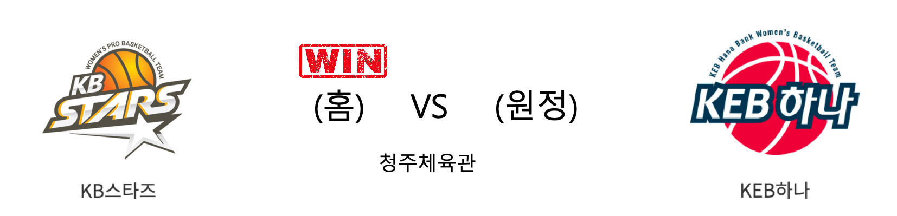

####  KB스타즈(홈) VS KEB하나(원정) 

<table class="tg">
  <tr>
    <th class="tg-rr9t">KB스타즈</th>
    <th class="tg-rr9t">팀</th>
    <th class="tg-rr9t">KEB하나</th>
  </tr>
  <tr>
    <td class="tg-dcpn">4승 0패</td>
    <td class="tg-rr9t">시즌 상대전적</td>
    <td class="tg-dcpn">0승 4패</td>
  </tr>
  <tr>
    <td class="tg-dcpn">90</td>
    <td class="tg-rr9t">점수</td>
    <td class="tg-dcpn">75</td>
  </tr>
  <tr>
    <td class="tg-dcpn">17/33(52%)</td>
    <td class="tg-rr9t">2점(%)</td>
    <td class="tg-dcpn">28/45(62%)</td>
  </tr>
  <tr>
    <td class="tg-dcpn">15/26(58%)</td>
    <td class="tg-rr9t">3점(%)</td>
    <td class="tg-dcpn">5/16(31%)</td>
  </tr>
  <tr>
    <td class="tg-dcpn">11/12(92%)</td>
    <td class="tg-rr9t">자유투(%)</td>
    <td class="tg-dcpn">4/4(100%)</td>
  </tr>
  <tr>
    <td class="tg-dcpn">25</td>
    <td class="tg-rr9t">리바운드</td>
    <td class="tg-dcpn">22</td>
  </tr>
  <tr>
    <td class="tg-dcpn">23</td>
    <td class="tg-rr9t">어시스트</td>
    <td class="tg-dcpn">16</td>
  </tr>
  <tr>
    <td class="tg-dcpn">5</td>
    <td class="tg-rr9t">스틸</td>
    <td class="tg-dcpn">6</td>
  </tr>
  <tr>
    <td class="tg-dcpn">13</td>
    <td class="tg-rr9t">블록</td>
    <td class="tg-dcpn">12</td>
  </tr>
  <tr>
    <td class="tg-dcpn">13</td>
    <td class="tg-rr9t">턴오버</td>
    <td class="tg-dcpn">20</td>
  </tr>
  <tr>
    <td class="tg-dcpn">박지수(17) 쏜튼(27) 심성영(15)</td>
    <td class="tg-rr9t">주요 득점선수</td>
    <td class="tg-dcpn">마이샤(30)</td>
  </tr>
</table>

#### 경기 관련 주요 기사         

[[BK Review] '3P 15개' 외곽 터진 KB스타즈, 홈에서 KEB하나은행 잡고 4연승 질주](http://www.basketkorea.com/news/articleView.html?idxno=191654)

[‘쏜튼+박지수 41점 합작' KB스타즈 4연승…단독선두 복귀 ](http://www.osen.co.kr/article/G1111295363)

[[포토] KB스타즈 응원을 함께해요](http://www.rookie.co.kr/news/articleView.html?idxno=38207)

        
        

#### 리그 순위

<table class="tg">
  <tr>
    <th class="tg-d14o">순위</th>
    <th class="tg-d14o">팀명</th>
    <th class="tg-d14o">경기수</th>
    <th class="tg-d14o">승</th>
    <th class="tg-d14o">패</th>
    <th class="tg-d14o">승차</th>
    <th class="tg-d14o">승률</th>
  </tr>
  
<tr>
    <td class="tg-50j8">1</td>
    <td class="tg-50j8">KB스타즈</td>
    <td class="tg-50j8">18</td>
    <td class="tg-50j8">13</td>
    <td class="tg-50j8">5</td>
    <td class="tg-50j8">0</td>
    <td class="tg-50j8">0.722</td>
</tr>

<tr>
    <td class="tg-50j8">1</td>
    <td class="tg-50j8">우리은행</td>
    <td class="tg-50j8">18</td>
    <td class="tg-50j8">13</td>
    <td class="tg-50j8">5</td>
    <td class="tg-50j8">0</td>
    <td class="tg-50j8">0.722</td>
</tr>

<tr>
    <td class="tg-50j8">3</td>
    <td class="tg-50j8">신한은행</td>
    <td class="tg-50j8">19</td>
    <td class="tg-50j8">8</td>
    <td class="tg-50j8">11</td>
    <td class="tg-50j8">5</td>
    <td class="tg-50j8">0.421</td>
</tr>

<tr>
    <td class="tg-50j8">3</td>
    <td class="tg-50j8">KEB하나</td>
    <td class="tg-50j8">19</td>
    <td class="tg-50j8">8</td>
    <td class="tg-50j8">11</td>
    <td class="tg-50j8">5</td>
    <td class="tg-50j8">0.421</td>
</tr>

<tr>
    <td class="tg-50j8">5</td>
    <td class="tg-50j8">삼성생명</td>
    <td class="tg-50j8">17</td>
    <td class="tg-50j8">7</td>
    <td class="tg-50j8">10</td>
    <td class="tg-50j8">6</td>
    <td class="tg-50j8">0.412</td>
</tr>

<tr>
    <td class="tg-50j8">6</td>
    <td class="tg-50j8">BNK썸</td>
    <td class="tg-50j8">19</td>
    <td class="tg-50j8">6</td>
    <td class="tg-50j8">13</td>
    <td class="tg-50j8">7</td>
    <td class="tg-50j8">0.316</td>
</tr>
</table> 

        
        
#wkbl #국내농구 #여자농구 #농구분석 #토토 #스포츠토토 #경기예측 #농구결과 #20200118 #KB스타즈 #KEB하나 #KB스타즈KEB하나 