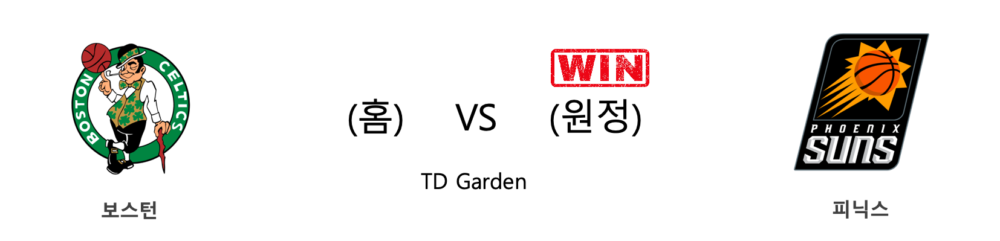

####  시카고(홈) VS 클리블랜드(원정) 

<table class="tg">
  <tr>
    <th class="tg-rr9t">CHI</th>
    <th class="tg-rr9t">팀</th>
    <th class="tg-rr9t">CLE</th>
  </tr>
  <tr>
    <td class="tg-dcpn">1승 1패</td>
    <td class="tg-rr9t">시즌 상대전적</td>
    <td class="tg-dcpn">1승 1패</td>
  </tr>
  <tr>
    <td class="tg-dcpn">118</td>
    <td class="tg-rr9t">점수</td>
    <td class="tg-dcpn">116</td>
  </tr>
  <tr>
    <td class="tg-dcpn">39/62(63%)</td>
    <td class="tg-rr9t">2점(%)</td>
    <td class="tg-dcpn">25/45(56%)</td>
  </tr>
  <tr>
    <td class="tg-dcpn">9/25(36%)</td>
    <td class="tg-rr9t">3점(%)</td>
    <td class="tg-dcpn">15/29(52%)</td>
  </tr>
  <tr>
    <td class="tg-dcpn">13/17(76%)</td>
    <td class="tg-rr9t">자유투(%)</td>
    <td class="tg-dcpn">21/23(91%)</td>
  </tr>
  <tr>
    <td class="tg-dcpn">27</td>
    <td class="tg-rr9t">리바운드</td>
    <td class="tg-dcpn">36</td>
  </tr>
  <tr>
    <td class="tg-dcpn">25</td>
    <td class="tg-rr9t">어시스트</td>
    <td class="tg-dcpn">27</td>
  </tr>
  <tr>
    <td class="tg-dcpn">17</td>
    <td class="tg-rr9t">스틸</td>
    <td class="tg-dcpn">5</td>
  </tr>
  <tr>
    <td class="tg-dcpn">5</td>
    <td class="tg-rr9t">블록</td>
    <td class="tg-dcpn">5</td>
  </tr>
  <tr>
    <td class="tg-dcpn">12</td>
    <td class="tg-rr9t">턴오버</td>
    <td class="tg-dcpn">26</td>
  </tr>
  <tr>
    <td class="tg-dcpn">ZachLaVineG(42) LauriMarkkane(17)</td>
    <td class="tg-rr9t">주요 득점선수</td>
    <td class="tg-dcpn">DariusGarland(16) CollinSextonG(26) KevinLoveF(29) CediOsmanF(16)</td>
  </tr>
</table>

#### 경기 관련 주요 기사         

        
        

####  휴스턴(홈) VS LA레이커스(원정) 

<table class="tg">
  <tr>
    <th class="tg-rr9t">HOU</th>
    <th class="tg-rr9t">팀</th>
    <th class="tg-rr9t">LAL</th>
  </tr>
  <tr>
    <td class="tg-dcpn">0승 1패</td>
    <td class="tg-rr9t">시즌 상대전적</td>
    <td class="tg-dcpn">1승 0패</td>
  </tr>
  <tr>
    <td class="tg-dcpn">115</td>
    <td class="tg-rr9t">점수</td>
    <td class="tg-dcpn">124</td>
  </tr>
  <tr>
    <td class="tg-dcpn">28/53(53%)</td>
    <td class="tg-rr9t">2점(%)</td>
    <td class="tg-dcpn">34/60(57%)</td>
  </tr>
  <tr>
    <td class="tg-dcpn">12/37(32%)</td>
    <td class="tg-rr9t">3점(%)</td>
    <td class="tg-dcpn">11/33(33%)</td>
  </tr>
  <tr>
    <td class="tg-dcpn">23/29(79%)</td>
    <td class="tg-rr9t">자유투(%)</td>
    <td class="tg-dcpn">23/32(72%)</td>
  </tr>
  <tr>
    <td class="tg-dcpn">46</td>
    <td class="tg-rr9t">리바운드</td>
    <td class="tg-dcpn">49</td>
  </tr>
  <tr>
    <td class="tg-dcpn">20</td>
    <td class="tg-rr9t">어시스트</td>
    <td class="tg-dcpn">25</td>
  </tr>
  <tr>
    <td class="tg-dcpn">8</td>
    <td class="tg-rr9t">스틸</td>
    <td class="tg-dcpn">13</td>
  </tr>
  <tr>
    <td class="tg-dcpn">4</td>
    <td class="tg-rr9t">블록</td>
    <td class="tg-dcpn">9</td>
  </tr>
  <tr>
    <td class="tg-dcpn">20</td>
    <td class="tg-rr9t">턴오버</td>
    <td class="tg-dcpn">17</td>
  </tr>
  <tr>
    <td class="tg-dcpn">JamesHardenG(34) RussellWestbr(35)</td>
    <td class="tg-rr9t">주요 득점선수</td>
    <td class="tg-dcpn">KentaviousCal(20) DannyGreenG(20) KyleKuzmaF(23) LeBronJamesF(31)</td>
  </tr>
</table>

#### 경기 관련 주요 기사         

[[오늘의 NBA] (1/14) 샤이 길저스-알랙선더, 선배 러셀 웨스트브룩을 오마쥬하다](http://sports.news.naver.com/basketball/news/read.nhn?oid=486&aid=0000001196)

[[오늘의 NBA] (1/16) 올랜도, 난적 LA 레이커스를 제압하다](http://sports.news.naver.com/basketball/news/read.nhn?oid=486&aid=0000001198)

[[오늘의 NBA] (1/19) 르브론 제임스, 휴스턴을 저격하다!](http://sports.news.naver.com/basketball/news/read.nhn?oid=486&aid=0000001201)

[[오늘의 NBA] (1/10) PHI vs BOS, 먹이사슬의 역전!](http://sports.news.naver.com/basketball/news/read.nhn?oid=486&aid=0000001192)

[[오늘의 NBA] (1/17) 브랜든 잉그램 vs 도노반 미첼, 1월의 명승부](http://sports.news.naver.com/basketball/news/read.nhn?oid=486&aid=0000001199)

        
        

####  뉴욕(홈) VS 필라델피아(원정) 

<table class="tg">
  <tr>
    <th class="tg-rr9t">NYK</th>
    <th class="tg-rr9t">팀</th>
    <th class="tg-rr9t">PHI</th>
  </tr>
  <tr>
    <td class="tg-dcpn">0승 3패</td>
    <td class="tg-rr9t">시즌 상대전적</td>
    <td class="tg-dcpn">3승 0패</td>
  </tr>
  <tr>
    <td class="tg-dcpn">87</td>
    <td class="tg-rr9t">점수</td>
    <td class="tg-dcpn">90</td>
  </tr>
  <tr>
    <td class="tg-dcpn">29/63(46%)</td>
    <td class="tg-rr9t">2점(%)</td>
    <td class="tg-dcpn">24/46(52%)</td>
  </tr>
  <tr>
    <td class="tg-dcpn">6/25(24%)</td>
    <td class="tg-rr9t">3점(%)</td>
    <td class="tg-dcpn">10/32(31%)</td>
  </tr>
  <tr>
    <td class="tg-dcpn">11/18(61%)</td>
    <td class="tg-rr9t">자유투(%)</td>
    <td class="tg-dcpn">12/19(63%)</td>
  </tr>
  <tr>
    <td class="tg-dcpn">48</td>
    <td class="tg-rr9t">리바운드</td>
    <td class="tg-dcpn">41</td>
  </tr>
  <tr>
    <td class="tg-dcpn">20</td>
    <td class="tg-rr9t">어시스트</td>
    <td class="tg-dcpn">26</td>
  </tr>
  <tr>
    <td class="tg-dcpn">4</td>
    <td class="tg-rr9t">스틸</td>
    <td class="tg-dcpn">8</td>
  </tr>
  <tr>
    <td class="tg-dcpn">5</td>
    <td class="tg-rr9t">블록</td>
    <td class="tg-dcpn">6</td>
  </tr>
  <tr>
    <td class="tg-dcpn">14</td>
    <td class="tg-rr9t">턴오버</td>
    <td class="tg-dcpn">13</td>
  </tr>
  <tr>
    <td class="tg-dcpn">MarcusMorrisS(20)</td>
    <td class="tg-rr9t">주요 득점선수</td>
    <td class="tg-dcpn">BenSimmonsG(21) FurkanKorkmaz(17) TobiasHarrisF(15) JoshRichardso(18)</td>
  </tr>
</table>

#### 경기 관련 주요 기사         

[[오늘의 NBA] (12/21) 크리스탑스 포르징기스, 댈러스의 새로운 버팀목](http://sports.news.naver.com/basketball/news/read.nhn?oid=486&aid=0000001173)

[[오늘의 NBA] (1/4) 제임스 하든, NBA 공격 코트의 지배자](http://sports.news.naver.com/basketball/news/read.nhn?oid=486&aid=0000001186)

[[오늘의 NBA] (11/19) 댈러스의 루카 복음 낭송](http://sports.news.naver.com/basketball/news/read.nhn?oid=486&aid=0000001142)

[[오늘의 NBA] (1/18) 애틀랜타의 AT&T 센터 던전 정복!](http://sports.news.naver.com/basketball/news/read.nhn?oid=486&aid=0000001200)

[[오늘의 NBA] (1/19) 르브론 제임스, 휴스턴을 저격하다!](http://sports.news.naver.com/basketball/news/read.nhn?oid=486&aid=0000001201)

        
        

####  미네소타(홈) VS 토론토(원정) 

<table class="tg">
  <tr>
    <th class="tg-rr9t">MIN</th>
    <th class="tg-rr9t">팀</th>
    <th class="tg-rr9t">TOR</th>
  </tr>
  <tr>
    <td class="tg-dcpn">0승 1패</td>
    <td class="tg-rr9t">시즌 상대전적</td>
    <td class="tg-dcpn">1승 0패</td>
  </tr>
  <tr>
    <td class="tg-dcpn">112</td>
    <td class="tg-rr9t">점수</td>
    <td class="tg-dcpn">122</td>
  </tr>
  <tr>
    <td class="tg-dcpn">24/44(55%)</td>
    <td class="tg-rr9t">2점(%)</td>
    <td class="tg-dcpn">34/56(61%)</td>
  </tr>
  <tr>
    <td class="tg-dcpn">14/50(28%)</td>
    <td class="tg-rr9t">3점(%)</td>
    <td class="tg-dcpn">13/35(37%)</td>
  </tr>
  <tr>
    <td class="tg-dcpn">22/27(81%)</td>
    <td class="tg-rr9t">자유투(%)</td>
    <td class="tg-dcpn">15/17(88%)</td>
  </tr>
  <tr>
    <td class="tg-dcpn">49</td>
    <td class="tg-rr9t">리바운드</td>
    <td class="tg-dcpn">42</td>
  </tr>
  <tr>
    <td class="tg-dcpn">34</td>
    <td class="tg-rr9t">어시스트</td>
    <td class="tg-dcpn">25</td>
  </tr>
  <tr>
    <td class="tg-dcpn">8</td>
    <td class="tg-rr9t">스틸</td>
    <td class="tg-dcpn">13</td>
  </tr>
  <tr>
    <td class="tg-dcpn">5</td>
    <td class="tg-rr9t">블록</td>
    <td class="tg-dcpn">9</td>
  </tr>
  <tr>
    <td class="tg-dcpn">17</td>
    <td class="tg-rr9t">턴오버</td>
    <td class="tg-dcpn">14</td>
  </tr>
  <tr>
    <td class="tg-dcpn">RobertCovingt(22) JarrettCulver(26) AndrewWiggins(18)</td>
    <td class="tg-rr9t">주요 득점선수</td>
    <td class="tg-dcpn">KyleLowryG(28) NormanPowell(20) FredVanVleetG(29)</td>
  </tr>
</table>

#### 경기 관련 주요 기사         

[[오늘의 NBA] (12/26) NBA 2019년 크리스마스 축제](http://sports.news.naver.com/basketball/news/read.nhn?oid=486&aid=0000001177)

[MIN-TOR 구애, ATL-STL 가세…류현진 ‘최대 8000만 달러’](http://www.osen.co.kr/article/G1111277240)

[서부 원하는 류현진, 마음 돌리려는 MIN·TOR…행선지 결정 임박](http://www.osen.co.kr/article/G1111274877)

[[오늘의 NBA] (1/8) POR 데미안 릴라드&카멜로 앤써니, 대역전극을 연출하다](http://sports.news.naver.com/basketball/news/read.nhn?oid=486&aid=0000001190)

[[오늘의 NBA] (1/19) 르브론 제임스, 휴스턴을 저격하다!](http://sports.news.naver.com/basketball/news/read.nhn?oid=486&aid=0000001201)

        
        

####  보스턴(홈) VS 피닉스(원정) 

<table class="tg">
  <tr>
    <th class="tg-rr9t">BOS</th>
    <th class="tg-rr9t">팀</th>
    <th class="tg-rr9t">PHX</th>
  </tr>
  <tr>
    <td class="tg-dcpn">1승 1패</td>
    <td class="tg-rr9t">시즌 상대전적</td>
    <td class="tg-dcpn">1승 1패</td>
  </tr>
  <tr>
    <td class="tg-dcpn">119</td>
    <td class="tg-rr9t">점수</td>
    <td class="tg-dcpn">123</td>
  </tr>
  <tr>
    <td class="tg-dcpn">27/54(50%)</td>
    <td class="tg-rr9t">2점(%)</td>
    <td class="tg-dcpn">29/58(50%)</td>
  </tr>
  <tr>
    <td class="tg-dcpn">15/42(36%)</td>
    <td class="tg-rr9t">3점(%)</td>
    <td class="tg-dcpn">13/31(42%)</td>
  </tr>
  <tr>
    <td class="tg-dcpn">20/22(91%)</td>
    <td class="tg-rr9t">자유투(%)</td>
    <td class="tg-dcpn">26/30(87%)</td>
  </tr>
  <tr>
    <td class="tg-dcpn">39</td>
    <td class="tg-rr9t">리바운드</td>
    <td class="tg-dcpn">52</td>
  </tr>
  <tr>
    <td class="tg-dcpn">26</td>
    <td class="tg-rr9t">어시스트</td>
    <td class="tg-dcpn">27</td>
  </tr>
  <tr>
    <td class="tg-dcpn">11</td>
    <td class="tg-rr9t">스틸</td>
    <td class="tg-dcpn">6</td>
  </tr>
  <tr>
    <td class="tg-dcpn">6</td>
    <td class="tg-rr9t">블록</td>
    <td class="tg-dcpn">6</td>
  </tr>
  <tr>
    <td class="tg-dcpn">11</td>
    <td class="tg-rr9t">턴오버</td>
    <td class="tg-dcpn">15</td>
  </tr>
  <tr>
    <td class="tg-dcpn">MarcusSmartG(37) JaysonTatumF(26) GordonHayward(22)</td>
    <td class="tg-rr9t">주요 득점선수</td>
    <td class="tg-dcpn">DeandreAytonC(26) DevinBookerG(39) MikalBridgesF(26)</td>
  </tr>
</table>

#### 경기 관련 주요 기사         

[[오늘의 NBA] (12/23) 토론토, 포기할 줄 모르는 북방의 투사](http://sports.news.naver.com/basketball/news/read.nhn?oid=486&aid=0000001175)

[[오늘의 NBA] (1/19) 르브론 제임스, 휴스턴을 저격하다!](http://sports.news.naver.com/basketball/news/read.nhn?oid=486&aid=0000001201)

[[오늘의 NBA] (1/17) 브랜든 잉그램 vs 도노반 미첼, 1월의 명승부](http://sports.news.naver.com/basketball/news/read.nhn?oid=486&aid=0000001199)

[[오늘의 NBA] (12/29) 마이애미, 연장전 승부 전문가](http://sports.news.naver.com/basketball/news/read.nhn?oid=486&aid=0000001180)

[[오늘의 NBA] (1/9) 그렉 포포비치 감독의 보스턴 수비 인수분해](http://sports.news.naver.com/basketball/news/read.nhn?oid=486&aid=0000001191)

        
        

####  뉴올리언스(홈) VS LA클리퍼스(원정) 

<table class="tg">
  <tr>
    <th class="tg-rr9t">NOP</th>
    <th class="tg-rr9t">팀</th>
    <th class="tg-rr9t">LAC</th>
  </tr>
  <tr>
    <td class="tg-dcpn">1승 2패</td>
    <td class="tg-rr9t">시즌 상대전적</td>
    <td class="tg-dcpn">2승 1패</td>
  </tr>
  <tr>
    <td class="tg-dcpn">130</td>
    <td class="tg-rr9t">점수</td>
    <td class="tg-dcpn">133</td>
  </tr>
  <tr>
    <td class="tg-dcpn">31/45(69%)</td>
    <td class="tg-rr9t">2점(%)</td>
    <td class="tg-dcpn">36/62(58%)</td>
  </tr>
  <tr>
    <td class="tg-dcpn">15/41(37%)</td>
    <td class="tg-rr9t">3점(%)</td>
    <td class="tg-dcpn">10/31(32%)</td>
  </tr>
  <tr>
    <td class="tg-dcpn">23/36(64%)</td>
    <td class="tg-rr9t">자유투(%)</td>
    <td class="tg-dcpn">31/39(79%)</td>
  </tr>
  <tr>
    <td class="tg-dcpn">48</td>
    <td class="tg-rr9t">리바운드</td>
    <td class="tg-dcpn">36</td>
  </tr>
  <tr>
    <td class="tg-dcpn">32</td>
    <td class="tg-rr9t">어시스트</td>
    <td class="tg-dcpn">22</td>
  </tr>
  <tr>
    <td class="tg-dcpn">7</td>
    <td class="tg-rr9t">스틸</td>
    <td class="tg-dcpn">12</td>
  </tr>
  <tr>
    <td class="tg-dcpn">4</td>
    <td class="tg-rr9t">블록</td>
    <td class="tg-dcpn">2</td>
  </tr>
  <tr>
    <td class="tg-dcpn">21</td>
    <td class="tg-rr9t">턴오버</td>
    <td class="tg-dcpn">12</td>
  </tr>
  <tr>
    <td class="tg-dcpn">DerrickFavors(22) JJRedickG(19) LonzoBallG(18) BrandonIngram(21)</td>
    <td class="tg-rr9t">주요 득점선수</td>
    <td class="tg-dcpn">MontrezlHarre(24) KawhiLeonardF(39) LouWilliams(32)</td>
  </tr>
</table>

#### 경기 관련 주요 기사         

[[오늘의 NBA] (1/12) 레이커스, "No LBJ, No AD, No Problem!"](http://sports.news.naver.com/basketball/news/read.nhn?oid=486&aid=0000001194)

[[오늘의 NBA] (1/17) 브랜든 잉그램 vs 도노반 미첼, 1월의 명승부](http://sports.news.naver.com/basketball/news/read.nhn?oid=486&aid=0000001199)

[[오늘의 NBA] (1/6) 몬트레즐 해럴, 클리퍼스의 희소재](http://sports.news.naver.com/basketball/news/read.nhn?oid=486&aid=0000001188)

[[오늘의 NBA] (1/19) 르브론 제임스, 휴스턴을 저격하다!](http://sports.news.naver.com/basketball/news/read.nhn?oid=486&aid=0000001201)

[[오늘의 NBA] (1/11) 멤피스, 서부컨퍼런스 8위 등극](http://sports.news.naver.com/basketball/news/read.nhn?oid=486&aid=0000001193)

        
        

####  브루클린(홈) VS 밀워키(원정) 

<table class="tg">
  <tr>
    <th class="tg-rr9t">BKN</th>
    <th class="tg-rr9t">팀</th>
    <th class="tg-rr9t">MIL</th>
  </tr>
  <tr>
    <td class="tg-dcpn">0승 1패</td>
    <td class="tg-rr9t">시즌 상대전적</td>
    <td class="tg-dcpn">1승 0패</td>
  </tr>
  <tr>
    <td class="tg-dcpn">97</td>
    <td class="tg-rr9t">점수</td>
    <td class="tg-dcpn">117</td>
  </tr>
  <tr>
    <td class="tg-dcpn">18/50(36%)</td>
    <td class="tg-rr9t">2점(%)</td>
    <td class="tg-dcpn">28/52(54%)</td>
  </tr>
  <tr>
    <td class="tg-dcpn">15/49(31%)</td>
    <td class="tg-rr9t">3점(%)</td>
    <td class="tg-dcpn">17/37(46%)</td>
  </tr>
  <tr>
    <td class="tg-dcpn">16/17(94%)</td>
    <td class="tg-rr9t">자유투(%)</td>
    <td class="tg-dcpn">10/16(62%)</td>
  </tr>
  <tr>
    <td class="tg-dcpn">47</td>
    <td class="tg-rr9t">리바운드</td>
    <td class="tg-dcpn">54</td>
  </tr>
  <tr>
    <td class="tg-dcpn">23</td>
    <td class="tg-rr9t">어시스트</td>
    <td class="tg-dcpn">30</td>
  </tr>
  <tr>
    <td class="tg-dcpn">11</td>
    <td class="tg-rr9t">스틸</td>
    <td class="tg-dcpn">8</td>
  </tr>
  <tr>
    <td class="tg-dcpn">7</td>
    <td class="tg-rr9t">블록</td>
    <td class="tg-dcpn">6</td>
  </tr>
  <tr>
    <td class="tg-dcpn">17</td>
    <td class="tg-rr9t">턴오버</td>
    <td class="tg-dcpn">20</td>
  </tr>
  <tr>
    <td class="tg-dcpn">KyrieIrvingG(17)</td>
    <td class="tg-rr9t">주요 득점선수</td>
    <td class="tg-dcpn">KhrisMiddleto(20) GiannisAnteto(29)</td>
  </tr>
</table>

#### 경기 관련 주요 기사         

[[오늘의 NBA] (1/11) 멤피스, 서부컨퍼런스 8위 등극](http://sports.news.naver.com/basketball/news/read.nhn?oid=486&aid=0000001193)

[[오늘의 NBA] (1/17) 브랜든 잉그램 vs 도노반 미첼, 1월의 명승부](http://sports.news.naver.com/basketball/news/read.nhn?oid=486&aid=0000001199)

[[오늘의 NBA] (1/7) ORL 마켈 펄츠의 커리어 나이트](http://sports.news.naver.com/basketball/news/read.nhn?oid=486&aid=0000001189)

[[오늘의 NBA] (1/19) 르브론 제임스, 휴스턴을 저격하다!](http://sports.news.naver.com/basketball/news/read.nhn?oid=486&aid=0000001201)

[[오늘의 NBA] (1/6) 몬트레즐 해럴, 클리퍼스의 희소재](http://sports.news.naver.com/basketball/news/read.nhn?oid=486&aid=0000001188)

        
        

####  골든스테이트(홈) VS 올랜도(원정) 

<table class="tg">
  <tr>
    <th class="tg-rr9t">GSW</th>
    <th class="tg-rr9t">팀</th>
    <th class="tg-rr9t">ORL</th>
  </tr>
  <tr>
    <td class="tg-dcpn">1승 1패</td>
    <td class="tg-rr9t">시즌 상대전적</td>
    <td class="tg-dcpn">1승 1패</td>
  </tr>
  <tr>
    <td class="tg-dcpn">109</td>
    <td class="tg-rr9t">점수</td>
    <td class="tg-dcpn">95</td>
  </tr>
  <tr>
    <td class="tg-dcpn">31/54(57%)</td>
    <td class="tg-rr9t">2점(%)</td>
    <td class="tg-dcpn">30/55(55%)</td>
  </tr>
  <tr>
    <td class="tg-dcpn">12/40(30%)</td>
    <td class="tg-rr9t">3점(%)</td>
    <td class="tg-dcpn">9/31(29%)</td>
  </tr>
  <tr>
    <td class="tg-dcpn">11/11(100%)</td>
    <td class="tg-rr9t">자유투(%)</td>
    <td class="tg-dcpn">8/13(62%)</td>
  </tr>
  <tr>
    <td class="tg-dcpn">44</td>
    <td class="tg-rr9t">리바운드</td>
    <td class="tg-dcpn">46</td>
  </tr>
  <tr>
    <td class="tg-dcpn">25</td>
    <td class="tg-rr9t">어시스트</td>
    <td class="tg-dcpn">21</td>
  </tr>
  <tr>
    <td class="tg-dcpn">9</td>
    <td class="tg-rr9t">스틸</td>
    <td class="tg-dcpn">7</td>
  </tr>
  <tr>
    <td class="tg-dcpn">2</td>
    <td class="tg-rr9t">블록</td>
    <td class="tg-dcpn">5</td>
  </tr>
  <tr>
    <td class="tg-dcpn">10</td>
    <td class="tg-rr9t">턴오버</td>
    <td class="tg-dcpn">15</td>
  </tr>
  <tr>
    <td class="tg-dcpn">JordanPoole(21) EricPaschallF(20) D'AngeloRusse(26)</td>
    <td class="tg-rr9t">주요 득점선수</td>
    <td class="tg-dcpn">MarkelleFultz(23)</td>
  </tr>
</table>

#### 경기 관련 주요 기사         

[[오늘의 NBA] (12/29) 마이애미, 연장전 승부 전문가](http://sports.news.naver.com/basketball/news/read.nhn?oid=486&aid=0000001180)

[[오늘의 NBA] (1/11) 멤피스, 서부컨퍼런스 8위 등극](http://sports.news.naver.com/basketball/news/read.nhn?oid=486&aid=0000001193)

[[오늘의 NBA] (1/7) ORL 마켈 펄츠의 커리어 나이트](http://sports.news.naver.com/basketball/news/read.nhn?oid=486&aid=0000001189)

[[오늘의 NBA] (1/19) 르브론 제임스, 휴스턴을 저격하다!](http://sports.news.naver.com/basketball/news/read.nhn?oid=486&aid=0000001201)

[[오늘의 NBA] (1/5) 제이슨 테이텀, 보스턴의 밀당남](http://sports.news.naver.com/basketball/news/read.nhn?oid=486&aid=0000001187)

        
        

####  애틀랜타(홈) VS 디트로이트(원정) 

<table class="tg">
  <tr>
    <th class="tg-rr9t">ATL</th>
    <th class="tg-rr9t">팀</th>
    <th class="tg-rr9t">DET</th>
  </tr>
  <tr>
    <td class="tg-dcpn">1승 2패</td>
    <td class="tg-rr9t">시즌 상대전적</td>
    <td class="tg-dcpn">2승 1패</td>
  </tr>
  <tr>
    <td class="tg-dcpn">103</td>
    <td class="tg-rr9t">점수</td>
    <td class="tg-dcpn">136</td>
  </tr>
  <tr>
    <td class="tg-dcpn">30/59(51%)</td>
    <td class="tg-rr9t">2점(%)</td>
    <td class="tg-dcpn">36/54(67%)</td>
  </tr>
  <tr>
    <td class="tg-dcpn">10/34(29%)</td>
    <td class="tg-rr9t">3점(%)</td>
    <td class="tg-dcpn">15/32(47%)</td>
  </tr>
  <tr>
    <td class="tg-dcpn">13/15(87%)</td>
    <td class="tg-rr9t">자유투(%)</td>
    <td class="tg-dcpn">19/25(76%)</td>
  </tr>
  <tr>
    <td class="tg-dcpn">32</td>
    <td class="tg-rr9t">리바운드</td>
    <td class="tg-dcpn">41</td>
  </tr>
  <tr>
    <td class="tg-dcpn">18</td>
    <td class="tg-rr9t">어시스트</td>
    <td class="tg-dcpn">31</td>
  </tr>
  <tr>
    <td class="tg-dcpn">9</td>
    <td class="tg-rr9t">스틸</td>
    <td class="tg-dcpn">12</td>
  </tr>
  <tr>
    <td class="tg-dcpn">6</td>
    <td class="tg-rr9t">블록</td>
    <td class="tg-dcpn">8</td>
  </tr>
  <tr>
    <td class="tg-dcpn">19</td>
    <td class="tg-rr9t">턴오버</td>
    <td class="tg-dcpn">17</td>
  </tr>
  <tr>
    <td class="tg-dcpn">JohnCollinsC(20) TraeYoungG(16) JeffTeague(15) De'AndreHunte(19)</td>
    <td class="tg-rr9t">주요 득점선수</td>
    <td class="tg-dcpn">MarkieffMorri(22) AndreDrummond(16) DerrickRoseG(27) SviMykhailiuk(25)</td>
  </tr>
</table>

#### 경기 관련 주요 기사         

[[오늘의 NBA] (1/19) 르브론 제임스, 휴스턴을 저격하다!](http://sports.news.naver.com/basketball/news/read.nhn?oid=486&aid=0000001201)

[[오늘의 NBA] (12/31) 불의 군주 워싱턴](http://sports.news.naver.com/basketball/news/read.nhn?oid=486&aid=0000001182)

[[오늘의 NBA] (1/10) PHI vs BOS, 먹이사슬의 역전!](http://sports.news.naver.com/basketball/news/read.nhn?oid=486&aid=0000001192)

[[오늘의 NBA] (12/29) 마이애미, 연장전 승부 전문가](http://sports.news.naver.com/basketball/news/read.nhn?oid=486&aid=0000001180)

[[오늘의 NBA] (1/18) 애틀랜타의 AT&T 센터 던전 정복!](http://sports.news.naver.com/basketball/news/read.nhn?oid=486&aid=0000001200)

        
        

####  오클라호마씨티(홈) VS 포틀랜드(원정) 

<table class="tg">
  <tr>
    <th class="tg-rr9t">OKC</th>
    <th class="tg-rr9t">팀</th>
    <th class="tg-rr9t">POR</th>
  </tr>
  <tr>
    <td class="tg-dcpn">2승 2패</td>
    <td class="tg-rr9t">시즌 상대전적</td>
    <td class="tg-dcpn">2승 2패</td>
  </tr>
  <tr>
    <td class="tg-dcpn">119</td>
    <td class="tg-rr9t">점수</td>
    <td class="tg-dcpn">106</td>
  </tr>
  <tr>
    <td class="tg-dcpn">36/61(59%)</td>
    <td class="tg-rr9t">2점(%)</td>
    <td class="tg-dcpn">27/59(46%)</td>
  </tr>
  <tr>
    <td class="tg-dcpn">7/22(32%)</td>
    <td class="tg-rr9t">3점(%)</td>
    <td class="tg-dcpn">12/32(38%)</td>
  </tr>
  <tr>
    <td class="tg-dcpn">26/36(72%)</td>
    <td class="tg-rr9t">자유투(%)</td>
    <td class="tg-dcpn">16/21(76%)</td>
  </tr>
  <tr>
    <td class="tg-dcpn">48</td>
    <td class="tg-rr9t">리바운드</td>
    <td class="tg-dcpn">40</td>
  </tr>
  <tr>
    <td class="tg-dcpn">25</td>
    <td class="tg-rr9t">어시스트</td>
    <td class="tg-dcpn">11</td>
  </tr>
  <tr>
    <td class="tg-dcpn">5</td>
    <td class="tg-rr9t">스틸</td>
    <td class="tg-dcpn">7</td>
  </tr>
  <tr>
    <td class="tg-dcpn">4</td>
    <td class="tg-rr9t">블록</td>
    <td class="tg-dcpn">7</td>
  </tr>
  <tr>
    <td class="tg-dcpn">12</td>
    <td class="tg-rr9t">턴오버</td>
    <td class="tg-dcpn">12</td>
  </tr>
  <tr>
    <td class="tg-dcpn">ChrisPaulG(30) DennisSchrode(15) NerlensNoel(15) ShaiGilgeous-(22)</td>
    <td class="tg-rr9t">주요 득점선수</td>
    <td class="tg-dcpn">GaryTrentJr.(30) DamianLillard(34)</td>
  </tr>
</table>

#### 경기 관련 주요 기사         

[[오늘의 NBA] (1/8) POR 데미안 릴라드&카멜로 앤써니, 대역전극을 연출하다](http://sports.news.naver.com/basketball/news/read.nhn?oid=486&aid=0000001190)

[[오늘의 NBA] (1/19) 르브론 제임스, 휴스턴을 저격하다!](http://sports.news.naver.com/basketball/news/read.nhn?oid=486&aid=0000001201)

[[오늘의 NBA] (1/16) 올랜도, 난적 LA 레이커스를 제압하다](http://sports.news.naver.com/basketball/news/read.nhn?oid=486&aid=0000001198)

[[오늘의 NBA] (1/12) 레이커스, "No LBJ, No AD, No Problem!"](http://sports.news.naver.com/basketball/news/read.nhn?oid=486&aid=0000001194)

[[오늘의 NBA] (1/14) 샤이 길저스-알랙선더, 선배 러셀 웨스트브룩을 오마쥬하다](http://sports.news.naver.com/basketball/news/read.nhn?oid=486&aid=0000001196)

        
        

####  유타(홈) VS 새크라멘토(원정) 

<table class="tg">
  <tr>
    <th class="tg-rr9t">UTA</th>
    <th class="tg-rr9t">팀</th>
    <th class="tg-rr9t">SAC</th>
  </tr>
  <tr>
    <td class="tg-dcpn">2승 1패</td>
    <td class="tg-rr9t">시즌 상대전적</td>
    <td class="tg-dcpn">1승 2패</td>
  </tr>
  <tr>
    <td class="tg-dcpn">123</td>
    <td class="tg-rr9t">점수</td>
    <td class="tg-dcpn">101</td>
  </tr>
  <tr>
    <td class="tg-dcpn">29/43(67%)</td>
    <td class="tg-rr9t">2점(%)</td>
    <td class="tg-dcpn">32/60(53%)</td>
  </tr>
  <tr>
    <td class="tg-dcpn">14/42(33%)</td>
    <td class="tg-rr9t">3점(%)</td>
    <td class="tg-dcpn">10/26(38%)</td>
  </tr>
  <tr>
    <td class="tg-dcpn">23/24(96%)</td>
    <td class="tg-rr9t">자유투(%)</td>
    <td class="tg-dcpn">7/12(58%)</td>
  </tr>
  <tr>
    <td class="tg-dcpn">47</td>
    <td class="tg-rr9t">리바운드</td>
    <td class="tg-dcpn">37</td>
  </tr>
  <tr>
    <td class="tg-dcpn">24</td>
    <td class="tg-rr9t">어시스트</td>
    <td class="tg-dcpn">20</td>
  </tr>
  <tr>
    <td class="tg-dcpn">7</td>
    <td class="tg-rr9t">스틸</td>
    <td class="tg-dcpn">3</td>
  </tr>
  <tr>
    <td class="tg-dcpn">4</td>
    <td class="tg-rr9t">블록</td>
    <td class="tg-dcpn">3</td>
  </tr>
  <tr>
    <td class="tg-dcpn">8</td>
    <td class="tg-rr9t">턴오버</td>
    <td class="tg-dcpn">10</td>
  </tr>
  <tr>
    <td class="tg-dcpn">BojanBogdanov(30) DonovanMitche(22) RudyGobertC(28) JordanClarkso(20)</td>
    <td class="tg-rr9t">주요 득점선수</td>
    <td class="tg-dcpn">MarvinBagleyI(17) De'AaronFoxG(21)</td>
  </tr>
</table>

#### 경기 관련 주요 기사         

[[오늘의 NBA] (1/11) 멤피스, 서부컨퍼런스 8위 등극](http://sports.news.naver.com/basketball/news/read.nhn?oid=486&aid=0000001193)

[[오늘의 NBA] (1/19) 르브론 제임스, 휴스턴을 저격하다!](http://sports.news.naver.com/basketball/news/read.nhn?oid=486&aid=0000001201)

[[오늘의 NBA] (1/7) ORL 마켈 펄츠의 커리어 나이트](http://sports.news.naver.com/basketball/news/read.nhn?oid=486&aid=0000001189)

[[오늘의 NBA] (1/18) 애틀랜타의 AT&T 센터 던전 정복!](http://sports.news.naver.com/basketball/news/read.nhn?oid=486&aid=0000001200)

[[오늘의 NBA] (12/29) 마이애미, 연장전 승부 전문가](http://sports.news.naver.com/basketball/news/read.nhn?oid=486&aid=0000001180)

        
        

#### 리그 (Eastern) 순위
    

<table class="tg">
  <tr>
    <th class="tg-d14o">순위</th>
    <th class="tg-d14o">팀명</th>
    <th class="tg-d14o">경기수</th>
    <th class="tg-d14o">승</th>
    <th class="tg-d14o">패</th>
    <th class="tg-d14o">승차</th>
    <th class="tg-d14o">승률</th>
  </tr>
  
<tr>
    <td class="tg-50j8">1</td>
    <td class="tg-50j8">MIL</td>
    <td class="tg-50j8">42</td>
    <td class="tg-50j8">36</td>
    <td class="tg-50j8">6</td>
    <td class="tg-50j8">0</td>
    <td class="tg-50j8">0.857</td>
</tr>

<tr>
    <td class="tg-50j8">2</td>
    <td class="tg-50j8">MIA</td>
    <td class="tg-50j8">40</td>
    <td class="tg-50j8">29</td>
    <td class="tg-50j8">11</td>
    <td class="tg-50j8">7</td>
    <td class="tg-50j8">0.725</td>
</tr>

<tr>
    <td class="tg-50j8">3</td>
    <td class="tg-50j8">TOR</td>
    <td class="tg-50j8">42</td>
    <td class="tg-50j8">28</td>
    <td class="tg-50j8">14</td>
    <td class="tg-50j8">8</td>
    <td class="tg-50j8">0.667</td>
</tr>

<tr>
    <td class="tg-50j8">4</td>
    <td class="tg-50j8">IND</td>
    <td class="tg-50j8">42</td>
    <td class="tg-50j8">27</td>
    <td class="tg-50j8">15</td>
    <td class="tg-50j8">9</td>
    <td class="tg-50j8">0.643</td>
</tr>

<tr>
    <td class="tg-50j8">4</td>
    <td class="tg-50j8">PHI</td>
    <td class="tg-50j8">42</td>
    <td class="tg-50j8">27</td>
    <td class="tg-50j8">15</td>
    <td class="tg-50j8">9</td>
    <td class="tg-50j8">0.643</td>
</tr>

<tr>
    <td class="tg-50j8">6</td>
    <td class="tg-50j8">BOS</td>
    <td class="tg-50j8">39</td>
    <td class="tg-50j8">26</td>
    <td class="tg-50j8">13</td>
    <td class="tg-50j8">10</td>
    <td class="tg-50j8">0.667</td>
</tr>

<tr>
    <td class="tg-50j8">7</td>
    <td class="tg-50j8">ORL</td>
    <td class="tg-50j8">42</td>
    <td class="tg-50j8">20</td>
    <td class="tg-50j8">22</td>
    <td class="tg-50j8">16</td>
    <td class="tg-50j8">0.476</td>
</tr>

<tr>
    <td class="tg-50j8">8</td>
    <td class="tg-50j8">BKN</td>
    <td class="tg-50j8">40</td>
    <td class="tg-50j8">18</td>
    <td class="tg-50j8">22</td>
    <td class="tg-50j8">18</td>
    <td class="tg-50j8">0.45</td>
</tr>

<tr>
    <td class="tg-50j8">9</td>
    <td class="tg-50j8">DET</td>
    <td class="tg-50j8">40</td>
    <td class="tg-50j8">16</td>
    <td class="tg-50j8">24</td>
    <td class="tg-50j8">20</td>
    <td class="tg-50j8">0.4</td>
</tr>

<tr>
    <td class="tg-50j8">10</td>
    <td class="tg-50j8">CHI</td>
    <td class="tg-50j8">42</td>
    <td class="tg-50j8">15</td>
    <td class="tg-50j8">27</td>
    <td class="tg-50j8">21</td>
    <td class="tg-50j8">0.357</td>
</tr>

<tr>
    <td class="tg-50j8">11</td>
    <td class="tg-50j8">CHA</td>
    <td class="tg-50j8">44</td>
    <td class="tg-50j8">15</td>
    <td class="tg-50j8">29</td>
    <td class="tg-50j8">21</td>
    <td class="tg-50j8">0.341</td>
</tr>

<tr>
    <td class="tg-50j8">12</td>
    <td class="tg-50j8">WAS</td>
    <td class="tg-50j8">40</td>
    <td class="tg-50j8">12</td>
    <td class="tg-50j8">28</td>
    <td class="tg-50j8">24</td>
    <td class="tg-50j8">0.3</td>
</tr>

<tr>
    <td class="tg-50j8">13</td>
    <td class="tg-50j8">NYK</td>
    <td class="tg-50j8">43</td>
    <td class="tg-50j8">11</td>
    <td class="tg-50j8">32</td>
    <td class="tg-50j8">25</td>
    <td class="tg-50j8">0.256</td>
</tr>

<tr>
    <td class="tg-50j8">14</td>
    <td class="tg-50j8">CLE</td>
    <td class="tg-50j8">41</td>
    <td class="tg-50j8">10</td>
    <td class="tg-50j8">31</td>
    <td class="tg-50j8">26</td>
    <td class="tg-50j8">0.244</td>
</tr>

<tr>
    <td class="tg-50j8">15</td>
    <td class="tg-50j8">ATL</td>
    <td class="tg-50j8">42</td>
    <td class="tg-50j8">9</td>
    <td class="tg-50j8">33</td>
    <td class="tg-50j8">27</td>
    <td class="tg-50j8">0.214</td>
</tr>
</table> 
#### 리그 (Western) 순위
    

<table class="tg">
  <tr>
    <th class="tg-d14o">순위</th>
    <th class="tg-d14o">팀명</th>
    <th class="tg-d14o">경기수</th>
    <th class="tg-d14o">승</th>
    <th class="tg-d14o">패</th>
    <th class="tg-d14o">승차</th>
    <th class="tg-d14o">승률</th>
  </tr>
  
<tr>
    <td class="tg-50j8">1</td>
    <td class="tg-50j8">LAL</td>
    <td class="tg-50j8">41</td>
    <td class="tg-50j8">33</td>
    <td class="tg-50j8">8</td>
    <td class="tg-50j8">3</td>
    <td class="tg-50j8">0.805</td>
</tr>

<tr>
    <td class="tg-50j8">2</td>
    <td class="tg-50j8">LAC</td>
    <td class="tg-50j8">43</td>
    <td class="tg-50j8">30</td>
    <td class="tg-50j8">13</td>
    <td class="tg-50j8">6</td>
    <td class="tg-50j8">0.698</td>
</tr>

<tr>
    <td class="tg-50j8">3</td>
    <td class="tg-50j8">DEN</td>
    <td class="tg-50j8">39</td>
    <td class="tg-50j8">28</td>
    <td class="tg-50j8">11</td>
    <td class="tg-50j8">8</td>
    <td class="tg-50j8">0.718</td>
</tr>

<tr>
    <td class="tg-50j8">4</td>
    <td class="tg-50j8">UTA</td>
    <td class="tg-50j8">41</td>
    <td class="tg-50j8">28</td>
    <td class="tg-50j8">13</td>
    <td class="tg-50j8">8</td>
    <td class="tg-50j8">0.683</td>
</tr>

<tr>
    <td class="tg-50j8">5</td>
    <td class="tg-50j8">DAL</td>
    <td class="tg-50j8">40</td>
    <td class="tg-50j8">25</td>
    <td class="tg-50j8">15</td>
    <td class="tg-50j8">11</td>
    <td class="tg-50j8">0.625</td>
</tr>

<tr>
    <td class="tg-50j8">5</td>
    <td class="tg-50j8">HOU</td>
    <td class="tg-50j8">40</td>
    <td class="tg-50j8">25</td>
    <td class="tg-50j8">15</td>
    <td class="tg-50j8">11</td>
    <td class="tg-50j8">0.625</td>
</tr>

<tr>
    <td class="tg-50j8">7</td>
    <td class="tg-50j8">OKC</td>
    <td class="tg-50j8">42</td>
    <td class="tg-50j8">24</td>
    <td class="tg-50j8">18</td>
    <td class="tg-50j8">12</td>
    <td class="tg-50j8">0.571</td>
</tr>

<tr>
    <td class="tg-50j8">8</td>
    <td class="tg-50j8">MEM</td>
    <td class="tg-50j8">42</td>
    <td class="tg-50j8">20</td>
    <td class="tg-50j8">22</td>
    <td class="tg-50j8">16</td>
    <td class="tg-50j8">0.476</td>
</tr>

<tr>
    <td class="tg-50j8">9</td>
    <td class="tg-50j8">POR</td>
    <td class="tg-50j8">41</td>
    <td class="tg-50j8">18</td>
    <td class="tg-50j8">23</td>
    <td class="tg-50j8">18</td>
    <td class="tg-50j8">0.439</td>
</tr>

<tr>
    <td class="tg-50j8">10</td>
    <td class="tg-50j8">SAS</td>
    <td class="tg-50j8">39</td>
    <td class="tg-50j8">17</td>
    <td class="tg-50j8">22</td>
    <td class="tg-50j8">19</td>
    <td class="tg-50j8">0.436</td>
</tr>

<tr>
    <td class="tg-50j8">11</td>
    <td class="tg-50j8">PHX</td>
    <td class="tg-50j8">41</td>
    <td class="tg-50j8">17</td>
    <td class="tg-50j8">24</td>
    <td class="tg-50j8">19</td>
    <td class="tg-50j8">0.415</td>
</tr>

<tr>
    <td class="tg-50j8">12</td>
    <td class="tg-50j8">NOP</td>
    <td class="tg-50j8">42</td>
    <td class="tg-50j8">16</td>
    <td class="tg-50j8">26</td>
    <td class="tg-50j8">20</td>
    <td class="tg-50j8">0.381</td>
</tr>

<tr>
    <td class="tg-50j8">13</td>
    <td class="tg-50j8">SAC</td>
    <td class="tg-50j8">42</td>
    <td class="tg-50j8">15</td>
    <td class="tg-50j8">27</td>
    <td class="tg-50j8">21</td>
    <td class="tg-50j8">0.357</td>
</tr>

<tr>
    <td class="tg-50j8">14</td>
    <td class="tg-50j8">MIN</td>
    <td class="tg-50j8">40</td>
    <td class="tg-50j8">14</td>
    <td class="tg-50j8">26</td>
    <td class="tg-50j8">22</td>
    <td class="tg-50j8">0.35</td>
</tr>

<tr>
    <td class="tg-50j8">15</td>
    <td class="tg-50j8">GSW</td>
    <td class="tg-50j8">44</td>
    <td class="tg-50j8">10</td>
    <td class="tg-50j8">34</td>
    <td class="tg-50j8">26</td>
    <td class="tg-50j8">0.227</td>
</tr>
</table> 

        
        
#nba #미국농구 #엔비에이 #농구분석 #토토 #스포츠토토 #경기예측 #농구결과 #20200119 #시카고 #클리블랜드 #휴스턴 #LA레이커스 #뉴욕 #필라델피아 #미네소타 #토론토 #보스턴 #피닉스 #뉴올리언스 #LA클리퍼스 #브루클린 #밀워키 #골든스테이트 #올랜도 #애틀랜타 #디트로이트 #오클라호마씨티 #포틀랜드 #유타 #새크라멘토 #시카고클리블랜드 #휴스턴LA레이커스 #뉴욕필라델피아 #미네소타토론토 #보스턴피닉스 #뉴올리언스LA클리퍼스 #브루클린밀워키 #골든스테이트올랜도 #애틀랜타디트로이트 #오클라호마씨티포틀랜드 #유타새크라멘토 