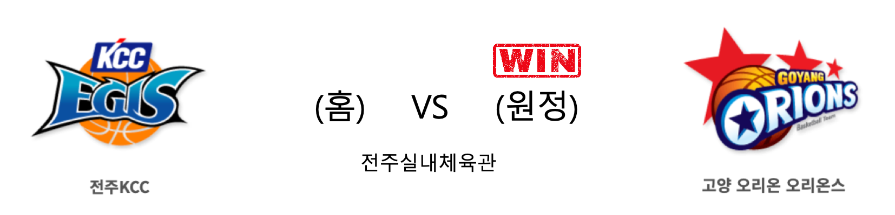

####  전주KCC(홈) VS 고양오리온(원정) 

<table class="tg">
  <tr>
    <th class="tg-rr9t">전주KCC</th>
    <th class="tg-rr9t">팀</th>
    <th class="tg-rr9t">고양오리온</th>
  </tr>
  <tr>
    <td class="tg-dcpn">2승 2패</td>
    <td class="tg-rr9t">시즌 상대전적</td>
    <td class="tg-dcpn">2승 2패</td>
  </tr>
  <tr>
    <td class="tg-dcpn">8</td>
    <td class="tg-rr9t">점수</td>
    <td class="tg-dcpn">14</td>
  </tr>
  <tr>
    <td class="tg-dcpn">3/5(60%)</td>
    <td class="tg-rr9t">2점(%)</td>
    <td class="tg-dcpn">5/6(83%)</td>
  </tr>
  <tr>
    <td class="tg-dcpn">0/2(0%)</td>
    <td class="tg-rr9t">3점(%)</td>
    <td class="tg-dcpn">1/2(50%)</td>
  </tr>
  <tr>
    <td class="tg-dcpn">2/2(100%)</td>
    <td class="tg-rr9t">자유투(%)</td>
    <td class="tg-dcpn">1/2(50%)</td>
  </tr>
  <tr>
    <td class="tg-dcpn">0</td>
    <td class="tg-rr9t">리바운드</td>
    <td class="tg-dcpn">6</td>
  </tr>
  <tr>
    <td class="tg-dcpn">0</td>
    <td class="tg-rr9t">어시스트</td>
    <td class="tg-dcpn">0</td>
  </tr>
  <tr>
    <td class="tg-dcpn">2</td>
    <td class="tg-rr9t">스틸</td>
    <td class="tg-dcpn">2</td>
  </tr>
  <tr>
    <td class="tg-dcpn">0</td>
    <td class="tg-rr9t">블록</td>
    <td class="tg-dcpn">1</td>
  </tr>
  <tr>
    <td class="tg-dcpn">2</td>
    <td class="tg-rr9t">턴오버</td>
    <td class="tg-dcpn">1</td>
  </tr>
  <tr>
    <td class="tg-dcpn"></td>
    <td class="tg-rr9t">주요 득점선수</td>
    <td class="tg-dcpn"></td>
  </tr>
</table>

#### 경기 관련 주요 기사         

[오리온 추일승 감독이 기대하는 ‘후반기 활력소’ 임종일](http://sports.donga.com/3/all/20200121/99344203/1)

[[내 맘대로 프리뷰] KCC vs 오리온, 후반기의 스타트](http://www.basketkorea.com/news/articleView.html?idxno=191727)

[[JB프리뷰] 3연패 탈출 vs 첫 연승 도전…승리 절실한 KCC와 오리온의 만남](http://sports.news.naver.com/basketball/news/read.nhn?oid=065&aid=0000196125)

[[라커룸에서] KCC 전창진 감독, “로드는 결장, 다음 경기 출전 준비”](http://sports.news.naver.com/basketball/news/read.nhn?oid=065&aid=0000196144)

        
        

#### 리그 순위

<table class="tg">
  <tr>
    <th class="tg-d14o">순위</th>
    <th class="tg-d14o">팀명</th>
    <th class="tg-d14o">경기수</th>
    <th class="tg-d14o">승</th>
    <th class="tg-d14o">패</th>
    <th class="tg-d14o">승차</th>
    <th class="tg-d14o">승률</th>
  </tr>
  
<tr>
    <td class="tg-50j8">1</td>
    <td class="tg-50j8">서울SK</td>
    <td class="tg-50j8">33</td>
    <td class="tg-50j8">21</td>
    <td class="tg-50j8">12</td>
    <td class="tg-50j8">0</td>
    <td class="tg-50j8">0.636</td>
</tr>

<tr>
    <td class="tg-50j8">1</td>
    <td class="tg-50j8">안양KGC</td>
    <td class="tg-50j8">33</td>
    <td class="tg-50j8">21</td>
    <td class="tg-50j8">12</td>
    <td class="tg-50j8">0</td>
    <td class="tg-50j8">0.636</td>
</tr>

<tr>
    <td class="tg-50j8">3</td>
    <td class="tg-50j8">원주DB</td>
    <td class="tg-50j8">32</td>
    <td class="tg-50j8">19</td>
    <td class="tg-50j8">13</td>
    <td class="tg-50j8">2</td>
    <td class="tg-50j8">0.594</td>
</tr>

<tr>
    <td class="tg-50j8">4</td>
    <td class="tg-50j8">인천전자랜드</td>
    <td class="tg-50j8">33</td>
    <td class="tg-50j8">19</td>
    <td class="tg-50j8">14</td>
    <td class="tg-50j8">2</td>
    <td class="tg-50j8">0.576</td>
</tr>

<tr>
    <td class="tg-50j8">5</td>
    <td class="tg-50j8">전주KCC</td>
    <td class="tg-50j8">34</td>
    <td class="tg-50j8">18</td>
    <td class="tg-50j8">16</td>
    <td class="tg-50j8">3</td>
    <td class="tg-50j8">0.529</td>
</tr>

<tr>
    <td class="tg-50j8">6</td>
    <td class="tg-50j8">부산KT</td>
    <td class="tg-50j8">33</td>
    <td class="tg-50j8">15</td>
    <td class="tg-50j8">18</td>
    <td class="tg-50j8">6</td>
    <td class="tg-50j8">0.455</td>
</tr>

<tr>
    <td class="tg-50j8">6</td>
    <td class="tg-50j8">울산현대모비스</td>
    <td class="tg-50j8">33</td>
    <td class="tg-50j8">15</td>
    <td class="tg-50j8">18</td>
    <td class="tg-50j8">6</td>
    <td class="tg-50j8">0.455</td>
</tr>

<tr>
    <td class="tg-50j8">8</td>
    <td class="tg-50j8">서울삼성</td>
    <td class="tg-50j8">33</td>
    <td class="tg-50j8">14</td>
    <td class="tg-50j8">19</td>
    <td class="tg-50j8">7</td>
    <td class="tg-50j8">0.424</td>
</tr>

<tr>
    <td class="tg-50j8">9</td>
    <td class="tg-50j8">창원LG</td>
    <td class="tg-50j8">34</td>
    <td class="tg-50j8">12</td>
    <td class="tg-50j8">22</td>
    <td class="tg-50j8">9</td>
    <td class="tg-50j8">0.353</td>
</tr>

<tr>
    <td class="tg-50j8">9</td>
    <td class="tg-50j8">고양오리온</td>
    <td class="tg-50j8">34</td>
    <td class="tg-50j8">12</td>
    <td class="tg-50j8">22</td>
    <td class="tg-50j8">9</td>
    <td class="tg-50j8">0.353</td>
</tr>
</table> 

        
        
#kbl #국내농구 #농구분석 #토토 #스포츠토토 #경기예측 #농구결과 #20200121 #전주KCC #고양오리온 #전주KCC고양오리온 