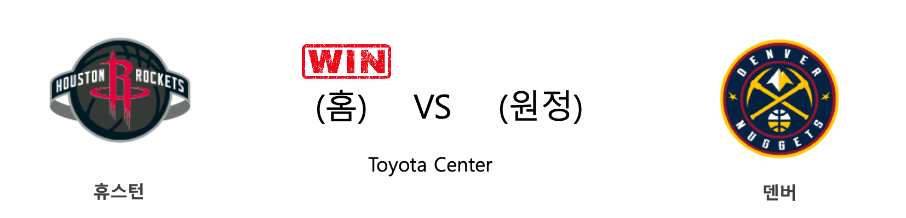
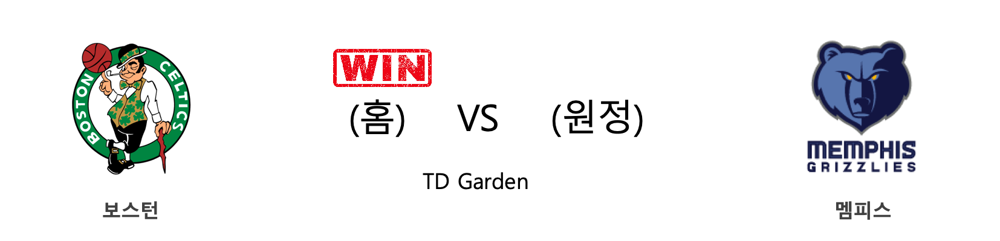

####  휴스턴(홈) VS 덴버(원정) 

<table class="tg">
  <tr>
    <th class="tg-rr9t">HOU</th>
    <th class="tg-rr9t">팀</th>
    <th class="tg-rr9t">DEN</th>
  </tr>
  <tr>
    <td class="tg-dcpn">2승 1패</td>
    <td class="tg-rr9t">시즌 상대전적</td>
    <td class="tg-dcpn">1승 2패</td>
  </tr>
  <tr>
    <td class="tg-dcpn">121</td>
    <td class="tg-rr9t">점수</td>
    <td class="tg-dcpn">105</td>
  </tr>
  <tr>
    <td class="tg-dcpn">29/60(48%)</td>
    <td class="tg-rr9t">2점(%)</td>
    <td class="tg-dcpn">32/64(50%)</td>
  </tr>
  <tr>
    <td class="tg-dcpn">13/29(45%)</td>
    <td class="tg-rr9t">3점(%)</td>
    <td class="tg-dcpn">10/28(36%)</td>
  </tr>
  <tr>
    <td class="tg-dcpn">24/28(86%)</td>
    <td class="tg-rr9t">자유투(%)</td>
    <td class="tg-dcpn">11/15(73%)</td>
  </tr>
  <tr>
    <td class="tg-dcpn">53</td>
    <td class="tg-rr9t">리바운드</td>
    <td class="tg-dcpn">40</td>
  </tr>
  <tr>
    <td class="tg-dcpn">26</td>
    <td class="tg-rr9t">어시스트</td>
    <td class="tg-dcpn">25</td>
  </tr>
  <tr>
    <td class="tg-dcpn">10</td>
    <td class="tg-rr9t">스틸</td>
    <td class="tg-dcpn">12</td>
  </tr>
  <tr>
    <td class="tg-dcpn">7</td>
    <td class="tg-rr9t">블록</td>
    <td class="tg-dcpn">6</td>
  </tr>
  <tr>
    <td class="tg-dcpn">17</td>
    <td class="tg-rr9t">턴오버</td>
    <td class="tg-dcpn">15</td>
  </tr>
  <tr>
    <td class="tg-dcpn">RussellWestbr(28) EricGordon(25) JamesHardenG(27)</td>
    <td class="tg-rr9t">주요 득점선수</td>
    <td class="tg-dcpn">NikolaJokicC(19) JeramiGrantF(17) PJDozier(15)</td>
  </tr>
</table>

#### 경기 관련 주요 기사         

[[오늘의 NBA] (1/16) 올랜도, 난적 LA 레이커스를 제압하다](http://sports.news.naver.com/basketball/news/read.nhn?oid=486&aid=0000001198)

[[오늘의 NBA] (12/29) 마이애미, 연장전 승부 전문가](http://sports.news.naver.com/basketball/news/read.nhn?oid=486&aid=0000001180)

[[오늘의 NBA] (1/15) 유타 10연승 달성!](http://sports.news.naver.com/basketball/news/read.nhn?oid=486&aid=0000001197)

[[오늘의 NBA] (1/21) 데미안 릴라드, 포틀랜드의 슈퍼스타](http://sports.news.naver.com/basketball/news/read.nhn?oid=486&aid=0000001203)

[[오늘의 NBA] (1/1) 휴스턴의 불장난](http://sports.news.naver.com/basketball/news/read.nhn?oid=486&aid=0000001183)

        
        

####  올랜도(홈) VS 오클라호마씨티(원정) 

<table class="tg">
  <tr>
    <th class="tg-rr9t">ORL</th>
    <th class="tg-rr9t">팀</th>
    <th class="tg-rr9t">OKC</th>
  </tr>
  <tr>
    <td class="tg-dcpn">0승 2패</td>
    <td class="tg-rr9t">시즌 상대전적</td>
    <td class="tg-dcpn">2승 0패</td>
  </tr>
  <tr>
    <td class="tg-dcpn">114</td>
    <td class="tg-rr9t">점수</td>
    <td class="tg-dcpn">120</td>
  </tr>
  <tr>
    <td class="tg-dcpn">30/57(53%)</td>
    <td class="tg-rr9t">2점(%)</td>
    <td class="tg-dcpn">37/57(65%)</td>
  </tr>
  <tr>
    <td class="tg-dcpn">14/35(40%)</td>
    <td class="tg-rr9t">3점(%)</td>
    <td class="tg-dcpn">9/19(47%)</td>
  </tr>
  <tr>
    <td class="tg-dcpn">12/16(75%)</td>
    <td class="tg-rr9t">자유투(%)</td>
    <td class="tg-dcpn">19/23(83%)</td>
  </tr>
  <tr>
    <td class="tg-dcpn">39</td>
    <td class="tg-rr9t">리바운드</td>
    <td class="tg-dcpn">36</td>
  </tr>
  <tr>
    <td class="tg-dcpn">26</td>
    <td class="tg-rr9t">어시스트</td>
    <td class="tg-dcpn">22</td>
  </tr>
  <tr>
    <td class="tg-dcpn">9</td>
    <td class="tg-rr9t">스틸</td>
    <td class="tg-dcpn">10</td>
  </tr>
  <tr>
    <td class="tg-dcpn">3</td>
    <td class="tg-rr9t">블록</td>
    <td class="tg-dcpn">7</td>
  </tr>
  <tr>
    <td class="tg-dcpn">14</td>
    <td class="tg-rr9t">턴오버</td>
    <td class="tg-dcpn">15</td>
  </tr>
  <tr>
    <td class="tg-dcpn">NikolaVucevic(24) MichaelCarter(15) TerrenceRoss(26)</td>
    <td class="tg-rr9t">주요 득점선수</td>
    <td class="tg-dcpn">ShaiGilgeous-(18) ChrisPaulG(19) DennisSchrode(31)</td>
  </tr>
</table>

#### 경기 관련 주요 기사         

[[오늘의 NBA] (1/7) ORL 마켈 펄츠의 커리어 나이트](http://sports.news.naver.com/basketball/news/read.nhn?oid=486&aid=0000001189)

[[오늘의 NBA] (1/21) 데미안 릴라드, 포틀랜드의 슈퍼스타](http://sports.news.naver.com/basketball/news/read.nhn?oid=486&aid=0000001203)

[[오늘의 NBA] (1/18) 애틀랜타의 AT&T 센터 던전 정복!](http://sports.news.naver.com/basketball/news/read.nhn?oid=486&aid=0000001200)

[[오늘의 NBA] (1/19) 르브론 제임스, 휴스턴을 저격하다!](http://sports.news.naver.com/basketball/news/read.nhn?oid=486&aid=0000001201)

[[오늘의 NBA] (1/14) 샤이 길저스-알랙선더, 선배 러셀 웨스트브룩을 오마쥬하다](http://sports.news.naver.com/basketball/news/read.nhn?oid=486&aid=0000001196)

        
        

####  뉴올리언스(홈) VS 샌안토니오(원정) 

<table class="tg">
  <tr>
    <th class="tg-rr9t">NOP</th>
    <th class="tg-rr9t">팀</th>
    <th class="tg-rr9t">SAS</th>
  </tr>
  <tr>
    <td class="tg-dcpn">0승 1패</td>
    <td class="tg-rr9t">시즌 상대전적</td>
    <td class="tg-dcpn">1승 0패</td>
  </tr>
  <tr>
    <td class="tg-dcpn">117</td>
    <td class="tg-rr9t">점수</td>
    <td class="tg-dcpn">121</td>
  </tr>
  <tr>
    <td class="tg-dcpn">25/48(52%)</td>
    <td class="tg-rr9t">2점(%)</td>
    <td class="tg-dcpn">34/62(55%)</td>
  </tr>
  <tr>
    <td class="tg-dcpn">14/36(39%)</td>
    <td class="tg-rr9t">3점(%)</td>
    <td class="tg-dcpn">11/27(41%)</td>
  </tr>
  <tr>
    <td class="tg-dcpn">25/32(78%)</td>
    <td class="tg-rr9t">자유투(%)</td>
    <td class="tg-dcpn">20/25(80%)</td>
  </tr>
  <tr>
    <td class="tg-dcpn">41</td>
    <td class="tg-rr9t">리바운드</td>
    <td class="tg-dcpn">44</td>
  </tr>
  <tr>
    <td class="tg-dcpn">26</td>
    <td class="tg-rr9t">어시스트</td>
    <td class="tg-dcpn">17</td>
  </tr>
  <tr>
    <td class="tg-dcpn">6</td>
    <td class="tg-rr9t">스틸</td>
    <td class="tg-dcpn">7</td>
  </tr>
  <tr>
    <td class="tg-dcpn">3</td>
    <td class="tg-rr9t">블록</td>
    <td class="tg-dcpn">4</td>
  </tr>
  <tr>
    <td class="tg-dcpn">14</td>
    <td class="tg-rr9t">턴오버</td>
    <td class="tg-dcpn">11</td>
  </tr>
  <tr>
    <td class="tg-dcpn">BrandonIngram(22) ZionWilliamso(22)</td>
    <td class="tg-rr9t">주요 득점선수</td>
    <td class="tg-dcpn">LaMarcusAldri(32) DeMarDeRozanF(20)</td>
  </tr>
</table>

#### 경기 관련 주요 기사         

[[오늘의 NBA] (12/24) 자말 머레이와 데빈 부커의 뒤틀린 운명](http://sports.news.naver.com/basketball/news/read.nhn?oid=486&aid=0000001176)

[[오늘의 NBA] (11/17) 샬럿, 설계된 플레이 연출의 달인](http://sports.news.naver.com/basketball/news/read.nhn?oid=486&aid=0000001140)

[[오늘의 NBA] (12/29) 마이애미, 연장전 승부 전문가](http://sports.news.naver.com/basketball/news/read.nhn?oid=486&aid=0000001180)

[[오늘의 NBA] (1/23) 자이언 윌리엄슨의 NBA 데뷔전](http://sports.news.naver.com/basketball/news/read.nhn?oid=486&aid=0000001205)

[[오늘의 NBA] (1/11) 멤피스, 서부컨퍼런스 8위 등극](http://sports.news.naver.com/basketball/news/read.nhn?oid=486&aid=0000001193)

        
        

####  뉴욕(홈) VS LA레이커스(원정) 

<table class="tg">
  <tr>
    <th class="tg-rr9t">NYK</th>
    <th class="tg-rr9t">팀</th>
    <th class="tg-rr9t">LAL</th>
  </tr>
  <tr>
    <td class="tg-dcpn">0승 2패</td>
    <td class="tg-rr9t">시즌 상대전적</td>
    <td class="tg-dcpn">2승 0패</td>
  </tr>
  <tr>
    <td class="tg-dcpn">92</td>
    <td class="tg-rr9t">점수</td>
    <td class="tg-dcpn">100</td>
  </tr>
  <tr>
    <td class="tg-dcpn">25/54(46%)</td>
    <td class="tg-rr9t">2점(%)</td>
    <td class="tg-dcpn">27/55(49%)</td>
  </tr>
  <tr>
    <td class="tg-dcpn">11/34(32%)</td>
    <td class="tg-rr9t">3점(%)</td>
    <td class="tg-dcpn">9/27(33%)</td>
  </tr>
  <tr>
    <td class="tg-dcpn">9/13(69%)</td>
    <td class="tg-rr9t">자유투(%)</td>
    <td class="tg-dcpn">19/28(68%)</td>
  </tr>
  <tr>
    <td class="tg-dcpn">47</td>
    <td class="tg-rr9t">리바운드</td>
    <td class="tg-dcpn">43</td>
  </tr>
  <tr>
    <td class="tg-dcpn">24</td>
    <td class="tg-rr9t">어시스트</td>
    <td class="tg-dcpn">18</td>
  </tr>
  <tr>
    <td class="tg-dcpn">4</td>
    <td class="tg-rr9t">스틸</td>
    <td class="tg-dcpn">13</td>
  </tr>
  <tr>
    <td class="tg-dcpn">4</td>
    <td class="tg-rr9t">블록</td>
    <td class="tg-dcpn">8</td>
  </tr>
  <tr>
    <td class="tg-dcpn">17</td>
    <td class="tg-rr9t">턴오버</td>
    <td class="tg-dcpn">10</td>
  </tr>
  <tr>
    <td class="tg-dcpn">DamyeanDotson(17) MarcusMorrisS(20) JuliusRandleF(16)</td>
    <td class="tg-rr9t">주요 득점선수</td>
    <td class="tg-dcpn">AnthonyDavisF(28) LeBronJamesF(21)</td>
  </tr>
</table>

#### 경기 관련 주요 기사         

[[오늘의 NBA] (1/19) 르브론 제임스, 휴스턴을 저격하다!](http://sports.news.naver.com/basketball/news/read.nhn?oid=486&aid=0000001201)

[[오늘의 NBA] (1/21) 데미안 릴라드, 포틀랜드의 슈퍼스타](http://sports.news.naver.com/basketball/news/read.nhn?oid=486&aid=0000001203)

[[오늘의 NBA] (1/11) 멤피스, 서부컨퍼런스 8위 등극](http://sports.news.naver.com/basketball/news/read.nhn?oid=486&aid=0000001193)

[[오늘의 NBA] (1/17) 브랜든 잉그램 vs 도노반 미첼, 1월의 명승부](http://sports.news.naver.com/basketball/news/read.nhn?oid=486&aid=0000001199)

[[오늘의 NBA] (1/23) 자이언 윌리엄슨의 NBA 데뷔전](http://sports.news.naver.com/basketball/news/read.nhn?oid=486&aid=0000001205)

        
        

####  디트로이트(홈) VS 새크라멘토(원정) 

<table class="tg">
  <tr>
    <th class="tg-rr9t">DET</th>
    <th class="tg-rr9t">팀</th>
    <th class="tg-rr9t">SAC</th>
  </tr>
  <tr>
    <td class="tg-dcpn">1승 0패</td>
    <td class="tg-rr9t">시즌 상대전적</td>
    <td class="tg-dcpn">0승 1패</td>
  </tr>
  <tr>
    <td class="tg-dcpn">127</td>
    <td class="tg-rr9t">점수</td>
    <td class="tg-dcpn">106</td>
  </tr>
  <tr>
    <td class="tg-dcpn">27/44(61%)</td>
    <td class="tg-rr9t">2점(%)</td>
    <td class="tg-dcpn">32/63(51%)</td>
  </tr>
  <tr>
    <td class="tg-dcpn">12/29(41%)</td>
    <td class="tg-rr9t">3점(%)</td>
    <td class="tg-dcpn">10/35(29%)</td>
  </tr>
  <tr>
    <td class="tg-dcpn">37/44(84%)</td>
    <td class="tg-rr9t">자유투(%)</td>
    <td class="tg-dcpn">12/23(52%)</td>
  </tr>
  <tr>
    <td class="tg-dcpn">48</td>
    <td class="tg-rr9t">리바운드</td>
    <td class="tg-dcpn">45</td>
  </tr>
  <tr>
    <td class="tg-dcpn">19</td>
    <td class="tg-rr9t">어시스트</td>
    <td class="tg-dcpn">23</td>
  </tr>
  <tr>
    <td class="tg-dcpn">9</td>
    <td class="tg-rr9t">스틸</td>
    <td class="tg-dcpn">10</td>
  </tr>
  <tr>
    <td class="tg-dcpn">4</td>
    <td class="tg-rr9t">블록</td>
    <td class="tg-dcpn">1</td>
  </tr>
  <tr>
    <td class="tg-dcpn">17</td>
    <td class="tg-rr9t">턴오버</td>
    <td class="tg-dcpn">10</td>
  </tr>
  <tr>
    <td class="tg-dcpn">ChristianWood(23) DerrickRoseG(22) ReggieJackson(22)</td>
    <td class="tg-rr9t">주요 득점선수</td>
    <td class="tg-dcpn">De'AaronFoxG(22) BogdanBogdano(19)</td>
  </tr>
</table>

#### 경기 관련 주요 기사         

['로즈 더블-더블' DET, SAC 6연패 빠뜨려](http://www.rookie.co.kr/news/articleView.html?idxno=38409)

[[오늘의 NBA] (11/30) 인디애나, 동부컨퍼런스의 복병](http://sports.news.naver.com/basketball/news/read.nhn?oid=486&aid=0000001152)

[[오늘의 NBA] (12/21) 크리스탑스 포르징기스, 댈러스의 새로운 버팀목](http://sports.news.naver.com/basketball/news/read.nhn?oid=486&aid=0000001173)

[[오늘의 NBA] (12/29) 마이애미, 연장전 승부 전문가](http://sports.news.naver.com/basketball/news/read.nhn?oid=486&aid=0000001180)

[[오늘의 NBA] (12/7) 르브론 제임스, 멜로(carmelo) 드라마의 주인공](http://sports.news.naver.com/basketball/news/read.nhn?oid=486&aid=0000001159)

        
        

####  피닉스(홈) VS 인디애나(원정) 

<table class="tg">
  <tr>
    <th class="tg-rr9t">PHX</th>
    <th class="tg-rr9t">팀</th>
    <th class="tg-rr9t">IND</th>
  </tr>
  <tr>
    <td class="tg-dcpn">0승 1패</td>
    <td class="tg-rr9t">시즌 상대전적</td>
    <td class="tg-dcpn">1승 0패</td>
  </tr>
  <tr>
    <td class="tg-dcpn">87</td>
    <td class="tg-rr9t">점수</td>
    <td class="tg-dcpn">112</td>
  </tr>
  <tr>
    <td class="tg-dcpn">26/64(41%)</td>
    <td class="tg-rr9t">2점(%)</td>
    <td class="tg-dcpn">36/64(56%)</td>
  </tr>
  <tr>
    <td class="tg-dcpn">4/20(20%)</td>
    <td class="tg-rr9t">3점(%)</td>
    <td class="tg-dcpn">9/20(45%)</td>
  </tr>
  <tr>
    <td class="tg-dcpn">23/26(88%)</td>
    <td class="tg-rr9t">자유투(%)</td>
    <td class="tg-dcpn">13/20(65%)</td>
  </tr>
  <tr>
    <td class="tg-dcpn">44</td>
    <td class="tg-rr9t">리바운드</td>
    <td class="tg-dcpn">42</td>
  </tr>
  <tr>
    <td class="tg-dcpn">13</td>
    <td class="tg-rr9t">어시스트</td>
    <td class="tg-dcpn">26</td>
  </tr>
  <tr>
    <td class="tg-dcpn">7</td>
    <td class="tg-rr9t">스틸</td>
    <td class="tg-dcpn">8</td>
  </tr>
  <tr>
    <td class="tg-dcpn">3</td>
    <td class="tg-rr9t">블록</td>
    <td class="tg-dcpn">8</td>
  </tr>
  <tr>
    <td class="tg-dcpn">13</td>
    <td class="tg-rr9t">턴오버</td>
    <td class="tg-dcpn">9</td>
  </tr>
  <tr>
    <td class="tg-dcpn">DevinBookerG(16) KellyOubreJr.(17)</td>
    <td class="tg-rr9t">주요 득점선수</td>
    <td class="tg-dcpn">T.J.WarrenF(25) DomantasSabon(24)</td>
  </tr>
</table>

#### 경기 관련 주요 기사         

[[오늘의 NBA] (12/28) 골든스테이트, 수비 코트에서 시작된 대반격](http://sports.news.naver.com/basketball/news/read.nhn?oid=486&aid=0000001179)

[[오늘의 NBA] (12/24) 자말 머레이와 데빈 부커의 뒤틀린 운명](http://sports.news.naver.com/basketball/news/read.nhn?oid=486&aid=0000001176)

[[오늘의 NBA] (1/23) 자이언 윌리엄슨의 NBA 데뷔전](http://sports.news.naver.com/basketball/news/read.nhn?oid=486&aid=0000001205)

[[오늘의 NBA] (1/21) 데미안 릴라드, 포틀랜드의 슈퍼스타](http://sports.news.naver.com/basketball/news/read.nhn?oid=486&aid=0000001203)

[[오늘의 NBA] (12/23) 토론토, 포기할 줄 모르는 북방의 투사](http://sports.news.naver.com/basketball/news/read.nhn?oid=486&aid=0000001175)

        
        

####  마이애미(홈) VS 워싱턴(원정) 

<table class="tg">
  <tr>
    <th class="tg-rr9t">MIA</th>
    <th class="tg-rr9t">팀</th>
    <th class="tg-rr9t">WAS</th>
  </tr>
  <tr>
    <td class="tg-dcpn">2승 0패</td>
    <td class="tg-rr9t">시즌 상대전적</td>
    <td class="tg-dcpn">0승 2패</td>
  </tr>
  <tr>
    <td class="tg-dcpn">134</td>
    <td class="tg-rr9t">점수</td>
    <td class="tg-dcpn">129</td>
  </tr>
  <tr>
    <td class="tg-dcpn">26/52(50%)</td>
    <td class="tg-rr9t">2점(%)</td>
    <td class="tg-dcpn">37/57(65%)</td>
  </tr>
  <tr>
    <td class="tg-dcpn">17/33(52%)</td>
    <td class="tg-rr9t">3점(%)</td>
    <td class="tg-dcpn">13/42(31%)</td>
  </tr>
  <tr>
    <td class="tg-dcpn">31/36(86%)</td>
    <td class="tg-rr9t">자유투(%)</td>
    <td class="tg-dcpn">16/20(80%)</td>
  </tr>
  <tr>
    <td class="tg-dcpn">43</td>
    <td class="tg-rr9t">리바운드</td>
    <td class="tg-dcpn">41</td>
  </tr>
  <tr>
    <td class="tg-dcpn">29</td>
    <td class="tg-rr9t">어시스트</td>
    <td class="tg-dcpn">30</td>
  </tr>
  <tr>
    <td class="tg-dcpn">3</td>
    <td class="tg-rr9t">스틸</td>
    <td class="tg-dcpn">10</td>
  </tr>
  <tr>
    <td class="tg-dcpn">6</td>
    <td class="tg-rr9t">블록</td>
    <td class="tg-dcpn">5</td>
  </tr>
  <tr>
    <td class="tg-dcpn">16</td>
    <td class="tg-rr9t">턴오버</td>
    <td class="tg-dcpn">11</td>
  </tr>
  <tr>
    <td class="tg-dcpn">GoranDragic(22) TylerHerro(25) JimmyButlerF(24)</td>
    <td class="tg-rr9t">주요 득점선수</td>
    <td class="tg-dcpn">DavisBertans(24) BradleyBealF(38)</td>
  </tr>
</table>

#### 경기 관련 주요 기사         

[How ‘West Side Story’ Was Reborn](https://www.nytimes.com/2020/01/22/magazine/west-side-story.html?partner=naver)

[Mia Love, Sole Black Republican Woman in Congress, Fights for Her Seat](https://www.nytimes.com/2018/10/04/us/mia-love-utah-republican-woman-congress-ben-mcadams.html?partner=naver)

[[오늘의 NBA] (12/15) 밤 아데바요, 연장전의 지배자](http://sports.news.naver.com/basketball/news/read.nhn?oid=486&aid=0000001167)

[[오늘의 NBA] (12/29) 마이애미, 연장전 승부 전문가](http://sports.news.naver.com/basketball/news/read.nhn?oid=486&aid=0000001180)

[[오늘의 NBA] (12/19) 오클라호마시티, 역전의 달인!](http://sports.news.naver.com/basketball/news/read.nhn?oid=486&aid=0000001171)

        
        

####  애틀랜타(홈) VS LA클리퍼스(원정) 

<table class="tg">
  <tr>
    <th class="tg-rr9t">ATL</th>
    <th class="tg-rr9t">팀</th>
    <th class="tg-rr9t">LAC</th>
  </tr>
  <tr>
    <td class="tg-dcpn">1승 1패</td>
    <td class="tg-rr9t">시즌 상대전적</td>
    <td class="tg-dcpn">1승 1패</td>
  </tr>
  <tr>
    <td class="tg-dcpn">102</td>
    <td class="tg-rr9t">점수</td>
    <td class="tg-dcpn">95</td>
  </tr>
  <tr>
    <td class="tg-dcpn">25/67(37%)</td>
    <td class="tg-rr9t">2점(%)</td>
    <td class="tg-dcpn">29/57(51%)</td>
  </tr>
  <tr>
    <td class="tg-dcpn">11/35(31%)</td>
    <td class="tg-rr9t">3점(%)</td>
    <td class="tg-dcpn">4/21(19%)</td>
  </tr>
  <tr>
    <td class="tg-dcpn">19/23(83%)</td>
    <td class="tg-rr9t">자유투(%)</td>
    <td class="tg-dcpn">25/39(64%)</td>
  </tr>
  <tr>
    <td class="tg-dcpn">63</td>
    <td class="tg-rr9t">리바운드</td>
    <td class="tg-dcpn">45</td>
  </tr>
  <tr>
    <td class="tg-dcpn">21</td>
    <td class="tg-rr9t">어시스트</td>
    <td class="tg-dcpn">19</td>
  </tr>
  <tr>
    <td class="tg-dcpn">8</td>
    <td class="tg-rr9t">스틸</td>
    <td class="tg-dcpn">5</td>
  </tr>
  <tr>
    <td class="tg-dcpn">3</td>
    <td class="tg-rr9t">블록</td>
    <td class="tg-dcpn">8</td>
  </tr>
  <tr>
    <td class="tg-dcpn">15</td>
    <td class="tg-rr9t">턴오버</td>
    <td class="tg-dcpn">14</td>
  </tr>
  <tr>
    <td class="tg-dcpn">JohnCollinsF(33) BrandonGoodwi(19)</td>
    <td class="tg-rr9t">주요 득점선수</td>
    <td class="tg-dcpn">MontrezlHarre(30) LouWilliamsG(18)</td>
  </tr>
</table>

#### 경기 관련 주요 기사         

[[오늘의 NBA] (1/14) 샤이 길저스-알랙선더, 선배 러셀 웨스트브룩을 오마쥬하다](http://sports.news.naver.com/basketball/news/read.nhn?oid=486&aid=0000001196)

[[오늘의 NBA] (1/12) 레이커스, "No LBJ, No AD, No Problem!"](http://sports.news.naver.com/basketball/news/read.nhn?oid=486&aid=0000001194)

[[오늘의 NBA] (1/19) 르브론 제임스, 휴스턴을 저격하다!](http://sports.news.naver.com/basketball/news/read.nhn?oid=486&aid=0000001201)

[[오늘의 NBA] (1/13) 더마 드로잔, 1년간 기다렸던 복수극](http://sports.news.naver.com/basketball/news/read.nhn?oid=486&aid=0000001195)

['콜린스 33P 16R' ATL, 레너드 빠진 LAC에 짜릿한 역전승](http://www.rookie.co.kr/news/articleView.html?idxno=38418)

        
        

####  시카고(홈) VS 미네소타(원정) 

<table class="tg">
  <tr>
    <th class="tg-rr9t">CHI</th>
    <th class="tg-rr9t">팀</th>
    <th class="tg-rr9t">MIN</th>
  </tr>
  <tr>
    <td class="tg-dcpn">1승 0패</td>
    <td class="tg-rr9t">시즌 상대전적</td>
    <td class="tg-dcpn">0승 1패</td>
  </tr>
  <tr>
    <td class="tg-dcpn">117</td>
    <td class="tg-rr9t">점수</td>
    <td class="tg-dcpn">110</td>
  </tr>
  <tr>
    <td class="tg-dcpn">30/54(56%)</td>
    <td class="tg-rr9t">2점(%)</td>
    <td class="tg-dcpn">26/42(62%)</td>
  </tr>
  <tr>
    <td class="tg-dcpn">9/30(30%)</td>
    <td class="tg-rr9t">3점(%)</td>
    <td class="tg-dcpn">15/44(34%)</td>
  </tr>
  <tr>
    <td class="tg-dcpn">30/37(81%)</td>
    <td class="tg-rr9t">자유투(%)</td>
    <td class="tg-dcpn">13/24(54%)</td>
  </tr>
  <tr>
    <td class="tg-dcpn">50</td>
    <td class="tg-rr9t">리바운드</td>
    <td class="tg-dcpn">43</td>
  </tr>
  <tr>
    <td class="tg-dcpn">21</td>
    <td class="tg-rr9t">어시스트</td>
    <td class="tg-dcpn">27</td>
  </tr>
  <tr>
    <td class="tg-dcpn">9</td>
    <td class="tg-rr9t">스틸</td>
    <td class="tg-dcpn">7</td>
  </tr>
  <tr>
    <td class="tg-dcpn">2</td>
    <td class="tg-rr9t">블록</td>
    <td class="tg-dcpn">3</td>
  </tr>
  <tr>
    <td class="tg-dcpn">12</td>
    <td class="tg-rr9t">턴오버</td>
    <td class="tg-dcpn">18</td>
  </tr>
  <tr>
    <td class="tg-dcpn">ZachLaVineG(25) LauriMarkkane(21) LukeKornetC(15)</td>
    <td class="tg-rr9t">주요 득점선수</td>
    <td class="tg-dcpn">ShabazzNapier(16) AndrewWiggins(25) Karl-AnthonyT(40)</td>
  </tr>
</table>

#### 경기 관련 주요 기사         

        
        

####  보스턴(홈) VS 멤피스(원정) 

<table class="tg">
  <tr>
    <th class="tg-rr9t">BOS</th>
    <th class="tg-rr9t">팀</th>
    <th class="tg-rr9t">MEM</th>
  </tr>
  <tr>
    <td class="tg-dcpn">1승 0패</td>
    <td class="tg-rr9t">시즌 상대전적</td>
    <td class="tg-dcpn">0승 1패</td>
  </tr>
  <tr>
    <td class="tg-dcpn">119</td>
    <td class="tg-rr9t">점수</td>
    <td class="tg-dcpn">95</td>
  </tr>
  <tr>
    <td class="tg-dcpn">31/57(54%)</td>
    <td class="tg-rr9t">2점(%)</td>
    <td class="tg-dcpn">25/53(47%)</td>
  </tr>
  <tr>
    <td class="tg-dcpn">14/32(44%)</td>
    <td class="tg-rr9t">3점(%)</td>
    <td class="tg-dcpn">11/32(34%)</td>
  </tr>
  <tr>
    <td class="tg-dcpn">15/20(75%)</td>
    <td class="tg-rr9t">자유투(%)</td>
    <td class="tg-dcpn">12/15(80%)</td>
  </tr>
  <tr>
    <td class="tg-dcpn">44</td>
    <td class="tg-rr9t">리바운드</td>
    <td class="tg-dcpn">40</td>
  </tr>
  <tr>
    <td class="tg-dcpn">32</td>
    <td class="tg-rr9t">어시스트</td>
    <td class="tg-dcpn">24</td>
  </tr>
  <tr>
    <td class="tg-dcpn">11</td>
    <td class="tg-rr9t">스틸</td>
    <td class="tg-dcpn">7</td>
  </tr>
  <tr>
    <td class="tg-dcpn">9</td>
    <td class="tg-rr9t">블록</td>
    <td class="tg-dcpn">8</td>
  </tr>
  <tr>
    <td class="tg-dcpn">9</td>
    <td class="tg-rr9t">턴오버</td>
    <td class="tg-dcpn">16</td>
  </tr>
  <tr>
    <td class="tg-dcpn">JaysonTatumF(23)</td>
    <td class="tg-rr9t">주요 득점선수</td>
    <td class="tg-dcpn">JonasValanciu(16)</td>
  </tr>
</table>

#### 경기 관련 주요 기사         

[[오늘의 NBA] (11/12) 샌안토니오와 토니 파커의 마지막 동반 여행](http://sports.news.naver.com/basketball/news/read.nhn?oid=486&aid=0000001135)

[[오늘의 NBA] (1/21) 데미안 릴라드, 포틀랜드의 슈퍼스타](http://sports.news.naver.com/basketball/news/read.nhn?oid=486&aid=0000001203)

[[오늘의 NBA] (1/15) 유타 10연승 달성!](http://sports.news.naver.com/basketball/news/read.nhn?oid=486&aid=0000001197)

[[오늘의 NBA] (1/23) 자이언 윌리엄슨의 NBA 데뷔전](http://sports.news.naver.com/basketball/news/read.nhn?oid=486&aid=0000001205)

[[오늘의 NBA] (12/29) 마이애미, 연장전 승부 전문가](http://sports.news.naver.com/basketball/news/read.nhn?oid=486&aid=0000001180)

        
        

####  토론토(홈) VS 필라델피아(원정) 

<table class="tg">
  <tr>
    <th class="tg-rr9t">TOR</th>
    <th class="tg-rr9t">팀</th>
    <th class="tg-rr9t">PHI</th>
  </tr>
  <tr>
    <td class="tg-dcpn">2승 1패</td>
    <td class="tg-rr9t">시즌 상대전적</td>
    <td class="tg-dcpn">1승 2패</td>
  </tr>
  <tr>
    <td class="tg-dcpn">107</td>
    <td class="tg-rr9t">점수</td>
    <td class="tg-dcpn">95</td>
  </tr>
  <tr>
    <td class="tg-dcpn">27/53(51%)</td>
    <td class="tg-rr9t">2점(%)</td>
    <td class="tg-dcpn">14/38(37%)</td>
  </tr>
  <tr>
    <td class="tg-dcpn">13/33(39%)</td>
    <td class="tg-rr9t">3점(%)</td>
    <td class="tg-dcpn">18/46(39%)</td>
  </tr>
  <tr>
    <td class="tg-dcpn">14/21(67%)</td>
    <td class="tg-rr9t">자유투(%)</td>
    <td class="tg-dcpn">13/18(72%)</td>
  </tr>
  <tr>
    <td class="tg-dcpn">53</td>
    <td class="tg-rr9t">리바운드</td>
    <td class="tg-dcpn">45</td>
  </tr>
  <tr>
    <td class="tg-dcpn">27</td>
    <td class="tg-rr9t">어시스트</td>
    <td class="tg-dcpn">25</td>
  </tr>
  <tr>
    <td class="tg-dcpn">6</td>
    <td class="tg-rr9t">스틸</td>
    <td class="tg-dcpn">8</td>
  </tr>
  <tr>
    <td class="tg-dcpn">2</td>
    <td class="tg-rr9t">블록</td>
    <td class="tg-dcpn">6</td>
  </tr>
  <tr>
    <td class="tg-dcpn">12</td>
    <td class="tg-rr9t">턴오버</td>
    <td class="tg-dcpn">13</td>
  </tr>
  <tr>
    <td class="tg-dcpn">PascalSiakamF(18) KyleLowryG(16) NormanPowell(18) FredVanVleetG(22) MarcGasolC(17) SergeIbaka(16)</td>
    <td class="tg-rr9t">주요 득점선수</td>
    <td class="tg-dcpn">TobiasHarrisF(22) BenSimmonsG(17) FurkanKorkmaz(17)</td>
  </tr>
</table>

#### 경기 관련 주요 기사         

[[오늘의 NBA] (1/23) 자이언 윌리엄슨의 NBA 데뷔전](http://sports.news.naver.com/basketball/news/read.nhn?oid=486&aid=0000001205)

[[오늘의 NBA] (12/21) 크리스탑스 포르징기스, 댈러스의 새로운 버팀목](http://sports.news.naver.com/basketball/news/read.nhn?oid=486&aid=0000001173)

[[오늘의 NBA] (1/10) PHI vs BOS, 먹이사슬의 역전!](http://sports.news.naver.com/basketball/news/read.nhn?oid=486&aid=0000001192)

[[오늘의 NBA] (1/17) 브랜든 잉그램 vs 도노반 미첼, 1월의 명승부](http://sports.news.naver.com/basketball/news/read.nhn?oid=486&aid=0000001199)

[[오늘의 NBA] (1/21) 데미안 릴라드, 포틀랜드의 슈퍼스타](http://sports.news.naver.com/basketball/news/read.nhn?oid=486&aid=0000001203)

        
        

####  골든스테이트(홈) VS 유타(원정) 

<table class="tg">
  <tr>
    <th class="tg-rr9t">GSW</th>
    <th class="tg-rr9t">팀</th>
    <th class="tg-rr9t">UTA</th>
  </tr>
  <tr>
    <td class="tg-dcpn">0승 4패</td>
    <td class="tg-rr9t">시즌 상대전적</td>
    <td class="tg-dcpn">4승 0패</td>
  </tr>
  <tr>
    <td class="tg-dcpn">96</td>
    <td class="tg-rr9t">점수</td>
    <td class="tg-dcpn">129</td>
  </tr>
  <tr>
    <td class="tg-dcpn">29/65(45%)</td>
    <td class="tg-rr9t">2점(%)</td>
    <td class="tg-dcpn">33/53(62%)</td>
  </tr>
  <tr>
    <td class="tg-dcpn">6/23(26%)</td>
    <td class="tg-rr9t">3점(%)</td>
    <td class="tg-dcpn">17/40(42%)</td>
  </tr>
  <tr>
    <td class="tg-dcpn">20/24(83%)</td>
    <td class="tg-rr9t">자유투(%)</td>
    <td class="tg-dcpn">12/23(52%)</td>
  </tr>
  <tr>
    <td class="tg-dcpn">37</td>
    <td class="tg-rr9t">리바운드</td>
    <td class="tg-dcpn">56</td>
  </tr>
  <tr>
    <td class="tg-dcpn">20</td>
    <td class="tg-rr9t">어시스트</td>
    <td class="tg-dcpn">31</td>
  </tr>
  <tr>
    <td class="tg-dcpn">5</td>
    <td class="tg-rr9t">스틸</td>
    <td class="tg-dcpn">5</td>
  </tr>
  <tr>
    <td class="tg-dcpn">5</td>
    <td class="tg-rr9t">블록</td>
    <td class="tg-dcpn">3</td>
  </tr>
  <tr>
    <td class="tg-dcpn">8</td>
    <td class="tg-rr9t">턴오버</td>
    <td class="tg-dcpn">9</td>
  </tr>
  <tr>
    <td class="tg-dcpn">D'AngeloRusse(26)</td>
    <td class="tg-rr9t">주요 득점선수</td>
    <td class="tg-dcpn">BojanBogdanov(18) RudyGobertC(22) DonovanMitche(23)</td>
  </tr>
</table>

#### 경기 관련 주요 기사         

[[오늘의 NBA] (1/11) 멤피스, 서부컨퍼런스 8위 등극](http://sports.news.naver.com/basketball/news/read.nhn?oid=486&aid=0000001193)

[[오늘의 NBA] (12/29) 마이애미, 연장전 승부 전문가](http://sports.news.naver.com/basketball/news/read.nhn?oid=486&aid=0000001180)

[[오늘의 NBA] (1/7) ORL 마켈 펄츠의 커리어 나이트](http://sports.news.naver.com/basketball/news/read.nhn?oid=486&aid=0000001189)

[[오늘의 NBA] (1/21) 데미안 릴라드, 포틀랜드의 슈퍼스타](http://sports.news.naver.com/basketball/news/read.nhn?oid=486&aid=0000001203)

[[오늘의 NBA] (1/19) 르브론 제임스, 휴스턴을 저격하다!](http://sports.news.naver.com/basketball/news/read.nhn?oid=486&aid=0000001201)

        
        

#### 리그 (Eastern) 순위
    

<table class="tg">
  <tr>
    <th class="tg-d14o">순위</th>
    <th class="tg-d14o">팀명</th>
    <th class="tg-d14o">경기수</th>
    <th class="tg-d14o">승</th>
    <th class="tg-d14o">패</th>
    <th class="tg-d14o">승차</th>
    <th class="tg-d14o">승률</th>
  </tr>
  
<tr>
    <td class="tg-50j8">1</td>
    <td class="tg-50j8">MIL</td>
    <td class="tg-50j8">43</td>
    <td class="tg-50j8">37</td>
    <td class="tg-50j8">6</td>
    <td class="tg-50j8">0</td>
    <td class="tg-50j8">0.86</td>
</tr>

<tr>
    <td class="tg-50j8">2</td>
    <td class="tg-50j8">MIA</td>
    <td class="tg-50j8">43</td>
    <td class="tg-50j8">31</td>
    <td class="tg-50j8">12</td>
    <td class="tg-50j8">6</td>
    <td class="tg-50j8">0.721</td>
</tr>

<tr>
    <td class="tg-50j8">3</td>
    <td class="tg-50j8">TOR</td>
    <td class="tg-50j8">44</td>
    <td class="tg-50j8">30</td>
    <td class="tg-50j8">14</td>
    <td class="tg-50j8">7</td>
    <td class="tg-50j8">0.682</td>
</tr>

<tr>
    <td class="tg-50j8">4</td>
    <td class="tg-50j8">IND</td>
    <td class="tg-50j8">45</td>
    <td class="tg-50j8">29</td>
    <td class="tg-50j8">16</td>
    <td class="tg-50j8">8</td>
    <td class="tg-50j8">0.644</td>
</tr>

<tr>
    <td class="tg-50j8">5</td>
    <td class="tg-50j8">BOS</td>
    <td class="tg-50j8">41</td>
    <td class="tg-50j8">28</td>
    <td class="tg-50j8">13</td>
    <td class="tg-50j8">9</td>
    <td class="tg-50j8">0.683</td>
</tr>

<tr>
    <td class="tg-50j8">6</td>
    <td class="tg-50j8">PHI</td>
    <td class="tg-50j8">44</td>
    <td class="tg-50j8">28</td>
    <td class="tg-50j8">16</td>
    <td class="tg-50j8">9</td>
    <td class="tg-50j8">0.636</td>
</tr>

<tr>
    <td class="tg-50j8">7</td>
    <td class="tg-50j8">ORL</td>
    <td class="tg-50j8">44</td>
    <td class="tg-50j8">21</td>
    <td class="tg-50j8">23</td>
    <td class="tg-50j8">16</td>
    <td class="tg-50j8">0.477</td>
</tr>

<tr>
    <td class="tg-50j8">8</td>
    <td class="tg-50j8">BKN</td>
    <td class="tg-50j8">41</td>
    <td class="tg-50j8">18</td>
    <td class="tg-50j8">23</td>
    <td class="tg-50j8">19</td>
    <td class="tg-50j8">0.439</td>
</tr>

<tr>
    <td class="tg-50j8">9</td>
    <td class="tg-50j8">DET</td>
    <td class="tg-50j8">42</td>
    <td class="tg-50j8">17</td>
    <td class="tg-50j8">25</td>
    <td class="tg-50j8">20</td>
    <td class="tg-50j8">0.405</td>
</tr>

<tr>
    <td class="tg-50j8">10</td>
    <td class="tg-50j8">CHI</td>
    <td class="tg-50j8">44</td>
    <td class="tg-50j8">16</td>
    <td class="tg-50j8">28</td>
    <td class="tg-50j8">21</td>
    <td class="tg-50j8">0.364</td>
</tr>

<tr>
    <td class="tg-50j8">11</td>
    <td class="tg-50j8">CHA</td>
    <td class="tg-50j8">45</td>
    <td class="tg-50j8">15</td>
    <td class="tg-50j8">30</td>
    <td class="tg-50j8">22</td>
    <td class="tg-50j8">0.333</td>
</tr>

<tr>
    <td class="tg-50j8">12</td>
    <td class="tg-50j8">WAS</td>
    <td class="tg-50j8">42</td>
    <td class="tg-50j8">13</td>
    <td class="tg-50j8">29</td>
    <td class="tg-50j8">24</td>
    <td class="tg-50j8">0.31</td>
</tr>

<tr>
    <td class="tg-50j8">13</td>
    <td class="tg-50j8">NYK</td>
    <td class="tg-50j8">45</td>
    <td class="tg-50j8">12</td>
    <td class="tg-50j8">33</td>
    <td class="tg-50j8">25</td>
    <td class="tg-50j8">0.267</td>
</tr>

<tr>
    <td class="tg-50j8">14</td>
    <td class="tg-50j8">CLE</td>
    <td class="tg-50j8">42</td>
    <td class="tg-50j8">10</td>
    <td class="tg-50j8">32</td>
    <td class="tg-50j8">27</td>
    <td class="tg-50j8">0.238</td>
</tr>

<tr>
    <td class="tg-50j8">15</td>
    <td class="tg-50j8">ATL</td>
    <td class="tg-50j8">44</td>
    <td class="tg-50j8">10</td>
    <td class="tg-50j8">34</td>
    <td class="tg-50j8">27</td>
    <td class="tg-50j8">0.227</td>
</tr>
</table> 
#### 리그 (Western) 순위
    

<table class="tg">
  <tr>
    <th class="tg-d14o">순위</th>
    <th class="tg-d14o">팀명</th>
    <th class="tg-d14o">경기수</th>
    <th class="tg-d14o">승</th>
    <th class="tg-d14o">패</th>
    <th class="tg-d14o">승차</th>
    <th class="tg-d14o">승률</th>
  </tr>
  
<tr>
    <td class="tg-50j8">1</td>
    <td class="tg-50j8">LAL</td>
    <td class="tg-50j8">43</td>
    <td class="tg-50j8">34</td>
    <td class="tg-50j8">9</td>
    <td class="tg-50j8">3</td>
    <td class="tg-50j8">0.791</td>
</tr>

<tr>
    <td class="tg-50j8">2</td>
    <td class="tg-50j8">LAC</td>
    <td class="tg-50j8">45</td>
    <td class="tg-50j8">31</td>
    <td class="tg-50j8">14</td>
    <td class="tg-50j8">6</td>
    <td class="tg-50j8">0.689</td>
</tr>

<tr>
    <td class="tg-50j8">3</td>
    <td class="tg-50j8">UTA</td>
    <td class="tg-50j8">43</td>
    <td class="tg-50j8">30</td>
    <td class="tg-50j8">13</td>
    <td class="tg-50j8">7</td>
    <td class="tg-50j8">0.698</td>
</tr>

<tr>
    <td class="tg-50j8">4</td>
    <td class="tg-50j8">DEN</td>
    <td class="tg-50j8">42</td>
    <td class="tg-50j8">29</td>
    <td class="tg-50j8">13</td>
    <td class="tg-50j8">8</td>
    <td class="tg-50j8">0.69</td>
</tr>

<tr>
    <td class="tg-50j8">5</td>
    <td class="tg-50j8">HOU</td>
    <td class="tg-50j8">42</td>
    <td class="tg-50j8">26</td>
    <td class="tg-50j8">16</td>
    <td class="tg-50j8">11</td>
    <td class="tg-50j8">0.619</td>
</tr>

<tr>
    <td class="tg-50j8">6</td>
    <td class="tg-50j8">OKC</td>
    <td class="tg-50j8">44</td>
    <td class="tg-50j8">26</td>
    <td class="tg-50j8">18</td>
    <td class="tg-50j8">11</td>
    <td class="tg-50j8">0.591</td>
</tr>

<tr>
    <td class="tg-50j8">7</td>
    <td class="tg-50j8">DAL</td>
    <td class="tg-50j8">41</td>
    <td class="tg-50j8">25</td>
    <td class="tg-50j8">16</td>
    <td class="tg-50j8">12</td>
    <td class="tg-50j8">0.61</td>
</tr>

<tr>
    <td class="tg-50j8">8</td>
    <td class="tg-50j8">SAS</td>
    <td class="tg-50j8">42</td>
    <td class="tg-50j8">20</td>
    <td class="tg-50j8">22</td>
    <td class="tg-50j8">17</td>
    <td class="tg-50j8">0.476</td>
</tr>

<tr>
    <td class="tg-50j8">9</td>
    <td class="tg-50j8">MEM</td>
    <td class="tg-50j8">44</td>
    <td class="tg-50j8">20</td>
    <td class="tg-50j8">24</td>
    <td class="tg-50j8">17</td>
    <td class="tg-50j8">0.455</td>
</tr>

<tr>
    <td class="tg-50j8">10</td>
    <td class="tg-50j8">POR</td>
    <td class="tg-50j8">42</td>
    <td class="tg-50j8">19</td>
    <td class="tg-50j8">23</td>
    <td class="tg-50j8">18</td>
    <td class="tg-50j8">0.452</td>
</tr>

<tr>
    <td class="tg-50j8">11</td>
    <td class="tg-50j8">PHX</td>
    <td class="tg-50j8">43</td>
    <td class="tg-50j8">17</td>
    <td class="tg-50j8">26</td>
    <td class="tg-50j8">20</td>
    <td class="tg-50j8">0.395</td>
</tr>

<tr>
    <td class="tg-50j8">12</td>
    <td class="tg-50j8">NOP</td>
    <td class="tg-50j8">44</td>
    <td class="tg-50j8">17</td>
    <td class="tg-50j8">27</td>
    <td class="tg-50j8">20</td>
    <td class="tg-50j8">0.386</td>
</tr>

<tr>
    <td class="tg-50j8">13</td>
    <td class="tg-50j8">SAC</td>
    <td class="tg-50j8">44</td>
    <td class="tg-50j8">15</td>
    <td class="tg-50j8">29</td>
    <td class="tg-50j8">22</td>
    <td class="tg-50j8">0.341</td>
</tr>

<tr>
    <td class="tg-50j8">14</td>
    <td class="tg-50j8">MIN</td>
    <td class="tg-50j8">42</td>
    <td class="tg-50j8">14</td>
    <td class="tg-50j8">28</td>
    <td class="tg-50j8">23</td>
    <td class="tg-50j8">0.333</td>
</tr>

<tr>
    <td class="tg-50j8">15</td>
    <td class="tg-50j8">GSW</td>
    <td class="tg-50j8">46</td>
    <td class="tg-50j8">10</td>
    <td class="tg-50j8">36</td>
    <td class="tg-50j8">27</td>
    <td class="tg-50j8">0.217</td>
</tr>
</table> 

        
        
#nba #미국농구 #엔비에이 #농구분석 #토토 #스포츠토토 #경기예측 #농구결과 #20200123 #휴스턴 #덴버 #올랜도 #오클라호마씨티 #뉴올리언스 #샌안토니오 #뉴욕 #LA레이커스 #디트로이트 #새크라멘토 #피닉스 #인디애나 #마이애미 #워싱턴 #애틀랜타 #LA클리퍼스 #시카고 #미네소타 #보스턴 #멤피스 #토론토 #필라델피아 #골든스테이트 #유타 #휴스턴덴버 #올랜도오클라호마씨티 #뉴올리언스샌안토니오 #뉴욕LA레이커스 #디트로이트새크라멘토 #피닉스인디애나 #마이애미워싱턴 #애틀랜타LA클리퍼스 #시카고미네소타 #보스턴멤피스 #토론토필라델피아 #골든스테이트유타 