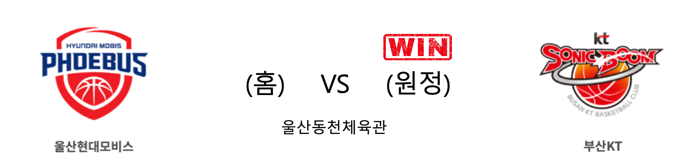
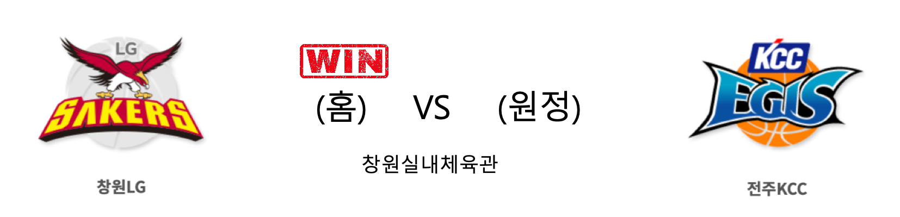

####  울산현대모비스(홈) VS 부산KT(원정) 

<table class="tg">
  <tr>
    <th class="tg-rr9t">울산현대모비스</th>
    <th class="tg-rr9t">팀</th>
    <th class="tg-rr9t">부산KT</th>
  </tr>
  <tr>
    <td class="tg-dcpn">1승 3패</td>
    <td class="tg-rr9t">시즌 상대전적</td>
    <td class="tg-dcpn">3승 1패</td>
  </tr>
  <tr>
    <td class="tg-dcpn">59</td>
    <td class="tg-rr9t">점수</td>
    <td class="tg-dcpn">71</td>
  </tr>
  <tr>
    <td class="tg-dcpn">14/53(26%)</td>
    <td class="tg-rr9t">2점(%)</td>
    <td class="tg-dcpn">26/47(55%)</td>
  </tr>
  <tr>
    <td class="tg-dcpn">8/26(31%)</td>
    <td class="tg-rr9t">3점(%)</td>
    <td class="tg-dcpn">3/20(15%)</td>
  </tr>
  <tr>
    <td class="tg-dcpn">7/18(39%)</td>
    <td class="tg-rr9t">자유투(%)</td>
    <td class="tg-dcpn">10/18(56%)</td>
  </tr>
  <tr>
    <td class="tg-dcpn">42</td>
    <td class="tg-rr9t">리바운드</td>
    <td class="tg-dcpn">49</td>
  </tr>
  <tr>
    <td class="tg-dcpn">0</td>
    <td class="tg-rr9t">어시스트</td>
    <td class="tg-dcpn">2</td>
  </tr>
  <tr>
    <td class="tg-dcpn">7</td>
    <td class="tg-rr9t">스틸</td>
    <td class="tg-dcpn">13</td>
  </tr>
  <tr>
    <td class="tg-dcpn">9</td>
    <td class="tg-rr9t">블록</td>
    <td class="tg-dcpn">5</td>
  </tr>
  <tr>
    <td class="tg-dcpn">17</td>
    <td class="tg-rr9t">턴오버</td>
    <td class="tg-dcpn">16</td>
  </tr>
  <tr>
    <td class="tg-dcpn">박지훈(15)</td>
    <td class="tg-rr9t">주요 득점선수</td>
    <td class="tg-dcpn"></td>
  </tr>
</table>

#### 경기 관련 주요 기사         

[허훈 13점+멀린스 더블더블, KT 현대모비스 제압](http://www.sportsseoul.com/news/read/876156)

[KT, 현대모비스 꺾고 단독 6위 상승](http://www.hankookilbo.com/news/npath/202001241785024934?did=NA)

['허훈 13점' KT, 현대모비스 추격 뿌리치고 단독 6위](http://www.mydaily.co.kr/new_yk/html/read.php?newsid=202001241652134942&ext=na)

[[사진]울산현대모비스-부산KT,'공동 6위 대결'](http://www.osen.co.kr/article/G1111298206)

        
        

####  창원LG(홈) VS 전주KCC(원정) 

<table class="tg">
  <tr>
    <th class="tg-rr9t">창원LG</th>
    <th class="tg-rr9t">팀</th>
    <th class="tg-rr9t">전주KCC</th>
  </tr>
  <tr>
    <td class="tg-dcpn">2승 2패</td>
    <td class="tg-rr9t">시즌 상대전적</td>
    <td class="tg-dcpn">2승 2패</td>
  </tr>
  <tr>
    <td class="tg-dcpn">96</td>
    <td class="tg-rr9t">점수</td>
    <td class="tg-dcpn">78</td>
  </tr>
  <tr>
    <td class="tg-dcpn">28/41(68%)</td>
    <td class="tg-rr9t">2점(%)</td>
    <td class="tg-dcpn">20/38(53%)</td>
  </tr>
  <tr>
    <td class="tg-dcpn">12/21(57%)</td>
    <td class="tg-rr9t">3점(%)</td>
    <td class="tg-dcpn">8/20(40%)</td>
  </tr>
  <tr>
    <td class="tg-dcpn">4/9(44%)</td>
    <td class="tg-rr9t">자유투(%)</td>
    <td class="tg-dcpn">14/18(78%)</td>
  </tr>
  <tr>
    <td class="tg-dcpn">28</td>
    <td class="tg-rr9t">리바운드</td>
    <td class="tg-dcpn">21</td>
  </tr>
  <tr>
    <td class="tg-dcpn">1</td>
    <td class="tg-rr9t">어시스트</td>
    <td class="tg-dcpn">0</td>
  </tr>
  <tr>
    <td class="tg-dcpn">12</td>
    <td class="tg-rr9t">스틸</td>
    <td class="tg-dcpn">8</td>
  </tr>
  <tr>
    <td class="tg-dcpn">5</td>
    <td class="tg-rr9t">블록</td>
    <td class="tg-dcpn">11</td>
  </tr>
  <tr>
    <td class="tg-dcpn">21</td>
    <td class="tg-rr9t">턴오버</td>
    <td class="tg-dcpn">14</td>
  </tr>
  <tr>
    <td class="tg-dcpn">강병현(18) 캐디 라렌(29) 김동량(17)</td>
    <td class="tg-rr9t">주요 득점선수</td>
    <td class="tg-dcpn">라건아(20) 정창영(16)</td>
  </tr>
</table>

#### 경기 관련 주요 기사         

[강병현 18점·김동량 17점…LG, KCC 꺾고 '6강 포기 못 해'](http://yna.kr/AKR20200124050800007?did=1195m)

['강병현·김동량 35득점 합작' LG, KCC 꺾고 홈 5연패 탈출](http://news1.kr/articles/?3825022)

[[JB화보] 창원 LG, 전주 KCC에 96대 78로 승리](http://sports.news.naver.com/basketball/news/read.nhn?oid=065&aid=0000196267)

[KT, 현대모비스 제압하고 단독 6위…LG, KCC 완파](http://www.newsis.com/view/?id=NISX20200124_0000898814&cID=10505&pID=10500)

        
        

#### 리그 순위

<table class="tg">
  <tr>
    <th class="tg-d14o">순위</th>
    <th class="tg-d14o">팀명</th>
    <th class="tg-d14o">경기수</th>
    <th class="tg-d14o">승</th>
    <th class="tg-d14o">패</th>
    <th class="tg-d14o">승차</th>
    <th class="tg-d14o">승률</th>
  </tr>
  
<tr>
    <td class="tg-50j8">1</td>
    <td class="tg-50j8">서울SK</td>
    <td class="tg-50j8">34</td>
    <td class="tg-50j8">22</td>
    <td class="tg-50j8">12</td>
    <td class="tg-50j8">0</td>
    <td class="tg-50j8">0.647</td>
</tr>

<tr>
    <td class="tg-50j8">2</td>
    <td class="tg-50j8">안양KGC</td>
    <td class="tg-50j8">34</td>
    <td class="tg-50j8">21</td>
    <td class="tg-50j8">13</td>
    <td class="tg-50j8">1</td>
    <td class="tg-50j8">0.618</td>
</tr>

<tr>
    <td class="tg-50j8">3</td>
    <td class="tg-50j8">원주DB</td>
    <td class="tg-50j8">33</td>
    <td class="tg-50j8">20</td>
    <td class="tg-50j8">13</td>
    <td class="tg-50j8">2</td>
    <td class="tg-50j8">0.606</td>
</tr>

<tr>
    <td class="tg-50j8">4</td>
    <td class="tg-50j8">인천전자랜드</td>
    <td class="tg-50j8">34</td>
    <td class="tg-50j8">19</td>
    <td class="tg-50j8">15</td>
    <td class="tg-50j8">3</td>
    <td class="tg-50j8">0.559</td>
</tr>

<tr>
    <td class="tg-50j8">5</td>
    <td class="tg-50j8">전주KCC</td>
    <td class="tg-50j8">35</td>
    <td class="tg-50j8">19</td>
    <td class="tg-50j8">16</td>
    <td class="tg-50j8">3</td>
    <td class="tg-50j8">0.543</td>
</tr>

<tr>
    <td class="tg-50j8">6</td>
    <td class="tg-50j8">부산KT</td>
    <td class="tg-50j8">34</td>
    <td class="tg-50j8">16</td>
    <td class="tg-50j8">18</td>
    <td class="tg-50j8">6</td>
    <td class="tg-50j8">0.471</td>
</tr>

<tr>
    <td class="tg-50j8">7</td>
    <td class="tg-50j8">울산현대모비스</td>
    <td class="tg-50j8">34</td>
    <td class="tg-50j8">15</td>
    <td class="tg-50j8">19</td>
    <td class="tg-50j8">7</td>
    <td class="tg-50j8">0.441</td>
</tr>

<tr>
    <td class="tg-50j8">8</td>
    <td class="tg-50j8">서울삼성</td>
    <td class="tg-50j8">33</td>
    <td class="tg-50j8">14</td>
    <td class="tg-50j8">19</td>
    <td class="tg-50j8">8</td>
    <td class="tg-50j8">0.424</td>
</tr>

<tr>
    <td class="tg-50j8">9</td>
    <td class="tg-50j8">창원LG</td>
    <td class="tg-50j8">35</td>
    <td class="tg-50j8">13</td>
    <td class="tg-50j8">22</td>
    <td class="tg-50j8">9</td>
    <td class="tg-50j8">0.371</td>
</tr>

<tr>
    <td class="tg-50j8">10</td>
    <td class="tg-50j8">고양오리온</td>
    <td class="tg-50j8">34</td>
    <td class="tg-50j8">11</td>
    <td class="tg-50j8">23</td>
    <td class="tg-50j8">11</td>
    <td class="tg-50j8">0.324</td>
</tr>
</table> 

        
        
#kbl #국내농구 #농구분석 #토토 #스포츠토토 #경기예측 #농구결과 #20200124 #울산현대모비스 #부산KT #창원LG #전주KCC #울산현대모비스부산KT #창원LG전주KCC 