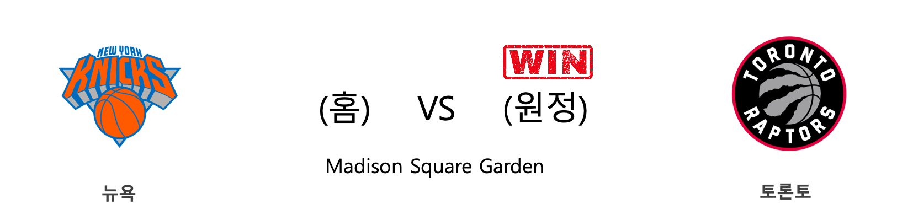

####  오클라호마씨티(홈) VS 애틀랜타(원정) 

<table class="tg">
  <tr>
    <th class="tg-rr9t">OKC</th>
    <th class="tg-rr9t">팀</th>
    <th class="tg-rr9t">ATL</th>
  </tr>
  <tr>
    <td class="tg-dcpn">1승 0패</td>
    <td class="tg-rr9t">시즌 상대전적</td>
    <td class="tg-dcpn">0승 1패</td>
  </tr>
  <tr>
    <td class="tg-dcpn">140</td>
    <td class="tg-rr9t">점수</td>
    <td class="tg-dcpn">111</td>
  </tr>
  <tr>
    <td class="tg-dcpn">36/61(59%)</td>
    <td class="tg-rr9t">2점(%)</td>
    <td class="tg-dcpn">31/56(55%)</td>
  </tr>
  <tr>
    <td class="tg-dcpn">14/25(56%)</td>
    <td class="tg-rr9t">3점(%)</td>
    <td class="tg-dcpn">11/36(31%)</td>
  </tr>
  <tr>
    <td class="tg-dcpn">26/34(76%)</td>
    <td class="tg-rr9t">자유투(%)</td>
    <td class="tg-dcpn">16/20(80%)</td>
  </tr>
  <tr>
    <td class="tg-dcpn">45</td>
    <td class="tg-rr9t">리바운드</td>
    <td class="tg-dcpn">37</td>
  </tr>
  <tr>
    <td class="tg-dcpn">28</td>
    <td class="tg-rr9t">어시스트</td>
    <td class="tg-dcpn">24</td>
  </tr>
  <tr>
    <td class="tg-dcpn">6</td>
    <td class="tg-rr9t">스틸</td>
    <td class="tg-dcpn">6</td>
  </tr>
  <tr>
    <td class="tg-dcpn">5</td>
    <td class="tg-rr9t">블록</td>
    <td class="tg-dcpn">7</td>
  </tr>
  <tr>
    <td class="tg-dcpn">14</td>
    <td class="tg-rr9t">턴오버</td>
    <td class="tg-dcpn">11</td>
  </tr>
  <tr>
    <td class="tg-dcpn">ChrisPaulG(18) DennisSchrode(21) DaniloGallina(25) ShaiGilgeous-(24)</td>
    <td class="tg-rr9t">주요 득점선수</td>
    <td class="tg-dcpn">JohnCollinsF(28) CamReddish(20) TraeYoungG(26)</td>
  </tr>
</table>

#### 경기 관련 주요 기사         

[[오늘의 NBA] (1/23) 자이언 윌리엄슨의 NBA 데뷔전](http://sports.news.naver.com/basketball/news/read.nhn?oid=486&aid=0000001205)

[[오늘의 NBA] (1/19) 르브론 제임스, 휴스턴을 저격하다!](http://sports.news.naver.com/basketball/news/read.nhn?oid=486&aid=0000001201)

[[오늘의 NBA] (1/21) 데미안 릴라드, 포틀랜드의 슈퍼스타](http://sports.news.naver.com/basketball/news/read.nhn?oid=486&aid=0000001203)

[[오늘의 NBA] (1/14) 샤이 길저스-알랙선더, 선배 러셀 웨스트브룩을 오마쥬하다](http://sports.news.naver.com/basketball/news/read.nhn?oid=486&aid=0000001196)

[[오늘의 NBA] (1/18) 애틀랜타의 AT&T 센터 던전 정복!](http://sports.news.naver.com/basketball/news/read.nhn?oid=486&aid=0000001200)

        
        

####  뉴올리언스(홈) VS 덴버(원정) 

<table class="tg">
  <tr>
    <th class="tg-rr9t">NOP</th>
    <th class="tg-rr9t">팀</th>
    <th class="tg-rr9t">DEN</th>
  </tr>
  <tr>
    <td class="tg-dcpn">2승 1패</td>
    <td class="tg-rr9t">시즌 상대전적</td>
    <td class="tg-dcpn">1승 2패</td>
  </tr>
  <tr>
    <td class="tg-dcpn">106</td>
    <td class="tg-rr9t">점수</td>
    <td class="tg-dcpn">113</td>
  </tr>
  <tr>
    <td class="tg-dcpn">26/55(47%)</td>
    <td class="tg-rr9t">2점(%)</td>
    <td class="tg-dcpn">27/65(42%)</td>
  </tr>
  <tr>
    <td class="tg-dcpn">12/27(44%)</td>
    <td class="tg-rr9t">3점(%)</td>
    <td class="tg-dcpn">13/41(32%)</td>
  </tr>
  <tr>
    <td class="tg-dcpn">18/30(60%)</td>
    <td class="tg-rr9t">자유투(%)</td>
    <td class="tg-dcpn">20/20(100%)</td>
  </tr>
  <tr>
    <td class="tg-dcpn">45</td>
    <td class="tg-rr9t">리바운드</td>
    <td class="tg-dcpn">56</td>
  </tr>
  <tr>
    <td class="tg-dcpn">24</td>
    <td class="tg-rr9t">어시스트</td>
    <td class="tg-dcpn">26</td>
  </tr>
  <tr>
    <td class="tg-dcpn">8</td>
    <td class="tg-rr9t">스틸</td>
    <td class="tg-dcpn">14</td>
  </tr>
  <tr>
    <td class="tg-dcpn">7</td>
    <td class="tg-rr9t">블록</td>
    <td class="tg-dcpn">6</td>
  </tr>
  <tr>
    <td class="tg-dcpn">17</td>
    <td class="tg-rr9t">턴오버</td>
    <td class="tg-dcpn">11</td>
  </tr>
  <tr>
    <td class="tg-dcpn">ZionWilliamso(15) JoshHart(15) JJRedick(18)</td>
    <td class="tg-rr9t">주요 득점선수</td>
    <td class="tg-dcpn">NikolaJokicC(27) MichaelPorter(15) TorreyCraigF(15)</td>
  </tr>
</table>

#### 경기 관련 주요 기사         

[[오늘의 NBA] (1/21) 데미안 릴라드, 포틀랜드의 슈퍼스타](http://sports.news.naver.com/basketball/news/read.nhn?oid=486&aid=0000001203)

[[오늘의 NBA] (1/25) 러셀 웨스트브룩의 '마이 웨이'](http://sports.news.naver.com/basketball/news/read.nhn?oid=486&aid=0000001207)

[[오늘의 NBA] (1/11) 멤피스, 서부컨퍼런스 8위 등극](http://sports.news.naver.com/basketball/news/read.nhn?oid=486&aid=0000001193)

[[오늘의 NBA] (1/12) 레이커스, "No LBJ, No AD, No Problem!"](http://sports.news.naver.com/basketball/news/read.nhn?oid=486&aid=0000001194)

[[오늘의 NBA] (1/23) 자이언 윌리엄슨의 NBA 데뷔전](http://sports.news.naver.com/basketball/news/read.nhn?oid=486&aid=0000001205)

        
        

####  골든스테이트(홈) VS 인디애나(원정) 

<table class="tg">
  <tr>
    <th class="tg-rr9t">GSW</th>
    <th class="tg-rr9t">팀</th>
    <th class="tg-rr9t">IND</th>
  </tr>
  <tr>
    <td class="tg-dcpn">0승 1패</td>
    <td class="tg-rr9t">시즌 상대전적</td>
    <td class="tg-dcpn">1승 0패</td>
  </tr>
  <tr>
    <td class="tg-dcpn">118</td>
    <td class="tg-rr9t">점수</td>
    <td class="tg-dcpn">129</td>
  </tr>
  <tr>
    <td class="tg-dcpn">21/43(49%)</td>
    <td class="tg-rr9t">2점(%)</td>
    <td class="tg-dcpn">33/59(56%)</td>
  </tr>
  <tr>
    <td class="tg-dcpn">19/39(49%)</td>
    <td class="tg-rr9t">3점(%)</td>
    <td class="tg-dcpn">17/28(61%)</td>
  </tr>
  <tr>
    <td class="tg-dcpn">19/23(83%)</td>
    <td class="tg-rr9t">자유투(%)</td>
    <td class="tg-dcpn">12/13(92%)</td>
  </tr>
  <tr>
    <td class="tg-dcpn">38</td>
    <td class="tg-rr9t">리바운드</td>
    <td class="tg-dcpn">36</td>
  </tr>
  <tr>
    <td class="tg-dcpn">31</td>
    <td class="tg-rr9t">어시스트</td>
    <td class="tg-dcpn">35</td>
  </tr>
  <tr>
    <td class="tg-dcpn">6</td>
    <td class="tg-rr9t">스틸</td>
    <td class="tg-dcpn">15</td>
  </tr>
  <tr>
    <td class="tg-dcpn">3</td>
    <td class="tg-rr9t">블록</td>
    <td class="tg-dcpn">4</td>
  </tr>
  <tr>
    <td class="tg-dcpn">20</td>
    <td class="tg-rr9t">턴오버</td>
    <td class="tg-dcpn">10</td>
  </tr>
  <tr>
    <td class="tg-dcpn">GlennRobinson(18) D'AngeloRusse(37)</td>
    <td class="tg-rr9t">주요 득점선수</td>
    <td class="tg-dcpn">DougMcDermott(24) T.J.WarrenF(33) DomantasSabon(16) JeremyLambG(16)</td>
  </tr>
</table>

#### 경기 관련 주요 기사         

[[오늘의 NBA] (1/21) 데미안 릴라드, 포틀랜드의 슈퍼스타](http://sports.news.naver.com/basketball/news/read.nhn?oid=486&aid=0000001203)

[[오늘의 NBA] (1/7) ORL 마켈 펄츠의 커리어 나이트](http://sports.news.naver.com/basketball/news/read.nhn?oid=486&aid=0000001189)

[[오늘의 NBA] (1/5) 제이슨 테이텀, 보스턴의 밀당남](http://sports.news.naver.com/basketball/news/read.nhn?oid=486&aid=0000001187)

[[오늘의 NBA] (1/3) 마이클 포터 주니어, 덴버의 기다림에 응답하다!](http://sports.news.naver.com/basketball/news/read.nhn?oid=486&aid=0000001185)

[[오늘의 NBA] (1/1) 휴스턴의 불장난](http://sports.news.naver.com/basketball/news/read.nhn?oid=486&aid=0000001183)

        
        

####  디트로이트(홈) VS 멤피스(원정) 

<table class="tg">
  <tr>
    <th class="tg-rr9t">DET</th>
    <th class="tg-rr9t">팀</th>
    <th class="tg-rr9t">MEM</th>
  </tr>
  <tr>
    <td class="tg-dcpn">0승 1패</td>
    <td class="tg-rr9t">시즌 상대전적</td>
    <td class="tg-dcpn">1승 0패</td>
  </tr>
  <tr>
    <td class="tg-dcpn">112</td>
    <td class="tg-rr9t">점수</td>
    <td class="tg-dcpn">125</td>
  </tr>
  <tr>
    <td class="tg-dcpn">28/59(47%)</td>
    <td class="tg-rr9t">2점(%)</td>
    <td class="tg-dcpn">32/57(56%)</td>
  </tr>
  <tr>
    <td class="tg-dcpn">11/32(34%)</td>
    <td class="tg-rr9t">3점(%)</td>
    <td class="tg-dcpn">11/22(50%)</td>
  </tr>
  <tr>
    <td class="tg-dcpn">23/31(74%)</td>
    <td class="tg-rr9t">자유투(%)</td>
    <td class="tg-dcpn">28/31(90%)</td>
  </tr>
  <tr>
    <td class="tg-dcpn">37</td>
    <td class="tg-rr9t">리바운드</td>
    <td class="tg-dcpn">49</td>
  </tr>
  <tr>
    <td class="tg-dcpn">23</td>
    <td class="tg-rr9t">어시스트</td>
    <td class="tg-dcpn">27</td>
  </tr>
  <tr>
    <td class="tg-dcpn">8</td>
    <td class="tg-rr9t">스틸</td>
    <td class="tg-dcpn">6</td>
  </tr>
  <tr>
    <td class="tg-dcpn">1</td>
    <td class="tg-rr9t">블록</td>
    <td class="tg-dcpn">4</td>
  </tr>
  <tr>
    <td class="tg-dcpn">7</td>
    <td class="tg-rr9t">턴오버</td>
    <td class="tg-dcpn">14</td>
  </tr>
  <tr>
    <td class="tg-dcpn">ChristianWood(20) DerrickRoseG(22)</td>
    <td class="tg-rr9t">주요 득점선수</td>
    <td class="tg-dcpn">JarenJacksonJ(29) BrandonClarke(15) JaMorantG(16) DillonBrooksG(27)</td>
  </tr>
</table>

#### 경기 관련 주요 기사         

[[오늘의 NBA] (1/25) 러셀 웨스트브룩의 '마이 웨이'](http://sports.news.naver.com/basketball/news/read.nhn?oid=486&aid=0000001207)

[[오늘의 NBA] (1/23) 자이언 윌리엄슨의 NBA 데뷔전](http://sports.news.naver.com/basketball/news/read.nhn?oid=486&aid=0000001205)

[[오늘의 NBA] (12/24) 자말 머레이와 데빈 부커의 뒤틀린 운명](http://sports.news.naver.com/basketball/news/read.nhn?oid=486&aid=0000001176)

[[오늘의 NBA] (12/29) 마이애미, 연장전 승부 전문가](http://sports.news.naver.com/basketball/news/read.nhn?oid=486&aid=0000001180)

[[오늘의 NBA] (12/15) 밤 아데바요, 연장전의 지배자](http://sports.news.naver.com/basketball/news/read.nhn?oid=486&aid=0000001167)

        
        

####  샌안토니오(홈) VS 피닉스(원정) 

<table class="tg">
  <tr>
    <th class="tg-rr9t">SAS</th>
    <th class="tg-rr9t">팀</th>
    <th class="tg-rr9t">PHX</th>
  </tr>
  <tr>
    <td class="tg-dcpn">2승 1패</td>
    <td class="tg-rr9t">시즌 상대전적</td>
    <td class="tg-dcpn">1승 2패</td>
  </tr>
  <tr>
    <td class="tg-dcpn">99</td>
    <td class="tg-rr9t">점수</td>
    <td class="tg-dcpn">103</td>
  </tr>
  <tr>
    <td class="tg-dcpn">28/53(53%)</td>
    <td class="tg-rr9t">2점(%)</td>
    <td class="tg-dcpn">31/55(56%)</td>
  </tr>
  <tr>
    <td class="tg-dcpn">5/25(20%)</td>
    <td class="tg-rr9t">3점(%)</td>
    <td class="tg-dcpn">8/29(28%)</td>
  </tr>
  <tr>
    <td class="tg-dcpn">28/33(85%)</td>
    <td class="tg-rr9t">자유투(%)</td>
    <td class="tg-dcpn">17/21(81%)</td>
  </tr>
  <tr>
    <td class="tg-dcpn">43</td>
    <td class="tg-rr9t">리바운드</td>
    <td class="tg-dcpn">42</td>
  </tr>
  <tr>
    <td class="tg-dcpn">19</td>
    <td class="tg-rr9t">어시스트</td>
    <td class="tg-dcpn">25</td>
  </tr>
  <tr>
    <td class="tg-dcpn">9</td>
    <td class="tg-rr9t">스틸</td>
    <td class="tg-dcpn">6</td>
  </tr>
  <tr>
    <td class="tg-dcpn">8</td>
    <td class="tg-rr9t">블록</td>
    <td class="tg-dcpn">4</td>
  </tr>
  <tr>
    <td class="tg-dcpn">14</td>
    <td class="tg-rr9t">턴오버</td>
    <td class="tg-dcpn">13</td>
  </tr>
  <tr>
    <td class="tg-dcpn">DeMarDeRozanF(30) LaMarcusAldri(16)</td>
    <td class="tg-rr9t">주요 득점선수</td>
    <td class="tg-dcpn">KellyOubreJr.(16) DevinBookerG(35) DarioSaricF(20)</td>
  </tr>
</table>

#### 경기 관련 주요 기사         

[[오늘의 NBA] (12/15) 밤 아데바요, 연장전의 지배자](http://sports.news.naver.com/basketball/news/read.nhn?oid=486&aid=0000001167)

[[오늘의 NBA] (1/25) 러셀 웨스트브룩의 '마이 웨이'](http://sports.news.naver.com/basketball/news/read.nhn?oid=486&aid=0000001207)

[[오늘의 NBA] (1/13) 더마 드로잔, 1년간 기다렸던 복수극](http://sports.news.naver.com/basketball/news/read.nhn?oid=486&aid=0000001195)

[[오늘의 NBA] (1/9) 그렉 포포비치 감독의 보스턴 수비 인수분해](http://sports.news.naver.com/basketball/news/read.nhn?oid=486&aid=0000001191)

[[오늘의 NBA] (1/11) 멤피스, 서부컨퍼런스 8위 등극](http://sports.news.naver.com/basketball/news/read.nhn?oid=486&aid=0000001193)

        
        

####  샬럿(홈) VS 밀워키(원정) 

<table class="tg">
  <tr>
    <th class="tg-rr9t">CHA</th>
    <th class="tg-rr9t">팀</th>
    <th class="tg-rr9t">MIL</th>
  </tr>
  <tr>
    <td class="tg-dcpn">0승 2패</td>
    <td class="tg-rr9t">시즌 상대전적</td>
    <td class="tg-dcpn">2승 0패</td>
  </tr>
  <tr>
    <td class="tg-dcpn">103</td>
    <td class="tg-rr9t">점수</td>
    <td class="tg-dcpn">116</td>
  </tr>
  <tr>
    <td class="tg-dcpn">18/47(38%)</td>
    <td class="tg-rr9t">2점(%)</td>
    <td class="tg-dcpn">34/51(67%)</td>
  </tr>
  <tr>
    <td class="tg-dcpn">14/39(36%)</td>
    <td class="tg-rr9t">3점(%)</td>
    <td class="tg-dcpn">10/36(28%)</td>
  </tr>
  <tr>
    <td class="tg-dcpn">25/30(83%)</td>
    <td class="tg-rr9t">자유투(%)</td>
    <td class="tg-dcpn">18/24(75%)</td>
  </tr>
  <tr>
    <td class="tg-dcpn">39</td>
    <td class="tg-rr9t">리바운드</td>
    <td class="tg-dcpn">53</td>
  </tr>
  <tr>
    <td class="tg-dcpn">24</td>
    <td class="tg-rr9t">어시스트</td>
    <td class="tg-dcpn">26</td>
  </tr>
  <tr>
    <td class="tg-dcpn">6</td>
    <td class="tg-rr9t">스틸</td>
    <td class="tg-dcpn">8</td>
  </tr>
  <tr>
    <td class="tg-dcpn">4</td>
    <td class="tg-rr9t">블록</td>
    <td class="tg-dcpn">9</td>
  </tr>
  <tr>
    <td class="tg-dcpn">13</td>
    <td class="tg-rr9t">턴오버</td>
    <td class="tg-dcpn">15</td>
  </tr>
  <tr>
    <td class="tg-dcpn">Devonte'Graha(19) MarvinWilliam(18) MalikMonk(31)</td>
    <td class="tg-rr9t">주요 득점선수</td>
    <td class="tg-dcpn">GiannisAnteto(30) EricBledsoeG(20) GeorgeHill(16)</td>
  </tr>
</table>

#### 경기 관련 주요 기사         

[[오늘의 NBA] (1/25) 러셀 웨스트브룩의 '마이 웨이'](http://sports.news.naver.com/basketball/news/read.nhn?oid=486&aid=0000001207)

[[오늘의 NBA] (1/5) 제이슨 테이텀, 보스턴의 밀당남](http://sports.news.naver.com/basketball/news/read.nhn?oid=486&aid=0000001187)

[[오늘의 NBA] (1/12) 레이커스, "No LBJ, No AD, No Problem!"](http://sports.news.naver.com/basketball/news/read.nhn?oid=486&aid=0000001194)

[[오늘의 NBA] (1/16) 올랜도, 난적 LA 레이커스를 제압하다](http://sports.news.naver.com/basketball/news/read.nhn?oid=486&aid=0000001198)

[[오늘의 NBA] (1/11) 멤피스, 서부컨퍼런스 8위 등극](http://sports.news.naver.com/basketball/news/read.nhn?oid=486&aid=0000001193)

        
        

####  미네소타(홈) VS 휴스턴(원정) 

<table class="tg">
  <tr>
    <th class="tg-rr9t">MIN</th>
    <th class="tg-rr9t">팀</th>
    <th class="tg-rr9t">HOU</th>
  </tr>
  <tr>
    <td class="tg-dcpn">0승 2패</td>
    <td class="tg-rr9t">시즌 상대전적</td>
    <td class="tg-dcpn">2승 0패</td>
  </tr>
  <tr>
    <td class="tg-dcpn">124</td>
    <td class="tg-rr9t">점수</td>
    <td class="tg-dcpn">131</td>
  </tr>
  <tr>
    <td class="tg-dcpn">37/66(56%)</td>
    <td class="tg-rr9t">2점(%)</td>
    <td class="tg-dcpn">36/59(61%)</td>
  </tr>
  <tr>
    <td class="tg-dcpn">11/32(34%)</td>
    <td class="tg-rr9t">3점(%)</td>
    <td class="tg-dcpn">11/32(34%)</td>
  </tr>
  <tr>
    <td class="tg-dcpn">17/20(85%)</td>
    <td class="tg-rr9t">자유투(%)</td>
    <td class="tg-dcpn">26/31(84%)</td>
  </tr>
  <tr>
    <td class="tg-dcpn">52</td>
    <td class="tg-rr9t">리바운드</td>
    <td class="tg-dcpn">34</td>
  </tr>
  <tr>
    <td class="tg-dcpn">28</td>
    <td class="tg-rr9t">어시스트</td>
    <td class="tg-dcpn">24</td>
  </tr>
  <tr>
    <td class="tg-dcpn">7</td>
    <td class="tg-rr9t">스틸</td>
    <td class="tg-dcpn">11</td>
  </tr>
  <tr>
    <td class="tg-dcpn">8</td>
    <td class="tg-rr9t">블록</td>
    <td class="tg-dcpn">9</td>
  </tr>
  <tr>
    <td class="tg-dcpn">17</td>
    <td class="tg-rr9t">턴오버</td>
    <td class="tg-dcpn">10</td>
  </tr>
  <tr>
    <td class="tg-dcpn">Karl-AnthonyT(30) JoshOkogieG(17) AndrewWiggins(28)</td>
    <td class="tg-rr9t">주요 득점선수</td>
    <td class="tg-dcpn">EricGordon(27) ClintCapelaC(18) RussellWestbr(45) AustinRivers(16)</td>
  </tr>
</table>

#### 경기 관련 주요 기사         

        
        

####  마이애미(홈) VS LA클리퍼스(원정) 

<table class="tg">
  <tr>
    <th class="tg-rr9t">MIA</th>
    <th class="tg-rr9t">팀</th>
    <th class="tg-rr9t">LAC</th>
  </tr>
  <tr>
    <td class="tg-dcpn">0승 1패</td>
    <td class="tg-rr9t">시즌 상대전적</td>
    <td class="tg-dcpn">1승 0패</td>
  </tr>
  <tr>
    <td class="tg-dcpn">117</td>
    <td class="tg-rr9t">점수</td>
    <td class="tg-dcpn">122</td>
  </tr>
  <tr>
    <td class="tg-dcpn">27/49(55%)</td>
    <td class="tg-rr9t">2점(%)</td>
    <td class="tg-dcpn">27/59(46%)</td>
  </tr>
  <tr>
    <td class="tg-dcpn">13/44(30%)</td>
    <td class="tg-rr9t">3점(%)</td>
    <td class="tg-dcpn">16/35(46%)</td>
  </tr>
  <tr>
    <td class="tg-dcpn">24/29(83%)</td>
    <td class="tg-rr9t">자유투(%)</td>
    <td class="tg-dcpn">20/23(87%)</td>
  </tr>
  <tr>
    <td class="tg-dcpn">45</td>
    <td class="tg-rr9t">리바운드</td>
    <td class="tg-dcpn">48</td>
  </tr>
  <tr>
    <td class="tg-dcpn">25</td>
    <td class="tg-rr9t">어시스트</td>
    <td class="tg-dcpn">33</td>
  </tr>
  <tr>
    <td class="tg-dcpn">4</td>
    <td class="tg-rr9t">스틸</td>
    <td class="tg-dcpn">5</td>
  </tr>
  <tr>
    <td class="tg-dcpn">4</td>
    <td class="tg-rr9t">블록</td>
    <td class="tg-dcpn">3</td>
  </tr>
  <tr>
    <td class="tg-dcpn">9</td>
    <td class="tg-rr9t">턴오버</td>
    <td class="tg-dcpn">8</td>
  </tr>
  <tr>
    <td class="tg-dcpn">KellyOlynyk(19) DuncanRobinso(16) TylerHerroG(19) JimmyButlerF(20) BamAdebayoF(18)</td>
    <td class="tg-rr9t">주요 득점선수</td>
    <td class="tg-dcpn">LouWilliams(16) LandryShametG(22) KawhiLeonardF(33) MontrezlHarre(15)</td>
  </tr>
</table>

#### 경기 관련 주요 기사         

[[오늘의 NBA] (1/11) 멤피스, 서부컨퍼런스 8위 등극](http://sports.news.naver.com/basketball/news/read.nhn?oid=486&aid=0000001193)

[[오늘의 NBA] (1/17) 브랜든 잉그램 vs 도노반 미첼, 1월의 명승부](http://sports.news.naver.com/basketball/news/read.nhn?oid=486&aid=0000001199)

[[오늘의 NBA] (1/13) 더마 드로잔, 1년간 기다렸던 복수극](http://sports.news.naver.com/basketball/news/read.nhn?oid=486&aid=0000001195)

[[오늘의 NBA] (1/19) 르브론 제임스, 휴스턴을 저격하다!](http://sports.news.naver.com/basketball/news/read.nhn?oid=486&aid=0000001201)

[[오늘의 NBA] (1/25) 러셀 웨스트브룩의 '마이 웨이'](http://sports.news.naver.com/basketball/news/read.nhn?oid=486&aid=0000001207)

        
        

####  올랜도(홈) VS 보스턴(원정) 

<table class="tg">
  <tr>
    <th class="tg-rr9t">ORL</th>
    <th class="tg-rr9t">팀</th>
    <th class="tg-rr9t">BOS</th>
  </tr>
  <tr>
    <td class="tg-dcpn">0승 1패</td>
    <td class="tg-rr9t">시즌 상대전적</td>
    <td class="tg-dcpn">1승 0패</td>
  </tr>
  <tr>
    <td class="tg-dcpn">98</td>
    <td class="tg-rr9t">점수</td>
    <td class="tg-dcpn">109</td>
  </tr>
  <tr>
    <td class="tg-dcpn">24/53(45%)</td>
    <td class="tg-rr9t">2점(%)</td>
    <td class="tg-dcpn">26/51(51%)</td>
  </tr>
  <tr>
    <td class="tg-dcpn">12/37(32%)</td>
    <td class="tg-rr9t">3점(%)</td>
    <td class="tg-dcpn">14/35(40%)</td>
  </tr>
  <tr>
    <td class="tg-dcpn">14/19(74%)</td>
    <td class="tg-rr9t">자유투(%)</td>
    <td class="tg-dcpn">15/18(83%)</td>
  </tr>
  <tr>
    <td class="tg-dcpn">46</td>
    <td class="tg-rr9t">리바운드</td>
    <td class="tg-dcpn">44</td>
  </tr>
  <tr>
    <td class="tg-dcpn">18</td>
    <td class="tg-rr9t">어시스트</td>
    <td class="tg-dcpn">27</td>
  </tr>
  <tr>
    <td class="tg-dcpn">5</td>
    <td class="tg-rr9t">스틸</td>
    <td class="tg-dcpn">10</td>
  </tr>
  <tr>
    <td class="tg-dcpn">1</td>
    <td class="tg-rr9t">블록</td>
    <td class="tg-dcpn">7</td>
  </tr>
  <tr>
    <td class="tg-dcpn">14</td>
    <td class="tg-rr9t">턴오버</td>
    <td class="tg-dcpn">13</td>
  </tr>
  <tr>
    <td class="tg-dcpn">NikolaVucevic(17) EvanFournierG(30)</td>
    <td class="tg-rr9t">주요 득점선수</td>
    <td class="tg-dcpn">DanielTheisC(16) GordonHayward(22) KembaWalkerG(37)</td>
  </tr>
</table>

#### 경기 관련 주요 기사         

[[오늘의 NBA] (1/5) 제이슨 테이텀, 보스턴의 밀당남](http://sports.news.naver.com/basketball/news/read.nhn?oid=486&aid=0000001187)

[[오늘의 NBA] (1/21) 데미안 릴라드, 포틀랜드의 슈퍼스타](http://sports.news.naver.com/basketball/news/read.nhn?oid=486&aid=0000001203)

[[오늘의 NBA] (1/7) ORL 마켈 펄츠의 커리어 나이트](http://sports.news.naver.com/basketball/news/read.nhn?oid=486&aid=0000001189)

[[오늘의 NBA] (1/25) 러셀 웨스트브룩의 '마이 웨이'](http://sports.news.naver.com/basketball/news/read.nhn?oid=486&aid=0000001207)

[[오늘의 NBA] (1/19) 르브론 제임스, 휴스턴을 저격하다!](http://sports.news.naver.com/basketball/news/read.nhn?oid=486&aid=0000001201)

        
        

####  시카고(홈) VS 새크라멘토(원정) 

<table class="tg">
  <tr>
    <th class="tg-rr9t">CHI</th>
    <th class="tg-rr9t">팀</th>
    <th class="tg-rr9t">SAC</th>
  </tr>
  <tr>
    <td class="tg-dcpn">1승 1패</td>
    <td class="tg-rr9t">시즌 상대전적</td>
    <td class="tg-dcpn">1승 1패</td>
  </tr>
  <tr>
    <td class="tg-dcpn">81</td>
    <td class="tg-rr9t">점수</td>
    <td class="tg-dcpn">98</td>
  </tr>
  <tr>
    <td class="tg-dcpn">23/42(55%)</td>
    <td class="tg-rr9t">2점(%)</td>
    <td class="tg-dcpn">25/49(51%)</td>
  </tr>
  <tr>
    <td class="tg-dcpn">8/37(22%)</td>
    <td class="tg-rr9t">3점(%)</td>
    <td class="tg-dcpn">10/32(31%)</td>
  </tr>
  <tr>
    <td class="tg-dcpn">11/14(79%)</td>
    <td class="tg-rr9t">자유투(%)</td>
    <td class="tg-dcpn">18/21(86%)</td>
  </tr>
  <tr>
    <td class="tg-dcpn">43</td>
    <td class="tg-rr9t">리바운드</td>
    <td class="tg-dcpn">42</td>
  </tr>
  <tr>
    <td class="tg-dcpn">23</td>
    <td class="tg-rr9t">어시스트</td>
    <td class="tg-dcpn">24</td>
  </tr>
  <tr>
    <td class="tg-dcpn">6</td>
    <td class="tg-rr9t">스틸</td>
    <td class="tg-dcpn">8</td>
  </tr>
  <tr>
    <td class="tg-dcpn">4</td>
    <td class="tg-rr9t">블록</td>
    <td class="tg-dcpn">8</td>
  </tr>
  <tr>
    <td class="tg-dcpn">19</td>
    <td class="tg-rr9t">턴오버</td>
    <td class="tg-dcpn">13</td>
  </tr>
  <tr>
    <td class="tg-dcpn">ZachLaVineG(21)</td>
    <td class="tg-rr9t">주요 득점선수</td>
    <td class="tg-dcpn">HarrisonBarne(19) De'AaronFoxG(18) BuddyHield(21)</td>
  </tr>
</table>

#### 경기 관련 주요 기사         

[[오늘의 NBA] (1/21) 데미안 릴라드, 포틀랜드의 슈퍼스타](http://sports.news.naver.com/basketball/news/read.nhn?oid=486&aid=0000001203)

[[오늘의 NBA] (1/19) 르브론 제임스, 휴스턴을 저격하다!](http://sports.news.naver.com/basketball/news/read.nhn?oid=486&aid=0000001201)

[[오늘의 NBA] (1/7) ORL 마켈 펄츠의 커리어 나이트](http://sports.news.naver.com/basketball/news/read.nhn?oid=486&aid=0000001189)

[[오늘의 NBA] (1/23) 자이언 윌리엄슨의 NBA 데뷔전](http://sports.news.naver.com/basketball/news/read.nhn?oid=486&aid=0000001205)

[[오늘의 NBA] (1/25) 러셀 웨스트브룩의 '마이 웨이'](http://sports.news.naver.com/basketball/news/read.nhn?oid=486&aid=0000001207)

        
        

####  뉴욕(홈) VS 토론토(원정) 

<table class="tg">
  <tr>
    <th class="tg-rr9t">NYK</th>
    <th class="tg-rr9t">팀</th>
    <th class="tg-rr9t">TOR</th>
  </tr>
  <tr>
    <td class="tg-dcpn">0승 2패</td>
    <td class="tg-rr9t">시즌 상대전적</td>
    <td class="tg-dcpn">2승 0패</td>
  </tr>
  <tr>
    <td class="tg-dcpn">112</td>
    <td class="tg-rr9t">점수</td>
    <td class="tg-dcpn">118</td>
  </tr>
  <tr>
    <td class="tg-dcpn">29/49(59%)</td>
    <td class="tg-rr9t">2점(%)</td>
    <td class="tg-dcpn">24/46(52%)</td>
  </tr>
  <tr>
    <td class="tg-dcpn">13/36(36%)</td>
    <td class="tg-rr9t">3점(%)</td>
    <td class="tg-dcpn">17/35(49%)</td>
  </tr>
  <tr>
    <td class="tg-dcpn">15/21(71%)</td>
    <td class="tg-rr9t">자유투(%)</td>
    <td class="tg-dcpn">19/23(83%)</td>
  </tr>
  <tr>
    <td class="tg-dcpn">46</td>
    <td class="tg-rr9t">리바운드</td>
    <td class="tg-dcpn">31</td>
  </tr>
  <tr>
    <td class="tg-dcpn">26</td>
    <td class="tg-rr9t">어시스트</td>
    <td class="tg-dcpn">25</td>
  </tr>
  <tr>
    <td class="tg-dcpn">5</td>
    <td class="tg-rr9t">스틸</td>
    <td class="tg-dcpn">10</td>
  </tr>
  <tr>
    <td class="tg-dcpn">4</td>
    <td class="tg-rr9t">블록</td>
    <td class="tg-dcpn">6</td>
  </tr>
  <tr>
    <td class="tg-dcpn">14</td>
    <td class="tg-rr9t">턴오버</td>
    <td class="tg-dcpn">7</td>
  </tr>
  <tr>
    <td class="tg-dcpn">MarcusMorrisS(21) JuliusRandleF(20) DamyeanDotson(21)</td>
    <td class="tg-rr9t">주요 득점선수</td>
    <td class="tg-dcpn">KyleLowryG(26) FredVanVleetG(16) PascalSiakamF(23) NormanPowell(16)</td>
  </tr>
</table>

#### 경기 관련 주요 기사         

[[오늘의 NBA] (1/23) 자이언 윌리엄슨의 NBA 데뷔전](http://sports.news.naver.com/basketball/news/read.nhn?oid=486&aid=0000001205)

[[오늘의 NBA] (12/21) 크리스탑스 포르징기스, 댈러스의 새로운 버팀목](http://sports.news.naver.com/basketball/news/read.nhn?oid=486&aid=0000001173)

[[오늘의 NBA] (1/19) 르브론 제임스, 휴스턴을 저격하다!](http://sports.news.naver.com/basketball/news/read.nhn?oid=486&aid=0000001201)

[[오늘의 NBA] (1/9) 그렉 포포비치 감독의 보스턴 수비 인수분해](http://sports.news.naver.com/basketball/news/read.nhn?oid=486&aid=0000001191)

[[오늘의 NBA] (1/25) 러셀 웨스트브룩의 '마이 웨이'](http://sports.news.naver.com/basketball/news/read.nhn?oid=486&aid=0000001207)

        
        

#### 리그 (Eastern) 순위
    

<table class="tg">
  <tr>
    <th class="tg-d14o">순위</th>
    <th class="tg-d14o">팀명</th>
    <th class="tg-d14o">경기수</th>
    <th class="tg-d14o">승</th>
    <th class="tg-d14o">패</th>
    <th class="tg-d14o">승차</th>
    <th class="tg-d14o">승률</th>
  </tr>
  
<tr>
    <td class="tg-50j8">1</td>
    <td class="tg-50j8">MIL</td>
    <td class="tg-50j8">44</td>
    <td class="tg-50j8">38</td>
    <td class="tg-50j8">6</td>
    <td class="tg-50j8">0</td>
    <td class="tg-50j8">0.864</td>
</tr>

<tr>
    <td class="tg-50j8">2</td>
    <td class="tg-50j8">MIA</td>
    <td class="tg-50j8">44</td>
    <td class="tg-50j8">31</td>
    <td class="tg-50j8">13</td>
    <td class="tg-50j8">7</td>
    <td class="tg-50j8">0.705</td>
</tr>

<tr>
    <td class="tg-50j8">3</td>
    <td class="tg-50j8">TOR</td>
    <td class="tg-50j8">45</td>
    <td class="tg-50j8">31</td>
    <td class="tg-50j8">14</td>
    <td class="tg-50j8">7</td>
    <td class="tg-50j8">0.689</td>
</tr>

<tr>
    <td class="tg-50j8">4</td>
    <td class="tg-50j8">IND</td>
    <td class="tg-50j8">46</td>
    <td class="tg-50j8">30</td>
    <td class="tg-50j8">16</td>
    <td class="tg-50j8">8</td>
    <td class="tg-50j8">0.652</td>
</tr>

<tr>
    <td class="tg-50j8">5</td>
    <td class="tg-50j8">BOS</td>
    <td class="tg-50j8">42</td>
    <td class="tg-50j8">29</td>
    <td class="tg-50j8">13</td>
    <td class="tg-50j8">9</td>
    <td class="tg-50j8">0.69</td>
</tr>

<tr>
    <td class="tg-50j8">6</td>
    <td class="tg-50j8">PHI</td>
    <td class="tg-50j8">44</td>
    <td class="tg-50j8">28</td>
    <td class="tg-50j8">16</td>
    <td class="tg-50j8">10</td>
    <td class="tg-50j8">0.636</td>
</tr>

<tr>
    <td class="tg-50j8">7</td>
    <td class="tg-50j8">ORL</td>
    <td class="tg-50j8">45</td>
    <td class="tg-50j8">21</td>
    <td class="tg-50j8">24</td>
    <td class="tg-50j8">17</td>
    <td class="tg-50j8">0.467</td>
</tr>

<tr>
    <td class="tg-50j8">8</td>
    <td class="tg-50j8">BKN</td>
    <td class="tg-50j8">42</td>
    <td class="tg-50j8">18</td>
    <td class="tg-50j8">24</td>
    <td class="tg-50j8">20</td>
    <td class="tg-50j8">0.429</td>
</tr>

<tr>
    <td class="tg-50j8">9</td>
    <td class="tg-50j8">DET</td>
    <td class="tg-50j8">43</td>
    <td class="tg-50j8">17</td>
    <td class="tg-50j8">26</td>
    <td class="tg-50j8">21</td>
    <td class="tg-50j8">0.395</td>
</tr>

<tr>
    <td class="tg-50j8">10</td>
    <td class="tg-50j8">CHI</td>
    <td class="tg-50j8">45</td>
    <td class="tg-50j8">16</td>
    <td class="tg-50j8">29</td>
    <td class="tg-50j8">22</td>
    <td class="tg-50j8">0.356</td>
</tr>

<tr>
    <td class="tg-50j8">11</td>
    <td class="tg-50j8">CHA</td>
    <td class="tg-50j8">46</td>
    <td class="tg-50j8">15</td>
    <td class="tg-50j8">31</td>
    <td class="tg-50j8">23</td>
    <td class="tg-50j8">0.326</td>
</tr>

<tr>
    <td class="tg-50j8">12</td>
    <td class="tg-50j8">WAS</td>
    <td class="tg-50j8">43</td>
    <td class="tg-50j8">14</td>
    <td class="tg-50j8">29</td>
    <td class="tg-50j8">24</td>
    <td class="tg-50j8">0.326</td>
</tr>

<tr>
    <td class="tg-50j8">13</td>
    <td class="tg-50j8">NYK</td>
    <td class="tg-50j8">46</td>
    <td class="tg-50j8">12</td>
    <td class="tg-50j8">34</td>
    <td class="tg-50j8">26</td>
    <td class="tg-50j8">0.261</td>
</tr>

<tr>
    <td class="tg-50j8">14</td>
    <td class="tg-50j8">CLE</td>
    <td class="tg-50j8">43</td>
    <td class="tg-50j8">10</td>
    <td class="tg-50j8">33</td>
    <td class="tg-50j8">28</td>
    <td class="tg-50j8">0.233</td>
</tr>

<tr>
    <td class="tg-50j8">15</td>
    <td class="tg-50j8">ATL</td>
    <td class="tg-50j8">45</td>
    <td class="tg-50j8">10</td>
    <td class="tg-50j8">35</td>
    <td class="tg-50j8">28</td>
    <td class="tg-50j8">0.222</td>
</tr>
</table> 
#### 리그 (Western) 순위
    

<table class="tg">
  <tr>
    <th class="tg-d14o">순위</th>
    <th class="tg-d14o">팀명</th>
    <th class="tg-d14o">경기수</th>
    <th class="tg-d14o">승</th>
    <th class="tg-d14o">패</th>
    <th class="tg-d14o">승차</th>
    <th class="tg-d14o">승률</th>
  </tr>
  
<tr>
    <td class="tg-50j8">1</td>
    <td class="tg-50j8">LAL</td>
    <td class="tg-50j8">44</td>
    <td class="tg-50j8">35</td>
    <td class="tg-50j8">9</td>
    <td class="tg-50j8">3</td>
    <td class="tg-50j8">0.795</td>
</tr>

<tr>
    <td class="tg-50j8">2</td>
    <td class="tg-50j8">LAC</td>
    <td class="tg-50j8">46</td>
    <td class="tg-50j8">32</td>
    <td class="tg-50j8">14</td>
    <td class="tg-50j8">6</td>
    <td class="tg-50j8">0.696</td>
</tr>

<tr>
    <td class="tg-50j8">3</td>
    <td class="tg-50j8">UTA</td>
    <td class="tg-50j8">43</td>
    <td class="tg-50j8">30</td>
    <td class="tg-50j8">13</td>
    <td class="tg-50j8">8</td>
    <td class="tg-50j8">0.698</td>
</tr>

<tr>
    <td class="tg-50j8">3</td>
    <td class="tg-50j8">DEN</td>
    <td class="tg-50j8">43</td>
    <td class="tg-50j8">30</td>
    <td class="tg-50j8">13</td>
    <td class="tg-50j8">8</td>
    <td class="tg-50j8">0.698</td>
</tr>

<tr>
    <td class="tg-50j8">5</td>
    <td class="tg-50j8">HOU</td>
    <td class="tg-50j8">43</td>
    <td class="tg-50j8">27</td>
    <td class="tg-50j8">16</td>
    <td class="tg-50j8">11</td>
    <td class="tg-50j8">0.628</td>
</tr>

<tr>
    <td class="tg-50j8">6</td>
    <td class="tg-50j8">OKC</td>
    <td class="tg-50j8">45</td>
    <td class="tg-50j8">27</td>
    <td class="tg-50j8">18</td>
    <td class="tg-50j8">11</td>
    <td class="tg-50j8">0.6</td>
</tr>

<tr>
    <td class="tg-50j8">7</td>
    <td class="tg-50j8">DAL</td>
    <td class="tg-50j8">42</td>
    <td class="tg-50j8">26</td>
    <td class="tg-50j8">16</td>
    <td class="tg-50j8">12</td>
    <td class="tg-50j8">0.619</td>
</tr>

<tr>
    <td class="tg-50j8">8</td>
    <td class="tg-50j8">MEM</td>
    <td class="tg-50j8">45</td>
    <td class="tg-50j8">21</td>
    <td class="tg-50j8">24</td>
    <td class="tg-50j8">17</td>
    <td class="tg-50j8">0.467</td>
</tr>

<tr>
    <td class="tg-50j8">9</td>
    <td class="tg-50j8">SAS</td>
    <td class="tg-50j8">43</td>
    <td class="tg-50j8">20</td>
    <td class="tg-50j8">23</td>
    <td class="tg-50j8">18</td>
    <td class="tg-50j8">0.465</td>
</tr>

<tr>
    <td class="tg-50j8">10</td>
    <td class="tg-50j8">POR</td>
    <td class="tg-50j8">43</td>
    <td class="tg-50j8">19</td>
    <td class="tg-50j8">24</td>
    <td class="tg-50j8">19</td>
    <td class="tg-50j8">0.442</td>
</tr>

<tr>
    <td class="tg-50j8">11</td>
    <td class="tg-50j8">PHX</td>
    <td class="tg-50j8">44</td>
    <td class="tg-50j8">18</td>
    <td class="tg-50j8">26</td>
    <td class="tg-50j8">20</td>
    <td class="tg-50j8">0.409</td>
</tr>

<tr>
    <td class="tg-50j8">12</td>
    <td class="tg-50j8">NOP</td>
    <td class="tg-50j8">45</td>
    <td class="tg-50j8">17</td>
    <td class="tg-50j8">28</td>
    <td class="tg-50j8">21</td>
    <td class="tg-50j8">0.378</td>
</tr>

<tr>
    <td class="tg-50j8">13</td>
    <td class="tg-50j8">SAC</td>
    <td class="tg-50j8">45</td>
    <td class="tg-50j8">16</td>
    <td class="tg-50j8">29</td>
    <td class="tg-50j8">22</td>
    <td class="tg-50j8">0.356</td>
</tr>

<tr>
    <td class="tg-50j8">14</td>
    <td class="tg-50j8">MIN</td>
    <td class="tg-50j8">43</td>
    <td class="tg-50j8">14</td>
    <td class="tg-50j8">29</td>
    <td class="tg-50j8">24</td>
    <td class="tg-50j8">0.326</td>
</tr>

<tr>
    <td class="tg-50j8">15</td>
    <td class="tg-50j8">GSW</td>
    <td class="tg-50j8">47</td>
    <td class="tg-50j8">10</td>
    <td class="tg-50j8">37</td>
    <td class="tg-50j8">28</td>
    <td class="tg-50j8">0.213</td>
</tr>
</table> 

        
        
#nba #미국농구 #엔비에이 #농구분석 #토토 #스포츠토토 #경기예측 #농구결과 #20200125 #오클라호마씨티 #애틀랜타 #뉴올리언스 #덴버 #골든스테이트 #인디애나 #디트로이트 #멤피스 #샌안토니오 #피닉스 #샬럿 #밀워키 #미네소타 #휴스턴 #마이애미 #LA클리퍼스 #올랜도 #보스턴 #시카고 #새크라멘토 #뉴욕 #토론토 #오클라호마씨티애틀랜타 #뉴올리언스덴버 #골든스테이트인디애나 #디트로이트멤피스 #샌안토니오피닉스 #샬럿밀워키 #미네소타휴스턴 #마이애미LA클리퍼스 #올랜도보스턴 #시카고새크라멘토 #뉴욕토론토 