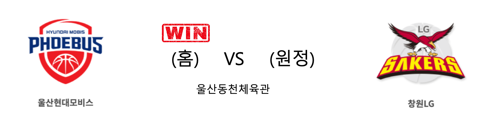
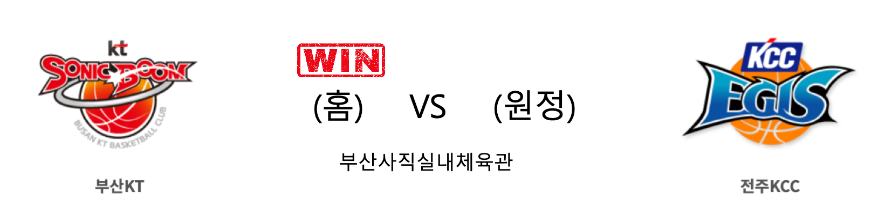

####  울산현대모비스(홈) VS 창원LG(원정) 

<table class="tg">
  <tr>
    <th class="tg-rr9t">울산현대모비스</th>
    <th class="tg-rr9t">팀</th>
    <th class="tg-rr9t">창원LG</th>
  </tr>
  <tr>
    <td class="tg-dcpn">3승 1패</td>
    <td class="tg-rr9t">시즌 상대전적</td>
    <td class="tg-dcpn">1승 3패</td>
  </tr>
  <tr>
    <td class="tg-dcpn">69</td>
    <td class="tg-rr9t">점수</td>
    <td class="tg-dcpn">63</td>
  </tr>
  <tr>
    <td class="tg-dcpn">19/33(58%)</td>
    <td class="tg-rr9t">2점(%)</td>
    <td class="tg-dcpn">11/24(46%)</td>
  </tr>
  <tr>
    <td class="tg-dcpn">8/29(28%)</td>
    <td class="tg-rr9t">3점(%)</td>
    <td class="tg-dcpn">10/25(40%)</td>
  </tr>
  <tr>
    <td class="tg-dcpn">7/12(58%)</td>
    <td class="tg-rr9t">자유투(%)</td>
    <td class="tg-dcpn">11/11(100%)</td>
  </tr>
  <tr>
    <td class="tg-dcpn">32</td>
    <td class="tg-rr9t">리바운드</td>
    <td class="tg-dcpn">28</td>
  </tr>
  <tr>
    <td class="tg-dcpn">0</td>
    <td class="tg-rr9t">어시스트</td>
    <td class="tg-dcpn">1</td>
  </tr>
  <tr>
    <td class="tg-dcpn">8</td>
    <td class="tg-rr9t">스틸</td>
    <td class="tg-dcpn">9</td>
  </tr>
  <tr>
    <td class="tg-dcpn">4</td>
    <td class="tg-rr9t">블록</td>
    <td class="tg-dcpn">4</td>
  </tr>
  <tr>
    <td class="tg-dcpn">14</td>
    <td class="tg-rr9t">턴오버</td>
    <td class="tg-dcpn">14</td>
  </tr>
  <tr>
    <td class="tg-dcpn">양동근(26)</td>
    <td class="tg-rr9t">주요 득점선수</td>
    <td class="tg-dcpn">라킴 샌더스(16)</td>
  </tr>
</table>

#### 경기 관련 주요 기사         

[[JB화보] 울산 현대모비스, 창원 LG에 69대 63으로 승리](http://sports.news.naver.com/basketball/news/read.nhn?oid=065&aid=0000196362)

['양동근 26점' 현대모비스, LG 누르고 2연패 늪 탈출](http://www.sportsseoul.com/news/read/876389)

['양동근 26점' 현대모비스, LG에 진땀승…6위권 '도전장'](http://yna.kr/AKR20200126027600007?did=1195m)

['4쿼터 폭발' KT, KCC 잡고 2연승…현대모비스 2연패 탈출](http://news1.kr/articles/?3825510)

        
        

####  부산KT(홈) VS 전주KCC(원정) 

<table class="tg">
  <tr>
    <th class="tg-rr9t">부산KT</th>
    <th class="tg-rr9t">팀</th>
    <th class="tg-rr9t">전주KCC</th>
  </tr>
  <tr>
    <td class="tg-dcpn">2승 2패</td>
    <td class="tg-rr9t">시즌 상대전적</td>
    <td class="tg-dcpn">2승 2패</td>
  </tr>
  <tr>
    <td class="tg-dcpn">88</td>
    <td class="tg-rr9t">점수</td>
    <td class="tg-dcpn">74</td>
  </tr>
  <tr>
    <td class="tg-dcpn">32/47(68%)</td>
    <td class="tg-rr9t">2점(%)</td>
    <td class="tg-dcpn">18/41(44%)</td>
  </tr>
  <tr>
    <td class="tg-dcpn">5/26(19%)</td>
    <td class="tg-rr9t">3점(%)</td>
    <td class="tg-dcpn">7/25(28%)</td>
  </tr>
  <tr>
    <td class="tg-dcpn">9/11(82%)</td>
    <td class="tg-rr9t">자유투(%)</td>
    <td class="tg-dcpn">17/18(94%)</td>
  </tr>
  <tr>
    <td class="tg-dcpn">38</td>
    <td class="tg-rr9t">리바운드</td>
    <td class="tg-dcpn">32</td>
  </tr>
  <tr>
    <td class="tg-dcpn">3</td>
    <td class="tg-rr9t">어시스트</td>
    <td class="tg-dcpn">0</td>
  </tr>
  <tr>
    <td class="tg-dcpn">7</td>
    <td class="tg-rr9t">스틸</td>
    <td class="tg-dcpn">9</td>
  </tr>
  <tr>
    <td class="tg-dcpn">6</td>
    <td class="tg-rr9t">블록</td>
    <td class="tg-dcpn">2</td>
  </tr>
  <tr>
    <td class="tg-dcpn">18</td>
    <td class="tg-rr9t">턴오버</td>
    <td class="tg-dcpn">17</td>
  </tr>
  <tr>
    <td class="tg-dcpn">허훈(20) 김영환(20) 앨런 더햄(19)</td>
    <td class="tg-rr9t">주요 득점선수</td>
    <td class="tg-dcpn">송교창(17) 라건아(31)</td>
  </tr>
</table>

#### 경기 관련 주요 기사         

[[라커룸에서] 연승 노리는 KT 서동철 감독 “치고 올라가기 위한 분수령 될 것”](http://sports.news.naver.com/basketball/news/read.nhn?oid=065&aid=0000196359)

[kt, KCC 잡고 4위권 위협…허훈 4쿼터 '지배'(종합)](http://yna.kr/AKR20200126027651007?did=1195m)

['4쿼터 폭발' KT, KCC 잡고 2연승…현대모비스 2연패 탈출](http://news1.kr/articles/?3825510)

[만날 때마다 치열했던 KT-KCC, 부산에서 격돌](http://www.basketkorea.com/news/articleView.html?idxno=191844)

        
        

#### 리그 순위

<table class="tg">
  <tr>
    <th class="tg-d14o">순위</th>
    <th class="tg-d14o">팀명</th>
    <th class="tg-d14o">경기수</th>
    <th class="tg-d14o">승</th>
    <th class="tg-d14o">패</th>
    <th class="tg-d14o">승차</th>
    <th class="tg-d14o">승률</th>
  </tr>
  
<tr>
    <td class="tg-50j8">1</td>
    <td class="tg-50j8">서울SK</td>
    <td class="tg-50j8">35</td>
    <td class="tg-50j8">22</td>
    <td class="tg-50j8">13</td>
    <td class="tg-50j8">0</td>
    <td class="tg-50j8">0.629</td>
</tr>

<tr>
    <td class="tg-50j8">1</td>
    <td class="tg-50j8">안양KGC</td>
    <td class="tg-50j8">35</td>
    <td class="tg-50j8">22</td>
    <td class="tg-50j8">13</td>
    <td class="tg-50j8">0</td>
    <td class="tg-50j8">0.629</td>
</tr>

<tr>
    <td class="tg-50j8">3</td>
    <td class="tg-50j8">원주DB</td>
    <td class="tg-50j8">34</td>
    <td class="tg-50j8">21</td>
    <td class="tg-50j8">13</td>
    <td class="tg-50j8">1</td>
    <td class="tg-50j8">0.618</td>
</tr>

<tr>
    <td class="tg-50j8">4</td>
    <td class="tg-50j8">인천전자랜드</td>
    <td class="tg-50j8">35</td>
    <td class="tg-50j8">19</td>
    <td class="tg-50j8">16</td>
    <td class="tg-50j8">3</td>
    <td class="tg-50j8">0.543</td>
</tr>

<tr>
    <td class="tg-50j8">5</td>
    <td class="tg-50j8">전주KCC</td>
    <td class="tg-50j8">36</td>
    <td class="tg-50j8">19</td>
    <td class="tg-50j8">17</td>
    <td class="tg-50j8">3</td>
    <td class="tg-50j8">0.528</td>
</tr>

<tr>
    <td class="tg-50j8">6</td>
    <td class="tg-50j8">부산KT</td>
    <td class="tg-50j8">35</td>
    <td class="tg-50j8">17</td>
    <td class="tg-50j8">18</td>
    <td class="tg-50j8">5</td>
    <td class="tg-50j8">0.486</td>
</tr>

<tr>
    <td class="tg-50j8">7</td>
    <td class="tg-50j8">울산현대모비스</td>
    <td class="tg-50j8">35</td>
    <td class="tg-50j8">16</td>
    <td class="tg-50j8">19</td>
    <td class="tg-50j8">6</td>
    <td class="tg-50j8">0.457</td>
</tr>

<tr>
    <td class="tg-50j8">8</td>
    <td class="tg-50j8">서울삼성</td>
    <td class="tg-50j8">34</td>
    <td class="tg-50j8">15</td>
    <td class="tg-50j8">19</td>
    <td class="tg-50j8">7</td>
    <td class="tg-50j8">0.441</td>
</tr>

<tr>
    <td class="tg-50j8">9</td>
    <td class="tg-50j8">창원LG</td>
    <td class="tg-50j8">36</td>
    <td class="tg-50j8">13</td>
    <td class="tg-50j8">23</td>
    <td class="tg-50j8">9</td>
    <td class="tg-50j8">0.361</td>
</tr>

<tr>
    <td class="tg-50j8">10</td>
    <td class="tg-50j8">고양오리온</td>
    <td class="tg-50j8">35</td>
    <td class="tg-50j8">11</td>
    <td class="tg-50j8">24</td>
    <td class="tg-50j8">11</td>
    <td class="tg-50j8">0.314</td>
</tr>
</table> 

        
        
#kbl #국내농구 #농구분석 #토토 #스포츠토토 #경기예측 #농구결과 #20200126 #울산현대모비스 #창원LG #부산KT #전주KCC #울산현대모비스창원LG #부산KT전주KCC 