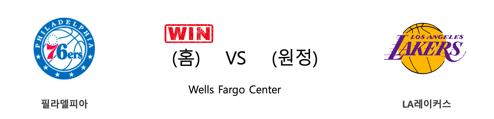
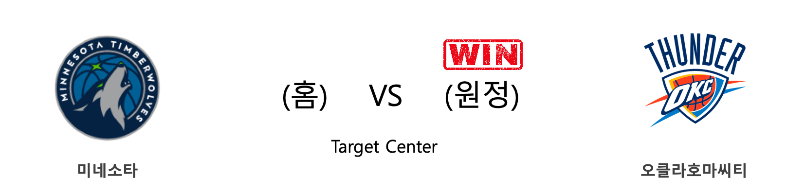
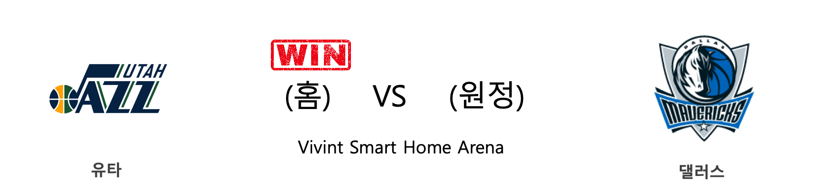
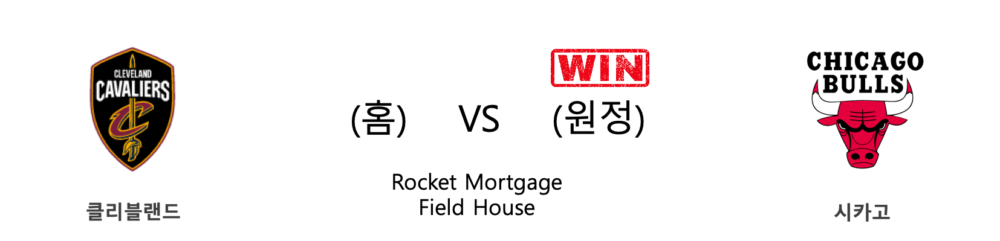

####  필라델피아(홈) VS LA레이커스(원정) 

<table class="tg">
  <tr>
    <th class="tg-rr9t">PHI</th>
    <th class="tg-rr9t">팀</th>
    <th class="tg-rr9t">LAL</th>
  </tr>
  <tr>
    <td class="tg-dcpn">1승 0패</td>
    <td class="tg-rr9t">시즌 상대전적</td>
    <td class="tg-dcpn">0승 1패</td>
  </tr>
  <tr>
    <td class="tg-dcpn">108</td>
    <td class="tg-rr9t">점수</td>
    <td class="tg-dcpn">91</td>
  </tr>
  <tr>
    <td class="tg-dcpn">28/41(68%)</td>
    <td class="tg-rr9t">2점(%)</td>
    <td class="tg-dcpn">29/45(64%)</td>
  </tr>
  <tr>
    <td class="tg-dcpn">13/37(35%)</td>
    <td class="tg-rr9t">3점(%)</td>
    <td class="tg-dcpn">6/31(19%)</td>
  </tr>
  <tr>
    <td class="tg-dcpn">13/19(68%)</td>
    <td class="tg-rr9t">자유투(%)</td>
    <td class="tg-dcpn">15/23(65%)</td>
  </tr>
  <tr>
    <td class="tg-dcpn">41</td>
    <td class="tg-rr9t">리바운드</td>
    <td class="tg-dcpn">35</td>
  </tr>
  <tr>
    <td class="tg-dcpn">19</td>
    <td class="tg-rr9t">어시스트</td>
    <td class="tg-dcpn">23</td>
  </tr>
  <tr>
    <td class="tg-dcpn">12</td>
    <td class="tg-rr9t">스틸</td>
    <td class="tg-dcpn">12</td>
  </tr>
  <tr>
    <td class="tg-dcpn">3</td>
    <td class="tg-rr9t">블록</td>
    <td class="tg-dcpn">1</td>
  </tr>
  <tr>
    <td class="tg-dcpn">21</td>
    <td class="tg-rr9t">턴오버</td>
    <td class="tg-dcpn">21</td>
  </tr>
  <tr>
    <td class="tg-dcpn">AlHorfordC(16) TobiasHarrisF(29) BenSimmonsG(28)</td>
    <td class="tg-rr9t">주요 득점선수</td>
    <td class="tg-dcpn">AnthonyDavisF(31) LeBronJamesF(29)</td>
  </tr>
</table>

#### 경기 관련 주요 기사         

[[오늘의 NBA] (1/23) 자이언 윌리엄슨의 NBA 데뷔전](http://sports.news.naver.com/basketball/news/read.nhn?oid=486&aid=0000001205)

[[오늘의 NBA] (1/21) 데미안 릴라드, 포틀랜드의 슈퍼스타](http://sports.news.naver.com/basketball/news/read.nhn?oid=486&aid=0000001203)

[르브론 대기록에도… LAL, '엠비드 없는' PHI에 대패](http://www.rookie.co.kr/news/articleView.html?idxno=38563)

[[오늘의 NBA] (1/26) 르브론 제임스의 두 번째 슬픈 언약식](http://sports.news.naver.com/basketball/news/read.nhn?oid=486&aid=0000001208)

[[오늘의 NBA] (1/24) 르브론 제임스, 코비 브라이언트를 정조준하다!](http://sports.news.naver.com/basketball/news/read.nhn?oid=486&aid=0000001206)

        
        

####  미네소타(홈) VS 오클라호마씨티(원정) 

<table class="tg">
  <tr>
    <th class="tg-rr9t">MIN</th>
    <th class="tg-rr9t">팀</th>
    <th class="tg-rr9t">OKC</th>
  </tr>
  <tr>
    <td class="tg-dcpn">0승 3패</td>
    <td class="tg-rr9t">시즌 상대전적</td>
    <td class="tg-dcpn">3승 0패</td>
  </tr>
  <tr>
    <td class="tg-dcpn">104</td>
    <td class="tg-rr9t">점수</td>
    <td class="tg-dcpn">113</td>
  </tr>
  <tr>
    <td class="tg-dcpn">28/47(60%)</td>
    <td class="tg-rr9t">2점(%)</td>
    <td class="tg-dcpn">28/56(50%)</td>
  </tr>
  <tr>
    <td class="tg-dcpn">12/43(28%)</td>
    <td class="tg-rr9t">3점(%)</td>
    <td class="tg-dcpn">11/24(46%)</td>
  </tr>
  <tr>
    <td class="tg-dcpn">12/18(67%)</td>
    <td class="tg-rr9t">자유투(%)</td>
    <td class="tg-dcpn">24/25(96%)</td>
  </tr>
  <tr>
    <td class="tg-dcpn">41</td>
    <td class="tg-rr9t">리바운드</td>
    <td class="tg-dcpn">43</td>
  </tr>
  <tr>
    <td class="tg-dcpn">33</td>
    <td class="tg-rr9t">어시스트</td>
    <td class="tg-dcpn">20</td>
  </tr>
  <tr>
    <td class="tg-dcpn">9</td>
    <td class="tg-rr9t">스틸</td>
    <td class="tg-dcpn">8</td>
  </tr>
  <tr>
    <td class="tg-dcpn">4</td>
    <td class="tg-rr9t">블록</td>
    <td class="tg-dcpn">9</td>
  </tr>
  <tr>
    <td class="tg-dcpn">13</td>
    <td class="tg-rr9t">턴오버</td>
    <td class="tg-dcpn">11</td>
  </tr>
  <tr>
    <td class="tg-dcpn">Karl-AnthonyT(37) AndrewWiggins(22)</td>
    <td class="tg-rr9t">주요 득점선수</td>
    <td class="tg-dcpn">ChrisPaulG(25) DariusBazleyF(15) DennisSchrode(26)</td>
  </tr>
</table>

#### 경기 관련 주요 기사         

[[오늘의 NBA] (1/19) 르브론 제임스, 휴스턴을 저격하다!](http://sports.news.naver.com/basketball/news/read.nhn?oid=486&aid=0000001201)

[[오늘의 NBA] (1/14) 샤이 길저스-알랙선더, 선배 러셀 웨스트브룩을 오마쥬하다](http://sports.news.naver.com/basketball/news/read.nhn?oid=486&aid=0000001196)

[[오늘의 NBA] (1/25) 러셀 웨스트브룩의 '마이 웨이'](http://sports.news.naver.com/basketball/news/read.nhn?oid=486&aid=0000001207)

[[오늘의 NBA] (1/12) 레이커스, "No LBJ, No AD, No Problem!"](http://sports.news.naver.com/basketball/news/read.nhn?oid=486&aid=0000001194)

[[오늘의 NBA] (1/23) 자이언 윌리엄슨의 NBA 데뷔전](http://sports.news.naver.com/basketball/news/read.nhn?oid=486&aid=0000001205)

        
        

####  유타(홈) VS 댈러스(원정) 

<table class="tg">
  <tr>
    <th class="tg-rr9t">UTA</th>
    <th class="tg-rr9t">팀</th>
    <th class="tg-rr9t">DAL</th>
  </tr>
  <tr>
    <td class="tg-dcpn">1승 0패</td>
    <td class="tg-rr9t">시즌 상대전적</td>
    <td class="tg-dcpn">0승 1패</td>
  </tr>
  <tr>
    <td class="tg-dcpn">112</td>
    <td class="tg-rr9t">점수</td>
    <td class="tg-dcpn">107</td>
  </tr>
  <tr>
    <td class="tg-dcpn">25/48(52%)</td>
    <td class="tg-rr9t">2점(%)</td>
    <td class="tg-dcpn">26/56(46%)</td>
  </tr>
  <tr>
    <td class="tg-dcpn">15/43(35%)</td>
    <td class="tg-rr9t">3점(%)</td>
    <td class="tg-dcpn">16/41(39%)</td>
  </tr>
  <tr>
    <td class="tg-dcpn">17/22(77%)</td>
    <td class="tg-rr9t">자유투(%)</td>
    <td class="tg-dcpn">7/13(54%)</td>
  </tr>
  <tr>
    <td class="tg-dcpn">54</td>
    <td class="tg-rr9t">리바운드</td>
    <td class="tg-dcpn">44</td>
  </tr>
  <tr>
    <td class="tg-dcpn">22</td>
    <td class="tg-rr9t">어시스트</td>
    <td class="tg-dcpn">19</td>
  </tr>
  <tr>
    <td class="tg-dcpn">5</td>
    <td class="tg-rr9t">스틸</td>
    <td class="tg-dcpn">6</td>
  </tr>
  <tr>
    <td class="tg-dcpn">6</td>
    <td class="tg-rr9t">블록</td>
    <td class="tg-dcpn">3</td>
  </tr>
  <tr>
    <td class="tg-dcpn">13</td>
    <td class="tg-rr9t">턴오버</td>
    <td class="tg-dcpn">9</td>
  </tr>
  <tr>
    <td class="tg-dcpn">RudyGobertC(22) DonovanMitche(25) BojanBogdanov(23)</td>
    <td class="tg-rr9t">주요 득점선수</td>
    <td class="tg-dcpn">SethCurryG(19) LukaDoncicG(25) KristapsPorzi(15)</td>
  </tr>
</table>

#### 경기 관련 주요 기사         

[[오늘의 NBA] (1/19) 르브론 제임스, 휴스턴을 저격하다!](http://sports.news.naver.com/basketball/news/read.nhn?oid=486&aid=0000001201)

[[오늘의 NBA] (1/22) 카와이 레너드, 승리를 부르는 사나이](http://sports.news.naver.com/basketball/news/read.nhn?oid=486&aid=0000001204)

[[오늘의 NBA] (1/11) 멤피스, 서부컨퍼런스 8위 등극](http://sports.news.naver.com/basketball/news/read.nhn?oid=486&aid=0000001193)

[[오늘의 NBA] (1/9) 그렉 포포비치 감독의 보스턴 수비 인수분해](http://sports.news.naver.com/basketball/news/read.nhn?oid=486&aid=0000001191)

[[오늘의 NBA] (1/21) 데미안 릴라드, 포틀랜드의 슈퍼스타](http://sports.news.naver.com/basketball/news/read.nhn?oid=486&aid=0000001203)

        
        

####  디트로이트(홈) VS 브루클린(원정) 

<table class="tg">
  <tr>
    <th class="tg-rr9t">DET</th>
    <th class="tg-rr9t">팀</th>
    <th class="tg-rr9t">BKN</th>
  </tr>
  <tr>
    <td class="tg-dcpn">1승 1패</td>
    <td class="tg-rr9t">시즌 상대전적</td>
    <td class="tg-dcpn">1승 1패</td>
  </tr>
  <tr>
    <td class="tg-dcpn">111</td>
    <td class="tg-rr9t">점수</td>
    <td class="tg-dcpn">121</td>
  </tr>
  <tr>
    <td class="tg-dcpn">30/69(43%)</td>
    <td class="tg-rr9t">2점(%)</td>
    <td class="tg-dcpn">27/52(52%)</td>
  </tr>
  <tr>
    <td class="tg-dcpn">13/35(37%)</td>
    <td class="tg-rr9t">3점(%)</td>
    <td class="tg-dcpn">15/42(36%)</td>
  </tr>
  <tr>
    <td class="tg-dcpn">12/18(67%)</td>
    <td class="tg-rr9t">자유투(%)</td>
    <td class="tg-dcpn">22/25(88%)</td>
  </tr>
  <tr>
    <td class="tg-dcpn">52</td>
    <td class="tg-rr9t">리바운드</td>
    <td class="tg-dcpn">55</td>
  </tr>
  <tr>
    <td class="tg-dcpn">20</td>
    <td class="tg-rr9t">어시스트</td>
    <td class="tg-dcpn">19</td>
  </tr>
  <tr>
    <td class="tg-dcpn">5</td>
    <td class="tg-rr9t">스틸</td>
    <td class="tg-dcpn">3</td>
  </tr>
  <tr>
    <td class="tg-dcpn">3</td>
    <td class="tg-rr9t">블록</td>
    <td class="tg-dcpn">5</td>
  </tr>
  <tr>
    <td class="tg-dcpn">8</td>
    <td class="tg-rr9t">턴오버</td>
    <td class="tg-dcpn">10</td>
  </tr>
  <tr>
    <td class="tg-dcpn">DerrickRoseG(27) BruceBrownG(17) AndreDrummond(20) SviMykhailiuk(19)</td>
    <td class="tg-rr9t">주요 득점선수</td>
    <td class="tg-dcpn">KyrieIrvingG(45) JoeHarrisF(16) JarrettAllenC(20)</td>
  </tr>
</table>

#### 경기 관련 주요 기사         

[[오늘의 NBA] (1/10) PHI vs BOS, 먹이사슬의 역전!](http://sports.news.naver.com/basketball/news/read.nhn?oid=486&aid=0000001192)

[[오늘의 NBA] (1/26) 르브론 제임스의 두 번째 슬픈 언약식](http://sports.news.naver.com/basketball/news/read.nhn?oid=486&aid=0000001208)

[[오늘의 NBA] (1/6) 몬트레즐 해럴, 클리퍼스의 희소재](http://sports.news.naver.com/basketball/news/read.nhn?oid=486&aid=0000001188)

[[오늘의 NBA] (12/29) 마이애미, 연장전 승부 전문가](http://sports.news.naver.com/basketball/news/read.nhn?oid=486&aid=0000001180)

[[오늘의 NBA] (1/17) 브랜든 잉그램 vs 도노반 미첼, 1월의 명승부](http://sports.news.naver.com/basketball/news/read.nhn?oid=486&aid=0000001199)

        
        

####  클리블랜드(홈) VS 시카고(원정) 

<table class="tg">
  <tr>
    <th class="tg-rr9t">CLE</th>
    <th class="tg-rr9t">팀</th>
    <th class="tg-rr9t">CHI</th>
  </tr>
  <tr>
    <td class="tg-dcpn">1승 2패</td>
    <td class="tg-rr9t">시즌 상대전적</td>
    <td class="tg-dcpn">2승 1패</td>
  </tr>
  <tr>
    <td class="tg-dcpn">106</td>
    <td class="tg-rr9t">점수</td>
    <td class="tg-dcpn">118</td>
  </tr>
  <tr>
    <td class="tg-dcpn">29/54(54%)</td>
    <td class="tg-rr9t">2점(%)</td>
    <td class="tg-dcpn">32/52(62%)</td>
  </tr>
  <tr>
    <td class="tg-dcpn">13/30(43%)</td>
    <td class="tg-rr9t">3점(%)</td>
    <td class="tg-dcpn">12/33(36%)</td>
  </tr>
  <tr>
    <td class="tg-dcpn">9/11(82%)</td>
    <td class="tg-rr9t">자유투(%)</td>
    <td class="tg-dcpn">18/24(75%)</td>
  </tr>
  <tr>
    <td class="tg-dcpn">43</td>
    <td class="tg-rr9t">리바운드</td>
    <td class="tg-dcpn">36</td>
  </tr>
  <tr>
    <td class="tg-dcpn">30</td>
    <td class="tg-rr9t">어시스트</td>
    <td class="tg-dcpn">24</td>
  </tr>
  <tr>
    <td class="tg-dcpn">5</td>
    <td class="tg-rr9t">스틸</td>
    <td class="tg-dcpn">15</td>
  </tr>
  <tr>
    <td class="tg-dcpn">1</td>
    <td class="tg-rr9t">블록</td>
    <td class="tg-dcpn">2</td>
  </tr>
  <tr>
    <td class="tg-dcpn">21</td>
    <td class="tg-rr9t">턴오버</td>
    <td class="tg-dcpn">9</td>
  </tr>
  <tr>
    <td class="tg-dcpn">KevinLoveF(20) LarryNanceJr.(15) CollinSextonG(18) CediOsmanF(18)</td>
    <td class="tg-rr9t">주요 득점선수</td>
    <td class="tg-dcpn">ZachLaVineG(44) TomasSatorans(19)</td>
  </tr>
</table>

#### 경기 관련 주요 기사         

[[오늘의 NBA] (1/26) 르브론 제임스의 두 번째 슬픈 언약식](http://sports.news.naver.com/basketball/news/read.nhn?oid=486&aid=0000001208)

[[오늘의 NBA] (1/19) 르브론 제임스, 휴스턴을 저격하다!](http://sports.news.naver.com/basketball/news/read.nhn?oid=486&aid=0000001201)

[[오늘의 NBA] (1/21) 데미안 릴라드, 포틀랜드의 슈퍼스타](http://sports.news.naver.com/basketball/news/read.nhn?oid=486&aid=0000001203)

[[오늘의 NBA] (1/12) 레이커스, "No LBJ, No AD, No Problem!"](http://sports.news.naver.com/basketball/news/read.nhn?oid=486&aid=0000001194)

[[오늘의 NBA] (1/24) 르브론 제임스, 코비 브라이언트를 정조준하다!](http://sports.news.naver.com/basketball/news/read.nhn?oid=486&aid=0000001206)

        
        

#### 리그 (Eastern) 순위
    

<table class="tg">
  <tr>
    <th class="tg-d14o">순위</th>
    <th class="tg-d14o">팀명</th>
    <th class="tg-d14o">경기수</th>
    <th class="tg-d14o">승</th>
    <th class="tg-d14o">패</th>
    <th class="tg-d14o">승차</th>
    <th class="tg-d14o">승률</th>
  </tr>
  
<tr>
    <td class="tg-50j8">1</td>
    <td class="tg-50j8">MIL</td>
    <td class="tg-50j8">44</td>
    <td class="tg-50j8">38</td>
    <td class="tg-50j8">6</td>
    <td class="tg-50j8">0</td>
    <td class="tg-50j8">0.864</td>
</tr>

<tr>
    <td class="tg-50j8">2</td>
    <td class="tg-50j8">MIA</td>
    <td class="tg-50j8">44</td>
    <td class="tg-50j8">31</td>
    <td class="tg-50j8">13</td>
    <td class="tg-50j8">7</td>
    <td class="tg-50j8">0.705</td>
</tr>

<tr>
    <td class="tg-50j8">3</td>
    <td class="tg-50j8">TOR</td>
    <td class="tg-50j8">45</td>
    <td class="tg-50j8">31</td>
    <td class="tg-50j8">14</td>
    <td class="tg-50j8">7</td>
    <td class="tg-50j8">0.689</td>
</tr>

<tr>
    <td class="tg-50j8">4</td>
    <td class="tg-50j8">IND</td>
    <td class="tg-50j8">46</td>
    <td class="tg-50j8">30</td>
    <td class="tg-50j8">16</td>
    <td class="tg-50j8">8</td>
    <td class="tg-50j8">0.652</td>
</tr>

<tr>
    <td class="tg-50j8">5</td>
    <td class="tg-50j8">BOS</td>
    <td class="tg-50j8">42</td>
    <td class="tg-50j8">29</td>
    <td class="tg-50j8">13</td>
    <td class="tg-50j8">9</td>
    <td class="tg-50j8">0.69</td>
</tr>

<tr>
    <td class="tg-50j8">6</td>
    <td class="tg-50j8">PHI</td>
    <td class="tg-50j8">45</td>
    <td class="tg-50j8">29</td>
    <td class="tg-50j8">16</td>
    <td class="tg-50j8">9</td>
    <td class="tg-50j8">0.644</td>
</tr>

<tr>
    <td class="tg-50j8">7</td>
    <td class="tg-50j8">ORL</td>
    <td class="tg-50j8">45</td>
    <td class="tg-50j8">21</td>
    <td class="tg-50j8">24</td>
    <td class="tg-50j8">17</td>
    <td class="tg-50j8">0.467</td>
</tr>

<tr>
    <td class="tg-50j8">8</td>
    <td class="tg-50j8">BKN</td>
    <td class="tg-50j8">43</td>
    <td class="tg-50j8">19</td>
    <td class="tg-50j8">24</td>
    <td class="tg-50j8">19</td>
    <td class="tg-50j8">0.442</td>
</tr>

<tr>
    <td class="tg-50j8">9</td>
    <td class="tg-50j8">DET</td>
    <td class="tg-50j8">44</td>
    <td class="tg-50j8">17</td>
    <td class="tg-50j8">27</td>
    <td class="tg-50j8">21</td>
    <td class="tg-50j8">0.386</td>
</tr>

<tr>
    <td class="tg-50j8">10</td>
    <td class="tg-50j8">CHI</td>
    <td class="tg-50j8">46</td>
    <td class="tg-50j8">17</td>
    <td class="tg-50j8">29</td>
    <td class="tg-50j8">21</td>
    <td class="tg-50j8">0.37</td>
</tr>

<tr>
    <td class="tg-50j8">11</td>
    <td class="tg-50j8">CHA</td>
    <td class="tg-50j8">46</td>
    <td class="tg-50j8">15</td>
    <td class="tg-50j8">31</td>
    <td class="tg-50j8">23</td>
    <td class="tg-50j8">0.326</td>
</tr>

<tr>
    <td class="tg-50j8">12</td>
    <td class="tg-50j8">WAS</td>
    <td class="tg-50j8">43</td>
    <td class="tg-50j8">14</td>
    <td class="tg-50j8">29</td>
    <td class="tg-50j8">24</td>
    <td class="tg-50j8">0.326</td>
</tr>

<tr>
    <td class="tg-50j8">13</td>
    <td class="tg-50j8">NYK</td>
    <td class="tg-50j8">46</td>
    <td class="tg-50j8">12</td>
    <td class="tg-50j8">34</td>
    <td class="tg-50j8">26</td>
    <td class="tg-50j8">0.261</td>
</tr>

<tr>
    <td class="tg-50j8">14</td>
    <td class="tg-50j8">CLE</td>
    <td class="tg-50j8">44</td>
    <td class="tg-50j8">10</td>
    <td class="tg-50j8">34</td>
    <td class="tg-50j8">28</td>
    <td class="tg-50j8">0.227</td>
</tr>

<tr>
    <td class="tg-50j8">15</td>
    <td class="tg-50j8">ATL</td>
    <td class="tg-50j8">45</td>
    <td class="tg-50j8">10</td>
    <td class="tg-50j8">35</td>
    <td class="tg-50j8">28</td>
    <td class="tg-50j8">0.222</td>
</tr>
</table> 
#### 리그 (Western) 순위
    

<table class="tg">
  <tr>
    <th class="tg-d14o">순위</th>
    <th class="tg-d14o">팀명</th>
    <th class="tg-d14o">경기수</th>
    <th class="tg-d14o">승</th>
    <th class="tg-d14o">패</th>
    <th class="tg-d14o">승차</th>
    <th class="tg-d14o">승률</th>
  </tr>
  
<tr>
    <td class="tg-50j8">1</td>
    <td class="tg-50j8">LAL</td>
    <td class="tg-50j8">45</td>
    <td class="tg-50j8">35</td>
    <td class="tg-50j8">10</td>
    <td class="tg-50j8">3</td>
    <td class="tg-50j8">0.778</td>
</tr>

<tr>
    <td class="tg-50j8">2</td>
    <td class="tg-50j8">LAC</td>
    <td class="tg-50j8">46</td>
    <td class="tg-50j8">32</td>
    <td class="tg-50j8">14</td>
    <td class="tg-50j8">6</td>
    <td class="tg-50j8">0.696</td>
</tr>

<tr>
    <td class="tg-50j8">3</td>
    <td class="tg-50j8">UTA</td>
    <td class="tg-50j8">44</td>
    <td class="tg-50j8">31</td>
    <td class="tg-50j8">13</td>
    <td class="tg-50j8">7</td>
    <td class="tg-50j8">0.705</td>
</tr>

<tr>
    <td class="tg-50j8">4</td>
    <td class="tg-50j8">DEN</td>
    <td class="tg-50j8">43</td>
    <td class="tg-50j8">30</td>
    <td class="tg-50j8">13</td>
    <td class="tg-50j8">8</td>
    <td class="tg-50j8">0.698</td>
</tr>

<tr>
    <td class="tg-50j8">5</td>
    <td class="tg-50j8">OKC</td>
    <td class="tg-50j8">46</td>
    <td class="tg-50j8">28</td>
    <td class="tg-50j8">18</td>
    <td class="tg-50j8">10</td>
    <td class="tg-50j8">0.609</td>
</tr>

<tr>
    <td class="tg-50j8">6</td>
    <td class="tg-50j8">HOU</td>
    <td class="tg-50j8">43</td>
    <td class="tg-50j8">27</td>
    <td class="tg-50j8">16</td>
    <td class="tg-50j8">11</td>
    <td class="tg-50j8">0.628</td>
</tr>

<tr>
    <td class="tg-50j8">7</td>
    <td class="tg-50j8">DAL</td>
    <td class="tg-50j8">43</td>
    <td class="tg-50j8">26</td>
    <td class="tg-50j8">17</td>
    <td class="tg-50j8">12</td>
    <td class="tg-50j8">0.605</td>
</tr>

<tr>
    <td class="tg-50j8">8</td>
    <td class="tg-50j8">MEM</td>
    <td class="tg-50j8">45</td>
    <td class="tg-50j8">21</td>
    <td class="tg-50j8">24</td>
    <td class="tg-50j8">17</td>
    <td class="tg-50j8">0.467</td>
</tr>

<tr>
    <td class="tg-50j8">9</td>
    <td class="tg-50j8">SAS</td>
    <td class="tg-50j8">43</td>
    <td class="tg-50j8">20</td>
    <td class="tg-50j8">23</td>
    <td class="tg-50j8">18</td>
    <td class="tg-50j8">0.465</td>
</tr>

<tr>
    <td class="tg-50j8">10</td>
    <td class="tg-50j8">POR</td>
    <td class="tg-50j8">43</td>
    <td class="tg-50j8">19</td>
    <td class="tg-50j8">24</td>
    <td class="tg-50j8">19</td>
    <td class="tg-50j8">0.442</td>
</tr>

<tr>
    <td class="tg-50j8">11</td>
    <td class="tg-50j8">PHX</td>
    <td class="tg-50j8">44</td>
    <td class="tg-50j8">18</td>
    <td class="tg-50j8">26</td>
    <td class="tg-50j8">20</td>
    <td class="tg-50j8">0.409</td>
</tr>

<tr>
    <td class="tg-50j8">12</td>
    <td class="tg-50j8">NOP</td>
    <td class="tg-50j8">45</td>
    <td class="tg-50j8">17</td>
    <td class="tg-50j8">28</td>
    <td class="tg-50j8">21</td>
    <td class="tg-50j8">0.378</td>
</tr>

<tr>
    <td class="tg-50j8">13</td>
    <td class="tg-50j8">SAC</td>
    <td class="tg-50j8">45</td>
    <td class="tg-50j8">16</td>
    <td class="tg-50j8">29</td>
    <td class="tg-50j8">22</td>
    <td class="tg-50j8">0.356</td>
</tr>

<tr>
    <td class="tg-50j8">14</td>
    <td class="tg-50j8">MIN</td>
    <td class="tg-50j8">44</td>
    <td class="tg-50j8">14</td>
    <td class="tg-50j8">30</td>
    <td class="tg-50j8">24</td>
    <td class="tg-50j8">0.318</td>
</tr>

<tr>
    <td class="tg-50j8">15</td>
    <td class="tg-50j8">GSW</td>
    <td class="tg-50j8">47</td>
    <td class="tg-50j8">10</td>
    <td class="tg-50j8">37</td>
    <td class="tg-50j8">28</td>
    <td class="tg-50j8">0.213</td>
</tr>
</table> 

        
        
#nba #미국농구 #엔비에이 #농구분석 #토토 #스포츠토토 #경기예측 #농구결과 #20200126 #필라델피아 #LA레이커스 #미네소타 #오클라호마씨티 #유타 #댈러스 #디트로이트 #브루클린 #클리블랜드 #시카고 #필라델피아LA레이커스 #미네소타오클라호마씨티 #유타댈러스 #디트로이트브루클린 #클리블랜드시카고 