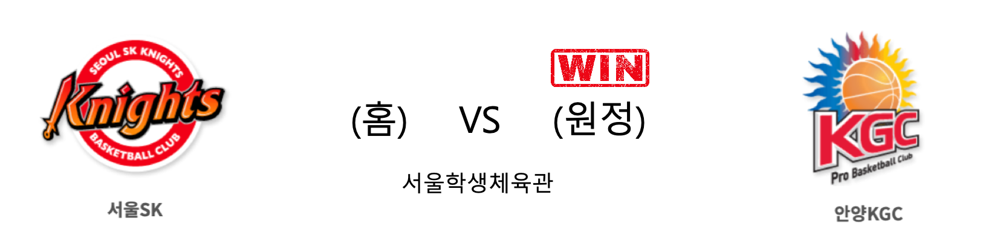

####  원주DB(홈) VS 서울삼성(원정) 

<table class="tg">
  <tr>
    <th class="tg-rr9t">원주DB</th>
    <th class="tg-rr9t">팀</th>
    <th class="tg-rr9t">서울삼성</th>
  </tr>
  <tr>
    <td class="tg-dcpn">2승 2패</td>
    <td class="tg-rr9t">시즌 상대전적</td>
    <td class="tg-dcpn">2승 2패</td>
  </tr>
  <tr>
    <td class="tg-dcpn">88</td>
    <td class="tg-rr9t">점수</td>
    <td class="tg-dcpn">69</td>
  </tr>
  <tr>
    <td class="tg-dcpn">28/51(55%)</td>
    <td class="tg-rr9t">2점(%)</td>
    <td class="tg-dcpn">21/38(55%)</td>
  </tr>
  <tr>
    <td class="tg-dcpn">7/23(30%)</td>
    <td class="tg-rr9t">3점(%)</td>
    <td class="tg-dcpn">6/27(22%)</td>
  </tr>
  <tr>
    <td class="tg-dcpn">11/12(92%)</td>
    <td class="tg-rr9t">자유투(%)</td>
    <td class="tg-dcpn">9/13(69%)</td>
  </tr>
  <tr>
    <td class="tg-dcpn">32</td>
    <td class="tg-rr9t">리바운드</td>
    <td class="tg-dcpn">42</td>
  </tr>
  <tr>
    <td class="tg-dcpn">7</td>
    <td class="tg-rr9t">어시스트</td>
    <td class="tg-dcpn">3</td>
  </tr>
  <tr>
    <td class="tg-dcpn">8</td>
    <td class="tg-rr9t">스틸</td>
    <td class="tg-dcpn">20</td>
  </tr>
  <tr>
    <td class="tg-dcpn">12</td>
    <td class="tg-rr9t">블록</td>
    <td class="tg-dcpn">2</td>
  </tr>
  <tr>
    <td class="tg-dcpn">23</td>
    <td class="tg-rr9t">턴오버</td>
    <td class="tg-dcpn">16</td>
  </tr>
  <tr>
    <td class="tg-dcpn">치나누 오누아쿠(26)</td>
    <td class="tg-rr9t">주요 득점선수</td>
    <td class="tg-dcpn">닉 미네라스(21)</td>
  </tr>
</table>

#### 경기 관련 주요 기사         

[[BK Review] '우리를 누가 막으랴' DB, 삼성 꺾고 8연승 질주...선두 KGC 반 경기 차 추격](http://www.basketkorea.com/news/articleView.html?idxno=191865)

[[JB화보] DB, 삼성에 88-69로 승리](http://sports.news.naver.com/basketball/news/read.nhn?oid=065&aid=0000196420)

[원주 DB, 팬들 향해 큰절](http://yna.kr/PYH20200127115100062?did=1196m)

[DB, 삼성 완파하고 파죽의 8연승…선두 KGC와 0.5경기 차](http://news1.kr/articles/?3825974)

        
        

####  서울SK(홈) VS 안양KGC(원정) 

<table class="tg">
  <tr>
    <th class="tg-rr9t">서울SK</th>
    <th class="tg-rr9t">팀</th>
    <th class="tg-rr9t">안양KGC</th>
  </tr>
  <tr>
    <td class="tg-dcpn">2승 2패</td>
    <td class="tg-rr9t">시즌 상대전적</td>
    <td class="tg-dcpn">2승 2패</td>
  </tr>
  <tr>
    <td class="tg-dcpn">70</td>
    <td class="tg-rr9t">점수</td>
    <td class="tg-dcpn">76</td>
  </tr>
  <tr>
    <td class="tg-dcpn">25/41(61%)</td>
    <td class="tg-rr9t">2점(%)</td>
    <td class="tg-dcpn">18/36(50%)</td>
  </tr>
  <tr>
    <td class="tg-dcpn">3/22(14%)</td>
    <td class="tg-rr9t">3점(%)</td>
    <td class="tg-dcpn">11/36(31%)</td>
  </tr>
  <tr>
    <td class="tg-dcpn">11/16(69%)</td>
    <td class="tg-rr9t">자유투(%)</td>
    <td class="tg-dcpn">7/11(64%)</td>
  </tr>
  <tr>
    <td class="tg-dcpn">44</td>
    <td class="tg-rr9t">리바운드</td>
    <td class="tg-dcpn">36</td>
  </tr>
  <tr>
    <td class="tg-dcpn">1</td>
    <td class="tg-rr9t">어시스트</td>
    <td class="tg-dcpn">1</td>
  </tr>
  <tr>
    <td class="tg-dcpn">13</td>
    <td class="tg-rr9t">스틸</td>
    <td class="tg-dcpn">6</td>
  </tr>
  <tr>
    <td class="tg-dcpn">5</td>
    <td class="tg-rr9t">블록</td>
    <td class="tg-dcpn">12</td>
  </tr>
  <tr>
    <td class="tg-dcpn">19</td>
    <td class="tg-rr9t">턴오버</td>
    <td class="tg-dcpn">13</td>
  </tr>
  <tr>
    <td class="tg-dcpn">자밀 워니(29)</td>
    <td class="tg-rr9t">주요 득점선수</td>
    <td class="tg-dcpn">브랜든 브라운(40)</td>
  </tr>
</table>

#### 경기 관련 주요 기사         

[안양KGC의 승리](http://yna.kr/PYH20200127101000013?did=1196m)

[[프로농구전망대] 치열해진 선두 다툼…DB, 주말 SK-인삼공사와 연전](http://yna.kr/AKR20200128070300007?did=1195m)

[KBL, 상대 가격한 SK 전태풍에 대한 재정위원회 개최](http://sports.donga.com/3/all/20200128/99429263/2)

[KGC, DB, SK 우승 경쟁 3파전 구도 최종 승자는?](http://sports.khan.co.kr/news/sk_index.html?art_id=202001281655003&sec_id=530301&pt=nv)

        
        

####  인천전자랜드(홈) VS 고양오리온(원정) 

<table class="tg">
  <tr>
    <th class="tg-rr9t">인천전자랜드</th>
    <th class="tg-rr9t">팀</th>
    <th class="tg-rr9t">고양오리온</th>
  </tr>
  <tr>
    <td class="tg-dcpn">3승 1패</td>
    <td class="tg-rr9t">시즌 상대전적</td>
    <td class="tg-dcpn">1승 3패</td>
  </tr>
  <tr>
    <td class="tg-dcpn">63</td>
    <td class="tg-rr9t">점수</td>
    <td class="tg-dcpn">74</td>
  </tr>
  <tr>
    <td class="tg-dcpn">16/32(50%)</td>
    <td class="tg-rr9t">2점(%)</td>
    <td class="tg-dcpn">21/48(44%)</td>
  </tr>
  <tr>
    <td class="tg-dcpn">6/27(22%)</td>
    <td class="tg-rr9t">3점(%)</td>
    <td class="tg-dcpn">6/12(50%)</td>
  </tr>
  <tr>
    <td class="tg-dcpn">13/21(62%)</td>
    <td class="tg-rr9t">자유투(%)</td>
    <td class="tg-dcpn">14/20(70%)</td>
  </tr>
  <tr>
    <td class="tg-dcpn">25</td>
    <td class="tg-rr9t">리바운드</td>
    <td class="tg-dcpn">47</td>
  </tr>
  <tr>
    <td class="tg-dcpn">1</td>
    <td class="tg-rr9t">어시스트</td>
    <td class="tg-dcpn">1</td>
  </tr>
  <tr>
    <td class="tg-dcpn">10</td>
    <td class="tg-rr9t">스틸</td>
    <td class="tg-dcpn">16</td>
  </tr>
  <tr>
    <td class="tg-dcpn">6</td>
    <td class="tg-rr9t">블록</td>
    <td class="tg-dcpn">5</td>
  </tr>
  <tr>
    <td class="tg-dcpn">15</td>
    <td class="tg-rr9t">턴오버</td>
    <td class="tg-dcpn">22</td>
  </tr>
  <tr>
    <td class="tg-dcpn">트로이 길렌워터(20)</td>
    <td class="tg-rr9t">주요 득점선수</td>
    <td class="tg-dcpn">보리스 사보비치(25)</td>
  </tr>
</table>

#### 경기 관련 주요 기사         

[오리온의 인천상륙 작전명: '창' 사보비치 & '방패' 유터](http://sports.news.naver.com/basketball/news/read.nhn?oid=065&aid=0000196431)

[[BK Review] '사보비치 맹활약' 오리온, 전자랜드 꺾고 연패 탈출… 전 구단 상대 승리](http://www.basketkorea.com/news/articleView.html?idxno=191864)

[연휴의 마지막을 승리로 장식하는 고양 오리온](http://yna.kr/PYH20200127115400065?did=1196m)

[[JB화보] 고양 오리온, 인천 전자랜드에 74-63으로 승리하며 2연패를 탈출](http://sports.news.naver.com/basketball/news/read.nhn?oid=065&aid=0000196426)

        
        

#### 리그 순위

<table class="tg">
  <tr>
    <th class="tg-d14o">순위</th>
    <th class="tg-d14o">팀명</th>
    <th class="tg-d14o">경기수</th>
    <th class="tg-d14o">승</th>
    <th class="tg-d14o">패</th>
    <th class="tg-d14o">승차</th>
    <th class="tg-d14o">승률</th>
  </tr>
  
<tr>
    <td class="tg-50j8">1</td>
    <td class="tg-50j8">안양KGC</td>
    <td class="tg-50j8">36</td>
    <td class="tg-50j8">23</td>
    <td class="tg-50j8">13</td>
    <td class="tg-50j8">0</td>
    <td class="tg-50j8">0.639</td>
</tr>

<tr>
    <td class="tg-50j8">2</td>
    <td class="tg-50j8">원주DB</td>
    <td class="tg-50j8">35</td>
    <td class="tg-50j8">22</td>
    <td class="tg-50j8">13</td>
    <td class="tg-50j8">1</td>
    <td class="tg-50j8">0.629</td>
</tr>

<tr>
    <td class="tg-50j8">3</td>
    <td class="tg-50j8">서울SK</td>
    <td class="tg-50j8">36</td>
    <td class="tg-50j8">22</td>
    <td class="tg-50j8">14</td>
    <td class="tg-50j8">1</td>
    <td class="tg-50j8">0.611</td>
</tr>

<tr>
    <td class="tg-50j8">4</td>
    <td class="tg-50j8">인천전자랜드</td>
    <td class="tg-50j8">36</td>
    <td class="tg-50j8">19</td>
    <td class="tg-50j8">17</td>
    <td class="tg-50j8">4</td>
    <td class="tg-50j8">0.528</td>
</tr>

<tr>
    <td class="tg-50j8">4</td>
    <td class="tg-50j8">전주KCC</td>
    <td class="tg-50j8">36</td>
    <td class="tg-50j8">19</td>
    <td class="tg-50j8">17</td>
    <td class="tg-50j8">4</td>
    <td class="tg-50j8">0.528</td>
</tr>

<tr>
    <td class="tg-50j8">6</td>
    <td class="tg-50j8">부산KT</td>
    <td class="tg-50j8">35</td>
    <td class="tg-50j8">17</td>
    <td class="tg-50j8">18</td>
    <td class="tg-50j8">6</td>
    <td class="tg-50j8">0.486</td>
</tr>

<tr>
    <td class="tg-50j8">7</td>
    <td class="tg-50j8">울산현대모비스</td>
    <td class="tg-50j8">35</td>
    <td class="tg-50j8">16</td>
    <td class="tg-50j8">19</td>
    <td class="tg-50j8">7</td>
    <td class="tg-50j8">0.457</td>
</tr>

<tr>
    <td class="tg-50j8">8</td>
    <td class="tg-50j8">서울삼성</td>
    <td class="tg-50j8">35</td>
    <td class="tg-50j8">15</td>
    <td class="tg-50j8">20</td>
    <td class="tg-50j8">8</td>
    <td class="tg-50j8">0.429</td>
</tr>

<tr>
    <td class="tg-50j8">9</td>
    <td class="tg-50j8">창원LG</td>
    <td class="tg-50j8">36</td>
    <td class="tg-50j8">13</td>
    <td class="tg-50j8">23</td>
    <td class="tg-50j8">10</td>
    <td class="tg-50j8">0.361</td>
</tr>

<tr>
    <td class="tg-50j8">10</td>
    <td class="tg-50j8">고양오리온</td>
    <td class="tg-50j8">36</td>
    <td class="tg-50j8">12</td>
    <td class="tg-50j8">24</td>
    <td class="tg-50j8">11</td>
    <td class="tg-50j8">0.333</td>
</tr>
</table> 

        
        
#kbl #국내농구 #농구분석 #토토 #스포츠토토 #경기예측 #농구결과 #20200127 #원주DB #서울삼성 #서울SK #안양KGC #인천전자랜드 #고양오리온 #원주DB서울삼성 #서울SK안양KGC #인천전자랜드고양오리온 